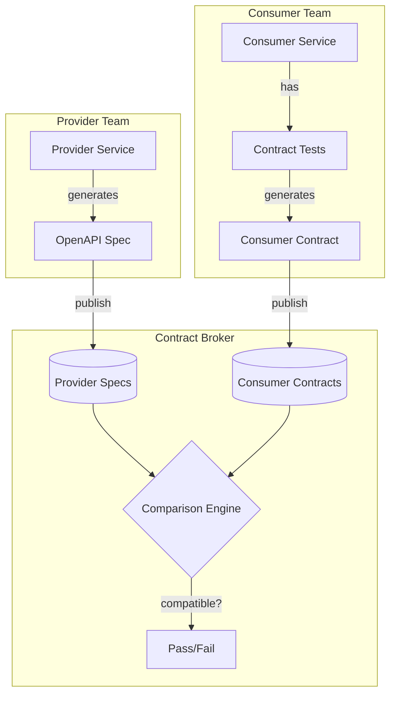
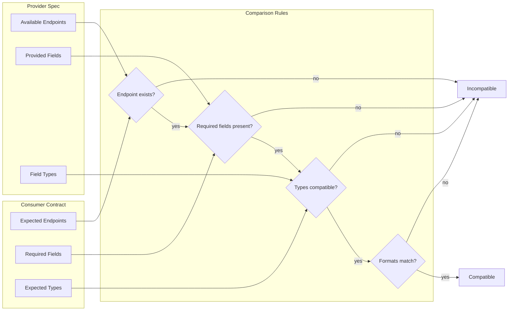
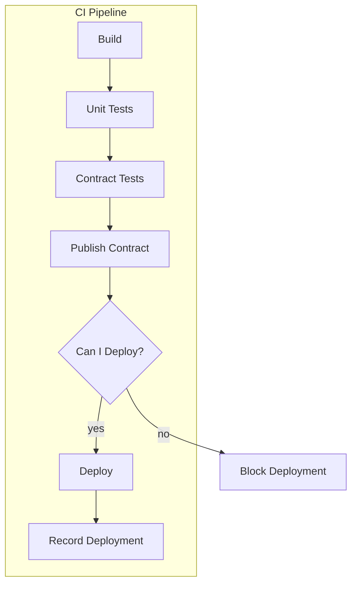

# How to Build Bi-Directional Contract Testing

Author: [nawazdhandala](https://github.com/nawazdhandala)

Tags: Testing, ContractTesting, API, Compatibility

Description: Learn how bi-directional contract testing ensures API compatibility between services without requiring direct coordination between teams.

---

Contract testing ensures that services can communicate correctly by verifying that both sides agree on the API structure. While consumer-driven contract testing has been popular, bi-directional contract testing offers a more flexible approach that works better for large organizations with many services.

## Consumer-Driven vs Bi-Directional Contract Testing

Traditional consumer-driven contract testing puts consumers in control. The consumer writes tests defining what they expect from the provider, and the provider must satisfy those expectations. This works well for small teams but creates friction at scale.

| Aspect | Consumer-Driven | Bi-Directional |
|--------|-----------------|----------------|
| **Who drives contracts** | Consumer teams | Both teams independently |
| **Provider involvement** | Must run consumer tests | Publishes spec only |
| **Coordination needed** | High | Low |
| **Scaling** | Gets harder with more consumers | Stays manageable |
| **Breaking change detection** | Provider runs consumer tests | Central comparison |

Bi-directional contract testing takes a different approach. Both consumers and providers publish their understanding of the API independently. A central broker compares these specifications to detect incompatibilities.

## How Bi-Directional Contract Testing Works

The core idea is simple: instead of consumers telling providers what to do, both sides publish their API understanding to a central broker. The broker compares them and flags mismatches.



This flow shows the key difference from consumer-driven testing. The provider never needs to run consumer tests. They simply publish their OpenAPI specification, and the broker handles the comparison.

## Publishing Provider Specifications

Providers publish their API specification to the contract broker. This can be an OpenAPI spec generated from code or maintained separately. The important thing is that it accurately represents what the provider actually does.

```yaml
# provider-api.yaml
# This OpenAPI spec describes what the Order Service actually provides
openapi: 3.0.3
info:
  title: Order Service API
  version: 1.2.0
paths:
  /orders:
    post:
      summary: Create a new order
      operationId: createOrder
      requestBody:
        required: true
        content:
          application/json:
            schema:
              $ref: '#/components/schemas/CreateOrderRequest'
      responses:
        '201':
          description: Order created successfully
          content:
            application/json:
              schema:
                $ref: '#/components/schemas/Order'
        '400':
          description: Invalid request
          content:
            application/json:
              schema:
                $ref: '#/components/schemas/Error'

  /orders/{orderId}:
    get:
      summary: Get order by ID
      operationId: getOrder
      parameters:
        - name: orderId
          in: path
          required: true
          schema:
            type: string
            format: uuid
      responses:
        '200':
          description: Order details
          content:
            application/json:
              schema:
                $ref: '#/components/schemas/Order'
        '404':
          description: Order not found

components:
  schemas:
    CreateOrderRequest:
      type: object
      required:
        - customerId
        - items
      properties:
        customerId:
          type: string
          format: uuid
        items:
          type: array
          minItems: 1
          items:
            $ref: '#/components/schemas/OrderItem'
        notes:
          type: string
          maxLength: 500

    OrderItem:
      type: object
      required:
        - productId
        - quantity
      properties:
        productId:
          type: string
        quantity:
          type: integer
          minimum: 1

    Order:
      type: object
      properties:
        id:
          type: string
          format: uuid
        customerId:
          type: string
          format: uuid
        items:
          type: array
          items:
            $ref: '#/components/schemas/OrderItem'
        status:
          type: string
          enum: [pending, confirmed, shipped, delivered, cancelled]
        totalAmount:
          type: number
          format: float
        createdAt:
          type: string
          format: date-time

    Error:
      type: object
      properties:
        code:
          type: string
        message:
          type: string
```

Publishing to Pact Broker (the most popular contract broker):

```bash
# Publish provider spec to Pact Broker
# The provider version should match your deployment version
pact-broker publish-provider-contract \
  provider-api.yaml \
  --provider "OrderService" \
  --provider-app-version "1.2.0" \
  --branch "main" \
  --content-type "application/yaml" \
  --broker-base-url https://your-pact-broker.example.com \
  --broker-token $PACT_BROKER_TOKEN
```

## Generating Consumer Contracts

Consumers generate contracts from their actual API usage. This happens through tests that exercise the client code. The key is that these tests reflect real usage patterns, not hypothetical ones.

```javascript
// consumer-contract.test.js
// These tests generate a contract describing what the consumer expects
const { PactV3, MatchersV3 } = require('@pact-foundation/pact');
const { OrderClient } = require('../src/order-client');

const { like, eachLike, uuid, iso8601DateTimeWithMillis } = MatchersV3;

// Create a new Pact instance for this consumer-provider pair
const provider = new PactV3({
  consumer: 'PaymentService',        // Name of the consumer
  provider: 'OrderService',          // Name of the provider
  logLevel: 'warn',
});

describe('Order Service Contract', () => {
  // Test that defines what we expect when creating an order
  it('creates an order successfully', async () => {
    // Define the expected interaction
    await provider
      .given('a valid customer exists')  // Provider state for test setup
      .uponReceiving('a request to create an order')
      .withRequest({
        method: 'POST',
        path: '/orders',
        headers: {
          'Content-Type': 'application/json',
        },
        body: {
          customerId: uuid('f47ac10b-58cc-4372-a567-0e02b2c3d479'),
          items: eachLike({
            productId: like('PROD-001'),
            quantity: like(2),
          }),
        },
      })
      .willRespondWith({
        status: 201,
        headers: {
          'Content-Type': 'application/json',
        },
        body: {
          // Use matchers to allow flexibility in actual values
          id: uuid(),                     // Any valid UUID
          customerId: uuid(),             // Any valid UUID
          items: eachLike({               // Array with at least one item
            productId: like('PROD-001'),
            quantity: like(2),
          }),
          status: like('pending'),        // Any string matching this shape
          totalAmount: like(99.99),       // Any number
          createdAt: iso8601DateTimeWithMillis(),  // Valid ISO timestamp
        },
      });

    // Execute the test against the mock provider
    await provider.executeTest(async (mockServer) => {
      // Create client pointing to mock server
      const client = new OrderClient(mockServer.url);

      // Make the actual call our code would make
      const order = await client.createOrder({
        customerId: 'f47ac10b-58cc-4372-a567-0e02b2c3d479',
        items: [{ productId: 'PROD-001', quantity: 2 }],
      });

      // Verify our client correctly handles the response
      expect(order.id).toBeDefined();
      expect(order.status).toBe('pending');
    });
  });

  // Test for fetching an existing order
  it('fetches an order by ID', async () => {
    const orderId = 'a1b2c3d4-e5f6-7890-abcd-ef1234567890';

    await provider
      .given('an order exists', { orderId })  // Pass data to provider state
      .uponReceiving('a request to get an order')
      .withRequest({
        method: 'GET',
        path: `/orders/${orderId}`,
      })
      .willRespondWith({
        status: 200,
        headers: {
          'Content-Type': 'application/json',
        },
        body: {
          id: uuid(orderId),
          customerId: uuid(),
          items: eachLike({
            productId: like('PROD-001'),
            quantity: like(1),
          }),
          status: like('confirmed'),
          totalAmount: like(149.99),
          createdAt: iso8601DateTimeWithMillis(),
        },
      });

    await provider.executeTest(async (mockServer) => {
      const client = new OrderClient(mockServer.url);
      const order = await client.getOrder(orderId);

      expect(order.id).toBe(orderId);
      expect(order.status).toBeDefined();
    });
  });

  // Test error handling to ensure consumer handles errors correctly
  it('handles order not found', async () => {
    const orderId = 'non-existent-order-id-12345678';

    await provider
      .given('no order exists')
      .uponReceiving('a request for a non-existent order')
      .withRequest({
        method: 'GET',
        path: `/orders/${orderId}`,
      })
      .willRespondWith({
        status: 404,
      });

    await provider.executeTest(async (mockServer) => {
      const client = new OrderClient(mockServer.url);

      // Verify our client throws appropriate error
      await expect(client.getOrder(orderId))
        .rejects.toThrow('Order not found');
    });
  });
});
```

Publish the generated contract:

```bash
# After running tests, publish the generated pact file
pact-broker publish ./pacts \
  --consumer-app-version "2.1.0" \
  --branch "main" \
  --broker-base-url https://your-pact-broker.example.com \
  --broker-token $PACT_BROKER_TOKEN
```

## Schema Comparison and Validation

The contract broker compares consumer expectations against provider specifications. This comparison checks several aspects of compatibility.



The broker uses these rules for comparison:

```javascript
// schema-comparison.js
// Example of how schema comparison logic works internally

// Check if provider schema satisfies consumer expectations
function isCompatible(consumerExpectation, providerSchema) {
  const issues = [];

  // Rule 1: All endpoints consumer uses must exist in provider
  for (const endpoint of consumerExpectation.endpoints) {
    const providerEndpoint = findEndpoint(providerSchema, endpoint);
    if (!providerEndpoint) {
      issues.push({
        type: 'MISSING_ENDPOINT',
        message: `Provider does not have endpoint: ${endpoint.method} ${endpoint.path}`,
        severity: 'error',
      });
      continue;
    }

    // Rule 2: Required request fields must be accepted by provider
    const requestIssues = checkRequestCompatibility(
      endpoint.request,
      providerEndpoint.request
    );
    issues.push(...requestIssues);

    // Rule 3: Provider response must contain all fields consumer expects
    const responseIssues = checkResponseCompatibility(
      endpoint.expectedResponse,
      providerEndpoint.response
    );
    issues.push(...responseIssues);
  }

  return {
    compatible: issues.filter(i => i.severity === 'error').length === 0,
    issues,
  };
}

// Check if provider accepts the request format consumer sends
function checkRequestCompatibility(consumerRequest, providerRequest) {
  const issues = [];

  // Consumer can send fewer fields than provider accepts
  // This is fine since provider defines optional fields
  for (const field of Object.keys(consumerRequest.body || {})) {
    const providerField = providerRequest.body?.[field];

    if (!providerField) {
      issues.push({
        type: 'UNKNOWN_REQUEST_FIELD',
        message: `Consumer sends field "${field}" but provider does not accept it`,
        severity: 'warning',  // Warning because provider might ignore it
      });
      continue;
    }

    // Check type compatibility
    if (!typesCompatible(consumerRequest.body[field], providerField)) {
      issues.push({
        type: 'TYPE_MISMATCH',
        message: `Field "${field}" type mismatch: consumer sends ${consumerRequest.body[field].type}, provider expects ${providerField.type}`,
        severity: 'error',
      });
    }
  }

  return issues;
}

// Check if provider response contains what consumer expects
function checkResponseCompatibility(consumerExpected, providerResponse) {
  const issues = [];

  // Provider must return all fields consumer expects
  for (const field of Object.keys(consumerExpected.body || {})) {
    const providerField = providerResponse.body?.[field];

    if (!providerField) {
      issues.push({
        type: 'MISSING_RESPONSE_FIELD',
        message: `Consumer expects field "${field}" but provider does not return it`,
        severity: 'error',
      });
      continue;
    }

    // Check type compatibility
    if (!typesCompatible(providerField, consumerExpected.body[field])) {
      issues.push({
        type: 'TYPE_MISMATCH',
        message: `Field "${field}" type mismatch: provider returns ${providerField.type}, consumer expects ${consumerExpected.body[field].type}`,
        severity: 'error',
      });
    }
  }

  // Provider can return extra fields consumer does not use
  // This is fine and allows provider to evolve independently

  return issues;
}

// Type compatibility rules
function typesCompatible(sourceType, targetType) {
  // Exact match is always compatible
  if (sourceType.type === targetType.type) {
    return true;
  }

  // Integer is compatible with number
  if (sourceType.type === 'integer' && targetType.type === 'number') {
    return true;
  }

  // String formats must match if specified
  if (sourceType.type === 'string' && targetType.type === 'string') {
    if (targetType.format && sourceType.format !== targetType.format) {
      return false;
    }
    return true;
  }

  return false;
}
```

## CI/CD Integration

Integrate contract testing into your deployment pipeline to catch breaking changes before they reach production.



GitHub Actions workflow for a consumer service:

```yaml
# .github/workflows/contract-test.yml
name: Contract Tests

on:
  push:
    branches: [main, develop]
  pull_request:
    branches: [main]

env:
  PACT_BROKER_BASE_URL: ${{ secrets.PACT_BROKER_URL }}
  PACT_BROKER_TOKEN: ${{ secrets.PACT_BROKER_TOKEN }}

jobs:
  contract-test:
    runs-on: ubuntu-latest
    steps:
      - uses: actions/checkout@v4

      - name: Setup Node.js
        uses: actions/setup-node@v4
        with:
          node-version: '20'
          cache: 'npm'

      - name: Install dependencies
        run: npm ci

      - name: Run contract tests
        run: npm run test:contract
        # This generates pact files in ./pacts directory

      - name: Publish pacts to broker
        run: |
          npx pact-broker publish ./pacts \
            --consumer-app-version ${{ github.sha }} \
            --branch ${{ github.ref_name }} \
            --tag-with-git-branch

      # Check if this version can be deployed with current providers
      - name: Can I deploy?
        run: |
          npx pact-broker can-i-deploy \
            --pacticipant PaymentService \
            --version ${{ github.sha }} \
            --to-environment production

  deploy:
    needs: contract-test
    runs-on: ubuntu-latest
    if: github.ref == 'refs/heads/main'
    steps:
      - name: Deploy to production
        run: |
          # Your deployment steps here
          echo "Deploying to production..."

      # Record successful deployment for future compatibility checks
      - name: Record deployment
        run: |
          npx pact-broker record-deployment \
            --pacticipant PaymentService \
            --version ${{ github.sha }} \
            --environment production
```

GitHub Actions workflow for a provider service:

```yaml
# .github/workflows/provider-contract.yml
name: Provider Contract Verification

on:
  push:
    branches: [main, develop]
  pull_request:
    branches: [main]
  # Webhook trigger when consumers publish new contracts
  repository_dispatch:
    types: [contract-requiring-verification]

env:
  PACT_BROKER_BASE_URL: ${{ secrets.PACT_BROKER_URL }}
  PACT_BROKER_TOKEN: ${{ secrets.PACT_BROKER_TOKEN }}

jobs:
  publish-provider-contract:
    runs-on: ubuntu-latest
    steps:
      - uses: actions/checkout@v4

      - name: Setup Node.js
        uses: actions/setup-node@v4
        with:
          node-version: '20'
          cache: 'npm'

      - name: Install dependencies
        run: npm ci

      # Generate OpenAPI spec from code if needed
      - name: Generate OpenAPI spec
        run: npm run generate:openapi

      # Publish provider spec to broker
      - name: Publish provider contract
        run: |
          npx pact-broker publish-provider-contract \
            openapi.yaml \
            --provider OrderService \
            --provider-app-version ${{ github.sha }} \
            --branch ${{ github.ref_name }} \
            --content-type application/yaml

      # Check compatibility with all consumers
      - name: Can I deploy?
        run: |
          npx pact-broker can-i-deploy \
            --pacticipant OrderService \
            --version ${{ github.sha }} \
            --to-environment production

  deploy:
    needs: publish-provider-contract
    runs-on: ubuntu-latest
    if: github.ref == 'refs/heads/main'
    steps:
      - name: Deploy to production
        run: echo "Deploying provider to production..."

      - name: Record deployment
        run: |
          npx pact-broker record-deployment \
            --pacticipant OrderService \
            --version ${{ github.sha }} \
            --environment production
```

## Handling Breaking Changes

When a breaking change is detected, the broker provides detailed information about what broke and why.

```javascript
// Example: Handling can-i-deploy failures programmatically
const { PactBroker } = require('@pact-foundation/pact-node');

async function checkDeployability(service, version, environment) {
  try {
    const result = await PactBroker.canDeploy({
      pacticipants: [{ name: service, version }],
      pactBroker: process.env.PACT_BROKER_BASE_URL,
      pactBrokerToken: process.env.PACT_BROKER_TOKEN,
      to: environment,
      output: 'json',
    });

    if (result.summary.deployable) {
      console.log('Safe to deploy!');
      return true;
    }

    // Analyze what broke
    console.log('Deployment blocked due to contract issues:');

    for (const reason of result.summary.reason) {
      console.log(`\n${reason}`);
    }

    // Detailed breakdown of each verification result
    for (const matrix of result.matrix) {
      if (!matrix.verificationResult?.success) {
        console.log(`\nIncompatible with: ${matrix.consumer.name}`);
        console.log(`Consumer version: ${matrix.consumer.version}`);
        console.log(`Issues:`);

        // Log specific compatibility issues
        for (const issue of matrix.verificationResult?.issues || []) {
          console.log(`  - ${issue.type}: ${issue.message}`);
        }
      }
    }

    return false;
  } catch (error) {
    console.error('Error checking deployability:', error.message);
    throw error;
  }
}

// Usage in deployment script
async function deploy() {
  const canDeploy = await checkDeployability(
    'OrderService',
    process.env.GIT_COMMIT_SHA,
    'production'
  );

  if (!canDeploy) {
    console.log('\nTo fix this:');
    console.log('1. Review the breaking changes above');
    console.log('2. Either update consumers first, or');
    console.log('3. Make the change backward compatible');
    process.exit(1);
  }

  // Proceed with deployment
  await performDeployment();
}
```

## Backward Compatible Changes

Some changes are safe and do not break consumers. Understanding what is safe helps you evolve APIs confidently.

```yaml
# Safe changes (backward compatible):

# 1. Adding optional fields to responses
# Before:
Order:
  properties:
    id: { type: string }
    status: { type: string }

# After (safe - consumers ignore fields they do not use):
Order:
  properties:
    id: { type: string }
    status: { type: string }
    estimatedDelivery: { type: string }  # New optional field

# 2. Adding optional fields to request body
# Before:
CreateOrderRequest:
  required: [customerId, items]
  properties:
    customerId: { type: string }
    items: { type: array }

# After (safe - existing consumers do not send the new field):
CreateOrderRequest:
  required: [customerId, items]
  properties:
    customerId: { type: string }
    items: { type: array }
    priority: { type: string }  # New optional field

# 3. Adding new endpoints
# Existing consumers do not use new endpoints, so no impact

# 4. Relaxing validation (making required field optional)
# Safe for existing consumers who already send the field

# BREAKING changes (not safe):

# 1. Removing fields from response
# 2. Adding required fields to request
# 3. Changing field types
# 4. Removing endpoints
# 5. Changing URL paths
```

## Testing Multiple Environments

Track contracts across different environments to ensure safe deployments through your pipeline.

```javascript
// environments.config.js
// Configure which services and versions are deployed where

const environments = {
  development: {
    autoDeployOn: ['main', 'develop'],
    requiresVerification: false,
  },
  staging: {
    autoDeployOn: ['main'],
    requiresVerification: true,
    prerequisite: 'development',  // Must be deployed to dev first
  },
  production: {
    autoDeployOn: [],  // Manual deployment only
    requiresVerification: true,
    prerequisite: 'staging',
  },
};

// Check deployment path
async function validateDeploymentPath(service, version, targetEnv) {
  const envConfig = environments[targetEnv];

  if (envConfig.prerequisite) {
    // Verify the version is deployed to prerequisite environment
    const isInPrereq = await checkDeployedIn(
      service,
      version,
      envConfig.prerequisite
    );

    if (!isInPrereq) {
      throw new Error(
        `${service}@${version} must be deployed to ${envConfig.prerequisite} before ${targetEnv}`
      );
    }
  }

  if (envConfig.requiresVerification) {
    // Check contract compatibility
    const canDeploy = await checkDeployability(service, version, targetEnv);
    if (!canDeploy) {
      throw new Error(`Contract verification failed for ${targetEnv}`);
    }
  }

  return true;
}
```

## Best Practices

| Practice | Benefit |
|----------|---------|
| **Version contracts with code** | Contracts evolve with implementation |
| **Use semantic versioning** | Clear compatibility expectations |
| **Test error responses** | Consumers handle failures gracefully |
| **Include authentication** | Catch auth contract issues |
| **Automate publishing** | Contracts always up to date |
| **Block deploys on failure** | Prevent runtime failures |
| **Use environments** | Safe promotion through pipeline |
| **Document provider states** | Clear test setup requirements |

## Summary

Bi-directional contract testing provides a scalable approach to API compatibility verification. Providers publish their OpenAPI specifications, consumers publish contracts from their tests, and a central broker compares them. This reduces coordination overhead while still catching breaking changes before deployment.

Key benefits:

- Providers do not need to run consumer tests
- Teams can work independently
- Breaking changes are caught in CI, not production
- Clear audit trail of what is deployed where
- Supports gradual rollout through environments

Start by adding contract tests to your most critical service integrations. As you gain confidence, expand coverage to more services. The investment pays off quickly when you stop discovering API mismatches in production.
