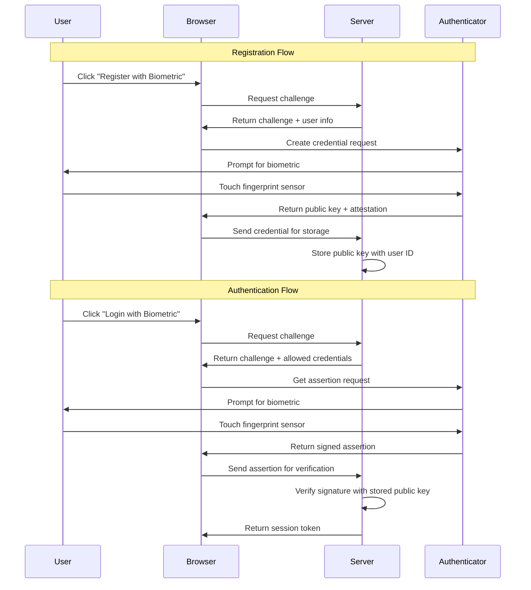

# How to Build Biometric Authentication

Author: [nawazdhandala](https://github.com/nawazdhandala)

Tags: Security, Biometric, WebAuthn, FIDO2

Description: Learn to build biometric authentication using WebAuthn and FIDO2 for passwordless security.

---

Passwords are the weakest link in application security. Users pick simple ones, reuse them across services, and fall for phishing attacks that harvest credentials at scale. Biometric authentication changes this equation by replacing something you know with something you are.

This guide walks through building biometric authentication using the WebAuthn API and FIDO2 protocol. By the end, you will have working code that registers fingerprint or face recognition credentials and verifies them on subsequent logins.

---

## How WebAuthn and FIDO2 work together

WebAuthn is a browser API that lets web applications create and use public key credentials. FIDO2 is the umbrella specification that includes WebAuthn plus CTAP (Client to Authenticator Protocol), which handles communication between the browser and hardware authenticators.

The flow involves three parties: the user, the browser (relying party client), and your server (relying party server). Here is how registration and authentication work.



The authenticator generates a key pair during registration. The private key never leaves the device. Your server only stores the public key. During login, the authenticator signs a challenge with the private key, and the server verifies that signature.

---

## Browser support and platform authenticators

Modern browsers support WebAuthn across desktop and mobile. Platform authenticators are built into devices and include Windows Hello, Touch ID, Face ID, and Android biometrics.

| Platform | Authenticator | Browser Support |
|----------|---------------|-----------------|
| macOS | Touch ID | Safari, Chrome, Firefox |
| Windows | Windows Hello | Edge, Chrome, Firefox |
| iOS | Face ID, Touch ID | Safari |
| Android | Fingerprint, Face | Chrome |
| Linux | External keys only | Chrome, Firefox |

Platform authenticators provide the smoothest experience because they require no additional hardware. External security keys like YubiKey work everywhere but add friction since users must carry and connect them.

---

## Setting up the server

The server handles challenge generation, credential storage, and signature verification. Here is a Node.js implementation using the `@simplewebauthn/server` library.

Install the required dependencies first.

```bash
npm install @simplewebauthn/server @simplewebauthn/browser
```

Create the registration endpoint that generates a challenge and returns options for the browser.

```javascript
// server/auth.js
import {
  generateRegistrationOptions,
  verifyRegistrationResponse,
  generateAuthenticationOptions,
  verifyAuthenticationResponse,
} from '@simplewebauthn/server';

// Configuration for your relying party
const rpName = 'Your App Name';
const rpID = 'localhost'; // Use your domain in production
const origin = 'http://localhost:3000';

// In-memory store for demo purposes
// Use a database in production
const userCredentials = new Map();

// Generate registration options for a new user
export async function getRegistrationOptions(userId, userName) {
  // Retrieve existing credentials for this user
  const existingCredentials = userCredentials.get(userId) || [];

  const options = await generateRegistrationOptions({
    rpName,
    rpID,
    userID: userId,
    userName,
    // Prevent re-registering existing authenticators
    excludeCredentials: existingCredentials.map(cred => ({
      id: cred.credentialID,
      type: 'public-key',
    })),
    // Prefer platform authenticators (built-in biometrics)
    authenticatorSelection: {
      authenticatorAttachment: 'platform',
      userVerification: 'required',
      residentKey: 'preferred',
    },
  });

  return options;
}
```

Add the verification endpoint that validates the credential and stores the public key.

```javascript
// server/auth.js (continued)

// Verify and store the registration response
export async function verifyRegistration(userId, response, expectedChallenge) {
  const verification = await verifyRegistrationResponse({
    response,
    expectedChallenge,
    expectedOrigin: origin,
    expectedRPID: rpID,
  });

  if (verification.verified && verification.registrationInfo) {
    const { credentialPublicKey, credentialID, counter } = verification.registrationInfo;

    // Store the credential for this user
    const credentials = userCredentials.get(userId) || [];
    credentials.push({
      credentialID,
      credentialPublicKey,
      counter,
      createdAt: new Date(),
    });
    userCredentials.set(userId, credentials);
  }

  return verification;
}
```

---

## Building the frontend

The browser side uses the WebAuthn API to interact with the authenticator. Here is how to implement registration.

```javascript
// client/auth.js
import { startRegistration, startAuthentication } from '@simplewebauthn/browser';

// Register a new biometric credential
async function registerBiometric(userId, userName) {
  try {
    // Get registration options from server
    const optionsResponse = await fetch('/api/auth/register/options', {
      method: 'POST',
      headers: { 'Content-Type': 'application/json' },
      body: JSON.stringify({ userId, userName }),
    });
    const options = await optionsResponse.json();

    // Trigger the browser's WebAuthn dialog
    // This prompts the user for biometric verification
    const credential = await startRegistration(options);

    // Send the credential to the server for verification
    const verifyResponse = await fetch('/api/auth/register/verify', {
      method: 'POST',
      headers: { 'Content-Type': 'application/json' },
      body: JSON.stringify({
        userId,
        credential,
        challenge: options.challenge,
      }),
    });

    const result = await verifyResponse.json();
    return result.verified;
  } catch (error) {
    // Handle user cancellation or authenticator errors
    console.error('Registration failed:', error);
    return false;
  }
}
```

Implement the login flow that verifies existing credentials.

```javascript
// client/auth.js (continued)

// Authenticate with stored biometric credential
async function loginWithBiometric(userId) {
  try {
    // Get authentication options from server
    const optionsResponse = await fetch('/api/auth/login/options', {
      method: 'POST',
      headers: { 'Content-Type': 'application/json' },
      body: JSON.stringify({ userId }),
    });
    const options = await optionsResponse.json();

    // Trigger biometric verification
    const assertion = await startAuthentication(options);

    // Verify the assertion on the server
    const verifyResponse = await fetch('/api/auth/login/verify', {
      method: 'POST',
      headers: { 'Content-Type': 'application/json' },
      body: JSON.stringify({
        userId,
        assertion,
        challenge: options.challenge,
      }),
    });

    const result = await verifyResponse.json();

    if (result.verified) {
      // Store session token and redirect
      localStorage.setItem('sessionToken', result.token);
      return true;
    }
    return false;
  } catch (error) {
    console.error('Authentication failed:', error);
    return false;
  }
}
```

---

## The complete authentication flow

This diagram shows how data flows through your system during both registration and login.


---

## Security considerations

Building biometric auth requires attention to several security details.

**Challenge freshness matters.** Generate a new random challenge for every registration and authentication attempt. Store challenges server-side with short expiration times (under 5 minutes) to prevent replay attacks.

**Validate the origin strictly.** The server must verify that the origin in the response matches your expected domain exactly. This prevents phishing sites from using credentials created for your application.

**Handle counter values.** Authenticators maintain a signature counter that increments with each use. Store and verify this counter to detect cloned authenticators.

```javascript
// Verify counter to detect cloned authenticators
export async function verifyAuthentication(userId, response, expectedChallenge) {
  const credentials = userCredentials.get(userId) || [];
  const credential = credentials.find(c =>
    c.credentialID === response.id
  );

  if (!credential) {
    throw new Error('Credential not found');
  }

  const verification = await verifyAuthenticationResponse({
    response,
    expectedChallenge,
    expectedOrigin: origin,
    expectedRPID: rpID,
    authenticator: {
      credentialID: credential.credentialID,
      credentialPublicKey: credential.credentialPublicKey,
      counter: credential.counter,
    },
  });

  if (verification.verified) {
    // Update the stored counter
    credential.counter = verification.authenticationInfo.newCounter;
  }

  return verification;
}
```

**Provide fallback options.** Not all devices support biometrics. Offer backup authentication methods like email magic links or backup codes for account recovery.

---

## Production deployment checklist

Before deploying biometric authentication to production, verify these requirements.

| Requirement | Details |
|-------------|---------|
| HTTPS required | WebAuthn only works on secure origins |
| Valid domain | Set rpID to your production domain |
| Database storage | Replace in-memory maps with persistent storage |
| Rate limiting | Prevent brute force attempts on challenges |
| Logging | Record authentication events for audit trails |
| Backup auth | Implement recovery flows for lost devices |

---

## Wrapping up

Biometric authentication eliminates the friction and vulnerability of passwords. Users tap their fingerprint or glance at their phone instead of typing credentials that can be stolen or guessed.

The WebAuthn API and FIDO2 protocol handle the complexity of key management and secure communication. Your server never sees biometric data or private keys, reducing liability and compliance burden.

Start with the code examples above, test on devices your users actually have, and always provide fallback authentication for edge cases. The result is authentication that is both more secure and more convenient than anything passwords can offer.
