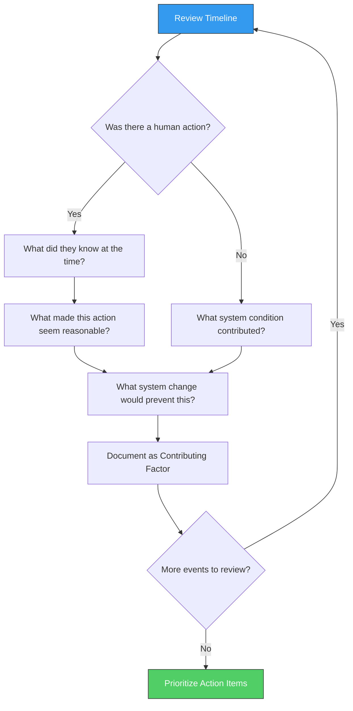

# How to Implement Blameless Culture

Author: [nawazdhandala](https://github.com/nawazdhandala)

Tags: SRE, Culture, Postmortem, Incident Management

Description: A practical guide to building a blameless culture that transforms incidents into learning opportunities and drives continuous system improvement.

---

Every incident has a story. In organizations with blame cultures, that story ends with "who screwed up." In organizations with blameless cultures, it ends with "what can we learn." The difference between these two endings determines whether your team improves or stagnates.

Blameless culture is not about avoiding accountability. It is about recognizing that complex systems fail for complex reasons, and that punishing individuals for systemic problems makes those problems worse, not better. When people fear punishment, they hide mistakes. When they hide mistakes, you lose the information you need to prevent future incidents.

This guide covers how to build a blameless culture from the ground up, including the psychology behind it, the processes that reinforce it, and the common pitfalls that undermine it.

## Why Blame Fails

Blame feels satisfying. Someone made a mistake, we identify them, and justice is served. But this instinct, however natural, makes systems less reliable.

### The Problem with Blame

When engineers fear being blamed for incidents, three destructive patterns emerge:

**Information hiding.** Engineers stop reporting near-misses, delay acknowledging problems, and minimize their involvement in incidents. You lose visibility into what is actually happening in your systems.

**Risk aversion.** Teams stop making changes that could improve the system because any change carries the risk of causing an incident. Technical debt accumulates, and the system becomes more fragile over time.

**Shallow analysis.** Postmortems become exercises in finding someone to blame rather than understanding what happened. The real causes go unaddressed, and the same incidents keep happening.

### Humans and Complex Systems

Modern distributed systems are too complex for any single person to fully understand. Incidents happen when multiple factors combine in unexpected ways. Configuration changes, traffic patterns, dependency failures, and timing issues interact in ways that nobody could have predicted.

Blaming the person who made the last change before an incident ignores the dozens of other factors that made that change dangerous. The engineer who deployed code that caused an outage was operating in a system that allowed dangerous code to reach production. That is a system problem, not a people problem.

```mermaid
flowchart TD
    subgraph "Blame Culture Cycle"
        A[Incident Occurs] --> B[Find Someone to Blame]
        B --> C[Engineer Punished]
        C --> D[Fear of Reporting]
        D --> E[Hidden Problems]
        E --> A
    end

    subgraph "Blameless Culture Cycle"
        F[Incident Occurs] --> G[Understand What Happened]
        G --> H[Identify System Improvements]
        H --> I[Implement Changes]
        I --> J[Safer System]
        J --> K[More Confident Reporting]
        K --> F
    end

    style A fill:#ff6b6b,stroke:#333,color:#fff
    style F fill:#51cf66,stroke:#333,color:#fff
    style J fill:#51cf66,stroke:#333,color:#fff
```

## Building Psychological Safety

Blameless culture requires psychological safety, the belief that you will not be punished or humiliated for speaking up with questions, concerns, mistakes, or ideas. Without psychological safety, blamelessness is just a slogan.

### What Psychological Safety Looks Like

In psychologically safe teams, engineers:

- Admit when they do not understand something
- Ask for help before problems escalate
- Report mistakes and near-misses promptly
- Challenge decisions they disagree with
- Experiment with new approaches without fear of failure

### How Leaders Create Psychological Safety

Psychological safety starts at the top. Leaders set the tone through their reactions to problems.

**Acknowledge your own mistakes publicly.** When leaders admit their errors and discuss what they learned, it signals that mistakes are part of growth, not career-ending events.

**Thank people for reporting problems.** When someone brings bad news, your first response should be gratitude, not frustration. "Thanks for catching that" is more effective than "how did this happen."

**Separate learning from consequences.** Performance issues should be addressed through coaching and development, not through incident postmortems. Keep the two processes distinct.

**Ask questions before making statements.** When investigating incidents, lead with curiosity. "Help me understand what happened" opens dialogue. "Why did you do that" closes it.

### Team Practices That Reinforce Safety

**Normalize "I don't know."** Create space for uncertainty. Not knowing something is the first step to learning it.

**Celebrate learning from failure.** Share postmortem learnings widely and recognize teams that conduct thorough analyses.

**Rotate incident commander roles.** When everyone takes turns leading incident response, the team develops shared empathy for the challenges involved.

## The Blameless Postmortem Process

Postmortems are where blameless culture is tested. A well-run blameless postmortem turns an incident into lasting improvement. A poorly run one reinforces blame and fear.

### Before the Postmortem

**Collect artifacts immediately.** Logs, metrics, chat transcripts, and deployment records become harder to gather as time passes. Assign someone to collect everything within 24 hours of the incident.

**Set the tone in the invitation.** The meeting invite should explicitly state that this is a blameless review focused on learning, not blame.

**Invite broadly.** Include everyone involved in the incident, but also people from related teams who might have relevant context or who could benefit from the learnings.

### During the Postmortem

**Start with the timeline.** Walk through what happened chronologically, focusing on facts rather than interpretations. What did people know at each decision point? What information was missing?

**Ask "what" questions, not "who" questions.** "What led to this decision?" opens exploration. "Who decided to deploy?" invites blame.

**Assume good intent.** Everyone involved was trying to do their job well. If someone made a decision that looks wrong in hindsight, explore what made it seem reasonable at the time.

**Look for systemic causes.** For every human action that contributed to the incident, ask what system conditions made that action possible or likely. Why was the dangerous change possible? Why did the alert not fire?

**Document contributing factors, not root causes.** Incidents rarely have a single root cause. List all the factors that contributed and avoid the temptation to identify one person or action as "the cause."

### The Blameless Review Flow

### After the Postmortem

**Publish the report widely.** Transparency reinforces trust. When people see that postmortems focus on learning, they become more willing to participate.

**Track action items to completion.** Postmortems without follow-through breed cynicism. Use your project management tools to ensure action items get done.

**Review patterns periodically.** Look across multiple postmortems for recurring themes. If the same contributing factors keep appearing, you have a systemic issue that needs broader attention.

## Blameless Postmortem Guidelines

These guidelines help keep postmortems focused on learning. Post them in your meeting room or share them at the start of each session.

### Language to Use

| Instead of | Try |
|------------|-----|
| "You broke the system" | "The system broke when this change was deployed" |
| "Why did you do that?" | "What information did you have when you made this decision?" |
| "This was a mistake" | "This action had unintended consequences" |
| "Someone should have caught this" | "Our process did not catch this" |
| "Human error" | "The system allowed this error to have impact" |

### Questions That Drive Learning

- What information would have changed the outcome?
- What made this failure possible?
- How could we detect this earlier?
- What assumptions proved wrong?
- Where else might similar issues exist?

### Questions to Avoid

- Who is responsible for this?
- Why did you not follow the process?
- Did you not know better?
- Who approved this?

## From Learning to System Improvement

Blameless culture is not just about making people feel safe. It is about making systems safer. Every postmortem should produce concrete improvements.

### Types of Improvements

**Detection improvements.** Add alerts, dashboards, or tests that would catch similar problems earlier.

**Prevention improvements.** Change processes, add safeguards, or modify architecture to make the failure less likely.

**Mitigation improvements.** Improve rollback procedures, circuit breakers, or isolation to reduce impact when failures occur.

**Documentation improvements.** Update runbooks, architecture diagrams, or onboarding materials so knowledge is shared.

### Prioritizing Action Items

Not every improvement is equally valuable. Prioritize based on:

1. **Recurrence likelihood.** Will this happen again without intervention?
2. **Impact severity.** How bad was it? Could it be worse?
3. **Effort required.** What will it take to implement?
4. **Breadth of benefit.** Will this prevent other types of incidents too?

High-priority items are those with high likelihood, high impact, low effort, and broad benefit. These are your quick wins. Low-priority items are the opposite. Everything else falls somewhere in between.

### Tracking Progress

Create a system for tracking postmortem action items separate from your regular backlog. This makes it easy to see:

- How many action items are open across all recent incidents
- Which items have been open the longest
- Whether completion rates are improving or declining

If action items consistently go unfinished, you have a prioritization or capacity problem that needs leadership attention.

## Common Pitfalls

Even teams committed to blameless culture can fall into traps that undermine their efforts.

### Blamelessness as an Excuse

Blameless does not mean accountability-free. When the same engineer causes multiple incidents through the same type of mistake, that is a performance issue that should be addressed through coaching and development, not through postmortems. The postmortem should still focus on system improvements, while the performance conversation happens separately.

### Blame in Disguise

Watch for blame wearing the mask of blamelessness:

- "The deploy was made without following the checklist" (implies someone was negligent)
- "Better training would have prevented this" (implies someone was undertrained)
- "Communication broke down" (implies someone failed to communicate)

Rephrase these as system problems: "Our checklist was not enforced by tooling," "Our training program has a gap," "Our communication channels did not surface this information."

### Skipping the Hard Conversations

Sometimes incidents reveal genuine problems with processes, tools, or organizational decisions. Blameless culture should not prevent these conversations. The goal is to discuss problems constructively, not to avoid discussing them entirely.

### Postmortem Fatigue

If every minor incident requires a full postmortem, teams burn out on the process. Establish clear criteria for which incidents warrant postmortems and create lighter-weight alternatives for minor issues.

## Measuring Progress

How do you know if your blameless culture is working? Look for these indicators:

### Leading Indicators

- **Near-miss reporting rate.** Are teams reporting problems that almost caused incidents?
- **Time to report incidents.** Are incidents being reported faster?
- **Postmortem participation.** Are people attending and contributing to postmortems?
- **Action item completion rate.** Are improvements actually getting implemented?

### Lagging Indicators

- **Incident recurrence rate.** Are the same incidents happening repeatedly?
- **Mean time to recovery.** Are incidents being resolved faster?
- **Survey responses.** Do team members report feeling safe to make mistakes?
- **Turnover rate.** Are you retaining experienced engineers?

### Warning Signs

If you see these patterns, your blameless culture may be struggling:

- Postmortems that repeatedly identify "human error" as the cause
- Action items that never get completed
- Declining attendance at postmortem meetings
- Engineers who stop admitting involvement in incidents
- Incident reports that avoid naming anyone or anything specifically

## Getting Started

If your organization currently has a blame culture, changing it takes time. Here is a practical starting point.

### Week 1: Set Expectations

- Announce the shift to blameless postmortems
- Share this guide or similar resources with the team
- Get explicit leadership commitment to the new approach

### Month 1: Run Pilot Postmortems

- Conduct blameless postmortems for all incidents
- Have leadership attend and model blameless behavior
- Solicit feedback and adjust the process

### Quarter 1: Reinforce and Expand

- Publish postmortems widely to build trust
- Track and complete action items visibly
- Recognize teams that conduct effective postmortems
- Address any backsliding into blame-oriented language

### Ongoing: Maintain and Improve

- Review postmortem patterns quarterly
- Survey team members about psychological safety
- Continue leadership modeling of blameless behavior
- Evolve the process based on what you learn

## Conclusion

Blameless culture is not soft. It is strategic. Organizations that learn from failure outperform those that punish it. Systems that surface problems early are more reliable than systems that hide them. Teams that feel safe to experiment move faster than teams that fear mistakes.

Building blameless culture requires consistent effort. Leaders must model the behavior they want to see. Processes must be designed to reinforce learning over punishment. And the organization must follow through on improvements, proving that postmortems lead to real change.

The investment is worth it. When your team stops asking "whose fault was this" and starts asking "what can we learn," you unlock a level of reliability and innovation that blame cultures can never achieve.

Start with your next incident. Run a blameless postmortem. Ask what the system could do differently, not what the person could do differently. Follow through on the action items. Do it again. Over time, blameless becomes the default, and your systems become genuinely more reliable.

**Related Reading:**

- [Effective Incident Postmortem Templates](https://oneuptime.com/blog/post/2025-09-09-effective-incident-postmortem-templates-ready-to-use-examples/view)
- [How to Create Root Cause Analysis](https://oneuptime.com/blog/post/2026-01-30-root-cause-analysis/view)
- [The Five Stages of SRE Maturity](https://oneuptime.com/blog/post/2025-09-01-the-five-stages-of-sre-maturity/view)
