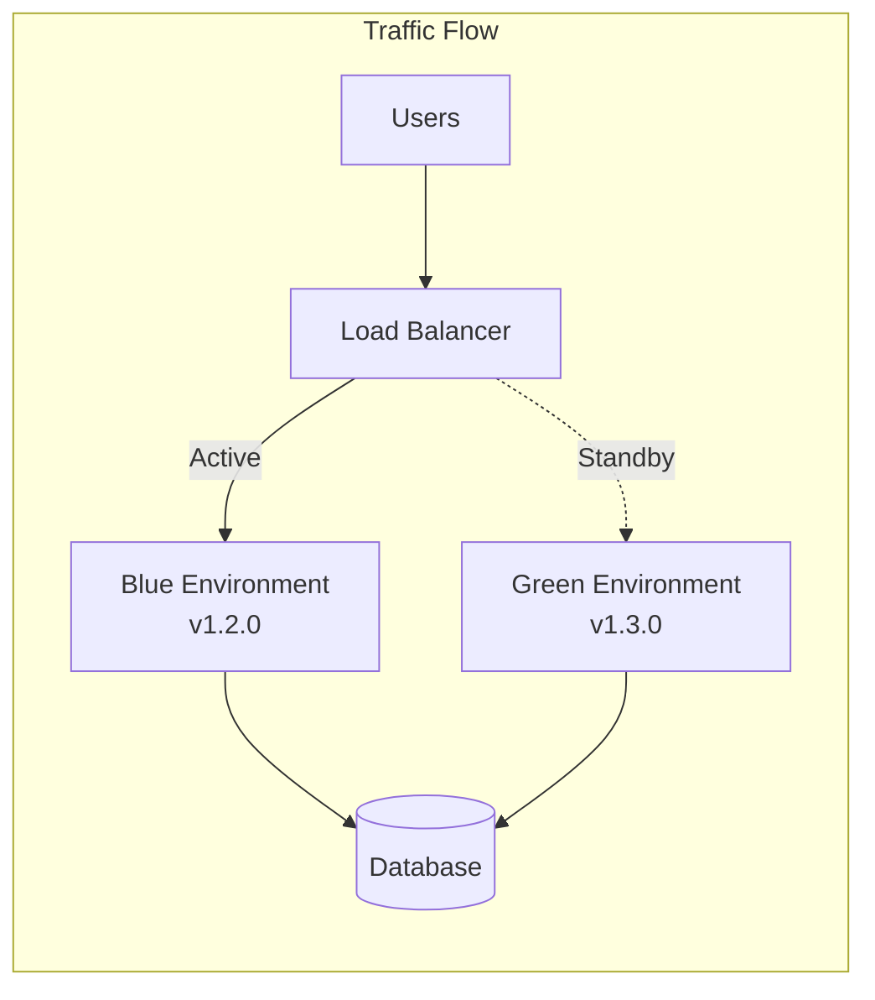
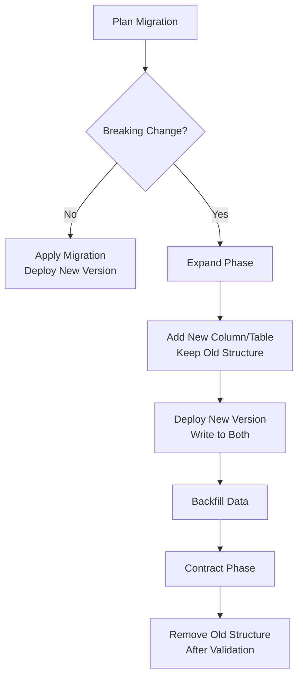

# How to Create Blue-Green Deployment

Author: [nawazdhandala](https://www.github.com/nawazdhandala)

Tags: Deployment, Blue-Green, DevOps, Zero Downtime, Release Management

Description: Implement blue-green deployments for zero-downtime releases with traffic switching, database migration strategies, and rollback procedures.

---

Deploying software without downtime is no longer a luxury - it is a baseline expectation. Blue-green deployment is one of the most reliable strategies for achieving this goal. By maintaining two identical production environments, you can switch traffic between them instantly, enabling seamless releases and rapid rollbacks when things go wrong.

This guide walks through creating a complete blue-green deployment pipeline, covering infrastructure setup, traffic management, database considerations, and automated rollback procedures.

## Understanding the Blue-Green Architecture

The concept is straightforward: you maintain two production-ready environments called "blue" and "green." At any given time, only one environment serves live traffic while the other remains on standby. When deploying a new version, you deploy to the inactive environment, verify everything works, then switch traffic over.



The key advantages are immediate rollback capability and the ability to test the new version in production conditions before exposing it to users.

## Setting Up the Infrastructure

Let us start by creating the foundational infrastructure using Terraform. This example uses AWS with an Application Load Balancer to manage traffic switching.

First, define the two target groups that will represent our blue and green environments:

```hcl
# infrastructure/target-groups.tf
# Define target groups for blue and green environments

resource "aws_lb_target_group" "blue" {
  name        = "${var.app_name}-blue"
  port        = 8080
  protocol    = "HTTP"
  vpc_id      = var.vpc_id
  target_type = "instance"

  # Health check configuration ensures only healthy instances receive traffic
  health_check {
    enabled             = true
    path                = "/health"
    port                = "traffic-port"
    healthy_threshold   = 2
    unhealthy_threshold = 3
    timeout             = 5
    interval            = 10
    matcher             = "200"
  }

  # Deregistration delay allows in-flight requests to complete
  deregistration_delay = 30

  tags = {
    Name        = "${var.app_name}-blue"
    Environment = "production"
    Color       = "blue"
  }
}

resource "aws_lb_target_group" "green" {
  name        = "${var.app_name}-green"
  port        = 8080
  protocol    = "HTTP"
  vpc_id      = var.vpc_id
  target_type = "instance"

  health_check {
    enabled             = true
    path                = "/health"
    port                = "traffic-port"
    healthy_threshold   = 2
    unhealthy_threshold = 3
    timeout             = 5
    interval            = 10
    matcher             = "200"
  }

  deregistration_delay = 30

  tags = {
    Name        = "${var.app_name}-green"
    Environment = "production"
    Color       = "green"
  }
}
```

Next, configure the ALB listener with weighted routing to control traffic distribution:

```hcl
# infrastructure/alb-listener.tf
# ALB listener with weighted forwarding for traffic control

resource "aws_lb_listener" "production" {
  load_balancer_arn = aws_lb.main.arn
  port              = 443
  protocol          = "HTTPS"
  ssl_policy        = "ELBSecurityPolicy-TLS13-1-2-2021-06"
  certificate_arn   = var.ssl_certificate_arn

  # Initial configuration routes all traffic to blue
  default_action {
    type = "forward"

    forward {
      target_group {
        arn    = aws_lb_target_group.blue.arn
        weight = 100
      }

      target_group {
        arn    = aws_lb_target_group.green.arn
        weight = 0
      }

      # Stickiness ensures users stay on the same environment during a session
      stickiness {
        enabled  = true
        duration = 3600
      }
    }
  }
}
```

## Creating the Deployment Script

The deployment process needs to deploy to the inactive environment, verify health, and then switch traffic. Here is a robust deployment script:

```bash
#!/bin/bash
# scripts/deploy.sh
# Blue-green deployment script with health checks and rollback support

set -euo pipefail

# Configuration - these would typically come from environment variables
APP_NAME="${APP_NAME:-myapp}"
REGION="${AWS_REGION:-us-east-1}"
LISTENER_ARN="${LISTENER_ARN}"
BLUE_TG_ARN="${BLUE_TG_ARN}"
GREEN_TG_ARN="${GREEN_TG_ARN}"
IMAGE_TAG="${IMAGE_TAG:-latest}"

# Determine which environment is currently active
get_active_environment() {
    local weights
    weights=$(aws elbv2 describe-listeners \
        --listener-arns "$LISTENER_ARN" \
        --region "$REGION" \
        --query 'Listeners[0].DefaultActions[0].ForwardConfig.TargetGroups' \
        --output json)

    local blue_weight
    blue_weight=$(echo "$weights" | jq -r ".[] | select(.TargetGroupArn==\"$BLUE_TG_ARN\") | .Weight")

    if [[ "$blue_weight" -gt 0 ]]; then
        echo "blue"
    else
        echo "green"
    fi
}

# Deploy new version to the inactive environment
deploy_to_inactive() {
    local active=$1
    local target_env

    if [[ "$active" == "blue" ]]; then
        target_env="green"
    else
        target_env="blue"
    fi

    echo "Deploying version $IMAGE_TAG to $target_env environment..."

    # Update the ECS service or EC2 instances in the target environment
    # This example assumes ECS, adjust for your infrastructure
    aws ecs update-service \
        --cluster "${APP_NAME}-cluster" \
        --service "${APP_NAME}-${target_env}" \
        --force-new-deployment \
        --region "$REGION"

    echo "Waiting for deployment to stabilize..."
    aws ecs wait services-stable \
        --cluster "${APP_NAME}-cluster" \
        --services "${APP_NAME}-${target_env}" \
        --region "$REGION"

    echo "$target_env"
}

# Run health checks against the target environment
verify_health() {
    local env=$1
    local tg_arn
    local max_attempts=30
    local attempt=0

    if [[ "$env" == "blue" ]]; then
        tg_arn="$BLUE_TG_ARN"
    else
        tg_arn="$GREEN_TG_ARN"
    fi

    echo "Verifying health of $env environment..."

    while [[ $attempt -lt $max_attempts ]]; do
        local health
        health=$(aws elbv2 describe-target-health \
            --target-group-arn "$tg_arn" \
            --region "$REGION" \
            --query 'TargetHealthDescriptions[*].TargetHealth.State' \
            --output text)

        # Check if all targets are healthy
        if echo "$health" | grep -qv "healthy"; then
            echo "Waiting for targets to become healthy (attempt $((attempt + 1))/$max_attempts)..."
            sleep 10
            ((attempt++))
        else
            echo "All targets in $env are healthy"
            return 0
        fi
    done

    echo "ERROR: Targets failed to become healthy within timeout"
    return 1
}

# Switch traffic to the new environment
switch_traffic() {
    local new_active=$1
    local blue_weight=0
    local green_weight=0

    if [[ "$new_active" == "blue" ]]; then
        blue_weight=100
    else
        green_weight=100
    fi

    echo "Switching traffic to $new_active environment..."

    aws elbv2 modify-listener \
        --listener-arn "$LISTENER_ARN" \
        --region "$REGION" \
        --default-actions "[{
            \"Type\": \"forward\",
            \"ForwardConfig\": {
                \"TargetGroups\": [
                    {\"TargetGroupArn\": \"$BLUE_TG_ARN\", \"Weight\": $blue_weight},
                    {\"TargetGroupArn\": \"$GREEN_TG_ARN\", \"Weight\": $green_weight}
                ],
                \"TargetGroupStickinessConfig\": {
                    \"Enabled\": true,
                    \"DurationSeconds\": 3600
                }
            }
        }]"

    echo "Traffic successfully switched to $new_active"
}

# Main deployment flow
main() {
    echo "Starting blue-green deployment..."

    local active
    active=$(get_active_environment)
    echo "Current active environment: $active"

    local target
    target=$(deploy_to_inactive "$active")

    if verify_health "$target"; then
        switch_traffic "$target"
        echo "Deployment completed successfully!"
    else
        echo "Deployment failed health checks. Rolling back..."
        exit 1
    fi
}

main "$@"
```

## Database Migration Strategy

Database changes require careful handling in blue-green deployments since both environments share the same database. The expand-contract pattern ensures backward compatibility.



Here is an example migration script that follows this pattern:

```python
# migrations/add_email_verified_column.py
# Example expand-contract migration for adding a new column

from datetime import datetime
import logging

logger = logging.getLogger(__name__)

class Migration:
    """
    Adds email_verified column to users table using expand-contract pattern.

    Phase 1 (Expand): Add nullable column, both versions work
    Phase 2 (Contract): Make column required after traffic fully switched
    """

    def expand(self, connection):
        """
        Expand phase - add new column without breaking existing code.
        Safe to run while blue environment is still active.
        """
        logger.info("Running expand phase: adding email_verified column")

        # Add column as nullable so existing code continues to work
        connection.execute("""
            ALTER TABLE users
            ADD COLUMN IF NOT EXISTS email_verified BOOLEAN DEFAULT FALSE
        """)

        # Add index for query performance
        connection.execute("""
            CREATE INDEX CONCURRENTLY IF NOT EXISTS
            idx_users_email_verified ON users(email_verified)
        """)

        # Backfill existing data based on business logic
        connection.execute("""
            UPDATE users
            SET email_verified = TRUE
            WHERE email_confirmed_at IS NOT NULL
            AND email_verified IS NULL
        """)

        logger.info("Expand phase completed")

    def contract(self, connection):
        """
        Contract phase - enforce constraints after old version is retired.
        Only run after blue environment is decommissioned.
        """
        logger.info("Running contract phase: enforcing email_verified constraints")

        # Ensure all rows have a value
        connection.execute("""
            UPDATE users
            SET email_verified = FALSE
            WHERE email_verified IS NULL
        """)

        # Add NOT NULL constraint
        connection.execute("""
            ALTER TABLE users
            ALTER COLUMN email_verified SET NOT NULL
        """)

        logger.info("Contract phase completed")

    def rollback_expand(self, connection):
        """Rollback the expand phase if needed."""
        logger.info("Rolling back expand phase")

        connection.execute("DROP INDEX IF EXISTS idx_users_email_verified")
        connection.execute("ALTER TABLE users DROP COLUMN IF EXISTS email_verified")

        logger.info("Expand rollback completed")
```

## Implementing Automated Rollback

Automated rollback is crucial for maintaining reliability. This monitoring script watches for error rates and triggers rollback when thresholds are exceeded:

```python
# scripts/monitor_and_rollback.py
# Monitors deployment health and triggers automatic rollback

import boto3
import time
import sys
from dataclasses import dataclass
from typing import Optional

@dataclass
class RollbackConfig:
    """Configuration for rollback monitoring."""
    error_rate_threshold: float = 0.05  # 5% error rate triggers rollback
    latency_threshold_ms: float = 2000  # 2 second p99 latency threshold
    monitoring_duration_seconds: int = 300  # Monitor for 5 minutes
    check_interval_seconds: int = 30

class DeploymentMonitor:
    def __init__(self, config: RollbackConfig, listener_arn: str,
                 blue_tg_arn: str, green_tg_arn: str):
        self.config = config
        self.listener_arn = listener_arn
        self.blue_tg_arn = blue_tg_arn
        self.green_tg_arn = green_tg_arn
        self.elbv2 = boto3.client('elbv2')
        self.cloudwatch = boto3.client('cloudwatch')

    def get_active_environment(self) -> str:
        """Determine which environment is currently receiving traffic."""
        response = self.elbv2.describe_listeners(ListenerArns=[self.listener_arn])
        target_groups = response['Listeners'][0]['DefaultActions'][0]['ForwardConfig']['TargetGroups']

        for tg in target_groups:
            if tg['Weight'] > 0:
                return 'blue' if tg['TargetGroupArn'] == self.blue_tg_arn else 'green'

        return 'unknown'

    def get_error_rate(self, target_group_arn: str) -> Optional[float]:
        """Calculate error rate from CloudWatch metrics."""
        response = self.cloudwatch.get_metric_statistics(
            Namespace='AWS/ApplicationELB',
            MetricName='HTTPCode_Target_5XX_Count',
            Dimensions=[{'Name': 'TargetGroup', 'Value': target_group_arn.split('/')[-1]}],
            StartTime=time.time() - 300,
            EndTime=time.time(),
            Period=60,
            Statistics=['Sum']
        )

        errors = sum(dp['Sum'] for dp in response.get('Datapoints', []))

        # Get total requests
        response = self.cloudwatch.get_metric_statistics(
            Namespace='AWS/ApplicationELB',
            MetricName='RequestCount',
            Dimensions=[{'Name': 'TargetGroup', 'Value': target_group_arn.split('/')[-1]}],
            StartTime=time.time() - 300,
            EndTime=time.time(),
            Period=60,
            Statistics=['Sum']
        )

        total = sum(dp['Sum'] for dp in response.get('Datapoints', []))

        if total == 0:
            return None

        return errors / total

    def rollback(self, from_env: str) -> None:
        """Switch traffic back to the previous environment."""
        target_env = 'blue' if from_env == 'green' else 'green'
        blue_weight = 100 if target_env == 'blue' else 0
        green_weight = 100 if target_env == 'green' else 0

        print(f"Rolling back from {from_env} to {target_env}...")

        self.elbv2.modify_listener(
            ListenerArn=self.listener_arn,
            DefaultActions=[{
                'Type': 'forward',
                'ForwardConfig': {
                    'TargetGroups': [
                        {'TargetGroupArn': self.blue_tg_arn, 'Weight': blue_weight},
                        {'TargetGroupArn': self.green_tg_arn, 'Weight': green_weight}
                    ]
                }
            }]
        )

        print(f"Rollback to {target_env} completed")

    def monitor(self) -> bool:
        """
        Monitor the deployment for the configured duration.
        Returns True if deployment is healthy, False if rollback was triggered.
        """
        active_env = self.get_active_environment()
        active_tg = self.blue_tg_arn if active_env == 'blue' else self.green_tg_arn

        print(f"Monitoring {active_env} environment for {self.config.monitoring_duration_seconds} seconds...")

        start_time = time.time()
        while time.time() - start_time < self.config.monitoring_duration_seconds:
            error_rate = self.get_error_rate(active_tg)

            if error_rate is not None and error_rate > self.config.error_rate_threshold:
                print(f"Error rate {error_rate:.2%} exceeds threshold {self.config.error_rate_threshold:.2%}")
                self.rollback(active_env)
                return False

            print(f"Health check passed - error rate: {error_rate:.2%}" if error_rate else "No traffic yet")
            time.sleep(self.config.check_interval_seconds)

        print("Monitoring completed - deployment is healthy")
        return True

if __name__ == '__main__':
    config = RollbackConfig()
    monitor = DeploymentMonitor(
        config=config,
        listener_arn=sys.argv[1],
        blue_tg_arn=sys.argv[2],
        green_tg_arn=sys.argv[3]
    )

    success = monitor.monitor()
    sys.exit(0 if success else 1)
```

## Integrating with CI/CD

Tie everything together in a GitHub Actions workflow:

```yaml
# .github/workflows/deploy.yml
name: Blue-Green Deployment

on:
  push:
    branches: [main]

env:
  AWS_REGION: us-east-1
  APP_NAME: myapp

jobs:
  deploy:
    runs-on: ubuntu-latest
    steps:
      - uses: actions/checkout@v4

      - name: Configure AWS credentials
        uses: aws-actions/configure-aws-credentials@v4
        with:
          aws-access-key-id: ${{ secrets.AWS_ACCESS_KEY_ID }}
          aws-secret-access-key: ${{ secrets.AWS_SECRET_ACCESS_KEY }}
          aws-region: ${{ env.AWS_REGION }}

      - name: Build and push Docker image
        run: |
          # Build and push to ECR
          aws ecr get-login-password | docker login --username AWS --password-stdin ${{ secrets.ECR_REGISTRY }}
          docker build -t ${{ secrets.ECR_REGISTRY }}/${{ env.APP_NAME }}:${{ github.sha }} .
          docker push ${{ secrets.ECR_REGISTRY }}/${{ env.APP_NAME }}:${{ github.sha }}

      - name: Deploy to inactive environment
        run: |
          chmod +x scripts/deploy.sh
          ./scripts/deploy.sh
        env:
          IMAGE_TAG: ${{ github.sha }}
          LISTENER_ARN: ${{ secrets.ALB_LISTENER_ARN }}
          BLUE_TG_ARN: ${{ secrets.BLUE_TG_ARN }}
          GREEN_TG_ARN: ${{ secrets.GREEN_TG_ARN }}

      - name: Monitor deployment
        run: |
          python scripts/monitor_and_rollback.py \
            ${{ secrets.ALB_LISTENER_ARN }} \
            ${{ secrets.BLUE_TG_ARN }} \
            ${{ secrets.GREEN_TG_ARN }}
```

## Summary

Blue-green deployments provide a powerful foundation for zero-downtime releases. The key elements covered in this guide include:

1. **Infrastructure setup** with separate target groups for each environment
2. **Traffic management** using weighted routing at the load balancer level
3. **Deployment scripts** that handle health verification before switching
4. **Database migrations** using the expand-contract pattern for backward compatibility
5. **Automated rollback** based on error rate monitoring
6. **CI/CD integration** for fully automated deployments

The main trade-off is resource cost - you need to run two complete environments during deployments. However, for applications where downtime has significant business impact, the instant rollback capability and deployment confidence make blue-green deployments well worth the investment.

Start with manual traffic switching to understand the process, then gradually automate each step as you gain confidence. The goal is to make deployments boring and predictable rather than stressful events.
