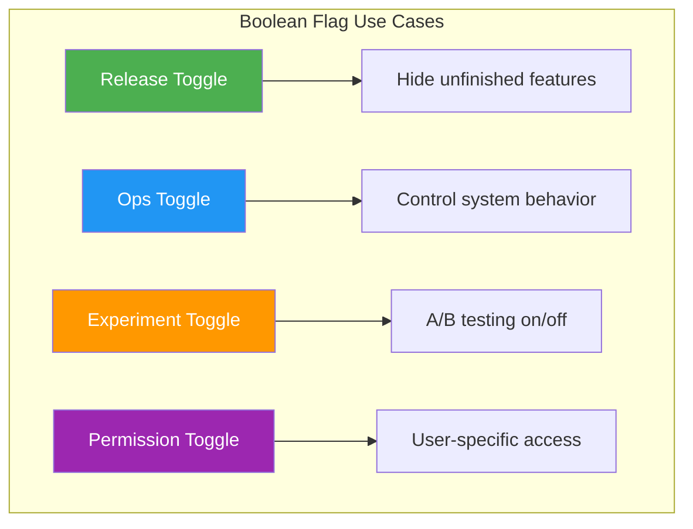
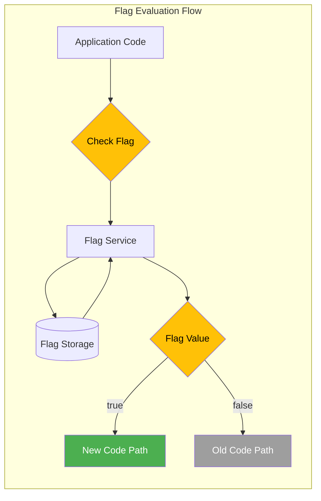
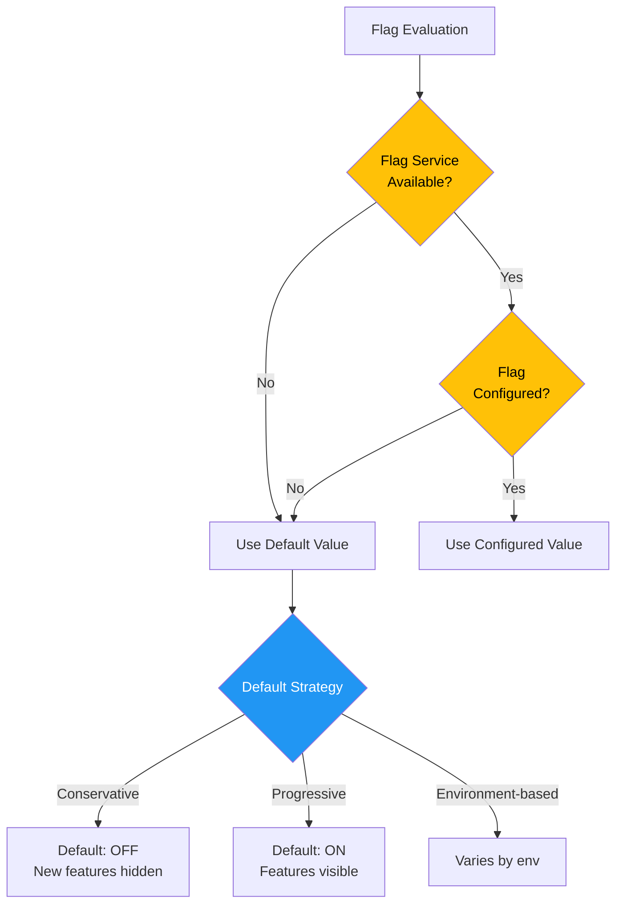
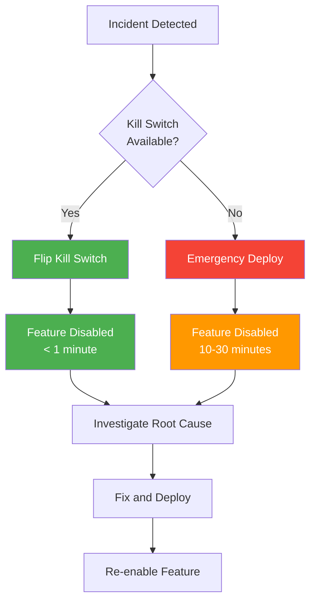
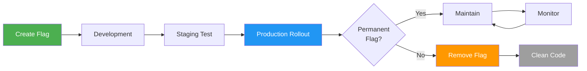
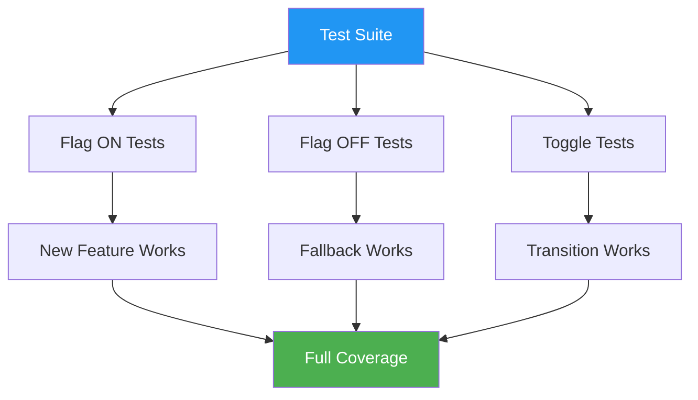

# How to Create Boolean Flags

Author: [nawazdhandala](https://github.com/nawazdhandala)

Tags: Feature Flags, Feature Toggle, Development, DevOps

Description: Learn how to implement simple on/off boolean feature flags effectively.

---

Boolean feature flags are the simplest yet most powerful tools in your deployment arsenal. At their core, they answer one question: **is this feature on or off?** Despite this simplicity, mastering boolean flags unlocks safer deployments, faster rollbacks, and cleaner code paths.

This guide covers practical implementation patterns, from basic toggles to sophisticated kill switches, with code examples you can adapt to your systems.

---

## Table of Contents

1. Boolean Flag Use Cases
2. Simple Toggle Implementation
3. Default Value Strategies
4. Kill Switch Patterns
5. Boolean Flag Lifecycle
6. Testing Considerations

---

## 1. Boolean Flag Use Cases

Boolean flags serve distinct purposes depending on your deployment and operational needs. Understanding these use cases helps you choose the right pattern.



| Use Case | Description | Example | Typical Lifespan |
|----------|-------------|---------|------------------|
| **Release Toggle** | Hide incomplete features until ready | `new_checkout_flow_enabled` | Days to weeks |
| **Ops Toggle** | Control operational behavior at runtime | `maintenance_mode_enabled` | Permanent |
| **Kill Switch** | Emergency disable for problematic features | `payment_processing_enabled` | Permanent |
| **Permission Toggle** | Feature access by user segment | `beta_features_enabled` | Weeks to months |
| **Experiment Toggle** | Simple on/off A/B tests | `new_onboarding_enabled` | Days to weeks |

### When to Use Boolean Flags

Boolean flags excel when you need:

- **Binary decisions**: Feature is either fully on or fully off
- **Fast rollback**: Disable problematic code without deployment
- **Gradual rollout**: Enable for specific users before general availability
- **Operational control**: Toggle system behaviors during incidents

```python
# Good use cases for boolean flags
ENABLE_NEW_PAYMENT_GATEWAY = True      # Release toggle
MAINTENANCE_MODE = False                # Ops toggle
ENABLE_RATE_LIMITING = True            # Kill switch candidate
BETA_DASHBOARD_ENABLED = True          # Permission toggle

# Consider other flag types for these scenarios
# - Percentage rollout: Use percentage flags (10% of users)
# - Multiple variants: Use multivariate flags (A/B/C/D)
# - Configuration: Use config values, not flags
```

---

## 2. Simple Toggle Implementation

A well-designed boolean flag system needs three components: storage, evaluation, and integration. Let us build each layer.



### Basic Flag Service

```typescript
// flag-service.ts
interface FlagDefinition {
  name: string;
  defaultValue: boolean;
  description: string;
  owner: string;
  createdAt: Date;
  expiresAt?: Date;
}

interface FlagContext {
  userId?: string;
  userEmail?: string;
  userRole?: string;
  environment: string;
  region?: string;
}

class BooleanFlagService {
  private flags: Map<string, FlagDefinition> = new Map();
  private overrides: Map<string, Map<string, boolean>> = new Map();
  private cache: Map<string, boolean> = new Map();
  private cacheTTL: number = 60000; // 1 minute
  private cacheTimestamps: Map<string, number> = new Map();

  constructor(private storage: FlagStorage) {}

  /**
   * Register a new boolean flag with metadata.
   * Always register flags at application startup for discoverability.
   */
  registerFlag(definition: FlagDefinition): void {
    this.flags.set(definition.name, definition);
    console.log(`Flag registered: ${definition.name} (default: ${definition.defaultValue})`);
  }

  /**
   * Evaluate a flag for a given context.
   * Returns the flag value with fallback to default if not found.
   */
  async isEnabled(flagName: string, context: FlagContext): Promise<boolean> {
    // Check if flag is registered
    const definition = this.flags.get(flagName);
    if (!definition) {
      console.warn(`Unknown flag: ${flagName}. Returning false.`);
      return false;
    }

    // Check for expired flags
    if (definition.expiresAt && new Date() > definition.expiresAt) {
      console.warn(`Flag ${flagName} has expired. Returning default.`);
      return definition.defaultValue;
    }

    // Check user-specific override first
    if (context.userId) {
      const userOverride = this.overrides.get(flagName)?.get(context.userId);
      if (userOverride !== undefined) {
        return userOverride;
      }
    }

    // Check cache
    const cacheKey = `${flagName}:${context.environment}`;
    const cachedValue = this.getCachedValue(cacheKey);
    if (cachedValue !== undefined) {
      return cachedValue;
    }

    // Fetch from storage
    try {
      const value = await this.storage.getValue(flagName, context.environment);
      this.setCachedValue(cacheKey, value ?? definition.defaultValue);
      return value ?? definition.defaultValue;
    } catch (error) {
      console.error(`Error fetching flag ${flagName}:`, error);
      return definition.defaultValue;
    }
  }

  /**
   * Set a user-specific override for testing or gradual rollout.
   */
  setUserOverride(flagName: string, userId: string, value: boolean): void {
    if (!this.overrides.has(flagName)) {
      this.overrides.set(flagName, new Map());
    }
    this.overrides.get(flagName)!.set(userId, value);
  }

  /**
   * Clear all overrides for a flag.
   */
  clearOverrides(flagName: string): void {
    this.overrides.delete(flagName);
  }

  private getCachedValue(key: string): boolean | undefined {
    const timestamp = this.cacheTimestamps.get(key);
    if (timestamp && Date.now() - timestamp < this.cacheTTL) {
      return this.cache.get(key);
    }
    return undefined;
  }

  private setCachedValue(key: string, value: boolean): void {
    this.cache.set(key, value);
    this.cacheTimestamps.set(key, Date.now());
  }
}

// Storage interface for different backends
interface FlagStorage {
  getValue(flagName: string, environment: string): Promise<boolean | null>;
  setValue(flagName: string, environment: string, value: boolean): Promise<void>;
}
```

### Usage in Application Code

```typescript
// Initialize the flag service
const flagService = new BooleanFlagService(new DatabaseFlagStorage());

// Register flags at startup
flagService.registerFlag({
  name: 'new_checkout_flow',
  defaultValue: false,
  description: 'Enable the redesigned checkout experience',
  owner: 'checkout-team',
  createdAt: new Date('2026-01-15'),
  expiresAt: new Date('2026-03-15') // Auto-expire after rollout
});

flagService.registerFlag({
  name: 'maintenance_mode',
  defaultValue: false,
  description: 'Put the application in maintenance mode',
  owner: 'platform-team',
  createdAt: new Date('2024-01-01')
  // No expiry - permanent operational flag
});

// Use in application code
async function handleCheckout(userId: string, cart: Cart): Promise<CheckoutResult> {
  const context: FlagContext = {
    userId,
    environment: process.env.NODE_ENV || 'development'
  };

  const useNewCheckout = await flagService.isEnabled('new_checkout_flow', context);

  if (useNewCheckout) {
    return newCheckoutFlow(cart);
  } else {
    return legacyCheckoutFlow(cart);
  }
}
```

### Simple In-Memory Implementation

For smaller applications or local development, an in-memory implementation works well:

```typescript
// simple-flags.ts
class SimpleBooleanFlags {
  private flags: Map<string, boolean> = new Map();

  constructor(initialFlags: Record<string, boolean> = {}) {
    Object.entries(initialFlags).forEach(([name, value]) => {
      this.flags.set(name, value);
    });
  }

  isEnabled(flagName: string, defaultValue: boolean = false): boolean {
    return this.flags.get(flagName) ?? defaultValue;
  }

  setFlag(flagName: string, value: boolean): void {
    this.flags.set(flagName, value);
  }

  getAllFlags(): Record<string, boolean> {
    return Object.fromEntries(this.flags);
  }
}

// Usage
const flags = new SimpleBooleanFlags({
  'feature_x': true,
  'feature_y': false,
  'debug_mode': process.env.NODE_ENV === 'development'
});

if (flags.isEnabled('feature_x')) {
  // New feature code
}
```

---

## 3. Default Value Strategies

Choosing the right default value is critical. The default determines behavior when:
- The flag service is unavailable
- The flag has not been configured
- A new environment is deployed



### Strategy 1: Conservative Defaults (Recommended)

Default to OFF for new features. This ensures incomplete or untested features never accidentally reach production.

```typescript
// Conservative default strategy
interface ConservativeFlagConfig {
  name: string;
  defaultValue: false;  // Always false
  enabledEnvironments: string[];
}

const conservativeFlags: ConservativeFlagConfig[] = [
  {
    name: 'experimental_search',
    defaultValue: false,
    enabledEnvironments: ['development', 'staging']
  },
  {
    name: 'new_billing_system',
    defaultValue: false,
    enabledEnvironments: ['development']
  }
];

function isEnabledConservative(
  flagName: string,
  environment: string,
  flags: ConservativeFlagConfig[]
): boolean {
  const flag = flags.find(f => f.name === flagName);

  if (!flag) {
    // Unknown flag = disabled (conservative)
    console.warn(`Unknown flag: ${flagName}, defaulting to false`);
    return false;
  }

  // Only enable in explicitly allowed environments
  return flag.enabledEnvironments.includes(environment);
}
```

### Strategy 2: Environment-Based Defaults

Different defaults for different environments provide flexibility while maintaining safety.

```typescript
// Environment-based defaults
type Environment = 'development' | 'staging' | 'production';

interface EnvironmentDefaults {
  development: boolean;
  staging: boolean;
  production: boolean;
}

interface EnvironmentAwareFlag {
  name: string;
  defaults: EnvironmentDefaults;
  description: string;
}

const environmentFlags: EnvironmentAwareFlag[] = [
  {
    name: 'debug_logging',
    defaults: {
      development: true,   // Always on in dev
      staging: true,       // On in staging for testing
      production: false    // Off in prod for performance
    },
    description: 'Enable verbose debug logging'
  },
  {
    name: 'new_feature_x',
    defaults: {
      development: true,   // Developers can test
      staging: true,       // QA can validate
      production: false    // Not ready for users
    },
    description: 'New feature currently in development'
  }
];

class EnvironmentFlagService {
  constructor(
    private flags: EnvironmentAwareFlag[],
    private currentEnv: Environment
  ) {}

  getDefault(flagName: string): boolean {
    const flag = this.flags.find(f => f.name === flagName);
    if (!flag) {
      // Unknown flags default to false in production, true elsewhere
      return this.currentEnv !== 'production';
    }
    return flag.defaults[this.currentEnv];
  }

  isEnabled(flagName: string, override?: boolean): boolean {
    if (override !== undefined) {
      return override;
    }
    return this.getDefault(flagName);
  }
}

// Usage
const flagService = new EnvironmentFlagService(
  environmentFlags,
  (process.env.NODE_ENV as Environment) || 'development'
);

console.log(flagService.isEnabled('debug_logging')); // true in dev, false in prod
```

### Strategy 3: Fail-Safe Defaults

For critical system flags, defaults should always leave the system in a safe, operational state.

```typescript
// Fail-safe defaults for critical operations
interface FailSafeFlag {
  name: string;
  // The value that keeps the system running safely
  failSafeValue: boolean;
  // Human-readable explanation of fail-safe behavior
  failSafeReason: string;
}

const criticalFlags: FailSafeFlag[] = [
  {
    name: 'rate_limiting_enabled',
    failSafeValue: true,  // If unknown, limit rates (protect system)
    failSafeReason: 'Rate limiting protects against traffic spikes'
  },
  {
    name: 'payment_processing_enabled',
    failSafeValue: false, // If unknown, disable payments (prevent bad transactions)
    failSafeReason: 'Disable payments to prevent processing errors'
  },
  {
    name: 'cache_enabled',
    failSafeValue: false, // If unknown, bypass cache (serve fresh data)
    failSafeReason: 'Bypass cache to ensure data freshness on uncertainty'
  },
  {
    name: 'write_operations_enabled',
    failSafeValue: false, // If unknown, read-only mode (prevent data corruption)
    failSafeReason: 'Read-only mode prevents data corruption during issues'
  }
];

function getFailSafeValue(flagName: string): boolean {
  const flag = criticalFlags.find(f => f.name === flagName);
  if (flag) {
    console.log(`Using fail-safe for ${flagName}: ${flag.failSafeValue} (${flag.failSafeReason})`);
    return flag.failSafeValue;
  }
  // Default fail-safe for unknown flags
  return false;
}
```

### Default Value Decision Matrix

| Flag Type | Recommended Default | Reasoning |
|-----------|---------------------|-----------|
| New feature release | `false` | Never expose incomplete features |
| Performance optimization | `false` | Keep known-working behavior |
| UI/UX change | `false` | Avoid user confusion |
| Kill switch (disable feature) | `true` | Feature should work normally |
| Rate limiting | `true` | Protect system by default |
| Debug/logging | `false` in prod | Avoid performance impact |
| Maintenance mode | `false` | System should serve traffic |

---

## 4. Kill Switch Patterns

Kill switches are boolean flags designed for rapid emergency response. They allow you to disable problematic features instantly without deployment.



### Kill Switch Implementation

```typescript
// kill-switch.ts
interface KillSwitchConfig {
  name: string;
  description: string;
  owner: string;
  // What happens when the kill switch is activated
  onDisable: {
    fallbackBehavior: string;
    alertChannels: string[];
    autoReenableAfterMinutes?: number;
  };
  // Health check to auto-activate kill switch
  healthCheck?: {
    endpoint: string;
    failureThreshold: number;
    checkIntervalSeconds: number;
  };
}

class KillSwitchService {
  private switches: Map<string, KillSwitchConfig> = new Map();
  private states: Map<string, boolean> = new Map(); // true = active (feature OFF)
  private activationTimes: Map<string, Date> = new Map();

  registerKillSwitch(config: KillSwitchConfig): void {
    this.switches.set(config.name, config);
    this.states.set(config.name, false); // Not activated by default
  }

  /**
   * Activate a kill switch (disable the feature).
   * This should be called during incidents.
   */
  async activate(switchName: string, reason: string): Promise<void> {
    const config = this.switches.get(switchName);
    if (!config) {
      throw new Error(`Unknown kill switch: ${switchName}`);
    }

    this.states.set(switchName, true);
    this.activationTimes.set(switchName, new Date());

    // Log the activation
    console.error(`KILL SWITCH ACTIVATED: ${switchName}`);
    console.error(`Reason: ${reason}`);
    console.error(`Fallback: ${config.onDisable.fallbackBehavior}`);

    // Send alerts
    await this.sendAlerts(config, reason);

    // Schedule auto-reenable if configured
    if (config.onDisable.autoReenableAfterMinutes) {
      setTimeout(() => {
        this.deactivate(switchName, 'Auto-reenable timer expired');
      }, config.onDisable.autoReenableAfterMinutes * 60 * 1000);
    }
  }

  /**
   * Deactivate a kill switch (re-enable the feature).
   */
  async deactivate(switchName: string, reason: string): Promise<void> {
    const config = this.switches.get(switchName);
    if (!config) {
      throw new Error(`Unknown kill switch: ${switchName}`);
    }

    const activationTime = this.activationTimes.get(switchName);
    const downtime = activationTime
      ? Math.round((Date.now() - activationTime.getTime()) / 1000 / 60)
      : 0;

    this.states.set(switchName, false);
    this.activationTimes.delete(switchName);

    console.log(`KILL SWITCH DEACTIVATED: ${switchName}`);
    console.log(`Reason: ${reason}`);
    console.log(`Total downtime: ${downtime} minutes`);
  }

  /**
   * Check if a feature is enabled (kill switch NOT activated).
   */
  isFeatureEnabled(switchName: string): boolean {
    const isActivated = this.states.get(switchName) ?? false;
    return !isActivated; // Feature enabled when switch is NOT activated
  }

  /**
   * Get status of all kill switches.
   */
  getStatus(): Record<string, { activated: boolean; since?: Date }> {
    const status: Record<string, { activated: boolean; since?: Date }> = {};

    this.switches.forEach((config, name) => {
      status[name] = {
        activated: this.states.get(name) ?? false,
        since: this.activationTimes.get(name)
      };
    });

    return status;
  }

  private async sendAlerts(config: KillSwitchConfig, reason: string): Promise<void> {
    const message = `Kill switch "${config.name}" activated. Reason: ${reason}`;

    for (const channel of config.onDisable.alertChannels) {
      // Send to Slack, PagerDuty, email, etc.
      console.log(`Alert sent to ${channel}: ${message}`);
    }
  }
}

// Usage example
const killSwitches = new KillSwitchService();

// Register kill switches at startup
killSwitches.registerKillSwitch({
  name: 'payment_processing',
  description: 'Disable all payment processing',
  owner: 'payments-team',
  onDisable: {
    fallbackBehavior: 'Show "payments temporarily unavailable" message',
    alertChannels: ['#payments-alerts', 'pagerduty:payments-oncall'],
    autoReenableAfterMinutes: 30
  }
});

killSwitches.registerKillSwitch({
  name: 'external_api_calls',
  description: 'Disable calls to third-party APIs',
  owner: 'platform-team',
  onDisable: {
    fallbackBehavior: 'Return cached data or graceful degradation',
    alertChannels: ['#platform-alerts']
  }
});

// In application code
async function processPayment(order: Order): Promise<PaymentResult> {
  if (!killSwitches.isFeatureEnabled('payment_processing')) {
    return {
      success: false,
      error: 'Payment processing is temporarily unavailable. Please try again later.'
    };
  }

  // Normal payment processing
  return await paymentGateway.charge(order);
}

// During an incident
await killSwitches.activate(
  'payment_processing',
  'High error rate from payment provider - investigating'
);
```

### Circuit Breaker Integration

Combine kill switches with circuit breakers for automatic protection:

```typescript
// circuit-breaker-kill-switch.ts
interface CircuitBreakerConfig {
  failureThreshold: number;      // Failures before opening
  successThreshold: number;      // Successes before closing
  timeoutMs: number;             // Request timeout
  resetTimeoutMs: number;        // Time in open state before half-open
}

enum CircuitState {
  CLOSED = 'closed',      // Normal operation
  OPEN = 'open',          // Failing, reject requests
  HALF_OPEN = 'half_open' // Testing if recovered
}

class CircuitBreakerKillSwitch {
  private state: CircuitState = CircuitState.CLOSED;
  private failures: number = 0;
  private successes: number = 0;
  private lastFailureTime?: Date;
  private manualOverride?: boolean;

  constructor(
    private name: string,
    private config: CircuitBreakerConfig,
    private onStateChange: (state: CircuitState) => void
  ) {}

  /**
   * Execute a function with circuit breaker protection.
   */
  async execute<T>(fn: () => Promise<T>, fallback: () => T): Promise<T> {
    // Check manual override first
    if (this.manualOverride === false) {
      return fallback();
    }

    // Check circuit state
    if (this.state === CircuitState.OPEN) {
      if (this.shouldAttemptReset()) {
        this.state = CircuitState.HALF_OPEN;
        this.onStateChange(this.state);
      } else {
        return fallback();
      }
    }

    try {
      const result = await Promise.race([
        fn(),
        this.timeout()
      ]);

      this.onSuccess();
      return result as T;
    } catch (error) {
      this.onFailure();
      return fallback();
    }
  }

  /**
   * Manually activate the kill switch (force open).
   */
  forceOpen(reason: string): void {
    console.log(`Circuit ${this.name} manually opened: ${reason}`);
    this.manualOverride = false;
    this.state = CircuitState.OPEN;
    this.onStateChange(this.state);
  }

  /**
   * Manually deactivate the kill switch (force closed).
   */
  forceClosed(reason: string): void {
    console.log(`Circuit ${this.name} manually closed: ${reason}`);
    this.manualOverride = true;
    this.state = CircuitState.CLOSED;
    this.failures = 0;
    this.onStateChange(this.state);
  }

  /**
   * Remove manual override, return to automatic operation.
   */
  resetOverride(): void {
    this.manualOverride = undefined;
  }

  private onSuccess(): void {
    if (this.state === CircuitState.HALF_OPEN) {
      this.successes++;
      if (this.successes >= this.config.successThreshold) {
        this.state = CircuitState.CLOSED;
        this.failures = 0;
        this.successes = 0;
        this.onStateChange(this.state);
      }
    }
  }

  private onFailure(): void {
    this.failures++;
    this.lastFailureTime = new Date();

    if (this.state === CircuitState.HALF_OPEN) {
      this.state = CircuitState.OPEN;
      this.onStateChange(this.state);
    } else if (this.failures >= this.config.failureThreshold) {
      this.state = CircuitState.OPEN;
      this.onStateChange(this.state);
    }
  }

  private shouldAttemptReset(): boolean {
    if (!this.lastFailureTime) return true;
    const elapsed = Date.now() - this.lastFailureTime.getTime();
    return elapsed >= this.config.resetTimeoutMs;
  }

  private timeout(): Promise<never> {
    return new Promise((_, reject) => {
      setTimeout(() => reject(new Error('Timeout')), this.config.timeoutMs);
    });
  }
}

// Usage
const paymentCircuit = new CircuitBreakerKillSwitch(
  'payment-gateway',
  {
    failureThreshold: 5,
    successThreshold: 3,
    timeoutMs: 5000,
    resetTimeoutMs: 30000
  },
  (state) => console.log(`Payment circuit state: ${state}`)
);

async function chargeCustomer(amount: number): Promise<ChargeResult> {
  return paymentCircuit.execute(
    () => externalPaymentApi.charge(amount),
    () => ({ success: false, error: 'Payment service unavailable' })
  );
}
```

### Kill Switch Best Practices

| Practice | Description |
|----------|-------------|
| **Naming convention** | Use `[feature]_enabled` so `false` = disabled |
| **Document fallback** | Every kill switch needs a documented degraded behavior |
| **Test regularly** | Include kill switch activation in incident drills |
| **Alert on activation** | Always notify when a kill switch trips |
| **Time-box activations** | Set auto-reenable timers to prevent forgotten switches |
| **Audit trail** | Log who activated/deactivated and why |

---

## 5. Boolean Flag Lifecycle

Flags have a lifecycle. Managing this lifecycle prevents flag debt and keeps your codebase clean.



### Lifecycle Stages

```typescript
// flag-lifecycle.ts
enum FlagStage {
  CREATED = 'created',
  DEVELOPMENT = 'development',
  TESTING = 'testing',
  ROLLING_OUT = 'rolling_out',
  FULLY_ENABLED = 'fully_enabled',
  DEPRECATED = 'deprecated',
  REMOVED = 'removed'
}

interface FlagLifecycle {
  name: string;
  stage: FlagStage;
  createdAt: Date;
  createdBy: string;
  targetRemovalDate?: Date;
  stageHistory: Array<{
    stage: FlagStage;
    timestamp: Date;
    changedBy: string;
    reason: string;
  }>;
  isPermanent: boolean;
}

class FlagLifecycleManager {
  private flags: Map<string, FlagLifecycle> = new Map();

  createFlag(
    name: string,
    createdBy: string,
    isPermanent: boolean = false,
    targetRemovalDate?: Date
  ): void {
    const lifecycle: FlagLifecycle = {
      name,
      stage: FlagStage.CREATED,
      createdAt: new Date(),
      createdBy,
      targetRemovalDate: isPermanent ? undefined : targetRemovalDate,
      stageHistory: [{
        stage: FlagStage.CREATED,
        timestamp: new Date(),
        changedBy: createdBy,
        reason: 'Initial creation'
      }],
      isPermanent
    };

    this.flags.set(name, lifecycle);

    if (!isPermanent) {
      console.log(`Flag ${name} created with target removal: ${targetRemovalDate}`);
    }
  }

  advanceStage(name: string, changedBy: string, reason: string): void {
    const flag = this.flags.get(name);
    if (!flag) {
      throw new Error(`Unknown flag: ${name}`);
    }

    const stageOrder = Object.values(FlagStage);
    const currentIndex = stageOrder.indexOf(flag.stage);
    const nextStage = stageOrder[currentIndex + 1];

    if (!nextStage) {
      throw new Error(`Flag ${name} is already at final stage`);
    }

    flag.stage = nextStage as FlagStage;
    flag.stageHistory.push({
      stage: nextStage as FlagStage,
      timestamp: new Date(),
      changedBy,
      reason
    });

    console.log(`Flag ${name} advanced to ${nextStage}: ${reason}`);
  }

  /**
   * Get flags that should be removed (past target date or fully enabled).
   */
  getFlagsForCleanup(): FlagLifecycle[] {
    const now = new Date();
    const flagsToClean: FlagLifecycle[] = [];

    this.flags.forEach(flag => {
      if (flag.isPermanent) return;

      const shouldClean =
        flag.stage === FlagStage.FULLY_ENABLED ||
        (flag.targetRemovalDate && flag.targetRemovalDate < now);

      if (shouldClean) {
        flagsToClean.push(flag);
      }
    });

    return flagsToClean;
  }

  /**
   * Get a report of all flags and their status.
   */
  getReport(): string {
    const lines: string[] = ['Flag Lifecycle Report', '='.repeat(50)];

    const byStage = new Map<FlagStage, FlagLifecycle[]>();
    this.flags.forEach(flag => {
      const existing = byStage.get(flag.stage) || [];
      existing.push(flag);
      byStage.set(flag.stage, existing);
    });

    Object.values(FlagStage).forEach(stage => {
      const flags = byStage.get(stage) || [];
      if (flags.length > 0) {
        lines.push(`\n${stage.toUpperCase()} (${flags.length}):`);
        flags.forEach(f => {
          const age = Math.floor((Date.now() - f.createdAt.getTime()) / (1000 * 60 * 60 * 24));
          const status = f.isPermanent ? '[permanent]' : `[${age} days old]`;
          lines.push(`  - ${f.name} ${status}`);
        });
      }
    });

    return lines.join('\n');
  }
}

// Usage
const lifecycleManager = new FlagLifecycleManager();

// Create a temporary release flag
lifecycleManager.createFlag(
  'new_search_algorithm',
  'alice@example.com',
  false, // Not permanent
  new Date('2026-03-01') // Target removal
);

// Create a permanent operational flag
lifecycleManager.createFlag(
  'maintenance_mode',
  'bob@example.com',
  true // Permanent
);

// Advance through lifecycle
lifecycleManager.advanceStage(
  'new_search_algorithm',
  'alice@example.com',
  'Feature implementation complete'
);
```

### Flag Cleanup Automation

```typescript
// flag-cleanup.ts
interface CleanupTask {
  flagName: string;
  files: string[];
  linesOfCode: number;
  estimatedEffort: 'low' | 'medium' | 'high';
}

class FlagCleanupAutomation {
  /**
   * Scan codebase for flag usage and generate cleanup tasks.
   */
  async scanForFlagUsage(flagName: string, codebasePath: string): Promise<CleanupTask> {
    // This would use AST parsing in a real implementation
    const mockResult: CleanupTask = {
      flagName,
      files: [
        'src/checkout/CheckoutFlow.tsx',
        'src/checkout/PaymentForm.tsx',
        'src/api/checkout.ts'
      ],
      linesOfCode: 45,
      estimatedEffort: 'medium'
    };

    return mockResult;
  }

  /**
   * Generate a cleanup PR description.
   */
  generateCleanupPRDescription(task: CleanupTask): string {
    return `
## Flag Cleanup: ${task.flagName}

This PR removes the feature flag \`${task.flagName}\` which has been fully rolled out.

### Files Modified
${task.files.map(f => `- ${f}`).join('\n')}

### Changes
- Removed ${task.linesOfCode} lines of flag-related code
- Removed conditional branches for disabled state
- Updated tests to remove flag variations

### Verification
- [ ] Feature works correctly without flag
- [ ] No references to flag remain in codebase
- [ ] Flag removed from flag management system

Estimated effort: ${task.estimatedEffort}
    `.trim();
  }

  /**
   * Schedule cleanup reminders based on flag lifecycle.
   */
  scheduleCleanupReminders(
    flag: FlagLifecycle,
    notifyFn: (message: string) => void
  ): void {
    if (flag.isPermanent || !flag.targetRemovalDate) return;

    const daysUntilRemoval = Math.floor(
      (flag.targetRemovalDate.getTime() - Date.now()) / (1000 * 60 * 60 * 24)
    );

    if (daysUntilRemoval <= 7) {
      notifyFn(`Flag ${flag.name} is due for removal in ${daysUntilRemoval} days`);
    } else if (daysUntilRemoval <= 14) {
      notifyFn(`Reminder: Flag ${flag.name} should be removed by ${flag.targetRemovalDate.toDateString()}`);
    }
  }
}
```

### Flag Lifecycle Checklist

| Stage | Actions | Exit Criteria |
|-------|---------|---------------|
| Created | Define flag, set ownership, set expiry | Flag registered in system |
| Development | Implement feature behind flag | Code review passed |
| Testing | Enable in staging, run tests | QA sign-off |
| Rolling Out | Gradual production enablement | No errors at 100% |
| Fully Enabled | Monitor for issues | Stable for 1-2 weeks |
| Deprecated | Mark for removal, notify team | Cleanup PR created |
| Removed | Delete flag code and config | No references remain |

---

## 6. Testing Considerations

Testing code with boolean flags requires testing both paths and ensuring flag changes do not break functionality.



### Testing Both Paths

```typescript
// flag-testing.ts
import { describe, it, expect, beforeEach } from 'vitest';

// Mock flag service for testing
class MockFlagService {
  private flags: Map<string, boolean> = new Map();

  setFlag(name: string, value: boolean): void {
    this.flags.set(name, value);
  }

  isEnabled(name: string): boolean {
    return this.flags.get(name) ?? false;
  }

  reset(): void {
    this.flags.clear();
  }
}

// Component under test
class CheckoutService {
  constructor(private flagService: MockFlagService) {}

  async processCheckout(cart: Cart): Promise<CheckoutResult> {
    if (this.flagService.isEnabled('new_checkout_flow')) {
      return this.newCheckoutFlow(cart);
    }
    return this.legacyCheckoutFlow(cart);
  }

  private async newCheckoutFlow(cart: Cart): Promise<CheckoutResult> {
    // New implementation
    return { success: true, version: 'v2', orderId: 'new-123' };
  }

  private async legacyCheckoutFlow(cart: Cart): Promise<CheckoutResult> {
    // Legacy implementation
    return { success: true, version: 'v1', orderId: 'legacy-456' };
  }
}

// Tests
describe('CheckoutService', () => {
  let flagService: MockFlagService;
  let checkoutService: CheckoutService;

  beforeEach(() => {
    flagService = new MockFlagService();
    checkoutService = new CheckoutService(flagService);
  });

  describe('with new_checkout_flow enabled', () => {
    beforeEach(() => {
      flagService.setFlag('new_checkout_flow', true);
    });

    it('uses the new checkout flow', async () => {
      const result = await checkoutService.processCheckout({ items: [] });
      expect(result.version).toBe('v2');
    });

    it('returns v2 order IDs', async () => {
      const result = await checkoutService.processCheckout({ items: [] });
      expect(result.orderId).toMatch(/^new-/);
    });
  });

  describe('with new_checkout_flow disabled', () => {
    beforeEach(() => {
      flagService.setFlag('new_checkout_flow', false);
    });

    it('uses the legacy checkout flow', async () => {
      const result = await checkoutService.processCheckout({ items: [] });
      expect(result.version).toBe('v1');
    });

    it('returns legacy order IDs', async () => {
      const result = await checkoutService.processCheckout({ items: [] });
      expect(result.orderId).toMatch(/^legacy-/);
    });
  });

  describe('flag toggle behavior', () => {
    it('switches behavior when flag changes', async () => {
      flagService.setFlag('new_checkout_flow', false);
      const result1 = await checkoutService.processCheckout({ items: [] });
      expect(result1.version).toBe('v1');

      flagService.setFlag('new_checkout_flow', true);
      const result2 = await checkoutService.processCheckout({ items: [] });
      expect(result2.version).toBe('v2');
    });
  });
});
```

### Testing Flag Defaults

```typescript
// default-value-tests.ts
describe('Flag Default Behavior', () => {
  let flagService: MockFlagService;

  beforeEach(() => {
    flagService = new MockFlagService();
    // Do not set any flags - test defaults
  });

  it('unknown flags return false by default', () => {
    expect(flagService.isEnabled('nonexistent_flag')).toBe(false);
  });

  it('critical features have safe defaults', () => {
    // When flag service is unavailable or flag is unknown,
    // critical features should fail safely
    const paymentEnabled = flagService.isEnabled('payment_processing_enabled');

    // Default should be false (conservative) for new features
    // but consider what "safe" means for your context
    expect(paymentEnabled).toBe(false);
  });

  it('application works with all flags disabled', async () => {
    // Test that the application functions when all flags are off
    const service = new CheckoutService(flagService);
    const result = await service.processCheckout({ items: [] });

    expect(result.success).toBe(true);
    expect(result.version).toBe('v1'); // Falls back to legacy
  });
});
```

### Integration Testing Flags

```typescript
// integration-flag-tests.ts
describe('Flag Integration Tests', () => {
  let app: Application;
  let flagService: FlagService;

  beforeAll(async () => {
    // Start application with real flag service
    flagService = new DatabaseFlagService();
    app = await createApplication({ flagService });
  });

  afterAll(async () => {
    await app.close();
  });

  it('respects flag changes at runtime', async () => {
    // Disable flag
    await flagService.setFlag('new_checkout_flow', false);

    const response1 = await request(app)
      .post('/checkout')
      .send({ items: [{ id: 1, quantity: 1 }] });

    expect(response1.body.version).toBe('v1');

    // Enable flag
    await flagService.setFlag('new_checkout_flow', true);

    // Wait for cache to expire or force refresh
    await new Promise(resolve => setTimeout(resolve, 100));

    const response2 = await request(app)
      .post('/checkout')
      .send({ items: [{ id: 1, quantity: 1 }] });

    expect(response2.body.version).toBe('v2');
  });

  it('handles flag service failures gracefully', async () => {
    // Simulate flag service outage
    jest.spyOn(flagService, 'isEnabled').mockRejectedValue(new Error('Service unavailable'));

    const response = await request(app)
      .post('/checkout')
      .send({ items: [{ id: 1, quantity: 1 }] });

    // Should still work, using default value
    expect(response.status).toBe(200);
    expect(response.body.success).toBe(true);
  });
});
```

### Test Matrix for Boolean Flags

| Test Type | Flag ON | Flag OFF | Flag Unknown |
|-----------|---------|----------|--------------|
| Unit tests | Test new path | Test old path | Test default behavior |
| Integration | End-to-end with flag | End-to-end without | Graceful degradation |
| Performance | Measure new code | Measure old code | N/A |
| Chaos | Toggle during load | Toggle during load | Service unavailable |

### Continuous Integration Setup

```yaml
# .github/workflows/flag-tests.yml
name: Feature Flag Tests

on: [push, pull_request]

jobs:
  test-all-flag-combinations:
    runs-on: ubuntu-latest
    strategy:
      matrix:
        flag_config:
          - name: "all-flags-off"
            flags: "{}"
          - name: "all-flags-on"
            flags: '{"new_checkout_flow": true, "new_search": true}'
          - name: "production-like"
            flags: '{"new_checkout_flow": false, "new_search": true}'

    steps:
      - uses: actions/checkout@v4

      - name: Setup Node
        uses: actions/setup-node@v4
        with:
          node-version: '20'

      - name: Install dependencies
        run: npm ci

      - name: Run tests with flag configuration
        run: npm test
        env:
          FEATURE_FLAGS: ${{ matrix.flag_config.flags }}
          FLAG_CONFIG_NAME: ${{ matrix.flag_config.name }}

      - name: Upload coverage
        uses: codecov/codecov-action@v3
        with:
          flags: ${{ matrix.flag_config.name }}
```

---

## Summary

Boolean feature flags are foundational tools for safe, controlled software delivery. When implemented correctly, they provide:

- **Deployment safety**: Release code without releasing features
- **Rapid response**: Disable problematic features in seconds
- **Testing flexibility**: Test both code paths in production-like environments
- **Clean separation**: Keep experimental code isolated from stable code

Key takeaways:

1. **Start simple**: Basic on/off toggles cover most use cases
2. **Choose defaults carefully**: Conservative defaults prevent accidents
3. **Implement kill switches**: Every critical feature needs an emergency off switch
4. **Manage the lifecycle**: Flags are temporary; plan for their removal
5. **Test both paths**: Every flag doubles your test surface area

Remember: the best feature flag is one you eventually remove. Treat temporary flags as technical debt and permanent flags as operational controls.

---

**Related Reading:**

- [The Five Stages of SRE Maturity](/blog/post/2025-09-01-the-five-stages-of-sre-maturity/view)
- [SRE Best Practices](/blog/post/2025-11-28-sre-best-practices/view)
- [What is Toil and How to Eliminate It](/blog/post/2025-10-01-what-is-toil-and-how-to-eliminate-it/view)
