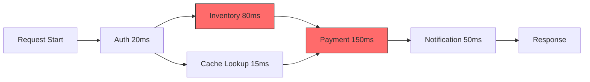
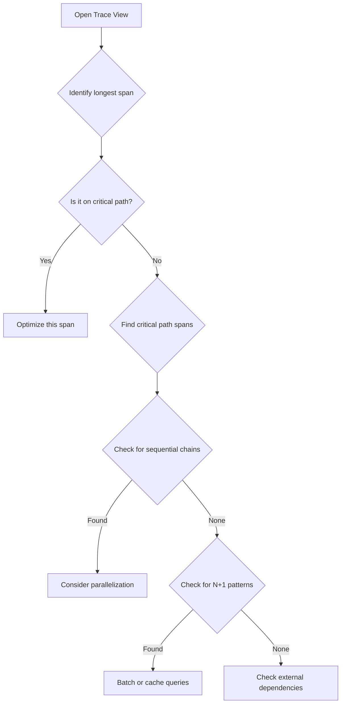
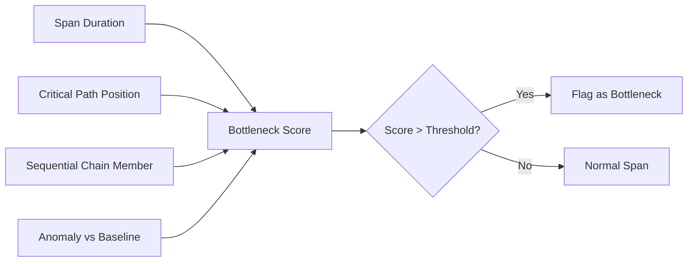
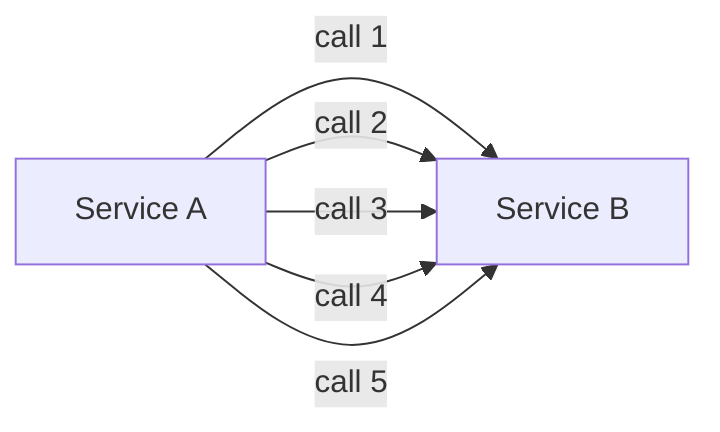

# How to Implement Bottleneck Detection

Author: [nawazdhandala](https://github.com/nawazdhandala)

Tags: Observability, Tracing, Performance, SRE

Description: Learn how to detect performance bottlenecks using distributed tracing data and analysis patterns.

---

Your service latency just doubled. Users are complaining. The dashboard shows everything is "green." CPU is fine. Memory is fine. Error rate is flat.

Where is the time going?

This is the bottleneck detection problem. Distributed tracing gives you the raw data to answer it, but the answer is not always obvious. A trace might have 50 spans across 12 services. Which span is the problem? Is it a single slow operation, or a cascade of sequential calls that should be parallel?

This guide walks through practical patterns for detecting bottlenecks from trace data, from manual analysis to automated detection algorithms you can run in production.

---

## Table of Contents

1. What is a Bottleneck in Distributed Systems?
2. Understanding the Critical Path
3. Manual Bottleneck Analysis
4. Identifying Slow Spans
5. Sequential vs Parallel Operations
6. Automated Bottleneck Detection Algorithms
7. Implementing a Bottleneck Detector
8. Alert on Bottleneck Patterns
9. Common Bottleneck Patterns and Fixes
10. Production Considerations

---

## 1. What is a Bottleneck in Distributed Systems?

A bottleneck is the constraint that limits overall throughput or latency. In tracing terms, it is the span (or chain of spans) that dominates the total request duration.

Key insight: The bottleneck is not always the slowest span. A 50ms span that blocks 10 parallel downstream calls contributes more to latency than a 200ms span running in parallel with other work.

```mermaid
gantt
    title Trace Timeline: Where is the bottleneck?
    dateFormat X
    axisFormat %L ms

    section Request
    HTTP POST /order           :a1, 0, 350

    section Service A
    auth.validate              :a2, 10, 30
    inventory.check            :a3, 40, 120

    section Service B
    payment.process            :a4, 130, 280

    section Service C
    notification.send          :a5, 290, 340
```



In this trace, `payment.process` (150ms) is the largest contributor to latency. But we also see sequential execution: nothing runs in parallel. The real bottleneck might be the *architecture*, not any single span.

---

## 2. Understanding the Critical Path

The critical path is the longest chain of dependent operations from trace start to end. Optimizing spans off the critical path does not reduce overall latency.



The critical path here is: Auth -> Inventory -> Payment -> Notification = 300ms

Cache Lookup (15ms) runs in parallel with Inventory, so optimizing it to 5ms saves nothing. But cutting Inventory from 80ms to 40ms saves 40ms from the total.

### Critical Path Algorithm

To find the critical path programmatically:

```typescript
// critical-path.ts
// Finds the critical path through a trace by analyzing span dependencies

interface Span {
    spanId: string;
    parentSpanId: string | null;
    name: string;
    startTime: number;  // milliseconds
    endTime: number;    // milliseconds
}

interface CriticalPathResult {
    path: Span[];
    totalDuration: number;
}

/**
 * Calculates the critical path through a trace.
 * The critical path is the longest chain of dependent spans
 * that determines the minimum possible trace duration.
 */
function findCriticalPath(spans: Span[]): CriticalPathResult {
    // Build a map for quick span lookup by ID
    const spanMap = new Map<string, Span>();
    for (const span of spans) {
        spanMap.set(span.spanId, span);
    }

    // Build adjacency list: parent -> children
    const children = new Map<string, Span[]>();
    let rootSpan: Span | null = null;

    for (const span of spans) {
        if (span.parentSpanId === null) {
            rootSpan = span;
        } else {
            const siblings = children.get(span.parentSpanId) || [];
            siblings.push(span);
            children.set(span.parentSpanId, siblings);
        }
    }

    if (!rootSpan) {
        return { path: [], totalDuration: 0 };
    }

    // DFS to find the longest path by end time
    // Each span's contribution is its own duration plus
    // the longest path through its children
    function longestPathFrom(span: Span): Span[] {
        const childSpans = children.get(span.spanId) || [];

        if (childSpans.length === 0) {
            // Leaf node: path is just this span
            return [span];
        }

        // Find child with latest end time (critical child)
        let criticalChild: Span | null = null;
        let criticalPath: Span[] = [];

        for (const child of childSpans) {
            const childPath = longestPathFrom(child);
            const pathEndTime = childPath[childPath.length - 1].endTime;

            if (!criticalChild || pathEndTime > criticalChild.endTime) {
                criticalChild = child;
                criticalPath = childPath;
            }
        }

        // Return this span plus the critical child path
        return [span, ...criticalPath];
    }

    const path = longestPathFrom(rootSpan);
    const totalDuration = rootSpan.endTime - rootSpan.startTime;

    return { path, totalDuration };
}

// Example usage
const traceSpans: Span[] = [
    { spanId: 'root', parentSpanId: null, name: 'HTTP POST /order',
      startTime: 0, endTime: 350 },
    { spanId: 'auth', parentSpanId: 'root', name: 'auth.validate',
      startTime: 10, endTime: 30 },
    { spanId: 'inv', parentSpanId: 'root', name: 'inventory.check',
      startTime: 40, endTime: 120 },
    { spanId: 'pay', parentSpanId: 'root', name: 'payment.process',
      startTime: 130, endTime: 280 },
    { spanId: 'notify', parentSpanId: 'root', name: 'notification.send',
      startTime: 290, endTime: 340 },
];

const result = findCriticalPath(traceSpans);
console.log('Critical path spans:', result.path.map(s => s.name));
// Output: ['HTTP POST /order', 'notification.send']
// (last span to end determines the critical path leaf)
```

---

## 3. Manual Bottleneck Analysis

Before automating, understand the manual process. When you open a trace in your observability tool, ask:

1. Which span has the longest duration?
2. Is that span on the critical path?
3. Are there gaps between spans (idle time)?
4. Are operations running sequentially that could run in parallel?
5. Are there repeated spans (N+1 query patterns)?

### Visual Checklist



---

## 4. Identifying Slow Spans

A slow span is one that exceeds expected duration for its operation type. This requires baselines.

### Building Span Duration Baselines

```typescript
// span-baselines.ts
// Tracks duration percentiles per span name to detect anomalies

interface SpanMetric {
    name: string;
    durations: number[];  // Rolling window of recent durations
}

/**
 * Maintains rolling percentile baselines for span durations.
 * Uses a simple array-based approach for clarity.
 * Production systems should use streaming algorithms like t-digest.
 */
class SpanBaselineTracker {
    private baselines: Map<string, number[]> = new Map();
    private readonly maxSamples = 1000;  // Keep last 1000 samples per span name

    /**
     * Record a span duration observation
     */
    record(spanName: string, durationMs: number): void {
        let samples = this.baselines.get(spanName);
        if (!samples) {
            samples = [];
            this.baselines.set(spanName, samples);
        }

        samples.push(durationMs);

        // Trim to max samples (FIFO)
        if (samples.length > this.maxSamples) {
            samples.shift();
        }
    }

    /**
     * Get the p99 duration for a span name.
     * Returns null if insufficient data.
     */
    getP99(spanName: string): number | null {
        const samples = this.baselines.get(spanName);
        if (!samples || samples.length < 100) {
            return null;  // Need minimum samples for reliable percentile
        }

        const sorted = [...samples].sort((a, b) => a - b);
        const p99Index = Math.floor(sorted.length * 0.99);
        return sorted[p99Index];
    }

    /**
     * Check if a span duration is anomalous (exceeds p99 baseline)
     */
    isAnomalous(spanName: string, durationMs: number): boolean {
        const p99 = this.getP99(spanName);
        if (p99 === null) {
            return false;  // Not enough data to judge
        }
        return durationMs > p99;
    }
}

// Usage example
const tracker = new SpanBaselineTracker();

// Record historical spans (normally done continuously)
for (let i = 0; i < 500; i++) {
    tracker.record('db.query.users', 10 + Math.random() * 20);  // 10-30ms typical
    tracker.record('payment.process', 100 + Math.random() * 50); // 100-150ms typical
}

// Check if a new span is slow
const newSpanDuration = 85;  // ms
const isSlowDbQuery = tracker.isAnomalous('db.query.users', newSpanDuration);
console.log(`DB query at ${newSpanDuration}ms is anomalous: ${isSlowDbQuery}`);
// Output: DB query at 85ms is anomalous: true
```

### Slow Span Detection with Thresholds

For production, combine dynamic baselines with static thresholds:

```typescript
// slow-span-detector.ts
// Detects slow spans using both static thresholds and dynamic baselines

interface SlowSpanConfig {
    // Static thresholds by span type (fallback when no baseline exists)
    staticThresholds: Record<string, number>;
    // Multiplier for dynamic baseline (e.g., 2x p99)
    baselineMultiplier: number;
}

interface SlowSpanResult {
    spanName: string;
    duration: number;
    threshold: number;
    thresholdType: 'static' | 'dynamic';
    severity: 'warning' | 'critical';
}

/**
 * Detects slow spans using configurable thresholds.
 * Falls back to static thresholds when dynamic baselines unavailable.
 */
function detectSlowSpans(
    spans: Span[],
    tracker: SpanBaselineTracker,
    config: SlowSpanConfig
): SlowSpanResult[] {
    const results: SlowSpanResult[] = [];

    for (const span of spans) {
        const duration = span.endTime - span.startTime;
        const p99 = tracker.getP99(span.name);

        let threshold: number;
        let thresholdType: 'static' | 'dynamic';

        if (p99 !== null) {
            // Use dynamic baseline
            threshold = p99 * config.baselineMultiplier;
            thresholdType = 'dynamic';
        } else {
            // Fall back to static threshold
            threshold = config.staticThresholds[span.name]
                || config.staticThresholds['default']
                || 1000;
            thresholdType = 'static';
        }

        if (duration > threshold) {
            // Determine severity: 2x threshold = critical
            const severity = duration > threshold * 2 ? 'critical' : 'warning';

            results.push({
                spanName: span.name,
                duration,
                threshold,
                thresholdType,
                severity
            });
        }
    }

    return results;
}

// Configuration example
const config: SlowSpanConfig = {
    staticThresholds: {
        'db.query': 100,           // DB queries should be under 100ms
        'http.client': 500,        // External HTTP calls under 500ms
        'cache.get': 10,           // Cache hits under 10ms
        'default': 1000            // Everything else under 1s
    },
    baselineMultiplier: 1.5        // Flag spans at 1.5x their p99
};
```

---

## 5. Sequential vs Parallel Operations

One of the most impactful bottleneck patterns is sequential execution where parallel execution is possible.

### Detecting Sequential Patterns

```mermaid
gantt
    title Sequential Pattern (Bad)
    dateFormat X
    axisFormat %L ms

    section Sequential
    fetch user         :a1, 0, 50
    fetch orders       :a2, 50, 100
    fetch preferences  :a3, 100, 130
    fetch recommendations :a4, 130, 180
```

```mermaid
gantt
    title Parallel Pattern (Good)
    dateFormat X
    axisFormat %L ms

    section Parallel
    fetch user              :a1, 0, 50
    fetch orders            :a2, 0, 50
    fetch preferences       :a3, 0, 30
    fetch recommendations   :a4, 0, 50
```





Sequential: 180ms total. Parallel: 50ms total.

### Sequential Pattern Detector

```typescript
// sequential-detector.ts
// Detects spans that run sequentially but could potentially run in parallel

interface SequentialChain {
    spans: Span[];
    totalDuration: number;
    parallelPotential: number;  // Time saved if parallelized
}

/**
 * Detects chains of sequential spans under the same parent.
 * Sequential = span N starts after span N-1 ends (within tolerance).
 */
function detectSequentialChains(
    spans: Span[],
    toleranceMs: number = 5  // Allow small gaps
): SequentialChain[] {
    // Group spans by parent
    const byParent = new Map<string, Span[]>();

    for (const span of spans) {
        if (span.parentSpanId) {
            const siblings = byParent.get(span.parentSpanId) || [];
            siblings.push(span);
            byParent.set(span.parentSpanId, siblings);
        }
    }

    const chains: SequentialChain[] = [];

    for (const [parentId, siblings] of byParent) {
        if (siblings.length < 2) continue;

        // Sort by start time
        const sorted = [...siblings].sort((a, b) => a.startTime - b.startTime);

        // Find sequential chains
        let currentChain: Span[] = [sorted[0]];

        for (let i = 1; i < sorted.length; i++) {
            const prev = sorted[i - 1];
            const curr = sorted[i];

            // Check if current starts after previous ends (sequential)
            const gap = curr.startTime - prev.endTime;

            if (gap >= 0 && gap <= toleranceMs) {
                // Sequential: add to current chain
                currentChain.push(curr);
            } else if (gap > toleranceMs) {
                // Gap too large: finalize current chain, start new one
                if (currentChain.length >= 2) {
                    chains.push(buildChainResult(currentChain));
                }
                currentChain = [curr];
            } else {
                // Overlapping (parallel): finalize current chain
                if (currentChain.length >= 2) {
                    chains.push(buildChainResult(currentChain));
                }
                currentChain = [curr];
            }
        }

        // Don't forget the last chain
        if (currentChain.length >= 2) {
            chains.push(buildChainResult(currentChain));
        }
    }

    return chains;
}

/**
 * Builds a SequentialChain result from a list of sequential spans.
 * Calculates potential time savings from parallelization.
 */
function buildChainResult(spans: Span[]): SequentialChain {
    const totalDuration = spans.reduce(
        (sum, s) => sum + (s.endTime - s.startTime),
        0
    );

    // If parallelized, duration = max single span duration
    const maxSpanDuration = Math.max(
        ...spans.map(s => s.endTime - s.startTime)
    );

    const parallelPotential = totalDuration - maxSpanDuration;

    return {
        spans,
        totalDuration,
        parallelPotential
    };
}

// Example: Detect sequential patterns in a trace
const exampleSpans: Span[] = [
    { spanId: 'root', parentSpanId: null, name: 'handler',
      startTime: 0, endTime: 200 },
    { spanId: 's1', parentSpanId: 'root', name: 'fetch.user',
      startTime: 10, endTime: 60 },
    { spanId: 's2', parentSpanId: 'root', name: 'fetch.orders',
      startTime: 62, endTime: 112 },  // Starts right after s1
    { spanId: 's3', parentSpanId: 'root', name: 'fetch.prefs',
      startTime: 115, endTime: 145 }, // Starts right after s2
];

const sequentialChains = detectSequentialChains(exampleSpans);
for (const chain of sequentialChains) {
    console.log(`Sequential chain found: ${chain.spans.map(s => s.name).join(' -> ')}`);
    console.log(`  Total duration: ${chain.totalDuration}ms`);
    console.log(`  Could save: ${chain.parallelPotential}ms if parallelized`);
}
// Output:
// Sequential chain found: fetch.user -> fetch.orders -> fetch.prefs
//   Total duration: 135ms
//   Could save: 85ms if parallelized
```

---

## 6. Automated Bottleneck Detection Algorithms

Now let's combine these techniques into a comprehensive bottleneck detector.

### The Bottleneck Score Algorithm

We assign each span a "bottleneck score" based on multiple factors:



### Bottleneck Score Factors

| Factor | Weight | Description |
|--------|--------|-------------|
| Duration Ratio | 0.3 | Span duration / trace duration |
| Critical Path | 0.25 | 1.0 if on critical path, 0.0 otherwise |
| Sequential Penalty | 0.2 | Higher if part of sequential chain that could parallelize |
| Baseline Anomaly | 0.15 | 1.0 if exceeds p99, scaled otherwise |
| Child Fan-out | 0.1 | Penalty for spans that block many children |

```typescript
// bottleneck-score.ts
// Calculates a bottleneck score for each span in a trace

interface BottleneckAnalysis {
    span: Span;
    score: number;
    factors: {
        durationRatio: number;
        criticalPath: number;
        sequentialPenalty: number;
        baselineAnomaly: number;
        fanOutPenalty: number;
    };
    isBottleneck: boolean;
}

interface BottleneckConfig {
    weights: {
        durationRatio: number;
        criticalPath: number;
        sequentialPenalty: number;
        baselineAnomaly: number;
        fanOutPenalty: number;
    };
    bottleneckThreshold: number;  // Score above this = bottleneck
}

const defaultConfig: BottleneckConfig = {
    weights: {
        durationRatio: 0.30,
        criticalPath: 0.25,
        sequentialPenalty: 0.20,
        baselineAnomaly: 0.15,
        fanOutPenalty: 0.10
    },
    bottleneckThreshold: 0.5
};

/**
 * Analyzes all spans in a trace and calculates bottleneck scores.
 * Returns spans sorted by bottleneck score (highest first).
 */
function analyzeBottlenecks(
    spans: Span[],
    tracker: SpanBaselineTracker,
    config: BottleneckConfig = defaultConfig
): BottleneckAnalysis[] {
    // Pre-compute trace-level metrics
    const traceDuration = computeTraceDuration(spans);
    const criticalPathSpans = new Set(
        findCriticalPath(spans).path.map(s => s.spanId)
    );
    const sequentialChains = detectSequentialChains(spans);
    const sequentialSpanIds = new Set(
        sequentialChains.flatMap(c => c.spans.map(s => s.spanId))
    );
    const childCounts = computeChildCounts(spans);

    // Calculate score for each span
    const analyses: BottleneckAnalysis[] = spans.map(span => {
        const duration = span.endTime - span.startTime;

        // Factor 1: Duration ratio (what % of trace is this span?)
        const durationRatio = Math.min(duration / traceDuration, 1.0);

        // Factor 2: Critical path (binary)
        const criticalPath = criticalPathSpans.has(span.spanId) ? 1.0 : 0.0;

        // Factor 3: Sequential penalty
        // Higher penalty for spans in long sequential chains
        let sequentialPenalty = 0;
        if (sequentialSpanIds.has(span.spanId)) {
            const chain = sequentialChains.find(
                c => c.spans.some(s => s.spanId === span.spanId)
            );
            if (chain && chain.parallelPotential > 0) {
                // Penalty scales with potential savings
                sequentialPenalty = Math.min(
                    chain.parallelPotential / traceDuration,
                    1.0
                );
            }
        }

        // Factor 4: Baseline anomaly
        let baselineAnomaly = 0;
        const p99 = tracker.getP99(span.name);
        if (p99 !== null && duration > p99) {
            // Scale from 0 to 1 based on how far over p99
            baselineAnomaly = Math.min((duration - p99) / p99, 1.0);
        }

        // Factor 5: Fan-out penalty (spans that block many children)
        const childCount = childCounts.get(span.spanId) || 0;
        const fanOutPenalty = Math.min(childCount / 10, 1.0);  // Cap at 10 children

        // Weighted sum
        const score =
            config.weights.durationRatio * durationRatio +
            config.weights.criticalPath * criticalPath +
            config.weights.sequentialPenalty * sequentialPenalty +
            config.weights.baselineAnomaly * baselineAnomaly +
            config.weights.fanOutPenalty * fanOutPenalty;

        return {
            span,
            score,
            factors: {
                durationRatio,
                criticalPath,
                sequentialPenalty,
                baselineAnomaly,
                fanOutPenalty
            },
            isBottleneck: score >= config.bottleneckThreshold
        };
    });

    // Sort by score descending
    return analyses.sort((a, b) => b.score - a.score);
}

/**
 * Computes total trace duration from spans
 */
function computeTraceDuration(spans: Span[]): number {
    if (spans.length === 0) return 0;
    const minStart = Math.min(...spans.map(s => s.startTime));
    const maxEnd = Math.max(...spans.map(s => s.endTime));
    return maxEnd - minStart;
}

/**
 * Counts children per span
 */
function computeChildCounts(spans: Span[]): Map<string, number> {
    const counts = new Map<string, number>();
    for (const span of spans) {
        if (span.parentSpanId) {
            counts.set(
                span.parentSpanId,
                (counts.get(span.parentSpanId) || 0) + 1
            );
        }
    }
    return counts;
}
```

---

## 7. Implementing a Bottleneck Detector

Let's put it all together into a production-ready bottleneck detector class.

```typescript
// bottleneck-detector.ts
// Complete bottleneck detection system for distributed traces

import { trace, context, Span as OtelSpan } from '@opentelemetry/api';

interface TraceData {
    traceId: string;
    spans: Span[];
}

interface BottleneckReport {
    traceId: string;
    traceDuration: number;
    bottlenecks: BottleneckAnalysis[];
    sequentialChains: SequentialChain[];
    criticalPath: Span[];
    recommendations: string[];
}

/**
 * Production bottleneck detector.
 * Analyzes traces and generates actionable reports.
 */
class BottleneckDetector {
    private baselineTracker: SpanBaselineTracker;
    private config: BottleneckConfig;

    constructor(config?: Partial<BottleneckConfig>) {
        this.baselineTracker = new SpanBaselineTracker();
        this.config = { ...defaultConfig, ...config };
    }

    /**
     * Ingest a trace for baseline learning.
     * Call this for every trace to build up baselines.
     */
    ingestForBaseline(trace: TraceData): void {
        for (const span of trace.spans) {
            const duration = span.endTime - span.startTime;
            this.baselineTracker.record(span.name, duration);
        }
    }

    /**
     * Analyze a trace for bottlenecks.
     * Returns a detailed report with recommendations.
     */
    analyze(traceData: TraceData): BottleneckReport {
        const analyses = analyzeBottlenecks(
            traceData.spans,
            this.baselineTracker,
            this.config
        );

        const bottlenecks = analyses.filter(a => a.isBottleneck);
        const sequentialChains = detectSequentialChains(traceData.spans);
        const criticalPathResult = findCriticalPath(traceData.spans);

        // Generate recommendations
        const recommendations = this.generateRecommendations(
            bottlenecks,
            sequentialChains,
            criticalPathResult.path
        );

        return {
            traceId: traceData.traceId,
            traceDuration: computeTraceDuration(traceData.spans),
            bottlenecks,
            sequentialChains,
            criticalPath: criticalPathResult.path,
            recommendations
        };
    }

    /**
     * Generate human-readable recommendations from analysis.
     */
    private generateRecommendations(
        bottlenecks: BottleneckAnalysis[],
        chains: SequentialChain[],
        criticalPath: Span[]
    ): string[] {
        const recommendations: string[] = [];

        // Recommendation 1: Top bottleneck span
        if (bottlenecks.length > 0) {
            const top = bottlenecks[0];
            const duration = top.span.endTime - top.span.startTime;
            recommendations.push(
                `Optimize "${top.span.name}" (${duration}ms) - ` +
                `highest bottleneck score (${top.score.toFixed(2)})`
            );

            if (top.factors.baselineAnomaly > 0.5) {
                recommendations.push(
                    `"${top.span.name}" is significantly slower than baseline - ` +
                    `investigate recent changes`
                );
            }
        }

        // Recommendation 2: Sequential chains
        for (const chain of chains) {
            if (chain.parallelPotential > 50) {  // More than 50ms savings
                const names = chain.spans.map(s => s.name).join(', ');
                recommendations.push(
                    `Parallelize [${names}] - ` +
                    `potential ${chain.parallelPotential}ms savings`
                );
            }
        }

        // Recommendation 3: Critical path optimization
        const criticalPathOnlySpans = criticalPath.filter(
            s => s.parentSpanId !== null  // Exclude root
        );
        if (criticalPathOnlySpans.length > 3) {
            recommendations.push(
                `Critical path has ${criticalPathOnlySpans.length} spans - ` +
                `consider reducing dependency chain depth`
            );
        }

        return recommendations;
    }
}

// Usage example
const detector = new BottleneckDetector({
    bottleneckThreshold: 0.4  // More sensitive detection
});

// Ingest historical traces for baselining
historicalTraces.forEach(t => detector.ingestForBaseline(t));

// Analyze a problematic trace
const report = detector.analyze(slowTrace);

console.log(`Trace ${report.traceId} analysis:`);
console.log(`Total duration: ${report.traceDuration}ms`);
console.log(`\nBottlenecks found: ${report.bottlenecks.length}`);
for (const b of report.bottlenecks) {
    console.log(`  - ${b.span.name}: score=${b.score.toFixed(2)}`);
}
console.log(`\nRecommendations:`);
for (const rec of report.recommendations) {
    console.log(`  - ${rec}`);
}
```

---

## 8. Alert on Bottleneck Patterns

Integrate bottleneck detection into your alerting pipeline.

```typescript
// bottleneck-alerter.ts
// Alerts when traces consistently show bottleneck patterns

interface AlertRule {
    name: string;
    condition: (report: BottleneckReport) => boolean;
    severity: 'info' | 'warning' | 'critical';
    message: (report: BottleneckReport) => string;
}

const alertRules: AlertRule[] = [
    {
        name: 'high-bottleneck-score',
        condition: (r) => r.bottlenecks.some(b => b.score > 0.8),
        severity: 'critical',
        message: (r) => {
            const top = r.bottlenecks[0];
            return `Critical bottleneck in ${top.span.name} (score: ${top.score.toFixed(2)})`;
        }
    },
    {
        name: 'parallelizable-sequential-chain',
        condition: (r) => r.sequentialChains.some(c => c.parallelPotential > 100),
        severity: 'warning',
        message: (r) => {
            const chain = r.sequentialChains.find(c => c.parallelPotential > 100)!;
            return `Sequential chain could save ${chain.parallelPotential}ms if parallelized`;
        }
    },
    {
        name: 'deep-critical-path',
        condition: (r) => r.criticalPath.length > 10,
        severity: 'info',
        message: (r) => `Critical path depth is ${r.criticalPath.length} - consider flattening`
    }
];

/**
 * Evaluates alert rules against a bottleneck report.
 * Returns alerts that should be fired.
 */
function evaluateAlerts(report: BottleneckReport): Array<{
    rule: string;
    severity: string;
    message: string;
}> {
    const alerts = [];

    for (const rule of alertRules) {
        if (rule.condition(report)) {
            alerts.push({
                rule: rule.name,
                severity: rule.severity,
                message: rule.message(report)
            });
        }
    }

    return alerts;
}

// Integration with trace processing pipeline
async function processTrace(traceData: TraceData): Promise<void> {
    const detector = getBottleneckDetector();  // Singleton

    // Always ingest for baselines
    detector.ingestForBaseline(traceData);

    // Only analyze slow traces (tail sampling in action)
    const duration = computeTraceDuration(traceData.spans);
    if (duration > getP99Threshold()) {
        const report = detector.analyze(traceData);
        const alerts = evaluateAlerts(report);

        for (const alert of alerts) {
            await sendAlert(alert);  // Your alerting system
        }
    }
}
```

---

## 9. Common Bottleneck Patterns and Fixes

### Pattern 1: N+1 Query Problem

```mermaid
gantt
    title N+1 Query Pattern
    dateFormat X
    axisFormat %L ms

    section Handler
    fetch orders       :a1, 0, 20

    section DB Queries
    get order 1        :b1, 25, 35
    get order 2        :b2, 40, 50
    get order 3        :b3, 55, 65
    get order 4        :b4, 70, 80
    get order 5        :b5, 85, 95
```



**Detection:** Multiple spans with same name, sequential execution, short individual duration.

**Fix:** Batch queries or use DataLoader pattern.

### Pattern 2: Synchronous External Calls

```mermaid
gantt
    title Synchronous External Calls
    dateFormat X
    axisFormat %L ms

    section Handler
    process request    :a1, 0, 400

    section External
    call service A     :b1, 10, 110
    call service B     :b2, 115, 265
    call service C     :b3, 270, 390
```

**Detection:** Multiple CLIENT spans to different services, sequential.

**Fix:** Use Promise.all or concurrent requests.

```typescript
// Before: Sequential (bad)
const userResult = await fetchUser(userId);
const ordersResult = await fetchOrders(userId);
const prefsResult = await fetchPreferences(userId);

// After: Parallel (good)
const [userResult, ordersResult, prefsResult] = await Promise.all([
    fetchUser(userId),
    fetchOrders(userId),
    fetchPreferences(userId)
]);
```

### Pattern 3: Missing Cache

```mermaid
gantt
    title Missing Cache Pattern
    dateFormat X
    axisFormat %L ms

    section Request 1
    db.query.config    :a1, 0, 50

    section Request 2
    db.query.config    :a2, 0, 50

    section Request 3
    db.query.config    :a3, 0, 50
```



**Detection:** Same span name with identical attributes across different traces, stable duration.

**Fix:** Add caching layer.

### Pattern 4: Chatty Service Communication



**Detection:** Multiple CLIENT spans to same downstream service within single trace.

**Fix:** Batch API, GraphQL, or service aggregation.

---

## 10. Production Considerations

### Sampling Strategy for Bottleneck Detection

You cannot analyze traces you did not collect. Use tail-based sampling to keep interesting traces:

```yaml
# otel-collector-config.yaml
processors:
  tail_sampling:
    decision_wait: 10s
    num_traces: 100000
    policies:
      # Keep all slow traces for bottleneck analysis
      - name: slow-traces
        type: latency
        latency:
          threshold_ms: 500

      # Keep traces with errors
      - name: error-traces
        type: status_code
        status_code:
          status_codes: [ERROR]

      # Sample baseline for comparison
      - name: baseline-sample
        type: probabilistic
        probabilistic:
          sampling_percentage: 5
```

### Storage and Query Patterns

For bottleneck detection at scale:

1. **Store span durations in a time-series database** for baseline computation
2. **Index traces by duration** for fast retrieval of slow traces
3. **Pre-compute critical paths** during ingestion for frequently-accessed traces
4. **Aggregate bottleneck scores** by service and span name for trend analysis

### Dashboard Metrics

Track these metrics for bottleneck visibility:

| Metric | Description |
|--------|-------------|
| `bottleneck.score.p99` | 99th percentile bottleneck score by service |
| `bottleneck.count` | Number of traces with bottlenecks detected |
| `sequential_chain.potential_savings` | Histogram of parallelization opportunities |
| `critical_path.depth` | Distribution of critical path lengths |
| `span.duration.anomaly_rate` | Rate of spans exceeding baseline |

---

## Summary

Bottleneck detection with traces is a multi-step process:

1. **Understand the critical path** to know which optimizations will actually reduce latency
2. **Build baselines** to distinguish normal slow from anomalous slow
3. **Detect sequential patterns** that could be parallelized
4. **Score bottlenecks** using multiple weighted factors
5. **Alert proactively** when bottleneck patterns emerge
6. **Apply pattern-specific fixes** for N+1, missing cache, chatty services

The code in this guide gives you a starting point. Adapt the thresholds and weights to your system's characteristics. What constitutes a bottleneck in a real-time trading system differs from a batch processing pipeline.

Traces give you the data. Analysis gives you the insight. Action gives you the performance.

---

**Related Reading:**

- [What are Traces and Spans in OpenTelemetry](https://oneuptime.com/blog/post/2025-08-27-traces-and-spans-in-opentelemetry/view)
- [Logs, Metrics and Traces: The Three Pillars of Observability](https://oneuptime.com/blog/post/2025-08-20-three-pillars-of-observability-logs-metrics-traces/view)
- [How to Reduce Noise in OpenTelemetry](https://oneuptime.com/blog/post/2025-08-25-how-to-reduce-noise-in-opentelemetry/view)
