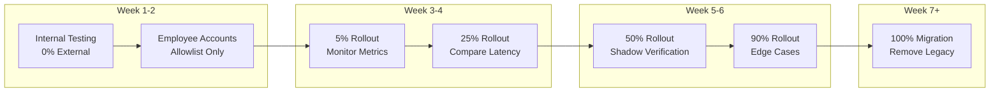

# How to Create Branch by Abstraction Pattern

Author: [nawazdhandala](https://github.com/nawazdhandala)

Tags: Software Architecture, Refactoring, Continuous Delivery, Design Patterns, Legacy Code

Description: A hands-on guide to replacing legacy components without feature branches or big-bang deployments. Learn how to implement the Branch by Abstraction pattern with production-ready code examples and step-by-step migration strategies.

---

Long-running feature branches create merge nightmares. Big-bang replacements cause outages. The Branch by Abstraction pattern solves both problems by letting you swap out legacy components incrementally while keeping the main branch deployable at every commit.

## What is Branch by Abstraction?

Branch by Abstraction is a technique for making large-scale changes to a codebase incrementally. Instead of creating a long-lived feature branch, you introduce an abstraction layer that allows old and new implementations to coexist. You then gradually migrate consumers to the new implementation and eventually remove the old one.

Martin Fowler popularized this pattern as an alternative to feature branching for significant refactoring work.

```mermaid
flowchart TB
    subgraph "Phase 1: Add Abstraction"
        A1[Client Code] --> B1[Legacy Implementation]
    end

    subgraph "Phase 2: Introduce Interface"
        A2[Client Code] --> I2[Abstraction Layer]
        I2 --> B2[Legacy Implementation]
    end

    subgraph "Phase 3: Add New Implementation"
        A3[Client Code] --> I3[Abstraction Layer]
        I3 --> B3[Legacy Implementation]
        I3 -.-> C3[New Implementation]
    end

    subgraph "Phase 4: Migrate Gradually"
        A4[Client Code] --> I4[Abstraction Layer]
        I4 -.-> B4[Legacy Implementation]
        I4 --> C4[New Implementation]
    end

    subgraph "Phase 5: Remove Legacy"
        A5[Client Code] --> I5[Abstraction Layer]
        I5 --> C5[New Implementation]
    end
```



## When to Use Branch by Abstraction

Use this pattern when you need to:

- Replace a database or ORM layer
- Swap out a third-party service provider
- Migrate from a monolith to microservices
- Upgrade a major framework version
- Replace a home-grown solution with an off-the-shelf product

The pattern works best when the component you want to replace has a clear boundary and multiple consumers.

## Step-by-Step Implementation

Let us walk through a real scenario: replacing a legacy payment processor with a new one.

### Step 1: Identify the Component to Replace

First, audit your codebase to find all places that interact with the legacy system. In this example, we have a payment service called directly from multiple controllers.

```typescript
// The legacy payment processor is called directly throughout the codebase.
// This tight coupling makes it impossible to swap implementations safely.
// File: src/controllers/checkout.controller.ts

import { LegacyStripePayment } from '../services/legacy-stripe-payment';

export class CheckoutController {
    private payment = new LegacyStripePayment();

    async processOrder(order: Order): Promise<PaymentResult> {
        // Direct dependency on legacy implementation
        // Any change here affects all 47 files using LegacyStripePayment
        const result = await this.payment.charge(
            order.customerId,
            order.totalAmount,
            order.currency
        );
        return result;
    }
}
```

### Step 2: Create the Abstraction Layer

Define an interface that captures the contract your consumers need. This interface should be implementation-agnostic and focused on business operations.

```typescript
// Define a payment gateway interface that captures what consumers need,
// not how any specific provider implements it.
// File: src/interfaces/payment-gateway.interface.ts

export interface PaymentResult {
    transactionId: string;
    status: 'success' | 'failed' | 'pending';
    amount: number;
    currency: string;
    timestamp: Date;
    metadata?: Record<string, unknown>;
}

export interface RefundResult {
    refundId: string;
    originalTransactionId: string;
    amount: number;
    status: 'success' | 'failed' | 'pending';
}

export interface PaymentGateway {
    // Core payment operations that any provider must support
    charge(customerId: string, amount: number, currency: string): Promise<PaymentResult>;
    refund(transactionId: string, amount?: number): Promise<RefundResult>;
    getTransaction(transactionId: string): Promise<PaymentResult | null>;

    // Health check for circuit breaker patterns
    healthCheck(): Promise<boolean>;
}
```

### Step 3: Wrap the Legacy Implementation

Create an adapter that implements your new interface while delegating to the legacy code. This allows existing functionality to continue working through the abstraction.

```typescript
// Adapter that wraps the legacy implementation behind the new interface.
// No behavior changes here, just translation between contracts.
// File: src/services/legacy-stripe-adapter.ts

import { PaymentGateway, PaymentResult, RefundResult } from '../interfaces/payment-gateway.interface';
import { LegacyStripePayment } from './legacy-stripe-payment';

export class LegacyStripeAdapter implements PaymentGateway {
    private legacy: LegacyStripePayment;

    constructor() {
        this.legacy = new LegacyStripePayment();
    }

    async charge(customerId: string, amount: number, currency: string): Promise<PaymentResult> {
        // Translate from legacy response format to our standard interface
        const legacyResult = await this.legacy.charge(customerId, amount, currency);

        return {
            transactionId: legacyResult.id,
            status: this.mapStatus(legacyResult.state),
            amount: legacyResult.amount_cents / 100,
            currency: legacyResult.currency_code,
            timestamp: new Date(legacyResult.created_at * 1000),
            metadata: { legacyId: legacyResult.id }
        };
    }

    async refund(transactionId: string, amount?: number): Promise<RefundResult> {
        const legacyResult = await this.legacy.issueRefund(transactionId, amount);

        return {
            refundId: legacyResult.refund_id,
            originalTransactionId: transactionId,
            amount: legacyResult.refunded_amount / 100,
            status: legacyResult.success ? 'success' : 'failed'
        };
    }

    async getTransaction(transactionId: string): Promise<PaymentResult | null> {
        const legacyResult = await this.legacy.fetchTransaction(transactionId);
        if (!legacyResult) return null;

        return {
            transactionId: legacyResult.id,
            status: this.mapStatus(legacyResult.state),
            amount: legacyResult.amount_cents / 100,
            currency: legacyResult.currency_code,
            timestamp: new Date(legacyResult.created_at * 1000)
        };
    }

    async healthCheck(): Promise<boolean> {
        try {
            await this.legacy.ping();
            return true;
        } catch {
            return false;
        }
    }

    // Map legacy status strings to our standardized enum
    private mapStatus(legacyState: string): 'success' | 'failed' | 'pending' {
        const statusMap: Record<string, 'success' | 'failed' | 'pending'> = {
            'completed': 'success',
            'succeeded': 'success',
            'charged': 'success',
            'declined': 'failed',
            'error': 'failed',
            'processing': 'pending',
            'pending_capture': 'pending'
        };
        return statusMap[legacyState] || 'pending';
    }
}
```

### Step 4: Implement the New Provider

Build the replacement implementation against the same interface. This can happen in parallel with ongoing feature work since everything stays on the main branch.

```typescript
// New payment provider implementation using the modern API.
// Built against the same interface so it can be swapped in seamlessly.
// File: src/services/modern-payment-provider.ts

import { PaymentGateway, PaymentResult, RefundResult } from '../interfaces/payment-gateway.interface';

interface ModernPaymentConfig {
    apiKey: string;
    apiSecret: string;
    environment: 'sandbox' | 'production';
    timeout: number;
}

export class ModernPaymentProvider implements PaymentGateway {
    private config: ModernPaymentConfig;
    private baseUrl: string;

    constructor(config: ModernPaymentConfig) {
        this.config = config;
        this.baseUrl = config.environment === 'production'
            ? 'https://api.modernpay.com/v2'
            : 'https://sandbox.modernpay.com/v2';
    }

    async charge(customerId: string, amount: number, currency: string): Promise<PaymentResult> {
        const response = await fetch(`${this.baseUrl}/charges`, {
            method: 'POST',
            headers: this.buildHeaders(),
            body: JSON.stringify({
                customer_id: customerId,
                amount: Math.round(amount * 100),
                currency: currency.toUpperCase(),
                idempotency_key: this.generateIdempotencyKey()
            }),
            signal: AbortSignal.timeout(this.config.timeout)
        });

        if (!response.ok) {
            throw new Error(`Payment failed: ${response.status}`);
        }

        const data = await response.json();

        return {
            transactionId: data.charge_id,
            status: data.status,
            amount: data.amount / 100,
            currency: data.currency,
            timestamp: new Date(data.created_at)
        };
    }

    async refund(transactionId: string, amount?: number): Promise<RefundResult> {
        const response = await fetch(`${this.baseUrl}/refunds`, {
            method: 'POST',
            headers: this.buildHeaders(),
            body: JSON.stringify({
                charge_id: transactionId,
                amount: amount ? Math.round(amount * 100) : undefined
            })
        });

        const data = await response.json();

        return {
            refundId: data.refund_id,
            originalTransactionId: transactionId,
            amount: data.amount / 100,
            status: data.status
        };
    }

    async getTransaction(transactionId: string): Promise<PaymentResult | null> {
        const response = await fetch(`${this.baseUrl}/charges/${transactionId}`, {
            headers: this.buildHeaders()
        });

        if (response.status === 404) return null;

        const data = await response.json();

        return {
            transactionId: data.charge_id,
            status: data.status,
            amount: data.amount / 100,
            currency: data.currency,
            timestamp: new Date(data.created_at)
        };
    }

    async healthCheck(): Promise<boolean> {
        try {
            const response = await fetch(`${this.baseUrl}/health`, {
                headers: this.buildHeaders(),
                signal: AbortSignal.timeout(5000)
            });
            return response.ok;
        } catch {
            return false;
        }
    }

    private buildHeaders(): Record<string, string> {
        return {
            'Content-Type': 'application/json',
            'Authorization': `Bearer ${this.config.apiKey}`,
            'X-Api-Version': '2024-01'
        };
    }

    private generateIdempotencyKey(): string {
        return `${Date.now()}-${Math.random().toString(36).substring(2, 15)}`;
    }
}
```

### Step 5: Build a Feature Toggle Router

Create a factory or router that selects the implementation based on configuration or feature flags. This enables gradual rollout and instant rollback.

```typescript
// Factory that routes to the appropriate implementation based on feature flags.
// Supports gradual rollout percentages and instant rollback via config.
// File: src/services/payment-gateway.factory.ts

import { PaymentGateway } from '../interfaces/payment-gateway.interface';
import { LegacyStripeAdapter } from './legacy-stripe-adapter';
import { ModernPaymentProvider } from './modern-payment-provider';

interface FeatureFlags {
    useModernPayment: boolean;
    modernPaymentRolloutPercent: number;
    modernPaymentAllowlist: string[];
}

export class PaymentGatewayFactory {
    private legacyAdapter: LegacyStripeAdapter;
    private modernProvider: ModernPaymentProvider;
    private flags: FeatureFlags;

    constructor(flags: FeatureFlags) {
        this.flags = flags;
        this.legacyAdapter = new LegacyStripeAdapter();
        this.modernProvider = new ModernPaymentProvider({
            apiKey: process.env.MODERN_PAYMENT_API_KEY!,
            apiSecret: process.env.MODERN_PAYMENT_API_SECRET!,
            environment: process.env.NODE_ENV === 'production' ? 'production' : 'sandbox',
            timeout: 30000
        });
    }

    // Returns the appropriate implementation for a given customer
    getGateway(customerId: string): PaymentGateway {
        // Feature flag completely off: use legacy
        if (!this.flags.useModernPayment) {
            return this.legacyAdapter;
        }

        // Explicit allowlist for beta testers or internal accounts
        if (this.flags.modernPaymentAllowlist.includes(customerId)) {
            return this.modernProvider;
        }

        // Percentage-based rollout using consistent hashing
        // Same customer always gets the same implementation
        const hash = this.hashCustomerId(customerId);
        const bucket = hash % 100;

        if (bucket < this.flags.modernPaymentRolloutPercent) {
            return this.modernProvider;
        }

        return this.legacyAdapter;
    }

    // Consistent hash ensures a customer stays on the same provider
    // until we change the rollout percentage
    private hashCustomerId(customerId: string): number {
        let hash = 0;
        for (let i = 0; i < customerId.length; i++) {
            const char = customerId.charCodeAt(i);
            hash = ((hash << 5) - hash) + char;
            hash = hash & hash;
        }
        return Math.abs(hash);
    }
}
```

### Step 6: Migrate Consumers Incrementally

Update consumers to use dependency injection with the factory. You can migrate files one at a time, deploying continuously.

```typescript
// Updated controller using dependency injection.
// The implementation is selected at runtime based on feature flags.
// File: src/controllers/checkout.controller.ts

import { PaymentGateway } from '../interfaces/payment-gateway.interface';
import { PaymentGatewayFactory } from '../services/payment-gateway.factory';

export class CheckoutController {
    private gatewayFactory: PaymentGatewayFactory;

    constructor(gatewayFactory: PaymentGatewayFactory) {
        this.gatewayFactory = gatewayFactory;
    }

    async processOrder(order: Order): Promise<PaymentResult> {
        // Get the appropriate gateway for this customer
        const gateway = this.gatewayFactory.getGateway(order.customerId);

        const result = await gateway.charge(
            order.customerId,
            order.totalAmount,
            order.currency
        );

        // Log which implementation was used for debugging
        console.log(`Processed order ${order.id} via ${gateway.constructor.name}`);

        return result;
    }
}
```

## Verification Strategy with Parallel Runs

Before fully trusting the new implementation, run both in parallel and compare results. This catches subtle differences without affecting users.

```typescript
// Verification decorator that runs both implementations and compares results.
// Logs discrepancies but returns the primary (legacy) result to users.
// File: src/services/payment-verification.wrapper.ts

import { PaymentGateway, PaymentResult, RefundResult } from '../interfaces/payment-gateway.interface';

interface VerificationResult {
    match: boolean;
    primary: PaymentResult;
    shadow?: PaymentResult;
    differences?: string[];
}

export class PaymentVerificationWrapper implements PaymentGateway {
    constructor(
        private primary: PaymentGateway,
        private shadow: PaymentGateway,
        private onMismatch: (diff: VerificationResult) => void
    ) {}

    async charge(customerId: string, amount: number, currency: string): Promise<PaymentResult> {
        // Run both implementations concurrently
        const [primaryResult, shadowResult] = await Promise.allSettled([
            this.primary.charge(customerId, amount, currency),
            this.shadow.charge(customerId, amount, currency)
        ]);

        // Primary failed: throw the error (do not mask failures)
        if (primaryResult.status === 'rejected') {
            throw primaryResult.reason;
        }

        // Compare results if shadow succeeded
        if (shadowResult.status === 'fulfilled') {
            const differences = this.compareResults(primaryResult.value, shadowResult.value);

            if (differences.length > 0) {
                this.onMismatch({
                    match: false,
                    primary: primaryResult.value,
                    shadow: shadowResult.value,
                    differences
                });
            }
        } else {
            // Shadow failed but primary succeeded: log for investigation
            console.warn('Shadow payment failed:', shadowResult.reason);
        }

        // Always return primary result to maintain existing behavior
        return primaryResult.value;
    }

    async refund(transactionId: string, amount?: number): Promise<RefundResult> {
        // For financial operations that modify state, only run primary
        // Shadow verification should use read-only operations
        return this.primary.refund(transactionId, amount);
    }

    async getTransaction(transactionId: string): Promise<PaymentResult | null> {
        return this.primary.getTransaction(transactionId);
    }

    async healthCheck(): Promise<boolean> {
        return this.primary.healthCheck();
    }

    private compareResults(primary: PaymentResult, shadow: PaymentResult): string[] {
        const differences: string[] = [];

        // Compare key fields, ignoring expected differences like transaction IDs
        if (primary.status !== shadow.status) {
            differences.push(`status: ${primary.status} vs ${shadow.status}`);
        }
        if (Math.abs(primary.amount - shadow.amount) > 0.01) {
            differences.push(`amount: ${primary.amount} vs ${shadow.amount}`);
        }
        if (primary.currency !== shadow.currency) {
            differences.push(`currency: ${primary.currency} vs ${shadow.currency}`);
        }

        return differences;
    }
}
```

## Rollout Stages

A typical rollout follows this progression:



## Monitoring During Migration

Track these metrics to catch problems early:

```typescript
// Metrics collector for monitoring the migration health.
// Tracks success rates, latency, and error patterns per implementation.
// File: src/services/payment-metrics.collector.ts

import { PaymentGateway, PaymentResult } from '../interfaces/payment-gateway.interface';

interface PaymentMetrics {
    implementation: string;
    operation: string;
    duration: number;
    success: boolean;
    errorType?: string;
}

export class MetricsCollector {
    private metrics: PaymentMetrics[] = [];

    wrap(gateway: PaymentGateway, implementationName: string): PaymentGateway {
        return {
            charge: async (customerId, amount, currency) => {
                const start = performance.now();
                try {
                    const result = await gateway.charge(customerId, amount, currency);
                    this.record({
                        implementation: implementationName,
                        operation: 'charge',
                        duration: performance.now() - start,
                        success: true
                    });
                    return result;
                } catch (error) {
                    this.record({
                        implementation: implementationName,
                        operation: 'charge',
                        duration: performance.now() - start,
                        success: false,
                        errorType: error instanceof Error ? error.name : 'Unknown'
                    });
                    throw error;
                }
            },
            refund: gateway.refund.bind(gateway),
            getTransaction: gateway.getTransaction.bind(gateway),
            healthCheck: gateway.healthCheck.bind(gateway)
        };
    }

    private record(metrics: PaymentMetrics): void {
        this.metrics.push(metrics);

        // Send to your observability platform
        console.log('Payment metric:', JSON.stringify(metrics));
    }

    getStats(implementation: string): { successRate: number; avgLatency: number } {
        const filtered = this.metrics.filter(m => m.implementation === implementation);
        const successful = filtered.filter(m => m.success);

        return {
            successRate: filtered.length > 0 ? successful.length / filtered.length : 0,
            avgLatency: filtered.length > 0
                ? filtered.reduce((sum, m) => sum + m.duration, 0) / filtered.length
                : 0
        };
    }
}
```

## Removing the Legacy Code

Once the new implementation handles 100% of traffic successfully for a defined period (typically 2-4 weeks), you can safely remove the legacy code:

1. Remove the legacy adapter class
2. Remove the feature toggle logic
3. Simplify the factory to return only the new implementation
4. Delete the legacy implementation files
5. Remove any shadow verification code

```typescript
// Final simplified factory after migration completes.
// All legacy code paths have been removed.
// File: src/services/payment-gateway.factory.ts

import { PaymentGateway } from '../interfaces/payment-gateway.interface';
import { ModernPaymentProvider } from './modern-payment-provider';

export class PaymentGatewayFactory {
    private provider: ModernPaymentProvider;

    constructor() {
        this.provider = new ModernPaymentProvider({
            apiKey: process.env.PAYMENT_API_KEY!,
            apiSecret: process.env.PAYMENT_API_SECRET!,
            environment: process.env.NODE_ENV === 'production' ? 'production' : 'sandbox',
            timeout: 30000
        });
    }

    getGateway(_customerId: string): PaymentGateway {
        return this.provider;
    }
}
```

## Common Pitfalls to Avoid

**Leaky abstractions**: Your interface should not expose implementation details. If consumers need provider-specific features, create optional extension interfaces.

**Incomplete coverage**: Use static analysis to find all call sites. A single missed direct reference will break when you remove the legacy code.

**Testing gaps**: Write tests against the interface, not implementations. Run the same test suite against both implementations before considering migration complete.

**Skipping the parallel run phase**: Shadow verification catches subtle bugs that unit tests miss. Budget time for this phase.

**Rushed cleanup**: Keep the legacy code available (but unused) for at least one release cycle after reaching 100% migration. This simplifies rollback if issues surface.

---

Branch by Abstraction turns risky big-bang replacements into a series of small, reviewable changes. Each commit stays deployable. Rollback is instant. The technique requires more upfront design work, but it pays off in reduced integration risk and sustained delivery velocity. Start with a clear interface, migrate incrementally, verify continuously, and only remove the old code when the new path is proven.
