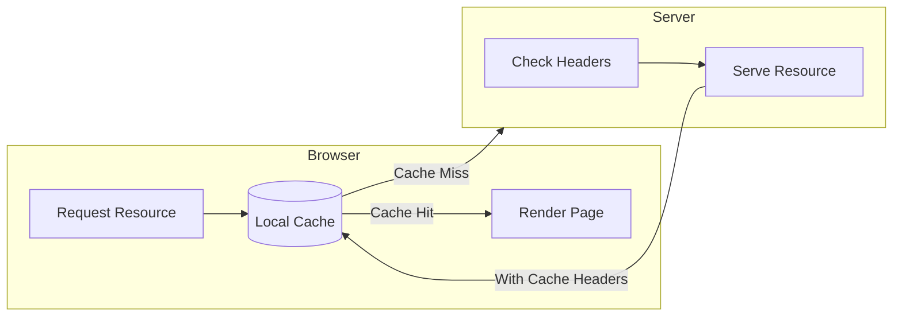
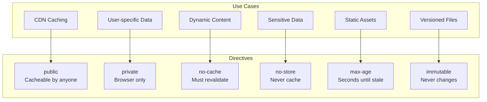
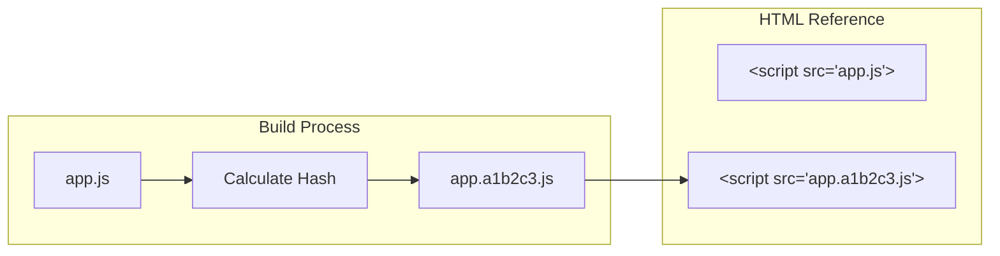
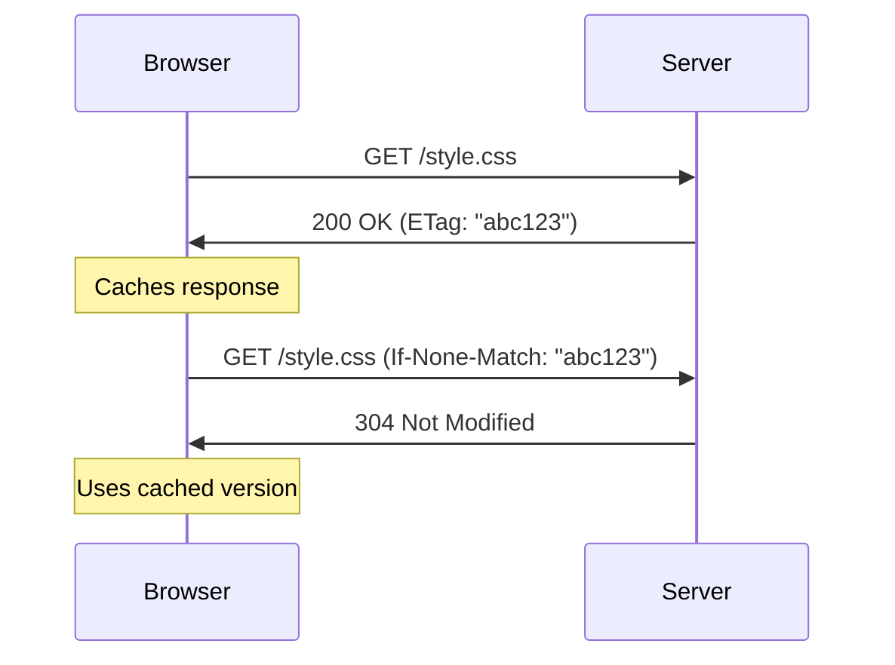

# How to Build Browser Caching Configuration

Author: [nawazdhandala](https://github.com/nawazdhandala)

Tags: Caching, Browser, HTTP Headers, Performance

Description: Learn to build browser caching configuration using HTTP headers for optimal client-side caching.

---

Browser caching stores static assets locally on a user's device, reducing server load and dramatically improving page load times for repeat visitors. When configured properly, browsers can serve cached resources instantly without making network requests, saving bandwidth and reducing latency.

This guide covers the HTTP headers that control browser caching behavior, practical configuration examples for popular web servers, and strategies for cache invalidation.

## How Browser Caching Works

When a browser requests a resource, it checks its local cache first. If a valid cached copy exists, the browser uses it without contacting the server. The server controls this behavior through HTTP response headers.



## Core HTTP Headers for Caching

Four HTTP headers control most browser caching behavior. Understanding their interactions is essential for building an effective caching strategy.

| Header | Purpose | Example |
|--------|---------|---------|
| Cache-Control | Primary caching directive | max-age=31536000, public |
| Expires | Legacy expiration date | Thu, 01 Jan 2027 00:00:00 GMT |
| ETag | Resource version identifier | "abc123" |
| Last-Modified | Resource modification timestamp | Wed, 15 Jan 2026 12:00:00 GMT |

## Cache-Control Directives

The Cache-Control header provides fine-grained control over caching behavior. Multiple directives can be combined in a single header.



Here is a breakdown of common directive combinations.

| Directive Combination | Use Case |
|----------------------|----------|
| public, max-age=31536000, immutable | Versioned static assets (app.v2.js) |
| private, max-age=0, must-revalidate | User-specific dynamic content |
| no-store | Authentication tokens, sensitive data |
| public, max-age=86400 | Shared resources that change daily |
| no-cache | Content that needs freshness validation |

## Nginx Configuration

Nginx provides location blocks to apply different caching rules based on file paths or extensions. This configuration demonstrates a complete caching strategy.

```nginx
# Main server block with caching configuration
server {
    listen 80;
    server_name example.com;
    root /var/www/html;

    # Versioned static assets: cache for one year
    # These files include version hashes in their names
    location ~* \.(js|css)$ {
        # Allow CDN and proxy caching
        add_header Cache-Control "public, max-age=31536000, immutable";

        # Enable gzip for text-based assets
        gzip on;
        gzip_types text/css application/javascript;
    }

    # Images and fonts: cache for one month
    # These change less frequently than code
    location ~* \.(jpg|jpeg|png|gif|ico|svg|woff|woff2)$ {
        add_header Cache-Control "public, max-age=2592000";

        # Add ETag for conditional requests
        etag on;
    }

    # HTML files: always revalidate
    # Ensures users get updated markup that references new assets
    location ~* \.html$ {
        add_header Cache-Control "no-cache, must-revalidate";

        # Enable Last-Modified header
        add_header Last-Modified $date_gmt;
    }

    # API responses: no caching
    # Dynamic data should always be fresh
    location /api/ {
        add_header Cache-Control "no-store";

        # Prevent caching by proxies
        add_header Pragma "no-cache";
    }
}
```

## Apache Configuration

Apache uses mod_expires and mod_headers to control caching. Place this configuration in your virtual host or .htaccess file.

```apache
# Enable required modules
<IfModule mod_expires.c>
    ExpiresActive On

    # Default expiration: 1 hour
    ExpiresDefault "access plus 1 hour"

    # Versioned JavaScript and CSS: 1 year
    ExpiresByType application/javascript "access plus 1 year"
    ExpiresByType text/css "access plus 1 year"

    # Images: 1 month
    ExpiresByType image/jpeg "access plus 1 month"
    ExpiresByType image/png "access plus 1 month"
    ExpiresByType image/gif "access plus 1 month"
    ExpiresByType image/svg+xml "access plus 1 month"

    # Fonts: 1 year
    ExpiresByType font/woff2 "access plus 1 year"
    ExpiresByType font/woff "access plus 1 year"
</IfModule>

<IfModule mod_headers.c>
    # Add immutable flag for versioned assets
    <FilesMatch "\.(js|css)$">
        Header set Cache-Control "public, max-age=31536000, immutable"
    </FilesMatch>

    # Prevent caching of HTML files
    <FilesMatch "\.html$">
        Header set Cache-Control "no-cache, must-revalidate"
    </FilesMatch>

    # Disable caching for API endpoints
    <LocationMatch "^/api/">
        Header set Cache-Control "no-store"
    </LocationMatch>
</IfModule>
```

## Express.js Middleware

Node.js applications can set caching headers programmatically. This middleware function applies different caching rules based on the request path.

```javascript
// Caching middleware for Express applications
function cachingMiddleware(req, res, next) {
    const path = req.path;

    // Versioned static assets with hash in filename
    // Example: /static/app.a1b2c3d4.js
    if (path.match(/\.(js|css)$/) && path.includes('.')) {
        res.set('Cache-Control', 'public, max-age=31536000, immutable');
        return next();
    }

    // Images and fonts: cache for 30 days
    if (path.match(/\.(jpg|jpeg|png|gif|svg|woff|woff2)$/)) {
        res.set('Cache-Control', 'public, max-age=2592000');
        return next();
    }

    // API routes: never cache
    if (path.startsWith('/api/')) {
        res.set('Cache-Control', 'no-store');
        res.set('Pragma', 'no-cache');
        return next();
    }

    // HTML and other content: require revalidation
    res.set('Cache-Control', 'no-cache, must-revalidate');
    next();
}

// Apply middleware to Express app
const express = require('express');
const app = express();

// Apply caching rules before serving static files
app.use(cachingMiddleware);
app.use(express.static('public'));
```

## Cache Invalidation with Versioning

The safest way to invalidate browser caches is to change the resource URL. Build tools can add content hashes to filenames automatically.



This webpack configuration generates hashed filenames for cache busting.

```javascript
// webpack.config.js
module.exports = {
    output: {
        // Include content hash in filename
        // Hash changes when file content changes
        filename: '[name].[contenthash].js',

        // Clean old files on build
        clean: true
    },

    optimization: {
        // Generate consistent module IDs
        moduleIds: 'deterministic',

        // Split runtime for better caching
        runtimeChunk: 'single',

        // Separate vendor code
        splitChunks: {
            cacheGroups: {
                vendor: {
                    test: /[\\/]node_modules[\\/]/,
                    name: 'vendors',
                    chunks: 'all'
                }
            }
        }
    }
};
```

## Validation Headers

When cached content expires, browsers can use conditional requests to check if the content changed. ETag and Last-Modified headers enable this validation.



Here is how to implement ETag validation in Express.

```javascript
const crypto = require('crypto');
const fs = require('fs');

// Generate ETag from file content
function generateETag(content) {
    return crypto.createHash('md5').update(content).digest('hex');
}

// ETag validation middleware
app.get('/static/:file', (req, res) => {
    const filePath = `./public/${req.params.file}`;
    const content = fs.readFileSync(filePath);
    const etag = generateETag(content);

    // Check if client has current version
    if (req.headers['if-none-match'] === etag) {
        // Client cache is still valid
        return res.status(304).end();
    }

    // Send full response with ETag
    res.set('ETag', etag);
    res.set('Cache-Control', 'no-cache');
    res.send(content);
});
```

## Testing Your Configuration

Verify your caching headers using browser developer tools or curl commands.

```bash
# Check response headers for a resource
curl -I https://example.com/static/app.js

# Expected output shows caching headers
# HTTP/2 200
# cache-control: public, max-age=31536000, immutable
# etag: "a1b2c3d4"
# content-type: application/javascript
```

## Common Mistakes to Avoid

Several pitfalls can undermine your caching strategy.

| Mistake | Impact | Solution |
|---------|--------|----------|
| Long cache times without versioning | Users stuck with old code | Add content hashes to filenames |
| Caching authenticated responses | Data leaks between users | Use private or no-store directives |
| Missing Vary header | Wrong content served | Add Vary: Accept-Encoding |
| Inconsistent headers | Unpredictable behavior | Centralize caching configuration |

## Conclusion

Browser caching configuration requires balancing performance gains against cache freshness. Use long cache times with immutable flags for versioned static assets, and require revalidation for dynamic content. Always test your configuration with browser developer tools to verify headers are applied correctly.

Start with conservative caching rules and extend cache durations as you gain confidence in your invalidation strategy. The investment in proper caching configuration pays dividends through reduced server load and faster page loads for your users.
