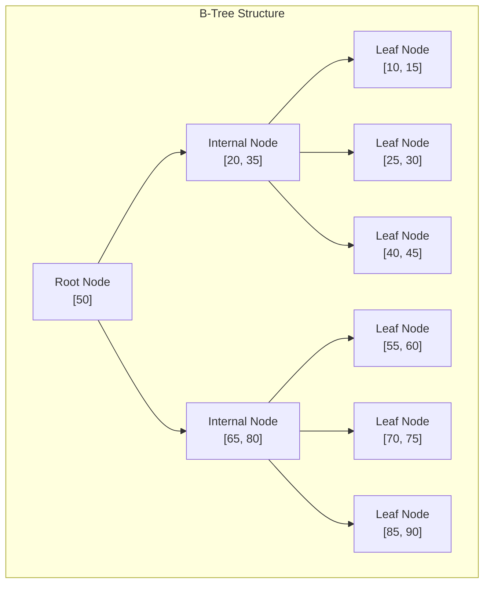
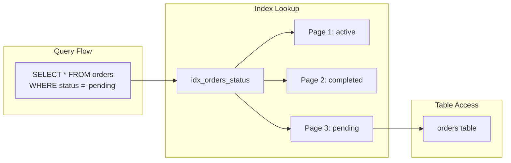
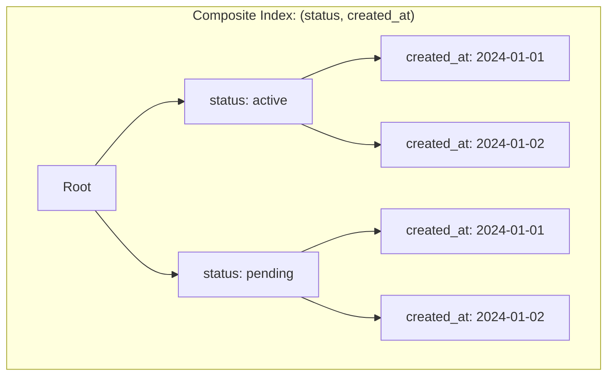
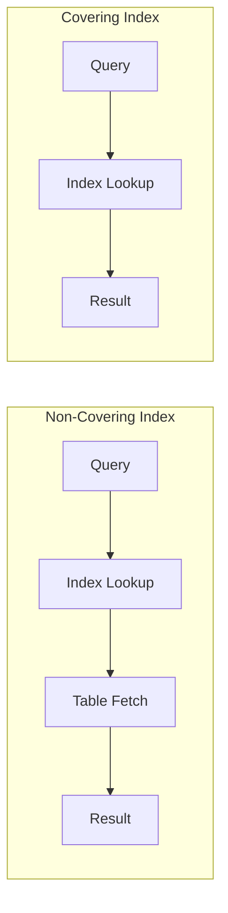
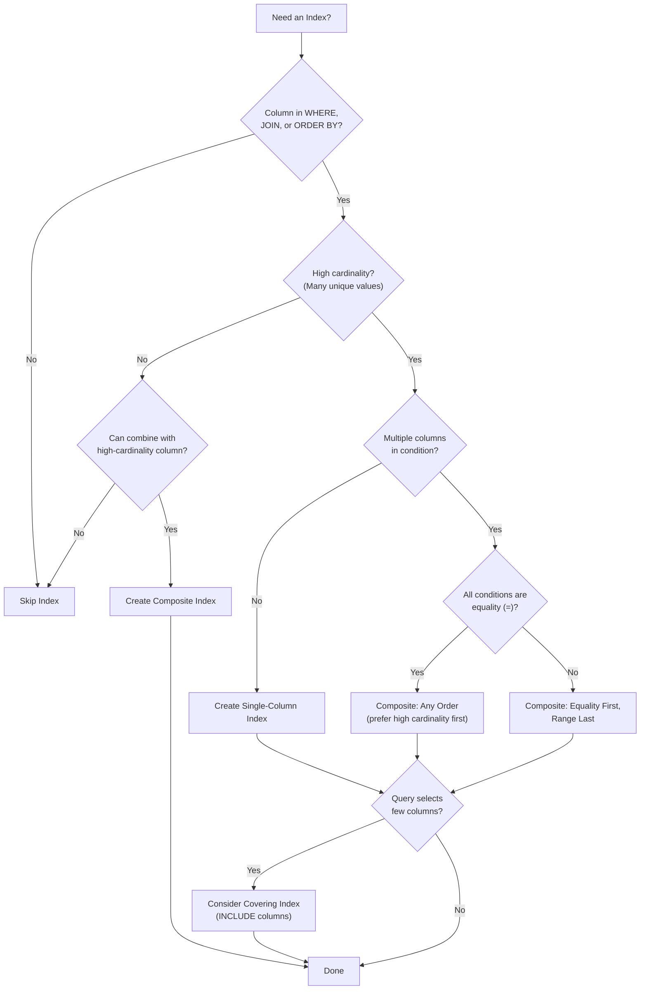

# How to Create B-Tree Index Design

Author: [nawazdhandala](https://github.com/nawazdhandala)

Tags: Database, Indexing, Performance, SQL

Description: A practical guide to designing B-Tree indexes that accelerate queries, reduce disk I/O, and keep your database performant at scale.

---

B-Tree indexes are the backbone of database performance. They power the majority of lookups in PostgreSQL, MySQL, and most relational databases. Understanding how they work and how to design them properly can mean the difference between a query that runs in milliseconds versus one that takes minutes. Here is how to design B-Tree indexes that actually improve performance.

## What Is a B-Tree Index?

A B-Tree (Balanced Tree) is a self-balancing tree data structure that maintains sorted data and allows searches, insertions, and deletions in logarithmic time. Unlike binary trees, B-Trees have multiple keys per node and multiple children, making them ideal for disk-based storage where minimizing I/O operations is critical.



## Why B-Trees Are Used for Database Indexes

B-Trees excel in database systems for several reasons:

| Property | Benefit |
| --- | --- |
| Balanced height | Guarantees O(log n) lookup time |
| High fanout | Minimizes disk reads (more keys per page) |
| Sequential leaf access | Enables efficient range scans |
| Sorted data | Supports ORDER BY without extra sorting |
| Self-balancing | Maintains performance as data grows |

## Creating Your First B-Tree Index

Most databases use B-Tree as the default index type. Here is how to create one in common databases.

The following SQL creates a basic B-Tree index on the email column of the users table:

```sql
-- PostgreSQL: B-Tree is the default
CREATE INDEX idx_users_email ON users(email);

-- MySQL/MariaDB: Also defaults to B-Tree
CREATE INDEX idx_users_email ON users(email);

-- Explicitly specifying B-Tree (PostgreSQL)
CREATE INDEX idx_users_email ON users USING btree(email);
```

## Understanding Index Structure with EXPLAIN

Before designing indexes, you need to understand how your queries use them. Use EXPLAIN to see the query plan.

This query shows whether the database uses an index scan or a sequential scan:

```sql
-- PostgreSQL: Analyze query execution plan
EXPLAIN ANALYZE SELECT * FROM users WHERE email = 'user@example.com';

-- MySQL: Show execution plan
EXPLAIN SELECT * FROM users WHERE email = 'user@example.com';
```

Sample output showing an index scan:

```
Index Scan using idx_users_email on users  (cost=0.43..8.45 rows=1 width=72)
  Index Cond: (email = 'user@example.com'::text)
  Actual rows=1 loops=1
Planning Time: 0.152 ms
Execution Time: 0.089 ms
```

## Single-Column Index Design

Single-column indexes are the simplest form. Create them for columns that appear frequently in WHERE clauses.



Create a single-column index when:
- The column appears in WHERE clauses frequently
- The column has high cardinality (many unique values)
- The column is used for JOIN conditions

This creates an index for status lookups on the orders table:

```sql
-- Create index for status lookups
CREATE INDEX idx_orders_status ON orders(status);

-- Verify the index is being used
EXPLAIN ANALYZE SELECT * FROM orders WHERE status = 'pending';
```

## Composite (Multi-Column) Index Design

Composite indexes contain multiple columns. The order of columns matters significantly for query performance.



The leftmost prefix rule is critical. A composite index on (A, B, C) can be used for:
- Queries filtering on A
- Queries filtering on A and B
- Queries filtering on A, B, and C
- But NOT queries filtering only on B or C

This demonstrates proper composite index usage:

```sql
-- Create a composite index for common query patterns
CREATE INDEX idx_orders_status_created ON orders(status, created_at);

-- This query uses the full index
SELECT * FROM orders
WHERE status = 'pending'
AND created_at > '2024-01-01';

-- This query uses only the first column of the index
SELECT * FROM orders WHERE status = 'pending';

-- This query CANNOT use the index (no leftmost column)
SELECT * FROM orders WHERE created_at > '2024-01-01';
```

## Column Order in Composite Indexes

Choosing the right column order is one of the most important decisions in index design.

| Guideline | Reason |
| --- | --- |
| Equality conditions first | Exact matches narrow results faster |
| Range conditions last | Ranges stop further index use |
| High cardinality first | More selective filtering |
| Frequently filtered columns first | Maximizes index utilization |

This example shows optimal column ordering:

```sql
-- Query pattern: find orders by customer with date range
SELECT * FROM orders
WHERE customer_id = 123
AND created_at BETWEEN '2024-01-01' AND '2024-12-31';

-- Good: equality column first, range column last
CREATE INDEX idx_orders_customer_date ON orders(customer_id, created_at);

-- Bad: range column first (cannot efficiently filter by customer_id)
CREATE INDEX idx_orders_date_customer ON orders(created_at, customer_id);
```

## Covering Indexes

A covering index includes all columns needed by a query, allowing the database to satisfy the query entirely from the index without accessing the table.



This creates a covering index that includes all columns needed by the query:

```sql
-- Original query
SELECT order_id, total, status
FROM orders
WHERE customer_id = 123
AND status = 'pending';

-- Covering index includes all selected columns
CREATE INDEX idx_orders_covering
ON orders(customer_id, status)
INCLUDE (order_id, total);

-- PostgreSQL 11+ syntax with INCLUDE
-- The INCLUDE columns are stored in leaf pages but not in the tree structure
```

## Partial Indexes

Partial indexes only index rows that match a condition. They are smaller and faster for specific query patterns.

```sql
-- Only index active orders (most queries filter for active)
CREATE INDEX idx_orders_active
ON orders(created_at)
WHERE status = 'active';

-- This query benefits from the partial index
SELECT * FROM orders
WHERE status = 'active'
AND created_at > '2024-01-01';

-- Only index non-null values
CREATE INDEX idx_users_phone
ON users(phone)
WHERE phone IS NOT NULL;
```

## Index Design for Common Query Patterns

Different query patterns require different index strategies.

This shows indexes designed for specific query types:

```sql
-- Pattern 1: Exact match lookup
-- Query: SELECT * FROM users WHERE email = 'x@example.com'
CREATE INDEX idx_users_email ON users(email);

-- Pattern 2: Range query
-- Query: SELECT * FROM events WHERE timestamp > '2024-01-01'
CREATE INDEX idx_events_timestamp ON events(timestamp);

-- Pattern 3: Prefix matching (LIKE 'abc%')
-- Query: SELECT * FROM products WHERE name LIKE 'iPhone%'
CREATE INDEX idx_products_name ON products(name);
-- Note: Index works for prefix patterns, NOT suffix ('%iPhone')

-- Pattern 4: Sorting
-- Query: SELECT * FROM posts ORDER BY created_at DESC LIMIT 10
CREATE INDEX idx_posts_created_desc ON posts(created_at DESC);

-- Pattern 5: Multiple conditions with OR
-- Query: SELECT * FROM users WHERE email = 'x' OR username = 'y'
-- Create separate indexes; database will use bitmap OR
CREATE INDEX idx_users_email ON users(email);
CREATE INDEX idx_users_username ON users(username);
```

## Index Design Anti-Patterns

Avoid these common mistakes that hurt performance.

```sql
-- Anti-pattern 1: Indexing low-cardinality columns alone
-- Bad: boolean columns have only 2 values
CREATE INDEX idx_users_active ON users(is_active);  -- Usually not helpful

-- Better: combine with high-cardinality column
CREATE INDEX idx_users_active_email ON users(is_active, email);

-- Anti-pattern 2: Over-indexing
-- Every index slows down writes (INSERT, UPDATE, DELETE)
-- Don't create indexes "just in case"

-- Anti-pattern 3: Function calls preventing index use
-- Bad: function on indexed column
SELECT * FROM users WHERE LOWER(email) = 'user@example.com';

-- Fix: create expression index
CREATE INDEX idx_users_email_lower ON users(LOWER(email));

-- Or normalize data at write time
UPDATE users SET email = LOWER(email);

-- Anti-pattern 4: Implicit type conversion
-- Bad: comparing different types
SELECT * FROM orders WHERE order_id = '12345';  -- order_id is integer

-- Good: use correct type
SELECT * FROM orders WHERE order_id = 12345;
```

## Measuring Index Effectiveness

Use database statistics to evaluate your indexes.

This shows how to check index usage in PostgreSQL:

```sql
-- PostgreSQL: Check index usage statistics
SELECT
    schemaname,
    tablename,
    indexname,
    idx_scan,           -- Number of index scans
    idx_tup_read,       -- Tuples read from index
    idx_tup_fetch       -- Tuples fetched from table
FROM pg_stat_user_indexes
WHERE tablename = 'orders'
ORDER BY idx_scan DESC;

-- Find unused indexes (candidates for removal)
SELECT
    schemaname || '.' || tablename AS table,
    indexname,
    pg_size_pretty(pg_relation_size(indexname::regclass)) AS size
FROM pg_stat_user_indexes
WHERE idx_scan = 0
AND indexname NOT LIKE '%_pkey'
ORDER BY pg_relation_size(indexname::regclass) DESC;
```

For MySQL, use this query to find unused indexes:

```sql
-- MySQL: Check index usage
SELECT
    object_schema,
    object_name,
    index_name,
    count_star,
    count_read
FROM performance_schema.table_io_waits_summary_by_index_usage
WHERE object_schema = 'your_database'
AND index_name IS NOT NULL
ORDER BY count_star DESC;
```

## B-Tree Index Maintenance

B-Tree indexes can become fragmented over time. Regular maintenance keeps them efficient.

```sql
-- PostgreSQL: Rebuild index
REINDEX INDEX idx_orders_status;

-- PostgreSQL: Rebuild all indexes on a table
REINDEX TABLE orders;

-- PostgreSQL: Rebuild concurrently (no locks, requires extra disk space)
REINDEX INDEX CONCURRENTLY idx_orders_status;

-- MySQL: Optimize table (rebuilds indexes)
OPTIMIZE TABLE orders;

-- PostgreSQL: Check index bloat
SELECT
    tablename,
    indexname,
    pg_size_pretty(pg_relation_size(indexname::regclass)) AS index_size
FROM pg_indexes
WHERE schemaname = 'public'
ORDER BY pg_relation_size(indexname::regclass) DESC;
```

## Real-World Index Design Example

Here is a complete example designing indexes for an e-commerce orders table.

```sql
-- Table structure
CREATE TABLE orders (
    order_id SERIAL PRIMARY KEY,
    customer_id INTEGER NOT NULL,
    status VARCHAR(20) NOT NULL,
    total DECIMAL(10,2) NOT NULL,
    created_at TIMESTAMP NOT NULL DEFAULT NOW(),
    updated_at TIMESTAMP NOT NULL DEFAULT NOW(),
    shipping_address_id INTEGER,
    payment_method VARCHAR(50)
);

-- Common query patterns and their indexes:

-- 1. Customer order history (most frequent query)
-- Query: SELECT * FROM orders WHERE customer_id = ? ORDER BY created_at DESC
CREATE INDEX idx_orders_customer_date ON orders(customer_id, created_at DESC);

-- 2. Order status dashboard
-- Query: SELECT * FROM orders WHERE status = ? AND created_at > ?
CREATE INDEX idx_orders_status_date ON orders(status, created_at);

-- 3. Admin search by order ID (already covered by PRIMARY KEY)

-- 4. Reporting queries for active orders
-- Query: SELECT customer_id, SUM(total) FROM orders
--        WHERE status = 'completed' AND created_at > ? GROUP BY customer_id
CREATE INDEX idx_orders_reporting
ON orders(created_at, customer_id)
INCLUDE (total)
WHERE status = 'completed';

-- 5. Payment reconciliation
-- Query: SELECT * FROM orders WHERE payment_method = ? AND status = 'pending'
CREATE INDEX idx_orders_payment_pending
ON orders(payment_method)
WHERE status = 'pending';
```

## Index Design Decision Tree



## Summary

B-Tree index design comes down to a few key principles:

1. **Understand your queries first.** Use EXPLAIN to see what the database actually does.
2. **Index columns in WHERE, JOIN, and ORDER BY clauses.** These are where indexes provide the most benefit.
3. **Order matters in composite indexes.** Put equality conditions first, range conditions last.
4. **Consider covering indexes for read-heavy queries.** They eliminate table lookups entirely.
5. **Use partial indexes when queries filter on a fixed condition.** They are smaller and faster.
6. **Monitor and maintain indexes.** Remove unused ones and rebuild fragmented ones.
7. **Remember the write cost.** Every index slows down inserts, updates, and deletes.

Good index design is not about adding indexes everywhere. It is about understanding your data access patterns and creating the minimal set of indexes that support them efficiently. Start with the slowest queries, design indexes for them, and measure the impact.
