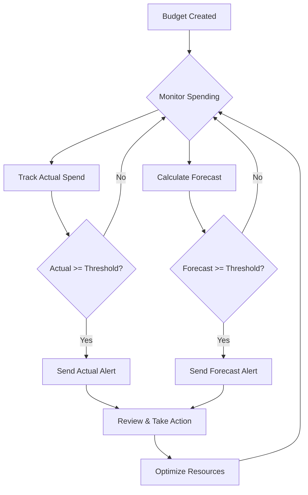
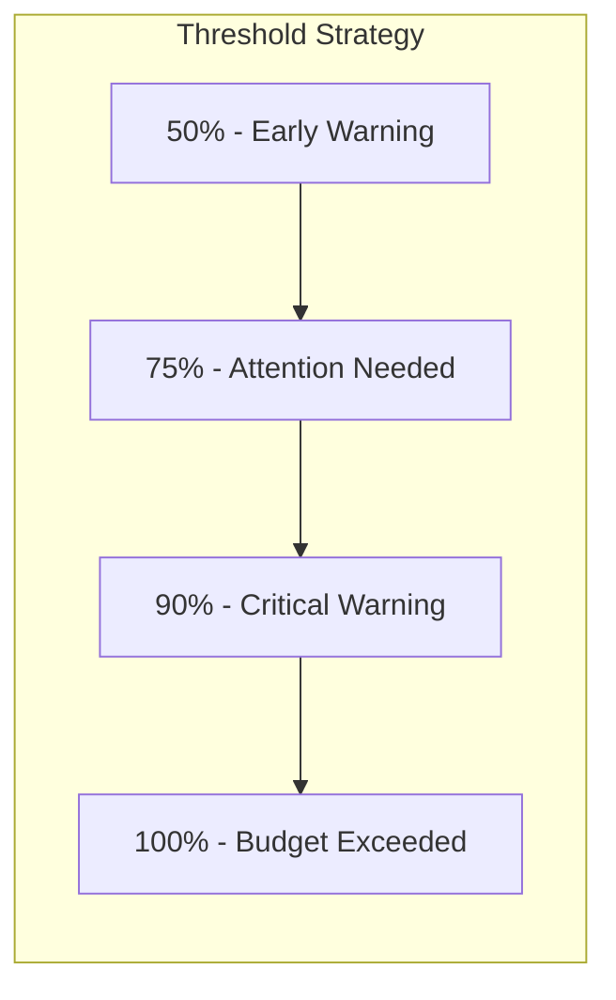
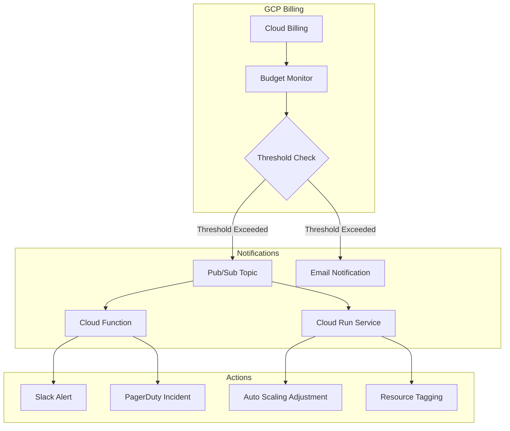
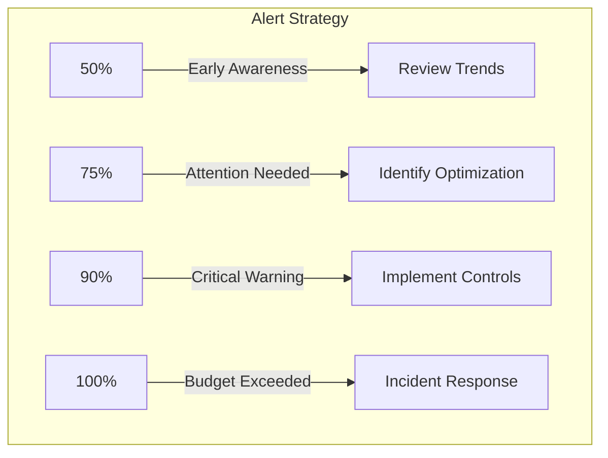

# How to Create Budget Alerts

Author: [nawazdhandala](https://github.com/nawazdhandala)

Tags: FinOps, Cloud, Cost Optimization, Alerting

Description: Learn how to set up budget alerts to prevent unexpected cloud spending.

---

Cloud costs can spiral out of control quickly if left unmonitored. Budget alerts are your first line of defense against unexpected spending, giving you early warnings before costs exceed your planned expenditure. In this guide, we will walk through how to set up effective budget alerts across major cloud providers.

## Why Budget Alerts Matter

Without proper alerting, organizations often discover cost overruns only at the end of the billing cycle when it is too late to take corrective action. Budget alerts enable you to:

- Detect anomalies in real time
- Prevent bill shock at month end
- Enable faster incident response for cost spikes
- Maintain accountability across teams
- Support FinOps practices with proactive governance

## Understanding Budget Alert Types

There are two primary types of budget alerts you should configure:

### Actual Spend Alerts

These alerts trigger when your actual accumulated spending crosses a defined threshold. They are reactive but essential for catching unexpected costs.

### Forecasted Spend Alerts

These alerts use historical spending patterns to predict whether you will exceed your budget by the end of the period. They provide earlier warnings, allowing more time for corrective action.



## Setting Up Budget Thresholds

A well designed alert strategy uses multiple thresholds to provide graduated warnings:



| Threshold | Purpose | Recommended Action |
|-----------|---------|-------------------|
| 50% | Early awareness | Review spending trends |
| 75% | Mid cycle check | Identify optimization opportunities |
| 90% | Pre breach warning | Implement immediate cost controls |
| 100% | Budget exceeded | Escalate and investigate root cause |

## AWS Budgets: Step by Step Setup

AWS Budgets provides comprehensive cost tracking and alerting capabilities. Here is how to set up budget alerts using AWS CLI and Terraform.

### Using AWS CLI

```bash
# Create a monthly cost budget with multiple alert thresholds
# This budget tracks all AWS spending and sends alerts at 50%, 75%, 90%, and 100%

aws budgets create-budget \
    --account-id 123456789012 \
    --budget '{
        "BudgetName": "monthly-cloud-budget",
        "BudgetLimit": {
            "Amount": "1000",
            "Unit": "USD"
        },
        "BudgetType": "COST",
        "TimeUnit": "MONTHLY",
        "CostFilters": {},
        "CostTypes": {
            "IncludeTax": true,
            "IncludeSubscription": true,
            "UseBlended": false,
            "IncludeRefund": false,
            "IncludeCredit": false,
            "IncludeUpfront": true,
            "IncludeRecurring": true,
            "IncludeOtherSubscription": true,
            "IncludeSupport": true,
            "IncludeDiscount": true,
            "UseAmortized": false
        }
    }' \
    --notifications-with-subscribers '[
        {
            "Notification": {
                "NotificationType": "ACTUAL",
                "ComparisonOperator": "GREATER_THAN",
                "Threshold": 50,
                "ThresholdType": "PERCENTAGE"
            },
            "Subscribers": [
                {
                    "SubscriptionType": "EMAIL",
                    "Address": "finops-team@example.com"
                }
            ]
        },
        {
            "Notification": {
                "NotificationType": "ACTUAL",
                "ComparisonOperator": "GREATER_THAN",
                "Threshold": 75,
                "ThresholdType": "PERCENTAGE"
            },
            "Subscribers": [
                {
                    "SubscriptionType": "EMAIL",
                    "Address": "finops-team@example.com"
                }
            ]
        },
        {
            "Notification": {
                "NotificationType": "ACTUAL",
                "ComparisonOperator": "GREATER_THAN",
                "Threshold": 90,
                "ThresholdType": "PERCENTAGE"
            },
            "Subscribers": [
                {
                    "SubscriptionType": "EMAIL",
                    "Address": "finops-team@example.com"
                },
                {
                    "SubscriptionType": "SNS",
                    "Address": "arn:aws:sns:us-east-1:123456789012:budget-alerts"
                }
            ]
        },
        {
            "Notification": {
                "NotificationType": "FORECASTED",
                "ComparisonOperator": "GREATER_THAN",
                "Threshold": 100,
                "ThresholdType": "PERCENTAGE"
            },
            "Subscribers": [
                {
                    "SubscriptionType": "EMAIL",
                    "Address": "finops-team@example.com"
                },
                {
                    "SubscriptionType": "SNS",
                    "Address": "arn:aws:sns:us-east-1:123456789012:budget-alerts"
                }
            ]
        }
    ]'
```

### Using Terraform

```hcl
# AWS Budget with comprehensive alerting
# This configuration creates a monthly budget with both actual and forecasted alerts

resource "aws_budgets_budget" "monthly_cost_budget" {
  name              = "monthly-cloud-budget"
  budget_type       = "COST"
  limit_amount      = "1000"
  limit_unit        = "USD"
  time_period_start = "2026-01-01_00:00"
  time_unit         = "MONTHLY"

  # Cost configuration to include all relevant charges
  cost_types {
    include_credit             = false
    include_discount           = true
    include_other_subscription = true
    include_recurring          = true
    include_refund             = false
    include_subscription       = true
    include_support            = true
    include_tax                = true
    include_upfront            = true
    use_amortized              = false
    use_blended                = false
  }

  # 50% threshold - early warning for awareness
  notification {
    comparison_operator        = "GREATER_THAN"
    threshold                  = 50
    threshold_type             = "PERCENTAGE"
    notification_type          = "ACTUAL"
    subscriber_email_addresses = ["finops-team@example.com"]
  }

  # 75% threshold - mid cycle attention needed
  notification {
    comparison_operator        = "GREATER_THAN"
    threshold                  = 75
    threshold_type             = "PERCENTAGE"
    notification_type          = "ACTUAL"
    subscriber_email_addresses = ["finops-team@example.com"]
  }

  # 90% threshold - critical warning with SNS integration
  notification {
    comparison_operator        = "GREATER_THAN"
    threshold                  = 90
    threshold_type             = "PERCENTAGE"
    notification_type          = "ACTUAL"
    subscriber_email_addresses = ["finops-team@example.com"]
    subscriber_sns_topic_arns  = [aws_sns_topic.budget_alerts.arn]
  }

  # 100% forecasted threshold - proactive alert before budget breach
  notification {
    comparison_operator        = "GREATER_THAN"
    threshold                  = 100
    threshold_type             = "PERCENTAGE"
    notification_type          = "FORECASTED"
    subscriber_email_addresses = ["finops-team@example.com", "engineering-leads@example.com"]
    subscriber_sns_topic_arns  = [aws_sns_topic.budget_alerts.arn]
  }
}

# SNS topic for programmatic alert handling
resource "aws_sns_topic" "budget_alerts" {
  name = "budget-alerts"
}

# Optional: Lambda subscription for automated responses
resource "aws_sns_topic_subscription" "budget_lambda" {
  topic_arn = aws_sns_topic.budget_alerts.arn
  protocol  = "lambda"
  endpoint  = aws_lambda_function.budget_handler.arn
}
```

### Service Specific Budgets

You can create targeted budgets for specific AWS services:

```hcl
# EC2 specific budget for compute cost tracking
resource "aws_budgets_budget" "ec2_budget" {
  name         = "ec2-compute-budget"
  budget_type  = "COST"
  limit_amount = "500"
  limit_unit   = "USD"
  time_unit    = "MONTHLY"

  # Filter to only track EC2 costs
  cost_filter {
    name   = "Service"
    values = ["Amazon Elastic Compute Cloud - Compute"]
  }

  notification {
    comparison_operator        = "GREATER_THAN"
    threshold                  = 80
    threshold_type             = "PERCENTAGE"
    notification_type          = "ACTUAL"
    subscriber_email_addresses = ["compute-team@example.com"]
  }
}

# S3 storage budget for data storage tracking
resource "aws_budgets_budget" "s3_budget" {
  name         = "s3-storage-budget"
  budget_type  = "COST"
  limit_amount = "200"
  limit_unit   = "USD"
  time_unit    = "MONTHLY"

  cost_filter {
    name   = "Service"
    values = ["Amazon Simple Storage Service"]
  }

  notification {
    comparison_operator        = "GREATER_THAN"
    threshold                  = 80
    threshold_type             = "PERCENTAGE"
    notification_type          = "ACTUAL"
    subscriber_email_addresses = ["data-team@example.com"]
  }
}
```

## GCP Budget Alerts: Complete Setup Guide

Google Cloud Platform provides budget alerts through the Cloud Billing API. Here is how to implement them.

### Using gcloud CLI

```bash
# First, get your billing account ID
gcloud billing accounts list

# Create a budget with alert thresholds
# This creates a budget for a specific project with email notifications

gcloud billing budgets create \
    --billing-account=012345-6789AB-CDEF01 \
    --display-name="monthly-gcp-budget" \
    --budget-amount=1000USD \
    --threshold-rule=percent=0.5,basis=current-spend \
    --threshold-rule=percent=0.75,basis=current-spend \
    --threshold-rule=percent=0.9,basis=current-spend \
    --threshold-rule=percent=1.0,basis=forecasted-spend \
    --filter-projects="projects/my-project-id" \
    --notifications-rule-pubsub-topic="projects/my-project-id/topics/budget-alerts" \
    --notifications-rule-monitoring-notification-channels="projects/my-project-id/notificationChannels/123456789"
```

### Using Terraform

```hcl
# GCP Budget with comprehensive threshold configuration
# Requires google-beta provider for full budget features

resource "google_billing_budget" "monthly_budget" {
  provider = google-beta

  billing_account = "012345-6789AB-CDEF01"
  display_name    = "monthly-gcp-budget"

  # Budget amount configuration
  amount {
    specified_amount {
      currency_code = "USD"
      units         = "1000"
    }
  }

  # Optional: Filter by specific projects, services, or labels
  budget_filter {
    projects = ["projects/my-project-id"]

    # Uncomment to filter by specific services
    # services = ["services/24E6-581D-38E5"]  # Compute Engine service ID

    # Uncomment to filter by labels
    # labels = {
    #   environment = "production"
    # }
  }

  # Configure multiple threshold rules for graduated alerts
  threshold_rules {
    threshold_percent = 0.5
    spend_basis       = "CURRENT_SPEND"  # Alert based on actual spending
  }

  threshold_rules {
    threshold_percent = 0.75
    spend_basis       = "CURRENT_SPEND"
  }

  threshold_rules {
    threshold_percent = 0.9
    spend_basis       = "CURRENT_SPEND"
  }

  threshold_rules {
    threshold_percent = 1.0
    spend_basis       = "FORECASTED_SPEND"  # Alert based on projected spending
  }

  # Notification configuration
  all_updates_rule {
    # Pub/Sub topic for programmatic handling
    pubsub_topic = google_pubsub_topic.budget_alerts.id

    # Email notifications to billing admins
    monitoring_notification_channels = [
      google_monitoring_notification_channel.finops_email.id
    ]

    # Disable default email to billing admins if using custom channels
    disable_default_iam_recipients = false
  }
}

# Pub/Sub topic for budget alert messages
resource "google_pubsub_topic" "budget_alerts" {
  name    = "budget-alerts"
  project = "my-project-id"
}

# Notification channel for email alerts
resource "google_monitoring_notification_channel" "finops_email" {
  project      = "my-project-id"
  display_name = "FinOps Team Email"
  type         = "email"

  labels = {
    email_address = "finops-team@example.com"
  }
}

# Optional: Subscription for Cloud Function processing
resource "google_pubsub_subscription" "budget_alerts_sub" {
  name  = "budget-alerts-subscription"
  topic = google_pubsub_topic.budget_alerts.name

  push_config {
    push_endpoint = google_cloudfunctions_function.budget_handler.https_trigger_url
  }
}
```

### GCP Budget Alert Architecture



## Automated Response to Budget Alerts

Setting up alerts is only half the battle. Here is how to create automated responses.

### AWS Lambda for Budget Alert Processing

```python
# lambda_function.py
# AWS Lambda handler for processing budget alerts from SNS
# This function parses budget notifications and routes them appropriately

import json
import boto3
import os
from datetime import datetime

# Initialize AWS clients
sns_client = boto3.client('sns')
ses_client = boto3.client('ses')

def lambda_handler(event, context):
    """
    Process budget alert notifications from SNS.
    Routes alerts to appropriate channels based on severity.
    """

    # Parse the SNS message containing budget alert details
    for record in event['Records']:
        sns_message = json.loads(record['Sns']['Message'])

        # Extract budget alert information
        budget_name = sns_message.get('budgetName', 'Unknown')
        budget_type = sns_message.get('notificationType', 'ACTUAL')
        threshold = sns_message.get('threshold', 0)
        actual_spend = sns_message.get('actualSpend', {}).get('amount', 0)
        budgeted_amount = sns_message.get('budgetedAmount', {}).get('amount', 0)

        # Calculate percentage of budget consumed
        if float(budgeted_amount) > 0:
            percentage_used = (float(actual_spend) / float(budgeted_amount)) * 100
        else:
            percentage_used = 0

        # Determine alert severity based on threshold
        severity = determine_severity(threshold)

        # Log the alert details for monitoring
        print(f"Budget Alert: {budget_name}")
        print(f"Type: {budget_type}, Threshold: {threshold}%")
        print(f"Actual Spend: ${actual_spend}, Budget: ${budgeted_amount}")
        print(f"Percentage Used: {percentage_used:.2f}%, Severity: {severity}")

        # Route notification based on severity
        if severity == 'CRITICAL':
            # Send to PagerDuty or on-call team
            send_pagerduty_alert(budget_name, actual_spend, budgeted_amount, threshold)
            send_slack_alert(budget_name, actual_spend, budgeted_amount, threshold, '#finops-critical')
        elif severity == 'WARNING':
            # Send to Slack channel
            send_slack_alert(budget_name, actual_spend, budgeted_amount, threshold, '#finops-alerts')
        else:
            # Log for awareness
            send_slack_alert(budget_name, actual_spend, budgeted_amount, threshold, '#finops-info')

    return {
        'statusCode': 200,
        'body': json.dumps('Budget alert processed successfully')
    }

def determine_severity(threshold):
    """
    Map threshold percentage to severity level.
    """
    if threshold >= 90:
        return 'CRITICAL'
    elif threshold >= 75:
        return 'WARNING'
    else:
        return 'INFO'

def send_slack_alert(budget_name, actual_spend, budgeted_amount, threshold, channel):
    """
    Send formatted alert to Slack channel via webhook.
    """
    import urllib.request

    webhook_url = os.environ.get('SLACK_WEBHOOK_URL')
    if not webhook_url:
        print("Slack webhook URL not configured")
        return

    # Format the Slack message with budget details
    message = {
        "channel": channel,
        "username": "Budget Alert Bot",
        "icon_emoji": ":money_with_wings:",
        "attachments": [
            {
                "color": "#FF0000" if threshold >= 90 else "#FFA500" if threshold >= 75 else "#36A64F",
                "title": f"Budget Alert: {budget_name}",
                "fields": [
                    {"title": "Threshold", "value": f"{threshold}%", "short": True},
                    {"title": "Actual Spend", "value": f"${actual_spend}", "short": True},
                    {"title": "Budget Limit", "value": f"${budgeted_amount}", "short": True},
                    {"title": "Timestamp", "value": datetime.utcnow().isoformat(), "short": True}
                ],
                "footer": "AWS Budget Alerts"
            }
        ]
    }

    # Send the webhook request
    req = urllib.request.Request(
        webhook_url,
        data=json.dumps(message).encode('utf-8'),
        headers={'Content-Type': 'application/json'}
    )

    try:
        urllib.request.urlopen(req)
        print(f"Slack alert sent to {channel}")
    except Exception as e:
        print(f"Failed to send Slack alert: {e}")

def send_pagerduty_alert(budget_name, actual_spend, budgeted_amount, threshold):
    """
    Create a PagerDuty incident for critical budget alerts.
    """
    import urllib.request

    pagerduty_key = os.environ.get('PAGERDUTY_ROUTING_KEY')
    if not pagerduty_key:
        print("PagerDuty routing key not configured")
        return

    # Create PagerDuty event payload
    payload = {
        "routing_key": pagerduty_key,
        "event_action": "trigger",
        "dedup_key": f"budget-alert-{budget_name}",
        "payload": {
            "summary": f"Critical Budget Alert: {budget_name} exceeded {threshold}% threshold",
            "severity": "critical",
            "source": "aws-budget-alerts",
            "custom_details": {
                "budget_name": budget_name,
                "actual_spend": actual_spend,
                "budgeted_amount": budgeted_amount,
                "threshold_percentage": threshold
            }
        }
    }

    req = urllib.request.Request(
        "https://events.pagerduty.com/v2/enqueue",
        data=json.dumps(payload).encode('utf-8'),
        headers={'Content-Type': 'application/json'}
    )

    try:
        urllib.request.urlopen(req)
        print("PagerDuty incident created")
    except Exception as e:
        print(f"Failed to create PagerDuty incident: {e}")
```

### GCP Cloud Function for Budget Processing

```python
# main.py
# Google Cloud Function for processing budget alert Pub/Sub messages
# Handles alert routing and automated cost optimization actions

import base64
import json
import os
from google.cloud import pubsub_v1
from google.cloud import compute_v1

def process_budget_alert(event, context):
    """
    Cloud Function triggered by Pub/Sub message from budget alert.

    Args:
        event: The Pub/Sub message payload
        context: Metadata about the event
    """

    # Decode the Pub/Sub message
    if 'data' in event:
        pubsub_message = base64.b64decode(event['data']).decode('utf-8')
        budget_data = json.loads(pubsub_message)
    else:
        print("No data in Pub/Sub message")
        return

    # Extract budget notification details
    budget_display_name = budget_data.get('budgetDisplayName', 'Unknown')
    cost_amount = budget_data.get('costAmount', 0)
    budget_amount = budget_data.get('budgetAmount', 0)
    threshold_exceeded = budget_data.get('alertThresholdExceeded', 0)
    forecast_threshold_exceeded = budget_data.get('forecastThresholdExceeded', 0)

    # Calculate percentage of budget used
    if budget_amount > 0:
        percentage_used = (cost_amount / budget_amount) * 100
    else:
        percentage_used = 0

    print(f"Budget: {budget_display_name}")
    print(f"Cost: ${cost_amount:.2f}, Budget: ${budget_amount:.2f}")
    print(f"Percentage used: {percentage_used:.2f}%")
    print(f"Actual threshold exceeded: {threshold_exceeded}")
    print(f"Forecast threshold exceeded: {forecast_threshold_exceeded}")

    # Determine action based on threshold
    if threshold_exceeded >= 0.9 or forecast_threshold_exceeded >= 1.0:
        # Critical: Take automated action
        send_critical_alert(budget_display_name, cost_amount, budget_amount)

        # Optional: Implement automated cost reduction
        if os.environ.get('ENABLE_AUTO_SCALING', 'false') == 'true':
            reduce_non_critical_resources()

    elif threshold_exceeded >= 0.75:
        # Warning: Send notification
        send_warning_alert(budget_display_name, cost_amount, budget_amount)

    else:
        # Info: Log for awareness
        print(f"Budget {budget_display_name} at {percentage_used:.2f}% - within acceptable range")

    return 'OK'

def send_critical_alert(budget_name, cost_amount, budget_amount):
    """
    Send critical alert to multiple channels.
    """
    import requests

    slack_webhook = os.environ.get('SLACK_WEBHOOK_URL')
    if slack_webhook:
        message = {
            "text": f":rotating_light: *CRITICAL BUDGET ALERT*",
            "attachments": [
                {
                    "color": "danger",
                    "fields": [
                        {"title": "Budget", "value": budget_name, "short": True},
                        {"title": "Current Cost", "value": f"${cost_amount:.2f}", "short": True},
                        {"title": "Budget Limit", "value": f"${budget_amount:.2f}", "short": True},
                        {"title": "Status", "value": "Immediate action required", "short": True}
                    ]
                }
            ]
        }

        try:
            requests.post(slack_webhook, json=message)
            print("Critical alert sent to Slack")
        except Exception as e:
            print(f"Failed to send Slack alert: {e}")

def send_warning_alert(budget_name, cost_amount, budget_amount):
    """
    Send warning alert for elevated spending.
    """
    import requests

    slack_webhook = os.environ.get('SLACK_WEBHOOK_URL')
    if slack_webhook:
        message = {
            "text": f":warning: *Budget Warning*",
            "attachments": [
                {
                    "color": "warning",
                    "fields": [
                        {"title": "Budget", "value": budget_name, "short": True},
                        {"title": "Current Cost", "value": f"${cost_amount:.2f}", "short": True},
                        {"title": "Budget Limit", "value": f"${budget_amount:.2f}", "short": True}
                    ]
                }
            ]
        }

        try:
            requests.post(slack_webhook, json=message)
            print("Warning alert sent to Slack")
        except Exception as e:
            print(f"Failed to send Slack alert: {e}")

def reduce_non_critical_resources():
    """
    Automated cost reduction by scaling down non-critical resources.
    Use with caution and ensure proper tagging of non-critical resources.
    """
    project_id = os.environ.get('GCP_PROJECT_ID')
    zone = os.environ.get('GCP_ZONE', 'us-central1-a')

    compute_client = compute_v1.InstancesClient()

    # List instances with non-critical label
    request = compute_v1.ListInstancesRequest(
        project=project_id,
        zone=zone,
        filter='labels.criticality=low'
    )

    instances = compute_client.list(request=request)

    for instance in instances:
        if instance.status == 'RUNNING':
            print(f"Stopping non-critical instance: {instance.name}")

            # Stop the instance
            stop_request = compute_v1.StopInstanceRequest(
                project=project_id,
                zone=zone,
                instance=instance.name
            )

            try:
                compute_client.stop(request=stop_request)
                print(f"Instance {instance.name} stop initiated")
            except Exception as e:
                print(f"Failed to stop instance {instance.name}: {e}")
```

## Best Practices for Budget Alerts

### 1. Set Multiple Thresholds

Do not rely on a single 100% threshold. Use graduated alerts to provide early warnings:



### 2. Use Both Actual and Forecasted Alerts

Actual alerts tell you what has happened. Forecasted alerts predict what will happen. Use both for comprehensive coverage.

### 3. Route Alerts to the Right Teams

Configure alerts to reach the teams responsible for the spending:

- **Engineering teams**: Service specific budgets
- **FinOps team**: Overall account budgets
- **Management**: Executive summary alerts

### 4. Integrate with Incident Management

Connect budget alerts to your existing incident management tools:

- PagerDuty for on-call escalation
- Slack or Teams for team awareness
- Jira for tracking and remediation

### 5. Review and Adjust Regularly

Budget thresholds should be reviewed quarterly:

- Adjust limits based on business growth
- Update notification recipients
- Refine service specific budgets

## Common Pitfalls to Avoid

1. **Setting budgets too high**: Alerts that never trigger provide no value
2. **Setting budgets too low**: Alert fatigue leads to ignored notifications
3. **Single notification channel**: Email alone may not reach the right people quickly
4. **No automation**: Manual responses are slower and prone to human error
5. **Ignoring forecasted alerts**: Forecasted alerts give you time to act before breach

## Conclusion

Budget alerts are essential for maintaining control over cloud costs. By implementing alerts across multiple thresholds, using both actual and forecasted spending metrics, and automating responses, you can prevent unexpected cost overruns and maintain financial governance over your cloud infrastructure.

Start with the basic setup described in this guide, then iterate based on your organization's specific needs and cost patterns. Remember that budget alerts are most effective when combined with regular cost reviews and optimization efforts.

## Additional Resources

- [AWS Budgets Documentation](https://docs.aws.amazon.com/cost-management/latest/userguide/budgets-managing-costs.html)
- [GCP Budget Alerts Documentation](https://cloud.google.com/billing/docs/how-to/budgets)
- [FinOps Foundation Best Practices](https://www.finops.org/)
