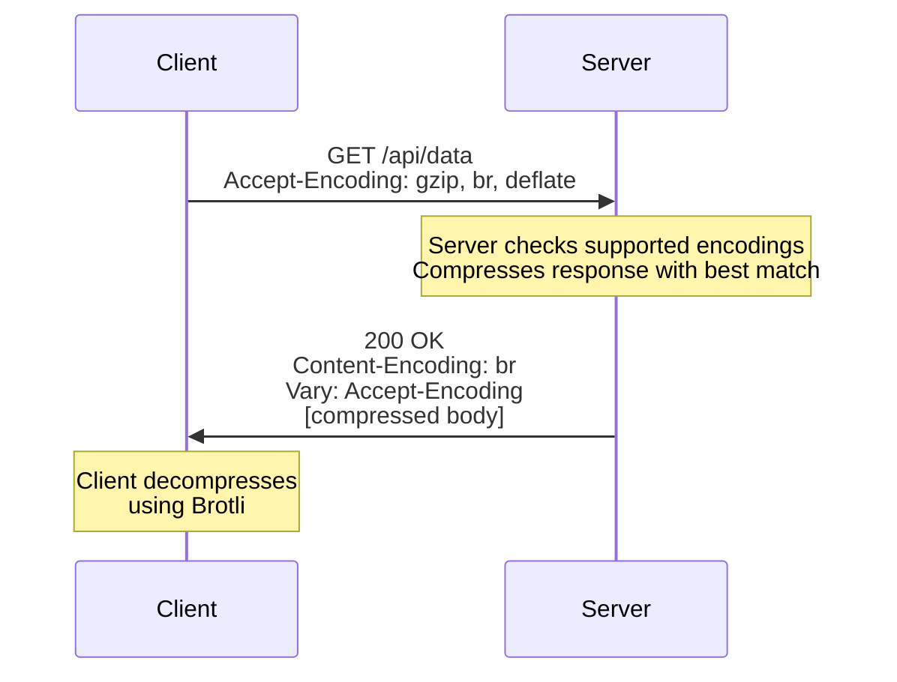
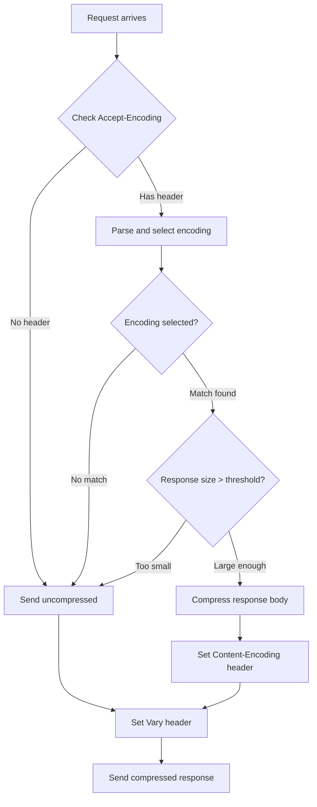

# How to Build API Compression Headers

Author: [nawazdhandala](https://github.com/nawazdhandala)

Tags: API, Compression, HTTP Headers, Backend, Performance, Web Development

Description: Learn how to implement API compression headers from scratch. This guide covers Accept-Encoding, Content-Encoding, and Vary headers with production-ready code for Node.js, Python, and Go.

---

Compression headers tell browsers and servers which compression algorithms to use when exchanging data. Understanding these headers is essential for building APIs that deliver payloads efficiently. Most frameworks hide these details, but knowing how they work helps you debug compression issues and implement custom solutions when needed.

This guide walks through implementing compression headers from the ground up, covering the header negotiation protocol and providing production-ready code.

## How Compression Header Negotiation Works

When a client requests data from your API, a three-step negotiation happens:



The three headers involved are:

| Header | Direction | Purpose |
|--------|-----------|---------|
| Accept-Encoding | Client to Server | Lists compression algorithms the client supports |
| Content-Encoding | Server to Client | Indicates which algorithm was used to compress |
| Vary | Server to Client | Tells caches that response varies by Accept-Encoding |

## Parsing Accept-Encoding Headers

The Accept-Encoding header can include quality values (q-values) that indicate client preference. A higher q-value means higher preference.

```
Accept-Encoding: gzip;q=1.0, br;q=0.8, deflate;q=0.5, *;q=0.1
```

This Node.js function parses the header and returns encodings sorted by preference.

```javascript
// parseAcceptEncoding.js
// Parses the Accept-Encoding header and returns encodings sorted by quality value.
// Quality values range from 0 to 1, with 1 being most preferred.
// Encodings without explicit q-values default to 1.0.

function parseAcceptEncoding(headerValue) {
  if (!headerValue || headerValue.trim() === '') {
    return [];
  }

  // Split by comma and process each encoding
  const encodings = headerValue
    .split(',')
    .map((part) => {
      const trimmed = part.trim();

      // Check if there's a quality value
      const qIndex = trimmed.indexOf(';q=');

      if (qIndex === -1) {
        // No quality value specified, default to 1.0
        return { encoding: trimmed, quality: 1.0 };
      }

      const encoding = trimmed.substring(0, qIndex).trim();
      const qualityStr = trimmed.substring(qIndex + 3).trim();
      const quality = parseFloat(qualityStr);

      // Validate quality is between 0 and 1
      const validQuality = isNaN(quality) ? 1.0 : Math.max(0, Math.min(1, quality));

      return { encoding, quality: validQuality };
    })
    // Filter out encodings with quality 0 (client explicitly rejects)
    .filter((e) => e.quality > 0)
    // Sort by quality descending
    .sort((a, b) => b.quality - a.quality);

  return encodings;
}

// Example usage
const header = 'gzip;q=0.8, br;q=1.0, deflate;q=0.5, identity;q=0.1';
const parsed = parseAcceptEncoding(header);
console.log(parsed);
// Output: [
//   { encoding: 'br', quality: 1 },
//   { encoding: 'gzip', quality: 0.8 },
//   { encoding: 'deflate', quality: 0.5 },
//   { encoding: 'identity', quality: 0.1 }
// ]

module.exports = { parseAcceptEncoding };
```

## Selecting the Best Encoding

After parsing client preferences, match them against your server's supported encodings. This function returns the best mutual match.

```javascript
// selectEncoding.js
// Selects the best compression encoding based on client preference and server support.
// Returns null if no acceptable encoding is found.

const { parseAcceptEncoding } = require('./parseAcceptEncoding');

// Define server-supported encodings in order of preference
const SUPPORTED_ENCODINGS = ['br', 'gzip', 'deflate'];

function selectEncoding(acceptEncodingHeader) {
  const clientEncodings = parseAcceptEncoding(acceptEncodingHeader);

  // No Accept-Encoding header means client accepts any encoding
  if (clientEncodings.length === 0) {
    return null; // Send uncompressed
  }

  // Check for wildcard acceptance
  const wildcardEntry = clientEncodings.find((e) => e.encoding === '*');

  // Find the best match by iterating client preferences
  for (const { encoding } of clientEncodings) {
    if (encoding === '*') {
      // Wildcard: return server's most preferred encoding
      return SUPPORTED_ENCODINGS[0];
    }

    if (SUPPORTED_ENCODINGS.includes(encoding)) {
      return encoding;
    }
  }

  // If wildcard was present but no direct match found, use server preference
  if (wildcardEntry) {
    return SUPPORTED_ENCODINGS[0];
  }

  // No acceptable encoding found
  return null;
}

// Example usage
console.log(selectEncoding('gzip, br'));        // 'br' (server prefers br)
console.log(selectEncoding('gzip;q=1.0'));      // 'gzip'
console.log(selectEncoding('deflate'));         // 'deflate'
console.log(selectEncoding('identity'));        // null (not supported)
console.log(selectEncoding('*'));               // 'br' (server's top choice)

module.exports = { selectEncoding };
```

## Complete Compression Middleware

Here is a complete middleware implementation that handles the full compression header flow.



```javascript
// compressionMiddleware.js
// Production-ready compression middleware with proper header handling.
// Supports gzip, Brotli, and deflate with configurable thresholds.

const zlib = require('zlib');
const { parseAcceptEncoding } = require('./parseAcceptEncoding');

const DEFAULT_OPTIONS = {
  // Minimum response size to compress (bytes)
  threshold: 1024,
  // Compression level for gzip (1-9)
  gzipLevel: 6,
  // Compression level for Brotli (0-11)
  brotliLevel: 4,
  // Compression level for deflate (1-9)
  deflateLevel: 6,
  // Content types to compress
  compressibleTypes: [
    'application/json',
    'application/javascript',
    'application/xml',
    'text/html',
    'text/plain',
    'text/css',
    'text/xml',
  ],
};

// Map encoding names to zlib compression functions
function getCompressor(encoding, options) {
  const compressors = {
    br: () =>
      zlib.createBrotliCompress({
        params: {
          [zlib.constants.BROTLI_PARAM_QUALITY]: options.brotliLevel,
        },
      }),
    gzip: () => zlib.createGzip({ level: options.gzipLevel }),
    deflate: () => zlib.createDeflate({ level: options.deflateLevel }),
  };

  return compressors[encoding] ? compressors[encoding]() : null;
}

// Check if content type should be compressed
function isCompressible(contentType, compressibleTypes) {
  if (!contentType) return false;

  // Extract the base content type without charset
  const baseType = contentType.split(';')[0].trim().toLowerCase();

  return compressibleTypes.some((type) => baseType.includes(type));
}

// Select best encoding from client's Accept-Encoding header
function selectEncoding(acceptEncoding) {
  const supported = ['br', 'gzip', 'deflate'];
  const parsed = parseAcceptEncoding(acceptEncoding);

  for (const { encoding } of parsed) {
    if (encoding === '*') return supported[0];
    if (supported.includes(encoding)) return encoding;
  }

  return null;
}

function compressionMiddleware(userOptions = {}) {
  const options = { ...DEFAULT_OPTIONS, ...userOptions };

  return (req, res, next) => {
    // Store original methods
    const originalWrite = res.write.bind(res);
    const originalEnd = res.end.bind(res);

    // Get client's accepted encodings
    const acceptEncoding = req.headers['accept-encoding'] || '';
    const selectedEncoding = selectEncoding(acceptEncoding);

    // Track if we should compress
    let shouldCompress = !!selectedEncoding;
    let compressor = null;
    let headersSent = false;

    // Buffer to collect response body
    const chunks = [];

    // Override write to buffer content
    res.write = function (chunk, encoding, callback) {
      if (chunk) {
        chunks.push(Buffer.isBuffer(chunk) ? chunk : Buffer.from(chunk, encoding));
      }

      if (typeof encoding === 'function') {
        callback = encoding;
      }

      if (callback) callback();
      return true;
    };

    // Override end to handle compression
    res.end = function (chunk, encoding, callback) {
      if (chunk) {
        chunks.push(Buffer.isBuffer(chunk) ? chunk : Buffer.from(chunk, encoding));
      }

      if (typeof encoding === 'function') {
        callback = encoding;
        encoding = undefined;
      }

      const body = Buffer.concat(chunks);
      const contentType = res.getHeader('Content-Type') || '';

      // Always set Vary header for caching
      res.setHeader('Vary', 'Accept-Encoding');

      // Decide whether to compress
      const compress =
        shouldCompress &&
        body.length >= options.threshold &&
        isCompressible(contentType, options.compressibleTypes) &&
        !res.getHeader('Content-Encoding');

      if (!compress) {
        // Send uncompressed
        res.setHeader('Content-Length', body.length);
        originalWrite(body);
        return originalEnd(callback);
      }

      // Compress the response
      const compressor = getCompressor(selectedEncoding, options);

      if (!compressor) {
        res.setHeader('Content-Length', body.length);
        originalWrite(body);
        return originalEnd(callback);
      }

      // Set compression headers
      res.setHeader('Content-Encoding', selectedEncoding);
      res.removeHeader('Content-Length'); // Length changes after compression

      // Collect compressed chunks
      const compressedChunks = [];

      compressor.on('data', (chunk) => compressedChunks.push(chunk));

      compressor.on('end', () => {
        const compressed = Buffer.concat(compressedChunks);
        res.setHeader('Content-Length', compressed.length);
        originalWrite(compressed);
        originalEnd(callback);
      });

      compressor.on('error', (err) => {
        // Fallback to uncompressed on error
        console.error('Compression error:', err);
        res.removeHeader('Content-Encoding');
        res.setHeader('Content-Length', body.length);
        originalWrite(body);
        originalEnd(callback);
      });

      // Write body to compressor
      compressor.write(body);
      compressor.end();
    };

    next();
  };
}

module.exports = { compressionMiddleware };
```

## Using the Middleware in Express

Here is how to integrate the compression middleware into an Express application.

```javascript
// server.js
// Express server with custom compression middleware

const express = require('express');
const { compressionMiddleware } = require('./compressionMiddleware');

const app = express();

// Apply compression middleware globally
app.use(
  compressionMiddleware({
    threshold: 1024,
    gzipLevel: 6,
    brotliLevel: 4,
  })
);

// Example API endpoint returning JSON
app.get('/api/products', (req, res) => {
  // Generate sample data (in production, this comes from a database)
  const products = Array.from({ length: 100 }, (_, i) => ({
    id: i + 1,
    name: `Product ${i + 1}`,
    description: 'A detailed description of the product with lots of text.',
    price: Math.round(Math.random() * 10000) / 100,
    category: ['Electronics', 'Clothing', 'Home'][i % 3],
    inStock: Math.random() > 0.3,
    tags: ['tag1', 'tag2', 'tag3'],
  }));

  res.json(products);
});

// Endpoint that explicitly disables compression
app.get('/api/stream', (req, res) => {
  // Set Content-Encoding to identity to skip compression
  res.setHeader('Content-Encoding', 'identity');
  res.setHeader('Content-Type', 'text/event-stream');
  res.setHeader('Cache-Control', 'no-cache');

  // Server-sent events should not be compressed
  let count = 0;
  const interval = setInterval(() => {
    res.write(`data: ${JSON.stringify({ count: ++count })}\n\n`);

    if (count >= 10) {
      clearInterval(interval);
      res.end();
    }
  }, 1000);
});

app.listen(3000, () => {
  console.log('Server running on port 3000');
});
```

## Python Implementation

Here is the equivalent implementation in Python using Flask.

```python
# compression_middleware.py
# Flask middleware for handling compression headers

import gzip
import zlib
from io import BytesIO
from functools import wraps
from flask import request, make_response

# Optional: Install brotli package for Brotli support
try:
    import brotli
    BROTLI_AVAILABLE = True
except ImportError:
    BROTLI_AVAILABLE = False


def parse_accept_encoding(header_value):
    """
    Parse Accept-Encoding header and return encodings sorted by quality.
    Example: 'gzip;q=0.8, br;q=1.0' -> [('br', 1.0), ('gzip', 0.8)]
    """
    if not header_value:
        return []

    encodings = []

    for part in header_value.split(','):
        part = part.strip()
        if not part:
            continue

        # Check for quality value
        if ';q=' in part:
            encoding, q_str = part.split(';q=', 1)
            try:
                quality = float(q_str.strip())
                quality = max(0.0, min(1.0, quality))
            except ValueError:
                quality = 1.0
        else:
            encoding = part
            quality = 1.0

        encoding = encoding.strip().lower()

        if quality > 0:
            encodings.append((encoding, quality))

    # Sort by quality descending
    encodings.sort(key=lambda x: x[1], reverse=True)

    return encodings


def select_encoding(accept_encoding_header):
    """
    Select the best encoding based on client preference and server support.
    Returns the encoding name or None if no compression should be used.
    """
    supported = ['br', 'gzip', 'deflate'] if BROTLI_AVAILABLE else ['gzip', 'deflate']
    encodings = parse_accept_encoding(accept_encoding_header)

    for encoding, quality in encodings:
        if encoding == '*':
            return supported[0]
        if encoding in supported:
            return encoding

    return None


def compress_data(data, encoding, level=6):
    """
    Compress data using the specified encoding.
    Returns compressed bytes or None on failure.
    """
    if isinstance(data, str):
        data = data.encode('utf-8')

    try:
        if encoding == 'br' and BROTLI_AVAILABLE:
            # Brotli quality ranges from 0-11
            return brotli.compress(data, quality=min(level, 11))

        elif encoding == 'gzip':
            buf = BytesIO()
            with gzip.GzipFile(fileobj=buf, mode='wb', compresslevel=level) as f:
                f.write(data)
            return buf.getvalue()

        elif encoding == 'deflate':
            return zlib.compress(data, level)

    except Exception as e:
        print(f'Compression error: {e}')
        return None

    return None


def compression_middleware(threshold=1024, level=6):
    """
    Decorator that adds compression to Flask route responses.

    Usage:
        @app.route('/api/data')
        @compression_middleware(threshold=1024)
        def get_data():
            return jsonify(large_data)
    """

    def decorator(f):
        @wraps(f)
        def wrapped(*args, **kwargs):
            # Get the original response
            response = make_response(f(*args, **kwargs))

            # Always set Vary header
            response.headers['Vary'] = 'Accept-Encoding'

            # Check if compression is needed
            accept_encoding = request.headers.get('Accept-Encoding', '')
            encoding = select_encoding(accept_encoding)

            if not encoding:
                return response

            # Get response data
            data = response.get_data()

            # Skip small responses
            if len(data) < threshold:
                return response

            # Skip already compressed responses
            if response.headers.get('Content-Encoding'):
                return response

            # Skip non-text content types
            content_type = response.headers.get('Content-Type', '')
            compressible_types = ['json', 'text', 'xml', 'javascript']

            if not any(t in content_type for t in compressible_types):
                return response

            # Compress the data
            compressed = compress_data(data, encoding, level)

            if compressed and len(compressed) < len(data):
                response.set_data(compressed)
                response.headers['Content-Encoding'] = encoding
                response.headers['Content-Length'] = len(compressed)

            return response

        return wrapped

    return decorator


# Example Flask application
if __name__ == '__main__':
    from flask import Flask, jsonify

    app = Flask(__name__)

    @app.route('/api/products')
    @compression_middleware(threshold=1024, level=6)
    def get_products():
        products = [
            {
                'id': i,
                'name': f'Product {i}',
                'description': 'A detailed description with lots of text.',
                'price': round(i * 10.99, 2),
            }
            for i in range(1, 101)
        ]
        return jsonify(products)

    app.run(port=3000)
```

## Go Implementation

Here is a Go implementation with proper header handling.

```go
// compression.go
// HTTP compression middleware for Go with header negotiation

package main

import (
	"compress/flate"
	"compress/gzip"
	"io"
	"net/http"
	"strconv"
	"strings"
	"sync"

	"github.com/andybalholm/brotli"
)

// EncodingQuality represents a parsed Accept-Encoding value
type EncodingQuality struct {
	Encoding string
	Quality  float64
}

// ParseAcceptEncoding parses the Accept-Encoding header and returns
// encodings sorted by quality value in descending order
func ParseAcceptEncoding(header string) []EncodingQuality {
	if header == "" {
		return nil
	}

	var encodings []EncodingQuality

	for _, part := range strings.Split(header, ",") {
		part = strings.TrimSpace(part)
		if part == "" {
			continue
		}

		encoding := part
		quality := 1.0

		// Check for quality value
		if idx := strings.Index(part, ";q="); idx != -1 {
			encoding = strings.TrimSpace(part[:idx])
			if q, err := strconv.ParseFloat(part[idx+3:], 64); err == nil {
				quality = q
				if quality < 0 {
					quality = 0
				} else if quality > 1 {
					quality = 1
				}
			}
		}

		if quality > 0 {
			encodings = append(encodings, EncodingQuality{
				Encoding: strings.ToLower(encoding),
				Quality:  quality,
			})
		}
	}

	// Sort by quality descending (simple bubble sort for small slices)
	for i := 0; i < len(encodings)-1; i++ {
		for j := i + 1; j < len(encodings); j++ {
			if encodings[j].Quality > encodings[i].Quality {
				encodings[i], encodings[j] = encodings[j], encodings[i]
			}
		}
	}

	return encodings
}

// SelectEncoding chooses the best encoding based on client preference
func SelectEncoding(acceptEncoding string) string {
	supported := []string{"br", "gzip", "deflate"}
	encodings := ParseAcceptEncoding(acceptEncoding)

	for _, eq := range encodings {
		if eq.Encoding == "*" {
			return supported[0]
		}
		for _, s := range supported {
			if eq.Encoding == s {
				return s
			}
		}
	}

	return ""
}

// compressedResponseWriter wraps http.ResponseWriter to handle compression
type compressedResponseWriter struct {
	http.ResponseWriter
	writer      io.Writer
	encoding    string
	wroteHeader bool
	threshold   int
	buffer      []byte
}

func (w *compressedResponseWriter) Write(b []byte) (int, error) {
	// Buffer until we know the content type and size
	if !w.wroteHeader {
		w.buffer = append(w.buffer, b...)
		return len(b), nil
	}

	return w.writer.Write(b)
}

func (w *compressedResponseWriter) WriteHeader(statusCode int) {
	if w.wroteHeader {
		return
	}
	w.wroteHeader = true

	// Check if we should compress
	contentType := w.Header().Get("Content-Type")
	shouldCompress := w.encoding != "" &&
		len(w.buffer) >= w.threshold &&
		isCompressibleType(contentType) &&
		w.Header().Get("Content-Encoding") == ""

	// Always set Vary header
	w.Header().Set("Vary", "Accept-Encoding")

	if shouldCompress {
		w.Header().Set("Content-Encoding", w.encoding)
		w.Header().Del("Content-Length") // Length will change

		// Create appropriate compressor
		switch w.encoding {
		case "br":
			w.writer = brotli.NewWriterLevel(w.ResponseWriter, 4)
		case "gzip":
			w.writer, _ = gzip.NewWriterLevel(w.ResponseWriter, 6)
		case "deflate":
			w.writer, _ = flate.NewWriter(w.ResponseWriter, 6)
		default:
			w.writer = w.ResponseWriter
		}
	} else {
		w.writer = w.ResponseWriter
	}

	w.ResponseWriter.WriteHeader(statusCode)
}

func (w *compressedResponseWriter) Close() error {
	// Flush any buffered data
	if len(w.buffer) > 0 {
		if !w.wroteHeader {
			w.WriteHeader(http.StatusOK)
		}
		w.writer.Write(w.buffer)
	}

	// Close the compressor if it implements io.Closer
	if closer, ok := w.writer.(io.Closer); ok && w.writer != w.ResponseWriter {
		return closer.Close()
	}
	return nil
}

func isCompressibleType(contentType string) bool {
	compressible := []string{"json", "text", "xml", "javascript"}
	ct := strings.ToLower(contentType)
	for _, t := range compressible {
		if strings.Contains(ct, t) {
			return true
		}
	}
	return false
}

// CompressionMiddleware returns an HTTP middleware that handles compression
func CompressionMiddleware(threshold int) func(http.Handler) http.Handler {
	return func(next http.Handler) http.Handler {
		return http.HandlerFunc(func(w http.ResponseWriter, r *http.Request) {
			// Select encoding based on Accept-Encoding header
			encoding := SelectEncoding(r.Header.Get("Accept-Encoding"))

			// Create compressed response writer
			cw := &compressedResponseWriter{
				ResponseWriter: w,
				encoding:       encoding,
				threshold:      threshold,
				buffer:         make([]byte, 0, 4096),
			}

			// Serve the request
			next.ServeHTTP(cw, r)

			// Close the compressor
			cw.Close()
		})
	}
}

// Example usage
func main() {
	mux := http.NewServeMux()

	mux.HandleFunc("/api/products", func(w http.ResponseWriter, r *http.Request) {
		w.Header().Set("Content-Type", "application/json")

		// Generate sample JSON response
		products := `{"products":[`
		for i := 1; i <= 100; i++ {
			if i > 1 {
				products += ","
			}
			products += `{"id":` + strconv.Itoa(i) + `,"name":"Product ` + strconv.Itoa(i) + `","description":"A detailed description."}`
		}
		products += `]}`

		w.Write([]byte(products))
	})

	// Apply compression middleware
	handler := CompressionMiddleware(1024)(mux)

	http.ListenAndServe(":3000", handler)
}
```

## Testing Compression Headers

Verify your implementation with these curl commands.

```bash
# Test with no Accept-Encoding (should return uncompressed)
curl -s -D - -o /dev/null http://localhost:3000/api/products

# Test with gzip
curl -s -D - -o /dev/null -H "Accept-Encoding: gzip" http://localhost:3000/api/products

# Test with Brotli
curl -s -D - -o /dev/null -H "Accept-Encoding: br" http://localhost:3000/api/products

# Test with multiple encodings and quality values
curl -s -D - -o /dev/null -H "Accept-Encoding: gzip;q=0.5, br;q=1.0" http://localhost:3000/api/products

# Verify Vary header is present
curl -s -I http://localhost:3000/api/products | grep -i vary

# Compare sizes
echo "Uncompressed:"
curl -s http://localhost:3000/api/products | wc -c

echo "Gzip:"
curl -s -H "Accept-Encoding: gzip" http://localhost:3000/api/products | wc -c

echo "Brotli:"
curl -s -H "Accept-Encoding: br" http://localhost:3000/api/products | wc -c
```

Here is a Node.js test script for automated verification.

```javascript
// test-compression.js
// Automated tests for compression header handling

const http = require('http');
const zlib = require('zlib');

const BASE_URL = 'http://localhost:3000';

async function testEndpoint(path, acceptEncoding) {
  return new Promise((resolve, reject) => {
    const options = {
      hostname: 'localhost',
      port: 3000,
      path,
      method: 'GET',
      headers: acceptEncoding ? { 'Accept-Encoding': acceptEncoding } : {},
    };

    const req = http.request(options, (res) => {
      const chunks = [];

      res.on('data', (chunk) => chunks.push(chunk));

      res.on('end', () => {
        const body = Buffer.concat(chunks);

        resolve({
          statusCode: res.statusCode,
          headers: res.headers,
          bodySize: body.length,
          encoding: res.headers['content-encoding'] || 'none',
          vary: res.headers['vary'],
        });
      });
    });

    req.on('error', reject);
    req.end();
  });
}

async function runTests() {
  console.log('Testing compression headers...\n');

  // Test 1: No Accept-Encoding
  const noEncoding = await testEndpoint('/api/products', null);
  console.log('Test 1: No Accept-Encoding header');
  console.log(`  Content-Encoding: ${noEncoding.encoding}`);
  console.log(`  Vary: ${noEncoding.vary}`);
  console.log(`  Body size: ${noEncoding.bodySize} bytes`);
  console.log(`  Pass: ${noEncoding.encoding === 'none' && noEncoding.vary === 'Accept-Encoding'}\n`);

  // Test 2: gzip
  const gzipResult = await testEndpoint('/api/products', 'gzip');
  console.log('Test 2: Accept-Encoding: gzip');
  console.log(`  Content-Encoding: ${gzipResult.encoding}`);
  console.log(`  Vary: ${gzipResult.vary}`);
  console.log(`  Body size: ${gzipResult.bodySize} bytes`);
  console.log(`  Compression ratio: ${Math.round((1 - gzipResult.bodySize / noEncoding.bodySize) * 100)}%`);
  console.log(`  Pass: ${gzipResult.encoding === 'gzip'}\n`);

  // Test 3: Brotli
  const brResult = await testEndpoint('/api/products', 'br');
  console.log('Test 3: Accept-Encoding: br');
  console.log(`  Content-Encoding: ${brResult.encoding}`);
  console.log(`  Body size: ${brResult.bodySize} bytes`);
  console.log(`  Compression ratio: ${Math.round((1 - brResult.bodySize / noEncoding.bodySize) * 100)}%`);
  console.log(`  Pass: ${brResult.encoding === 'br'}\n`);

  // Test 4: Quality values (should prefer br over gzip)
  const qualityResult = await testEndpoint('/api/products', 'gzip;q=0.5, br;q=1.0');
  console.log('Test 4: Accept-Encoding: gzip;q=0.5, br;q=1.0');
  console.log(`  Content-Encoding: ${qualityResult.encoding}`);
  console.log(`  Pass: ${qualityResult.encoding === 'br'}\n`);

  // Test 5: Unsupported encoding
  const unsupportedResult = await testEndpoint('/api/products', 'compress');
  console.log('Test 5: Accept-Encoding: compress (unsupported)');
  console.log(`  Content-Encoding: ${unsupportedResult.encoding}`);
  console.log(`  Pass: ${unsupportedResult.encoding === 'none'}\n`);

  console.log('All tests completed.');
}

runTests().catch(console.error);
```

## Common Header Mistakes to Avoid

Several mistakes can break compression or cause caching issues.

### Missing Vary Header

Without the Vary header, CDNs and proxies may serve compressed content to clients that do not support it.

```javascript
// Wrong: Missing Vary header
res.setHeader('Content-Encoding', 'gzip');
res.send(compressedData);

// Correct: Always include Vary
res.setHeader('Content-Encoding', 'gzip');
res.setHeader('Vary', 'Accept-Encoding');
res.send(compressedData);
```

### Double Compression

Do not compress already compressed content.

```javascript
// Check for existing Content-Encoding before compressing
if (res.getHeader('Content-Encoding')) {
  // Already compressed, skip
  return originalSend(body);
}
```

### Wrong Content-Length

After compression, the Content-Length must reflect the compressed size.

```javascript
// Wrong: Using original body length
res.setHeader('Content-Length', originalBody.length);
res.setHeader('Content-Encoding', 'gzip');
res.send(compressedBody);

// Correct: Use compressed body length
res.setHeader('Content-Length', compressedBody.length);
res.setHeader('Content-Encoding', 'gzip');
res.send(compressedBody);
```

### Compressing Small Responses

Compression overhead can make small responses larger.

```javascript
// Set a reasonable threshold (1KB is common)
const THRESHOLD = 1024;

if (body.length < THRESHOLD) {
  // Send uncompressed
  return;
}
```

## Summary

| Header | Purpose | Example |
|--------|---------|---------|
| Accept-Encoding | Client lists supported algorithms | `gzip, br, deflate` |
| Content-Encoding | Server indicates used algorithm | `br` |
| Vary | Tells caches response varies | `Accept-Encoding` |

Key implementation points:

1. Parse Accept-Encoding with quality values to respect client preferences
2. Match client preferences against server-supported encodings
3. Always set the Vary header to ensure proper caching
4. Skip compression for small responses and already compressed content
5. Update Content-Length after compression
6. Test with various Accept-Encoding combinations

Building compression headers from scratch gives you control over the negotiation process and helps debug issues when using higher-level frameworks.
