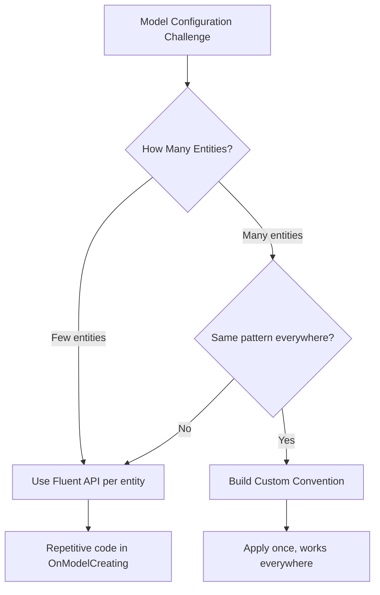
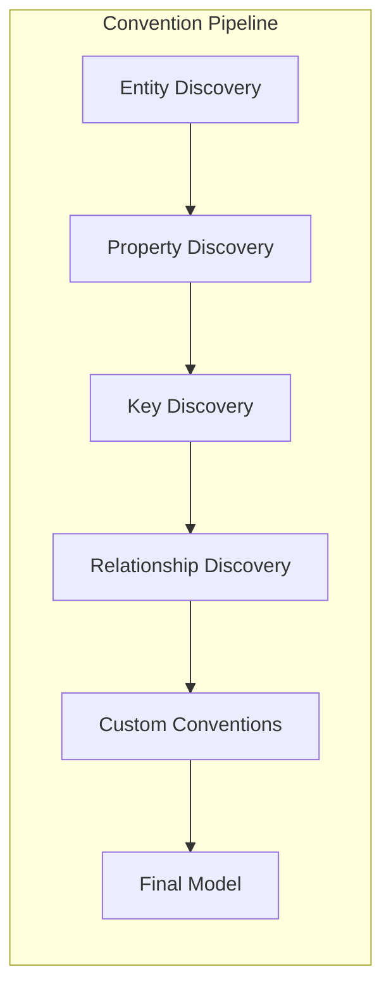
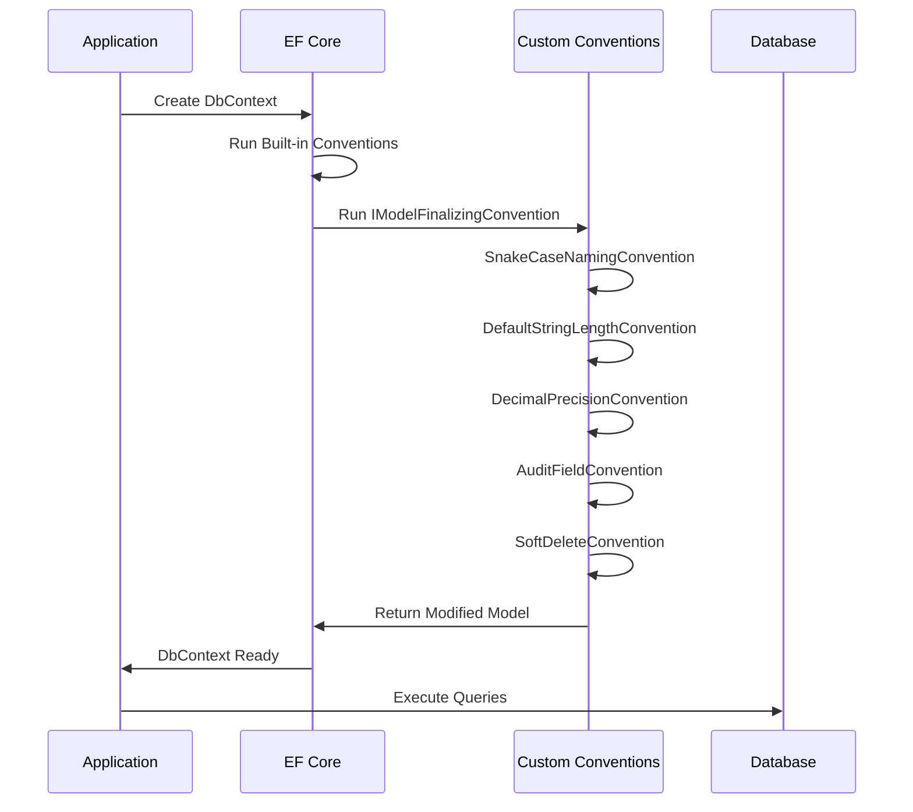
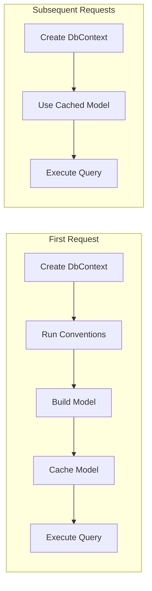

# How to Build Custom EF Core Conventions

Author: [nawazdhandala](https://github.com/nawazdhandala)

Tags: C#, Entity Framework Core, .NET, Database, ORM, Conventions, Clean Architecture

Description: Learn how to build custom conventions in Entity Framework Core to enforce naming standards, automate configuration, and reduce repetitive code across your entire data model.

---

Entity Framework Core conventions are rules that automatically configure your model based on the shape of your entity classes. While EF Core ships with sensible defaults, real-world applications often need custom conventions to enforce team standards, support legacy databases, or reduce boilerplate configuration.

This guide shows you how to build production-ready custom conventions that scale across large codebases.

## Why Build Custom Conventions?

Before diving into code, let's understand when custom conventions make sense:



Custom conventions shine when you need to:

- Enforce snake_case or other naming standards across all tables and columns
- Automatically configure audit fields like CreatedAt and UpdatedAt
- Set default string lengths to avoid nvarchar(max)
- Apply soft delete filters globally
- Configure decimal precision for all money columns

## Understanding the Convention System

EF Core 7.0 introduced a proper convention API. Before that, developers relied on reflection loops in OnModelCreating. The new system is cleaner and more performant.



Conventions run at specific points during model building. Your custom conventions can hook into these phases to modify or extend the default behavior.

## Setting Up Convention Infrastructure

Start by creating a base class that all your conventions will inherit from. This provides consistent access to the model builder.

```csharp
using Microsoft.EntityFrameworkCore;
using Microsoft.EntityFrameworkCore.Metadata.Builders;
using Microsoft.EntityFrameworkCore.Metadata.Conventions;

// Base convention class that provides access to model configuration
// All custom conventions inherit from this to ensure consistent behavior
public abstract class BaseConvention : IModelFinalizingConvention
{
    public abstract void ProcessModelFinalizing(
        IConventionModelBuilder modelBuilder,
        IConventionContext<IConventionModelBuilder> context);
}
```

## Convention 1: Snake Case Naming

Most databases perform better with snake_case names. This convention converts all PascalCase entity and property names.

```csharp
using System.Text.RegularExpressions;
using Microsoft.EntityFrameworkCore;
using Microsoft.EntityFrameworkCore.Metadata.Builders;
using Microsoft.EntityFrameworkCore.Metadata.Conventions;

// Converts PascalCase names to snake_case for PostgreSQL compatibility
// Example: OrderItem becomes order_item, CustomerId becomes customer_id
public class SnakeCaseNamingConvention : IModelFinalizingConvention
{
    public void ProcessModelFinalizing(
        IConventionModelBuilder modelBuilder,
        IConventionContext<IConventionModelBuilder> context)
    {
        foreach (var entity in modelBuilder.Metadata.GetEntityTypes())
        {
            // Convert table name: OrderItem -> order_item
            var tableName = ToSnakeCase(entity.GetTableName() ?? entity.ClrType.Name);
            entity.SetTableName(tableName);

            // Convert all column names
            foreach (var property in entity.GetProperties())
            {
                var columnName = ToSnakeCase(property.GetColumnName() ?? property.Name);
                property.SetColumnName(columnName);
            }

            // Convert foreign key constraint names
            foreach (var foreignKey in entity.GetForeignKeys())
            {
                var constraintName = ToSnakeCase(
                    foreignKey.GetConstraintName() ??
                    $"FK_{entity.GetTableName()}_{foreignKey.PrincipalEntityType.GetTableName()}");
                foreignKey.SetConstraintName(constraintName);
            }

            // Convert index names
            foreach (var index in entity.GetIndexes())
            {
                var indexName = ToSnakeCase(
                    index.GetDatabaseName() ??
                    $"IX_{entity.GetTableName()}_{string.Join("_", index.Properties.Select(p => p.Name))}");
                index.SetDatabaseName(indexName);
            }
        }
    }

    // Converts PascalCase to snake_case using regex
    // Handles consecutive capitals correctly: HTTPResponse -> http_response
    private static string ToSnakeCase(string name)
    {
        if (string.IsNullOrEmpty(name))
            return name;

        // Insert underscore before capitals, then lowercase everything
        var snakeCase = Regex.Replace(
            name,
            "([a-z0-9])([A-Z])",
            "$1_$2");

        // Handle consecutive capitals: HTTP -> http
        snakeCase = Regex.Replace(
            snakeCase,
            "([A-Z]+)([A-Z][a-z])",
            "$1_$2");

        return snakeCase.ToLowerInvariant();
    }
}
```

## Convention 2: Automatic Audit Fields

Most applications track when records are created and modified. This convention automatically configures audit properties.

```csharp
using Microsoft.EntityFrameworkCore;
using Microsoft.EntityFrameworkCore.Metadata.Builders;
using Microsoft.EntityFrameworkCore.Metadata.Conventions;

// Interface that entities implement to get automatic audit tracking
public interface IAuditable
{
    DateTime CreatedAt { get; set; }
    DateTime? UpdatedAt { get; set; }
    string CreatedBy { get; set; }
    string? UpdatedBy { get; set; }
}

// Configures audit fields with database defaults and proper column types
// Entities implementing IAuditable get consistent audit configuration
public class AuditFieldConvention : IModelFinalizingConvention
{
    public void ProcessModelFinalizing(
        IConventionModelBuilder modelBuilder,
        IConventionContext<IConventionModelBuilder> context)
    {
        foreach (var entity in modelBuilder.Metadata.GetEntityTypes())
        {
            // Only process entities that implement IAuditable
            if (!typeof(IAuditable).IsAssignableFrom(entity.ClrType))
                continue;

            // Configure CreatedAt with database default
            var createdAt = entity.FindProperty(nameof(IAuditable.CreatedAt));
            if (createdAt != null)
            {
                createdAt.SetDefaultValueSql("CURRENT_TIMESTAMP");
                createdAt.SetColumnType("timestamp with time zone");
            }

            // Configure UpdatedAt as nullable timestamp
            var updatedAt = entity.FindProperty(nameof(IAuditable.UpdatedAt));
            if (updatedAt != null)
            {
                updatedAt.SetColumnType("timestamp with time zone");
            }

            // Configure CreatedBy with max length
            var createdBy = entity.FindProperty(nameof(IAuditable.CreatedBy));
            if (createdBy != null)
            {
                createdBy.SetMaxLength(256);
                createdBy.SetIsNullable(false);
            }

            // Configure UpdatedBy as nullable
            var updatedBy = entity.FindProperty(nameof(IAuditable.UpdatedBy));
            if (updatedBy != null)
            {
                updatedBy.SetMaxLength(256);
            }
        }
    }
}
```

To automatically populate these fields, add a SaveChanges interceptor.

```csharp
using Microsoft.EntityFrameworkCore;
using Microsoft.EntityFrameworkCore.Diagnostics;

// Interceptor that automatically sets audit fields on save
// Works with the AuditFieldConvention to provide complete audit tracking
public class AuditInterceptor : SaveChangesInterceptor
{
    private readonly ICurrentUserService _currentUser;

    public AuditInterceptor(ICurrentUserService currentUser)
    {
        _currentUser = currentUser;
    }

    public override InterceptionResult<int> SavingChanges(
        DbContextEventData eventData,
        InterceptionResult<int> result)
    {
        UpdateAuditFields(eventData.Context);
        return base.SavingChanges(eventData, result);
    }

    public override ValueTask<InterceptionResult<int>> SavingChangesAsync(
        DbContextEventData eventData,
        InterceptionResult<int> result,
        CancellationToken cancellationToken = default)
    {
        UpdateAuditFields(eventData.Context);
        return base.SavingChangesAsync(eventData, result, cancellationToken);
    }

    private void UpdateAuditFields(DbContext? context)
    {
        if (context == null) return;

        var now = DateTime.UtcNow;
        var userId = _currentUser.UserId ?? "system";

        foreach (var entry in context.ChangeTracker.Entries<IAuditable>())
        {
            switch (entry.State)
            {
                case EntityState.Added:
                    entry.Entity.CreatedAt = now;
                    entry.Entity.CreatedBy = userId;
                    break;

                case EntityState.Modified:
                    entry.Entity.UpdatedAt = now;
                    entry.Entity.UpdatedBy = userId;
                    // Prevent modification of creation fields
                    entry.Property(x => x.CreatedAt).IsModified = false;
                    entry.Property(x => x.CreatedBy).IsModified = false;
                    break;
            }
        }
    }
}
```

## Convention 3: Default String Length

Avoid nvarchar(max) columns by setting a sensible default length for all strings.

```csharp
using Microsoft.EntityFrameworkCore;
using Microsoft.EntityFrameworkCore.Metadata.Builders;
using Microsoft.EntityFrameworkCore.Metadata.Conventions;

// Sets a default max length for all string properties
// Prevents accidental nvarchar(max) columns which hurt performance
public class DefaultStringLengthConvention : IModelFinalizingConvention
{
    private readonly int _defaultMaxLength;

    public DefaultStringLengthConvention(int defaultMaxLength = 256)
    {
        _defaultMaxLength = defaultMaxLength;
    }

    public void ProcessModelFinalizing(
        IConventionModelBuilder modelBuilder,
        IConventionContext<IConventionModelBuilder> context)
    {
        foreach (var entity in modelBuilder.Metadata.GetEntityTypes())
        {
            foreach (var property in entity.GetProperties())
            {
                // Only process string properties without explicit configuration
                if (property.ClrType != typeof(string))
                    continue;

                // Skip if max length is already configured
                if (property.GetMaxLength() != null)
                    continue;

                // Skip if column type is explicitly set (e.g., text, varchar(max))
                if (property.GetColumnType() != null)
                    continue;

                property.SetMaxLength(_defaultMaxLength);
            }
        }
    }
}
```

## Convention 4: Decimal Precision

Financial applications need precise decimal handling. This convention configures all decimal properties consistently.

```csharp
using Microsoft.EntityFrameworkCore;
using Microsoft.EntityFrameworkCore.Metadata.Builders;
using Microsoft.EntityFrameworkCore.Metadata.Conventions;

// Configures consistent decimal precision across all entities
// Prevents data loss from default decimal precision
public class DecimalPrecisionConvention : IModelFinalizingConvention
{
    private readonly int _precision;
    private readonly int _scale;

    // Default to 18,4 which handles most currency scenarios
    public DecimalPrecisionConvention(int precision = 18, int scale = 4)
    {
        _precision = precision;
        _scale = scale;
    }

    public void ProcessModelFinalizing(
        IConventionModelBuilder modelBuilder,
        IConventionContext<IConventionModelBuilder> context)
    {
        foreach (var entity in modelBuilder.Metadata.GetEntityTypes())
        {
            foreach (var property in entity.GetProperties())
            {
                // Process decimal and nullable decimal properties
                var clrType = property.ClrType;
                if (clrType != typeof(decimal) && clrType != typeof(decimal?))
                    continue;

                // Skip if precision is already configured
                if (property.GetPrecision() != null)
                    continue;

                property.SetPrecision(_precision);
                property.SetScale(_scale);
            }
        }
    }
}
```

## Convention 5: Global Soft Delete Filter

Implement soft delete without polluting every query with manual filters.

```csharp
using System.Linq.Expressions;
using Microsoft.EntityFrameworkCore;
using Microsoft.EntityFrameworkCore.Metadata.Builders;
using Microsoft.EntityFrameworkCore.Metadata.Conventions;

// Interface for entities that support soft delete
public interface ISoftDelete
{
    bool IsDeleted { get; set; }
    DateTime? DeletedAt { get; set; }
}

// Automatically applies query filters to exclude soft-deleted records
// All queries automatically filter out deleted records unless explicitly included
public class SoftDeleteConvention : IModelFinalizingConvention
{
    public void ProcessModelFinalizing(
        IConventionModelBuilder modelBuilder,
        IConventionContext<IConventionModelBuilder> context)
    {
        foreach (var entity in modelBuilder.Metadata.GetEntityTypes())
        {
            if (!typeof(ISoftDelete).IsAssignableFrom(entity.ClrType))
                continue;

            // Build filter expression: entity => !entity.IsDeleted
            var parameter = Expression.Parameter(entity.ClrType, "e");
            var property = Expression.Property(parameter, nameof(ISoftDelete.IsDeleted));
            var filter = Expression.Lambda(
                Expression.Equal(property, Expression.Constant(false)),
                parameter);

            entity.SetQueryFilter(filter);

            // Configure the DeletedAt column
            var deletedAt = entity.FindProperty(nameof(ISoftDelete.DeletedAt));
            if (deletedAt != null)
            {
                deletedAt.SetColumnType("timestamp with time zone");
            }
        }
    }
}
```

To query including soft-deleted records, use IgnoreQueryFilters().

```csharp
// Normal query - automatically excludes deleted records
var activeUsers = await _context.Users.ToListAsync();

// Include deleted records when needed
var allUsers = await _context.Users
    .IgnoreQueryFilters()
    .ToListAsync();

// Soft delete instead of hard delete
public async Task SoftDeleteAsync<T>(T entity) where T : class, ISoftDelete
{
    entity.IsDeleted = true;
    entity.DeletedAt = DateTime.UtcNow;
    await _context.SaveChangesAsync();
}
```

## Registering Conventions

Register your conventions by overriding ConfigureConventions in your DbContext.

```csharp
using Microsoft.EntityFrameworkCore;

public class ApplicationDbContext : DbContext
{
    public DbSet<User> Users => Set<User>();
    public DbSet<Order> Orders => Set<Order>();
    public DbSet<Product> Products => Set<Product>();

    public ApplicationDbContext(DbContextOptions<ApplicationDbContext> options)
        : base(options)
    {
    }

    // Register all custom conventions here
    // Order matters - conventions run in the order they're added
    protected override void ConfigureConventions(
        ModelConfigurationBuilder configurationBuilder)
    {
        // Add conventions in priority order
        configurationBuilder.Conventions.Add(_ => new SnakeCaseNamingConvention());
        configurationBuilder.Conventions.Add(_ => new DefaultStringLengthConvention(512));
        configurationBuilder.Conventions.Add(_ => new DecimalPrecisionConvention(18, 4));
        configurationBuilder.Conventions.Add(_ => new AuditFieldConvention());
        configurationBuilder.Conventions.Add(_ => new SoftDeleteConvention());
    }

    protected override void OnModelCreating(ModelBuilder modelBuilder)
    {
        base.OnModelCreating(modelBuilder);

        // Entity-specific configuration still goes here
        // Conventions handle the cross-cutting concerns
    }
}
```

## Convention Execution Order

Understanding when conventions run helps you design them correctly.



## Testing Your Conventions

Always test conventions to ensure they configure entities correctly.

```csharp
using Microsoft.EntityFrameworkCore;
using Xunit;

public class ConventionTests
{
    [Fact]
    public void SnakeCaseConvention_ConvertsTableNames()
    {
        // Arrange
        var options = new DbContextOptionsBuilder<ApplicationDbContext>()
            .UseInMemoryDatabase("TestDb")
            .Options;

        using var context = new ApplicationDbContext(options);

        // Act
        var userEntity = context.Model.FindEntityType(typeof(User));
        var tableName = userEntity?.GetTableName();

        // Assert
        Assert.Equal("user", tableName);
    }

    [Fact]
    public void SnakeCaseConvention_ConvertsColumnNames()
    {
        var options = new DbContextOptionsBuilder<ApplicationDbContext>()
            .UseInMemoryDatabase("TestDb")
            .Options;

        using var context = new ApplicationDbContext(options);

        var userEntity = context.Model.FindEntityType(typeof(User));
        var firstNameColumn = userEntity?.FindProperty("FirstName")?.GetColumnName();

        Assert.Equal("first_name", firstNameColumn);
    }

    [Fact]
    public void DefaultStringLengthConvention_SetsMaxLength()
    {
        var options = new DbContextOptionsBuilder<ApplicationDbContext>()
            .UseInMemoryDatabase("TestDb")
            .Options;

        using var context = new ApplicationDbContext(options);

        var userEntity = context.Model.FindEntityType(typeof(User));
        var emailMaxLength = userEntity?.FindProperty("Email")?.GetMaxLength();

        Assert.Equal(512, emailMaxLength);
    }

    [Fact]
    public void SoftDeleteConvention_AppliesQueryFilter()
    {
        var options = new DbContextOptionsBuilder<ApplicationDbContext>()
            .UseInMemoryDatabase("TestDb")
            .Options;

        using var context = new ApplicationDbContext(options);

        var userEntity = context.Model.FindEntityType(typeof(User));
        var queryFilter = userEntity?.GetQueryFilter();

        Assert.NotNull(queryFilter);
    }
}
```

## Advanced: Attribute-Based Convention

Sometimes you want fine-grained control. Create an attribute that conventions can check.

```csharp
using System;
using System.Reflection;
using Microsoft.EntityFrameworkCore;
using Microsoft.EntityFrameworkCore.Metadata.Builders;
using Microsoft.EntityFrameworkCore.Metadata.Conventions;

// Attribute to mark properties as encrypted in database
[AttributeUsage(AttributeTargets.Property)]
public class EncryptedAttribute : Attribute { }

// Attribute to specify custom column type
[AttributeUsage(AttributeTargets.Property)]
public class ColumnTypeAttribute : Attribute
{
    public string TypeName { get; }
    public ColumnTypeAttribute(string typeName) => TypeName = typeName;
}

// Convention that processes custom attributes
// Allows mixing convention-based and attribute-based configuration
public class AttributeBasedConvention : IModelFinalizingConvention
{
    public void ProcessModelFinalizing(
        IConventionModelBuilder modelBuilder,
        IConventionContext<IConventionModelBuilder> context)
    {
        foreach (var entity in modelBuilder.Metadata.GetEntityTypes())
        {
            foreach (var property in entity.GetProperties())
            {
                var clrProperty = property.PropertyInfo;
                if (clrProperty == null)
                    continue;

                // Check for ColumnType attribute
                var columnTypeAttr = clrProperty.GetCustomAttribute<ColumnTypeAttribute>();
                if (columnTypeAttr != null)
                {
                    property.SetColumnType(columnTypeAttr.TypeName);
                }

                // Check for Encrypted attribute - set up value converter
                var encryptedAttr = clrProperty.GetCustomAttribute<EncryptedAttribute>();
                if (encryptedAttr != null && property.ClrType == typeof(string))
                {
                    // Mark column for encryption processing
                    property.SetAnnotation("Encrypted", true);
                }
            }
        }
    }
}

// Example entity using custom attributes
public class UserCredential
{
    public int Id { get; set; }

    public string Username { get; set; } = string.Empty;

    [Encrypted]
    public string PasswordHash { get; set; } = string.Empty;

    [ColumnType("jsonb")]
    public string Metadata { get; set; } = "{}";
}
```

## Complete Example: Putting It All Together

Here is a complete example showing all conventions working together.

```csharp
using Microsoft.EntityFrameworkCore;
using Microsoft.Extensions.DependencyInjection;

// Entity base class with audit and soft delete support
public abstract class BaseEntity : IAuditable, ISoftDelete
{
    public int Id { get; set; }
    public DateTime CreatedAt { get; set; }
    public DateTime? UpdatedAt { get; set; }
    public string CreatedBy { get; set; } = string.Empty;
    public string? UpdatedBy { get; set; }
    public bool IsDeleted { get; set; }
    public DateTime? DeletedAt { get; set; }
}

// Domain entities
public class Customer : BaseEntity
{
    public string FirstName { get; set; } = string.Empty;
    public string LastName { get; set; } = string.Empty;
    public string Email { get; set; } = string.Empty;
    public ICollection<Order> Orders { get; set; } = new List<Order>();
}

public class Order : BaseEntity
{
    public int CustomerId { get; set; }
    public Customer Customer { get; set; } = null!;
    public decimal TotalAmount { get; set; }
    public OrderStatus Status { get; set; }
    public ICollection<OrderItem> Items { get; set; } = new List<OrderItem>();
}

public class OrderItem : BaseEntity
{
    public int OrderId { get; set; }
    public Order Order { get; set; } = null!;
    public string ProductName { get; set; } = string.Empty;
    public int Quantity { get; set; }
    public decimal UnitPrice { get; set; }
}

public enum OrderStatus
{
    Pending,
    Confirmed,
    Shipped,
    Delivered,
    Cancelled
}

// DbContext with all conventions applied
public class ECommerceDbContext : DbContext
{
    public DbSet<Customer> Customers => Set<Customer>();
    public DbSet<Order> Orders => Set<Order>();
    public DbSet<OrderItem> OrderItems => Set<OrderItem>();

    public ECommerceDbContext(DbContextOptions<ECommerceDbContext> options)
        : base(options)
    {
    }

    protected override void ConfigureConventions(
        ModelConfigurationBuilder configurationBuilder)
    {
        configurationBuilder.Conventions.Add(_ => new SnakeCaseNamingConvention());
        configurationBuilder.Conventions.Add(_ => new DefaultStringLengthConvention(256));
        configurationBuilder.Conventions.Add(_ => new DecimalPrecisionConvention(18, 2));
        configurationBuilder.Conventions.Add(_ => new AuditFieldConvention());
        configurationBuilder.Conventions.Add(_ => new SoftDeleteConvention());
    }
}

// Service registration
public static class ServiceCollectionExtensions
{
    public static IServiceCollection AddECommerceDatabase(
        this IServiceCollection services,
        string connectionString)
    {
        services.AddScoped<ICurrentUserService, CurrentUserService>();

        services.AddDbContext<ECommerceDbContext>((sp, options) =>
        {
            options.UseNpgsql(connectionString);
            options.AddInterceptors(
                new AuditInterceptor(sp.GetRequiredService<ICurrentUserService>()));
        });

        return services;
    }
}
```

## Generated Database Schema

After migrations, your database will have clean, consistent naming.

```sql
-- Generated table structure (PostgreSQL)
CREATE TABLE customer (
    id SERIAL PRIMARY KEY,
    first_name VARCHAR(256) NOT NULL,
    last_name VARCHAR(256) NOT NULL,
    email VARCHAR(256) NOT NULL,
    created_at TIMESTAMP WITH TIME ZONE DEFAULT CURRENT_TIMESTAMP,
    updated_at TIMESTAMP WITH TIME ZONE,
    created_by VARCHAR(256) NOT NULL,
    updated_by VARCHAR(256),
    is_deleted BOOLEAN NOT NULL DEFAULT FALSE,
    deleted_at TIMESTAMP WITH TIME ZONE
);

CREATE TABLE "order" (
    id SERIAL PRIMARY KEY,
    customer_id INTEGER NOT NULL REFERENCES customer(id),
    total_amount DECIMAL(18, 2) NOT NULL,
    status INTEGER NOT NULL,
    created_at TIMESTAMP WITH TIME ZONE DEFAULT CURRENT_TIMESTAMP,
    updated_at TIMESTAMP WITH TIME ZONE,
    created_by VARCHAR(256) NOT NULL,
    updated_by VARCHAR(256),
    is_deleted BOOLEAN NOT NULL DEFAULT FALSE,
    deleted_at TIMESTAMP WITH TIME ZONE
);

CREATE TABLE order_item (
    id SERIAL PRIMARY KEY,
    order_id INTEGER NOT NULL REFERENCES "order"(id),
    product_name VARCHAR(256) NOT NULL,
    quantity INTEGER NOT NULL,
    unit_price DECIMAL(18, 2) NOT NULL,
    created_at TIMESTAMP WITH TIME ZONE DEFAULT CURRENT_TIMESTAMP,
    updated_at TIMESTAMP WITH TIME ZONE,
    created_by VARCHAR(256) NOT NULL,
    updated_by VARCHAR(256),
    is_deleted BOOLEAN NOT NULL DEFAULT FALSE,
    deleted_at TIMESTAMP WITH TIME ZONE
);
```

## Performance Considerations

Custom conventions run once during model building, which happens when the first DbContext instance is created. The model is then cached, so conventions have zero runtime performance impact on queries.



## Conclusion

Custom EF Core conventions eliminate repetitive configuration code and enforce consistent standards across your data model. Start with the conventions shown here, then adapt them to your specific needs. The key benefits are:

- Write configuration logic once, apply everywhere
- Enforce team standards automatically
- Reduce OnModelCreating clutter
- Make entity classes cleaner and more focused

When building conventions, remember to test them thoroughly and consider the order in which they execute. A well-designed convention system makes your data layer more maintainable and helps new team members follow established patterns automatically.
