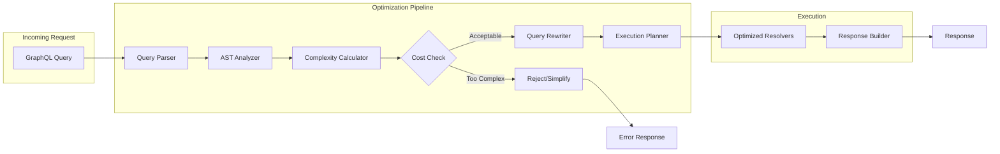
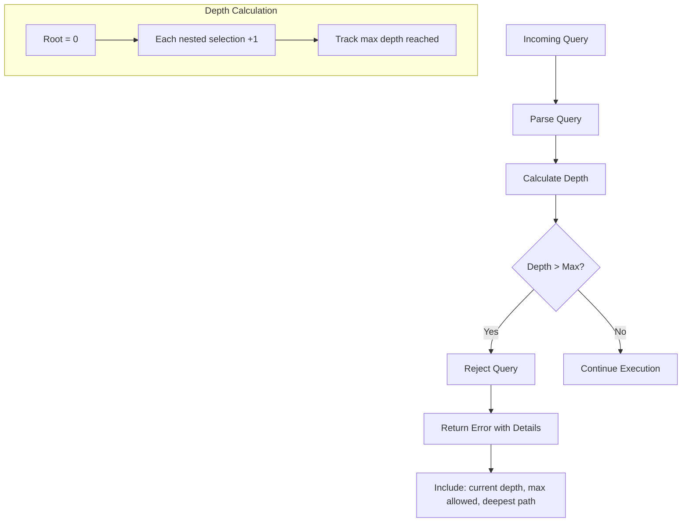
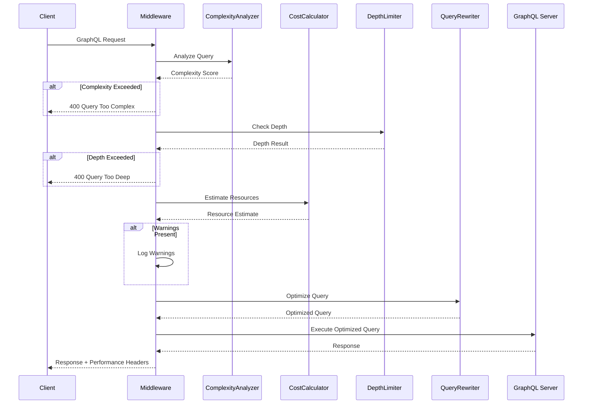

# How to Build GraphQL Query Optimization

Author: [nawazdhandala](https://github.com/nawazdhandala)

Tags: GraphQL, Query Optimization, Performance Engineering, Query Analysis, Cost Calculation, Middleware, Backend Architecture

Description: A hands-on guide to building GraphQL query optimization infrastructure from scratch, including query complexity analyzers, cost calculators, automatic query rewriting, and performance monitoring middleware for production APIs.

---

Optimizing individual GraphQL queries is important, but building a systematic query optimization layer transforms your API from reactive firefighting to proactive performance management. This guide shows you how to construct query optimization infrastructure that automatically analyzes, limits, and improves queries before they hit your resolvers.

## The Query Optimization Pipeline

Before diving into code, let's understand what a complete optimization system looks like.



## Building a Query Complexity Analyzer

The first component measures how expensive a query will be before executing it. This prevents clients from crafting queries that overwhelm your server.

This analyzer walks the GraphQL AST (Abstract Syntax Tree) and assigns costs to each field based on configuration. Nested fields multiply their parent costs, and list fields add pagination multipliers.

```typescript
// src/optimization/complexity-analyzer.ts
// A production-ready complexity analyzer that calculates query cost
// by walking the AST and summing field weights

import {
  DocumentNode,
  FieldNode,
  FragmentDefinitionNode,
  FragmentSpreadNode,
  InlineFragmentNode,
  OperationDefinitionNode,
  SelectionSetNode,
  getNamedType,
  GraphQLObjectType,
  GraphQLSchema,
  isListType,
  isNonNullType,
} from 'graphql';

// Configuration for field-specific costs
interface ComplexityConfig {
  // Default cost for scalar fields
  scalarCost: number;
  // Default cost for object fields
  objectCost: number;
  // Multiplier applied to list fields
  listMultiplier: number;
  // Maximum allowed complexity
  maxComplexity: number;
  // Field-specific cost overrides
  fieldCosts: Record<string, number>;
  // Depth-based cost multiplier (compounds per level)
  depthMultiplier: number;
}

const defaultConfig: ComplexityConfig = {
  scalarCost: 1,
  objectCost: 2,
  listMultiplier: 10,
  maxComplexity: 1000,
  fieldCosts: {},
  depthMultiplier: 1.5,
};

interface AnalysisResult {
  complexity: number;
  depth: number;
  fieldCount: number;
  breakdown: FieldCostBreakdown[];
  exceeds: boolean;
}

interface FieldCostBreakdown {
  path: string;
  cost: number;
  reason: string;
}

export class ComplexityAnalyzer {
  private schema: GraphQLSchema;
  private config: ComplexityConfig;
  private fragments: Map<string, FragmentDefinitionNode>;

  constructor(schema: GraphQLSchema, config: Partial<ComplexityConfig> = {}) {
    this.schema = schema;
    this.config = { ...defaultConfig, ...config };
    this.fragments = new Map();
  }

  // Main entry point: analyzes a complete GraphQL document
  analyze(document: DocumentNode): AnalysisResult {
    // First pass: collect all fragment definitions
    this.fragments.clear();
    for (const definition of document.definitions) {
      if (definition.kind === 'FragmentDefinition') {
        this.fragments.set(definition.name.value, definition);
      }
    }

    // Find the operation to analyze
    const operation = document.definitions.find(
      (def): def is OperationDefinitionNode =>
        def.kind === 'OperationDefinition'
    );

    if (!operation) {
      return {
        complexity: 0,
        depth: 0,
        fieldCount: 0,
        breakdown: [],
        exceeds: false,
      };
    }

    // Get the root type based on operation type
    const rootType = this.getRootType(operation.operation);
    if (!rootType) {
      throw new Error(`No root type for operation: ${operation.operation}`);
    }

    const breakdown: FieldCostBreakdown[] = [];
    const { complexity, depth, fieldCount } = this.analyzeSelectionSet(
      operation.selectionSet,
      rootType,
      '',
      1,
      1,
      breakdown
    );

    return {
      complexity,
      depth,
      fieldCount,
      breakdown,
      exceeds: complexity > this.config.maxComplexity,
    };
  }

  // Recursively analyze a selection set and calculate costs
  private analyzeSelectionSet(
    selectionSet: SelectionSetNode,
    parentType: GraphQLObjectType,
    path: string,
    currentDepth: number,
    multiplier: number,
    breakdown: FieldCostBreakdown[]
  ): { complexity: number; depth: number; fieldCount: number } {
    let totalComplexity = 0;
    let maxDepth = currentDepth;
    let fieldCount = 0;

    for (const selection of selectionSet.selections) {
      if (selection.kind === 'Field') {
        const result = this.analyzeField(
          selection,
          parentType,
          path,
          currentDepth,
          multiplier,
          breakdown
        );
        totalComplexity += result.complexity;
        maxDepth = Math.max(maxDepth, result.depth);
        fieldCount += result.fieldCount;
      } else if (selection.kind === 'FragmentSpread') {
        const result = this.analyzeFragmentSpread(
          selection,
          parentType,
          path,
          currentDepth,
          multiplier,
          breakdown
        );
        totalComplexity += result.complexity;
        maxDepth = Math.max(maxDepth, result.depth);
        fieldCount += result.fieldCount;
      } else if (selection.kind === 'InlineFragment') {
        const result = this.analyzeInlineFragment(
          selection,
          parentType,
          path,
          currentDepth,
          multiplier,
          breakdown
        );
        totalComplexity += result.complexity;
        maxDepth = Math.max(maxDepth, result.depth);
        fieldCount += result.fieldCount;
      }
    }

    return { complexity: totalComplexity, depth: maxDepth, fieldCount };
  }

  // Analyze a single field and its nested selections
  private analyzeField(
    field: FieldNode,
    parentType: GraphQLObjectType,
    path: string,
    currentDepth: number,
    multiplier: number,
    breakdown: FieldCostBreakdown[]
  ): { complexity: number; depth: number; fieldCount: number } {
    const fieldName = field.name.value;
    const fieldPath = path ? `${path}.${fieldName}` : fieldName;

    // Skip introspection fields
    if (fieldName.startsWith('__')) {
      return { complexity: 0, depth: currentDepth, fieldCount: 0 };
    }

    const fieldDef = parentType.getFields()[fieldName];
    if (!fieldDef) {
      return { complexity: 0, depth: currentDepth, fieldCount: 0 };
    }

    // Determine base cost for this field
    let baseCost = this.getFieldCost(fieldPath, fieldDef.type);

    // Apply depth multiplier
    const depthCost = baseCost * Math.pow(this.config.depthMultiplier, currentDepth - 1);

    // Check if this is a list type and apply multiplier
    let listMultiplier = 1;
    let fieldType = fieldDef.type;

    // Unwrap NonNull wrapper
    if (isNonNullType(fieldType)) {
      fieldType = fieldType.ofType;
    }

    if (isListType(fieldType)) {
      // Check for pagination arguments to estimate list size
      const firstArg = field.arguments?.find(arg => arg.name.value === 'first');
      const limitArg = field.arguments?.find(arg => arg.name.value === 'limit');

      if (firstArg && firstArg.value.kind === 'IntValue') {
        listMultiplier = parseInt(firstArg.value.value, 10);
      } else if (limitArg && limitArg.value.kind === 'IntValue') {
        listMultiplier = parseInt(limitArg.value.value, 10);
      } else {
        listMultiplier = this.config.listMultiplier;
      }
    }

    const totalMultiplier = multiplier * listMultiplier;
    let fieldComplexity = depthCost * totalMultiplier;
    let maxDepth = currentDepth;
    let fieldCount = 1;

    // Record this field's cost
    breakdown.push({
      path: fieldPath,
      cost: fieldComplexity,
      reason: `base:${baseCost} x depth:${Math.pow(this.config.depthMultiplier, currentDepth - 1).toFixed(2)} x list:${totalMultiplier}`,
    });

    // Analyze nested selections if present
    if (field.selectionSet) {
      const namedType = getNamedType(fieldDef.type);
      if (namedType instanceof GraphQLObjectType) {
        const nested = this.analyzeSelectionSet(
          field.selectionSet,
          namedType,
          fieldPath,
          currentDepth + 1,
          totalMultiplier,
          breakdown
        );
        fieldComplexity += nested.complexity;
        maxDepth = Math.max(maxDepth, nested.depth);
        fieldCount += nested.fieldCount;
      }
    }

    return { complexity: fieldComplexity, depth: maxDepth, fieldCount };
  }

  // Handle fragment spreads by looking up the fragment definition
  private analyzeFragmentSpread(
    spread: FragmentSpreadNode,
    parentType: GraphQLObjectType,
    path: string,
    currentDepth: number,
    multiplier: number,
    breakdown: FieldCostBreakdown[]
  ): { complexity: number; depth: number; fieldCount: number } {
    const fragment = this.fragments.get(spread.name.value);
    if (!fragment) {
      return { complexity: 0, depth: currentDepth, fieldCount: 0 };
    }

    return this.analyzeSelectionSet(
      fragment.selectionSet,
      parentType,
      path,
      currentDepth,
      multiplier,
      breakdown
    );
  }

  // Handle inline fragments
  private analyzeInlineFragment(
    fragment: InlineFragmentNode,
    parentType: GraphQLObjectType,
    path: string,
    currentDepth: number,
    multiplier: number,
    breakdown: FieldCostBreakdown[]
  ): { complexity: number; depth: number; fieldCount: number } {
    // If type condition is specified, use that type
    let type = parentType;
    if (fragment.typeCondition) {
      const typeName = fragment.typeCondition.name.value;
      const namedType = this.schema.getType(typeName);
      if (namedType instanceof GraphQLObjectType) {
        type = namedType;
      }
    }

    return this.analyzeSelectionSet(
      fragment.selectionSet,
      type,
      path,
      currentDepth,
      multiplier,
      breakdown
    );
  }

  // Get the cost for a specific field, checking overrides first
  private getFieldCost(path: string, type: any): number {
    // Check for explicit field cost override
    if (this.config.fieldCosts[path]) {
      return this.config.fieldCosts[path];
    }

    // Determine cost based on type
    const namedType = getNamedType(type);
    if (namedType instanceof GraphQLObjectType) {
      return this.config.objectCost;
    }

    return this.config.scalarCost;
  }

  // Get the root type for an operation
  private getRootType(operation: string): GraphQLObjectType | null {
    switch (operation) {
      case 'query':
        return this.schema.getQueryType() || null;
      case 'mutation':
        return this.schema.getMutationType() || null;
      case 'subscription':
        return this.schema.getSubscriptionType() || null;
      default:
        return null;
    }
  }
}
```

## Building a Query Cost Calculator with Resource Estimation

Beyond simple complexity scores, a cost calculator estimates actual resource usage like database queries, memory, and CPU time.

This calculator integrates with your resolver metadata to provide accurate resource estimates before query execution.

```typescript
// src/optimization/cost-calculator.ts
// Estimates actual resource costs (DB queries, memory, CPU)
// by combining static analysis with resolver metadata

import { DocumentNode, FieldNode, visit } from 'graphql';

// Metadata about what resources a resolver consumes
interface ResolverMetadata {
  // Estimated number of database queries
  dbQueries: number;
  // Whether this resolver uses DataLoader batching
  batched: boolean;
  // Estimated memory usage in KB
  memoryKB: number;
  // Estimated CPU time in milliseconds
  cpuMs: number;
  // External API calls
  externalCalls: number;
}

// Registry of resolver resource metadata
type ResolverRegistry = Record<string, ResolverMetadata>;

interface ResourceEstimate {
  totalDbQueries: number;
  totalMemoryKB: number;
  totalCpuMs: number;
  totalExternalCalls: number;
  estimatedLatencyMs: number;
  warnings: string[];
}

// Default metadata for resolvers without explicit configuration
const defaultResolverMetadata: ResolverMetadata = {
  dbQueries: 1,
  batched: false,
  memoryKB: 10,
  cpuMs: 1,
  externalCalls: 0,
};

export class CostCalculator {
  private resolverRegistry: ResolverRegistry;
  private thresholds: {
    maxDbQueries: number;
    maxMemoryKB: number;
    maxCpuMs: number;
    maxExternalCalls: number;
  };

  constructor(
    resolverRegistry: ResolverRegistry = {},
    thresholds = {
      maxDbQueries: 50,
      maxMemoryKB: 10240,
      maxCpuMs: 5000,
      maxExternalCalls: 10,
    }
  ) {
    this.resolverRegistry = resolverRegistry;
    this.thresholds = thresholds;
  }

  // Calculate resource estimates for a query
  estimate(document: DocumentNode, variables: Record<string, any> = {}): ResourceEstimate {
    const fieldPaths: string[] = [];
    const listSizes: Map<string, number> = new Map();
    let currentPath: string[] = [];

    // Walk the AST to collect all field paths and list sizes
    visit(document, {
      Field: {
        enter: (node: FieldNode) => {
          const fieldName = node.name.value;
          currentPath.push(fieldName);
          const fullPath = currentPath.join('.');
          fieldPaths.push(fullPath);

          // Extract list size from arguments
          const firstArg = node.arguments?.find(a => a.name.value === 'first');
          const limitArg = node.arguments?.find(a => a.name.value === 'limit');

          if (firstArg && firstArg.value.kind === 'IntValue') {
            listSizes.set(fullPath, parseInt(firstArg.value.value, 10));
          } else if (limitArg && limitArg.value.kind === 'IntValue') {
            listSizes.set(fullPath, parseInt(limitArg.value.value, 10));
          } else if (firstArg && firstArg.value.kind === 'Variable') {
            const varName = firstArg.value.name.value;
            if (variables[varName]) {
              listSizes.set(fullPath, variables[varName]);
            }
          }
        },
        leave: () => {
          currentPath.pop();
        },
      },
    });

    // Calculate resource estimates
    let totalDbQueries = 0;
    let totalMemoryKB = 0;
    let totalCpuMs = 0;
    let totalExternalCalls = 0;
    const warnings: string[] = [];

    for (const path of fieldPaths) {
      const metadata = this.resolverRegistry[path] || defaultResolverMetadata;

      // Calculate multiplier based on parent list sizes
      let multiplier = 1;
      const pathParts = path.split('.');
      for (let i = 1; i < pathParts.length; i++) {
        const parentPath = pathParts.slice(0, i).join('.');
        const listSize = listSizes.get(parentPath);
        if (listSize) {
          // If batched, don't multiply DB queries
          if (metadata.batched) {
            // Batched resolvers only run once per batch
            multiplier = Math.max(multiplier, 1);
          } else {
            multiplier *= listSize;
          }
        }
      }

      // Apply multiplier to resource estimates
      const dbQueries = metadata.batched ? metadata.dbQueries : metadata.dbQueries * multiplier;
      totalDbQueries += dbQueries;
      totalMemoryKB += metadata.memoryKB * multiplier;
      totalCpuMs += metadata.cpuMs * multiplier;
      totalExternalCalls += metadata.externalCalls * multiplier;

      // Generate warnings for expensive fields
      if (dbQueries > 10) {
        warnings.push(`Field "${path}" may trigger ${dbQueries} database queries`);
      }
      if (metadata.externalCalls > 0 && multiplier > 1) {
        warnings.push(`Field "${path}" makes external calls and is inside a list (${multiplier}x)`);
      }
    }

    // Check against thresholds
    if (totalDbQueries > this.thresholds.maxDbQueries) {
      warnings.push(`Query exceeds DB query limit: ${totalDbQueries} > ${this.thresholds.maxDbQueries}`);
    }
    if (totalMemoryKB > this.thresholds.maxMemoryKB) {
      warnings.push(`Query exceeds memory limit: ${totalMemoryKB}KB > ${this.thresholds.maxMemoryKB}KB`);
    }
    if (totalExternalCalls > this.thresholds.maxExternalCalls) {
      warnings.push(`Query exceeds external call limit: ${totalExternalCalls} > ${this.thresholds.maxExternalCalls}`);
    }

    // Estimate total latency (simplified model)
    // Assumes DB queries take 5ms, external calls take 100ms, CPU is additive
    const estimatedLatencyMs =
      totalDbQueries * 5 +
      totalExternalCalls * 100 +
      totalCpuMs;

    return {
      totalDbQueries,
      totalMemoryKB,
      totalCpuMs,
      totalExternalCalls,
      estimatedLatencyMs,
      warnings,
    };
  }

  // Register resolver metadata for accurate cost calculation
  registerResolver(path: string, metadata: Partial<ResolverMetadata>): void {
    this.resolverRegistry[path] = {
      ...defaultResolverMetadata,
      ...metadata,
    };
  }

  // Bulk register resolvers from configuration
  registerResolvers(registry: ResolverRegistry): void {
    Object.assign(this.resolverRegistry, registry);
  }
}
```

## Building a Query Depth Limiter

Deeply nested queries can cause stack overflows and exponential resource usage. A depth limiter prevents this at the validation layer.



This depth limiter provides detailed error messages that help API consumers understand why their query was rejected and how to fix it.

```typescript
// src/optimization/depth-limiter.ts
// Prevents deeply nested queries that could cause performance issues
// Returns detailed error information to help clients fix their queries

import { DocumentNode, FieldNode, Kind, visit } from 'graphql';

interface DepthLimitResult {
  valid: boolean;
  depth: number;
  maxAllowed: number;
  deepestPath: string[];
  error?: string;
}

interface DepthLimiterOptions {
  maxDepth: number;
  // Fields to ignore when calculating depth (e.g., pagination wrappers)
  ignoreFields: string[];
  // Whether to count inline fragments as depth
  countFragments: boolean;
}

const defaultOptions: DepthLimiterOptions = {
  maxDepth: 10,
  ignoreFields: ['edges', 'node', 'pageInfo'],
  countFragments: false,
};

export class DepthLimiter {
  private options: DepthLimiterOptions;

  constructor(options: Partial<DepthLimiterOptions> = {}) {
    this.options = { ...defaultOptions, ...options };
  }

  // Check if a query exceeds the depth limit
  check(document: DocumentNode): DepthLimitResult {
    let maxDepth = 0;
    let deepestPath: string[] = [];
    const currentPath: string[] = [];

    // Track depth through query traversal
    const calculateDepth = (selectionSet: any, depth: number): number => {
      if (!selectionSet || !selectionSet.selections) {
        return depth;
      }

      let localMaxDepth = depth;

      for (const selection of selectionSet.selections) {
        if (selection.kind === Kind.FIELD) {
          const fieldName = selection.name.value;

          // Skip introspection fields
          if (fieldName.startsWith('__')) {
            continue;
          }

          // Check if this field should be ignored for depth calculation
          const shouldIgnore = this.options.ignoreFields.includes(fieldName);
          const newDepth = shouldIgnore ? depth : depth + 1;

          currentPath.push(fieldName);

          if (selection.selectionSet) {
            const nestedDepth = calculateDepth(selection.selectionSet, newDepth);
            if (nestedDepth > localMaxDepth) {
              localMaxDepth = nestedDepth;
              if (nestedDepth > maxDepth) {
                maxDepth = nestedDepth;
                deepestPath = [...currentPath];
              }
            }
          } else {
            if (newDepth > maxDepth) {
              maxDepth = newDepth;
              deepestPath = [...currentPath];
            }
            localMaxDepth = Math.max(localMaxDepth, newDepth);
          }

          currentPath.pop();
        } else if (selection.kind === Kind.INLINE_FRAGMENT) {
          const fragmentDepth = this.options.countFragments ? depth + 1 : depth;
          if (selection.selectionSet) {
            const nestedDepth = calculateDepth(selection.selectionSet, fragmentDepth);
            localMaxDepth = Math.max(localMaxDepth, nestedDepth);
          }
        } else if (selection.kind === Kind.FRAGMENT_SPREAD) {
          // Fragment spreads are handled separately by collecting fragments
          // and analyzing them inline
        }
      }

      return localMaxDepth;
    };

    // Process each operation in the document
    for (const definition of document.definitions) {
      if (definition.kind === Kind.OPERATION_DEFINITION) {
        calculateDepth(definition.selectionSet, 0);
      }
    }

    const valid = maxDepth <= this.options.maxDepth;

    return {
      valid,
      depth: maxDepth,
      maxAllowed: this.options.maxDepth,
      deepestPath,
      error: valid
        ? undefined
        : `Query depth ${maxDepth} exceeds maximum allowed depth of ${this.options.maxDepth}. ` +
          `Deepest path: ${deepestPath.join(' > ')}`,
    };
  }
}
```

## Building an Automatic Query Rewriter

Sometimes you can optimize queries automatically instead of rejecting them. A query rewriter transforms inefficient patterns into optimized ones.

```typescript
// src/optimization/query-rewriter.ts
// Automatically transforms queries to improve performance
// Handles common patterns like adding pagination and removing redundant fields

import {
  DocumentNode,
  FieldNode,
  Kind,
  SelectionSetNode,
  print,
  parse,
  visit,
} from 'graphql';

interface RewriteRule {
  // Field path pattern to match (supports wildcards)
  pattern: string;
  // Transform function
  transform: (field: FieldNode) => FieldNode | null;
  // Description for logging
  description: string;
}

interface RewriteResult {
  original: string;
  rewritten: string;
  applied: string[];
  document: DocumentNode;
}

export class QueryRewriter {
  private rules: RewriteRule[];

  constructor() {
    this.rules = [];
    this.registerDefaultRules();
  }

  // Register default optimization rules
  private registerDefaultRules(): void {
    // Rule: Add default pagination to unbounded list fields
    this.addRule({
      pattern: '*',
      transform: (field: FieldNode) => {
        // Check if this looks like a list field without pagination
        const hasFirst = field.arguments?.some(a => a.name.value === 'first');
        const hasLast = field.arguments?.some(a => a.name.value === 'last');
        const hasLimit = field.arguments?.some(a => a.name.value === 'limit');

        // List field names often end in 's' or contain 'list', 'all', etc.
        const fieldName = field.name.value.toLowerCase();
        const looksLikeList =
          fieldName.endsWith('s') ||
          fieldName.includes('list') ||
          fieldName.includes('all') ||
          fieldName.includes('many');

        if (looksLikeList && !hasFirst && !hasLast && !hasLimit) {
          // Add default pagination
          return {
            ...field,
            arguments: [
              ...(field.arguments || []),
              {
                kind: Kind.ARGUMENT,
                name: { kind: Kind.NAME, value: 'first' },
                value: { kind: Kind.INT, value: '100' },
              },
            ],
          };
        }

        return field;
      },
      description: 'Add default pagination (first: 100) to list fields',
    });

    // Rule: Remove __typename from mutations (often unnecessary)
    this.addRule({
      pattern: 'Mutation.*',
      transform: (field: FieldNode) => {
        if (!field.selectionSet) return field;

        const filteredSelections = field.selectionSet.selections.filter(
          selection =>
            !(selection.kind === Kind.FIELD && selection.name.value === '__typename')
        );

        if (filteredSelections.length === field.selectionSet.selections.length) {
          return field;
        }

        return {
          ...field,
          selectionSet: {
            ...field.selectionSet,
            selections: filteredSelections,
          },
        };
      },
      description: 'Remove __typename from mutation responses',
    });
  }

  // Add a custom rewrite rule
  addRule(rule: RewriteRule): void {
    this.rules.push(rule);
  }

  // Rewrite a query using registered rules
  rewrite(document: DocumentNode): RewriteResult {
    const original = print(document);
    const appliedRules: string[] = [];
    let currentPath: string[] = [];

    const rewritten = visit(document, {
      OperationDefinition: {
        enter: (node) => {
          currentPath = [node.operation.charAt(0).toUpperCase() + node.operation.slice(1)];
        },
        leave: () => {
          currentPath = [];
        },
      },
      Field: {
        enter: (node: FieldNode) => {
          currentPath.push(node.name.value);
          const fullPath = currentPath.join('.');

          // Apply matching rules
          let transformedNode: FieldNode | null = node;
          for (const rule of this.rules) {
            if (this.matchesPattern(fullPath, rule.pattern)) {
              const result = rule.transform(transformedNode);
              if (result !== transformedNode) {
                appliedRules.push(`${rule.description} at ${fullPath}`);
                transformedNode = result;
              }
            }
          }

          return transformedNode;
        },
        leave: () => {
          currentPath.pop();
        },
      },
    });

    return {
      original,
      rewritten: print(rewritten),
      applied: appliedRules,
      document: rewritten,
    };
  }

  // Check if a path matches a pattern (supports * wildcard)
  private matchesPattern(path: string, pattern: string): boolean {
    if (pattern === '*') return true;

    const pathParts = path.split('.');
    const patternParts = pattern.split('.');

    if (patternParts.length > pathParts.length) return false;

    for (let i = 0; i < patternParts.length; i++) {
      if (patternParts[i] !== '*' && patternParts[i] !== pathParts[i]) {
        return false;
      }
    }

    return true;
  }
}
```

## Building Optimization Middleware

Now let's combine everything into middleware that integrates with popular GraphQL servers.



This middleware class works with Express-based GraphQL servers and provides comprehensive optimization with detailed performance metrics.

```typescript
// src/middleware/optimization-middleware.ts
// Express middleware that integrates all optimization components
// Provides performance headers and detailed logging

import { Request, Response, NextFunction } from 'express';
import { parse, validate, GraphQLSchema, DocumentNode } from 'graphql';
import { ComplexityAnalyzer } from '../optimization/complexity-analyzer';
import { CostCalculator } from '../optimization/cost-calculator';
import { DepthLimiter } from '../optimization/depth-limiter';
import { QueryRewriter } from '../optimization/query-rewriter';

interface OptimizationMiddlewareOptions {
  schema: GraphQLSchema;
  maxComplexity?: number;
  maxDepth?: number;
  enableRewriting?: boolean;
  enableCostHeaders?: boolean;
  onComplexityExceeded?: (complexity: number, max: number, req: Request) => void;
  onDepthExceeded?: (depth: number, max: number, req: Request) => void;
  logger?: (message: string, data?: any) => void;
}

export function createOptimizationMiddleware(options: OptimizationMiddlewareOptions) {
  const {
    schema,
    maxComplexity = 1000,
    maxDepth = 10,
    enableRewriting = true,
    enableCostHeaders = true,
    onComplexityExceeded,
    onDepthExceeded,
    logger = console.log,
  } = options;

  // Initialize optimization components
  const complexityAnalyzer = new ComplexityAnalyzer(schema, { maxComplexity });
  const costCalculator = new CostCalculator();
  const depthLimiter = new DepthLimiter({ maxDepth });
  const queryRewriter = new QueryRewriter();

  return async function optimizationMiddleware(
    req: Request,
    res: Response,
    next: NextFunction
  ) {
    const startTime = Date.now();

    // Extract query from request
    const { query, variables = {} } = req.body;

    if (!query) {
      return next();
    }

    try {
      // Parse the query
      let document: DocumentNode;
      try {
        document = parse(query);
      } catch (parseError: any) {
        return res.status(400).json({
          errors: [{ message: `Query parse error: ${parseError.message}` }],
        });
      }

      // Validate against schema
      const validationErrors = validate(schema, document);
      if (validationErrors.length > 0) {
        return res.status(400).json({
          errors: validationErrors.map(e => ({ message: e.message })),
        });
      }

      // Check depth limit
      const depthResult = depthLimiter.check(document);
      if (!depthResult.valid) {
        if (onDepthExceeded) {
          onDepthExceeded(depthResult.depth, maxDepth, req);
        }
        logger('Query depth exceeded', {
          depth: depthResult.depth,
          maxDepth,
          path: depthResult.deepestPath,
        });
        return res.status(400).json({
          errors: [{
            message: depthResult.error,
            extensions: {
              code: 'QUERY_TOO_DEEP',
              depth: depthResult.depth,
              maxDepth: depthResult.maxAllowed,
              deepestPath: depthResult.deepestPath.join('.'),
            },
          }],
        });
      }

      // Analyze complexity
      const complexityResult = complexityAnalyzer.analyze(document);
      if (complexityResult.exceeds) {
        if (onComplexityExceeded) {
          onComplexityExceeded(complexityResult.complexity, maxComplexity, req);
        }
        logger('Query complexity exceeded', {
          complexity: complexityResult.complexity,
          maxComplexity,
          breakdown: complexityResult.breakdown.slice(0, 10),
        });
        return res.status(400).json({
          errors: [{
            message: `Query complexity ${complexityResult.complexity} exceeds maximum allowed complexity of ${maxComplexity}`,
            extensions: {
              code: 'QUERY_TOO_COMPLEX',
              complexity: complexityResult.complexity,
              maxComplexity,
              topFields: complexityResult.breakdown
                .sort((a, b) => b.cost - a.cost)
                .slice(0, 5)
                .map(f => ({ path: f.path, cost: f.cost })),
            },
          }],
        });
      }

      // Calculate resource costs
      const costEstimate = costCalculator.estimate(document, variables);

      // Log warnings
      for (const warning of costEstimate.warnings) {
        logger('Query cost warning', { warning, query: query.slice(0, 200) });
      }

      // Rewrite query if enabled
      let optimizedDocument = document;
      let rewriteInfo: any = null;
      if (enableRewriting) {
        const rewriteResult = queryRewriter.rewrite(document);
        if (rewriteResult.applied.length > 0) {
          optimizedDocument = rewriteResult.document;
          rewriteInfo = {
            applied: rewriteResult.applied,
            original: rewriteResult.original.slice(0, 500),
            rewritten: rewriteResult.rewritten.slice(0, 500),
          };
          logger('Query rewritten', rewriteInfo);
        }
      }

      // Add performance headers
      if (enableCostHeaders) {
        res.setHeader('X-GraphQL-Complexity', complexityResult.complexity.toString());
        res.setHeader('X-GraphQL-Depth', depthResult.depth.toString());
        res.setHeader('X-GraphQL-Estimated-DB-Queries', costEstimate.totalDbQueries.toString());
        res.setHeader('X-GraphQL-Estimated-Latency-Ms', costEstimate.estimatedLatencyMs.toString());
      }

      // Attach optimization metadata to request for downstream use
      (req as any).graphqlOptimization = {
        complexity: complexityResult,
        cost: costEstimate,
        depth: depthResult,
        rewrite: rewriteInfo,
        analysisTime: Date.now() - startTime,
        optimizedDocument,
      };

      next();
    } catch (error: any) {
      logger('Optimization middleware error', { error: error.message });
      // Don't block the request on optimization errors
      next();
    }
  };
}
```

## Creating a Performance Monitoring Dashboard Plugin

Track optimization metrics over time to identify problematic queries and clients.

```typescript
// src/plugins/monitoring-plugin.ts
// Apollo Server plugin that tracks query performance metrics
// Integrates with the optimization middleware for comprehensive monitoring

import { ApolloServerPlugin, GraphQLRequestListener } from '@apollo/server';

interface QueryMetrics {
  operationName: string | null;
  complexity: number;
  depth: number;
  estimatedDbQueries: number;
  actualDurationMs: number;
  timestamp: Date;
  clientId: string | null;
  wasRewritten: boolean;
  errors: number;
}

interface MetricsStore {
  record(metrics: QueryMetrics): void;
  getSlowQueries(limit: number): QueryMetrics[];
  getComplexQueries(limit: number): QueryMetrics[];
  getMetricsByClient(clientId: string): QueryMetrics[];
}

// In-memory metrics store (replace with Redis/TimescaleDB in production)
class InMemoryMetricsStore implements MetricsStore {
  private metrics: QueryMetrics[] = [];
  private maxSize: number = 10000;

  record(metrics: QueryMetrics): void {
    this.metrics.push(metrics);
    // Trim old metrics
    if (this.metrics.length > this.maxSize) {
      this.metrics = this.metrics.slice(-this.maxSize);
    }
  }

  getSlowQueries(limit: number): QueryMetrics[] {
    return [...this.metrics]
      .sort((a, b) => b.actualDurationMs - a.actualDurationMs)
      .slice(0, limit);
  }

  getComplexQueries(limit: number): QueryMetrics[] {
    return [...this.metrics]
      .sort((a, b) => b.complexity - a.complexity)
      .slice(0, limit);
  }

  getMetricsByClient(clientId: string): QueryMetrics[] {
    return this.metrics.filter(m => m.clientId === clientId);
  }
}

export function createMonitoringPlugin(
  store: MetricsStore = new InMemoryMetricsStore()
): ApolloServerPlugin {
  return {
    async requestDidStart(requestContext): Promise<GraphQLRequestListener<any>> {
      const startTime = Date.now();

      return {
        async didResolveOperation(context) {
          // Operation resolved, ready for execution
        },

        async willSendResponse(context) {
          // Get optimization data from context
          const optimization = (context.contextValue as any).graphqlOptimization;

          const metrics: QueryMetrics = {
            operationName: context.operationName || null,
            complexity: optimization?.complexity?.complexity || 0,
            depth: optimization?.depth?.depth || 0,
            estimatedDbQueries: optimization?.cost?.totalDbQueries || 0,
            actualDurationMs: Date.now() - startTime,
            timestamp: new Date(),
            clientId: context.request.http?.headers.get('x-client-id') || null,
            wasRewritten: optimization?.rewrite !== null,
            errors: context.response.body?.singleResult?.errors?.length || 0,
          };

          store.record(metrics);

          // Add actual duration header for client debugging
          context.response.http?.headers.set(
            'X-GraphQL-Duration-Ms',
            metrics.actualDurationMs.toString()
          );
        },
      };
    },
  };
}

// Export for creating custom stores
export { MetricsStore, QueryMetrics, InMemoryMetricsStore };
```

## Putting It All Together

Here's how to integrate all components into an Apollo Server setup.

```typescript
// src/server.ts
// Complete Apollo Server setup with query optimization

import { ApolloServer } from '@apollo/server';
import { expressMiddleware } from '@apollo/server/express4';
import express from 'express';
import { makeExecutableSchema } from '@graphql-tools/schema';
import { createOptimizationMiddleware } from './middleware/optimization-middleware';
import { createMonitoringPlugin, InMemoryMetricsStore } from './plugins/monitoring-plugin';
import { typeDefs } from './schema';
import { resolvers } from './resolvers';

async function startServer() {
  const app = express();
  app.use(express.json());

  // Build executable schema
  const schema = makeExecutableSchema({ typeDefs, resolvers });

  // Create metrics store for monitoring
  const metricsStore = new InMemoryMetricsStore();

  // Create Apollo Server with monitoring plugin
  const server = new ApolloServer({
    schema,
    plugins: [createMonitoringPlugin(metricsStore)],
  });

  await server.start();

  // Add optimization middleware BEFORE Apollo middleware
  app.use(
    '/graphql',
    createOptimizationMiddleware({
      schema,
      maxComplexity: 1000,
      maxDepth: 10,
      enableRewriting: true,
      enableCostHeaders: true,
      logger: (message, data) => {
        console.log(`[GraphQL Optimization] ${message}`, data || '');
      },
      onComplexityExceeded: (complexity, max, req) => {
        // Track rejected queries for analysis
        console.warn(`Rejected query from ${req.ip}: complexity ${complexity} > ${max}`);
      },
    }),
    expressMiddleware(server, {
      context: async ({ req }) => ({
        // Pass optimization data to resolvers
        graphqlOptimization: (req as any).graphqlOptimization,
      }),
    })
  );

  // Metrics endpoint for monitoring dashboards
  app.get('/graphql/metrics', (req, res) => {
    res.json({
      slowestQueries: metricsStore.getSlowQueries(10),
      mostComplexQueries: metricsStore.getComplexQueries(10),
    });
  });

  const PORT = process.env.PORT || 4000;
  app.listen(PORT, () => {
    console.log(`GraphQL server running at http://localhost:${PORT}/graphql`);
    console.log(`Metrics available at http://localhost:${PORT}/graphql/metrics`);
  });
}

startServer().catch(console.error);
```

## Testing Your Optimization System

Create tests to verify your optimization rules work correctly.

```typescript
// src/__tests__/optimization.test.ts
// Test suite for query optimization components

import { buildSchema, parse } from 'graphql';
import { ComplexityAnalyzer } from '../optimization/complexity-analyzer';
import { DepthLimiter } from '../optimization/depth-limiter';
import { QueryRewriter } from '../optimization/query-rewriter';

const testSchema = buildSchema(`
  type Query {
    users(first: Int, after: String): [User!]!
    user(id: ID!): User
    posts(first: Int): [Post!]!
  }

  type User {
    id: ID!
    name: String!
    email: String!
    posts: [Post!]!
    friends: [User!]!
  }

  type Post {
    id: ID!
    title: String!
    body: String!
    author: User!
    comments: [Comment!]!
  }

  type Comment {
    id: ID!
    text: String!
    author: User!
  }
`);

describe('ComplexityAnalyzer', () => {
  const analyzer = new ComplexityAnalyzer(testSchema, {
    maxComplexity: 100,
    listMultiplier: 10,
  });

  it('calculates simple query complexity', () => {
    const query = parse(`
      query {
        user(id: "1") {
          id
          name
        }
      }
    `);

    const result = analyzer.analyze(query);
    expect(result.complexity).toBeLessThan(10);
    expect(result.exceeds).toBe(false);
  });

  it('detects excessive complexity in nested lists', () => {
    const query = parse(`
      query {
        users {
          posts {
            comments {
              author {
                name
              }
            }
          }
        }
      }
    `);

    const result = analyzer.analyze(query);
    expect(result.exceeds).toBe(true);
    expect(result.complexity).toBeGreaterThan(100);
  });

  it('respects pagination arguments', () => {
    const query = parse(`
      query {
        users(first: 5) {
          id
          name
        }
      }
    `);

    const result = analyzer.analyze(query);
    // With first: 5, complexity should be lower than default multiplier of 10
    expect(result.complexity).toBeLessThan(50);
  });
});

describe('DepthLimiter', () => {
  const limiter = new DepthLimiter({ maxDepth: 4 });

  it('allows queries within depth limit', () => {
    const query = parse(`
      query {
        user(id: "1") {
          name
          posts {
            title
          }
        }
      }
    `);

    const result = limiter.check(query);
    expect(result.valid).toBe(true);
    expect(result.depth).toBe(3);
  });

  it('rejects queries exceeding depth limit', () => {
    const query = parse(`
      query {
        users {
          posts {
            comments {
              author {
                friends {
                  name
                }
              }
            }
          }
        }
      }
    `);

    const result = limiter.check(query);
    expect(result.valid).toBe(false);
    expect(result.depth).toBeGreaterThan(4);
    expect(result.deepestPath).toContain('friends');
  });
});

describe('QueryRewriter', () => {
  const rewriter = new QueryRewriter();

  it('adds pagination to list fields', () => {
    const query = parse(`
      query {
        users {
          id
          name
        }
      }
    `);

    const result = rewriter.rewrite(query);
    expect(result.applied.length).toBeGreaterThan(0);
    expect(result.rewritten).toContain('first');
  });
});
```

## Production Deployment Checklist

Before deploying query optimization to production, verify these items:

1. **Set appropriate thresholds**: Start with higher limits and tighten based on real traffic patterns
2. **Enable gradual rollout**: Use feature flags to enable optimization checks for a percentage of traffic
3. **Monitor false positives**: Track rejected queries and adjust rules if legitimate queries are blocked
4. **Configure alerts**: Set up alerts for sudden increases in rejected queries or high complexity averages
5. **Document client limits**: Publish complexity and depth limits in your API documentation
6. **Test with production queries**: Replay production traffic to validate optimization rules

## Summary

Building GraphQL query optimization infrastructure requires multiple coordinated components:

1. **Complexity Analyzer**: Walks the AST to calculate query cost before execution
2. **Cost Calculator**: Estimates actual resource usage based on resolver metadata
3. **Depth Limiter**: Prevents deeply nested queries that cause exponential resource usage
4. **Query Rewriter**: Automatically transforms inefficient patterns into optimized queries
5. **Optimization Middleware**: Integrates all components into your request pipeline
6. **Monitoring Plugin**: Tracks metrics over time to identify problematic patterns

By implementing these components, you transform GraphQL optimization from manual query tuning into an automated, measurable system. Start with complexity and depth limits, add monitoring to understand your traffic patterns, then gradually enable automatic rewriting as you gain confidence in the rules.

The key is building observability into every layer. When you can see exactly how expensive each query is before it runs, you can make informed decisions about limits and optimizations that balance developer experience with system performance.
