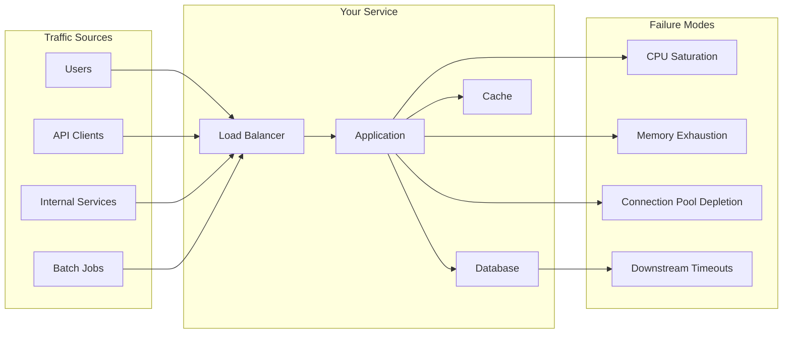
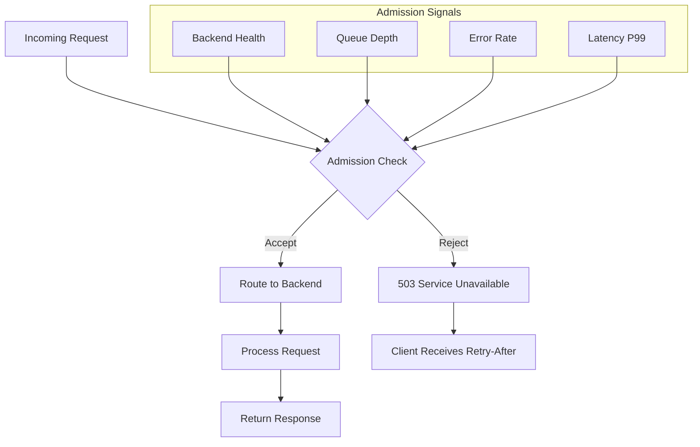
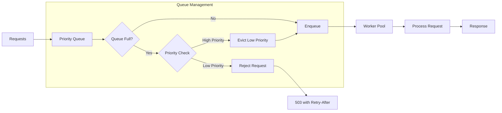
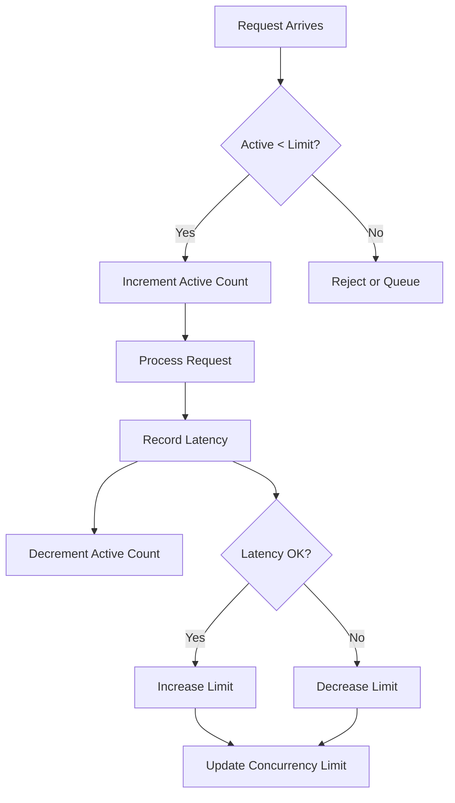
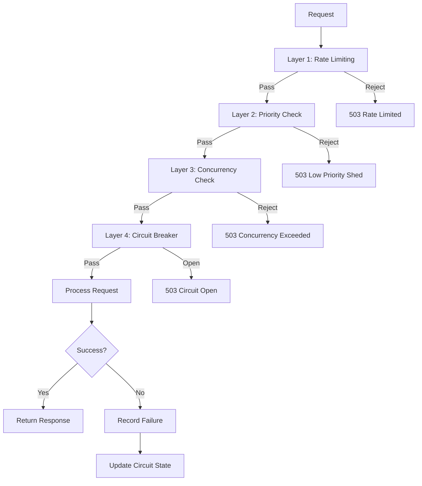
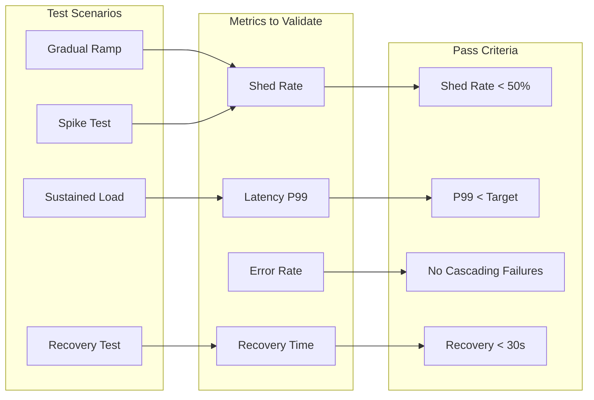
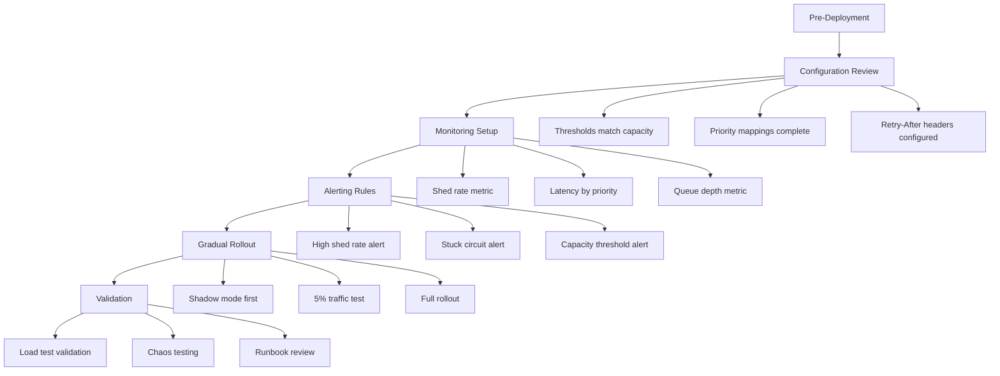

# How to Build Load Shedding Strategies

Author: [nawazdhandala](https://www.github.com/nawazdhandala)

Tags: Load Shedding, Reliability Engineering, System Design, Resilience Patterns, Backend Architecture, SRE

Description: Learn how to design and build comprehensive load shedding strategies from the ground up. This guide covers strategy selection frameworks, pattern combinations, testing methodologies, and production deployment techniques with real-world examples.

---

Your service is handling 10,000 requests per second. A marketing campaign goes viral. Traffic doubles. Then triples. Your database starts timing out. Response times climb from 50ms to 5 seconds. Users retry. Load quadruples. Everything crashes.

This scenario plays out daily across the internet. The difference between services that survive traffic spikes and those that collapse comes down to one thing: a well-designed load shedding strategy.

Load shedding is not just dropping requests when things get bad. It is a deliberate architectural decision about which work matters most and how your system should behave when demand exceeds capacity. This guide walks you through building load shedding strategies that actually work in production.

---

## Understanding the Load Shedding Problem Space

Before writing any code, you need to understand what you are protecting and from what.



Every load shedding strategy must answer three questions:

1. **What triggers shedding?** CPU usage, memory pressure, queue depth, latency, error rates, or a combination?
2. **What gets shed?** All traffic equally, or prioritized by importance?
3. **How do clients learn about shedding?** Fast failures, queuing, or degraded responses?

---

## Strategy 1: Admission Control at the Edge

The most effective load shedding happens before requests enter your system. Edge admission control evaluates requests at the load balancer or API gateway level.



This implementation uses a token bucket algorithm combined with backend health signals to make admission decisions.

```typescript
// admission-controller.ts
// Implements token bucket rate limiting with adaptive capacity based on backend health

interface AdmissionConfig {
  // Maximum requests per second at full health
  maxRPS: number;
  // Minimum RPS even when unhealthy (for health checks)
  minRPS: number;
  // How many tokens can accumulate for burst handling
  burstMultiplier: number;
  // Health check interval in milliseconds
  healthCheckIntervalMs: number;
}

interface BackendHealth {
  errorRate: number;      // 0.0 to 1.0
  latencyP99Ms: number;   // Current p99 latency
  targetLatencyMs: number; // Target p99 latency
  healthy: boolean;
}

class AdmissionController {
  private tokens: number;
  private lastRefill: number;
  private currentCapacity: number;
  private health: BackendHealth;

  constructor(private config: AdmissionConfig) {
    this.tokens = config.maxRPS * config.burstMultiplier;
    this.lastRefill = Date.now();
    this.currentCapacity = config.maxRPS;
    this.health = {
      errorRate: 0,
      latencyP99Ms: 0,
      targetLatencyMs: 100,
      healthy: true
    };
  }

  // Call this method for every incoming request
  // Returns true if request should be admitted, false if it should be rejected
  shouldAdmit(priority: RequestPriority): boolean {
    this.refillTokens();

    // Always admit critical requests if we have any capacity
    if (priority === RequestPriority.CRITICAL && this.tokens > 0) {
      this.tokens -= 1;
      return true;
    }

    // For non-critical requests, require more tokens based on health
    const tokensRequired = this.calculateTokensRequired(priority);

    if (this.tokens >= tokensRequired) {
      this.tokens -= tokensRequired;
      return true;
    }

    return false;
  }

  // Refills tokens based on elapsed time and current capacity
  private refillTokens(): void {
    const now = Date.now();
    const elapsedSeconds = (now - this.lastRefill) / 1000;

    // Refill based on current capacity (which adjusts with health)
    const newTokens = elapsedSeconds * this.currentCapacity;
    const maxTokens = this.currentCapacity * this.config.burstMultiplier;

    this.tokens = Math.min(this.tokens + newTokens, maxTokens);
    this.lastRefill = now;
  }

  // Higher priority requests cost fewer tokens
  // Lower priority requests cost more when system is stressed
  private calculateTokensRequired(priority: RequestPriority): number {
    const healthFactor = this.health.healthy ? 1 : 2;

    switch (priority) {
      case RequestPriority.CRITICAL:
        return 1;
      case RequestPriority.HIGH:
        return 1 * healthFactor;
      case RequestPriority.NORMAL:
        return 2 * healthFactor;
      case RequestPriority.LOW:
        return 4 * healthFactor;
      default:
        return 4 * healthFactor;
    }
  }

  // Call this periodically with fresh health metrics
  updateHealth(health: BackendHealth): void {
    this.health = health;

    // Adjust capacity based on health
    if (health.healthy && health.errorRate < 0.01) {
      // System is healthy, use full capacity
      this.currentCapacity = this.config.maxRPS;
    } else if (health.latencyP99Ms > health.targetLatencyMs * 2) {
      // Latency is double target, reduce capacity significantly
      this.currentCapacity = Math.max(
        this.config.minRPS,
        this.config.maxRPS * 0.5
      );
    } else if (health.errorRate > 0.05) {
      // Error rate above 5%, reduce capacity
      this.currentCapacity = Math.max(
        this.config.minRPS,
        this.config.maxRPS * (1 - health.errorRate * 2)
      );
    } else {
      // Slight degradation, reduce proportionally
      const latencyRatio = health.latencyP99Ms / health.targetLatencyMs;
      this.currentCapacity = Math.max(
        this.config.minRPS,
        this.config.maxRPS / latencyRatio
      );
    }
  }

  getStats(): AdmissionStats {
    return {
      currentCapacity: this.currentCapacity,
      maxCapacity: this.config.maxRPS,
      availableTokens: this.tokens,
      healthStatus: this.health
    };
  }
}

enum RequestPriority {
  CRITICAL = 1,  // Health checks, payment confirmations
  HIGH = 2,      // User-initiated actions
  NORMAL = 3,    // Standard API requests
  LOW = 4        // Analytics, background syncs
}

interface AdmissionStats {
  currentCapacity: number;
  maxCapacity: number;
  availableTokens: number;
  healthStatus: BackendHealth;
}
```

---

## Strategy 2: Queue-Based Load Leveling

Instead of rejecting requests immediately, queue-based strategies buffer requests and process them at a sustainable rate. This works well for workloads that can tolerate some latency.



This implementation provides a bounded priority queue with eviction policies.

```typescript
// priority-queue-shedder.ts
// Implements a bounded priority queue that evicts low-priority items when full

interface QueuedRequest<T> {
  id: string;
  data: T;
  priority: number;        // Lower number = higher priority
  enqueuedAt: number;      // Timestamp for timeout handling
  deadline: number;        // Request must be processed by this time
}

interface QueueConfig {
  maxSize: number;
  defaultTimeoutMs: number;
  processingRatePerSecond: number;
}

class PriorityQueueShedder<T> {
  private queue: QueuedRequest<T>[] = [];
  private processing: boolean = false;
  private processedCount: number = 0;
  private shedCount: number = 0;
  private evictedCount: number = 0;

  constructor(
    private config: QueueConfig,
    private processor: (request: T) => Promise<void>
  ) {}

  // Attempts to enqueue a request
  // Returns true if accepted, false if shed
  enqueue(
    id: string,
    data: T,
    priority: number,
    timeoutMs?: number
  ): EnqueueResult {
    const now = Date.now();
    const timeout = timeoutMs ?? this.config.defaultTimeoutMs;

    // Clean up expired requests first
    this.removeExpired();

    const request: QueuedRequest<T> = {
      id,
      data,
      priority,
      enqueuedAt: now,
      deadline: now + timeout
    };

    // If queue has space, add directly
    if (this.queue.length < this.config.maxSize) {
      this.insertByPriority(request);
      this.startProcessingIfNeeded();
      return { accepted: true, position: this.findPosition(id) };
    }

    // Queue is full - try to evict lower priority item
    const lowestPriorityIndex = this.findLowestPriorityIndex();
    const lowestPriority = this.queue[lowestPriorityIndex];

    // Only evict if new request has higher priority (lower number)
    if (priority < lowestPriority.priority) {
      this.queue.splice(lowestPriorityIndex, 1);
      this.evictedCount++;
      this.insertByPriority(request);
      return {
        accepted: true,
        position: this.findPosition(id),
        evicted: lowestPriority.id
      };
    }

    // Cannot accept - shed this request
    this.shedCount++;
    return {
      accepted: false,
      reason: 'queue_full',
      estimatedWaitMs: this.estimateWaitTime()
    };
  }

  // Inserts request maintaining priority order (lowest priority number first)
  private insertByPriority(request: QueuedRequest<T>): void {
    let insertIndex = this.queue.length;

    for (let i = 0; i < this.queue.length; i++) {
      if (request.priority < this.queue[i].priority) {
        insertIndex = i;
        break;
      }
    }

    this.queue.splice(insertIndex, 0, request);
  }

  private findLowestPriorityIndex(): number {
    let lowestIndex = 0;
    let lowestPriority = this.queue[0].priority;

    for (let i = 1; i < this.queue.length; i++) {
      if (this.queue[i].priority > lowestPriority) {
        lowestPriority = this.queue[i].priority;
        lowestIndex = i;
      }
    }

    return lowestIndex;
  }

  private findPosition(id: string): number {
    return this.queue.findIndex(r => r.id === id) + 1;
  }

  private removeExpired(): void {
    const now = Date.now();
    const originalLength = this.queue.length;

    this.queue = this.queue.filter(r => r.deadline > now);

    const expiredCount = originalLength - this.queue.length;
    if (expiredCount > 0) {
      this.shedCount += expiredCount;
    }
  }

  private estimateWaitTime(): number {
    if (this.queue.length === 0) return 0;

    const processingTimeMs = 1000 / this.config.processingRatePerSecond;
    return this.queue.length * processingTimeMs;
  }

  private async startProcessingIfNeeded(): Promise<void> {
    if (this.processing) return;

    this.processing = true;

    while (this.queue.length > 0) {
      const request = this.queue.shift();
      if (!request) break;

      // Skip if deadline passed
      if (Date.now() > request.deadline) {
        this.shedCount++;
        continue;
      }

      try {
        await this.processor(request.data);
        this.processedCount++;
      } catch (error) {
        // Log error but continue processing
        console.error(`Failed to process request ${request.id}:`, error);
      }

      // Rate limiting - wait between processing
      const delayMs = 1000 / this.config.processingRatePerSecond;
      await this.sleep(delayMs);
    }

    this.processing = false;
  }

  private sleep(ms: number): Promise<void> {
    return new Promise(resolve => setTimeout(resolve, ms));
  }

  getStats(): QueueStats {
    return {
      queueLength: this.queue.length,
      maxSize: this.config.maxSize,
      processedCount: this.processedCount,
      shedCount: this.shedCount,
      evictedCount: this.evictedCount,
      estimatedWaitMs: this.estimateWaitTime()
    };
  }
}

interface EnqueueResult {
  accepted: boolean;
  position?: number;
  evicted?: string;
  reason?: string;
  estimatedWaitMs?: number;
}

interface QueueStats {
  queueLength: number;
  maxSize: number;
  processedCount: number;
  shedCount: number;
  evictedCount: number;
  estimatedWaitMs: number;
}
```

---

## Strategy 3: Concurrency Limiting with Adaptive Throttling

This strategy limits the number of requests being processed simultaneously and adjusts the limit based on system performance.



This implementation uses the gradient algorithm to adjust concurrency limits based on observed latency.

```go
// concurrency_limiter.go
// Implements adaptive concurrency limiting using gradient-based adjustment

package loadshed

import (
	"context"
	"errors"
	"math"
	"sync"
	"sync/atomic"
	"time"
)

var (
	ErrLimitExceeded = errors.New("concurrency limit exceeded")
	ErrTimeout       = errors.New("request timeout waiting for capacity")
)

// ConcurrencyLimiterConfig holds configuration for the adaptive limiter
type ConcurrencyLimiterConfig struct {
	// Initial concurrency limit
	InitialLimit int
	// Minimum limit (never go below this)
	MinLimit int
	// Maximum limit (never exceed this)
	MaxLimit int
	// Target latency in milliseconds
	TargetLatencyMs float64
	// How aggressively to adjust (0.0 to 1.0)
	Smoothing float64
	// Window size for latency measurements
	WindowSize int
	// Timeout for waiting on capacity
	WaitTimeout time.Duration
}

// ConcurrencyLimiter implements adaptive concurrency control
type ConcurrencyLimiter struct {
	config    ConcurrencyLimiterConfig
	limit     int64
	inFlight  int64
	latencies []float64
	mu        sync.Mutex
	semaphore chan struct{}
}

// NewConcurrencyLimiter creates a new adaptive concurrency limiter
func NewConcurrencyLimiter(config ConcurrencyLimiterConfig) *ConcurrencyLimiter {
	cl := &ConcurrencyLimiter{
		config:    config,
		limit:     int64(config.InitialLimit),
		latencies: make([]float64, 0, config.WindowSize),
		semaphore: make(chan struct{}, config.MaxLimit),
	}

	// Pre-fill semaphore to initial limit
	for i := 0; i < config.InitialLimit; i++ {
		cl.semaphore <- struct{}{}
	}

	return cl
}

// Acquire attempts to acquire a slot for processing
// Returns a release function that must be called when processing completes
func (cl *ConcurrencyLimiter) Acquire(ctx context.Context) (func(latencyMs float64), error) {
	// Try to acquire immediately
	select {
	case <-cl.semaphore:
		atomic.AddInt64(&cl.inFlight, 1)
		return cl.createReleaseFunc(), nil
	default:
		// No immediate capacity available
	}

	// Wait with timeout
	waitCtx, cancel := context.WithTimeout(ctx, cl.config.WaitTimeout)
	defer cancel()

	select {
	case <-cl.semaphore:
		atomic.AddInt64(&cl.inFlight, 1)
		return cl.createReleaseFunc(), nil
	case <-waitCtx.Done():
		if waitCtx.Err() == context.DeadlineExceeded {
			return nil, ErrTimeout
		}
		return nil, waitCtx.Err()
	}
}

// createReleaseFunc returns a function to release the acquired slot
func (cl *ConcurrencyLimiter) createReleaseFunc() func(latencyMs float64) {
	released := false
	return func(latencyMs float64) {
		if released {
			return // Prevent double release
		}
		released = true

		atomic.AddInt64(&cl.inFlight, -1)
		cl.recordLatency(latencyMs)

		// Return token to semaphore
		select {
		case cl.semaphore <- struct{}{}:
		default:
			// Semaphore full - limit was decreased
		}
	}
}

// recordLatency records a latency measurement and adjusts the limit
func (cl *ConcurrencyLimiter) recordLatency(latencyMs float64) {
	cl.mu.Lock()
	defer cl.mu.Unlock()

	// Add to sliding window
	cl.latencies = append(cl.latencies, latencyMs)
	if len(cl.latencies) > cl.config.WindowSize {
		cl.latencies = cl.latencies[1:]
	}

	// Need enough samples before adjusting
	if len(cl.latencies) < cl.config.WindowSize/2 {
		return
	}

	// Calculate gradient based on latency vs target
	avgLatency := cl.calculateAverage()
	gradient := (cl.config.TargetLatencyMs - avgLatency) / cl.config.TargetLatencyMs

	// Adjust limit based on gradient
	currentLimit := atomic.LoadInt64(&cl.limit)
	var newLimit int64

	if gradient > 0 {
		// Latency below target - can increase limit
		// Increase slowly to avoid oscillation
		increase := math.Max(1, float64(currentLimit)*cl.config.Smoothing*gradient)
		newLimit = currentLimit + int64(increase)
	} else {
		// Latency above target - decrease limit
		// Decrease more aggressively to protect system
		decrease := math.Max(1, float64(currentLimit)*cl.config.Smoothing*math.Abs(gradient)*2)
		newLimit = currentLimit - int64(decrease)
	}

	// Apply bounds
	if newLimit < int64(cl.config.MinLimit) {
		newLimit = int64(cl.config.MinLimit)
	}
	if newLimit > int64(cl.config.MaxLimit) {
		newLimit = int64(cl.config.MaxLimit)
	}

	// Update limit
	atomic.StoreInt64(&cl.limit, newLimit)

	// Adjust semaphore capacity
	cl.adjustSemaphore(currentLimit, newLimit)
}

func (cl *ConcurrencyLimiter) calculateAverage() float64 {
	if len(cl.latencies) == 0 {
		return 0
	}
	sum := 0.0
	for _, l := range cl.latencies {
		sum += l
	}
	return sum / float64(len(cl.latencies))
}

func (cl *ConcurrencyLimiter) adjustSemaphore(oldLimit, newLimit int64) {
	if newLimit > oldLimit {
		// Add tokens to semaphore
		for i := oldLimit; i < newLimit; i++ {
			select {
			case cl.semaphore <- struct{}{}:
			default:
			}
		}
	}
	// When decreasing, tokens are naturally removed as they are not returned
}

// Stats returns current limiter statistics
type LimiterStats struct {
	CurrentLimit    int64
	InFlight        int64
	AverageLatency  float64
	SampleCount     int
}

func (cl *ConcurrencyLimiter) Stats() LimiterStats {
	cl.mu.Lock()
	avgLatency := cl.calculateAverage()
	sampleCount := len(cl.latencies)
	cl.mu.Unlock()

	return LimiterStats{
		CurrentLimit:   atomic.LoadInt64(&cl.limit),
		InFlight:       atomic.LoadInt64(&cl.inFlight),
		AverageLatency: avgLatency,
		SampleCount:    sampleCount,
	}
}
```

---

## Strategy 4: Composite Load Shedding

Production systems often need multiple shedding strategies working together. This composite approach layers different strategies for defense in depth.



This implementation combines multiple strategies into a single shedding pipeline.

```typescript
// composite-shedder.ts
// Combines multiple load shedding strategies into a unified pipeline

interface ShedDecision {
  allowed: boolean;
  reason?: string;
  layer?: string;
  retryAfterMs?: number;
}

interface RequestContext {
  id: string;
  priority: number;
  path: string;
  method: string;
  userId?: string;
  timestamp: number;
}

// Base interface for all shedding strategies
interface SheddingStrategy {
  name: string;
  shouldAllow(ctx: RequestContext): Promise<ShedDecision>;
  recordResult(ctx: RequestContext, success: boolean, latencyMs: number): void;
}

// Rate limiting strategy
class RateLimitStrategy implements SheddingStrategy {
  name = 'rate_limit';
  private requests: Map<string, number[]> = new Map();

  constructor(
    private windowMs: number,
    private maxRequests: number
  ) {}

  async shouldAllow(ctx: RequestContext): Promise<ShedDecision> {
    const key = ctx.userId || 'global';
    const now = Date.now();

    // Get requests in current window
    let timestamps = this.requests.get(key) || [];
    timestamps = timestamps.filter(t => t > now - this.windowMs);

    if (timestamps.length >= this.maxRequests) {
      const oldestInWindow = Math.min(...timestamps);
      const retryAfter = oldestInWindow + this.windowMs - now;

      return {
        allowed: false,
        reason: 'rate_limit_exceeded',
        layer: this.name,
        retryAfterMs: retryAfter
      };
    }

    timestamps.push(now);
    this.requests.set(key, timestamps);

    return { allowed: true };
  }

  recordResult(): void {
    // Rate limiting does not need result feedback
  }
}

// Priority-based shedding strategy
class PriorityStrategy implements SheddingStrategy {
  name = 'priority';
  private loadLevel: number = 0; // 0 to 1

  constructor(
    private thresholds: Map<number, number> // priority -> max load level
  ) {}

  async shouldAllow(ctx: RequestContext): Promise<ShedDecision> {
    const threshold = this.thresholds.get(ctx.priority) ?? 0.5;

    if (this.loadLevel > threshold) {
      return {
        allowed: false,
        reason: 'priority_shed',
        layer: this.name,
        retryAfterMs: 5000
      };
    }

    return { allowed: true };
  }

  recordResult(_ctx: RequestContext, success: boolean, latencyMs: number): void {
    // Adjust load level based on results
    const targetLatency = 100;

    if (!success || latencyMs > targetLatency * 2) {
      this.loadLevel = Math.min(1, this.loadLevel + 0.1);
    } else if (latencyMs < targetLatency) {
      this.loadLevel = Math.max(0, this.loadLevel - 0.05);
    }
  }

  setLoadLevel(level: number): void {
    this.loadLevel = Math.max(0, Math.min(1, level));
  }
}

// Circuit breaker strategy for downstream protection
class CircuitBreakerStrategy implements SheddingStrategy {
  name = 'circuit_breaker';
  private state: 'closed' | 'open' | 'half_open' = 'closed';
  private failures: number = 0;
  private lastFailure: number = 0;
  private successes: number = 0;

  constructor(
    private failureThreshold: number,
    private recoveryTimeMs: number,
    private halfOpenRequests: number
  ) {}

  async shouldAllow(ctx: RequestContext): Promise<ShedDecision> {
    const now = Date.now();

    switch (this.state) {
      case 'closed':
        return { allowed: true };

      case 'open':
        // Check if recovery time has passed
        if (now - this.lastFailure > this.recoveryTimeMs) {
          this.state = 'half_open';
          this.successes = 0;
          return { allowed: true };
        }
        return {
          allowed: false,
          reason: 'circuit_open',
          layer: this.name,
          retryAfterMs: this.recoveryTimeMs - (now - this.lastFailure)
        };

      case 'half_open':
        // Allow limited requests to test recovery
        if (this.successes < this.halfOpenRequests) {
          return { allowed: true };
        }
        return {
          allowed: false,
          reason: 'circuit_half_open_limit',
          layer: this.name,
          retryAfterMs: 1000
        };
    }
  }

  recordResult(_ctx: RequestContext, success: boolean): void {
    if (success) {
      this.failures = 0;
      this.successes++;

      if (this.state === 'half_open' && this.successes >= this.halfOpenRequests) {
        this.state = 'closed';
      }
    } else {
      this.failures++;
      this.lastFailure = Date.now();
      this.successes = 0;

      if (this.failures >= this.failureThreshold) {
        this.state = 'open';
      }
    }
  }

  getState(): string {
    return this.state;
  }
}

// Composite shedder that combines multiple strategies
class CompositeLoadShedder {
  private strategies: SheddingStrategy[] = [];
  private metrics: ShedderMetrics = {
    totalRequests: 0,
    allowedRequests: 0,
    shedRequests: 0,
    shedByLayer: new Map()
  };

  addStrategy(strategy: SheddingStrategy): void {
    this.strategies.push(strategy);
  }

  async shouldAllow(ctx: RequestContext): Promise<ShedDecision> {
    this.metrics.totalRequests++;

    // Run through each strategy in order
    for (const strategy of this.strategies) {
      const decision = await strategy.shouldAllow(ctx);

      if (!decision.allowed) {
        this.metrics.shedRequests++;
        const layerCount = this.metrics.shedByLayer.get(strategy.name) || 0;
        this.metrics.shedByLayer.set(strategy.name, layerCount + 1);
        return decision;
      }
    }

    this.metrics.allowedRequests++;
    return { allowed: true };
  }

  recordResult(ctx: RequestContext, success: boolean, latencyMs: number): void {
    for (const strategy of this.strategies) {
      strategy.recordResult(ctx, success, latencyMs);
    }
  }

  getMetrics(): ShedderMetrics {
    return { ...this.metrics };
  }
}

interface ShedderMetrics {
  totalRequests: number;
  allowedRequests: number;
  shedRequests: number;
  shedByLayer: Map<string, number>;
}

// Example usage showing how to wire up the composite shedder
function createProductionShedder(): CompositeLoadShedder {
  const shedder = new CompositeLoadShedder();

  // Layer 1: Rate limiting at 1000 req/s per user
  shedder.addStrategy(new RateLimitStrategy(1000, 1000));

  // Layer 2: Priority-based shedding
  // Priority 1 (critical): shed only at 95% load
  // Priority 2 (high): shed at 80% load
  // Priority 3 (normal): shed at 60% load
  // Priority 4 (low): shed at 40% load
  const priorityThresholds = new Map([
    [1, 0.95],
    [2, 0.80],
    [3, 0.60],
    [4, 0.40]
  ]);
  shedder.addStrategy(new PriorityStrategy(priorityThresholds));

  // Layer 3: Circuit breaker for downstream protection
  shedder.addStrategy(new CircuitBreakerStrategy(
    5,     // Open after 5 failures
    30000, // Wait 30s before half-open
    3      // Test with 3 requests in half-open
  ));

  return shedder;
}
```

---

## Testing Your Load Shedding Strategy

Load shedding strategies must be tested under realistic conditions. Here is a testing framework that validates shedding behavior.



This test harness simulates various load patterns and validates shedding behavior.

```typescript
// shedding-test-harness.ts
// Tests load shedding behavior under various conditions

interface LoadPattern {
  name: string;
  durationMs: number;
  // Returns requests per second at a given time offset
  rpsAtTime: (elapsedMs: number) => number;
}

interface TestResult {
  patternName: string;
  totalRequests: number;
  acceptedRequests: number;
  shedRequests: number;
  shedRate: number;
  avgLatencyMs: number;
  p99LatencyMs: number;
  maxLatencyMs: number;
  errorsCount: number;
  recoveryTimeMs: number | null;
}

interface TestConfig {
  targetLatencyMs: number;
  maxAcceptableShedRate: number;
  maxRecoveryTimeMs: number;
}

class LoadSheddingTestHarness {
  private results: TestResult[] = [];

  constructor(
    private shedder: CompositeLoadShedder,
    private config: TestConfig
  ) {}

  // Defines common load patterns for testing
  static getStandardPatterns(): LoadPattern[] {
    return [
      // Gradual ramp from 100 to 1000 RPS over 60 seconds
      {
        name: 'gradual_ramp',
        durationMs: 60000,
        rpsAtTime: (elapsed) => 100 + (elapsed / 60000) * 900
      },

      // Sudden spike: 100 RPS to 2000 RPS instantly, sustained for 30s
      {
        name: 'sudden_spike',
        durationMs: 30000,
        rpsAtTime: (elapsed) => elapsed < 5000 ? 100 : 2000
      },

      // Sustained overload at 150% capacity for 2 minutes
      {
        name: 'sustained_overload',
        durationMs: 120000,
        rpsAtTime: () => 1500 // Assuming 1000 RPS capacity
      },

      // Recovery test: spike then drop
      {
        name: 'recovery',
        durationMs: 60000,
        rpsAtTime: (elapsed) => {
          if (elapsed < 20000) return 2000;  // Overload
          if (elapsed < 30000) return 500;   // Drop below capacity
          return 800;                         // Normal load
        }
      }
    ];
  }

  async runPattern(pattern: LoadPattern): Promise<TestResult> {
    const latencies: number[] = [];
    let accepted = 0;
    let shed = 0;
    let errors = 0;
    let recoveryStart: number | null = null;
    let recoveryEnd: number | null = null;

    const startTime = Date.now();
    let lastRequestTime = startTime;

    while (Date.now() - startTime < pattern.durationMs) {
      const elapsed = Date.now() - startTime;
      const targetRps = pattern.rpsAtTime(elapsed);
      const intervalMs = 1000 / targetRps;

      // Wait for next request time
      const timeSinceLastRequest = Date.now() - lastRequestTime;
      if (timeSinceLastRequest < intervalMs) {
        await this.sleep(intervalMs - timeSinceLastRequest);
      }
      lastRequestTime = Date.now();

      // Generate request
      const ctx: RequestContext = {
        id: `req-${Date.now()}-${Math.random()}`,
        priority: this.randomPriority(),
        path: '/api/test',
        method: 'GET',
        timestamp: Date.now()
      };

      const decision = await this.shedder.shouldAllow(ctx);

      if (decision.allowed) {
        accepted++;

        // Simulate request processing with latency
        const latency = this.simulateProcessing(targetRps);
        latencies.push(latency);

        const success = latency < this.config.targetLatencyMs * 3;
        if (!success) errors++;

        this.shedder.recordResult(ctx, success, latency);

        // Track recovery
        if (latency < this.config.targetLatencyMs && recoveryStart && !recoveryEnd) {
          recoveryEnd = Date.now();
        }
      } else {
        shed++;

        // Track when shedding starts (potential recovery point)
        if (!recoveryStart && shed > 10) {
          recoveryStart = Date.now();
        }
      }
    }

    // Calculate metrics
    const sortedLatencies = [...latencies].sort((a, b) => a - b);
    const p99Index = Math.floor(sortedLatencies.length * 0.99);

    const result: TestResult = {
      patternName: pattern.name,
      totalRequests: accepted + shed,
      acceptedRequests: accepted,
      shedRequests: shed,
      shedRate: shed / (accepted + shed),
      avgLatencyMs: latencies.reduce((a, b) => a + b, 0) / latencies.length,
      p99LatencyMs: sortedLatencies[p99Index] || 0,
      maxLatencyMs: Math.max(...latencies),
      errorsCount: errors,
      recoveryTimeMs: recoveryStart && recoveryEnd
        ? recoveryEnd - recoveryStart
        : null
    };

    this.results.push(result);
    return result;
  }

  // Simulates processing latency that increases with load
  private simulateProcessing(currentRps: number): number {
    const baseLatency = 20;
    const capacityRps = 1000;
    const loadFactor = currentRps / capacityRps;

    // Latency increases exponentially as we approach capacity
    if (loadFactor < 0.7) {
      return baseLatency + Math.random() * 10;
    } else if (loadFactor < 0.9) {
      return baseLatency * (1 + loadFactor) + Math.random() * 20;
    } else {
      // Over capacity - latency spikes
      return baseLatency * Math.pow(loadFactor, 3) + Math.random() * 100;
    }
  }

  private randomPriority(): number {
    const rand = Math.random();
    if (rand < 0.05) return 1;  // 5% critical
    if (rand < 0.20) return 2;  // 15% high
    if (rand < 0.80) return 3;  // 60% normal
    return 4;                    // 20% low
  }

  private sleep(ms: number): Promise<void> {
    return new Promise(resolve => setTimeout(resolve, ms));
  }

  // Validates results against configuration thresholds
  validateResults(): ValidationReport {
    const failures: string[] = [];
    const warnings: string[] = [];

    for (const result of this.results) {
      // Check shed rate
      if (result.shedRate > this.config.maxAcceptableShedRate) {
        failures.push(
          `${result.patternName}: Shed rate ${(result.shedRate * 100).toFixed(1)}% ` +
          `exceeds max ${(this.config.maxAcceptableShedRate * 100).toFixed(1)}%`
        );
      }

      // Check latency
      if (result.p99LatencyMs > this.config.targetLatencyMs * 2) {
        warnings.push(
          `${result.patternName}: P99 latency ${result.p99LatencyMs.toFixed(0)}ms ` +
          `exceeds 2x target ${this.config.targetLatencyMs}ms`
        );
      }

      // Check recovery time
      if (result.recoveryTimeMs && result.recoveryTimeMs > this.config.maxRecoveryTimeMs) {
        failures.push(
          `${result.patternName}: Recovery time ${result.recoveryTimeMs}ms ` +
          `exceeds max ${this.config.maxRecoveryTimeMs}ms`
        );
      }

      // Check for cascading failures (high error rate with low shed rate)
      if (result.errorsCount / result.acceptedRequests > 0.1 && result.shedRate < 0.2) {
        failures.push(
          `${result.patternName}: High error rate with low shedding suggests ` +
          `insufficient protection`
        );
      }
    }

    return {
      passed: failures.length === 0,
      failures,
      warnings,
      results: this.results
    };
  }
}

interface ValidationReport {
  passed: boolean;
  failures: string[];
  warnings: string[];
  results: TestResult[];
}
```

---

## Production Deployment Checklist

Before deploying load shedding to production, verify these items:



Essential metrics to monitor:

```typescript
// shedding-metrics.ts
// Prometheus metrics for load shedding observability

interface MetricsConfig {
  serviceName: string;
  buckets: number[];
}

class SheddingMetrics {
  private requestsTotal: Counter;
  private shedTotal: Counter;
  private latencyHistogram: Histogram;
  private queueDepth: Gauge;
  private concurrencyLimit: Gauge;
  private circuitState: Gauge;

  constructor(config: MetricsConfig) {
    // Total requests counter with outcome label
    this.requestsTotal = new Counter({
      name: `${config.serviceName}_requests_total`,
      help: 'Total number of requests',
      labelNames: ['outcome', 'priority']
    });

    // Shed requests counter with reason label
    this.shedTotal = new Counter({
      name: `${config.serviceName}_shed_total`,
      help: 'Number of shed requests',
      labelNames: ['reason', 'priority', 'layer']
    });

    // Latency histogram
    this.latencyHistogram = new Histogram({
      name: `${config.serviceName}_request_latency_ms`,
      help: 'Request latency in milliseconds',
      labelNames: ['priority'],
      buckets: config.buckets
    });

    // Current queue depth
    this.queueDepth = new Gauge({
      name: `${config.serviceName}_queue_depth`,
      help: 'Current request queue depth'
    });

    // Current concurrency limit
    this.concurrencyLimit = new Gauge({
      name: `${config.serviceName}_concurrency_limit`,
      help: 'Current adaptive concurrency limit'
    });

    // Circuit breaker state (0=closed, 1=half-open, 2=open)
    this.circuitState = new Gauge({
      name: `${config.serviceName}_circuit_state`,
      help: 'Circuit breaker state',
      labelNames: ['circuit']
    });
  }

  recordRequest(priority: string, outcome: 'accepted' | 'shed'): void {
    this.requestsTotal.inc({ outcome, priority });
  }

  recordShed(reason: string, priority: string, layer: string): void {
    this.shedTotal.inc({ reason, priority, layer });
  }

  recordLatency(priority: string, latencyMs: number): void {
    this.latencyHistogram.observe({ priority }, latencyMs);
  }

  setQueueDepth(depth: number): void {
    this.queueDepth.set(depth);
  }

  setConcurrencyLimit(limit: number): void {
    this.concurrencyLimit.set(limit);
  }

  setCircuitState(circuit: string, state: 'closed' | 'half_open' | 'open'): void {
    const stateValue = state === 'closed' ? 0 : state === 'half_open' ? 1 : 2;
    this.circuitState.set({ circuit }, stateValue);
  }
}

// Alert rule examples (Prometheus format)
const alertRules = `
groups:
- name: load_shedding
  rules:
  # Alert when shed rate exceeds 20% for 5 minutes
  - alert: HighShedRate
    expr: |
      sum(rate(myservice_shed_total[5m]))
      / sum(rate(myservice_requests_total[5m])) > 0.2
    for: 5m
    labels:
      severity: warning
    annotations:
      summary: High request shed rate
      description: >
        Service is shedding {{ $value | humanizePercentage }} of requests.
        Check capacity and investigate traffic patterns.

  # Alert when circuit breaker is open for too long
  - alert: CircuitBreakerOpen
    expr: myservice_circuit_state > 1
    for: 10m
    labels:
      severity: critical
    annotations:
      summary: Circuit breaker stuck open
      description: >
        Circuit {{ $labels.circuit }} has been open for over 10 minutes.
        Downstream dependency may be failing.

  # Alert when concurrency limit drops significantly
  - alert: ConcurrencyLimitLow
    expr: |
      myservice_concurrency_limit
      < myservice_concurrency_limit offset 1h * 0.5
    for: 5m
    labels:
      severity: warning
    annotations:
      summary: Adaptive concurrency limit dropped
      description: >
        Concurrency limit has dropped to {{ $value }} from previous hour.
        System may be experiencing degraded performance.
`;
```

---

## Common Pitfalls and How to Avoid Them

| Pitfall | Problem | Solution |
|---------|---------|----------|
| Shedding too late | By the time you shed, system is already degraded | Use leading indicators (queue depth) not lagging (latency) |
| Shedding health checks | Kubernetes removes pods from service | Always exempt /health and /ready paths |
| No priority differentiation | Critical requests get shed equally | Implement request classification early |
| Missing Retry-After | Clients retry immediately, worsening load | Always include Retry-After header with 503 |
| Aggressive recovery | System oscillates between shedding and overload | Use hysteresis and gradual ramp-up |
| No testing | Unknown behavior under real load | Run chaos tests and load tests regularly |

---

## Summary

Building an effective load shedding strategy requires:

1. **Understanding your failure modes** - Know what breaks first under load
2. **Layered defense** - Combine multiple strategies for defense in depth
3. **Priority classification** - Protect critical paths, shed low-priority work first
4. **Adaptive behavior** - Adjust thresholds based on observed performance
5. **Comprehensive testing** - Validate under realistic load patterns
6. **Observable operation** - Monitor shed rates, reasons, and recovery times

The goal is not to handle every request. The goal is to handle the requests you accept reliably while failing fast on the rest. A well-designed load shedding strategy turns potential outages into graceful degradation.

---

*Building resilient services? [OneUptime](https://oneuptime.com) provides real-time monitoring with alerting for capacity issues, high latency, and service degradation - helping you catch problems before load shedding kicks in.*
