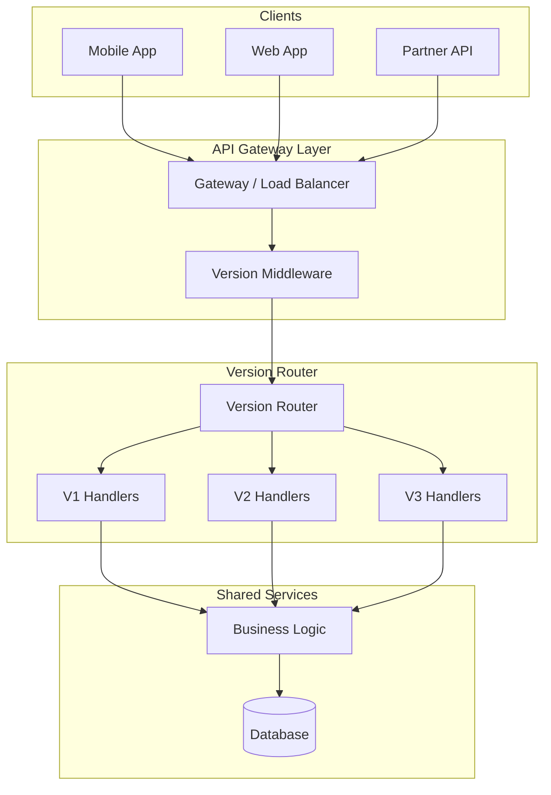
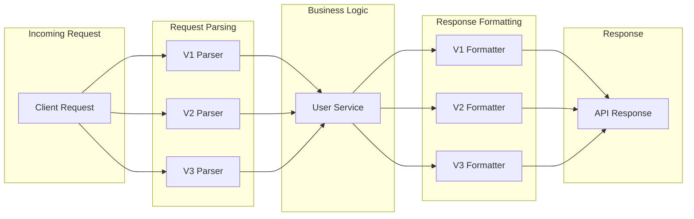
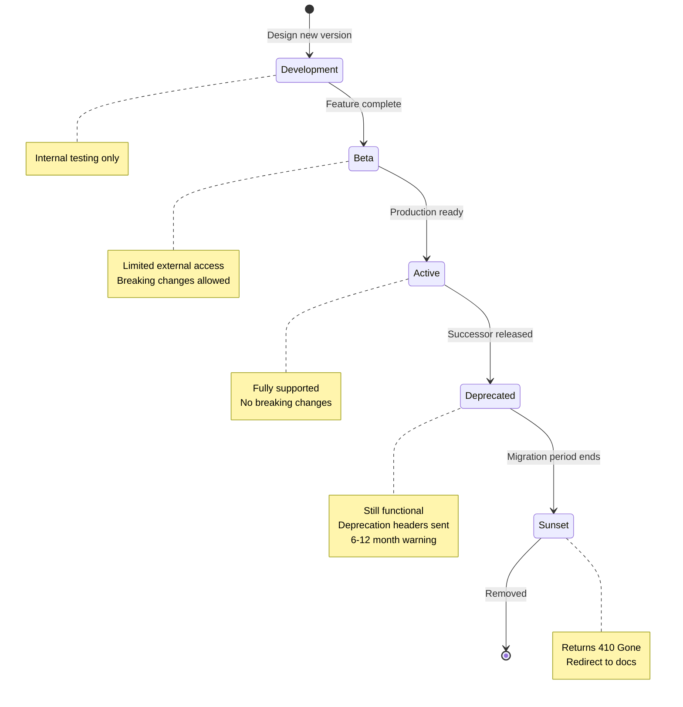

# How to Build RESTful API Versioning

Author: [nawazdhandala](https://github.com/nawazdhandala)

Tags: REST API, API Versioning, Node.js, Express, Microservices, Backend Development, API Gateway, Software Architecture

Description: A comprehensive guide to building a production-ready API versioning system from scratch, covering middleware implementation, router architecture, gateway configuration, and deployment strategies.

---

APIs change over time. New features get added, fields get renamed, and sometimes entire resource structures need redesigning. Without proper versioning, these changes break existing clients. This guide walks through building a complete API versioning system that handles real-world production requirements.

## Architecture Overview

Before writing code, you need to understand where versioning fits in your system architecture:



The key insight here is that versioning happens at the API layer, not the business logic layer. Your core services should remain version-agnostic while version-specific handlers transform requests and responses.

## Project Structure

A well-organized project structure makes managing multiple versions easier. Here is a structure that scales:

```
src/
  middleware/
    version.js          # Version extraction middleware
    deprecation.js      # Deprecation warning middleware
  routes/
    v1/
      index.js          # V1 router
      users.js          # V1 user endpoints
      products.js       # V1 product endpoints
    v2/
      index.js          # V2 router
      users.js          # V2 user endpoints
      products.js       # V2 product endpoints
    v3/
      index.js          # V3 router
      users.js          # V3 user endpoints
      products.js       # V3 product endpoints
  services/
    userService.js      # Shared business logic
    productService.js   # Shared business logic
  transformers/
    userTransformer.js  # Version-specific response formatters
  config/
    versions.js         # Version configuration
  app.js                # Main application entry
```

## Building the Version Middleware

The version middleware extracts the requested API version from incoming requests. Let's build one that supports multiple versioning strategies.

This middleware checks URL path, headers, and query parameters in order of priority:

```javascript
// src/middleware/version.js
const versionConfig = require('../config/versions');

// extractVersionFromPath pulls the version from URLs like /api/v1/users
function extractVersionFromPath(path) {
    const match = path.match(/\/api\/v(\d+)\//);
    if (match) {
        return `v${match[1]}`;
    }
    return null;
}

// extractVersionFromHeader reads custom X-API-Version header
function extractVersionFromHeader(headers) {
    const version = headers['x-api-version'];
    if (version) {
        // Normalize: accept both "1" and "v1" formats
        return version.startsWith('v') ? version : `v${version}`;
    }
    return null;
}

// extractVersionFromQuery reads ?version=1 or ?api-version=1
function extractVersionFromQuery(query) {
    const version = query.version || query['api-version'];
    if (version) {
        return version.startsWith('v') ? version : `v${version}`;
    }
    return null;
}

// Main middleware function
function versionMiddleware(req, res, next) {
    // Priority: URL path > Header > Query param > Default
    let version = extractVersionFromPath(req.path);

    if (!version) {
        version = extractVersionFromHeader(req.headers);
    }

    if (!version) {
        version = extractVersionFromQuery(req.query);
    }

    if (!version) {
        version = versionConfig.defaultVersion;
    }

    // Validate the version exists
    if (!versionConfig.supportedVersions.includes(version)) {
        return res.status(400).json({
            error: 'UNSUPPORTED_VERSION',
            message: `API version ${version} is not supported`,
            supportedVersions: versionConfig.supportedVersions
        });
    }

    // Attach version to request for use in handlers
    req.apiVersion = version;

    // Add version to response headers for debugging
    res.set('X-API-Version', version);

    next();
}

module.exports = versionMiddleware;
```

## Version Configuration

Centralize your version settings in a configuration file. This makes it easy to add new versions or deprecate old ones:

```javascript
// src/config/versions.js
const versions = {
    // Current default version for clients that do not specify
    defaultVersion: 'v3',

    // All versions currently accepting requests
    supportedVersions: ['v1', 'v2', 'v3'],

    // Versions that work but show deprecation warnings
    deprecatedVersions: ['v1'],

    // Per-version configuration
    versionConfig: {
        v1: {
            deprecated: true,
            deprecatedAt: '2025-06-01',
            sunsetAt: '2026-06-01',
            successor: 'v3',
            migrationGuide: 'https://api.example.com/docs/migrate-v1-to-v3'
        },
        v2: {
            deprecated: false,
            deprecatedAt: null,
            sunsetAt: null,
            successor: null,
            migrationGuide: null
        },
        v3: {
            deprecated: false,
            deprecatedAt: null,
            sunsetAt: null,
            successor: null,
            migrationGuide: null
        }
    }
};

module.exports = versions;
```

## Building the Deprecation Middleware

When a version is deprecated, you should warn clients through response headers. This follows RFC 8594 (Sunset Header):

```javascript
// src/middleware/deprecation.js
const versionConfig = require('../config/versions');

function deprecationMiddleware(req, res, next) {
    const version = req.apiVersion;
    const config = versionConfig.versionConfig[version];

    if (!config) {
        return next();
    }

    // Add deprecation headers if version is deprecated
    if (config.deprecated) {
        // Standard Deprecation header
        res.set('Deprecation', config.deprecatedAt);

        // Sunset header tells when version will stop working
        if (config.sunsetAt) {
            res.set('Sunset', config.sunsetAt);
        }

        // Link to migration documentation
        if (config.migrationGuide) {
            res.set('Link', `<${config.migrationGuide}>; rel="deprecation"`);
        }

        // Warning header with human-readable message
        const warningMessage = `API version ${version} is deprecated and will be removed on ${config.sunsetAt}. Please migrate to ${config.successor}.`;
        res.set('Warning', `299 - "${warningMessage}"`);
    }

    next();
}

module.exports = deprecationMiddleware;
```

## Building Version-Specific Routers

Each API version gets its own router with version-specific endpoints. Here is how to structure them:

The main application file wires everything together:

```javascript
// src/app.js
const express = require('express');
const versionMiddleware = require('./middleware/version');
const deprecationMiddleware = require('./middleware/deprecation');
const v1Router = require('./routes/v1');
const v2Router = require('./routes/v2');
const v3Router = require('./routes/v3');

const app = express();

// Parse JSON request bodies
app.use(express.json());

// Apply version detection to all API routes
app.use('/api', versionMiddleware);
app.use('/api', deprecationMiddleware);

// Mount version-specific routers
// URL-based versioning: /api/v1/users, /api/v2/users, etc.
app.use('/api/v1', v1Router);
app.use('/api/v2', v2Router);
app.use('/api/v3', v3Router);

// Health check endpoint (unversioned)
app.get('/health', (req, res) => {
    res.json({ status: 'healthy', timestamp: new Date().toISOString() });
});

// Version info endpoint
app.get('/api/versions', (req, res) => {
    const versionConfig = require('./config/versions');
    res.json({
        default: versionConfig.defaultVersion,
        supported: versionConfig.supportedVersions,
        deprecated: versionConfig.deprecatedVersions
    });
});

const PORT = process.env.PORT || 3000;
app.listen(PORT, () => {
    console.log(`API server running on port ${PORT}`);
});

module.exports = app;
```

## Implementing Version-Specific Handlers

Here is how to implement the same endpoint across different versions. The key is sharing business logic while keeping response formats version-specific.

First, create the shared service layer:

```javascript
// src/services/userService.js
// This service contains business logic used by all API versions
// It works with the internal data format, not version-specific formats

class UserService {
    constructor(database) {
        this.db = database;
    }

    // Find user by ID - returns internal format
    async findById(id) {
        const user = await this.db.users.findOne({ id });
        if (!user) {
            return null;
        }
        return user;
    }

    // Create new user - accepts internal format
    async create(userData) {
        const user = {
            id: this.generateId(),
            firstName: userData.firstName,
            lastName: userData.lastName,
            email: userData.email,
            phone: userData.phone || null,
            roles: userData.roles || ['user'],
            metadata: userData.metadata || {},
            createdAt: new Date().toISOString(),
            updatedAt: new Date().toISOString()
        };

        await this.db.users.insert(user);
        return user;
    }

    // Update existing user
    async update(id, updates) {
        const user = await this.findById(id);
        if (!user) {
            return null;
        }

        const updated = {
            ...user,
            ...updates,
            updatedAt: new Date().toISOString()
        };

        await this.db.users.update({ id }, updated);
        return updated;
    }

    generateId() {
        return Math.random().toString(36).substring(2, 15);
    }
}

module.exports = UserService;
```

Now create version-specific handlers. V1 uses a simple flat structure:

```javascript
// src/routes/v1/users.js
const express = require('express');
const router = express.Router();
const UserService = require('../../services/userService');

const userService = new UserService(require('../../database'));

// V1 response format: flat structure with combined name field
function formatUserV1(user) {
    return {
        id: user.id,
        name: `${user.firstName} ${user.lastName}`.trim(),
        email: user.email
    };
}

// Parse V1 request format into internal format
function parseUserV1(body) {
    const nameParts = (body.name || '').split(' ');
    return {
        firstName: nameParts[0] || '',
        lastName: nameParts.slice(1).join(' ') || '',
        email: body.email
    };
}

// GET /api/v1/users/:id
router.get('/:id', async (req, res) => {
    try {
        const user = await userService.findById(req.params.id);

        if (!user) {
            return res.status(404).json({
                error: 'USER_NOT_FOUND',
                message: `User ${req.params.id} not found`
            });
        }

        res.json(formatUserV1(user));
    } catch (error) {
        console.error('Error fetching user:', error);
        res.status(500).json({
            error: 'INTERNAL_ERROR',
            message: 'Failed to fetch user'
        });
    }
});

// POST /api/v1/users
router.post('/', async (req, res) => {
    try {
        // Validate required fields for V1
        if (!req.body.name || !req.body.email) {
            return res.status(400).json({
                error: 'VALIDATION_ERROR',
                message: 'name and email are required'
            });
        }

        // Parse V1 format to internal format
        const userData = parseUserV1(req.body);

        const user = await userService.create(userData);

        res.status(201).json(formatUserV1(user));
    } catch (error) {
        console.error('Error creating user:', error);
        res.status(500).json({
            error: 'INTERNAL_ERROR',
            message: 'Failed to create user'
        });
    }
});

module.exports = router;
```

V2 adds more fields and renames some:

```javascript
// src/routes/v2/users.js
const express = require('express');
const router = express.Router();
const UserService = require('../../services/userService');

const userService = new UserService(require('../../database'));

// V2 response format: added phone and roles, renamed name to fullName
function formatUserV2(user) {
    return {
        id: user.id,
        fullName: `${user.firstName} ${user.lastName}`.trim(),
        email: user.email,
        phone: user.phone,
        roles: user.roles,
        createdAt: user.createdAt
    };
}

// Parse V2 request format into internal format
function parseUserV2(body) {
    const nameParts = (body.fullName || '').split(' ');
    return {
        firstName: nameParts[0] || '',
        lastName: nameParts.slice(1).join(' ') || '',
        email: body.email,
        phone: body.phone || null,
        roles: body.roles || ['user']
    };
}

// GET /api/v2/users/:id
router.get('/:id', async (req, res) => {
    try {
        const user = await userService.findById(req.params.id);

        if (!user) {
            return res.status(404).json({
                error: 'USER_NOT_FOUND',
                message: `User ${req.params.id} not found`
            });
        }

        res.json(formatUserV2(user));
    } catch (error) {
        console.error('Error fetching user:', error);
        res.status(500).json({
            error: 'INTERNAL_ERROR',
            message: 'Failed to fetch user'
        });
    }
});

// POST /api/v2/users
router.post('/', async (req, res) => {
    try {
        // V2 validation
        if (!req.body.fullName || !req.body.email) {
            return res.status(400).json({
                error: 'VALIDATION_ERROR',
                message: 'fullName and email are required'
            });
        }

        const userData = parseUserV2(req.body);
        const user = await userService.create(userData);

        res.status(201).json(formatUserV2(user));
    } catch (error) {
        console.error('Error creating user:', error);
        res.status(500).json({
            error: 'INTERNAL_ERROR',
            message: 'Failed to create user'
        });
    }
});

module.exports = router;
```

V3 uses structured name objects for better data handling:

```javascript
// src/routes/v3/users.js
const express = require('express');
const router = express.Router();
const UserService = require('../../services/userService');

const userService = new UserService(require('../../database'));

// V3 response format: structured name object, added metadata
function formatUserV3(user) {
    return {
        id: user.id,
        name: {
            first: user.firstName,
            last: user.lastName
        },
        email: user.email,
        phone: user.phone,
        roles: user.roles,
        metadata: user.metadata,
        createdAt: user.createdAt,
        updatedAt: user.updatedAt
    };
}

// Parse V3 request format into internal format
function parseUserV3(body) {
    return {
        firstName: body.name?.first || '',
        lastName: body.name?.last || '',
        email: body.email,
        phone: body.phone || null,
        roles: body.roles || ['user'],
        metadata: body.metadata || {}
    };
}

// GET /api/v3/users/:id
router.get('/:id', async (req, res) => {
    try {
        const user = await userService.findById(req.params.id);

        if (!user) {
            return res.status(404).json({
                error: 'USER_NOT_FOUND',
                message: `User ${req.params.id} not found`
            });
        }

        res.json(formatUserV3(user));
    } catch (error) {
        console.error('Error fetching user:', error);
        res.status(500).json({
            error: 'INTERNAL_ERROR',
            message: 'Failed to fetch user'
        });
    }
});

// POST /api/v3/users
router.post('/', async (req, res) => {
    try {
        // V3 validation - name must be an object
        if (!req.body.name || !req.body.name.first || !req.body.email) {
            return res.status(400).json({
                error: 'VALIDATION_ERROR',
                message: 'name.first and email are required'
            });
        }

        const userData = parseUserV3(req.body);
        const user = await userService.create(userData);

        res.status(201).json(formatUserV3(user));
    } catch (error) {
        console.error('Error creating user:', error);
        res.status(500).json({
            error: 'INTERNAL_ERROR',
            message: 'Failed to create user'
        });
    }
});

module.exports = router;
```

## Building a Response Transformer System

For larger APIs, a transformer system keeps formatting logic organized:



Here is a reusable transformer implementation:

```javascript
// src/transformers/userTransformer.js
// Centralized transformation logic for user resources

class UserTransformer {
    // Transform internal user to V1 format
    static toV1(user) {
        return {
            id: user.id,
            name: `${user.firstName} ${user.lastName}`.trim(),
            email: user.email
        };
    }

    // Transform internal user to V2 format
    static toV2(user) {
        return {
            id: user.id,
            fullName: `${user.firstName} ${user.lastName}`.trim(),
            email: user.email,
            phone: user.phone,
            roles: user.roles,
            createdAt: user.createdAt
        };
    }

    // Transform internal user to V3 format
    static toV3(user) {
        return {
            id: user.id,
            name: {
                first: user.firstName,
                last: user.lastName
            },
            email: user.email,
            phone: user.phone,
            roles: user.roles,
            metadata: user.metadata,
            createdAt: user.createdAt,
            updatedAt: user.updatedAt
        };
    }

    // Transform to requested version
    static toVersion(user, version) {
        const transformers = {
            v1: this.toV1,
            v2: this.toV2,
            v3: this.toV3
        };

        const transformer = transformers[version];
        if (!transformer) {
            throw new Error(`Unknown version: ${version}`);
        }

        return transformer(user);
    }

    // Parse V1 request body to internal format
    static fromV1(body) {
        const nameParts = (body.name || '').split(' ');
        return {
            firstName: nameParts[0] || '',
            lastName: nameParts.slice(1).join(' ') || '',
            email: body.email
        };
    }

    // Parse V2 request body to internal format
    static fromV2(body) {
        const nameParts = (body.fullName || '').split(' ');
        return {
            firstName: nameParts[0] || '',
            lastName: nameParts.slice(1).join(' ') || '',
            email: body.email,
            phone: body.phone || null,
            roles: body.roles || ['user']
        };
    }

    // Parse V3 request body to internal format
    static fromV3(body) {
        return {
            firstName: body.name?.first || '',
            lastName: body.name?.last || '',
            email: body.email,
            phone: body.phone || null,
            roles: body.roles || ['user'],
            metadata: body.metadata || {}
        };
    }

    // Parse from requested version
    static fromVersion(body, version) {
        const parsers = {
            v1: this.fromV1,
            v2: this.fromV2,
            v3: this.fromV3
        };

        const parser = parsers[version];
        if (!parser) {
            throw new Error(`Unknown version: ${version}`);
        }

        return parser(body);
    }
}

module.exports = UserTransformer;
```

Using the transformer in a unified handler:

```javascript
// src/routes/users.js
// Single router that handles all versions using transformers

const express = require('express');
const router = express.Router();
const UserService = require('../services/userService');
const UserTransformer = require('../transformers/userTransformer');

const userService = new UserService(require('../database'));

// GET /api/v{version}/users/:id
router.get('/:id', async (req, res) => {
    try {
        const version = req.apiVersion;
        const user = await userService.findById(req.params.id);

        if (!user) {
            return res.status(404).json({
                error: 'USER_NOT_FOUND',
                message: `User ${req.params.id} not found`
            });
        }

        // Transform to requested version format
        const formatted = UserTransformer.toVersion(user, version);
        res.json(formatted);
    } catch (error) {
        console.error('Error fetching user:', error);
        res.status(500).json({
            error: 'INTERNAL_ERROR',
            message: 'Failed to fetch user'
        });
    }
});

// POST /api/v{version}/users
router.post('/', async (req, res) => {
    try {
        const version = req.apiVersion;

        // Parse request body from version-specific format
        const userData = UserTransformer.fromVersion(req.body, version);

        // Create user using internal format
        const user = await userService.create(userData);

        // Transform response to requested version format
        const formatted = UserTransformer.toVersion(user, version);
        res.status(201).json(formatted);
    } catch (error) {
        console.error('Error creating user:', error);
        res.status(500).json({
            error: 'INTERNAL_ERROR',
            message: 'Failed to create user'
        });
    }
});

module.exports = router;
```

## API Gateway Configuration

In production, you often want versioning at the gateway level. Here are configurations for popular gateways.

NGINX configuration for URL-based versioning:

```nginx
# /etc/nginx/conf.d/api.conf

upstream api_v1 {
    server api-v1-service:3000;
}

upstream api_v2 {
    server api-v2-service:3000;
}

upstream api_v3 {
    server api-v3-service:3000;
}

server {
    listen 80;
    server_name api.example.com;

    # Route based on URL version prefix
    location /api/v1/ {
        proxy_pass http://api_v1/;
        proxy_set_header Host $host;
        proxy_set_header X-Real-IP $remote_addr;
        proxy_set_header X-API-Version v1;
    }

    location /api/v2/ {
        proxy_pass http://api_v2/;
        proxy_set_header Host $host;
        proxy_set_header X-Real-IP $remote_addr;
        proxy_set_header X-API-Version v2;
    }

    location /api/v3/ {
        proxy_pass http://api_v3/;
        proxy_set_header Host $host;
        proxy_set_header X-Real-IP $remote_addr;
        proxy_set_header X-API-Version v3;
    }

    # Default to latest version
    location /api/ {
        proxy_pass http://api_v3/;
        proxy_set_header Host $host;
        proxy_set_header X-Real-IP $remote_addr;
        proxy_set_header X-API-Version v3;
    }
}
```

Kong API Gateway declarative configuration:

```yaml
# kong.yaml
_format_version: "3.0"

services:
  - name: api-v1
    url: http://api-v1-service:3000
    routes:
      - name: api-v1-route
        paths:
          - /api/v1
        strip_path: false
    plugins:
      - name: request-transformer
        config:
          add:
            headers:
              - X-API-Version:v1

  - name: api-v2
    url: http://api-v2-service:3000
    routes:
      - name: api-v2-route
        paths:
          - /api/v2
        strip_path: false
    plugins:
      - name: request-transformer
        config:
          add:
            headers:
              - X-API-Version:v2

  - name: api-v3
    url: http://api-v3-service:3000
    routes:
      - name: api-v3-route
        paths:
          - /api/v3
        strip_path: false
      - name: api-default-route
        paths:
          - /api
        strip_path: false
    plugins:
      - name: request-transformer
        config:
          add:
            headers:
              - X-API-Version:v3
```

## Kubernetes Ingress Configuration

For Kubernetes deployments, use Ingress rules to route versions:

```yaml
# k8s/api-ingress.yaml
apiVersion: networking.k8s.io/v1
kind: Ingress
metadata:
  name: api-ingress
  annotations:
    nginx.ingress.kubernetes.io/rewrite-target: /$2
spec:
  ingressClassName: nginx
  rules:
    - host: api.example.com
      http:
        paths:
          # V1 endpoints route to v1 service
          - path: /api/v1(/|$)(.*)
            pathType: Prefix
            backend:
              service:
                name: api-v1-service
                port:
                  number: 80

          # V2 endpoints route to v2 service
          - path: /api/v2(/|$)(.*)
            pathType: Prefix
            backend:
              service:
                name: api-v2-service
                port:
                  number: 80

          # V3 and default route to v3 service
          - path: /api/v3(/|$)(.*)
            pathType: Prefix
            backend:
              service:
                name: api-v3-service
                port:
                  number: 80

          - path: /api(/|$)(.*)
            pathType: Prefix
            backend:
              service:
                name: api-v3-service
                port:
                  number: 80
```

## Testing Versioned APIs

Write tests that verify all supported versions work correctly:

```javascript
// tests/api-versions.test.js
const request = require('supertest');
const app = require('../src/app');

describe('API Versioning', () => {
    // Test user to create
    const testUser = {
        firstName: 'John',
        lastName: 'Doe',
        email: 'john@example.com'
    };

    describe('Version Detection', () => {
        it('should detect version from URL path', async () => {
            const response = await request(app)
                .get('/api/v1/users/test-id')
                .expect(404);

            expect(response.headers['x-api-version']).toBe('v1');
        });

        it('should detect version from header', async () => {
            const response = await request(app)
                .get('/api/users/test-id')
                .set('X-API-Version', 'v2')
                .expect(404);

            expect(response.headers['x-api-version']).toBe('v2');
        });

        it('should use default version when not specified', async () => {
            const response = await request(app)
                .get('/api/users/test-id')
                .expect(404);

            expect(response.headers['x-api-version']).toBe('v3');
        });

        it('should reject unsupported versions', async () => {
            const response = await request(app)
                .get('/api/users/test-id')
                .set('X-API-Version', 'v99')
                .expect(400);

            expect(response.body.error).toBe('UNSUPPORTED_VERSION');
        });
    });

    describe('V1 Response Format', () => {
        it('should return flat name field', async () => {
            // Create user first
            const created = await request(app)
                .post('/api/v1/users')
                .send({ name: 'John Doe', email: 'john@example.com' })
                .expect(201);

            const response = await request(app)
                .get(`/api/v1/users/${created.body.id}`)
                .expect(200);

            // V1 should have name as string
            expect(response.body).toHaveProperty('name');
            expect(typeof response.body.name).toBe('string');
            expect(response.body).not.toHaveProperty('firstName');
            expect(response.body).not.toHaveProperty('roles');
        });
    });

    describe('V2 Response Format', () => {
        it('should return fullName and additional fields', async () => {
            const created = await request(app)
                .post('/api/v2/users')
                .send({
                    fullName: 'John Doe',
                    email: 'john@example.com',
                    roles: ['admin']
                })
                .expect(201);

            const response = await request(app)
                .get(`/api/v2/users/${created.body.id}`)
                .expect(200);

            // V2 should have fullName and roles
            expect(response.body).toHaveProperty('fullName');
            expect(response.body).toHaveProperty('roles');
            expect(response.body).not.toHaveProperty('name');
        });
    });

    describe('V3 Response Format', () => {
        it('should return structured name object', async () => {
            const created = await request(app)
                .post('/api/v3/users')
                .send({
                    name: { first: 'John', last: 'Doe' },
                    email: 'john@example.com',
                    metadata: { source: 'test' }
                })
                .expect(201);

            const response = await request(app)
                .get(`/api/v3/users/${created.body.id}`)
                .expect(200);

            // V3 should have structured name and metadata
            expect(response.body.name).toEqual({
                first: 'John',
                last: 'Doe'
            });
            expect(response.body).toHaveProperty('metadata');
        });
    });

    describe('Deprecation Headers', () => {
        it('should include deprecation headers for v1', async () => {
            const response = await request(app)
                .get('/api/v1/users/test-id')
                .expect(404);

            expect(response.headers).toHaveProperty('deprecation');
            expect(response.headers).toHaveProperty('sunset');
            expect(response.headers).toHaveProperty('warning');
        });

        it('should not include deprecation headers for v3', async () => {
            const response = await request(app)
                .get('/api/v3/users/test-id')
                .expect(404);

            expect(response.headers).not.toHaveProperty('deprecation');
            expect(response.headers).not.toHaveProperty('sunset');
        });
    });
});
```

## Version Lifecycle Management

Managing the lifecycle of API versions requires tracking and communication:



Implement sunset behavior for retired versions:

```javascript
// src/middleware/sunset.js
const versionConfig = require('../config/versions');

function sunsetMiddleware(req, res, next) {
    const version = req.apiVersion;
    const config = versionConfig.versionConfig[version];

    if (!config) {
        return next();
    }

    // Check if version has passed sunset date
    if (config.sunsetAt) {
        const sunsetDate = new Date(config.sunsetAt);
        const now = new Date();

        if (now > sunsetDate) {
            return res.status(410).json({
                error: 'VERSION_SUNSET',
                message: `API version ${version} is no longer available`,
                sunsetDate: config.sunsetAt,
                successor: config.successor,
                migrationGuide: config.migrationGuide
            });
        }
    }

    next();
}

module.exports = sunsetMiddleware;
```

## Monitoring Version Usage

Track which versions clients use to plan deprecation:

```javascript
// src/middleware/metrics.js
const promClient = require('prom-client');

// Create metrics
const apiRequestsTotal = new promClient.Counter({
    name: 'api_requests_total',
    help: 'Total API requests by version',
    labelNames: ['version', 'method', 'path', 'status']
});

const apiLatencyHistogram = new promClient.Histogram({
    name: 'api_latency_seconds',
    help: 'API request latency by version',
    labelNames: ['version', 'method', 'path'],
    buckets: [0.01, 0.05, 0.1, 0.5, 1, 2, 5]
});

function metricsMiddleware(req, res, next) {
    const start = Date.now();

    // Capture response finish
    res.on('finish', () => {
        const duration = (Date.now() - start) / 1000;
        const version = req.apiVersion || 'unknown';
        const path = req.route?.path || req.path;

        apiRequestsTotal.inc({
            version: version,
            method: req.method,
            path: path,
            status: res.statusCode
        });

        apiLatencyHistogram.observe({
            version: version,
            method: req.method,
            path: path
        }, duration);
    });

    next();
}

module.exports = metricsMiddleware;
```

## Best Practices Summary

1. **Keep business logic version-agnostic.** Services should work with internal data formats. Transformers handle version-specific formatting.

2. **Use explicit versioning.** URL path versioning is the most visible and debuggable approach. Clients can see the version in their logs and bookmarks.

3. **Maintain at least two versions.** Always support the current version and the previous one. This gives clients time to migrate.

4. **Set clear deprecation timelines.** Announce deprecation 6-12 months before sunset. Use standard HTTP headers to communicate status.

5. **Monitor version usage.** Track which clients use which versions. Contact heavy users of deprecated versions directly.

6. **Document migration paths.** Provide clear guides showing exactly what changed between versions and how to update client code.

7. **Test all versions.** Automated tests should cover every supported version. Breaking a deprecated version still breaks real clients.

8. **Version at the API layer.** Database schemas and internal services should not know about API versions. This keeps your architecture clean.

## Conclusion

Building a production-ready API versioning system requires planning and discipline. Start with clear version middleware that detects client preferences. Structure your code so business logic stays separate from version-specific formatting. Configure your gateway to route versions appropriately. Monitor usage to inform deprecation decisions.

The investment pays off when you need to make breaking changes. With proper versioning, you can evolve your API while keeping existing clients happy.
