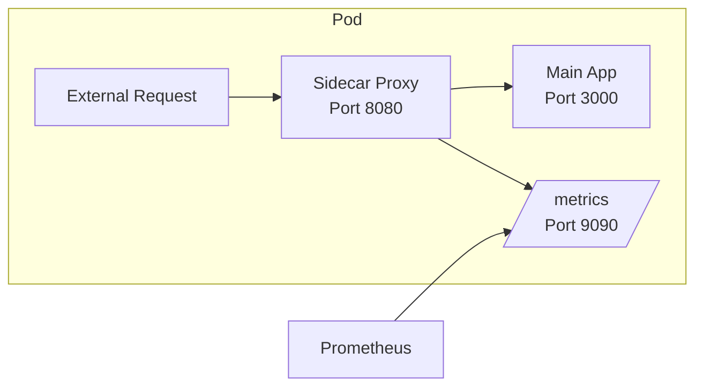
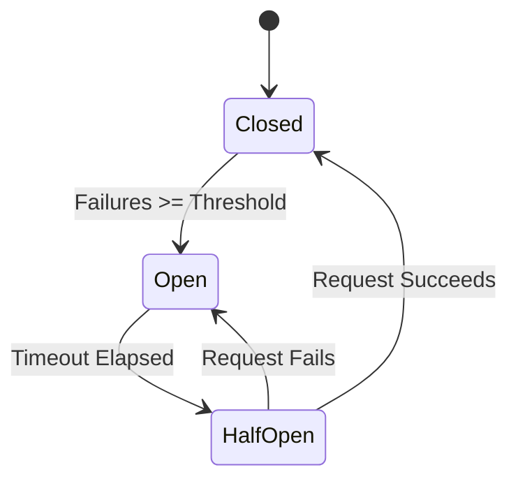
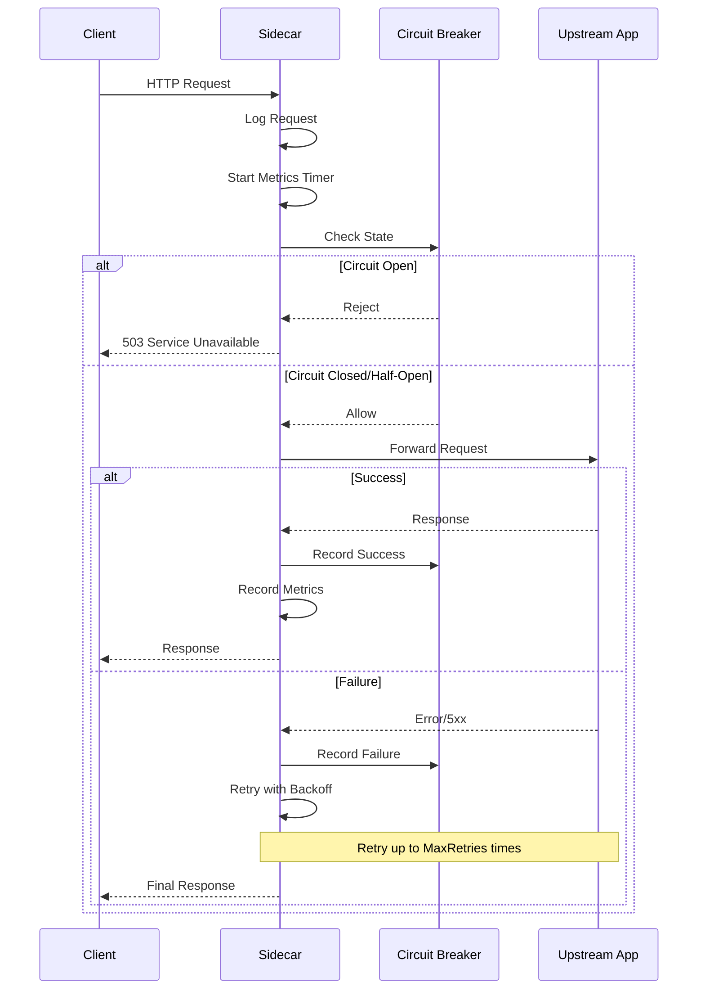

# How to Build Sidecar Pattern Implementation

Author: [nawazdhandala](https://github.com/nawazdhandala)

Tags: Sidecar Pattern, Go, Proxy, Kubernetes, Microservices, DevOps

Description: Learn how to build a production-ready sidecar proxy from scratch using Go, with complete code for request interception, metrics collection, retry logic, and graceful shutdown.

---

While tools like Istio and Linkerd provide excellent sidecar implementations out of the box, there are situations where you need to build a custom sidecar. Perhaps you need specialized request transformation, a lightweight alternative to full service meshes, or integration with internal systems. This guide walks through building a production-ready sidecar proxy from scratch.

## What We Are Building

Our custom sidecar will handle:
- HTTP request proxying to the main application
- Request and response logging
- Prometheus metrics collection
- Automatic retries with exponential backoff
- Circuit breaker pattern
- Graceful shutdown



## Project Structure

The sidecar project follows a clean architecture with separate packages for each concern.

```
sidecar-proxy/
├── main.go
├── config/
│   └── config.go
├── proxy/
│   └── proxy.go
├── middleware/
│   ├── logging.go
│   ├── metrics.go
│   └── retry.go
├── circuitbreaker/
│   └── breaker.go
└── health/
    └── health.go
```

## Configuration Module

The configuration module handles environment variables and provides sensible defaults for all sidecar settings.

```go
// config/config.go
package config

import (
	"os"
	"strconv"
	"time"
)

// Config holds all sidecar configuration
type Config struct {
	// ListenPort is the port where the sidecar accepts incoming requests
	ListenPort int

	// UpstreamHost is the address of the main application
	UpstreamHost string

	// UpstreamPort is the port of the main application
	UpstreamPort int

	// MetricsPort is the port for Prometheus metrics
	MetricsPort int

	// RequestTimeout is the maximum time to wait for upstream response
	RequestTimeout time.Duration

	// MaxRetries is the number of retry attempts for failed requests
	MaxRetries int

	// RetryBackoff is the initial backoff duration between retries
	RetryBackoff time.Duration

	// CircuitBreakerThreshold is the number of failures before opening circuit
	CircuitBreakerThreshold int

	// CircuitBreakerTimeout is how long the circuit stays open
	CircuitBreakerTimeout time.Duration
}

// Load reads configuration from environment variables with defaults
func Load() *Config {
	return &Config{
		ListenPort:              getEnvInt("SIDECAR_LISTEN_PORT", 8080),
		UpstreamHost:            getEnv("UPSTREAM_HOST", "localhost"),
		UpstreamPort:            getEnvInt("UPSTREAM_PORT", 3000),
		MetricsPort:             getEnvInt("METRICS_PORT", 9090),
		RequestTimeout:          getEnvDuration("REQUEST_TIMEOUT", 30*time.Second),
		MaxRetries:              getEnvInt("MAX_RETRIES", 3),
		RetryBackoff:            getEnvDuration("RETRY_BACKOFF", 100*time.Millisecond),
		CircuitBreakerThreshold: getEnvInt("CIRCUIT_BREAKER_THRESHOLD", 5),
		CircuitBreakerTimeout:   getEnvDuration("CIRCUIT_BREAKER_TIMEOUT", 30*time.Second),
	}
}

// getEnv returns environment variable value or default
func getEnv(key, defaultValue string) string {
	if value := os.Getenv(key); value != "" {
		return value
	}
	return defaultValue
}

// getEnvInt returns environment variable as int or default
func getEnvInt(key string, defaultValue int) int {
	if value := os.Getenv(key); value != "" {
		if intVal, err := strconv.Atoi(value); err == nil {
			return intVal
		}
	}
	return defaultValue
}

// getEnvDuration returns environment variable as duration or default
func getEnvDuration(key string, defaultValue time.Duration) time.Duration {
	if value := os.Getenv(key); value != "" {
		if duration, err := time.ParseDuration(value); err == nil {
			return duration
		}
	}
	return defaultValue
}
```

## Circuit Breaker Implementation

The circuit breaker prevents cascading failures by stopping requests to unhealthy upstreams. It tracks failures and opens when the threshold is exceeded.



```go
// circuitbreaker/breaker.go
package circuitbreaker

import (
	"errors"
	"sync"
	"time"
)

// State represents the circuit breaker state
type State int

const (
	StateClosed State = iota
	StateOpen
	StateHalfOpen
)

// ErrCircuitOpen is returned when the circuit breaker is open
var ErrCircuitOpen = errors.New("circuit breaker is open")

// CircuitBreaker implements the circuit breaker pattern
type CircuitBreaker struct {
	mu               sync.RWMutex
	state            State
	failures         int
	threshold        int
	timeout          time.Duration
	lastFailureTime  time.Time
	halfOpenRequests int
	maxHalfOpen      int
}

// New creates a new circuit breaker with the given threshold and timeout
func New(threshold int, timeout time.Duration) *CircuitBreaker {
	return &CircuitBreaker{
		state:       StateClosed,
		threshold:   threshold,
		timeout:     timeout,
		maxHalfOpen: 1, // Allow one request in half-open state
	}
}

// Allow checks if a request should be allowed through
func (cb *CircuitBreaker) Allow() error {
	cb.mu.Lock()
	defer cb.mu.Unlock()

	switch cb.state {
	case StateClosed:
		return nil

	case StateOpen:
		// Check if timeout has elapsed
		if time.Since(cb.lastFailureTime) > cb.timeout {
			cb.state = StateHalfOpen
			cb.halfOpenRequests = 0
			return nil
		}
		return ErrCircuitOpen

	case StateHalfOpen:
		// Allow limited requests in half-open state
		if cb.halfOpenRequests < cb.maxHalfOpen {
			cb.halfOpenRequests++
			return nil
		}
		return ErrCircuitOpen
	}

	return nil
}

// RecordSuccess records a successful request
func (cb *CircuitBreaker) RecordSuccess() {
	cb.mu.Lock()
	defer cb.mu.Unlock()

	if cb.state == StateHalfOpen {
		// Success in half-open state closes the circuit
		cb.state = StateClosed
		cb.failures = 0
	}
}

// RecordFailure records a failed request
func (cb *CircuitBreaker) RecordFailure() {
	cb.mu.Lock()
	defer cb.mu.Unlock()

	cb.failures++
	cb.lastFailureTime = time.Now()

	if cb.state == StateHalfOpen {
		// Failure in half-open reopens the circuit
		cb.state = StateOpen
		return
	}

	if cb.failures >= cb.threshold {
		cb.state = StateOpen
	}
}

// State returns the current state of the circuit breaker
func (cb *CircuitBreaker) GetState() State {
	cb.mu.RLock()
	defer cb.mu.RUnlock()
	return cb.state
}

// Reset resets the circuit breaker to closed state
func (cb *CircuitBreaker) Reset() {
	cb.mu.Lock()
	defer cb.mu.Unlock()
	cb.state = StateClosed
	cb.failures = 0
}
```

## Metrics Middleware

The metrics middleware collects Prometheus metrics for all proxied requests including latency histograms and error counters.

```go
// middleware/metrics.go
package middleware

import (
	"net/http"
	"strconv"
	"time"

	"github.com/prometheus/client_golang/prometheus"
	"github.com/prometheus/client_golang/prometheus/promauto"
)

// Metrics holds all Prometheus metrics for the sidecar
type Metrics struct {
	requestsTotal    *prometheus.CounterVec
	requestDuration  *prometheus.HistogramVec
	requestsInFlight prometheus.Gauge
	upstreamErrors   *prometheus.CounterVec
	circuitState     prometheus.Gauge
}

// NewMetrics creates and registers all Prometheus metrics
func NewMetrics() *Metrics {
	return &Metrics{
		// Counter for total requests by method, path, and status
		requestsTotal: promauto.NewCounterVec(
			prometheus.CounterOpts{
				Name: "sidecar_requests_total",
				Help: "Total number of requests processed by the sidecar",
			},
			[]string{"method", "path", "status"},
		),

		// Histogram for request duration with predefined buckets
		requestDuration: promauto.NewHistogramVec(
			prometheus.HistogramOpts{
				Name:    "sidecar_request_duration_seconds",
				Help:    "Request duration in seconds",
				Buckets: []float64{0.001, 0.005, 0.01, 0.025, 0.05, 0.1, 0.25, 0.5, 1, 2.5, 5, 10},
			},
			[]string{"method", "path"},
		),

		// Gauge for requests currently being processed
		requestsInFlight: promauto.NewGauge(
			prometheus.GaugeOpts{
				Name: "sidecar_requests_in_flight",
				Help: "Number of requests currently being processed",
			},
		),

		// Counter for upstream errors by type
		upstreamErrors: promauto.NewCounterVec(
			prometheus.CounterOpts{
				Name: "sidecar_upstream_errors_total",
				Help: "Total number of upstream errors",
			},
			[]string{"type"},
		),

		// Gauge for circuit breaker state (0=closed, 1=open, 2=half-open)
		circuitState: promauto.NewGauge(
			prometheus.GaugeOpts{
				Name: "sidecar_circuit_breaker_state",
				Help: "Circuit breaker state (0=closed, 1=open, 2=half-open)",
			},
		),
	}
}

// responseWriter wraps http.ResponseWriter to capture status code
type responseWriter struct {
	http.ResponseWriter
	statusCode int
}

// WriteHeader captures the status code before writing
func (rw *responseWriter) WriteHeader(code int) {
	rw.statusCode = code
	rw.ResponseWriter.WriteHeader(code)
}

// Middleware returns an HTTP middleware that records metrics
func (m *Metrics) Middleware(next http.Handler) http.Handler {
	return http.HandlerFunc(func(w http.ResponseWriter, r *http.Request) {
		start := time.Now()

		// Track in-flight requests
		m.requestsInFlight.Inc()
		defer m.requestsInFlight.Dec()

		// Wrap response writer to capture status
		wrapped := &responseWriter{ResponseWriter: w, statusCode: http.StatusOK}

		// Process request
		next.ServeHTTP(wrapped, r)

		// Record metrics
		duration := time.Since(start).Seconds()
		path := normalizePath(r.URL.Path)

		m.requestsTotal.WithLabelValues(
			r.Method,
			path,
			strconv.Itoa(wrapped.statusCode),
		).Inc()

		m.requestDuration.WithLabelValues(
			r.Method,
			path,
		).Observe(duration)
	})
}

// RecordUpstreamError records an upstream error
func (m *Metrics) RecordUpstreamError(errorType string) {
	m.upstreamErrors.WithLabelValues(errorType).Inc()
}

// SetCircuitState sets the circuit breaker state metric
func (m *Metrics) SetCircuitState(state int) {
	m.circuitState.Set(float64(state))
}

// normalizePath removes dynamic segments from paths to prevent cardinality explosion
func normalizePath(path string) string {
	// Replace UUIDs and numeric IDs with placeholders
	// Example: /users/123/orders/456 becomes /users/:id/orders/:id
	segments := make([]byte, 0, len(path))
	inSegment := false
	isNumeric := true

	for i := 0; i < len(path); i++ {
		c := path[i]
		if c == '/' {
			if inSegment && isNumeric {
				segments = append(segments, ':', 'i', 'd')
			}
			segments = append(segments, '/')
			inSegment = false
			isNumeric = true
		} else {
			inSegment = true
			if c < '0' || c > '9' {
				isNumeric = false
			}
			if !isNumeric {
				segments = append(segments, c)
			}
		}
	}

	if inSegment && isNumeric {
		segments = append(segments, ':', 'i', 'd')
	}

	return string(segments)
}
```

## Logging Middleware

The logging middleware provides structured request logging with timing and context propagation for distributed tracing.

```go
// middleware/logging.go
package middleware

import (
	"log/slog"
	"net/http"
	"time"
)

// LoggingMiddleware logs all incoming requests with timing information
func LoggingMiddleware(logger *slog.Logger) func(http.Handler) http.Handler {
	return func(next http.Handler) http.Handler {
		return http.HandlerFunc(func(w http.ResponseWriter, r *http.Request) {
			start := time.Now()

			// Extract trace headers for correlation
			traceID := r.Header.Get("X-Request-ID")
			if traceID == "" {
				traceID = r.Header.Get("X-B3-TraceId")
			}

			// Wrap response writer to capture status
			wrapped := &responseWriter{ResponseWriter: w, statusCode: http.StatusOK}

			// Log request start
			logger.Info("request started",
				slog.String("method", r.Method),
				slog.String("path", r.URL.Path),
				slog.String("remote_addr", r.RemoteAddr),
				slog.String("trace_id", traceID),
				slog.String("user_agent", r.UserAgent()),
			)

			// Process request
			next.ServeHTTP(wrapped, r)

			// Log request completion
			duration := time.Since(start)
			logger.Info("request completed",
				slog.String("method", r.Method),
				slog.String("path", r.URL.Path),
				slog.Int("status", wrapped.statusCode),
				slog.Duration("duration", duration),
				slog.String("trace_id", traceID),
			)
		})
	}
}
```

## Retry Middleware

The retry middleware implements exponential backoff for transient failures with configurable retry conditions.

```go
// middleware/retry.go
package middleware

import (
	"bytes"
	"io"
	"log/slog"
	"math"
	"net/http"
	"time"
)

// RetryConfig holds configuration for the retry middleware
type RetryConfig struct {
	MaxRetries   int
	InitialDelay time.Duration
	MaxDelay     time.Duration
	Multiplier   float64
}

// DefaultRetryConfig returns sensible defaults for retry behavior
func DefaultRetryConfig() RetryConfig {
	return RetryConfig{
		MaxRetries:   3,
		InitialDelay: 100 * time.Millisecond,
		MaxDelay:     5 * time.Second,
		Multiplier:   2.0,
	}
}

// RetryTransport wraps http.RoundTripper with retry logic
type RetryTransport struct {
	Transport http.RoundTripper
	Config    RetryConfig
	Logger    *slog.Logger
}

// RoundTrip implements http.RoundTripper with retry logic
func (rt *RetryTransport) RoundTrip(req *http.Request) (*http.Response, error) {
	var lastErr error
	var lastResp *http.Response

	// Read and buffer body for potential retries
	var bodyBytes []byte
	if req.Body != nil {
		bodyBytes, _ = io.ReadAll(req.Body)
		req.Body.Close()
	}

	for attempt := 0; attempt <= rt.Config.MaxRetries; attempt++ {
		// Reset body for each attempt
		if bodyBytes != nil {
			req.Body = io.NopCloser(bytes.NewReader(bodyBytes))
		}

		// Make the request
		resp, err := rt.Transport.RoundTrip(req)

		// Success or non-retryable error
		if err == nil && !isRetryableStatus(resp.StatusCode) {
			return resp, nil
		}

		// Store last error/response for final return
		lastErr = err
		if resp != nil {
			// Close body from failed attempt
			if lastResp != nil {
				lastResp.Body.Close()
			}
			lastResp = resp
		}

		// Don't sleep after last attempt
		if attempt < rt.Config.MaxRetries {
			delay := rt.calculateDelay(attempt)
			rt.Logger.Warn("retrying request",
				slog.Int("attempt", attempt+1),
				slog.Int("max_retries", rt.Config.MaxRetries),
				slog.Duration("delay", delay),
				slog.String("path", req.URL.Path),
			)
			time.Sleep(delay)
		}
	}

	// Return last response if available, otherwise return error
	if lastResp != nil {
		return lastResp, nil
	}
	return nil, lastErr
}

// calculateDelay computes exponential backoff with jitter
func (rt *RetryTransport) calculateDelay(attempt int) time.Duration {
	delay := float64(rt.Config.InitialDelay) * math.Pow(rt.Config.Multiplier, float64(attempt))
	if delay > float64(rt.Config.MaxDelay) {
		delay = float64(rt.Config.MaxDelay)
	}
	return time.Duration(delay)
}

// isRetryableStatus checks if HTTP status code warrants retry
func isRetryableStatus(statusCode int) bool {
	switch statusCode {
	case http.StatusBadGateway,
		http.StatusServiceUnavailable,
		http.StatusGatewayTimeout,
		http.StatusTooManyRequests:
		return true
	default:
		return false
	}
}
```

## Reverse Proxy Implementation

The proxy module ties everything together, handling request forwarding to the upstream application with all middleware applied.

```go
// proxy/proxy.go
package proxy

import (
	"context"
	"fmt"
	"log/slog"
	"net/http"
	"net/http/httputil"
	"net/url"
	"time"

	"sidecar-proxy/circuitbreaker"
	"sidecar-proxy/config"
	"sidecar-proxy/middleware"
)

// Proxy handles forwarding requests to the upstream service
type Proxy struct {
	config         *config.Config
	reverseProxy   *httputil.ReverseProxy
	circuitBreaker *circuitbreaker.CircuitBreaker
	metrics        *middleware.Metrics
	logger         *slog.Logger
}

// New creates a new proxy instance
func New(cfg *config.Config, logger *slog.Logger) *Proxy {
	// Build upstream URL
	upstreamURL := &url.URL{
		Scheme: "http",
		Host:   fmt.Sprintf("%s:%d", cfg.UpstreamHost, cfg.UpstreamPort),
	}

	// Create metrics collector
	metrics := middleware.NewMetrics()

	// Create circuit breaker
	cb := circuitbreaker.New(cfg.CircuitBreakerThreshold, cfg.CircuitBreakerTimeout)

	// Create reverse proxy with custom transport
	proxy := httputil.NewSingleHostReverseProxy(upstreamURL)

	// Configure transport with retry logic
	transport := &middleware.RetryTransport{
		Transport: &http.Transport{
			MaxIdleConns:        100,
			MaxIdleConnsPerHost: 100,
			IdleConnTimeout:     90 * time.Second,
		},
		Config: middleware.RetryConfig{
			MaxRetries:   cfg.MaxRetries,
			InitialDelay: cfg.RetryBackoff,
			MaxDelay:     5 * time.Second,
			Multiplier:   2.0,
		},
		Logger: logger,
	}
	proxy.Transport = transport

	// Customize error handling
	proxy.ErrorHandler = func(w http.ResponseWriter, r *http.Request, err error) {
		logger.Error("proxy error",
			slog.String("path", r.URL.Path),
			slog.String("error", err.Error()),
		)
		metrics.RecordUpstreamError("connection_error")
		cb.RecordFailure()
		http.Error(w, "Service Unavailable", http.StatusServiceUnavailable)
	}

	// Modify response to record success
	proxy.ModifyResponse = func(resp *http.Response) error {
		if resp.StatusCode < 500 {
			cb.RecordSuccess()
		} else {
			cb.RecordFailure()
			metrics.RecordUpstreamError("5xx_error")
		}
		return nil
	}

	return &Proxy{
		config:         cfg,
		reverseProxy:   proxy,
		circuitBreaker: cb,
		metrics:        metrics,
		logger:         logger,
	}
}

// ServeHTTP handles incoming requests
func (p *Proxy) ServeHTTP(w http.ResponseWriter, r *http.Request) {
	// Check circuit breaker
	if err := p.circuitBreaker.Allow(); err != nil {
		p.logger.Warn("circuit breaker open",
			slog.String("path", r.URL.Path),
		)
		p.metrics.RecordUpstreamError("circuit_open")
		http.Error(w, "Service Unavailable", http.StatusServiceUnavailable)
		return
	}

	// Update circuit breaker state metric
	p.metrics.SetCircuitState(int(p.circuitBreaker.GetState()))

	// Forward request to upstream
	p.reverseProxy.ServeHTTP(w, r)
}

// Handler returns the HTTP handler with all middleware applied
func (p *Proxy) Handler() http.Handler {
	// Build middleware chain
	handler := http.Handler(p)

	// Apply metrics middleware
	handler = p.metrics.Middleware(handler)

	// Apply logging middleware
	handler = middleware.LoggingMiddleware(p.logger)(handler)

	return handler
}

// Metrics returns the metrics instance for the metrics server
func (p *Proxy) Metrics() *middleware.Metrics {
	return p.metrics
}

// Shutdown gracefully shuts down the proxy
func (p *Proxy) Shutdown(ctx context.Context) error {
	// Reset circuit breaker
	p.circuitBreaker.Reset()
	return nil
}
```

## Health Check Endpoint

The health module provides liveness and readiness endpoints for Kubernetes probes.

```go
// health/health.go
package health

import (
	"encoding/json"
	"net/http"
	"sync/atomic"
)

// Health manages health check state
type Health struct {
	ready atomic.Bool
}

// New creates a new health checker
func New() *Health {
	h := &Health{}
	h.ready.Store(true)
	return h
}

// SetReady sets the readiness state
func (h *Health) SetReady(ready bool) {
	h.ready.Store(ready)
}

// LivenessHandler returns a handler for liveness probes
func (h *Health) LivenessHandler() http.HandlerFunc {
	return func(w http.ResponseWriter, r *http.Request) {
		w.Header().Set("Content-Type", "application/json")
		w.WriteHeader(http.StatusOK)
		json.NewEncoder(w).Encode(map[string]string{"status": "alive"})
	}
}

// ReadinessHandler returns a handler for readiness probes
func (h *Health) ReadinessHandler() http.HandlerFunc {
	return func(w http.ResponseWriter, r *http.Request) {
		w.Header().Set("Content-Type", "application/json")

		if h.ready.Load() {
			w.WriteHeader(http.StatusOK)
			json.NewEncoder(w).Encode(map[string]string{"status": "ready"})
		} else {
			w.WriteHeader(http.StatusServiceUnavailable)
			json.NewEncoder(w).Encode(map[string]string{"status": "not ready"})
		}
	}
}
```

## Main Application

The main file ties everything together with graceful shutdown support.

```go
// main.go
package main

import (
	"context"
	"fmt"
	"log/slog"
	"net/http"
	"os"
	"os/signal"
	"syscall"
	"time"

	"github.com/prometheus/client_golang/prometheus/promhttp"
	"sidecar-proxy/config"
	"sidecar-proxy/health"
	"sidecar-proxy/proxy"
)

func main() {
	// Initialize structured logger
	logger := slog.New(slog.NewJSONHandler(os.Stdout, &slog.HandlerOptions{
		Level: slog.LevelInfo,
	}))

	// Load configuration
	cfg := config.Load()
	logger.Info("configuration loaded",
		slog.Int("listen_port", cfg.ListenPort),
		slog.String("upstream_host", cfg.UpstreamHost),
		slog.Int("upstream_port", cfg.UpstreamPort),
	)

	// Create health checker
	healthChecker := health.New()

	// Create proxy
	proxyHandler := proxy.New(cfg, logger)

	// Create main HTTP server
	mainMux := http.NewServeMux()
	mainMux.Handle("/", proxyHandler.Handler())
	mainMux.HandleFunc("/health", healthChecker.LivenessHandler())
	mainMux.HandleFunc("/ready", healthChecker.ReadinessHandler())

	mainServer := &http.Server{
		Addr:         fmt.Sprintf(":%d", cfg.ListenPort),
		Handler:      mainMux,
		ReadTimeout:  cfg.RequestTimeout,
		WriteTimeout: cfg.RequestTimeout,
		IdleTimeout:  120 * time.Second,
	}

	// Create metrics server
	metricsMux := http.NewServeMux()
	metricsMux.Handle("/metrics", promhttp.Handler())

	metricsServer := &http.Server{
		Addr:    fmt.Sprintf(":%d", cfg.MetricsPort),
		Handler: metricsMux,
	}

	// Start servers
	go func() {
		logger.Info("starting main server", slog.Int("port", cfg.ListenPort))
		if err := mainServer.ListenAndServe(); err != http.ErrServerClosed {
			logger.Error("main server error", slog.String("error", err.Error()))
			os.Exit(1)
		}
	}()

	go func() {
		logger.Info("starting metrics server", slog.Int("port", cfg.MetricsPort))
		if err := metricsServer.ListenAndServe(); err != http.ErrServerClosed {
			logger.Error("metrics server error", slog.String("error", err.Error()))
		}
	}()

	// Wait for shutdown signal
	quit := make(chan os.Signal, 1)
	signal.Notify(quit, syscall.SIGINT, syscall.SIGTERM)
	<-quit

	logger.Info("shutting down servers")

	// Mark as not ready to stop receiving new requests
	healthChecker.SetReady(false)

	// Create shutdown context with timeout
	ctx, cancel := context.WithTimeout(context.Background(), 30*time.Second)
	defer cancel()

	// Shutdown servers gracefully
	if err := mainServer.Shutdown(ctx); err != nil {
		logger.Error("main server shutdown error", slog.String("error", err.Error()))
	}

	if err := metricsServer.Shutdown(ctx); err != nil {
		logger.Error("metrics server shutdown error", slog.String("error", err.Error()))
	}

	if err := proxyHandler.Shutdown(ctx); err != nil {
		logger.Error("proxy shutdown error", slog.String("error", err.Error()))
	}

	logger.Info("servers stopped")
}
```

## Dockerfile

The Dockerfile uses multi-stage builds to create a minimal production image.

```dockerfile
# Build stage
FROM golang:1.22-alpine AS builder

WORKDIR /app

# Copy go mod files first for caching
COPY go.mod go.sum ./
RUN go mod download

# Copy source code
COPY . .

# Build the binary
RUN CGO_ENABLED=0 GOOS=linux go build -o sidecar-proxy .

# Production stage
FROM alpine:3.19

# Add ca-certificates for HTTPS upstream support
RUN apk --no-cache add ca-certificates

WORKDIR /app

# Copy binary from builder
COPY --from=builder /app/sidecar-proxy .

# Run as non-root user
RUN adduser -D -u 1000 sidecar
USER sidecar

# Expose ports
EXPOSE 8080 9090

# Health check
HEALTHCHECK --interval=30s --timeout=3s --start-period=5s --retries=3 \
    CMD wget --no-verbose --tries=1 --spider http://localhost:8080/health || exit 1

ENTRYPOINT ["./sidecar-proxy"]
```

## Kubernetes Deployment

Deploy the sidecar alongside your main application in the same pod.

```yaml
# deployment.yaml
apiVersion: apps/v1
kind: Deployment
metadata:
  name: my-application
  labels:
    app: my-application
spec:
  replicas: 3
  selector:
    matchLabels:
      app: my-application
  template:
    metadata:
      labels:
        app: my-application
      annotations:
        # Enable Prometheus scraping from sidecar
        prometheus.io/scrape: "true"
        prometheus.io/port: "9090"
        prometheus.io/path: "/metrics"
    spec:
      containers:
        # Main application container
        - name: app
          image: my-application:latest
          ports:
            - containerPort: 3000
              name: app
          # App only needs to be accessible within the pod
          env:
            - name: PORT
              value: "3000"
          resources:
            requests:
              memory: "256Mi"
              cpu: "200m"
            limits:
              memory: "512Mi"
              cpu: "500m"

        # Custom sidecar proxy
        - name: sidecar
          image: my-sidecar-proxy:latest
          ports:
            - containerPort: 8080
              name: proxy
            - containerPort: 9090
              name: metrics
          env:
            # Configure sidecar to proxy to main app
            - name: UPSTREAM_HOST
              value: "localhost"
            - name: UPSTREAM_PORT
              value: "3000"
            - name: SIDECAR_LISTEN_PORT
              value: "8080"
            - name: METRICS_PORT
              value: "9090"
            - name: MAX_RETRIES
              value: "3"
            - name: REQUEST_TIMEOUT
              value: "30s"
            - name: CIRCUIT_BREAKER_THRESHOLD
              value: "5"
            - name: CIRCUIT_BREAKER_TIMEOUT
              value: "30s"
          resources:
            requests:
              memory: "64Mi"
              cpu: "50m"
            limits:
              memory: "128Mi"
              cpu: "100m"
          # Health checks for the sidecar
          livenessProbe:
            httpGet:
              path: /health
              port: 8080
            initialDelaySeconds: 5
            periodSeconds: 10
          readinessProbe:
            httpGet:
              path: /ready
              port: 8080
            initialDelaySeconds: 5
            periodSeconds: 5
---
# Service exposes the sidecar port, not the app port directly
apiVersion: v1
kind: Service
metadata:
  name: my-application
spec:
  selector:
    app: my-application
  ports:
    - name: http
      port: 80
      targetPort: 8080  # Routes to sidecar
    - name: metrics
      port: 9090
      targetPort: 9090
```

## Using Native Sidecars (Kubernetes 1.28+)

Kubernetes 1.28 introduced native sidecar support with proper lifecycle management.

```yaml
# native-sidecar-deployment.yaml
apiVersion: apps/v1
kind: Deployment
metadata:
  name: my-application
spec:
  replicas: 3
  selector:
    matchLabels:
      app: my-application
  template:
    metadata:
      labels:
        app: my-application
    spec:
      # Native sidecar defined as init container with restartPolicy: Always
      initContainers:
        - name: sidecar
          image: my-sidecar-proxy:latest
          restartPolicy: Always  # This makes it a native sidecar
          ports:
            - containerPort: 8080
              name: proxy
            - containerPort: 9090
              name: metrics
          env:
            - name: UPSTREAM_HOST
              value: "localhost"
            - name: UPSTREAM_PORT
              value: "3000"
          resources:
            requests:
              memory: "64Mi"
              cpu: "50m"
            limits:
              memory: "128Mi"
              cpu: "100m"
          readinessProbe:
            httpGet:
              path: /ready
              port: 8080
            initialDelaySeconds: 2
            periodSeconds: 5

      containers:
        - name: app
          image: my-application:latest
          ports:
            - containerPort: 3000
          resources:
            requests:
              memory: "256Mi"
              cpu: "200m"
```

## Testing the Sidecar

Create a simple test to verify the sidecar behavior.

```go
// proxy/proxy_test.go
package proxy

import (
	"io"
	"log/slog"
	"net/http"
	"net/http/httptest"
	"testing"
	"time"

	"sidecar-proxy/config"
)

func TestProxyForwardsRequests(t *testing.T) {
	// Create a test upstream server
	upstream := httptest.NewServer(http.HandlerFunc(func(w http.ResponseWriter, r *http.Request) {
		w.WriteHeader(http.StatusOK)
		w.Write([]byte("Hello from upstream"))
	}))
	defer upstream.Close()

	// Parse upstream URL to get host and port
	// For simplicity, use localhost with a known port

	cfg := &config.Config{
		ListenPort:              8080,
		UpstreamHost:            "127.0.0.1",
		UpstreamPort:            3000,
		RequestTimeout:          30 * time.Second,
		MaxRetries:              3,
		RetryBackoff:            100 * time.Millisecond,
		CircuitBreakerThreshold: 5,
		CircuitBreakerTimeout:   30 * time.Second,
	}

	logger := slog.New(slog.NewJSONHandler(io.Discard, nil))
	proxy := New(cfg, logger)

	// Create test request
	req := httptest.NewRequest("GET", "/test", nil)
	rec := httptest.NewRecorder()

	// Execute
	proxy.Handler().ServeHTTP(rec, req)

	// Verify response (will fail because upstream is not at the configured address)
	// In real tests, you would configure the upstream properly
	if rec.Code != http.StatusOK && rec.Code != http.StatusServiceUnavailable {
		t.Errorf("unexpected status code: %d", rec.Code)
	}
}

func TestCircuitBreakerOpens(t *testing.T) {
	cfg := &config.Config{
		ListenPort:              8080,
		UpstreamHost:            "nonexistent.host",
		UpstreamPort:            3000,
		RequestTimeout:          1 * time.Second,
		MaxRetries:              0, // Disable retries for this test
		CircuitBreakerThreshold: 2,
		CircuitBreakerTimeout:   1 * time.Second,
	}

	logger := slog.New(slog.NewJSONHandler(io.Discard, nil))
	proxy := New(cfg, logger)

	// Make requests until circuit opens
	for i := 0; i < 5; i++ {
		req := httptest.NewRequest("GET", "/test", nil)
		rec := httptest.NewRecorder()
		proxy.Handler().ServeHTTP(rec, req)
	}

	// Circuit should be open now
	req := httptest.NewRequest("GET", "/test", nil)
	rec := httptest.NewRecorder()
	proxy.Handler().ServeHTTP(rec, req)

	if rec.Code != http.StatusServiceUnavailable {
		t.Errorf("expected circuit breaker to return 503, got: %d", rec.Code)
	}
}
```

## Monitoring Dashboard

Create a Grafana dashboard to visualize sidecar metrics.

```json
{
  "title": "Sidecar Proxy Dashboard",
  "panels": [
    {
      "title": "Request Rate",
      "type": "graph",
      "targets": [
        {
          "expr": "sum(rate(sidecar_requests_total[5m])) by (status)",
          "legendFormat": "{{status}}"
        }
      ]
    },
    {
      "title": "Request Latency (p99)",
      "type": "graph",
      "targets": [
        {
          "expr": "histogram_quantile(0.99, sum(rate(sidecar_request_duration_seconds_bucket[5m])) by (le))",
          "legendFormat": "p99"
        }
      ]
    },
    {
      "title": "Circuit Breaker State",
      "type": "stat",
      "targets": [
        {
          "expr": "sidecar_circuit_breaker_state",
          "legendFormat": "State"
        }
      ],
      "mappings": [
        {"value": 0, "text": "Closed"},
        {"value": 1, "text": "Open"},
        {"value": 2, "text": "Half-Open"}
      ]
    },
    {
      "title": "Upstream Errors",
      "type": "graph",
      "targets": [
        {
          "expr": "sum(rate(sidecar_upstream_errors_total[5m])) by (type)",
          "legendFormat": "{{type}}"
        }
      ]
    }
  ]
}
```

## Request Flow Summary



---

Building a custom sidecar gives you complete control over request handling, metrics, and resilience patterns. While service meshes like Istio provide these features out of the box, a custom sidecar can be lighter weight and tailored exactly to your needs. The code in this guide provides a solid foundation that you can extend with additional features like request transformation, caching, or custom authentication.

The key principles to remember: keep the sidecar lightweight, handle failures gracefully, expose metrics for observability, and support graceful shutdown for zero-downtime deployments.
