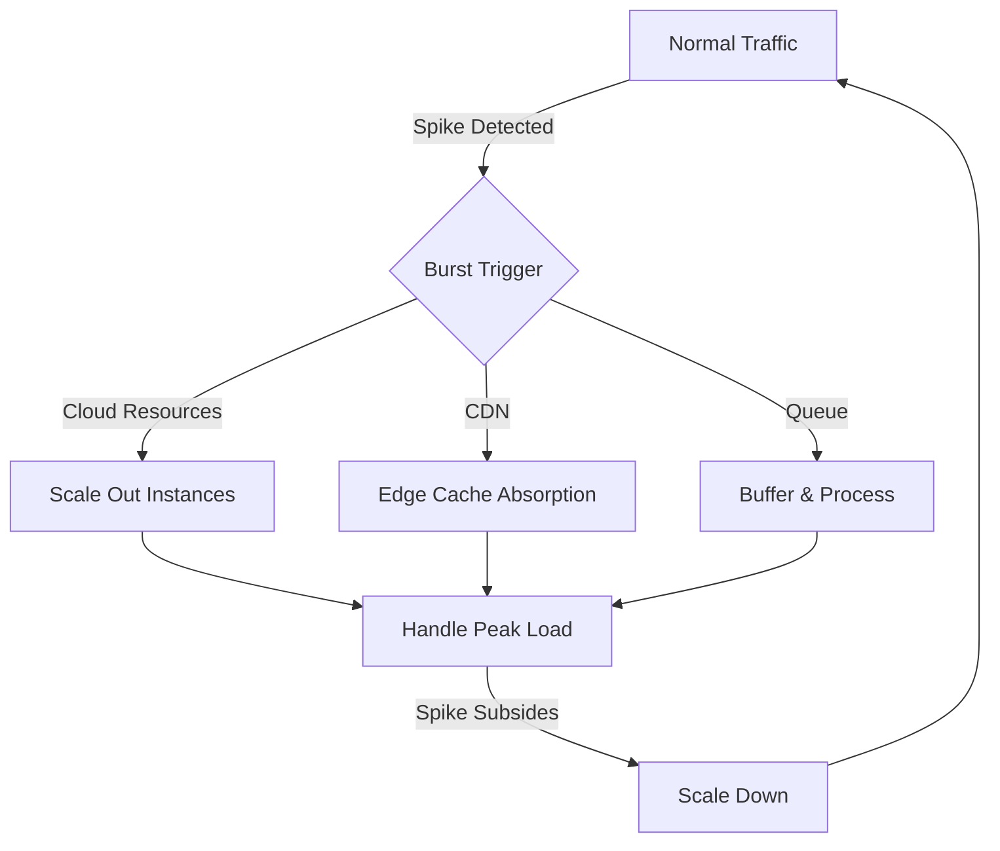
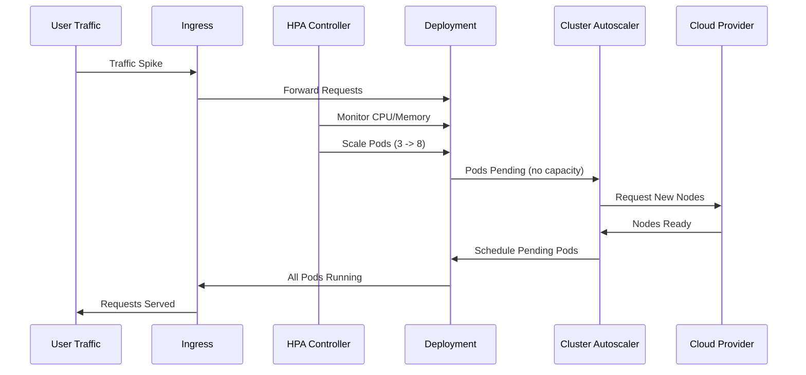
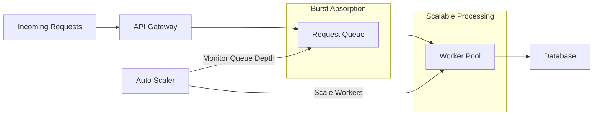
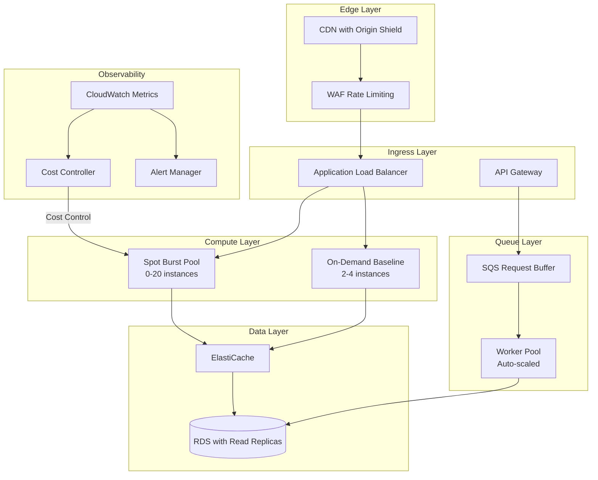

# How to Implement Burst Capacity

Author: [nawazdhandala](https://github.com/nawazdhandala)

Tags: Capacity Planning, Infrastructure, Performance, DevOps

Description: Learn how to provision and manage burst capacity for traffic spikes.

---

Traffic spikes are inevitable. Whether it is a product launch, viral content, or seasonal demand, your infrastructure must handle sudden load increases without falling over. Burst capacity is the ability to temporarily exceed your baseline resource allocation to absorb these spikes. Here is how to implement it effectively.

## Understanding Burst Capacity Patterns

Burst capacity follows predictable patterns that inform your implementation strategy. The key is matching your burst mechanism to your traffic profile.



### Types of Traffic Spikes

Understanding your spike profile determines which burst strategy works best:

| Spike Type | Duration | Predictability | Best Strategy |
|------------|----------|----------------|---------------|
| Flash Sales | Minutes | Scheduled | Pre-warming + Queue |
| Viral Content | Hours | Unpredictable | CDN + Auto-scaling |
| Seasonal | Days-Weeks | Predictable | Reserved + Spot |
| DDoS/Bot | Variable | Unpredictable | CDN + Rate Limiting |

## Cloud Burst Configurations

Cloud providers offer burst-capable instance types and auto-scaling policies. Here is how to configure them for different scenarios.

### AWS Auto Scaling with Burst Policy

This launch template and auto-scaling configuration creates a burst-ready infrastructure that scales aggressively on CPU spikes but scales down gradually to avoid flapping.

`terraform/burst-asg.tf`

```hcl
# Launch template with burstable instances
resource "aws_launch_template" "burst_capable" {
  name_prefix   = "burst-web-"
  image_id      = var.ami_id
  instance_type = "t3.medium"  # Burstable instance type

  # Enable unlimited burst credits for sustained spikes
  credit_specification {
    cpu_credits = "unlimited"
  }

  monitoring {
    enabled = true  # Detailed monitoring for faster scaling response
  }

  tag_specifications {
    resource_type = "instance"
    tags = {
      Name        = "burst-web"
      Environment = "production"
    }
  }
}

# Auto Scaling Group with burst-optimized settings
resource "aws_autoscaling_group" "web" {
  name                = "web-burst-asg"
  desired_capacity    = 3
  min_size            = 2
  max_size            = 20  # High ceiling for burst capacity
  vpc_zone_identifier = var.subnet_ids
  health_check_type   = "ELB"

  # Fast health check for quick replacement
  health_check_grace_period = 120

  launch_template {
    id      = aws_launch_template.burst_capable.id
    version = "$Latest"
  }

  # Enable instance refresh for rolling updates
  instance_refresh {
    strategy = "Rolling"
    preferences {
      min_healthy_percentage = 75
    }
  }
}

# Aggressive scale-out policy for burst scenarios
resource "aws_autoscaling_policy" "burst_scale_out" {
  name                   = "burst-scale-out"
  autoscaling_group_name = aws_autoscaling_group.web.name
  policy_type            = "StepScaling"
  adjustment_type        = "PercentChangeInCapacity"

  step_adjustment {
    scaling_adjustment          = 50   # Add 50% capacity
    metric_interval_lower_bound = 0
    metric_interval_upper_bound = 20
  }

  step_adjustment {
    scaling_adjustment          = 100  # Double capacity for severe spikes
    metric_interval_lower_bound = 20
  }
}

# Conservative scale-in to prevent flapping
resource "aws_autoscaling_policy" "gradual_scale_in" {
  name                   = "gradual-scale-in"
  autoscaling_group_name = aws_autoscaling_group.web.name
  policy_type            = "TargetTrackingScaling"

  target_tracking_configuration {
    predefined_metric_specification {
      predefined_metric_type = "ASGAverageCPUUtilization"
    }
    target_value     = 60.0
    disable_scale_in = false

    # Slow scale-in to absorb secondary spikes
  }
}

# CloudWatch alarm for burst detection
resource "aws_cloudwatch_metric_alarm" "cpu_burst_trigger" {
  alarm_name          = "web-cpu-burst-trigger"
  comparison_operator = "GreaterThanThreshold"
  evaluation_periods  = 1        # React immediately
  metric_name         = "CPUUtilization"
  namespace           = "AWS/EC2"
  period              = 60       # 1-minute resolution
  statistic           = "Average"
  threshold           = 70
  alarm_description   = "Triggers burst scaling when CPU exceeds 70%"

  dimensions = {
    AutoScalingGroupName = aws_autoscaling_group.web.name
  }

  alarm_actions = [aws_autoscaling_policy.burst_scale_out.arn]
}
```

### Kubernetes Cluster Autoscaler for Burst

When running on Kubernetes, combine the Horizontal Pod Autoscaler with Cluster Autoscaler for full burst capability.

`k8s/cluster-autoscaler-config.yaml`

```yaml
apiVersion: v1
kind: ConfigMap
metadata:
  name: cluster-autoscaler-config
  namespace: kube-system
data:
  # Burst-optimized settings
  scale-down-delay-after-add: "5m"      # Wait before scaling down new nodes
  scale-down-delay-after-failure: "1m"  # Quick retry on failure
  scale-down-unneeded-time: "10m"       # Keep spare capacity longer
  scale-up-from-zero: "true"            # Allow scaling from zero nodes
  max-node-provision-time: "5m"         # Fail fast on slow provisioning
  scan-interval: "10s"                  # Fast detection of pending pods
  expander: "least-waste"               # Efficient node selection
  skip-nodes-with-local-storage: "false"
  balance-similar-node-groups: "true"   # Even distribution
```

The flow of burst scaling in Kubernetes:



## Spot and Preemptible Instances for Cost-Effective Burst

Spot instances provide 60-90% cost savings, making them ideal for burst capacity. The key is handling interruptions gracefully.

### Mixed Instance Strategy

`terraform/mixed-instances.tf`

```hcl
resource "aws_autoscaling_group" "mixed_burst" {
  name             = "mixed-burst-asg"
  desired_capacity = 4
  min_size         = 2
  max_size         = 30

  mixed_instances_policy {
    instances_distribution {
      # Maintain minimum on-demand for stability
      on_demand_base_capacity                  = 2
      on_demand_percentage_above_base_capacity = 20

      # Use spot for burst capacity (80% of burst)
      spot_allocation_strategy = "capacity-optimized"
      spot_max_price           = ""  # Use on-demand price cap
    }

    launch_template {
      launch_template_specification {
        launch_template_id = aws_launch_template.burst_capable.id
        version            = "$Latest"
      }

      # Multiple instance types for better spot availability
      override {
        instance_type     = "t3.medium"
        weighted_capacity = 1
      }
      override {
        instance_type     = "t3a.medium"
        weighted_capacity = 1
      }
      override {
        instance_type     = "t3.large"
        weighted_capacity = 2
      }
      override {
        instance_type     = "m5.large"
        weighted_capacity = 2
      }
    }
  }

  # Instance refresh for graceful spot replacement
  instance_refresh {
    strategy = "Rolling"
    preferences {
      min_healthy_percentage = 80
      instance_warmup        = 120
    }
  }
}
```

### Spot Interruption Handler

Deploy a handler to gracefully drain workloads when spot instances receive termination notices.

`k8s/spot-handler-daemonset.yaml`

```yaml
apiVersion: apps/v1
kind: DaemonSet
metadata:
  name: spot-interrupt-handler
  namespace: kube-system
spec:
  selector:
    matchLabels:
      app: spot-interrupt-handler
  template:
    metadata:
      labels:
        app: spot-interrupt-handler
    spec:
      # Only run on spot instances
      nodeSelector:
        node.kubernetes.io/lifecycle: spot

      tolerations:
        - key: "node.kubernetes.io/lifecycle"
          operator: "Equal"
          value: "spot"
          effect: "NoSchedule"

      serviceAccountName: spot-handler
      hostNetwork: true

      containers:
        - name: handler
          image: amazon/aws-node-termination-handler:v1.19.0
          env:
            - name: NODE_NAME
              valueFrom:
                fieldRef:
                  fieldPath: spec.nodeName
            - name: POD_NAME
              valueFrom:
                fieldRef:
                  fieldPath: metadata.name
            # Enable all interruption detection
            - name: ENABLE_SPOT_INTERRUPTION_DRAINING
              value: "true"
            - name: ENABLE_SCHEDULED_EVENT_DRAINING
              value: "true"
            - name: ENABLE_REBALANCE_MONITORING
              value: "true"
            # Drain settings
            - name: GRACE_PERIOD
              value: "120"
            - name: DELETE_LOCAL_DATA
              value: "true"
          resources:
            requests:
              cpu: 50m
              memory: 64Mi
            limits:
              cpu: 100m
              memory: 128Mi
```

## CDN Burst Handling

CDNs are your first line of defense against traffic spikes. Proper configuration absorbs most burst traffic at the edge.

### CloudFront Burst Configuration

```hcl
resource "aws_cloudfront_distribution" "burst_optimized" {
  enabled             = true
  is_ipv6_enabled     = true
  price_class         = "PriceClass_All"  # Use all edge locations

  origin {
    domain_name = aws_lb.main.dns_name
    origin_id   = "main-origin"

    custom_origin_config {
      http_port              = 80
      https_port             = 443
      origin_protocol_policy = "https-only"
      origin_ssl_protocols   = ["TLSv1.2"]

      # Increase timeouts for burst handling
      origin_read_timeout      = 60
      origin_keepalive_timeout = 60
    }

    # Origin shield for additional caching layer
    origin_shield {
      enabled              = true
      origin_shield_region = "us-east-1"
    }
  }

  # Aggressive caching for static content
  default_cache_behavior {
    allowed_methods        = ["GET", "HEAD", "OPTIONS"]
    cached_methods         = ["GET", "HEAD"]
    target_origin_id       = "main-origin"
    viewer_protocol_policy = "redirect-to-https"
    compress               = true

    # Long TTLs to absorb burst
    min_ttl     = 0
    default_ttl = 3600      # 1 hour default
    max_ttl     = 86400     # 24 hour max

    forwarded_values {
      query_string = false
      cookies {
        forward = "none"
      }
    }

    # Cache based on Accept-Encoding for compression
    cache_policy_id = aws_cloudfront_cache_policy.optimized.id
  }

  # API paths with shorter cache but still burst-capable
  ordered_cache_behavior {
    path_pattern           = "/api/*"
    allowed_methods        = ["DELETE", "GET", "HEAD", "OPTIONS", "PATCH", "POST", "PUT"]
    cached_methods         = ["GET", "HEAD"]
    target_origin_id       = "main-origin"
    viewer_protocol_policy = "https-only"

    min_ttl     = 0
    default_ttl = 60        # 1 minute for API responses
    max_ttl     = 300       # 5 minute max

    forwarded_values {
      query_string = true
      headers      = ["Authorization", "Accept"]
      cookies {
        forward = "all"
      }
    }
  }

  # Custom error pages to handle origin overload
  custom_error_response {
    error_code            = 503
    response_code         = 503
    response_page_path    = "/error/503.html"
    error_caching_min_ttl = 10  # Brief cache on errors
  }

  custom_error_response {
    error_code            = 504
    response_code         = 504
    response_page_path    = "/error/504.html"
    error_caching_min_ttl = 10
  }
}

# Optimized cache policy for burst scenarios
resource "aws_cloudfront_cache_policy" "optimized" {
  name        = "burst-optimized-policy"
  min_ttl     = 1
  default_ttl = 3600
  max_ttl     = 86400

  parameters_in_cache_key_and_forwarded_to_origin {
    cookies_config {
      cookie_behavior = "none"
    }
    headers_config {
      header_behavior = "whitelist"
      headers {
        items = ["Accept-Encoding", "Origin"]
      }
    }
    query_strings_config {
      query_string_behavior = "none"
    }
    enable_accept_encoding_brotli = true
    enable_accept_encoding_gzip   = true
  }
}
```

### Cache Warming Strategy

Pre-warm your CDN cache before expected traffic spikes:

```bash
#!/bin/bash
# cache-warmer.sh - Pre-warm CDN cache before traffic spike

DOMAIN="https://cdn.example.com"
URLS_FILE="critical-urls.txt"
CONCURRENT=50

echo "Starting cache warm-up for $DOMAIN"

# Read URLs and warm cache with parallel requests
cat "$URLS_FILE" | xargs -P "$CONCURRENT" -I {} curl -s -o /dev/null -w "%{url_effective} -> %{http_code}\n" "$DOMAIN{}"

echo "Cache warm-up complete"
```

```text
# critical-urls.txt - High-traffic paths to pre-warm
/
/products
/api/featured
/images/hero.webp
/css/main.css
/js/app.js
```

## Queue-Based Buffering

Queues decouple request acceptance from processing, allowing you to absorb bursts without dropping requests.



### SQS-Based Request Buffer

`src/queue-buffer.ts`

```typescript
import { SQSClient, SendMessageCommand, ReceiveMessageCommand, DeleteMessageCommand } from '@aws-sdk/client-sqs';
import { SNSClient, PublishCommand } from '@aws-sdk/client-sns';

interface QueueConfig {
  queueUrl: string;
  dlqUrl: string;         // Dead letter queue for failed messages
  maxRetries: number;
  visibilityTimeout: number;
  batchSize: number;
}

interface BurstMetrics {
  queueDepth: number;
  processedPerSecond: number;
  errorRate: number;
  oldestMessage: number;  // Age in seconds
}

class BurstBuffer {
  private sqs: SQSClient;
  private sns: SNSClient;
  private config: QueueConfig;
  private processing: boolean = false;
  private metrics: BurstMetrics = {
    queueDepth: 0,
    processedPerSecond: 0,
    errorRate: 0,
    oldestMessage: 0
  };

  constructor(config: QueueConfig) {
    this.sqs = new SQSClient({ region: process.env.AWS_REGION });
    this.sns = new SNSClient({ region: process.env.AWS_REGION });
    this.config = config;
  }

  // Accept request into queue - fast path for burst absorption
  async enqueue(request: any): Promise<string> {
    const command = new SendMessageCommand({
      QueueUrl: this.config.queueUrl,
      MessageBody: JSON.stringify(request),
      MessageAttributes: {
        'timestamp': {
          DataType: 'Number',
          StringValue: Date.now().toString()
        },
        'priority': {
          DataType: 'String',
          StringValue: request.priority || 'normal'
        }
      },
      // Use message deduplication for idempotency
      MessageDeduplicationId: request.idempotencyKey,
      MessageGroupId: request.userId || 'default'
    });

    const result = await this.sqs.send(command);
    return result.MessageId!;
  }

  // Process messages with controlled concurrency
  async processMessages(
    handler: (message: any) => Promise<void>,
    concurrency: number = 10
  ): Promise<void> {
    this.processing = true;
    const workers: Promise<void>[] = [];

    for (let i = 0; i < concurrency; i++) {
      workers.push(this.worker(handler, i));
    }

    await Promise.all(workers);
  }

  private async worker(
    handler: (message: any) => Promise<void>,
    workerId: number
  ): Promise<void> {
    while (this.processing) {
      try {
        const command = new ReceiveMessageCommand({
          QueueUrl: this.config.queueUrl,
          MaxNumberOfMessages: this.config.batchSize,
          VisibilityTimeout: this.config.visibilityTimeout,
          WaitTimeSeconds: 20,  // Long polling reduces API calls
          MessageAttributeNames: ['All']
        });

        const response = await this.sqs.send(command);

        if (!response.Messages || response.Messages.length === 0) {
          continue;  // No messages, poll again
        }

        // Process batch in parallel
        const results = await Promise.allSettled(
          response.Messages.map(async (message) => {
            const body = JSON.parse(message.Body!);

            try {
              await handler(body);

              // Delete on success
              await this.sqs.send(new DeleteMessageCommand({
                QueueUrl: this.config.queueUrl,
                ReceiptHandle: message.ReceiptHandle!
              }));
            } catch (error) {
              // Let visibility timeout expire for retry
              console.error(`Worker ${workerId} failed:`, error);
              throw error;
            }
          })
        );

        // Update metrics
        const failures = results.filter(r => r.status === 'rejected').length;
        this.metrics.errorRate = failures / results.length;

      } catch (error) {
        console.error(`Worker ${workerId} error:`, error);
        await this.sleep(1000);  // Back off on error
      }
    }
  }

  // Scale workers based on queue depth
  async getScalingRecommendation(): Promise<{
    action: 'scale_up' | 'scale_down' | 'maintain';
    targetWorkers: number;
    reason: string;
  }> {
    const depth = await this.getQueueDepth();
    const processRate = this.metrics.processedPerSecond;

    // Calculate time to drain at current rate
    const drainTime = processRate > 0 ? depth / processRate : Infinity;

    if (drainTime > 300) {  // More than 5 minutes to drain
      return {
        action: 'scale_up',
        targetWorkers: Math.ceil(depth / 100),  // Target 100 msg/worker
        reason: `Queue depth ${depth}, drain time ${drainTime}s`
      };
    } else if (drainTime < 30 && depth < 100) {
      return {
        action: 'scale_down',
        targetWorkers: Math.max(2, Math.ceil(depth / 50)),
        reason: `Low queue depth ${depth}`
      };
    }

    return {
      action: 'maintain',
      targetWorkers: -1,
      reason: 'Queue depth within normal range'
    };
  }

  private async getQueueDepth(): Promise<number> {
    // Implementation to get ApproximateNumberOfMessages
    return this.metrics.queueDepth;
  }

  private sleep(ms: number): Promise<void> {
    return new Promise(resolve => setTimeout(resolve, ms));
  }

  stop(): void {
    this.processing = false;
  }
}

// Usage example
const buffer = new BurstBuffer({
  queueUrl: process.env.QUEUE_URL!,
  dlqUrl: process.env.DLQ_URL!,
  maxRetries: 3,
  visibilityTimeout: 300,
  batchSize: 10
});

// Express endpoint that accepts requests into queue
app.post('/api/orders', async (req, res) => {
  try {
    const messageId = await buffer.enqueue({
      ...req.body,
      idempotencyKey: req.headers['x-idempotency-key'],
      userId: req.user.id
    });

    // Return immediately - request is queued
    res.status(202).json({
      status: 'accepted',
      messageId,
      message: 'Order queued for processing'
    });
  } catch (error) {
    res.status(503).json({
      error: 'Service temporarily unavailable',
      retryAfter: 30
    });
  }
});
```

### Auto-Scaling Workers Based on Queue Depth

`k8s/queue-worker-hpa.yaml`

```yaml
apiVersion: autoscaling/v2
kind: HorizontalPodAutoscaler
metadata:
  name: order-processor
  namespace: production
spec:
  scaleTargetRef:
    apiVersion: apps/v1
    kind: Deployment
    name: order-processor
  minReplicas: 2
  maxReplicas: 50
  metrics:
    # Scale based on SQS queue depth (requires external metrics)
    - type: External
      external:
        metric:
          name: sqs_queue_messages_visible
          selector:
            matchLabels:
              queue_name: order-queue
        target:
          type: AverageValue
          averageValue: 100  # 100 messages per worker
  behavior:
    scaleUp:
      stabilizationWindowSeconds: 0    # Immediate scale-up for bursts
      policies:
        - type: Percent
          value: 100                   # Double workers
          periodSeconds: 30
        - type: Pods
          value: 10                    # Or add 10 pods
          periodSeconds: 30
      selectPolicy: Max                # Use whichever adds more
    scaleDown:
      stabilizationWindowSeconds: 300  # Wait 5 min before scale-down
      policies:
        - type: Percent
          value: 10                    # Remove 10% at a time
          periodSeconds: 60
```

## Burst Cost Management

Burst capacity can be expensive. Here is how to implement cost controls while maintaining burst capability.

### Cost-Aware Scaling

```typescript
interface CostConfig {
  hourlyBudget: number;           // Max hourly spend
  burstBudgetMultiplier: number;  // Allow 3x budget during declared burst
  instanceCosts: Map<string, number>;
}

interface ScalingDecision {
  approved: boolean;
  instanceType: string;
  count: number;
  estimatedCost: number;
  reason: string;
}

class CostAwareScaler {
  private config: CostConfig;
  private currentSpend: number = 0;
  private burstMode: boolean = false;
  private burstStartTime: Date | null = null;

  constructor(config: CostConfig) {
    this.config = config;
  }

  // Declare burst mode for expected traffic spike
  declareBurst(durationMinutes: number): void {
    this.burstMode = true;
    this.burstStartTime = new Date();

    // Auto-exit burst mode after duration
    setTimeout(() => {
      this.endBurst();
    }, durationMinutes * 60 * 1000);

    console.log(`Burst mode enabled for ${durationMinutes} minutes`);
  }

  endBurst(): void {
    this.burstMode = false;
    this.burstStartTime = null;
    console.log('Burst mode disabled');
  }

  // Evaluate scaling request against budget
  evaluateScaling(
    requestedType: string,
    requestedCount: number
  ): ScalingDecision {
    const instanceCost = this.config.instanceCosts.get(requestedType) || 0;
    const estimatedHourlyCost = instanceCost * requestedCount;

    const effectiveBudget = this.burstMode
      ? this.config.hourlyBudget * this.config.burstBudgetMultiplier
      : this.config.hourlyBudget;

    const projectedSpend = this.currentSpend + estimatedHourlyCost;

    if (projectedSpend <= effectiveBudget) {
      return {
        approved: true,
        instanceType: requestedType,
        count: requestedCount,
        estimatedCost: estimatedHourlyCost,
        reason: `Within budget (${projectedSpend}/${effectiveBudget})`
      };
    }

    // Try to approve partial scaling
    const affordableCount = Math.floor(
      (effectiveBudget - this.currentSpend) / instanceCost
    );

    if (affordableCount > 0) {
      return {
        approved: true,
        instanceType: requestedType,
        count: affordableCount,
        estimatedCost: instanceCost * affordableCount,
        reason: `Partial approval: ${affordableCount}/${requestedCount} within budget`
      };
    }

    // Try cheaper instance type
    const cheaperType = this.findCheaperAlternative(requestedType);
    if (cheaperType) {
      const cheaperCost = this.config.instanceCosts.get(cheaperType)!;
      const cheaperCount = Math.floor(
        (effectiveBudget - this.currentSpend) / cheaperCost
      );

      if (cheaperCount > 0) {
        return {
          approved: true,
          instanceType: cheaperType,
          count: cheaperCount,
          estimatedCost: cheaperCost * cheaperCount,
          reason: `Using ${cheaperType} instead (budget constrained)`
        };
      }
    }

    return {
      approved: false,
      instanceType: requestedType,
      count: 0,
      estimatedCost: 0,
      reason: `Budget exceeded: ${projectedSpend} > ${effectiveBudget}`
    };
  }

  private findCheaperAlternative(instanceType: string): string | null {
    const currentCost = this.config.instanceCosts.get(instanceType) || Infinity;
    let cheapest: string | null = null;
    let cheapestCost = currentCost;

    for (const [type, cost] of this.config.instanceCosts.entries()) {
      if (cost < cheapestCost && this.isCompatible(type, instanceType)) {
        cheapest = type;
        cheapestCost = cost;
      }
    }

    return cheapest;
  }

  private isCompatible(alternative: string, original: string): boolean {
    // Check if alternative can handle same workload (simplified)
    const sizeOrder = ['small', 'medium', 'large', 'xlarge', '2xlarge'];
    const getSize = (t: string) => sizeOrder.findIndex(s => t.includes(s));
    return getSize(alternative) >= getSize(original) - 1;
  }
}

// Usage
const scaler = new CostAwareScaler({
  hourlyBudget: 100,
  burstBudgetMultiplier: 3,
  instanceCosts: new Map([
    ['t3.medium', 0.0416],
    ['t3.large', 0.0832],
    ['m5.large', 0.096],
    ['m5.xlarge', 0.192],
    ['c5.large', 0.085],
    ['c5.xlarge', 0.17]
  ])
});

// Before expected traffic spike
scaler.declareBurst(60);  // 60 minutes of burst mode
```

### Budget Alerts and Dashboards

```yaml
# cloudwatch-budget-alarm.yaml
AWSTemplateFormatVersion: '2010-09-09'
Description: Burst capacity budget monitoring

Resources:
  BurstBudget:
    Type: AWS::Budgets::Budget
    Properties:
      Budget:
        BudgetName: burst-capacity-budget
        BudgetLimit:
          Amount: 1000
          Unit: USD
        TimeUnit: MONTHLY
        BudgetType: COST
        CostFilters:
          TagKeyValue:
            - user:purpose$burst-capacity
        CostTypes:
          IncludeTax: true
          IncludeSubscription: true
          UseBlended: false
      NotificationsWithSubscribers:
        - Notification:
            NotificationType: ACTUAL
            ComparisonOperator: GREATER_THAN
            Threshold: 80
          Subscribers:
            - SubscriptionType: EMAIL
              Address: ops-team@example.com
            - SubscriptionType: SNS
              Address: !Ref BurstAlertTopic
        - Notification:
            NotificationType: FORECASTED
            ComparisonOperator: GREATER_THAN
            Threshold: 100
          Subscribers:
            - SubscriptionType: SNS
              Address: !Ref BurstAlertTopic

  BurstAlertTopic:
    Type: AWS::SNS::Topic
    Properties:
      TopicName: burst-budget-alerts
      Subscription:
        - Protocol: lambda
          Endpoint: !GetAtt BurstControllerFunction.Arn
```

## Putting It All Together

Here is a complete burst capacity architecture combining all strategies:



### Checklist for Burst Readiness

Before your next traffic spike, verify:

- [ ] CDN cache-control headers set for static assets
- [ ] Auto-scaling policies tested with load tests
- [ ] Spot instance diversification (3+ instance types)
- [ ] Queue-based processing for non-real-time operations
- [ ] Database connection pooling configured
- [ ] Read replicas available for read-heavy bursts
- [ ] Cost alerts set at 50%, 80%, and 100% of budget
- [ ] Runbook documented for manual intervention
- [ ] Cache warming scripts ready for planned events
- [ ] Graceful degradation paths tested

---

Burst capacity is not about throwing resources at every spike. It is about architecting systems that absorb traffic efficiently, scale only when needed, and return to baseline quickly. The combination of CDN caching, smart auto-scaling, spot instances, and queue buffering gives you resilient infrastructure that handles surges without breaking the budget.
