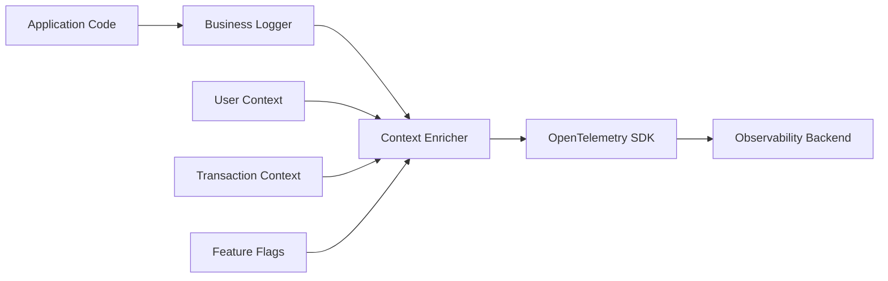
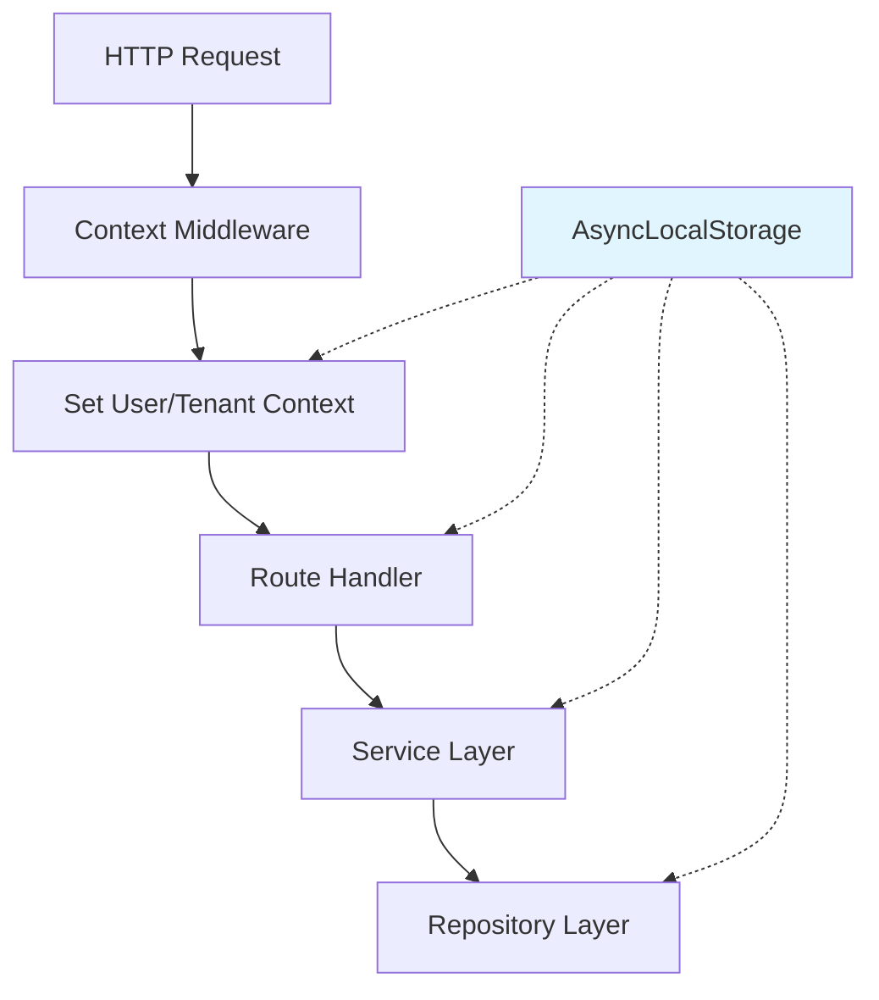

# How to Build Business Context Logging

Author: [nawazdhandala](https://github.com/nawazdhandala)

Tags: Logging, Business Logic, Context, Observability

Description: Learn to build business context logging for meaningful business event tracking.

---

Technical logs tell you what happened in your code. Business context logs tell you what happened in your business. The difference matters when you need to understand why revenue dropped, why users churned, or why a checkout flow failed.

Most teams start with technical logging: HTTP requests, database queries, error stack traces. These are essential for debugging code. But when the VP of Sales asks why a specific enterprise customer had a bad experience, grep through stack traces will not help you.

Business context logging bridges this gap. It captures events in terms that matter to your business: orders placed, subscriptions upgraded, payments failed, users onboarded. Combined with technical telemetry, you get both the "what" and the "why" of system behavior.

---

## The Architecture of Business Context Logging

Business context logging sits between your application logic and your observability backend. It enriches technical events with business meaning.



The business logger wraps your standard logging library and adds structured attributes that describe business events. The context enricher automatically injects user, tenant, and transaction information into every log entry.

---

## Designing Your Business Event Schema

Before writing code, define what business events matter. Start with revenue-impacting actions and user journey milestones.

A well-designed schema uses consistent naming conventions and includes both identifiers and measurements.

```typescript
// business-events.ts - Define your business event types
interface BusinessEvent {
  // Event identification
  event_domain: string;      // 'commerce', 'auth', 'subscription'
  event_name: string;        // 'order_placed', 'login_succeeded'
  event_version: string;     // Schema versioning for evolution

  // Business context
  entity_type: string;       // 'order', 'user', 'subscription'
  entity_id: string;         // Primary identifier

  // Value metrics (when applicable)
  monetary_value?: number;   // Revenue impact in cents
  currency?: string;         // ISO currency code

  // User context
  user_id?: string;
  tenant_id?: string;
  user_segment?: string;     // 'enterprise', 'startup', 'free'
}
```

The schema should evolve with your business. Version your events so you can query historical data even after schema changes.

---

## Building the Business Logger

The business logger wraps your standard logging library and enforces the event schema. It also handles correlation with OpenTelemetry traces.

```typescript
// business-logger.ts - Core business logging implementation
import { trace, context } from '@opentelemetry/api';
import winston from 'winston';

export class BusinessLogger {
  private logger: winston.Logger;

  constructor(serviceName: string) {
    this.logger = winston.createLogger({
      level: 'info',
      format: winston.format.combine(
        winston.format.timestamp(),
        winston.format.json()
      ),
      defaultMeta: { service: serviceName },
      transports: [
        new winston.transports.Console(),
      ],
    });
  }

  // Log a business event with automatic trace correlation
  logBusinessEvent(
    domain: string,
    eventName: string,
    entityType: string,
    entityId: string,
    attributes: Record<string, any> = {}
  ): void {
    // Extract trace context for correlation
    const activeSpan = trace.getActiveSpan();
    const traceContext: Record<string, string> = {};

    if (activeSpan) {
      const spanContext = activeSpan.spanContext();
      traceContext.trace_id = spanContext.traceId;
      traceContext.span_id = spanContext.spanId;
    }

    // Build the structured business event
    const businessEvent = {
      event_type: 'business',
      event_domain: domain,
      event_name: eventName,
      event_version: '1.0',
      entity_type: entityType,
      entity_id: entityId,
      timestamp: new Date().toISOString(),
      ...traceContext,
      ...attributes,
    };

    this.logger.info(`${domain}.${eventName}`, businessEvent);
  }

  // Convenience method for revenue events
  logRevenueEvent(
    eventName: string,
    orderId: string,
    amountCents: number,
    currency: string,
    attributes: Record<string, any> = {}
  ): void {
    this.logBusinessEvent('commerce', eventName, 'order', orderId, {
      monetary_value_cents: amountCents,
      currency: currency,
      ...attributes,
    });
  }
}
```

The logger enforces structure while remaining flexible. Required fields are explicit parameters. Optional context goes in the attributes object.

---

## Adding Request Context Automatically

Manually passing user IDs and tenant information to every log call leads to inconsistency and forgotten context. AsyncLocalStorage solves this by maintaining request-scoped state.



The middleware extracts context from the request and stores it in AsyncLocalStorage. Every downstream function can access this context without explicit parameter passing.

```typescript
// context-store.ts - Request-scoped business context
import { AsyncLocalStorage } from 'async_hooks';

interface BusinessContext {
  user_id?: string;
  tenant_id?: string;
  user_segment?: string;
  subscription_tier?: string;
  correlation_id: string;
  request_path?: string;
}

class ContextStore {
  private storage = new AsyncLocalStorage<BusinessContext>();

  // Run code within a business context
  run<T>(ctx: BusinessContext, fn: () => T): T {
    return this.storage.run(ctx, fn);
  }

  // Get current context (returns empty object if none set)
  get(): BusinessContext {
    return this.storage.getStore() || { correlation_id: 'unknown' };
  }

  // Update context within the current scope
  update(partial: Partial<BusinessContext>): void {
    const current = this.get();
    Object.assign(current, partial);
  }
}

export const contextStore = new ContextStore();
```

The Express middleware extracts user information from the authenticated session and initializes the context for the entire request lifecycle.

```typescript
// middleware/business-context.ts - Express middleware for context injection
import { Request, Response, NextFunction } from 'express';
import { contextStore } from '../context-store';
import { randomUUID } from 'crypto';

export function businessContextMiddleware(
  req: Request,
  res: Response,
  next: NextFunction
): void {
  // Extract business context from request
  const ctx = {
    correlation_id: req.headers['x-correlation-id'] as string || randomUUID(),
    user_id: req.user?.id,
    tenant_id: req.user?.tenantId,
    user_segment: req.user?.segment,
    subscription_tier: req.user?.subscriptionTier,
    request_path: req.path,
  };

  // Run the rest of the request within this context
  contextStore.run(ctx, () => {
    // Add correlation ID to response headers for debugging
    res.setHeader('x-correlation-id', ctx.correlation_id);
    next();
  });
}
```

---

## Integrating Context with the Business Logger

Now combine the context store with the business logger. Every log entry automatically includes user and tenant information.

```typescript
// business-logger-with-context.ts - Context-aware business logging
import { BusinessLogger } from './business-logger';
import { contextStore } from './context-store';

export class ContextAwareBusinessLogger extends BusinessLogger {

  logBusinessEvent(
    domain: string,
    eventName: string,
    entityType: string,
    entityId: string,
    attributes: Record<string, any> = {}
  ): void {
    // Merge automatic context with explicit attributes
    const ctx = contextStore.get();
    const enrichedAttributes = {
      user_id: ctx.user_id,
      tenant_id: ctx.tenant_id,
      user_segment: ctx.user_segment,
      subscription_tier: ctx.subscription_tier,
      correlation_id: ctx.correlation_id,
      ...attributes, // Explicit attributes override context
    };

    super.logBusinessEvent(
      domain,
      eventName,
      entityType,
      entityId,
      enrichedAttributes
    );
  }
}

// Export a singleton for use across the application
export const businessLogger = new ContextAwareBusinessLogger('my-service');
```

---

## Real-World Usage Patterns

Here is how business context logging looks in practice. Notice how the logs capture business meaning without cluttering application logic.

```typescript
// services/order-service.ts - Order processing with business logging
import { businessLogger } from '../business-logger-with-context';

export class OrderService {
  async createOrder(items: CartItem[], paymentMethod: string): Promise<Order> {
    // Calculate order totals
    const subtotal = items.reduce((sum, item) => sum + item.price, 0);
    const tax = this.calculateTax(subtotal);
    const total = subtotal + tax;

    // Log order initiation with business context
    businessLogger.logBusinessEvent(
      'commerce',
      'order_initiated',
      'order',
      'pending',
      {
        item_count: items.length,
        subtotal_cents: subtotal,
        tax_cents: tax,
        total_cents: total,
        payment_method: paymentMethod,
      }
    );

    try {
      // Process payment
      const paymentResult = await this.processPayment(total, paymentMethod);

      // Create order record
      const order = await this.saveOrder(items, paymentResult);

      // Log successful order with revenue impact
      businessLogger.logRevenueEvent(
        'order_completed',
        order.id,
        total,
        'USD',
        {
          item_count: items.length,
          payment_method: paymentMethod,
          first_order: await this.isFirstOrder(),
        }
      );

      return order;
    } catch (error) {
      // Log failed order with failure reason
      businessLogger.logBusinessEvent(
        'commerce',
        'order_failed',
        'order',
        'failed',
        {
          failure_reason: error.message,
          failure_code: error.code,
          attempted_total_cents: total,
          payment_method: paymentMethod,
        }
      );
      throw error;
    }
  }
}
```

The subscription lifecycle is another excellent use case. These events directly impact MRR metrics.

```typescript
// services/subscription-service.ts - Subscription events for SaaS metrics
import { businessLogger } from '../business-logger-with-context';

export class SubscriptionService {
  async upgradeSubscription(
    subscriptionId: string,
    newTier: string
  ): Promise<Subscription> {
    const current = await this.getSubscription(subscriptionId);
    const oldMrr = current.monthlyRevenue;
    const newMrr = this.getTierPrice(newTier);

    businessLogger.logBusinessEvent(
      'subscription',
      'upgrade_initiated',
      'subscription',
      subscriptionId,
      {
        from_tier: current.tier,
        to_tier: newTier,
        mrr_change_cents: newMrr - oldMrr,
        expansion_type: this.classifyExpansion(current.tier, newTier),
      }
    );

    const updated = await this.applyUpgrade(subscriptionId, newTier);

    businessLogger.logBusinessEvent(
      'subscription',
      'upgrade_completed',
      'subscription',
      subscriptionId,
      {
        from_tier: current.tier,
        to_tier: newTier,
        new_mrr_cents: newMrr,
        mrr_change_cents: newMrr - oldMrr,
      }
    );

    return updated;
  }
}
```

---

## Querying Business Events

The structured format enables powerful queries. Find all failed orders for enterprise customers in the last hour:

```sql
SELECT
  timestamp,
  entity_id,
  user_id,
  tenant_id,
  attributes->>'failure_reason' as failure_reason,
  attributes->>'attempted_total_cents' as amount
FROM logs
WHERE event_domain = 'commerce'
  AND event_name = 'order_failed'
  AND user_segment = 'enterprise'
  AND timestamp > NOW() - INTERVAL '1 hour'
ORDER BY timestamp DESC;
```

Calculate expansion revenue by customer segment:

```sql
SELECT
  user_segment,
  SUM(CAST(attributes->>'mrr_change_cents' AS INTEGER)) / 100.0 as expansion_revenue
FROM logs
WHERE event_domain = 'subscription'
  AND event_name = 'upgrade_completed'
  AND timestamp > DATE_TRUNC('month', CURRENT_DATE)
GROUP BY user_segment;
```

---

## Best Practices

Keep these principles in mind when building business context logging:

1. **Log at business boundaries, not technical ones.** Log when a user completes checkout, not when you call the payment API.

2. **Include monetary values in cents.** Floating point math causes rounding issues. Store 9999 cents, not 99.99 dollars.

3. **Version your event schemas.** When you add or remove fields, increment the version so queries can handle both formats.

4. **Keep context automatic, attributes explicit.** User ID should come from context. Order total should be an explicit parameter.

5. **Test your business logs.** Write tests that verify events are logged with correct attributes. These logs drive business decisions.

---

## Final Thoughts

Business context logging transforms your observability from a debugging tool into a business intelligence asset. When an incident occurs, you can answer both "what broke" and "who was affected and by how much."

The investment in structured business events pays off in multiple ways: faster incident response, better product analytics, and the ability to correlate technical issues with business impact.

Start with your most revenue-critical flows. Add business logging to checkout, subscription changes, and user onboarding. Once you see the value, expand to other areas of your application.

---

*[OneUptime](https://oneuptime.com) provides native OpenTelemetry support for logs, traces, and metrics. Send your business context logs to OneUptime and correlate them with technical telemetry for complete observability.*

**Related Reading:**

- [How to Structure Logs Properly in OpenTelemetry](https://oneuptime.com/blog/post/2025-08-28-how-to-structure-logs-properly-in-opentelemetry/view)
- [Logs, Metrics & Traces: Turning Three Noisy Streams into One Story](https://oneuptime.com/blog/post/2025-08-20-three-pillars-of-observability-logs-metrics-traces/view)
