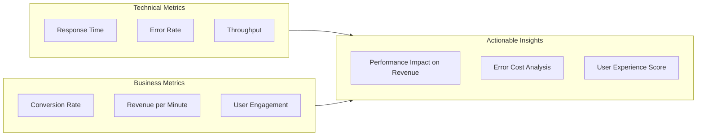
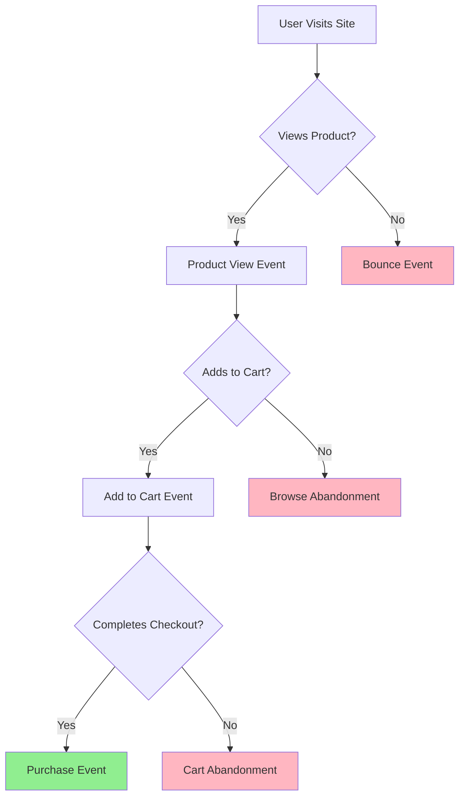
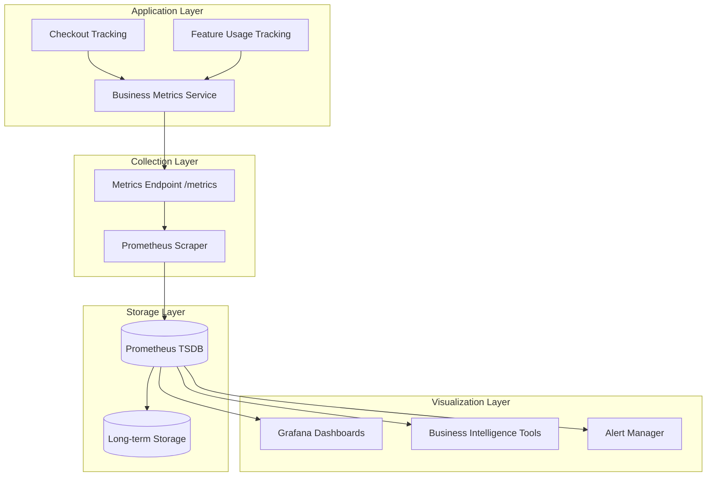
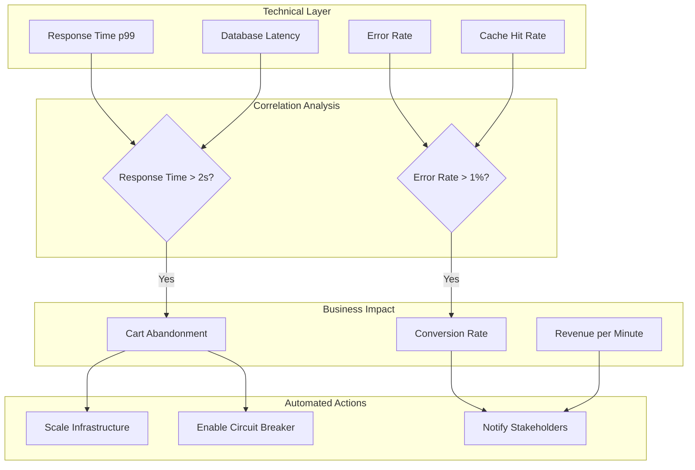

# How to Build Business Metrics

Author: [nawazdhandala](https://github.com/nawazdhandala)

Tags: Observability, Metrics, Business Intelligence, SRE

Description: Learn how to implement business metrics that connect technical performance to business outcomes.

---

Modern observability goes beyond tracking CPU usage and response times. To truly understand how your systems impact your organization, you need to measure business metrics alongside technical ones. This guide will walk you through building metrics that matter to stakeholders across your organization, from conversion rates to revenue tracking.

## Why Business Metrics Matter

Technical metrics tell you if your system is running. Business metrics tell you if your system is succeeding. When your checkout page has 99.9% uptime but conversions drop by 20%, you need visibility into both dimensions to understand what is happening.



## Core Business Metrics Categories

Before diving into implementation, let us define the three primary categories of business metrics you should track:

### 1. Conversion Metrics

Conversion metrics track how effectively users complete desired actions.



### 2. Revenue Metrics

Revenue metrics connect system performance directly to financial outcomes.

### 3. User Engagement Metrics

Engagement metrics measure how actively users interact with your product.

## Setting Up Your Metrics Infrastructure

Here is a complete example of a business metrics service in TypeScript:

```typescript
// business-metrics.ts
// A comprehensive service for tracking business metrics

import { Counter, Histogram, Gauge, Registry } from 'prom-client';

// Create a dedicated registry for business metrics
// This keeps them separate from technical metrics for easier management
const businessMetricsRegistry = new Registry();

// ============================================
// CONVERSION METRICS
// ============================================

// Track each step in the conversion funnel
// Labels allow slicing by different dimensions
const funnelStepCounter = new Counter({
    name: 'business_funnel_step_total',
    help: 'Counts progression through conversion funnel steps',
    labelNames: ['step', 'source', 'device_type', 'experiment_variant'],
    registers: [businessMetricsRegistry]
});

// Track conversion completions with monetary value
const conversionCounter = new Counter({
    name: 'business_conversions_total',
    help: 'Total number of completed conversions',
    labelNames: ['conversion_type', 'source', 'device_type'],
    registers: [businessMetricsRegistry]
});

// Measure time from first visit to conversion
// This helps identify friction in the user journey
const timeToConversionHistogram = new Histogram({
    name: 'business_time_to_conversion_seconds',
    help: 'Time elapsed from session start to conversion',
    labelNames: ['conversion_type'],
    // Buckets from 30 seconds to 1 hour
    buckets: [30, 60, 120, 300, 600, 1800, 3600],
    registers: [businessMetricsRegistry]
});

// ============================================
// REVENUE METRICS
// ============================================

// Track revenue with high granularity
// Using a Counter allows calculating rate of revenue over time
const revenueCounter = new Counter({
    name: 'business_revenue_cents_total',
    help: 'Total revenue in cents to avoid floating point issues',
    labelNames: ['product_category', 'payment_method', 'region'],
    registers: [businessMetricsRegistry]
});

// Track order values for distribution analysis
const orderValueHistogram = new Histogram({
    name: 'business_order_value_cents',
    help: 'Distribution of order values in cents',
    labelNames: ['product_category'],
    // Buckets from $5 to $500
    buckets: [500, 1000, 2500, 5000, 10000, 25000, 50000],
    registers: [businessMetricsRegistry]
});

// Real-time gauge for active revenue per minute
// Useful for dashboards and alerting
const revenuePerMinuteGauge = new Gauge({
    name: 'business_revenue_per_minute_cents',
    help: 'Rolling revenue per minute calculation',
    labelNames: ['region'],
    registers: [businessMetricsRegistry]
});

// ============================================
// USER ENGAGEMENT METRICS
// ============================================

// Track feature usage to understand product adoption
const featureUsageCounter = new Counter({
    name: 'business_feature_usage_total',
    help: 'Counts of feature interactions by users',
    labelNames: ['feature_name', 'user_tier', 'is_new_user'],
    registers: [businessMetricsRegistry]
});

// Measure session duration for engagement analysis
const sessionDurationHistogram = new Histogram({
    name: 'business_session_duration_seconds',
    help: 'Duration of user sessions',
    labelNames: ['user_tier', 'entry_page'],
    // Buckets from 10 seconds to 1 hour
    buckets: [10, 30, 60, 120, 300, 600, 1800, 3600],
    registers: [businessMetricsRegistry]
});

// Track active users at different time granularities
const activeUsersGauge = new Gauge({
    name: 'business_active_users',
    help: 'Number of active users in the given time window',
    labelNames: ['window', 'user_tier'],
    registers: [businessMetricsRegistry]
});

// ============================================
// BUSINESS METRICS SERVICE
// ============================================

export class BusinessMetricsService {
    // Record a funnel step progression
    // Call this at each stage of your conversion funnel
    recordFunnelStep(
        step: string,
        metadata: {
            source: string;
            deviceType: string;
            experimentVariant?: string;
        }
    ): void {
        funnelStepCounter.inc({
            step,
            source: metadata.source,
            device_type: metadata.deviceType,
            experiment_variant: metadata.experimentVariant || 'control'
        });
    }

    // Record a completed conversion event
    // This should be called when a user completes a desired action
    recordConversion(
        type: string,
        metadata: {
            source: string;
            deviceType: string;
            sessionStartTime: Date;
        }
    ): void {
        // Increment the conversion counter
        conversionCounter.inc({
            conversion_type: type,
            source: metadata.source,
            device_type: metadata.deviceType
        });

        // Calculate and record time to conversion
        const timeToConversion =
            (Date.now() - metadata.sessionStartTime.getTime()) / 1000;

        timeToConversionHistogram.observe(
            { conversion_type: type },
            timeToConversion
        );
    }

    // Record a revenue event
    // Always use cents/smallest currency unit to avoid floating point issues
    recordRevenue(
        amountCents: number,
        metadata: {
            productCategory: string;
            paymentMethod: string;
            region: string;
        }
    ): void {
        // Add to total revenue counter
        revenueCounter.inc({
            product_category: metadata.productCategory,
            payment_method: metadata.paymentMethod,
            region: metadata.region
        }, amountCents);

        // Record order value distribution
        orderValueHistogram.observe(
            { product_category: metadata.productCategory },
            amountCents
        );
    }

    // Record feature usage for engagement tracking
    recordFeatureUsage(
        featureName: string,
        metadata: {
            userTier: string;
            isNewUser: boolean;
        }
    ): void {
        featureUsageCounter.inc({
            feature_name: featureName,
            user_tier: metadata.userTier,
            is_new_user: String(metadata.isNewUser)
        });
    }

    // Record session end for duration tracking
    recordSessionEnd(
        sessionStartTime: Date,
        metadata: {
            userTier: string;
            entryPage: string;
        }
    ): void {
        const duration = (Date.now() - sessionStartTime.getTime()) / 1000;

        sessionDurationHistogram.observe({
            user_tier: metadata.userTier,
            entry_page: metadata.entryPage
        }, duration);
    }

    // Update active user counts
    // Call this periodically from a background job
    updateActiveUsers(
        window: 'daily' | 'weekly' | 'monthly',
        counts: Map<string, number>
    ): void {
        for (const [userTier, count] of counts) {
            activeUsersGauge.set(
                { window, user_tier: userTier },
                count
            );
        }
    }

    // Get all metrics for scraping
    async getMetrics(): Promise<string> {
        return businessMetricsRegistry.metrics();
    }
}

// Export a singleton instance
export const businessMetrics = new BusinessMetricsService();
```

## Implementing Conversion Rate Tracking

Here is a practical example of tracking conversion rates in an e-commerce checkout flow:

```typescript
// checkout-tracking.ts
// Example implementation for tracking checkout funnel metrics

import { businessMetrics } from './business-metrics';

// Define the steps in your conversion funnel
// Order matters for funnel analysis
enum CheckoutStep {
    CART_VIEW = 'cart_view',
    SHIPPING_INFO = 'shipping_info',
    PAYMENT_INFO = 'payment_info',
    ORDER_REVIEW = 'order_review',
    ORDER_CONFIRMED = 'order_confirmed'
}

interface SessionContext {
    sessionId: string;
    sessionStartTime: Date;
    source: string;
    deviceType: 'mobile' | 'desktop' | 'tablet';
    experimentVariant: string;
}

class CheckoutTracker {
    private sessionContext: SessionContext;

    constructor(context: SessionContext) {
        this.sessionContext = context;
    }

    // Track when user views their cart
    // This is typically the entry point to the checkout funnel
    trackCartView(cartValue: number, itemCount: number): void {
        businessMetrics.recordFunnelStep(CheckoutStep.CART_VIEW, {
            source: this.sessionContext.source,
            deviceType: this.sessionContext.deviceType,
            experimentVariant: this.sessionContext.experimentVariant
        });

        // Also track cart composition for analysis
        console.log(`Cart viewed: ${itemCount} items, $${cartValue / 100}`);
    }

    // Track shipping information entry
    // High drop-off here often indicates UX issues
    trackShippingInfo(): void {
        businessMetrics.recordFunnelStep(CheckoutStep.SHIPPING_INFO, {
            source: this.sessionContext.source,
            deviceType: this.sessionContext.deviceType,
            experimentVariant: this.sessionContext.experimentVariant
        });
    }

    // Track payment information entry
    // Drop-off here may indicate trust issues or payment method gaps
    trackPaymentInfo(paymentMethod: string): void {
        businessMetrics.recordFunnelStep(CheckoutStep.PAYMENT_INFO, {
            source: this.sessionContext.source,
            deviceType: this.sessionContext.deviceType,
            experimentVariant: this.sessionContext.experimentVariant
        });
    }

    // Track order review step
    // Users reaching here are highly likely to convert
    trackOrderReview(): void {
        businessMetrics.recordFunnelStep(CheckoutStep.ORDER_REVIEW, {
            source: this.sessionContext.source,
            deviceType: this.sessionContext.deviceType,
            experimentVariant: this.sessionContext.experimentVariant
        });
    }

    // Track completed purchase
    // This is your primary conversion event
    trackPurchaseComplete(
        orderValue: number,
        productCategory: string,
        paymentMethod: string,
        region: string
    ): void {
        // Record final funnel step
        businessMetrics.recordFunnelStep(CheckoutStep.ORDER_CONFIRMED, {
            source: this.sessionContext.source,
            deviceType: this.sessionContext.deviceType,
            experimentVariant: this.sessionContext.experimentVariant
        });

        // Record the conversion
        businessMetrics.recordConversion('purchase', {
            source: this.sessionContext.source,
            deviceType: this.sessionContext.deviceType,
            sessionStartTime: this.sessionContext.sessionStartTime
        });

        // Record the revenue
        businessMetrics.recordRevenue(orderValue, {
            productCategory,
            paymentMethod,
            region
        });
    }
}

// Example usage in an Express.js checkout API
import express from 'express';

const app = express();

app.post('/api/checkout/complete', async (req, res) => {
    const { orderId, orderValue, productCategory, paymentMethod } = req.body;

    // Get session context from your session management system
    const sessionContext: SessionContext = {
        sessionId: req.session.id,
        sessionStartTime: new Date(req.session.startTime),
        source: req.session.utmSource || 'direct',
        deviceType: req.session.deviceType,
        experimentVariant: req.session.experimentVariant || 'control'
    };

    const tracker = new CheckoutTracker(sessionContext);

    try {
        // Process the order
        await processOrder(orderId);

        // Track the successful conversion
        tracker.trackPurchaseComplete(
            orderValue,
            productCategory,
            paymentMethod,
            req.session.region
        );

        res.json({ success: true, orderId });
    } catch (error) {
        // Track failed conversion attempt
        businessMetrics.recordFunnelStep('checkout_error', {
            source: sessionContext.source,
            deviceType: sessionContext.deviceType,
            experimentVariant: sessionContext.experimentVariant
        });

        res.status(500).json({ success: false, error: 'Order failed' });
    }
});
```

## Building Revenue Metrics Dashboards

Once you have metrics flowing, you need to visualize them. Here is how the data flows through your monitoring stack:



### Example Prometheus Queries for Business Metrics

```promql
# Conversion rate over the last hour
# Calculates percentage of cart views that result in purchases
sum(rate(business_funnel_step_total{step="order_confirmed"}[1h]))
/
sum(rate(business_funnel_step_total{step="cart_view"}[1h]))
* 100

# Revenue per minute by region
# Useful for real-time revenue monitoring
sum by (region) (rate(business_revenue_cents_total[5m])) * 60

# Average order value by product category
# Helps identify high-value product lines
histogram_quantile(0.5,
    sum by (product_category, le) (
        rate(business_order_value_cents_bucket[1h])
    )
)

# Feature adoption rate for new users
# Tracks how new users engage with specific features
sum(rate(business_feature_usage_total{is_new_user="true"}[24h])) by (feature_name)
/
sum(rate(business_feature_usage_total{is_new_user="true"}[24h]))
* 100

# Session duration percentiles by user tier
# Helps understand engagement differences across user segments
histogram_quantile(0.95,
    sum by (user_tier, le) (
        rate(business_session_duration_seconds_bucket[1h])
    )
)
```

## User Engagement Tracking Implementation

Here is a complete example for tracking user engagement metrics:

```typescript
// engagement-tracking.ts
// Track user engagement patterns and feature adoption

import { businessMetrics } from './business-metrics';

// Define engagement events to track
// These should align with your product's key actions
interface EngagementEvent {
    eventName: string;
    userId: string;
    userTier: 'free' | 'pro' | 'enterprise';
    isNewUser: boolean;
    timestamp: Date;
    properties?: Record<string, string | number | boolean>;
}

class EngagementTracker {
    private sessionStartTime: Date;
    private userTier: string;
    private entryPage: string;
    private isNewUser: boolean;

    constructor(config: {
        userTier: string;
        entryPage: string;
        isNewUser: boolean;
    }) {
        this.sessionStartTime = new Date();
        this.userTier = config.userTier;
        this.entryPage = config.entryPage;
        this.isNewUser = config.isNewUser;
    }

    // Track when a user interacts with a feature
    // Use descriptive feature names for better analysis
    trackFeatureUsage(featureName: string): void {
        businessMetrics.recordFeatureUsage(featureName, {
            userTier: this.userTier,
            isNewUser: this.isNewUser
        });
    }

    // Track specific engagement milestones
    // These are key moments in the user journey
    trackMilestone(milestone: string): void {
        businessMetrics.recordFunnelStep(`milestone_${milestone}`, {
            source: 'in_app',
            deviceType: 'web',
            experimentVariant: 'control'
        });
    }

    // Call this when the user's session ends
    // Typically on page unload or explicit logout
    endSession(): void {
        businessMetrics.recordSessionEnd(this.sessionStartTime, {
            userTier: this.userTier,
            entryPage: this.entryPage
        });
    }
}

// Example: Tracking engagement in a React application
// This hook provides engagement tracking throughout your app

import { useEffect, useRef } from 'react';

function useEngagementTracking(config: {
    userTier: string;
    entryPage: string;
    isNewUser: boolean;
}) {
    // Use ref to persist tracker across renders
    const trackerRef = useRef<EngagementTracker | null>(null);

    useEffect(() => {
        // Initialize tracker on mount
        trackerRef.current = new EngagementTracker(config);

        // Track session end on unmount
        return () => {
            if (trackerRef.current) {
                trackerRef.current.endSession();
            }
        };
    }, [config.userTier, config.entryPage, config.isNewUser]);

    // Return tracking functions for use in components
    return {
        trackFeature: (featureName: string) => {
            trackerRef.current?.trackFeatureUsage(featureName);
        },
        trackMilestone: (milestone: string) => {
            trackerRef.current?.trackMilestone(milestone);
        }
    };
}

// Usage in a React component
function DashboardPage() {
    const { trackFeature, trackMilestone } = useEngagementTracking({
        userTier: 'pro',
        entryPage: '/dashboard',
        isNewUser: false
    });

    const handleExportClick = () => {
        // Track feature usage when user exports data
        trackFeature('dashboard_export');

        // Perform the export
        exportDashboardData();
    };

    const handleFirstChartCreated = () => {
        // Track milestone when user creates their first chart
        trackMilestone('first_chart_created');
    };

    return (
        <div>
            <button onClick={handleExportClick}>Export Data</button>
            {/* ... rest of dashboard */}
        </div>
    );
}
```

## Alerting on Business Metrics

Technical alerts tell you when systems fail. Business alerts tell you when outcomes suffer. Here is how to set up meaningful business metric alerts:

```yaml
# prometheus-alerts.yml
# Business metric alerting rules

groups:
  - name: business_metrics
    rules:
      # Alert when conversion rate drops significantly
      # This could indicate UX issues, payment problems, or technical errors
      - alert: ConversionRateDrop
        expr: |
          (
            sum(rate(business_funnel_step_total{step="order_confirmed"}[1h]))
            /
            sum(rate(business_funnel_step_total{step="cart_view"}[1h]))
          ) < 0.02
        for: 15m
        labels:
          severity: critical
          team: product
        annotations:
          summary: "Conversion rate has dropped below 2%"
          description: |
            Current conversion rate is {{ $value | humanizePercentage }}.
            This is below the expected baseline of 3%.
            Check for checkout errors, payment gateway issues, or UX problems.

      # Alert when revenue per minute drops below baseline
      # Useful for detecting issues during peak hours
      - alert: RevenueBelowBaseline
        expr: |
          sum(rate(business_revenue_cents_total[5m])) * 60 < 50000
        for: 10m
        labels:
          severity: warning
          team: business
        annotations:
          summary: "Revenue per minute is below $500"
          description: |
            Current revenue rate is ${{ $value | humanize }} per minute.
            Expected baseline during business hours is $500 per minute.

      # Alert on high cart abandonment rate
      # Helps identify checkout friction
      - alert: HighCartAbandonment
        expr: |
          1 - (
            sum(rate(business_funnel_step_total{step="order_confirmed"}[1h]))
            /
            sum(rate(business_funnel_step_total{step="cart_view"}[1h]))
          ) > 0.85
        for: 30m
        labels:
          severity: warning
          team: product
        annotations:
          summary: "Cart abandonment rate exceeds 85%"
          description: |
            {{ $value | humanizePercentage }} of carts are being abandoned.
            Review checkout flow for potential friction points.

      # Alert when feature adoption drops for new users
      # Early indicator of onboarding problems
      - alert: NewUserEngagementDrop
        expr: |
          sum(rate(business_feature_usage_total{is_new_user="true"}[24h]))
          /
          sum(rate(business_feature_usage_total{is_new_user="true"}[24h] offset 7d))
          < 0.7
        for: 1h
        labels:
          severity: warning
          team: growth
        annotations:
          summary: "New user feature engagement dropped 30% week over week"
          description: |
            New user engagement is at {{ $value | humanizePercentage }} of last week.
            Check for onboarding flow issues or product changes.
```

## Connecting Business and Technical Metrics

The real power comes from correlating business metrics with technical metrics. Here is how to build that connection:



```typescript
// correlation-analysis.ts
// Analyze relationships between technical and business metrics

interface MetricCorrelation {
    technicalMetric: string;
    businessMetric: string;
    correlationCoefficient: number;
    impactEstimate: string;
}

class MetricCorrelationService {
    // Calculate the business impact of technical degradation
    // This helps prioritize engineering efforts
    async analyzeImpact(
        technicalMetricName: string,
        businessMetricName: string,
        timeRange: string
    ): Promise<MetricCorrelation> {
        // Query both metrics from Prometheus
        const technicalData = await this.queryPrometheus(
            technicalMetricName,
            timeRange
        );
        const businessData = await this.queryPrometheus(
            businessMetricName,
            timeRange
        );

        // Calculate Pearson correlation coefficient
        const correlation = this.calculateCorrelation(
            technicalData,
            businessData
        );

        // Estimate business impact
        const impact = this.estimateImpact(correlation, businessMetricName);

        return {
            technicalMetric: technicalMetricName,
            businessMetric: businessMetricName,
            correlationCoefficient: correlation,
            impactEstimate: impact
        };
    }

    private calculateCorrelation(
        dataA: number[],
        dataB: number[]
    ): number {
        // Pearson correlation implementation
        const n = dataA.length;
        const sumA = dataA.reduce((a, b) => a + b, 0);
        const sumB = dataB.reduce((a, b) => a + b, 0);
        const sumAB = dataA.reduce((sum, a, i) => sum + a * dataB[i], 0);
        const sumA2 = dataA.reduce((sum, a) => sum + a * a, 0);
        const sumB2 = dataB.reduce((sum, b) => sum + b * b, 0);

        const numerator = n * sumAB - sumA * sumB;
        const denominator = Math.sqrt(
            (n * sumA2 - sumA * sumA) * (n * sumB2 - sumB * sumB)
        );

        return denominator === 0 ? 0 : numerator / denominator;
    }

    private estimateImpact(
        correlation: number,
        metricName: string
    ): string {
        const absCorrelation = Math.abs(correlation);

        if (absCorrelation > 0.7) {
            return `Strong ${correlation > 0 ? 'positive' : 'negative'} impact on ${metricName}`;
        } else if (absCorrelation > 0.4) {
            return `Moderate ${correlation > 0 ? 'positive' : 'negative'} impact on ${metricName}`;
        } else {
            return `Weak correlation with ${metricName}`;
        }
    }

    private async queryPrometheus(
        metric: string,
        timeRange: string
    ): Promise<number[]> {
        // Implementation would query your Prometheus instance
        // Returns array of metric values over the time range
        return [];
    }
}

// Example usage: Analyze how response time affects conversion rate
const correlationService = new MetricCorrelationService();

async function analyzeResponseTimeImpact() {
    const result = await correlationService.analyzeImpact(
        'http_request_duration_seconds_p99',
        'business_conversion_rate',
        '7d'
    );

    console.log(`Correlation: ${result.correlationCoefficient}`);
    console.log(`Impact: ${result.impactEstimate}`);

    // Output might be:
    // Correlation: -0.72
    // Impact: Strong negative impact on business_conversion_rate
}
```

## Best Practices for Business Metrics

### 1. Use Consistent Naming Conventions

```typescript
// Good: Clear, hierarchical naming
const metricNames = {
    revenue: 'business_revenue_cents_total',
    conversions: 'business_conversions_total',
    engagement: 'business_feature_usage_total'
};

// Bad: Inconsistent, unclear naming
const badNames = {
    revenue: 'rev_total',
    conversions: 'cvr_count',
    engagement: 'clicks'
};
```

### 2. Always Use Labels Strategically

```typescript
// Good: Labels that enable useful breakdowns
conversionCounter.inc({
    conversion_type: 'purchase',      // What converted
    source: 'google_ads',             // Where they came from
    device_type: 'mobile',            // How they accessed
    region: 'us_west'                 // Where they are
});

// Bad: Too many labels cause cardinality explosion
// Avoid: user_id, session_id, timestamp as labels
```

### 3. Document Your Metrics

```typescript
/**
 * Business Metrics Documentation
 *
 * business_revenue_cents_total
 * - Type: Counter
 * - Unit: Cents (USD)
 * - Labels: product_category, payment_method, region
 * - Owner: Revenue Team
 * - Alert threshold: < $500/min during business hours
 *
 * business_funnel_step_total
 * - Type: Counter
 * - Unit: Events
 * - Labels: step, source, device_type, experiment_variant
 * - Owner: Growth Team
 * - Key steps: cart_view -> shipping_info -> payment_info -> order_confirmed
 */
```

## Conclusion

Building effective business metrics requires thinking beyond technical performance. By implementing the patterns shown in this guide, you can create a metrics system that:

1. Tracks conversion funnels with granular detail
2. Measures revenue impact in real time
3. Monitors user engagement patterns
4. Correlates technical performance with business outcomes
5. Enables proactive alerting on business health

Start with the core metrics that matter most to your organization, then expand as you learn what questions you need to answer. Remember that the goal is not to measure everything, but to measure what matters.

The code examples in this guide provide a foundation you can adapt to your specific tech stack and business model. Whether you use Prometheus, DataDog, or another observability platform, the principles remain the same: define meaningful metrics, instrument them consistently, and use them to drive better decisions.
