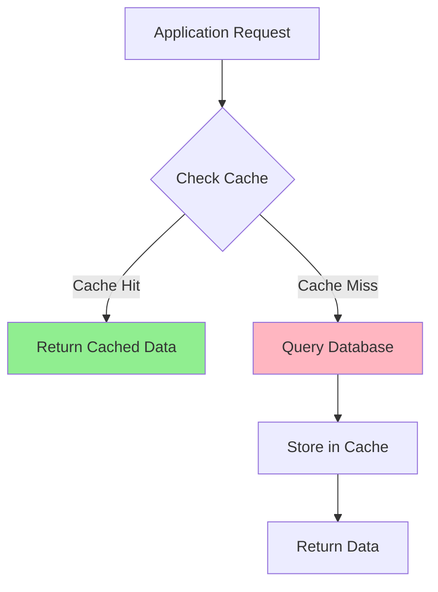
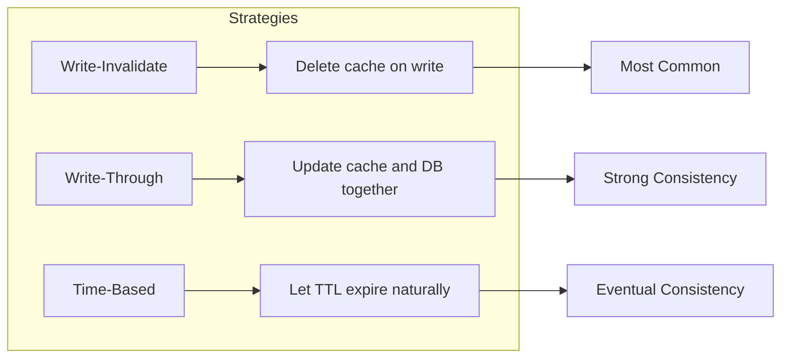
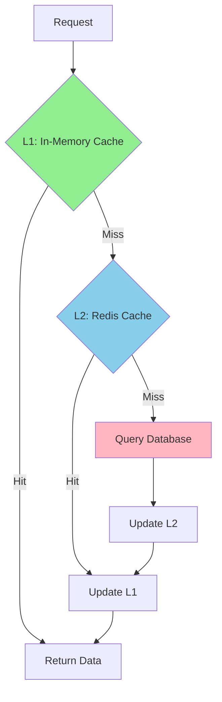

# How to Create Cache-Aside Pattern

Author: [nawazdhandala](https://github.com/nawazdhandala)

Tags: Caching, Redis, Performance, DevOps

Description: Learn how to implement the cache-aside pattern to reduce database load, improve response times, and build resilient applications with practical code examples.

---

The cache-aside pattern (also called lazy-loading) is one of the most widely used caching strategies in production systems. Instead of the cache managing itself, your application code takes responsibility for loading data into the cache on demand and invalidating it when updates occur. This guide walks through implementing cache-aside from scratch with real-world considerations.

## Why Cache-Aside?

| Benefit | Impact |
|---------|--------|
| Reduced database load | Only cache what you actually access |
| Lower latency | Frequently accessed data served from memory |
| Resilience | Application works even if cache fails |
| Simplicity | No complex cache synchronization |
| Cost efficiency | Cache only hot data, not entire database |

## How Cache-Aside Works

The pattern follows a simple read and write flow that keeps your application in control of cache state.



**Read Path:**
1. Check the cache for requested data
2. If found (cache hit), return immediately
3. If not found (cache miss), query the database
4. Store the result in cache for future requests
5. Return the data

**Write Path:**
1. Update the database
2. Invalidate or update the cache entry

## Basic Implementation

Here is a straightforward cache-aside implementation in Node.js using Redis as the cache layer.

```javascript
const Redis = require('ioredis');

class CacheAside {
  constructor(options = {}) {
    this.redis = new Redis(options.redisUrl || 'redis://localhost:6379');
    this.defaultTTL = options.defaultTTL || 3600; // 1 hour
    this.prefix = options.prefix || 'cache:';
  }

  // Build a consistent cache key with prefix
  buildKey(key) {
    return `${this.prefix}${key}`;
  }

  // Main cache-aside read operation
  async get(key, fetchFunction, options = {}) {
    const cacheKey = this.buildKey(key);
    const ttl = options.ttl || this.defaultTTL;

    try {
      // Step 1: Check cache first
      const cached = await this.redis.get(cacheKey);

      if (cached !== null) {
        // Cache hit - parse and return
        return JSON.parse(cached);
      }

      // Step 2: Cache miss - fetch from source
      const data = await fetchFunction();

      // Step 3: Store in cache for future requests
      if (data !== null && data !== undefined) {
        await this.redis.setex(cacheKey, ttl, JSON.stringify(data));
      }

      return data;
    } catch (error) {
      // Cache failure - fall back to database
      console.error('Cache error, falling back to database:', error.message);
      return fetchFunction();
    }
  }

  // Invalidate cache when data changes
  async invalidate(key) {
    const cacheKey = this.buildKey(key);
    await this.redis.del(cacheKey);
  }

  // Invalidate multiple keys matching a pattern
  async invalidatePattern(pattern) {
    const keys = await this.redis.keys(`${this.prefix}${pattern}`);
    if (keys.length > 0) {
      await this.redis.del(...keys);
    }
  }
}
```

## Using Cache-Aside with a User Service

Here is how you would integrate cache-aside into a typical user service.

```javascript
const { Pool } = require('pg');

class UserService {
  constructor(cacheAside, db) {
    this.cache = cacheAside;
    this.db = db;
  }

  // Get user by ID with caching
  async getUserById(userId) {
    const cacheKey = `user:${userId}`;

    return this.cache.get(cacheKey, async () => {
      // This only runs on cache miss
      const result = await this.db.query(
        'SELECT id, name, email, created_at FROM users WHERE id = $1',
        [userId]
      );
      return result.rows[0] || null;
    });
  }

  // Update user - invalidate cache after write
  async updateUser(userId, updates) {
    const { name, email } = updates;

    // Step 1: Update the database first
    const result = await this.db.query(
      'UPDATE users SET name = $1, email = $2, updated_at = NOW() WHERE id = $3 RETURNING *',
      [name, email, userId]
    );

    // Step 2: Invalidate the cache
    await this.cache.invalidate(`user:${userId}`);

    return result.rows[0];
  }

  // Delete user - invalidate cache
  async deleteUser(userId) {
    await this.db.query('DELETE FROM users WHERE id = $1', [userId]);
    await this.cache.invalidate(`user:${userId}`);
  }
}

// Usage
const cache = new CacheAside({ defaultTTL: 1800 }); // 30 minutes
const db = new Pool();
const userService = new UserService(cache, db);

// First call hits database, subsequent calls hit cache
const user = await userService.getUserById(123);
```

## Cache Invalidation Strategies

Choosing the right invalidation strategy is critical for data consistency.



| Strategy | Consistency | Complexity | Best For |
|----------|-------------|------------|----------|
| Write-Invalidate | Strong | Low | Most applications |
| Write-Through | Strong | Medium | Critical data |
| TTL Only | Eventual | Very Low | Read-heavy, tolerant of stale data |
| Write-Behind | Eventual | High | Write-heavy workloads |

## Handling Cache Stampede

When a popular cache key expires, multiple requests may simultaneously try to rebuild it, overwhelming your database. This is called a cache stampede.

```javascript
class CacheAsideWithStampede {
  constructor(options = {}) {
    this.redis = new Redis(options.redisUrl);
    this.defaultTTL = options.defaultTTL || 3600;
    this.prefix = options.prefix || 'cache:';
    this.lockTTL = options.lockTTL || 10; // Lock timeout in seconds
  }

  buildKey(key) {
    return `${this.prefix}${key}`;
  }

  buildLockKey(key) {
    return `${this.prefix}lock:${key}`;
  }

  // Acquire a distributed lock to prevent stampede
  async acquireLock(key) {
    const lockKey = this.buildLockKey(key);
    // SET NX returns 'OK' if lock acquired, null otherwise
    const result = await this.redis.set(lockKey, '1', 'EX', this.lockTTL, 'NX');
    return result === 'OK';
  }

  async releaseLock(key) {
    const lockKey = this.buildLockKey(key);
    await this.redis.del(lockKey);
  }

  async get(key, fetchFunction, options = {}) {
    const cacheKey = this.buildKey(key);
    const ttl = options.ttl || this.defaultTTL;

    // Check cache first
    const cached = await this.redis.get(cacheKey);
    if (cached !== null) {
      return JSON.parse(cached);
    }

    // Try to acquire lock for cache rebuild
    const lockAcquired = await this.acquireLock(key);

    if (lockAcquired) {
      try {
        // Double-check cache after acquiring lock
        const rechecked = await this.redis.get(cacheKey);
        if (rechecked !== null) {
          return JSON.parse(rechecked);
        }

        // We have the lock - rebuild cache
        const data = await fetchFunction();

        if (data !== null && data !== undefined) {
          await this.redis.setex(cacheKey, ttl, JSON.stringify(data));
        }

        return data;
      } finally {
        await this.releaseLock(key);
      }
    } else {
      // Another process is rebuilding - wait and retry
      await this.sleep(50);
      return this.get(key, fetchFunction, options);
    }
  }

  sleep(ms) {
    return new Promise(resolve => setTimeout(resolve, ms));
  }
}
```

## Probabilistic Early Expiration

Another approach to prevent stampedes is to refresh the cache before it expires, using a probabilistic algorithm.

```javascript
class CacheAsideWithEarlyRefresh {
  constructor(options = {}) {
    this.redis = new Redis(options.redisUrl);
    this.defaultTTL = options.defaultTTL || 3600;
    this.prefix = options.prefix || 'cache:';
    // Beta controls refresh probability (higher = more aggressive refresh)
    this.beta = options.beta || 1.0;
  }

  buildKey(key) {
    return `${this.prefix}${key}`;
  }

  // Store data with metadata for early expiration calculation
  async setWithMetadata(key, data, ttl) {
    const cacheKey = this.buildKey(key);
    const payload = {
      data,
      createdAt: Date.now(),
      ttl: ttl * 1000, // Convert to milliseconds
    };
    await this.redis.setex(cacheKey, ttl, JSON.stringify(payload));
  }

  // Determine if we should refresh based on remaining TTL
  shouldRefresh(createdAt, ttlMs) {
    const age = Date.now() - createdAt;
    const remaining = ttlMs - age;

    if (remaining <= 0) return true;

    // XFetch algorithm: probabilistic early refresh
    // As remaining time decreases, probability of refresh increases
    const random = Math.random();
    const delta = ttlMs * 0.1; // Assume 10% of TTL for recompute time
    const threshold = delta * this.beta * Math.log(random);

    return remaining + threshold <= 0;
  }

  async get(key, fetchFunction, options = {}) {
    const cacheKey = this.buildKey(key);
    const ttl = options.ttl || this.defaultTTL;

    const cached = await this.redis.get(cacheKey);

    if (cached !== null) {
      const { data, createdAt, ttl: storedTTL } = JSON.parse(cached);

      // Check if we should proactively refresh
      if (!this.shouldRefresh(createdAt, storedTTL)) {
        return data;
      }

      // Refresh in background, return stale data immediately
      this.refreshInBackground(key, fetchFunction, ttl);
      return data;
    }

    // Cache miss - fetch and store
    const data = await fetchFunction();
    if (data !== null && data !== undefined) {
      await this.setWithMetadata(key, data, ttl);
    }
    return data;
  }

  async refreshInBackground(key, fetchFunction, ttl) {
    try {
      const data = await fetchFunction();
      if (data !== null && data !== undefined) {
        await this.setWithMetadata(key, data, ttl);
      }
    } catch (error) {
      console.error('Background refresh failed:', error.message);
    }
  }
}
```

## Multi-Level Caching

For high-performance applications, combine in-memory and distributed caching.



```javascript
const LRU = require('lru-cache');

class MultiLevelCache {
  constructor(options = {}) {
    // L1: In-memory LRU cache (fastest, limited size)
    this.l1 = new LRU({
      max: options.l1MaxItems || 1000,
      ttl: (options.l1TTL || 60) * 1000, // 1 minute default
    });

    // L2: Redis cache (larger, shared across instances)
    this.l2 = new Redis(options.redisUrl);
    this.l2TTL = options.l2TTL || 3600; // 1 hour default
    this.prefix = options.prefix || 'cache:';
  }

  buildKey(key) {
    return `${this.prefix}${key}`;
  }

  async get(key, fetchFunction, options = {}) {
    const cacheKey = this.buildKey(key);
    const l2TTL = options.l2TTL || this.l2TTL;

    // Check L1 first (in-memory)
    const l1Data = this.l1.get(cacheKey);
    if (l1Data !== undefined) {
      return l1Data;
    }

    // Check L2 (Redis)
    try {
      const l2Data = await this.l2.get(cacheKey);
      if (l2Data !== null) {
        const parsed = JSON.parse(l2Data);
        // Promote to L1
        this.l1.set(cacheKey, parsed);
        return parsed;
      }
    } catch (error) {
      console.error('L2 cache error:', error.message);
    }

    // Cache miss - fetch from source
    const data = await fetchFunction();

    if (data !== null && data !== undefined) {
      // Store in both levels
      this.l1.set(cacheKey, data);
      try {
        await this.l2.setex(cacheKey, l2TTL, JSON.stringify(data));
      } catch (error) {
        console.error('L2 cache write error:', error.message);
      }
    }

    return data;
  }

  async invalidate(key) {
    const cacheKey = this.buildKey(key);

    // Invalidate both levels
    this.l1.delete(cacheKey);
    await this.l2.del(cacheKey);
  }

  // For multi-instance deployments, broadcast invalidation
  async invalidateWithBroadcast(key, pubsub) {
    const cacheKey = this.buildKey(key);

    this.l1.delete(cacheKey);
    await this.l2.del(cacheKey);

    // Notify other instances to clear their L1 cache
    await pubsub.publish('cache:invalidate', cacheKey);
  }
}
```

## Metrics and Observability

Track cache performance to optimize your caching strategy.

```javascript
class ObservableCacheAside {
  constructor(options = {}) {
    this.redis = new Redis(options.redisUrl);
    this.defaultTTL = options.defaultTTL || 3600;
    this.prefix = options.prefix || 'cache:';

    // Metrics counters
    this.metrics = {
      hits: 0,
      misses: 0,
      errors: 0,
      latency: [],
    };
  }

  buildKey(key) {
    return `${this.prefix}${key}`;
  }

  getMetrics() {
    const total = this.metrics.hits + this.metrics.misses;
    const hitRate = total > 0 ? (this.metrics.hits / total) * 100 : 0;
    const avgLatency = this.metrics.latency.length > 0
      ? this.metrics.latency.reduce((a, b) => a + b, 0) / this.metrics.latency.length
      : 0;

    return {
      hits: this.metrics.hits,
      misses: this.metrics.misses,
      errors: this.metrics.errors,
      hitRate: hitRate.toFixed(2) + '%',
      avgLatencyMs: avgLatency.toFixed(2),
      totalRequests: total,
    };
  }

  async get(key, fetchFunction, options = {}) {
    const cacheKey = this.buildKey(key);
    const ttl = options.ttl || this.defaultTTL;
    const start = Date.now();

    try {
      const cached = await this.redis.get(cacheKey);

      if (cached !== null) {
        this.metrics.hits++;
        this.metrics.latency.push(Date.now() - start);
        return JSON.parse(cached);
      }

      this.metrics.misses++;
      const data = await fetchFunction();

      if (data !== null && data !== undefined) {
        await this.redis.setex(cacheKey, ttl, JSON.stringify(data));
      }

      this.metrics.latency.push(Date.now() - start);
      return data;
    } catch (error) {
      this.metrics.errors++;
      console.error('Cache error:', error.message);
      return fetchFunction();
    }
  }

  async invalidate(key) {
    const cacheKey = this.buildKey(key);
    await this.redis.del(cacheKey);
  }

  // Reset metrics (useful for periodic reporting)
  resetMetrics() {
    this.metrics = { hits: 0, misses: 0, errors: 0, latency: [] };
  }
}

// Expose metrics endpoint
app.get('/metrics/cache', (req, res) => {
  res.json(cache.getMetrics());
});
```

## Common Pitfalls and Solutions

| Pitfall | Problem | Solution |
|---------|---------|----------|
| Cache Stampede | Multiple requests rebuild same key | Use distributed locks or probabilistic refresh |
| Stale Data | Cache shows outdated information | Invalidate on writes, use appropriate TTLs |
| Memory Bloat | Cache grows unbounded | Set TTLs, use LRU eviction |
| Cold Start | Empty cache after restart | Implement cache warming |
| Inconsistency | Cache and DB out of sync | Invalidate-on-write, not update-on-write |
| Large Objects | Serialization overhead | Compress large values, cache selectively |

## Cache Warming

Pre-populate the cache with frequently accessed data during startup.

```javascript
class CacheWarmer {
  constructor(cache, db) {
    this.cache = cache;
    this.db = db;
  }

  async warmUp() {
    console.log('Starting cache warm-up...');

    // Warm up frequently accessed users
    const activeUsers = await this.db.query(`
      SELECT id FROM users
      WHERE last_active_at > NOW() - INTERVAL '24 hours'
      LIMIT 1000
    `);

    for (const user of activeUsers.rows) {
      await this.cache.get(`user:${user.id}`, async () => {
        const result = await this.db.query(
          'SELECT id, name, email FROM users WHERE id = $1',
          [user.id]
        );
        return result.rows[0];
      });
    }

    // Warm up popular products
    const popularProducts = await this.db.query(`
      SELECT product_id FROM order_items
      GROUP BY product_id
      ORDER BY COUNT(*) DESC
      LIMIT 500
    `);

    for (const item of popularProducts.rows) {
      await this.cache.get(`product:${item.product_id}`, async () => {
        const result = await this.db.query(
          'SELECT * FROM products WHERE id = $1',
          [item.product_id]
        );
        return result.rows[0];
      });
    }

    console.log('Cache warm-up complete');
  }
}

// Run on application startup
const warmer = new CacheWarmer(cache, db);
await warmer.warmUp();
```

## Summary

The cache-aside pattern gives you fine-grained control over caching behavior while keeping your application resilient to cache failures. Key takeaways:

- **Read path**: Check cache first, fetch from database on miss, populate cache
- **Write path**: Update database first, then invalidate cache
- **Handle stampedes**: Use distributed locks or probabilistic early refresh
- **Layer caches**: Combine in-memory and distributed caches for best performance
- **Monitor everything**: Track hit rates, latency, and errors to optimize TTLs

Start with a simple implementation, measure your hit rates, and add complexity like stampede protection and multi-level caching only when needed. The best cache is one that is easy to reason about and fails gracefully.
