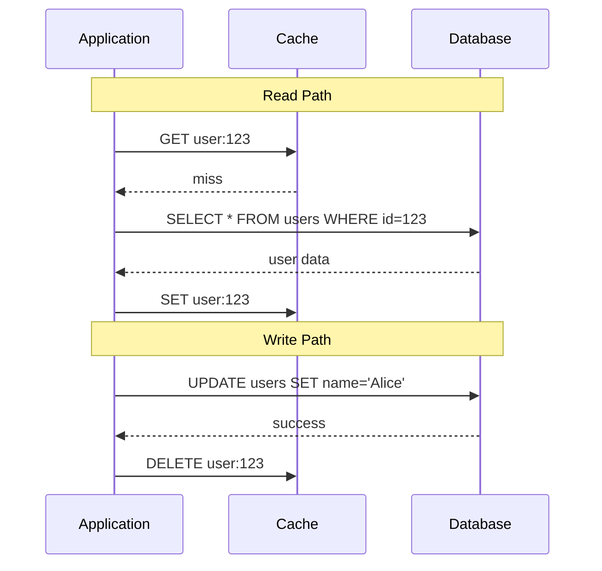
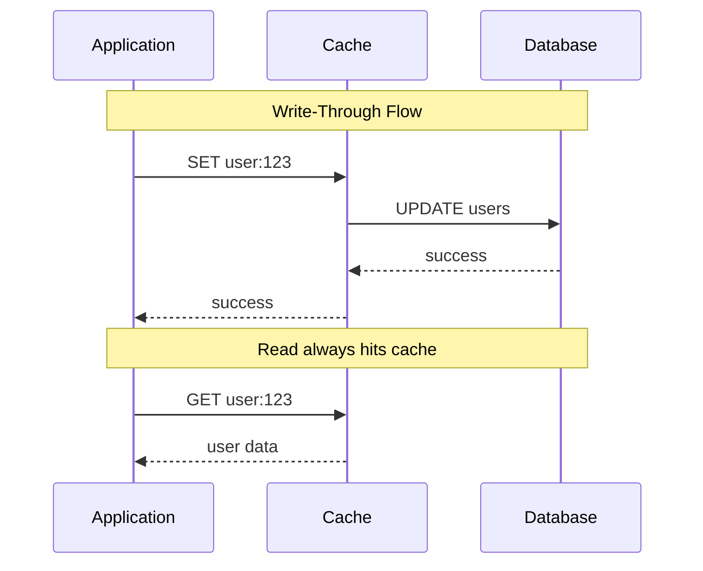
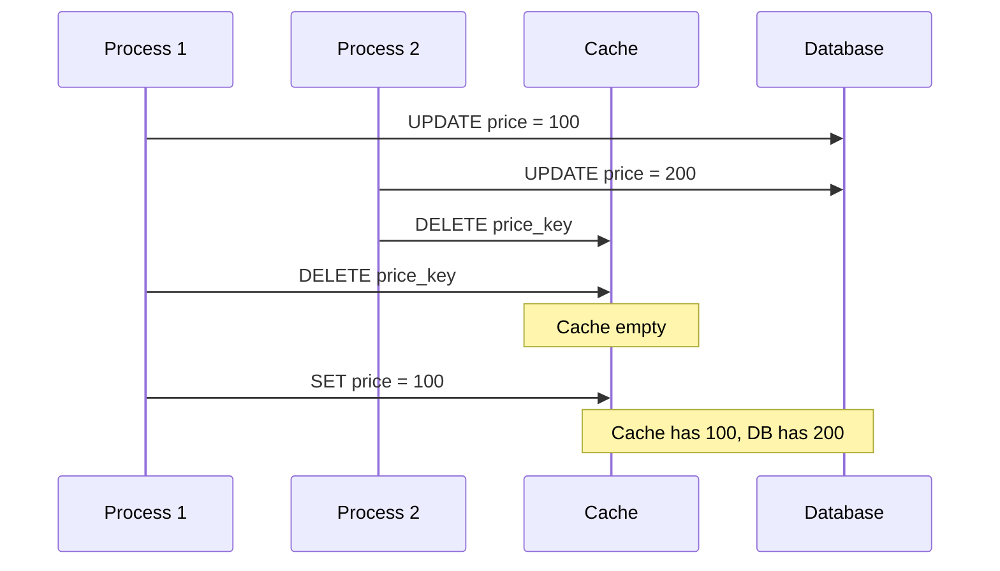

# How to Build Cache Consistency

Author: [nawazdhandala](https://github.com/nawazdhandala)

Tags: Caching, Consistency, Data Integrity, Architecture

Description: Learn to build cache consistency mechanisms for maintaining data integrity between cache and database.

---

Caches speed up applications by storing frequently accessed data closer to the application layer. But when the underlying data changes, the cache can serve stale values. Cache consistency ensures that reads from the cache reflect the true state of your data source.

This guide covers the strategies, patterns, and implementation details for building consistent caching systems that balance performance with correctness.

## The Consistency Problem

When you introduce a cache between your application and database, you create two sources of truth. Writes go to the database, but reads often come from the cache. If these two diverge, users see outdated or incorrect data.

Common symptoms of cache inconsistency include:

- Users see old profile information after updating
- Inventory counts show wrong numbers after purchases
- Configuration changes take unpredictably long to appear
- Race conditions cause data to flip between old and new values

## Consistency Strategies Overview

Four primary strategies exist for maintaining cache consistency. Each makes different trade-offs between complexity, latency, and consistency guarantees.

| Strategy | Consistency | Write Latency | Read Latency | Complexity |
|----------|-------------|---------------|--------------|------------|
| Cache-Aside | Eventual | Low | Variable | Low |
| Write-Through | Strong | Higher | Low | Medium |
| Write-Behind | Eventual | Low | Low | High |
| Read-Through | Eventual | Low | Variable | Medium |

## Cache-Aside Pattern

Cache-aside is the most common pattern. The application manages both the cache and database directly. On reads, it checks the cache first. On writes, it updates the database and invalidates the cache.



Here is a Python implementation of the cache-aside pattern with proper error handling.

```python
import json
from typing import Any, Optional
import redis
import psycopg2

class CacheAsideClient:
    def __init__(self, redis_url: str, db_config: dict):
        self.cache = redis.from_url(redis_url)
        self.db = psycopg2.connect(**db_config)
        self.default_ttl = 3600  # 1 hour

    def get_user(self, user_id: int) -> Optional[dict]:
        cache_key = f"user:{user_id}"

        # Try cache first
        cached = self.cache.get(cache_key)
        if cached:
            return json.loads(cached)

        # Cache miss: fetch from database
        cursor = self.db.cursor()
        cursor.execute(
            "SELECT id, name, email FROM users WHERE id = %s",
            (user_id,)
        )
        row = cursor.fetchone()

        if not row:
            return None

        user = {"id": row[0], "name": row[1], "email": row[2]}

        # Populate cache for future reads
        self.cache.setex(cache_key, self.default_ttl, json.dumps(user))

        return user

    def update_user(self, user_id: int, name: str, email: str) -> bool:
        cache_key = f"user:{user_id}"

        # Update database first
        cursor = self.db.cursor()
        cursor.execute(
            "UPDATE users SET name = %s, email = %s WHERE id = %s",
            (name, email, user_id)
        )
        self.db.commit()

        # Invalidate cache after successful write
        # Delete is safer than update to avoid race conditions
        self.cache.delete(cache_key)

        return True
```

## Write-Through Pattern

Write-through updates both the cache and database synchronously on every write. This provides stronger consistency but increases write latency since both operations must complete.



This implementation wraps writes to ensure atomicity between cache and database operations.

```python
from typing import Any
import redis
import psycopg2
from contextlib import contextmanager

class WriteThroughCache:
    def __init__(self, redis_url: str, db_config: dict):
        self.cache = redis.from_url(redis_url)
        self.db = psycopg2.connect(**db_config)

    @contextmanager
    def transaction(self):
        # Start database transaction
        cursor = self.db.cursor()
        try:
            yield cursor
            self.db.commit()
        except Exception:
            self.db.rollback()
            raise

    def write_user(self, user_id: int, data: dict) -> bool:
        cache_key = f"user:{user_id}"

        with self.transaction() as cursor:
            # Update database within transaction
            cursor.execute(
                "UPDATE users SET name = %s, email = %s WHERE id = %s",
                (data["name"], data["email"], user_id)
            )

            # Update cache only after DB write succeeds
            # If cache write fails, we catch and handle it
            try:
                self.cache.set(cache_key, json.dumps(data))
            except redis.RedisError:
                # Log the cache failure but don't fail the write
                # Next read will repopulate from database
                pass

        return True

    def read_user(self, user_id: int) -> dict:
        cache_key = f"user:{user_id}"

        # Cache should always have fresh data
        cached = self.cache.get(cache_key)
        if cached:
            return json.loads(cached)

        # Fallback to database if cache is cold
        cursor = self.db.cursor()
        cursor.execute(
            "SELECT id, name, email FROM users WHERE id = %s",
            (user_id,)
        )
        row = cursor.fetchone()

        if row:
            data = {"id": row[0], "name": row[1], "email": row[2]}
            self.cache.set(cache_key, json.dumps(data))
            return data

        return None
```

## Handling Race Conditions

The most subtle bugs in cache consistency come from race conditions. Consider what happens when two processes update the same key simultaneously.



This race condition leaves the cache with stale data. Two techniques help prevent this problem.

The first approach uses version numbers or timestamps to detect stale writes.

```python
import time
from typing import Optional, Tuple

class VersionedCache:
    def __init__(self, cache_client, db_client):
        self.cache = cache_client
        self.db = db_client

    def get_with_version(self, key: str) -> Tuple[Optional[dict], int]:
        # Fetch both value and version from cache
        data = self.cache.hgetall(f"versioned:{key}")
        if data:
            return json.loads(data[b"value"]), int(data[b"version"])
        return None, 0

    def set_if_newer(self, key: str, value: dict, version: int) -> bool:
        cache_key = f"versioned:{key}"

        # Use Lua script for atomic compare-and-set
        lua_script = """
        local current_version = redis.call('HGET', KEYS[1], 'version')
        if current_version == false or tonumber(current_version) < tonumber(ARGV[1]) then
            redis.call('HSET', KEYS[1], 'value', ARGV[2], 'version', ARGV[1])
            return 1
        end
        return 0
        """

        result = self.cache.eval(
            lua_script, 1, cache_key, version, json.dumps(value)
        )
        return result == 1

    def update_with_version(self, key: str, value: dict) -> bool:
        # Generate version from timestamp
        version = int(time.time() * 1000000)

        # Update database with version
        self.db.execute(
            "UPDATE items SET data = %s, version = %s WHERE key = %s",
            (json.dumps(value), version, key)
        )

        # Update cache only if our version is newer
        return self.set_if_newer(key, value, version)
```

The second approach uses distributed locks to serialize updates.

```python
import uuid
from contextlib import contextmanager

class DistributedLock:
    def __init__(self, cache_client):
        self.cache = cache_client
        self.lock_timeout = 10  # seconds

    @contextmanager
    def acquire(self, resource: str):
        lock_key = f"lock:{resource}"
        lock_value = str(uuid.uuid4())

        # Try to acquire lock with NX (only if not exists)
        acquired = self.cache.set(
            lock_key, lock_value,
            nx=True, ex=self.lock_timeout
        )

        if not acquired:
            raise Exception(f"Could not acquire lock for {resource}")

        try:
            yield
        finally:
            # Release lock only if we still own it
            lua_script = """
            if redis.call('GET', KEYS[1]) == ARGV[1] then
                return redis.call('DEL', KEYS[1])
            end
            return 0
            """
            self.cache.eval(lua_script, 1, lock_key, lock_value)


class LockedCacheWriter:
    def __init__(self, cache, db, lock):
        self.cache = cache
        self.db = db
        self.lock = lock

    def safe_update(self, key: str, value: dict) -> bool:
        with self.lock.acquire(key):
            # All updates to this key are serialized
            self.db.execute(
                "UPDATE items SET data = %s WHERE key = %s",
                (json.dumps(value), key)
            )
            self.cache.set(f"item:{key}", json.dumps(value))
        return True
```

## Choosing the Right TTL

Time-to-live settings determine how long stale data can persist. Shorter TTLs improve consistency but increase database load. Longer TTLs improve performance but increase staleness.

| Data Type | Recommended TTL | Reasoning |
|-----------|-----------------|-----------|
| User sessions | 15-30 minutes | Security and activity tracking |
| Product catalog | 1-6 hours | Changes infrequently |
| User profiles | 5-15 minutes | Balance freshness and load |
| Configuration | 1-5 minutes | Changes need fast propagation |
| Analytics data | 1-24 hours | Eventual consistency acceptable |

## Monitoring Cache Consistency

You cannot fix what you cannot measure. Track these metrics to detect consistency issues.

```python
from dataclasses import dataclass
from typing import Dict
import time

@dataclass
class ConsistencyMetrics:
    cache_hits: int = 0
    cache_misses: int = 0
    stale_reads: int = 0
    write_conflicts: int = 0
    invalidation_latency_ms: float = 0

class InstrumentedCache:
    def __init__(self, cache, db):
        self.cache = cache
        self.db = db
        self.metrics = ConsistencyMetrics()

    def get(self, key: str) -> dict:
        cached = self.cache.get(key)

        if cached:
            self.metrics.cache_hits += 1
            cached_data = json.loads(cached)

            # Periodically verify consistency
            if self.metrics.cache_hits % 100 == 0:
                db_data = self._fetch_from_db(key)
                if db_data and db_data != cached_data:
                    self.metrics.stale_reads += 1

            return cached_data

        self.metrics.cache_misses += 1
        return self._fetch_from_db(key)

    def invalidate(self, key: str):
        start = time.time()
        self.cache.delete(key)
        elapsed = (time.time() - start) * 1000

        # Track invalidation latency
        self.metrics.invalidation_latency_ms = (
            self.metrics.invalidation_latency_ms * 0.9 + elapsed * 0.1
        )

    def get_metrics(self) -> Dict[str, float]:
        total = self.metrics.cache_hits + self.metrics.cache_misses
        hit_rate = self.metrics.cache_hits / total if total > 0 else 0

        return {
            "hit_rate": hit_rate,
            "stale_read_rate": self.metrics.stale_reads / total if total > 0 else 0,
            "invalidation_latency_ms": self.metrics.invalidation_latency_ms
        }
```

## Conclusion

Cache consistency requires deliberate design choices. Start with cache-aside for simplicity, then add version tracking or distributed locks when you encounter race conditions. Set TTLs based on your tolerance for staleness, and monitor consistency metrics to catch issues before users notice.

The patterns in this guide provide a foundation for building caching systems that maintain data integrity while delivering the performance benefits that caches are meant to provide.
