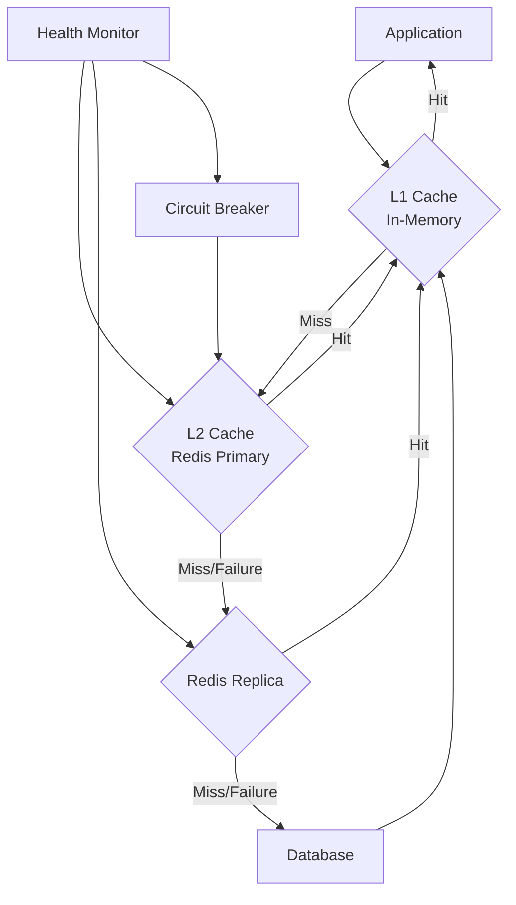
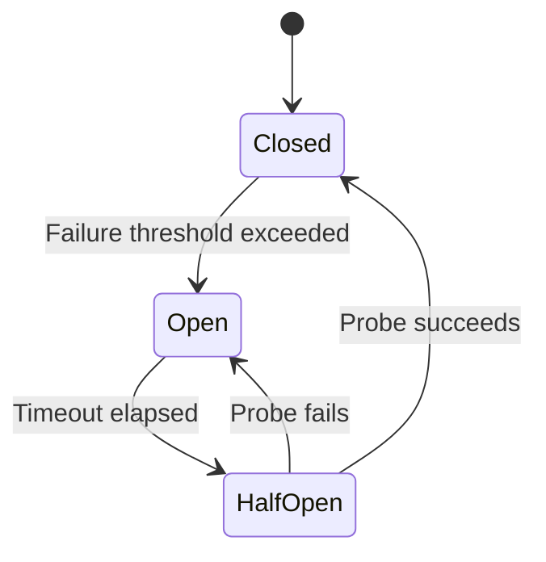
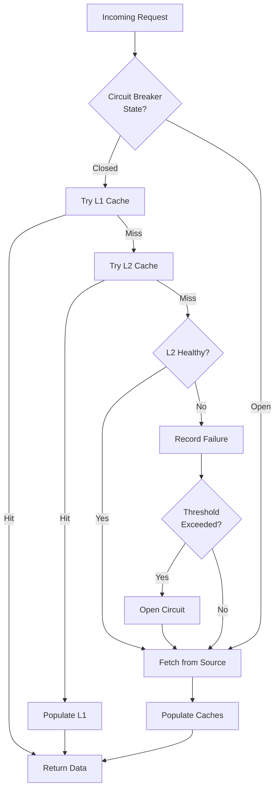

# How to Implement Cache Failover

Author: [nawazdhandala](https://github.com/nawazdhandala)

Tags: Caching, Failover, Resilience, High Availability

Description: Learn to implement cache failover strategies for graceful degradation during cache failures.

---

A cache failure should not bring down your entire application. Yet many production systems treat cache outages as catastrophic events because they lack proper failover strategies. This guide walks through practical patterns for building resilient caching layers that degrade gracefully when things go wrong.

## Why Cache Failover Matters

Caching sits between your application and expensive operations like database queries, API calls, or complex computations. When the cache becomes unavailable, every request suddenly hits the backend at full force. This thundering herd effect can cascade into complete system failure.

A well-designed cache failover strategy ensures your application continues serving requests, even if response times increase temporarily.

## Cache Failover Patterns

| Pattern | Use Case | Recovery Time | Complexity |
| --- | --- | --- | --- |
| **Fallback to Source** | Simple applications with fast backends | Immediate | Low |
| **Multi-tier Caching** | Read-heavy workloads needing low latency | Sub-second | Medium |
| **Cache Replication** | Mission-critical data requiring zero downtime | Zero | High |
| **Circuit Breaker** | Protecting backends from thundering herd | Configurable | Medium |
| **Local + Remote** | Distributed systems with variable latency | Sub-second | Medium |

## Architecture Overview

The following diagram shows a typical multi-tier cache failover setup where requests flow through multiple cache layers before reaching the database.



## Implementing Fallback to Source

The simplest failover pattern catches cache errors and falls back directly to the data source. This approach works well when your backend can handle the additional load during cache outages.

The following TypeScript implementation wraps cache operations in try-catch blocks and logs failures for monitoring.

```typescript
import Redis from 'ioredis';

class CacheWithFallback {
  private redis: Redis;
  private fallbackEnabled: boolean = true;

  constructor(redisUrl: string) {
    this.redis = new Redis(redisUrl);

    // Track connection state for metrics
    this.redis.on('error', (err) => {
      console.error('Redis connection error:', err.message);
    });
  }

  // Attempt cache read, fall back to source function on failure
  async getOrFetch<T>(
    key: string,
    fetchFn: () => Promise<T>,
    ttlSeconds: number = 300
  ): Promise<T> {
    try {
      const cached = await this.redis.get(key);
      if (cached !== null) {
        return JSON.parse(cached) as T;
      }
    } catch (error) {
      // Log cache miss due to error, continue to fetch
      console.warn(`Cache read failed for key ${key}:`, error);
    }

    // Fetch from source
    const data = await fetchFn();

    // Attempt to populate cache, but do not block on failure
    this.setAsync(key, data, ttlSeconds);

    return data;
  }

  // Fire-and-forget cache write with error handling
  private async setAsync<T>(
    key: string,
    data: T,
    ttlSeconds: number
  ): Promise<void> {
    try {
      await this.redis.setex(key, ttlSeconds, JSON.stringify(data));
    } catch (error) {
      console.warn(`Cache write failed for key ${key}:`, error);
    }
  }
}
```

## Adding a Circuit Breaker

When cache failures become frequent, repeatedly attempting connections wastes resources and adds latency. A circuit breaker tracks failure rates and temporarily stops cache attempts when the error threshold is exceeded.

The state machine below shows how the circuit breaker transitions between states based on success and failure counts.



This Python implementation provides a reusable circuit breaker decorator that wraps any cache operation.

```python
import time
from enum import Enum
from functools import wraps
from typing import Callable, TypeVar, Any

T = TypeVar('T')

class CircuitState(Enum):
    CLOSED = "closed"      # Normal operation
    OPEN = "open"          # Failing, skip cache
    HALF_OPEN = "half_open"  # Testing recovery

class CircuitBreaker:
    def __init__(
        self,
        failure_threshold: int = 5,
        recovery_timeout: int = 30,
        half_open_max_calls: int = 3
    ):
        self.failure_threshold = failure_threshold
        self.recovery_timeout = recovery_timeout
        self.half_open_max_calls = half_open_max_calls

        self.state = CircuitState.CLOSED
        self.failure_count = 0
        self.last_failure_time: float = 0
        self.half_open_calls = 0

    def call(self, func: Callable[[], T], fallback: Callable[[], T]) -> T:
        # Check if circuit should transition from open to half-open
        if self.state == CircuitState.OPEN:
            if time.time() - self.last_failure_time > self.recovery_timeout:
                self.state = CircuitState.HALF_OPEN
                self.half_open_calls = 0
            else:
                # Circuit is open, skip directly to fallback
                return fallback()

        try:
            result = func()
            self._on_success()
            return result
        except Exception as e:
            self._on_failure()
            return fallback()

    def _on_success(self) -> None:
        if self.state == CircuitState.HALF_OPEN:
            self.half_open_calls += 1
            if self.half_open_calls >= self.half_open_max_calls:
                # Enough successful probes, close circuit
                self.state = CircuitState.CLOSED
                self.failure_count = 0

    def _on_failure(self) -> None:
        self.failure_count += 1
        self.last_failure_time = time.time()

        if self.state == CircuitState.HALF_OPEN:
            # Probe failed, reopen circuit
            self.state = CircuitState.OPEN
        elif self.failure_count >= self.failure_threshold:
            # Threshold exceeded, open circuit
            self.state = CircuitState.OPEN
```

## Multi-tier Cache with Automatic Failover

For high-traffic applications, combining local in-memory caching with distributed caching provides both speed and resilience. When the remote cache fails, the local cache continues serving requests while the system recovers.

The following implementation layers a local LRU cache in front of Redis, with automatic failover between cache tiers.

```typescript
import Redis from 'ioredis';
import { LRUCache } from 'lru-cache';

interface CacheConfig {
  localMaxSize: number;
  localTtlMs: number;
  remoteTtlSeconds: number;
  remoteUrls: string[];
}

class MultiTierCache {
  private localCache: LRUCache<string, string>;
  private remoteCaches: Redis[];
  private activeRemoteIndex: number = 0;

  constructor(config: CacheConfig) {
    // L1: In-process LRU cache
    this.localCache = new LRUCache({
      max: config.localMaxSize,
      ttl: config.localTtlMs,
    });

    // L2: Multiple Redis instances for failover
    this.remoteCaches = config.remoteUrls.map(url => {
      const client = new Redis(url);
      client.on('error', () => {
        // Errors handled in get/set methods
      });
      return client;
    });
  }

  async get<T>(key: string): Promise<T | null> {
    // Try L1 local cache first
    const localValue = this.localCache.get(key);
    if (localValue !== undefined) {
      return JSON.parse(localValue) as T;
    }

    // Try L2 remote caches with failover
    for (let i = 0; i < this.remoteCaches.length; i++) {
      const index = (this.activeRemoteIndex + i) % this.remoteCaches.length;
      try {
        const value = await this.remoteCaches[index].get(key);
        if (value !== null) {
          // Populate L1 cache on remote hit
          this.localCache.set(key, value);
          return JSON.parse(value) as T;
        }
      } catch (error) {
        // Switch to next remote cache
        this.activeRemoteIndex = (index + 1) % this.remoteCaches.length;
        console.warn(`Remote cache ${index} failed, trying next`);
      }
    }

    return null;
  }

  async set<T>(key: string, value: T, ttlSeconds: number): Promise<void> {
    const serialized = JSON.stringify(value);

    // Always update L1
    this.localCache.set(key, serialized);

    // Update L2 with best-effort writes to all replicas
    const writePromises = this.remoteCaches.map(async (cache, index) => {
      try {
        await cache.setex(key, ttlSeconds, serialized);
      } catch (error) {
        console.warn(`Failed to write to remote cache ${index}`);
      }
    });

    // Wait for at least one write to succeed
    await Promise.race(writePromises);
  }
}
```

## Monitoring Cache Health

Failover strategies only work when you know your cache is failing. Instrument your cache layer with metrics that reveal problems before they cascade.

Key metrics to track include hit rate, latency percentiles, connection pool utilization, and circuit breaker state changes. The table below lists essential metrics and their warning thresholds.

| Metric | Warning Threshold | Critical Threshold |
| --- | --- | --- |
| Cache Hit Rate | Below 80% | Below 50% |
| P99 Read Latency | Above 50ms | Above 200ms |
| Connection Errors/min | Above 5 | Above 20 |
| Circuit Breaker Opens | Any occurrence | Sustained open state |
| Memory Usage | Above 80% | Above 95% |

## Graceful Degradation Flow

The complete request flow with cache failover should handle each failure mode explicitly. This diagram shows the decision tree for a request with full failover support.



## Testing Your Failover

Failover code that is never tested will fail when you need it most. Build chaos engineering practices into your deployment pipeline.

Start by simulating network partitions between your application and cache servers. Use tools like `tc` on Linux to add latency or packet loss. Verify that your circuit breaker triggers at the expected thresholds and that the application continues serving requests during the outage.

Test cache recovery as well. After a failover event, ensure that cache connections are restored and that the cache warms up without overwhelming your backend. Consider implementing gradual traffic shifting back to the recovered cache rather than immediate full cutover.

## Key Takeaways

Build your cache layer with the assumption that it will fail. Implement multiple tiers of caching so that local caches can absorb load during remote cache outages. Use circuit breakers to prevent cascading failures and protect your backend services. Monitor cache health metrics and alert on degradation before it becomes an outage.

The best cache failover strategy is one you have tested under realistic failure conditions. Run chaos experiments regularly and treat cache resilience as a first-class concern in your architecture.
