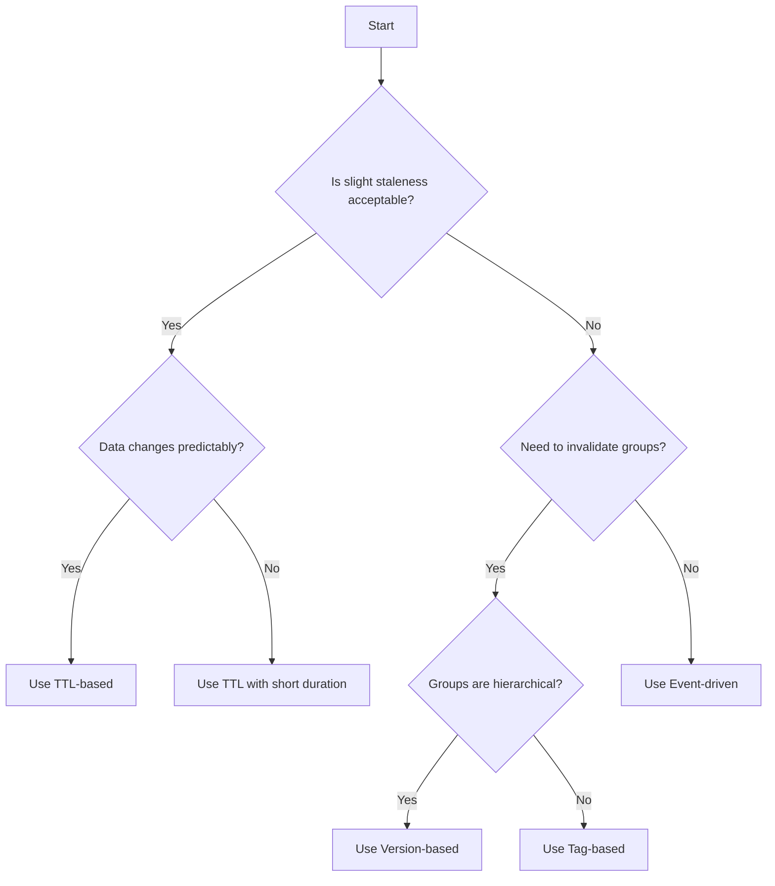

# How to Build Cache Invalidation Strategies

Author: [nawazdhandala](https://www.github.com/nawazdhandala)

Tags: Caching, Cache Invalidation, Performance, Architecture, Distributed Systems

Description: Master cache invalidation strategies including TTL-based, event-driven, version-based, and tag-based invalidation for data consistency.

---

There are only two hard things in Computer Science: cache invalidation and naming things. While I cannot help you with naming variables, this guide will walk you through practical cache invalidation strategies that work in production systems.

## Why Cache Invalidation Matters

Caching improves performance by storing frequently accessed data closer to the application. But cached data becomes stale when the source changes. Without proper invalidation, users see outdated information, leading to confusion and potential data integrity issues.

The challenge is striking the right balance: invalidate too aggressively and you lose caching benefits; invalidate too conservatively and you serve stale data.

## Strategy 1: Time-To-Live (TTL) Based Invalidation

TTL is the simplest approach. Each cached item has an expiration time, after which it is automatically removed or refreshed.

Here is a basic TTL implementation in Python with Redis:

```python
import redis
import json
from datetime import timedelta

# Initialize Redis client
cache = redis.Redis(host='localhost', port=6379, db=0)

def get_user_profile(user_id: str) -> dict:
    """
    Fetch user profile with TTL-based caching.
    Cache expires after 5 minutes to ensure reasonably fresh data.
    """
    cache_key = f"user:profile:{user_id}"

    # Try to get from cache first
    cached_data = cache.get(cache_key)
    if cached_data:
        return json.loads(cached_data)

    # Cache miss - fetch from database
    profile = fetch_from_database(user_id)

    # Store in cache with 5-minute TTL
    cache.setex(
        cache_key,
        timedelta(minutes=5),
        json.dumps(profile)
    )

    return profile
```

TTL works well for data that changes predictably or where slight staleness is acceptable. Product catalogs, user preferences, and configuration settings are good candidates.

## Strategy 2: Event-Driven Invalidation

When data consistency is critical, invalidate the cache immediately when the source data changes. This approach uses events or callbacks to trigger invalidation.

```python
import redis
from functools import wraps

cache = redis.Redis(host='localhost', port=6379, db=0)

def invalidate_cache(*patterns):
    """
    Decorator that invalidates cache entries matching the given patterns
    after the wrapped function executes successfully.
    """
    def decorator(func):
        @wraps(func)
        def wrapper(*args, **kwargs):
            result = func(*args, **kwargs)

            # Invalidate all matching cache keys after successful update
            for pattern in patterns:
                # Build the actual key from the pattern and function arguments
                cache_key = pattern.format(*args, **kwargs)
                cache.delete(cache_key)

            return result
        return wrapper
    return decorator


@invalidate_cache("user:profile:{user_id}", "user:summary:{user_id}")
def update_user_profile(user_id: str, new_data: dict) -> dict:
    """
    Update user profile in database and invalidate related caches.
    The decorator ensures cache consistency after the update.
    """
    # Perform the database update
    updated_profile = save_to_database(user_id, new_data)
    return updated_profile
```

This pattern ensures immediate consistency but requires careful tracking of all cache keys affected by each data change.

## Strategy 3: Version-Based Invalidation

Version-based invalidation embeds a version number in the cache key. When data changes, increment the version to effectively invalidate all old entries.

```python
import redis
import json

cache = redis.Redis(host='localhost', port=6379, db=0)

class VersionedCache:
    """
    Cache implementation that uses version numbers for invalidation.
    Old versions are not explicitly deleted - they expire naturally via TTL.
    """

    def __init__(self, namespace: str):
        self.namespace = namespace
        self.version_key = f"{namespace}:version"

    def _get_version(self) -> int:
        """Get current version, initializing to 1 if not set."""
        version = cache.get(self.version_key)
        return int(version) if version else 1

    def _build_key(self, key: str) -> str:
        """Build versioned cache key."""
        version = self._get_version()
        return f"{self.namespace}:v{version}:{key}"

    def get(self, key: str) -> dict | None:
        """Retrieve item from cache using current version."""
        versioned_key = self._build_key(key)
        data = cache.get(versioned_key)
        return json.loads(data) if data else None

    def set(self, key: str, value: dict, ttl_seconds: int = 3600):
        """Store item in cache with current version."""
        versioned_key = self._build_key(key)
        cache.setex(versioned_key, ttl_seconds, json.dumps(value))

    def invalidate_all(self):
        """
        Invalidate all cached items by incrementing the version.
        Old entries remain but become inaccessible with the new version.
        """
        cache.incr(self.version_key)


# Usage example
product_cache = VersionedCache("products")

# After a bulk product import, invalidate everything
def bulk_import_products(products: list):
    save_products_to_database(products)
    product_cache.invalidate_all()  # Simple one-liner invalidates all
```

Version-based invalidation excels when you need to invalidate large groups of related items at once, such as after bulk imports or schema changes.

## Strategy 4: Tag-Based Invalidation

Tag-based invalidation associates cache entries with one or more tags. Invalidating a tag removes all entries with that tag.

```python
import redis
import json
from typing import Set

cache = redis.Redis(host='localhost', port=6379, db=0)

class TaggedCache:
    """
    Cache that supports tag-based invalidation.
    Each entry can have multiple tags for flexible invalidation.
    """

    def set(self, key: str, value: dict, tags: Set[str], ttl: int = 3600):
        """
        Store a value with associated tags.
        Tags allow invalidating related entries together.
        """
        # Store the actual data
        cache.setex(f"data:{key}", ttl, json.dumps(value))

        # Associate the key with each tag
        for tag in tags:
            cache.sadd(f"tag:{tag}", key)
            cache.expire(f"tag:{tag}", ttl)

    def get(self, key: str) -> dict | None:
        """Retrieve cached value by key."""
        data = cache.get(f"data:{key}")
        return json.loads(data) if data else None

    def invalidate_by_tag(self, tag: str):
        """
        Remove all cache entries associated with a tag.
        Useful for invalidating related data across different entities.
        """
        tag_key = f"tag:{tag}"
        keys = cache.smembers(tag_key)

        if keys:
            # Delete all data entries for this tag
            data_keys = [f"data:{k.decode()}" for k in keys]
            cache.delete(*data_keys)

        # Clean up the tag set
        cache.delete(tag_key)


# Usage: caching product data with category tags
tagged_cache = TaggedCache()

def cache_product(product: dict):
    """Cache a product with tags for category and brand."""
    tags = {
        f"category:{product['category_id']}",
        f"brand:{product['brand_id']}",
        "products"  # Global tag for all products
    }
    tagged_cache.set(f"product:{product['id']}", product, tags)

def on_category_update(category_id: str):
    """When a category changes, invalidate all products in that category."""
    tagged_cache.invalidate_by_tag(f"category:{category_id}")
```

## Choosing the Right Strategy

The following diagram shows how to select an invalidation strategy based on your requirements:



## Combining Strategies

Production systems often combine multiple strategies. Here is a hybrid approach:

```python
class HybridCache:
    """
    Combines TTL, versioning, and event-driven invalidation.
    Provides multiple layers of cache freshness control.
    """

    def __init__(self, namespace: str, default_ttl: int = 300):
        self.namespace = namespace
        self.default_ttl = default_ttl
        self.version_key = f"{namespace}:version"

    def _build_key(self, key: str) -> str:
        version = cache.get(self.version_key) or b'1'
        return f"{self.namespace}:v{version.decode()}:{key}"

    def get(self, key: str) -> dict | None:
        """Get with versioned key - old versions automatically miss."""
        data = cache.get(self._build_key(key))
        return json.loads(data) if data else None

    def set(self, key: str, value: dict, ttl: int = None):
        """Set with TTL for automatic expiration."""
        cache.setex(
            self._build_key(key),
            ttl or self.default_ttl,
            json.dumps(value)
        )

    def invalidate(self, key: str):
        """Explicit invalidation for immediate consistency."""
        cache.delete(self._build_key(key))

    def invalidate_all(self):
        """Version bump for bulk invalidation."""
        cache.incr(self.version_key)
```

## Best Practices

**Start with TTL**: Even if you implement other strategies, always set a TTL as a safety net. This prevents zombie cache entries from persisting indefinitely if your invalidation logic has bugs.

**Log invalidation events**: When debugging cache issues, knowing what was invalidated and when is invaluable. Include the cache key, trigger reason, and timestamp.

**Monitor cache hit rates**: A sudden drop in hit rate often indicates invalidation happening too frequently. Track this metric alongside your application performance.

**Test invalidation paths**: Cache invalidation bugs are notoriously hard to catch in development. Write integration tests that verify data consistency after updates.

**Consider thundering herd**: When a popular cache entry expires, many requests may hit the database simultaneously. Use techniques like cache stampede protection or staggered TTLs.

## Wrapping Up

Cache invalidation does not have to be mysterious. By understanding these four strategies and when to apply them, you can build caching systems that are both performant and consistent.

Start simple with TTL-based invalidation, add event-driven invalidation for critical data paths, and reach for version or tag-based approaches when you need to invalidate groups of related data. Most importantly, combine strategies thoughtfully to match your specific consistency and performance requirements.
