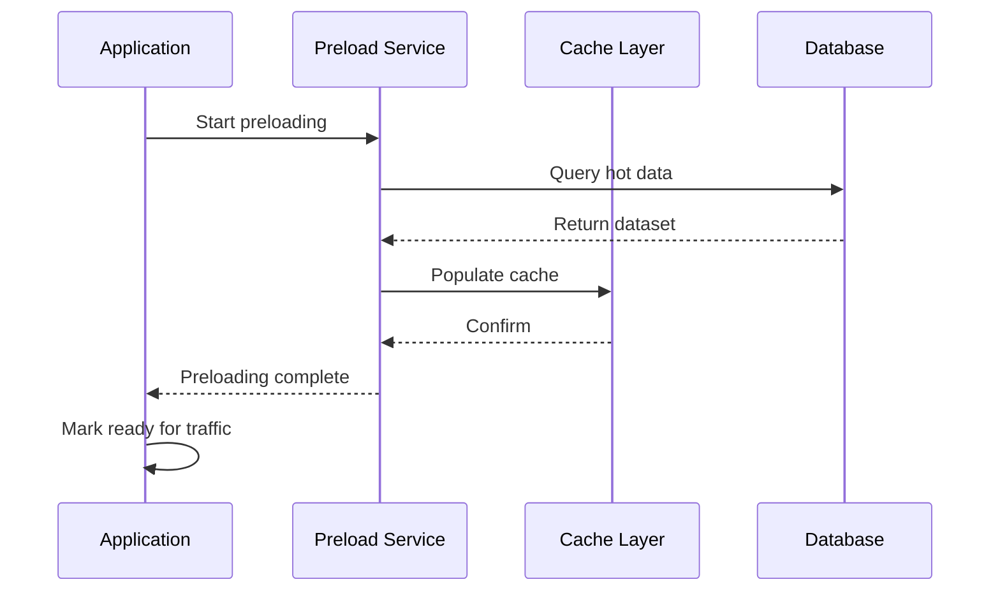
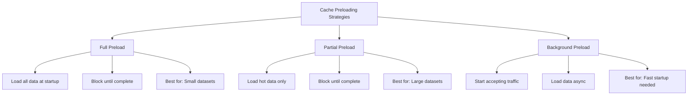
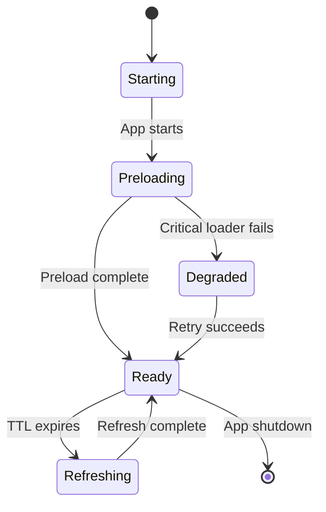

# How to Create Cache Preloading

Author: [nawazdhandala](https://github.com/nawazdhandala)

Tags: Caching, Preloading, Startup, Performance

Description: Learn to create cache preloading strategies for faster application startup and response times.

---

Cache preloading fills your cache with data before users request it. Instead of waiting for the first request to trigger a cache miss (and the associated latency penalty), preloading ensures hot data is ready from the start. This technique is particularly valuable for applications with predictable access patterns, high traffic volumes, or strict latency requirements.

## Why Cache Preloading Matters

Cold cache problems show up in several scenarios:

| Scenario | Impact | Preloading Benefit |
|----------|--------|-------------------|
| Application restart | First requests hit the database | Requests served from cache immediately |
| Cache eviction | Popular data suddenly slow | Hot data stays warm |
| New deployment | All instances start cold | Consistent response times |
| Scheduled maintenance | Post-maintenance slowdown | Faster recovery |

The goal is simple: eliminate the latency spike that occurs when your cache is empty.

## Cache Preloading Architecture

The following diagram shows how cache preloading fits into a typical application startup sequence.



## Basic Preloading Implementation

Here is a straightforward cache preloader in Node.js that loads data from a database into Redis before the application starts accepting traffic.

```javascript
// preloader.js
const Redis = require('ioredis');
const { Pool } = require('pg');

class CachePreloader {
  constructor(redis, db) {
    this.redis = redis;
    this.db = db;
    this.loaders = [];
  }

  // Register a data loader with its cache configuration
  register(name, queryFn, options = {}) {
    this.loaders.push({
      name,
      queryFn,
      keyPrefix: options.keyPrefix || name,
      ttl: options.ttl || 3600, // Default 1 hour
      keyField: options.keyField || 'id',
    });
  }

  // Run all registered loaders
  async preload() {
    console.log('Starting cache preload...');
    const results = { success: [], failed: [] };

    for (const loader of this.loaders) {
      try {
        const count = await this.runLoader(loader);
        results.success.push({ name: loader.name, count });
        console.log(`Loaded ${count} items for ${loader.name}`);
      } catch (error) {
        results.failed.push({ name: loader.name, error: error.message });
        console.error(`Failed to preload ${loader.name}:`, error.message);
      }
    }

    return results;
  }

  // Execute a single loader
  async runLoader(loader) {
    const data = await loader.queryFn();
    const pipeline = this.redis.pipeline();

    for (const item of data) {
      const key = `${loader.keyPrefix}:${item[loader.keyField]}`;
      pipeline.setex(key, loader.ttl, JSON.stringify(item));
    }

    await pipeline.exec();
    return data.length;
  }
}

module.exports = { CachePreloader };
```

## Registering Data Loaders

With the preloader class in place, you register specific data sources that should be cached at startup. Each loader defines what data to fetch and how to cache it.

```javascript
// setup-preload.js
const { CachePreloader } = require('./preloader');
const Redis = require('ioredis');
const { Pool } = require('pg');

const redis = new Redis(process.env.REDIS_URL);
const db = new Pool({ connectionString: process.env.DATABASE_URL });

const preloader = new CachePreloader(redis, db);

// Preload product catalog (accessed frequently)
preloader.register('products', async () => {
  const result = await db.query(`
    SELECT id, name, price, category, inventory_count
    FROM products
    WHERE active = true
  `);
  return result.rows;
}, { keyPrefix: 'product', ttl: 1800 });

// Preload configuration settings
preloader.register('config', async () => {
  const result = await db.query(`
    SELECT key, value, updated_at
    FROM system_config
  `);
  return result.rows;
}, { keyPrefix: 'config', keyField: 'key', ttl: 7200 });

// Preload user sessions from the last 24 hours
preloader.register('recent-sessions', async () => {
  const result = await db.query(`
    SELECT user_id, session_data, expires_at
    FROM sessions
    WHERE expires_at > NOW()
    AND last_activity > NOW() - INTERVAL '24 hours'
  `);
  return result.rows;
}, { keyPrefix: 'session', keyField: 'user_id', ttl: 3600 });

module.exports = { preloader, redis, db };
```

## Integrating with Application Startup

The preloader should run before your application starts accepting requests. This integration ensures that the cache is warm when the first user request arrives.

```javascript
// server.js
const express = require('express');
const { preloader, redis, db } = require('./setup-preload');

const app = express();
let isReady = false;

// Readiness endpoint for Kubernetes
app.get('/health/ready', (req, res) => {
  if (isReady) {
    res.status(200).json({ status: 'ready' });
  } else {
    res.status(503).json({ status: 'warming cache' });
  }
});

// Start the application
async function start() {
  try {
    // Run cache preloading before accepting traffic
    const preloadResults = await preloader.preload();

    console.log('Preload results:', preloadResults);

    // Only mark ready if critical loaders succeeded
    const criticalLoaders = ['products', 'config'];
    const criticalFailures = preloadResults.failed
      .filter(f => criticalLoaders.includes(f.name));

    if (criticalFailures.length > 0) {
      console.error('Critical preload failures:', criticalFailures);
      process.exit(1);
    }

    isReady = true;

    app.listen(3000, () => {
      console.log('Server ready on port 3000');
    });
  } catch (error) {
    console.error('Startup failed:', error);
    process.exit(1);
  }
}

start();
```

## Preloading Strategies

Different applications need different preloading approaches. The following diagram illustrates the three main strategies.



| Strategy | Startup Time | Cache Coverage | Use When |
|----------|--------------|----------------|----------|
| Full Preload | Slow | 100% | Dataset fits in memory, consistent latency required |
| Partial Preload | Medium | Top N items | Large dataset, known access patterns |
| Background Preload | Fast | Gradual | Startup time is critical, some cold hits acceptable |

## Implementing Partial Preloading

When your dataset is too large to preload entirely, focus on the most frequently accessed items. This approach balances startup time with cache hit rates.

```javascript
// partial-preloader.js
class PartialPreloader {
  constructor(redis, db, options = {}) {
    this.redis = redis;
    this.db = db;
    this.topN = options.topN || 1000;
    this.accessTracker = options.accessTracker;
  }

  // Preload items based on access frequency
  async preloadByFrequency(tableName, options = {}) {
    const { keyPrefix, ttl = 3600 } = options;

    // Get top accessed items from analytics
    const hotKeys = await this.accessTracker.getTopKeys(keyPrefix, this.topN);

    if (hotKeys.length === 0) {
      console.log(`No access data for ${keyPrefix}, using default query`);
      return this.preloadDefault(tableName, options);
    }

    // Extract IDs from cache keys
    const ids = hotKeys.map(key => key.split(':').pop());

    // Fetch only the hot items
    const result = await this.db.query(`
      SELECT * FROM ${tableName}
      WHERE id = ANY($1)
    `, [ids]);

    // Cache the results
    const pipeline = this.redis.pipeline();
    for (const row of result.rows) {
      const key = `${keyPrefix}:${row.id}`;
      pipeline.setex(key, ttl, JSON.stringify(row));
    }
    await pipeline.exec();

    return result.rows.length;
  }

  // Default preload when no access data exists
  async preloadDefault(tableName, options) {
    const { keyPrefix, ttl = 3600, orderBy = 'updated_at DESC' } = options;

    const result = await this.db.query(`
      SELECT * FROM ${tableName}
      ORDER BY ${orderBy}
      LIMIT $1
    `, [this.topN]);

    const pipeline = this.redis.pipeline();
    for (const row of result.rows) {
      const key = `${keyPrefix}:${row.id}`;
      pipeline.setex(key, ttl, JSON.stringify(row));
    }
    await pipeline.exec();

    return result.rows.length;
  }
}

module.exports = { PartialPreloader };
```

## Background Preloading

For applications where startup time is critical, background preloading allows the server to accept traffic while the cache warms up in the background.

```javascript
// background-preloader.js
class BackgroundPreloader {
  constructor(redis, db) {
    this.redis = redis;
    this.db = db;
    this.isComplete = false;
    this.progress = { loaded: 0, total: 0 };
  }

  // Start preloading in the background
  startAsync(loaders) {
    this.progress.total = loaders.length;

    // Run preloading without blocking
    this.runInBackground(loaders).catch(err => {
      console.error('Background preload error:', err);
    });
  }

  async runInBackground(loaders) {
    for (const loader of loaders) {
      try {
        await this.executeLoader(loader);
        this.progress.loaded++;
        console.log(`Background preload: ${this.progress.loaded}/${this.progress.total}`);
      } catch (error) {
        console.error(`Background preload failed for ${loader.name}:`, error.message);
      }
    }

    this.isComplete = true;
    console.log('Background preloading complete');
  }

  async executeLoader(loader) {
    const batchSize = 500;
    let offset = 0;
    let hasMore = true;

    while (hasMore) {
      const batch = await loader.queryFn(batchSize, offset);

      if (batch.length === 0) {
        hasMore = false;
        continue;
      }

      const pipeline = this.redis.pipeline();
      for (const item of batch) {
        const key = `${loader.keyPrefix}:${item[loader.keyField]}`;
        pipeline.setex(key, loader.ttl, JSON.stringify(item));
      }
      await pipeline.exec();

      offset += batchSize;
      hasMore = batch.length === batchSize;

      // Yield to event loop periodically
      await new Promise(resolve => setImmediate(resolve));
    }
  }

  getStatus() {
    return {
      complete: this.isComplete,
      progress: this.progress,
    };
  }
}

module.exports = { BackgroundPreloader };
```

## Cache Preloading Lifecycle

The complete lifecycle of cache preloading includes initialization, maintenance, and refresh. This diagram shows how these phases interact.



## Scheduled Cache Refresh

Preloading at startup is not enough. You also need to refresh the cache periodically to prevent stale data and TTL-based evictions from causing cold cache problems.

```javascript
// cache-refresher.js
class CacheRefresher {
  constructor(preloader, options = {}) {
    this.preloader = preloader;
    this.refreshInterval = options.refreshInterval || 15 * 60 * 1000; // 15 minutes
    this.timer = null;
  }

  start() {
    // Initial refresh after the interval
    this.timer = setInterval(() => {
      this.refresh();
    }, this.refreshInterval);

    console.log(`Cache refresh scheduled every ${this.refreshInterval / 1000}s`);
  }

  stop() {
    if (this.timer) {
      clearInterval(this.timer);
      this.timer = null;
    }
  }

  async refresh() {
    console.log('Starting scheduled cache refresh...');

    try {
      const results = await this.preloader.preload();
      console.log('Cache refresh complete:', results);
    } catch (error) {
      console.error('Cache refresh failed:', error.message);
    }
  }
}

module.exports = { CacheRefresher };
```

## Best Practices

Following these guidelines will help you implement cache preloading effectively.

| Practice | Rationale |
|----------|-----------|
| Set appropriate TTLs | Match TTL to data change frequency |
| Use batch operations | Redis pipelines reduce network overhead |
| Monitor preload duration | Alert if preloading takes too long |
| Handle failures gracefully | Decide which loaders are critical |
| Refresh before expiry | Prevent TTL gaps from causing cold hits |
| Log preload metrics | Track items loaded and time taken |

## Common Pitfalls

Avoid these mistakes when implementing cache preloading:

**Loading too much data**: Preloading your entire database defeats the purpose. Focus on hot data.

**Blocking too long**: If preloading takes minutes, consider background preloading instead.

**Ignoring failures**: Decide upfront which data is critical and handle failures accordingly.

**Forgetting refresh**: One-time preloading leads to eventual cold cache as TTLs expire.

**No observability**: Without metrics, you cannot tell if preloading is working or how long it takes.

## Summary

Cache preloading eliminates the cold cache problem by populating your cache with hot data before users request it. Choose the right strategy based on your dataset size and startup time requirements:

| Strategy | Use When |
|----------|----------|
| Full Preload | Small dataset, strict latency requirements |
| Partial Preload | Large dataset, known access patterns |
| Background Preload | Fast startup is priority |

Combine startup preloading with scheduled refreshes to maintain warm cache throughout your application lifecycle. Monitor preload duration and cache hit rates to verify that your strategy is effective.
