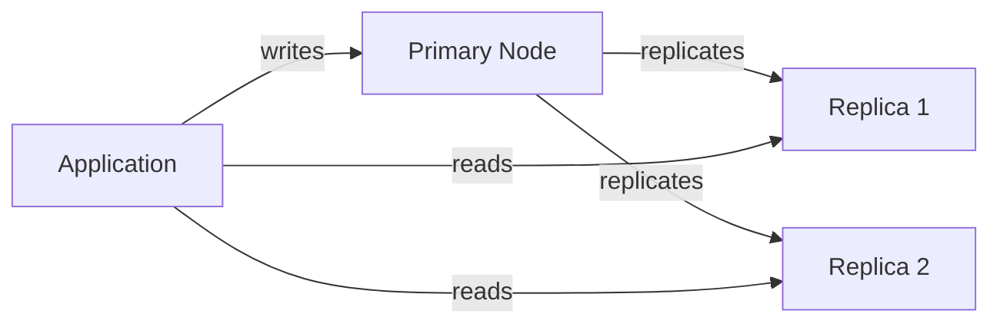
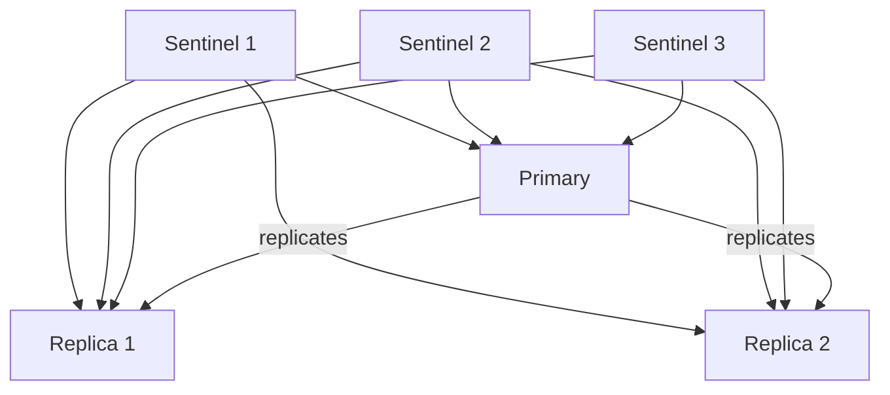
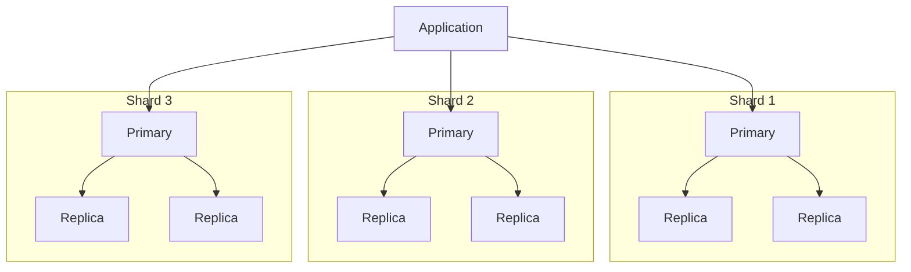

# How to Create Cache Replication

Author: [nawazdhandala](https://github.com/nawazdhandala)

Tags: Caching, Replication, High Availability, Redis

Description: Learn to create cache replication for high availability and read scaling.

---

A single cache node is a single point of failure. When that node goes down, every request slams into your database, turning a minor outage into a cascading disaster. Cache replication solves this by keeping multiple copies of your cached data across nodes, so reads continue even when individual instances fail.

This guide walks through the architecture, implementation patterns, and practical code for building replicated caches using Redis. The same principles apply whether you run Redis, Memcached, or custom in-memory stores.

## Why Replicate Your Cache?

| Goal | How Replication Helps |
| --- | --- |
| **High Availability** | If the primary fails, a replica promotes to primary. Reads never stop. |
| **Read Scaling** | Distribute read traffic across replicas. One primary handles writes; many replicas handle reads. |
| **Geographic Distribution** | Place replicas near users to reduce latency. A replica in Frankfurt serves European users faster than one in Virginia. |
| **Disaster Recovery** | Replicas in separate availability zones survive zone failures. |

Without replication, cache misses during outages force your database to absorb traffic spikes it was never sized for.

## Replication Architectures

Three patterns dominate cache replication deployments. Choose based on your consistency requirements and operational complexity tolerance.

### Primary-Replica (Master-Slave)

The simplest model. One node accepts writes; all others receive replicated data and serve reads.



The primary-replica pattern works well when write volume is moderate and you can tolerate brief replication lag.

### Sentinel-Based Failover

Redis Sentinel adds automatic failure detection and promotion. When the primary fails, Sentinels elect a new primary from the replica pool.



Sentinels monitor node health, coordinate failover consensus, and notify clients of topology changes.

### Redis Cluster (Sharded Replication)

For datasets that outgrow a single node, Redis Cluster shards data across multiple primaries. Each primary has its own replicas.



Redis Cluster distributes 16,384 hash slots across shards. Keys hash to slots, and slots map to specific primaries.

## Setting Up Redis Replication

Start with a basic primary-replica setup. This configuration runs three Redis instances: one primary on port 6379 and two replicas on ports 6380 and 6381.

Create a Docker Compose file that defines the primary and replica services with the appropriate replication configuration.

```yaml
# docker-compose.yml
version: '3.8'

services:
  redis-primary:
    image: redis:7-alpine
    ports:
      - "6379:6379"
    command: redis-server --appendonly yes

  redis-replica-1:
    image: redis:7-alpine
    ports:
      - "6380:6379"
    # Point this replica to the primary node
    command: redis-server --replicaof redis-primary 6379

  redis-replica-2:
    image: redis:7-alpine
    ports:
      - "6381:6379"
    # Second replica also follows the primary
    command: redis-server --replicaof redis-primary 6379
```

Start the stack and verify replication status by checking the primary node's info output.

```bash
# Launch all three Redis nodes
docker-compose up -d

# Connect to primary and check replication info
docker exec -it redis-primary redis-cli INFO replication
```

You should see `connected_slaves:2` in the output, confirming both replicas are receiving data.

## Application-Level Read Distribution

Your application needs to route writes to the primary and distribute reads across replicas. Here is a Node.js implementation using ioredis that handles this routing automatically.

The client configuration separates write and read connections, with the read connection using round-robin distribution across replicas.

```javascript
// cache-client.js
const Redis = require('ioredis');

// Create a connection to the primary for write operations
const primary = new Redis({
  host: 'redis-primary',
  port: 6379,
  // Retry connection on failure with exponential backoff
  retryDelayOnFailover: 100,
  maxRetriesPerRequest: 3
});

// Create connections to replicas for read operations
const replicas = [
  new Redis({ host: 'redis-replica-1', port: 6379 }),
  new Redis({ host: 'redis-replica-2', port: 6379 })
];

// Track which replica to use next (round-robin)
let replicaIndex = 0;

// Get a replica connection using round-robin selection
function getReadConnection() {
  const replica = replicas[replicaIndex];
  replicaIndex = (replicaIndex + 1) % replicas.length;
  return replica;
}

// Write operations go to primary
async function set(key, value, ttlSeconds = 3600) {
  return primary.set(key, JSON.stringify(value), 'EX', ttlSeconds);
}

// Read operations distribute across replicas
async function get(key) {
  const replica = getReadConnection();
  const value = await replica.get(key);
  return value ? JSON.parse(value) : null;
}

module.exports = { set, get, primary, replicas };
```

## Handling Replication Lag

Replicas receive data asynchronously. A write to the primary may take milliseconds to propagate. For most applications, this lag is acceptable. For read-after-write scenarios, you have options.

This table summarizes strategies for handling situations where you need consistent reads immediately after writes.

| Strategy | Trade-off |
| --- | --- |
| **Read from primary** | Higher primary load, guaranteed consistency |
| **Wait for replication** | Adds latency, ensures replicas have data |
| **Sticky sessions** | Route user to same node, simple but reduces distribution |
| **WAIT command** | Block until N replicas acknowledge write |

The WAIT command is useful when you need confirmation that replicas received critical data before proceeding.

```javascript
// wait-for-replication.js

// Write data and wait for at least one replica to acknowledge
async function setWithReplication(key, value) {
  // Write to primary
  await primary.set(key, JSON.stringify(value));

  // Block until at least 1 replica confirms receipt
  // Timeout after 1000ms to prevent indefinite blocking
  const replicasAcked = await primary.wait(1, 1000);

  if (replicasAcked === 0) {
    console.warn(`Key ${key} not replicated within timeout`);
  }

  return replicasAcked;
}
```

## Sentinel Configuration for Automatic Failover

Redis Sentinel monitors your primary and replicas, automatically promoting a replica when the primary fails. Run at least three Sentinel instances to achieve quorum.

Create the Sentinel configuration file with monitoring settings and failover thresholds.

```conf
# sentinel.conf

# Monitor the primary node with a quorum of 2 sentinels
sentinel monitor mymaster redis-primary 6379 2

# Consider primary down after 5 seconds of no response
sentinel down-after-milliseconds mymaster 5000

# Timeout for the failover process
sentinel failover-timeout mymaster 60000

# Only sync one replica at a time during failover
sentinel parallel-syncs mymaster 1
```

Connect your application to Sentinel instead of directly to Redis nodes. The client will discover the current primary automatically.

```javascript
// sentinel-client.js
const Redis = require('ioredis');

// Connect through Sentinel for automatic failover handling
const redis = new Redis({
  sentinels: [
    { host: 'sentinel-1', port: 26379 },
    { host: 'sentinel-2', port: 26379 },
    { host: 'sentinel-3', port: 26379 }
  ],
  // Name must match sentinel.conf monitor name
  name: 'mymaster',
  // Read from replicas when possible
  preferredSlaves: [
    { ip: 'redis-replica-1', port: 6379, prio: 1 },
    { ip: 'redis-replica-2', port: 6379, prio: 2 }
  ]
});

// Client automatically reconnects to new primary after failover
redis.on('reconnecting', () => {
  console.log('Reconnecting to Redis cluster...');
});

module.exports = redis;
```

## Monitoring Replication Health

Track these metrics to catch replication problems before they cause outages.

| Metric | Healthy Value | Alert Threshold |
| --- | --- | --- |
| `master_link_status` | up | down for > 30s |
| `master_link_down_since_seconds` | 0 | > 60 |
| `repl_backlog_size` | matches config | near zero |
| `connected_slaves` | expected count | fewer than expected |

Expose these metrics to your monitoring system. Here is a simple health check endpoint that reports replication status.

```javascript
// health-check.js
const { primary } = require('./cache-client');

// Returns replication status for monitoring systems
async function checkReplicationHealth() {
  const info = await primary.info('replication');

  // Parse the INFO output into key-value pairs
  const metrics = {};
  info.split('\n').forEach(line => {
    const [key, value] = line.split(':');
    if (key && value) {
      metrics[key.trim()] = value.trim();
    }
  });

  return {
    role: metrics.role,
    connectedSlaves: parseInt(metrics.connected_slaves) || 0,
    replBacklogActive: metrics.repl_backlog_active === '1',
    replBacklogSize: parseInt(metrics.repl_backlog_size) || 0
  };
}
```

## Common Pitfalls

**Forgetting to persist data.** Replicas sync from the primary's memory. If the primary restarts without persistence (RDB or AOF), replicas sync an empty dataset. Always enable `appendonly yes` or RDB snapshots.

**Network partitions.** A replica that loses connection to the primary serves stale data indefinitely unless you configure `replica-serve-stale-data no`. This trades availability for consistency.

**Insufficient replication backlog.** The primary keeps a buffer of recent writes. If a replica disconnects longer than the backlog covers, it must do a full resync. Size `repl-backlog-size` based on your write volume and expected disconnect duration.

**Running Sentinels on the same hosts as Redis.** If the host fails, you lose both the Redis node and its Sentinel. Distribute Sentinels across independent failure domains.

## Conclusion

Cache replication transforms a fragile single-node cache into a resilient system that survives failures and scales reads. Start with primary-replica for simplicity, add Sentinel when you need automatic failover, and graduate to Redis Cluster when your dataset outgrows a single node.

The key is matching your architecture to your actual requirements. Most applications do not need the complexity of a full cluster. A primary with two replicas behind Sentinel handles remarkable traffic while staying operationally simple. Measure your read/write ratio, define your availability targets, and pick the simplest architecture that meets them.
