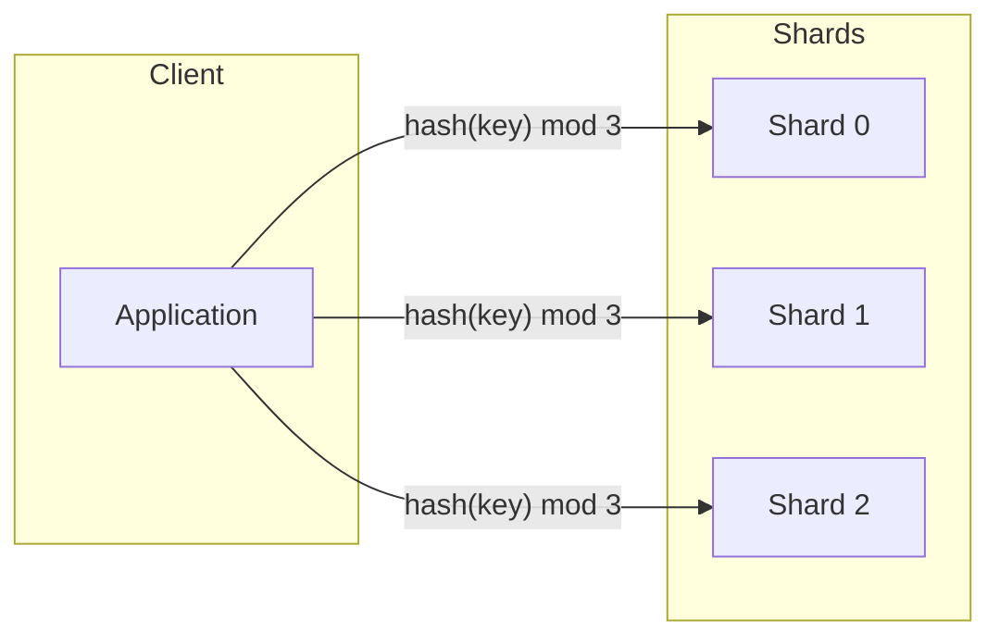
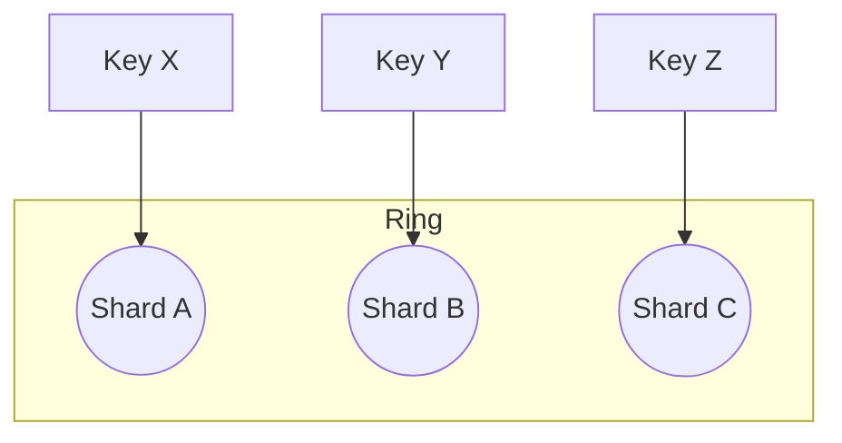
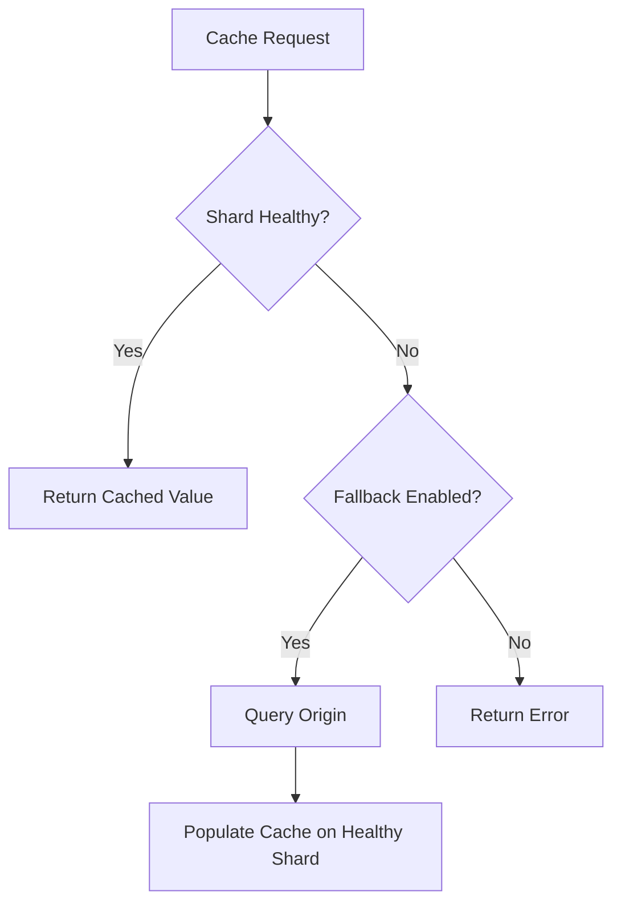

# How to Implement Cache Sharding

Author: [nawazdhandala](https://github.com/nawazdhandala)

Tags: Caching, Sharding, Redis Cluster, Scalability

Description: Learn to implement cache sharding for distributing cache data across multiple servers.

---

A single cache server works fine until it does not. Once your dataset outgrows available RAM or your read throughput exceeds what one node can serve, you need to spread the load. Cache sharding splits your keyspace across multiple servers so each node holds only a slice of the data. Done right, it scales linearly. Done wrong, you get hotspots, stale data, and 3 a.m. pages.

## Why Shard Your Cache?

| Problem | How Sharding Solves It |
| --- | --- |
| Memory limit on a single server | Each shard holds a fraction of the total dataset |
| Read throughput ceiling | Requests fan out to many nodes in parallel |
| Single point of failure | Losing one shard does not wipe the entire cache |
| Network bottleneck | Each shard has its own NIC bandwidth |

Sharding is not free. It introduces routing logic, rebalancing complexity, and the risk of uneven key distribution. The payoff comes when your cache layer becomes a horizontal resource you can scale by adding machines rather than buying bigger ones.

## Sharding Strategies

Three approaches dominate production deployments.



### 1. Modulo Hashing

The simplest approach: compute a hash of the key and take the remainder when divided by the number of shards.

This function converts any key into a shard index between 0 and the total shard count minus one.

```python
# Modulo hashing: simple but rigid
def get_shard(key: str, num_shards: int) -> int:
    # Python's built-in hash is deterministic per process
    # Use a stable hash like MD5 or xxHash in production
    import hashlib
    digest = hashlib.md5(key.encode()).hexdigest()
    return int(digest, 16) % num_shards
```

**Pros:** Easy to understand and implement.
**Cons:** Adding or removing a shard remaps nearly every key. This causes a cache stampede as almost all lookups miss and hit your origin simultaneously.

### 2. Consistent Hashing

Consistent hashing maps both keys and shards onto a virtual ring. A key is assigned to the first shard encountered when walking clockwise from its position. When a shard leaves, only its keys move to the next neighbor rather than the entire dataset.



Below is a minimal consistent hashing implementation using a sorted list of shard positions on the ring.

```python
import hashlib
import bisect

class ConsistentHashRing:
    def __init__(self, shards: list[str], replicas: int = 100):
        self.ring: dict[int, str] = {}
        self.sorted_keys: list[int] = []
        # Place each shard at multiple points (virtual nodes)
        for shard in shards:
            for i in range(replicas):
                key = f"{shard}:{i}"
                h = self._hash(key)
                self.ring[h] = shard
                self.sorted_keys.append(h)
        self.sorted_keys.sort()

    def _hash(self, key: str) -> int:
        return int(hashlib.md5(key.encode()).hexdigest(), 16)

    def get_shard(self, key: str) -> str:
        h = self._hash(key)
        # Find the first shard position >= key hash
        idx = bisect.bisect_left(self.sorted_keys, h)
        if idx == len(self.sorted_keys):
            idx = 0  # wrap around the ring
        return self.ring[self.sorted_keys[idx]]
```

**Pros:** Minimal key movement when shards change.
**Cons:** Virtual nodes add complexity; load balance depends on replica count tuning.

### 3. Hash Slot (Redis Cluster Approach)

Redis Cluster predefines 16,384 hash slots. Each key maps to a slot via `CRC16(key) mod 16384`, and each node owns a contiguous range of slots. You can migrate slots between nodes without rehashing keys.

The following snippet shows how to compute the slot for a given key following the Redis Cluster specification.

```python
import crc16

def redis_slot(key: str) -> int:
    # Redis extracts hash tags: "user:{123}" hashes only "123"
    start = key.find("{")
    if start != -1:
        end = key.find("}", start + 1)
        if end != -1 and end != start + 1:
            key = key[start + 1 : end]
    return crc16.crc16xmodem(key.encode()) % 16384
```

**Pros:** Battle-tested at scale; slot migration is atomic.
**Cons:** Requires Redis Cluster topology and client awareness.

## Strategy Comparison

| Strategy | Key Movement on Resize | Complexity | Best For |
| --- | --- | --- | --- |
| Modulo Hashing | Nearly all keys move | Low | Fixed shard counts that never change |
| Consistent Hashing | Only keys on affected shard | Medium | Dynamic clusters, custom caches |
| Hash Slots (Redis) | Only keys in migrated slots | Medium | Redis Cluster deployments |

## Implementing Sharding with Redis Cluster

Redis Cluster is the most common production choice when you need sharding out of the box. Here is how to connect and route keys automatically.

The Redis client library handles slot redirection. You only need to provide the initial cluster nodes.

```python
from redis.cluster import RedisCluster

# Provide at least one startup node; the client discovers the rest
nodes = [{"host": "redis-0.example.com", "port": 6379}]

rc = RedisCluster(startup_nodes=nodes, decode_responses=True)

# SET and GET are automatically routed to the correct shard
rc.set("session:abc123", "user_data")
value = rc.get("session:abc123")
```

For multi-key operations, Redis Cluster requires all keys to hash to the same slot. Use **hash tags** to colocate related keys.

Hash tags let you group keys onto the same shard by wrapping the common portion in curly braces.

```python
# Both keys hash only on "order:789", landing on the same shard
rc.set("{order:789}:items", "[...]")
rc.set("{order:789}:total", "129.99")

# Now MGET works because both keys share a slot
items, total = rc.mget("{order:789}:items", "{order:789}:total")
```

## Handling Shard Failures

When a shard goes down, you have two options: let requests fail or fall back to the origin. The right choice depends on your latency budget and data freshness requirements.



This wrapper adds a simple fallback mechanism around your cache client.

```python
class ShardedCache:
    def __init__(self, cluster, origin_db):
        self.cluster = cluster
        self.origin = origin_db

    def get(self, key: str):
        try:
            value = self.cluster.get(key)
            if value is not None:
                return value
        except Exception:
            # Shard unreachable; log and continue to origin
            pass
        # Cache miss or failure: fetch from origin
        value = self.origin.fetch(key)
        try:
            self.cluster.set(key, value, ex=300)  # 5 min TTL
        except Exception:
            pass  # Best effort; do not block the response
        return value
```

## Monitoring Sharded Caches

Sharding spreads load, but it also spreads your blind spots. Track these metrics per shard.

| Metric | Why It Matters |
| --- | --- |
| Memory usage (%) | Uneven distribution signals hot shards |
| Keyspace hit rate | Low hit rate may indicate bad key design |
| Network in/out | Helps catch replication or client storms |
| Connected clients | Spike can precede timeouts |
| Evictions per second | High eviction means undersized shard |

Export these to your observability stack. Set alerts when any single shard diverges from the cluster average by more than 20 percent.

## Common Pitfalls

1. **Hot keys.** A viral product page or a leaderboard key can overload one shard. Replicate hot keys to multiple shards or cache them locally in the application.
2. **Cross-slot operations.** MGET, MSET, and Lua scripts fail if keys span slots. Use hash tags to group related keys.
3. **Client-side routing bugs.** If your client caches the cluster topology and a shard moves, requests go to the wrong node. Use official client libraries that handle `MOVED` and `ASK` redirects.
4. **Unbalanced virtual nodes.** With consistent hashing, too few replicas cause uneven distribution. Start with 100 to 150 virtual nodes per physical shard.
5. **Ignoring slot migration latency.** Moving slots in Redis Cluster can cause brief latency spikes. Migrate during low-traffic windows.

## Checklist Before Going Live

- [ ] Benchmark with realistic key distribution, not random strings
- [ ] Test shard failure and recovery under load
- [ ] Verify hash tag design keeps related keys together
- [ ] Set up per-shard dashboards and alerts
- [ ] Document the slot or ring configuration for on-call engineers
- [ ] Plan a rebalancing runbook for adding or removing shards

Cache sharding is not a set-and-forget feature. Treat your sharded cache like any distributed system: monitor it, drill failures, and keep the topology visible to everyone who might get paged.
