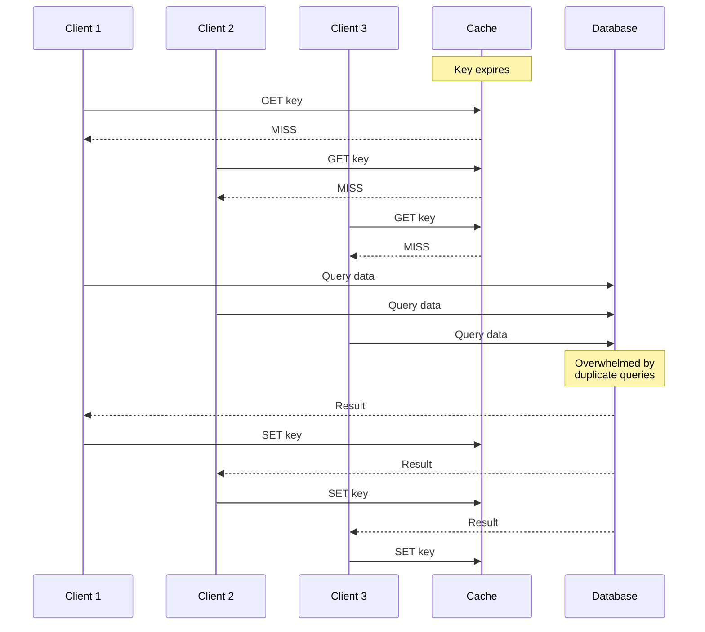
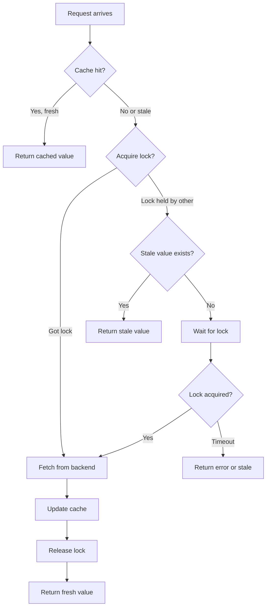
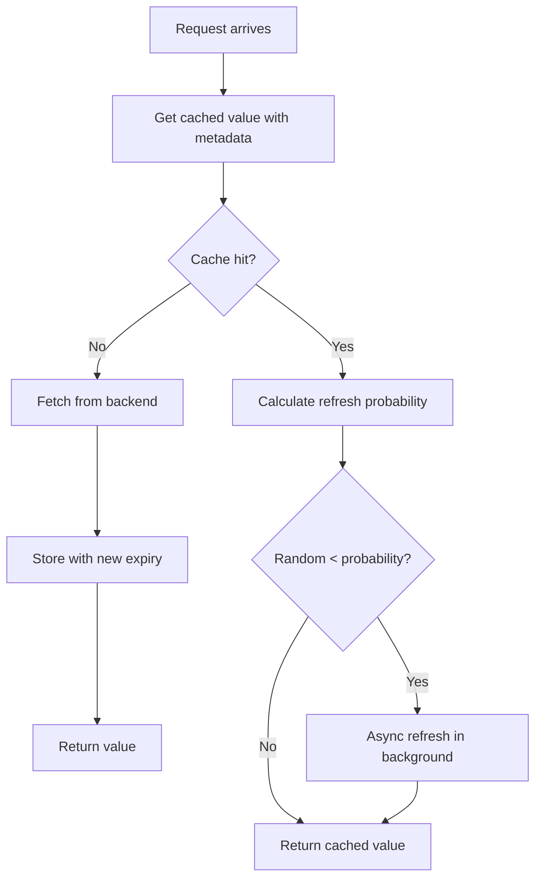
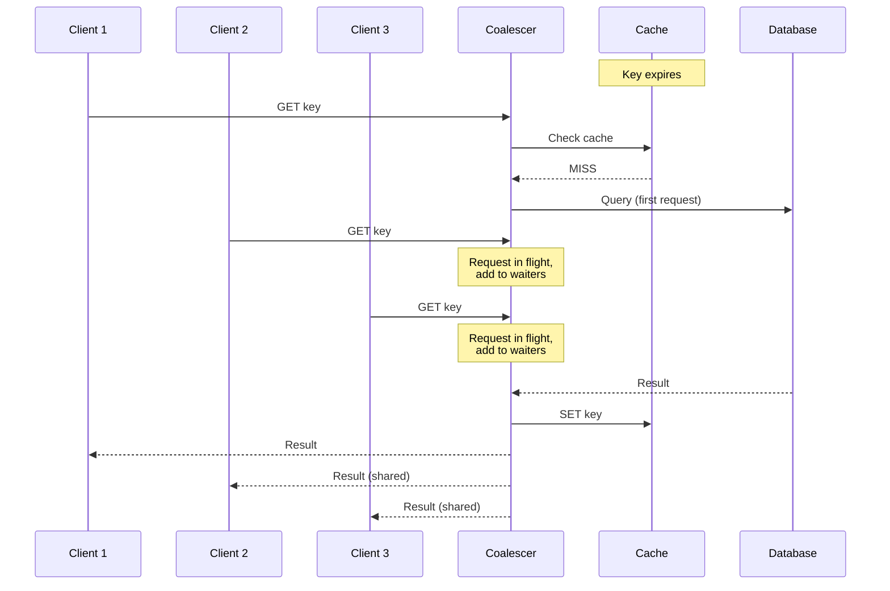
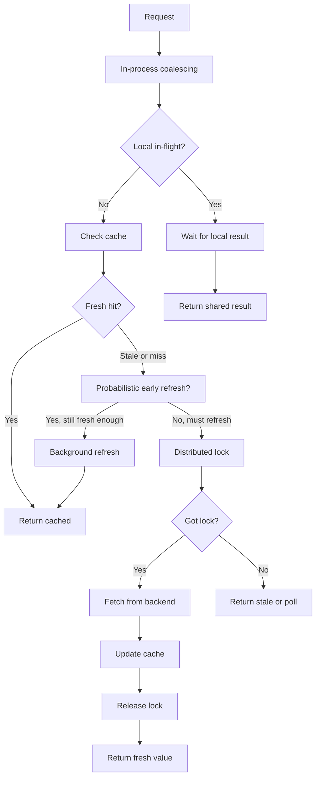

# How to Build Cache Stampede Prevention

Author: [nawazdhandala](https://github.com/nawazdhandala)

Tags: Caching, Stampede, Performance, Reliability

Description: Learn how to prevent cache stampedes using locking strategies, probabilistic early recomputation, and request coalescing to keep your systems stable under load.

---

A cache stampede, also known as the thundering herd problem, is one of the most dangerous failure modes in distributed systems. It happens when a cached value expires and many concurrent requests all try to regenerate the cache at the same time. Instead of a smooth background refresh, your backend suddenly receives thousands of identical expensive requests simultaneously.

This guide covers practical techniques to prevent cache stampedes: locking mechanisms, probabilistic early recomputation, and request coalescing. Each approach has different trade-offs, and choosing the right one depends on your specific workload and infrastructure.

## What is a Cache Stampede?

Under normal operation, a cache absorbs most of your read traffic. Only occasional cache misses trigger backend computation. But when a popular cache key expires, every request that arrives before the cache is repopulated will trigger a cache miss.



If your cache key is accessed 1,000 times per second and the backend query takes 500ms, a single expiration can spawn 500 simultaneous backend requests. Your database might handle 50 concurrent queries gracefully, but 500 will cause timeouts, connection pool exhaustion, and cascading failures.

### Why This Happens

Several factors make cache stampedes particularly dangerous:

| Factor | Impact |
|--------|--------|
| High traffic to single key | More requests hit during the vulnerable window |
| Slow backend computation | Longer window means more piled-up requests |
| Synchronized expiration | Multiple keys expiring together multiply the effect |
| Cold cache on deploy | All keys are empty simultaneously |

## Locking Strategies

The most direct solution is to ensure only one request recomputes the cache while others wait. This prevents duplicate backend work at the cost of some coordination overhead.

### Distributed Lock with Fallback to Stale Data

The safest approach combines a distributed lock with a stale data fallback. One request acquires the lock and refreshes the cache. Other requests either wait briefly or return the stale cached value.



Here is a practical implementation in Node.js using Redis:

```typescript
import Redis from 'ioredis';

const redis = new Redis();

interface CacheOptions {
  ttl: number;           // Cache TTL in seconds
  staleTtl: number;      // How long to keep stale data
  lockTimeout: number;   // Lock expiration in seconds
  waitTimeout: number;   // How long to wait for lock (ms)
}

async function getWithLock<T>(
  key: string,
  fetchFn: () => Promise<T>,
  options: CacheOptions
): Promise<T> {
  const dataKey = `cache:${key}`;
  const lockKey = `lock:${key}`;
  const staleKey = `stale:${key}`;

  // Try to get fresh cached value
  const cached = await redis.get(dataKey);
  if (cached) {
    return JSON.parse(cached);
  }

  // Try to acquire lock
  const lockAcquired = await redis.set(
    lockKey,
    '1',
    'EX',
    options.lockTimeout,
    'NX'
  );

  if (lockAcquired) {
    try {
      // We have the lock, fetch fresh data
      const data = await fetchFn();

      // Update both fresh and stale caches
      await redis
        .multi()
        .set(dataKey, JSON.stringify(data), 'EX', options.ttl)
        .set(staleKey, JSON.stringify(data), 'EX', options.staleTtl)
        .exec();

      return data;
    } finally {
      // Always release the lock
      await redis.del(lockKey);
    }
  }

  // Lock held by another request, try stale data first
  const stale = await redis.get(staleKey);
  if (stale) {
    return JSON.parse(stale);
  }

  // No stale data, must wait for the lock holder to finish
  const startTime = Date.now();
  while (Date.now() - startTime < options.waitTimeout) {
    await sleep(50);
    const freshData = await redis.get(dataKey);
    if (freshData) {
      return JSON.parse(freshData);
    }
  }

  // Timeout waiting, try to compute ourselves
  const data = await fetchFn();
  await redis.set(dataKey, JSON.stringify(data), 'EX', options.ttl);
  return data;
}

function sleep(ms: number): Promise<void> {
  return new Promise(resolve => setTimeout(resolve, ms));
}
```

### Lock Considerations

When implementing distributed locks for cache stampede prevention, keep these points in mind:

**Lock timeout must exceed computation time.** If your backend query takes 2 seconds, a 1-second lock timeout will cause the lock to expire mid-computation, allowing another request to start duplicate work.

**Use atomic lock acquisition.** The `SET key value EX timeout NX` pattern in Redis is atomic and prevents race conditions. Avoid separate `SETNX` and `EXPIRE` calls.

**Always release locks in a finally block.** If your computation throws an exception, the lock must still be released. Otherwise, other requests will wait until the lock times out.

**Handle lock holder crashes.** The lock timeout serves as a safety net. If the process holding the lock crashes, the lock will eventually expire and allow another request to proceed.

## Probabilistic Early Recomputation

Instead of waiting for a cache key to expire, you can proactively recompute it before expiration. The probabilistic approach adds randomness to prevent synchronized refreshes across a cluster.

### XFetch Algorithm

The XFetch algorithm, documented by Vattani et al. in their paper on optimal cache stampede prevention, uses an exponential distribution to decide when to refresh. As a cache entry approaches expiration, the probability of refreshing increases.



The probability formula considers time remaining until expiration and a tunable parameter beta:

```
probability = exp(-beta * (expiry - now) / delta)
```

Where:
- `expiry` is when the cache entry expires
- `now` is the current time
- `delta` is the computation time for the cached value
- `beta` controls how aggressive the early recomputation is

```typescript
interface XFetchOptions {
  ttl: number;
  delta: number;  // Expected computation time in seconds
  beta: number;   // Aggressiveness (typically 1.0)
}

interface CacheEntry<T> {
  value: T;
  expiry: number;  // Unix timestamp
  delta: number;   // How long the last fetch took
}

async function getWithXFetch<T>(
  key: string,
  fetchFn: () => Promise<T>,
  options: XFetchOptions
): Promise<T> {
  const cacheKey = `xfetch:${key}`;

  const cached = await redis.get(cacheKey);

  if (cached) {
    const entry: CacheEntry<T> = JSON.parse(cached);
    const now = Date.now() / 1000;
    const timeRemaining = entry.expiry - now;

    // Calculate early recomputation probability
    const probability = Math.exp(
      -options.beta * timeRemaining / entry.delta
    );

    if (Math.random() < probability) {
      // Refresh in background, return stale immediately
      refreshInBackground(key, cacheKey, fetchFn, options);
    }

    return entry.value;
  }

  // Cache miss, must compute synchronously
  return await computeAndStore(key, cacheKey, fetchFn, options);
}

async function computeAndStore<T>(
  key: string,
  cacheKey: string,
  fetchFn: () => Promise<T>,
  options: XFetchOptions
): Promise<T> {
  const startTime = Date.now();
  const value = await fetchFn();
  const delta = (Date.now() - startTime) / 1000;

  const entry: CacheEntry<T> = {
    value,
    expiry: Date.now() / 1000 + options.ttl,
    delta: Math.max(delta, options.delta)
  };

  await redis.set(
    cacheKey,
    JSON.stringify(entry),
    'EX',
    options.ttl
  );

  return value;
}

function refreshInBackground<T>(
  key: string,
  cacheKey: string,
  fetchFn: () => Promise<T>,
  options: XFetchOptions
): void {
  // Fire and forget, errors are logged but not thrown
  computeAndStore(key, cacheKey, fetchFn, options)
    .catch(err => console.error(`Background refresh failed for ${key}:`, err));
}
```

### Tuning the Beta Parameter

The beta parameter controls how early the recomputation starts:

| Beta Value | Behavior |
|------------|----------|
| 0.5 | Very aggressive, starts refreshing early |
| 1.0 | Balanced, recommended starting point |
| 2.0 | Conservative, waits longer before refreshing |

Lower beta values reduce stampede risk but increase backend load during normal operation. Higher values are more efficient but leave a smaller safety margin.

## Request Coalescing

Request coalescing, also called single-flight or deduplication, ensures that multiple simultaneous requests for the same key share a single backend computation. Instead of each request triggering its own query, they all wait for the result of a single in-progress request.



### In-Process Request Coalescing

For a single process, you can use a simple in-memory map to track in-flight requests:

```typescript
type InflightRequest<T> = Promise<T>;
const inflight = new Map<string, InflightRequest<unknown>>();

async function getWithCoalescing<T>(
  key: string,
  fetchFn: () => Promise<T>
): Promise<T> {
  // Check if request is already in flight
  const existing = inflight.get(key) as InflightRequest<T> | undefined;
  if (existing) {
    return existing;
  }

  // Create new request and store it
  const request = fetchFn().finally(() => {
    inflight.delete(key);
  });

  inflight.set(key, request);
  return request;
}
```

This is simple and effective but only works within a single process. In a multi-instance deployment, each instance maintains its own in-flight map, so requests to different instances will still trigger duplicate backend queries.

### Distributed Request Coalescing

For true distributed coalescing, combine the in-process coalescer with a distributed lock:

```typescript
async function getWithDistributedCoalescing<T>(
  key: string,
  fetchFn: () => Promise<T>,
  options: { lockTimeout: number; ttl: number }
): Promise<T> {
  const cacheKey = `cache:${key}`;
  const lockKey = `lock:${key}`;

  // First, check local in-flight requests
  const localInflight = inflight.get(key) as InflightRequest<T> | undefined;
  if (localInflight) {
    return localInflight;
  }

  // Check cache
  const cached = await redis.get(cacheKey);
  if (cached) {
    return JSON.parse(cached);
  }

  // Try to acquire distributed lock
  const lockAcquired = await redis.set(
    lockKey,
    process.pid.toString(),
    'EX',
    options.lockTimeout,
    'NX'
  );

  if (!lockAcquired) {
    // Another instance is computing, poll for result
    return await pollForResult<T>(cacheKey, options.lockTimeout * 1000);
  }

  // We have the lock, compute and cache
  const request = fetchFn()
    .then(async (data) => {
      await redis.set(cacheKey, JSON.stringify(data), 'EX', options.ttl);
      return data;
    })
    .finally(async () => {
      await redis.del(lockKey);
      inflight.delete(key);
    });

  inflight.set(key, request);
  return request;
}

async function pollForResult<T>(
  cacheKey: string,
  timeoutMs: number
): Promise<T> {
  const startTime = Date.now();
  const pollInterval = 50;

  while (Date.now() - startTime < timeoutMs) {
    const cached = await redis.get(cacheKey);
    if (cached) {
      return JSON.parse(cached);
    }
    await sleep(pollInterval);
  }

  throw new Error(`Timeout waiting for cache key: ${cacheKey}`);
}
```

## Combining Strategies

In production systems, you often combine multiple strategies for defense in depth. Here is a recommended layered approach:



### Full Implementation

Here is a complete implementation combining all three strategies:

```typescript
interface CacheStampedeOptions {
  ttl: number;
  staleTtl: number;
  lockTimeout: number;
  beta: number;
  estimatedDelta: number;
}

const defaultOptions: CacheStampedeOptions = {
  ttl: 300,           // 5 minutes
  staleTtl: 3600,     // 1 hour stale data retention
  lockTimeout: 30,    // 30 second lock
  beta: 1.0,          // Balanced early recomputation
  estimatedDelta: 1   // Assume 1 second computation initially
};

class StampedeProtectedCache {
  private inflight = new Map<string, Promise<unknown>>();
  private redis: Redis;

  constructor(redis: Redis) {
    this.redis = redis;
  }

  async get<T>(
    key: string,
    fetchFn: () => Promise<T>,
    options: Partial<CacheStampedeOptions> = {}
  ): Promise<T> {
    const opts = { ...defaultOptions, ...options };

    // Layer 1: In-process coalescing
    const existing = this.inflight.get(key) as Promise<T> | undefined;
    if (existing) {
      return existing;
    }

    const request = this.getWithProtection(key, fetchFn, opts);
    this.inflight.set(key, request);

    return request.finally(() => {
      this.inflight.delete(key);
    });
  }

  private async getWithProtection<T>(
    key: string,
    fetchFn: () => Promise<T>,
    opts: CacheStampedeOptions
  ): Promise<T> {
    const dataKey = `data:${key}`;
    const metaKey = `meta:${key}`;
    const staleKey = `stale:${key}`;
    const lockKey = `lock:${key}`;

    // Check cache with metadata
    const [data, meta] = await this.redis.mget(dataKey, metaKey);

    if (data && meta) {
      const metadata = JSON.parse(meta);
      const now = Date.now() / 1000;
      const timeRemaining = metadata.expiry - now;

      // Layer 2: Probabilistic early recomputation
      if (timeRemaining > 0) {
        const probability = Math.exp(
          -opts.beta * timeRemaining / metadata.delta
        );

        if (Math.random() < probability) {
          this.backgroundRefresh(key, fetchFn, opts);
        }

        return JSON.parse(data);
      }
    }

    // Layer 3: Distributed lock with stale fallback
    const lockAcquired = await this.redis.set(
      lockKey, '1', 'EX', opts.lockTimeout, 'NX'
    );

    if (!lockAcquired) {
      // Return stale if available
      const stale = await this.redis.get(staleKey);
      if (stale) {
        return JSON.parse(stale);
      }

      // Poll for fresh data
      return this.pollForResult<T>(dataKey, opts.lockTimeout * 1000);
    }

    try {
      return await this.fetchAndStore(key, fetchFn, opts);
    } finally {
      await this.redis.del(lockKey);
    }
  }

  private async fetchAndStore<T>(
    key: string,
    fetchFn: () => Promise<T>,
    opts: CacheStampedeOptions
  ): Promise<T> {
    const dataKey = `data:${key}`;
    const metaKey = `meta:${key}`;
    const staleKey = `stale:${key}`;

    const startTime = Date.now();
    const value = await fetchFn();
    const delta = (Date.now() - startTime) / 1000;

    const metadata = {
      expiry: Date.now() / 1000 + opts.ttl,
      delta: Math.max(delta, opts.estimatedDelta)
    };

    await this.redis
      .multi()
      .set(dataKey, JSON.stringify(value), 'EX', opts.ttl)
      .set(metaKey, JSON.stringify(metadata), 'EX', opts.ttl)
      .set(staleKey, JSON.stringify(value), 'EX', opts.staleTtl)
      .exec();

    return value;
  }

  private backgroundRefresh<T>(
    key: string,
    fetchFn: () => Promise<T>,
    opts: CacheStampedeOptions
  ): void {
    const lockKey = `bglock:${key}`;

    this.redis.set(lockKey, '1', 'EX', opts.lockTimeout, 'NX')
      .then(acquired => {
        if (acquired) {
          return this.fetchAndStore(key, fetchFn, opts)
            .finally(() => this.redis.del(lockKey));
        }
      })
      .catch(err => {
        console.error(`Background refresh failed for ${key}:`, err);
      });
  }

  private async pollForResult<T>(
    dataKey: string,
    timeoutMs: number
  ): Promise<T> {
    const startTime = Date.now();

    while (Date.now() - startTime < timeoutMs) {
      const data = await this.redis.get(dataKey);
      if (data) {
        return JSON.parse(data);
      }
      await sleep(50);
    }

    throw new Error('Timeout waiting for cache population');
  }
}
```

## Monitoring and Alerting

Stampede prevention mechanisms can mask underlying issues. Monitor these metrics to catch problems before they escalate:

| Metric | What to Watch |
|--------|--------------|
| Lock acquisition rate | High contention suggests cache is expiring too often |
| Stale data serve rate | Frequent stale responses mean backend is too slow |
| Background refresh failures | Persistent failures indicate backend problems |
| Cache hit ratio | Sudden drops suggest invalidation storms |
| Lock timeout events | Indicates computation time exceeds lock timeout |

Set up alerts for:

1. Lock acquisition failures exceeding 10% of requests
2. More than 5% of requests receiving stale data
3. Background refresh error rate above 1%
4. Sudden drop in cache hit ratio by more than 20%

## Common Pitfalls

**Forgetting about cold starts.** When you deploy a new version or scale up new instances, the cache is empty. Use cache warming or coordinate deployments to avoid simultaneous cold cache scenarios.

**Setting TTL too short.** Very short TTLs increase the frequency of potential stampedes. Balance freshness requirements against stability.

**Not handling lock holder failures.** If the process holding the lock crashes, others might wait indefinitely. Always use lock timeouts and handle the timeout case gracefully.

**Ignoring clock skew.** In distributed systems, clock skew can cause early expiration calculations to behave unexpectedly. Use relative times where possible.

**Over-engineering for low-traffic keys.** Not every cache key needs stampede protection. Focus on high-traffic, expensive-to-compute keys.

## Conclusion

Cache stampedes can take down even well-provisioned systems in seconds. The techniques covered here provide multiple layers of defense:

- **Distributed locking** ensures only one request regenerates the cache
- **Probabilistic early recomputation** refreshes cache before expiration
- **Request coalescing** deduplicates concurrent requests

Start with simple locking if you have occasional stampede issues. Add probabilistic early recomputation for frequently accessed keys with predictable traffic. Use request coalescing when you have bursty traffic patterns.

The best defense is understanding your access patterns. Monitor your cache, know which keys are hot, and apply targeted protection where it matters most.

**Related Reading:**

- [When Performance Matters, Skip the ORM](https://oneuptime.com/blog/post/2025-11-13-when-performance-matters-skip-the-orm/view)
- [Basics of Profiling: Turning CPU and Memory Hotspots into Action](https://oneuptime.com/blog/post/2025-09-09-basics-of-profiling/view)
- [SRE Best Practices](https://oneuptime.com/blog/post/2025-11-28-sre-best-practices/view)
