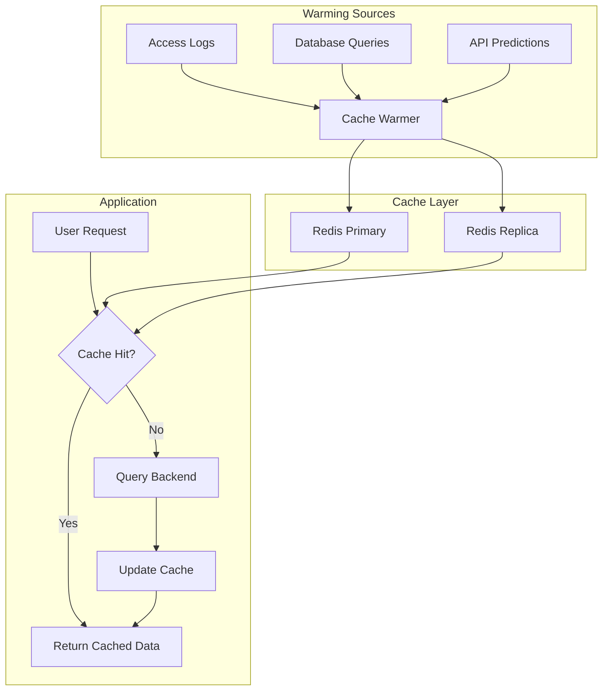
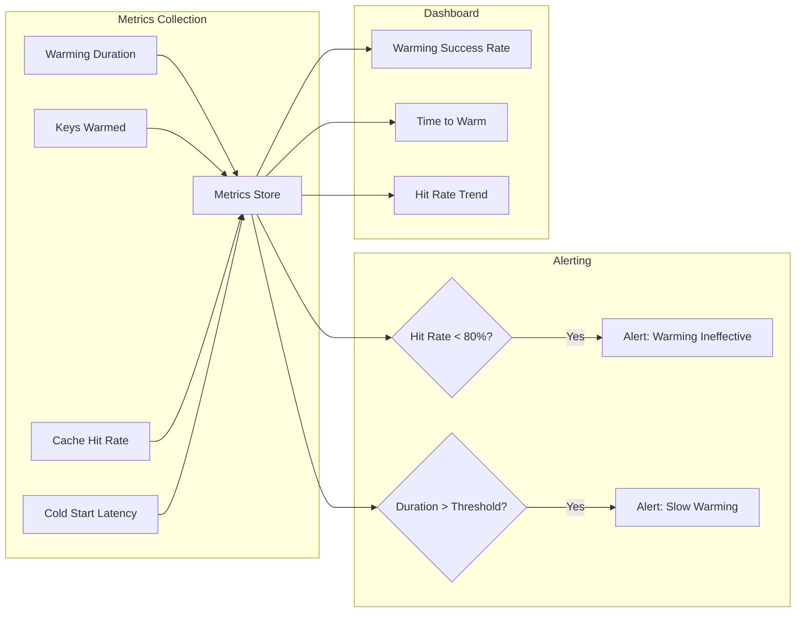

# How to Implement Cache Warming Strategies

Author: [nawazdhandala](https://github.com/nawazdhandala)

Tags: Caching, Redis, Performance, DevOps

Description: Learn practical cache warming strategies that eliminate cold start latency spikes and ensure your users always experience fast response times, even after deployments or cache failures.

---

> A cold cache is a slow cache. When your application starts fresh or recovers from a failure, the first users to arrive face the full weight of uncached database queries and API calls. Cache warming solves this by proactively loading frequently accessed data before traffic arrives.

Production systems live and die by their cache hit rates. A 95% hit rate means only 5% of requests touch your slow backend. But after a deployment, cache flush, or node failure, that hit rate drops to zero. Your database suddenly handles 20x the normal load, latencies spike, and users experience timeouts. Cache warming prevents this scenario entirely.

---

## Why Cache Warming Matters

Cache warming is not about optimization. It is about reliability. Consider what happens during common operational events:

| Event | Impact Without Warming | Impact With Warming |
|-------|----------------------|---------------------|
| Application deployment | Cold cache, latency spikes for all users | Pre-warmed cache, normal latency |
| Cache node failure | Thundering herd on database | Warm replacement node before routing traffic |
| Scheduled maintenance | Cache invalidation causes slowdown | Background warming during maintenance window |
| Traffic spike | New keys miss cache, overwhelming backend | Predictive warming based on traffic patterns |

The fundamental principle: never let your users be the ones who warm your cache.

---

## Cache Warming Architecture

A robust cache warming system operates alongside your main application, proactively loading data into the cache layer.



---

## Basic Cache Warming Implementation

The simplest approach reads your access logs, identifies frequently requested keys, and pre-loads them into cache.

```python
# cache_warmer.py
# Basic cache warmer that loads frequently accessed keys from access logs
import redis
import json
from collections import Counter
from typing import List, Dict, Callable
from dataclasses import dataclass

@dataclass
class WarmingConfig:
    """Configuration for cache warming behavior."""
    # Number of top keys to warm
    top_keys_count: int = 1000
    # Time-to-live for warmed entries
    ttl_seconds: int = 3600
    # Batch size for Redis operations
    batch_size: int = 100

class CacheWarmer:
    """
    Warms cache by analyzing access patterns and pre-loading popular keys.
    Designed to run before deployments or after cache failures.
    """

    def __init__(
        self,
        redis_url: str = "redis://localhost:6379",
        config: WarmingConfig = None
    ):
        self.redis = redis.from_url(redis_url)
        self.config = config or WarmingConfig()
        # Registry of data loaders for different key patterns
        self.loaders: Dict[str, Callable] = {}

    def register_loader(self, key_pattern: str, loader: Callable):
        """
        Register a data loader function for a specific key pattern.
        The loader receives the key and returns the value to cache.
        """
        self.loaders[key_pattern] = loader

    def analyze_access_logs(self, log_file: str) -> List[str]:
        """
        Parse access logs to find most frequently accessed cache keys.
        Returns top N keys sorted by access frequency.
        """
        key_counts = Counter()

        with open(log_file, 'r') as f:
            for line in f:
                try:
                    # Assumes log format: {"timestamp": ..., "cache_key": "...", ...}
                    entry = json.loads(line)
                    if 'cache_key' in entry:
                        key_counts[entry['cache_key']] += 1
                except json.JSONDecodeError:
                    continue

        # Return the most common keys
        return [key for key, _ in key_counts.most_common(self.config.top_keys_count)]

    def _find_loader(self, key: str) -> Callable:
        """Find the appropriate loader for a given cache key."""
        for pattern, loader in self.loaders.items():
            if pattern in key:
                return loader
        return None

    def warm_keys(self, keys: List[str]) -> Dict[str, int]:
        """
        Warm a list of cache keys.
        Returns statistics about the warming operation.
        """
        stats = {"warmed": 0, "skipped": 0, "failed": 0}

        for i in range(0, len(keys), self.config.batch_size):
            batch = keys[i:i + self.config.batch_size]

            # Use pipeline for efficient batch operations
            pipe = self.redis.pipeline()
            values_to_set = []

            for key in batch:
                # Skip if already cached
                if self.redis.exists(key):
                    stats["skipped"] += 1
                    continue

                # Find and execute the appropriate loader
                loader = self._find_loader(key)
                if not loader:
                    stats["failed"] += 1
                    continue

                try:
                    value = loader(key)
                    values_to_set.append((key, value))
                except Exception as e:
                    print(f"Failed to load {key}: {e}")
                    stats["failed"] += 1

            # Batch set all loaded values
            for key, value in values_to_set:
                pipe.setex(key, self.config.ttl_seconds, json.dumps(value))
                stats["warmed"] += 1

            pipe.execute()

        return stats

    def warm_from_logs(self, log_file: str) -> Dict[str, int]:
        """
        Complete warming workflow: analyze logs and warm top keys.
        """
        print(f"Analyzing access logs: {log_file}")
        keys = self.analyze_access_logs(log_file)
        print(f"Found {len(keys)} keys to warm")

        stats = self.warm_keys(keys)
        print(f"Warming complete: {stats}")
        return stats


# Example usage with custom loaders
def load_user_profile(key: str) -> dict:
    """Load user profile from database."""
    # Extract user ID from key like "user:profile:12345"
    user_id = key.split(":")[-1]
    # In real implementation, query your database here
    return {"user_id": user_id, "name": "User", "preferences": {}}

def load_product_data(key: str) -> dict:
    """Load product data from database."""
    product_id = key.split(":")[-1]
    return {"product_id": product_id, "name": "Product", "price": 0}


# Initialize and run the warmer
warmer = CacheWarmer()
warmer.register_loader("user:profile:", load_user_profile)
warmer.register_loader("product:", load_product_data)

# Warm cache from yesterday's access logs
stats = warmer.warm_from_logs("/var/log/app/access.log")
```

---

## Event-Driven Cache Warming

Instead of warming based on historical data, you can warm caches in real-time as data changes. This approach uses message queues to trigger warming operations immediately after database writes.

```python
# event_warmer.py
# Real-time cache warming triggered by database change events
import redis
import json
from typing import Callable, Dict
from dataclasses import dataclass
import threading
from queue import Queue

@dataclass
class ChangeEvent:
    """Represents a data change that should trigger cache warming."""
    entity_type: str  # e.g., "user", "product", "order"
    entity_id: str
    operation: str  # "create", "update", "delete"
    data: dict = None

class EventDrivenWarmer:
    """
    Warms cache immediately when data changes.
    Subscribes to change events and updates cache in real-time.
    """

    def __init__(self, redis_url: str = "redis://localhost:6379"):
        self.redis = redis.from_url(redis_url)
        self.pubsub = self.redis.pubsub()
        self.handlers: Dict[str, Callable] = {}
        self.event_queue = Queue()
        self.running = False

    def register_handler(self, entity_type: str, handler: Callable):
        """
        Register a handler for a specific entity type.
        Handler receives the event and should return cache key-value pairs.
        """
        self.handlers[entity_type] = handler

    def _process_events(self):
        """Background worker that processes warming events."""
        while self.running:
            try:
                event = self.event_queue.get(timeout=1)
                self._warm_for_event(event)
            except:
                continue

    def _warm_for_event(self, event: ChangeEvent):
        """Process a single change event and update cache."""
        handler = self.handlers.get(event.entity_type)
        if not handler:
            return

        if event.operation == "delete":
            # For deletes, invalidate related cache keys
            cache_keys = handler(event)
            for key in cache_keys:
                self.redis.delete(key)
        else:
            # For creates and updates, warm the cache
            cache_entries = handler(event)
            pipe = self.redis.pipeline()
            for key, value, ttl in cache_entries:
                pipe.setex(key, ttl, json.dumps(value))
            pipe.execute()

    def publish_event(self, event: ChangeEvent):
        """
        Publish a change event for cache warming.
        Call this from your application after database writes.
        """
        self.event_queue.put(event)

    def start(self):
        """Start the background warming worker."""
        self.running = True
        self.worker = threading.Thread(target=self._process_events, daemon=True)
        self.worker.start()

    def stop(self):
        """Stop the background worker."""
        self.running = False
        self.worker.join()


# Example: Warm user-related caches when user data changes
def handle_user_change(event: ChangeEvent) -> list:
    """
    Generate cache entries for user-related data.
    Returns list of (key, value, ttl) tuples.
    """
    user_id = event.entity_id
    user_data = event.data

    entries = []

    # Warm the user profile cache
    entries.append((
        f"user:profile:{user_id}",
        user_data,
        3600  # 1 hour TTL
    ))

    # Warm the user's permissions cache
    entries.append((
        f"user:permissions:{user_id}",
        user_data.get("permissions", []),
        1800  # 30 minute TTL
    ))

    # Warm the user's session cache
    entries.append((
        f"user:session:{user_id}",
        {"user_id": user_id, "active": True},
        7200  # 2 hour TTL
    ))

    return entries


# Usage in your application
warmer = EventDrivenWarmer()
warmer.register_handler("user", handle_user_change)
warmer.start()

# After saving a user to the database
def save_user(user_data: dict):
    # Save to database first
    # db.users.save(user_data)

    # Then trigger cache warming
    warmer.publish_event(ChangeEvent(
        entity_type="user",
        entity_id=user_data["id"],
        operation="update",
        data=user_data
    ))
```

---

## Deployment-Time Cache Warming

The most critical time for cache warming is during deployments. This script integrates with your CI/CD pipeline to warm caches before traffic is routed to new instances.

```python
# deployment_warmer.py
# Cache warming as part of deployment pipeline
import redis
import requests
import time
from typing import List, Dict
from concurrent.futures import ThreadPoolExecutor, as_completed

class DeploymentWarmer:
    """
    Warms cache during deployments before traffic is routed.
    Integrates with health checks to ensure warming completes.
    """

    def __init__(
        self,
        redis_url: str,
        api_base_url: str,
        warmup_endpoints: List[str]
    ):
        self.redis = redis.from_url(redis_url)
        self.api_base_url = api_base_url
        self.warmup_endpoints = warmup_endpoints
        self.warmup_complete = False

    def warm_endpoint(self, endpoint: str) -> Dict:
        """
        Warm cache by hitting an API endpoint.
        This triggers the normal cache population flow.
        """
        url = f"{self.api_base_url}{endpoint}"
        start = time.time()

        try:
            response = requests.get(url, timeout=30)
            duration = time.time() - start

            return {
                "endpoint": endpoint,
                "status": response.status_code,
                "duration_ms": duration * 1000,
                "success": response.status_code == 200
            }
        except Exception as e:
            return {
                "endpoint": endpoint,
                "status": 0,
                "error": str(e),
                "success": False
            }

    def warm_critical_keys(self, keys_and_loaders: List[tuple]) -> Dict:
        """
        Directly warm specific cache keys that are critical for startup.
        """
        stats = {"warmed": 0, "failed": 0}
        pipe = self.redis.pipeline()

        for key, loader, ttl in keys_and_loaders:
            try:
                value = loader()
                pipe.setex(key, ttl, value)
                stats["warmed"] += 1
            except Exception as e:
                print(f"Failed to warm {key}: {e}")
                stats["failed"] += 1

        pipe.execute()
        return stats

    def run_warmup(self, max_workers: int = 10) -> Dict:
        """
        Run the complete warmup process.
        Uses parallel requests for faster warming.
        """
        results = {"endpoints": [], "total_time_ms": 0, "success_rate": 0}
        start = time.time()

        # Warm endpoints in parallel
        with ThreadPoolExecutor(max_workers=max_workers) as executor:
            futures = {
                executor.submit(self.warm_endpoint, ep): ep
                for ep in self.warmup_endpoints
            }

            for future in as_completed(futures):
                result = future.result()
                results["endpoints"].append(result)

        results["total_time_ms"] = (time.time() - start) * 1000
        successes = sum(1 for r in results["endpoints"] if r["success"])
        results["success_rate"] = successes / len(results["endpoints"]) * 100

        self.warmup_complete = results["success_rate"] >= 90
        return results

    def health_check(self) -> Dict:
        """
        Health check endpoint for load balancer integration.
        Returns unhealthy until warmup completes.
        """
        return {
            "status": "healthy" if self.warmup_complete else "warming",
            "ready": self.warmup_complete
        }


# Example deployment script integration
WARMUP_ENDPOINTS = [
    "/api/products/featured",
    "/api/categories",
    "/api/config",
    "/api/users/permissions/defaults",
    "/api/promotions/active",
]

def run_deployment_warmup():
    """
    Run as part of deployment before enabling traffic.
    """
    warmer = DeploymentWarmer(
        redis_url="redis://localhost:6379",
        api_base_url="http://localhost:8080",
        warmup_endpoints=WARMUP_ENDPOINTS
    )

    print("Starting deployment cache warmup...")
    results = warmer.run_warmup()

    print(f"Warmup completed in {results['total_time_ms']:.0f}ms")
    print(f"Success rate: {results['success_rate']:.1f}%")

    for endpoint in results["endpoints"]:
        status = "OK" if endpoint["success"] else "FAILED"
        print(f"  {endpoint['endpoint']}: {status}")

    if not warmer.warmup_complete:
        print("WARNING: Warmup incomplete, some endpoints failed")
        return False

    return True


if __name__ == "__main__":
    success = run_deployment_warmup()
    exit(0 if success else 1)
```

---

## Predictive Cache Warming

Advanced cache warming uses traffic patterns to predict what data users will need before they request it. This works especially well for applications with predictable usage patterns.

```python
# predictive_warmer.py
# Predict and warm cache based on traffic patterns and user behavior
import redis
import json
from datetime import datetime, timedelta
from typing import List, Dict
from collections import defaultdict

class PredictiveWarmer:
    """
    Warms cache proactively based on predicted traffic patterns.
    Learns from historical access patterns to anticipate demand.
    """

    def __init__(self, redis_url: str = "redis://localhost:6379"):
        self.redis = redis.from_url(redis_url)
        # Store access patterns by hour of day
        self.hourly_patterns: Dict[int, List[str]] = defaultdict(list)

    def record_access(self, cache_key: str):
        """
        Record cache access for pattern learning.
        Call this on every cache hit or miss.
        """
        hour = datetime.now().hour
        pattern_key = f"access_pattern:{hour}"

        # Use Redis sorted set to track access frequency by hour
        self.redis.zincrby(pattern_key, 1, cache_key)
        # Expire patterns after 7 days
        self.redis.expire(pattern_key, 7 * 24 * 3600)

    def get_predicted_keys(self, hours_ahead: int = 1, count: int = 100) -> List[str]:
        """
        Predict which keys will be needed in the coming hours.
        Returns keys most likely to be accessed based on historical patterns.
        """
        target_hour = (datetime.now().hour + hours_ahead) % 24
        pattern_key = f"access_pattern:{target_hour}"

        # Get top keys for the target hour
        top_keys = self.redis.zrevrange(pattern_key, 0, count - 1)
        return [key.decode() for key in top_keys]

    def warm_predicted(self, loader_func, hours_ahead: int = 1):
        """
        Warm cache with keys predicted to be needed soon.
        """
        keys = self.get_predicted_keys(hours_ahead)
        print(f"Warming {len(keys)} predicted keys for {hours_ahead} hour(s) ahead")

        pipe = self.redis.pipeline()
        warmed = 0

        for key in keys:
            # Skip if already cached
            if self.redis.exists(key):
                continue

            try:
                value = loader_func(key)
                pipe.setex(key, 3600, json.dumps(value))
                warmed += 1
            except Exception as e:
                print(f"Failed to load {key}: {e}")

        pipe.execute()
        print(f"Warmed {warmed} new keys")
        return warmed


class TimeBasedWarmer:
    """
    Warms cache based on time-of-day patterns.
    Useful for applications with predictable daily cycles.
    """

    def __init__(self, redis_url: str = "redis://localhost:6379"):
        self.redis = redis.from_url(redis_url)
        # Define warming schedules for different times
        self.schedules: Dict[int, List[tuple]] = {}

    def add_schedule(self, hour: int, keys_and_loaders: List[tuple]):
        """
        Add a warming schedule for a specific hour.
        keys_and_loaders: List of (key_pattern, loader_func, ttl) tuples
        """
        self.schedules[hour] = keys_and_loaders

    def run_scheduled_warmup(self):
        """
        Run warmup for the current hour's schedule.
        Call this from a cron job or scheduler.
        """
        current_hour = datetime.now().hour

        if current_hour not in self.schedules:
            print(f"No schedule for hour {current_hour}")
            return

        print(f"Running scheduled warmup for hour {current_hour}")
        pipe = self.redis.pipeline()

        for key_pattern, loader, ttl in self.schedules[current_hour]:
            try:
                keys_and_values = loader()
                for key, value in keys_and_values:
                    pipe.setex(key, ttl, json.dumps(value))
            except Exception as e:
                print(f"Failed to warm {key_pattern}: {e}")

        pipe.execute()


# Example: Business hours warming schedule
def load_morning_data():
    """Load data typically needed during morning hours."""
    # Return list of (key, value) tuples
    return [
        ("dashboard:summary", {"visitors": 0, "sales": 0}),
        ("reports:daily", {"date": str(datetime.now().date())}),
    ]

def load_business_hours_data():
    """Load data for peak business hours."""
    return [
        ("products:featured", [{"id": 1}, {"id": 2}]),
        ("inventory:low_stock", []),
    ]

def load_evening_data():
    """Load data for evening traffic patterns."""
    return [
        ("promotions:evening", {"discount": 10}),
        ("content:trending", []),
    ]

# Set up time-based warming
warmer = TimeBasedWarmer()

# Morning warmup at 6 AM
warmer.add_schedule(6, [
    ("dashboard:*", load_morning_data, 3600),
])

# Business hours warmup at 9 AM
warmer.add_schedule(9, [
    ("products:*", load_business_hours_data, 1800),
])

# Evening warmup at 6 PM
warmer.add_schedule(18, [
    ("promotions:*", load_evening_data, 3600),
])
```

---

## Cache Warming with Redis Cluster

When running Redis in cluster mode, cache warming needs to account for key distribution across nodes.

```python
# cluster_warmer.py
# Cache warming for Redis Cluster deployments
from redis.cluster import RedisCluster
import json
from typing import List, Dict, Callable
from concurrent.futures import ThreadPoolExecutor

class ClusterCacheWarmer:
    """
    Warms cache across a Redis Cluster.
    Distributes warming load evenly across cluster nodes.
    """

    def __init__(self, startup_nodes: List[Dict]):
        # Connect to Redis Cluster
        self.cluster = RedisCluster(
            startup_nodes=startup_nodes,
            decode_responses=True
        )
        self.loaders: Dict[str, Callable] = {}

    def register_loader(self, prefix: str, loader: Callable):
        """Register a loader function for keys with given prefix."""
        self.loaders[prefix] = loader

    def _get_node_for_key(self, key: str) -> str:
        """Determine which cluster node owns a key."""
        slot = self.cluster.keyslot(key)
        return self.cluster.get_node_from_slot(slot)

    def _group_keys_by_node(self, keys: List[str]) -> Dict[str, List[str]]:
        """Group keys by their owning cluster node for efficient pipelining."""
        node_keys = {}
        for key in keys:
            node = self._get_node_for_key(key)
            node_name = f"{node['host']}:{node['port']}"
            if node_name not in node_keys:
                node_keys[node_name] = []
            node_keys[node_name].append(key)
        return node_keys

    def warm_keys(self, keys: List[str]) -> Dict:
        """
        Warm keys across the cluster.
        Groups keys by node for efficient batch operations.
        """
        stats = {"warmed": 0, "skipped": 0, "failed": 0}
        node_groups = self._group_keys_by_node(keys)

        for node_name, node_keys in node_groups.items():
            print(f"Warming {len(node_keys)} keys on node {node_name}")

            # Use pipeline for each node's keys
            pipe = self.cluster.pipeline()

            for key in node_keys:
                # Skip existing keys
                if self.cluster.exists(key):
                    stats["skipped"] += 1
                    continue

                # Find appropriate loader
                loader = None
                for prefix, load_func in self.loaders.items():
                    if key.startswith(prefix):
                        loader = load_func
                        break

                if not loader:
                    stats["failed"] += 1
                    continue

                try:
                    value = loader(key)
                    pipe.setex(key, 3600, json.dumps(value))
                    stats["warmed"] += 1
                except Exception as e:
                    print(f"Failed to load {key}: {e}")
                    stats["failed"] += 1

            pipe.execute()

        return stats

    def warm_with_hash_tags(self, tag: str, keys_and_values: List[tuple]):
        """
        Warm related keys using hash tags for co-location.
        Hash tags ensure related keys land on the same node.
        """
        pipe = self.cluster.pipeline()

        for key_suffix, value, ttl in keys_and_values:
            # Use hash tag to co-locate keys: {tag}:key_suffix
            key = f"{{{tag}}}:{key_suffix}"
            pipe.setex(key, ttl, json.dumps(value))

        pipe.execute()


# Example: Warming user session data with co-location
warmer = ClusterCacheWarmer([
    {"host": "redis-node-1", "port": 6379},
    {"host": "redis-node-2", "port": 6379},
    {"host": "redis-node-3", "port": 6379},
])

def warm_user_session(user_id: str):
    """Warm all cache entries for a user, co-located on same node."""
    user_data = {"id": user_id, "name": "User"}  # Load from DB

    warmer.warm_with_hash_tags(f"user:{user_id}", [
        ("profile", user_data, 3600),
        ("permissions", ["read", "write"], 1800),
        ("preferences", {"theme": "dark"}, 7200),
        ("session", {"active": True}, 3600),
    ])
```

---

## Monitoring Cache Warming

Track the effectiveness of your cache warming to ensure it delivers value.



```python
# monitoring.py
# Monitor cache warming effectiveness
import time
from dataclasses import dataclass, field
from typing import Dict, List
from datetime import datetime

@dataclass
class WarmingMetrics:
    """Track cache warming performance metrics."""
    warming_runs: int = 0
    total_keys_warmed: int = 0
    total_warming_duration_ms: float = 0
    hit_rates_after_warming: List[float] = field(default_factory=list)
    failures: int = 0

    def record_warming(self, keys_warmed: int, duration_ms: float, hit_rate: float):
        """Record metrics from a warming run."""
        self.warming_runs += 1
        self.total_keys_warmed += keys_warmed
        self.total_warming_duration_ms += duration_ms
        self.hit_rates_after_warming.append(hit_rate)

    def record_failure(self):
        """Record a warming failure."""
        self.failures += 1

    @property
    def avg_warming_duration_ms(self) -> float:
        """Average time per warming run."""
        if self.warming_runs == 0:
            return 0
        return self.total_warming_duration_ms / self.warming_runs

    @property
    def avg_hit_rate_after_warming(self) -> float:
        """Average cache hit rate after warming."""
        if not self.hit_rates_after_warming:
            return 0
        return sum(self.hit_rates_after_warming) / len(self.hit_rates_after_warming)

    def summary(self) -> Dict:
        """Generate metrics summary."""
        return {
            "total_warming_runs": self.warming_runs,
            "total_keys_warmed": self.total_keys_warmed,
            "avg_duration_ms": round(self.avg_warming_duration_ms, 2),
            "avg_hit_rate_after_warming": f"{self.avg_hit_rate_after_warming:.1f}%",
            "failure_count": self.failures,
            "failure_rate": f"{(self.failures / max(self.warming_runs, 1)) * 100:.1f}%"
        }


class MonitoredWarmer:
    """
    Wrapper that adds monitoring to any cache warmer.
    """

    def __init__(self, warmer, redis_client):
        self.warmer = warmer
        self.redis = redis_client
        self.metrics = WarmingMetrics()

    def warm_with_monitoring(self, keys: List[str]) -> Dict:
        """Run warming with full metrics collection."""
        start = time.time()

        try:
            # Run the actual warming
            result = self.warmer.warm_keys(keys)
            duration_ms = (time.time() - start) * 1000

            # Measure hit rate after warming
            hit_rate = self._measure_hit_rate()

            self.metrics.record_warming(
                keys_warmed=result.get("warmed", 0),
                duration_ms=duration_ms,
                hit_rate=hit_rate
            )

            # Store metrics in Redis for dashboard
            self._store_metrics(result, duration_ms, hit_rate)

            return {
                **result,
                "duration_ms": duration_ms,
                "hit_rate_after": hit_rate
            }

        except Exception as e:
            self.metrics.record_failure()
            raise

    def _measure_hit_rate(self) -> float:
        """Measure current cache hit rate from Redis INFO."""
        info = self.redis.info("stats")
        hits = info.get("keyspace_hits", 0)
        misses = info.get("keyspace_misses", 0)
        total = hits + misses
        return (hits / total * 100) if total > 0 else 0

    def _store_metrics(self, result: Dict, duration_ms: float, hit_rate: float):
        """Store metrics in Redis for external monitoring."""
        timestamp = datetime.now().isoformat()
        metrics_data = {
            "timestamp": timestamp,
            "keys_warmed": result.get("warmed", 0),
            "duration_ms": duration_ms,
            "hit_rate": hit_rate
        }

        # Store in a time-series list
        self.redis.lpush("cache:warming:metrics", json.dumps(metrics_data))
        # Keep only last 1000 entries
        self.redis.ltrim("cache:warming:metrics", 0, 999)

    def get_metrics_summary(self) -> Dict:
        """Get current metrics summary."""
        return self.metrics.summary()


# Import json for metrics storage
import json
```

---

## Best Practices Summary

1. **Warm before traffic arrives** - Integrate warming into your deployment pipeline, not as an afterthought

2. **Prioritize by impact** - Warm the most frequently accessed keys first, not everything

3. **Use parallel warming** - Warm multiple keys concurrently to reduce total warmup time

4. **Set appropriate TTLs** - Warmed data should have TTLs that match your normal caching strategy

5. **Monitor effectiveness** - Track hit rates after warming to validate your warming strategy works

6. **Handle failures gracefully** - Cache warming should not block deployments; fall back to cold cache if warming fails

7. **Consider data freshness** - Do not warm data that changes frequently; let those entries populate naturally

8. **Use hash tags in clusters** - Co-locate related keys for efficient multi-key operations

---

*Need to monitor your cache performance and warming effectiveness? [OneUptime](https://oneuptime.com) provides comprehensive infrastructure monitoring including Redis metrics, custom dashboards, and alerting to ensure your caching layer performs optimally.*

**Related Reading:**
- [How to Implement Prompt Caching](https://oneuptime.com/blog/post/2026-01-30-llm-prompt-caching/view)
- [When Performance Matters: Skip the ORM](https://oneuptime.com/blog/post/2025-11-13-when-performance-matters-skip-the-orm/view)
