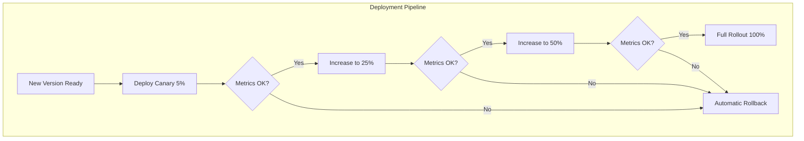

# How to Implement Canary Deployment Configuration

Author: [nawazdhandala](https://www.github.com/nawazdhandala)

Tags: Canary Deployment, DevOps, Release Management, Progressive Delivery, Kubernetes

Description: Configure canary deployments with traffic percentage control, metrics analysis, automatic rollback triggers, and progressive rollout strategies.

---

Shipping new code to production is always a risk. Canary deployments let you minimize that risk by gradually rolling out changes to a small percentage of users first. If the new version behaves well, you increase traffic. If something breaks, you roll back before most users notice. This guide walks through configuring canary deployments with precise traffic control, automated metrics analysis, and rollback triggers.

## How Canary Deployments Work

The idea comes from coal miners who brought canaries into mines to detect toxic gases. In software, the "canary" is a small subset of your deployment that receives new code first. You monitor this subset closely and only proceed if everything looks healthy.



## Configuring Traffic Percentage Control

Traffic splitting is the foundation of canary deployments. With Argo Rollouts, you define steps that gradually shift traffic from stable to canary.

Here is a Rollout configuration with precise traffic percentages:

```yaml
# rollout-traffic-control.yaml
apiVersion: argoproj.io/v1alpha1
kind: Rollout
metadata:
  name: payment-service
  namespace: production
spec:
  replicas: 10
  revisionHistoryLimit: 3
  selector:
    matchLabels:
      app: payment-service
  template:
    metadata:
      labels:
        app: payment-service
    spec:
      containers:
        - name: payment-service
          image: payment-service:2.1.0
          ports:
            - containerPort: 8080
          # Health checks ensure pods are ready before receiving traffic
          readinessProbe:
            httpGet:
              path: /health
              port: 8080
            initialDelaySeconds: 5
            periodSeconds: 10
          livenessProbe:
            httpGet:
              path: /health
              port: 8080
            initialDelaySeconds: 15
            periodSeconds: 20
          resources:
            requests:
              memory: "256Mi"
              cpu: "200m"
            limits:
              memory: "512Mi"
              cpu: "500m"
  strategy:
    canary:
      # Services for traffic routing
      canaryService: payment-service-canary
      stableService: payment-service-stable
      # Traffic routing through Istio
      trafficRouting:
        istio:
          virtualService:
            name: payment-service-vsvc
            routes:
              - primary
      # Progressive traffic steps
      steps:
        # Start with 5% to catch obvious issues
        - setWeight: 5
        - pause: {duration: 2m}
        # Bump to 15% after initial validation
        - setWeight: 15
        - pause: {duration: 5m}
        # Move to 30% for broader testing
        - setWeight: 30
        - pause: {duration: 10m}
        # Half the traffic
        - setWeight: 50
        - pause: {duration: 15m}
        # Almost complete rollout
        - setWeight: 80
        - pause: {duration: 10m}
        # Final step completes automatically
```

The `setWeight` steps control what percentage of traffic goes to the canary. Each `pause` gives you time to observe metrics before proceeding.

## Setting Up Metrics Analysis

Automated analysis removes human judgment from the promotion decision. You define success criteria, and the system checks whether the canary meets them.

Create an AnalysisTemplate that queries your metrics backend:

```yaml
# analysis-template.yaml
apiVersion: argoproj.io/v1alpha1
kind: AnalysisTemplate
metadata:
  name: canary-analysis
  namespace: production
spec:
  # Arguments passed from the Rollout
  args:
    - name: service-name
    - name: namespace
  metrics:
    # Check HTTP success rate stays above 99%
    - name: success-rate
      interval: 30s
      # At least 99% of requests must succeed
      successCondition: result[0] >= 0.99
      # Fail if we see 3 consecutive failures
      failureLimit: 3
      provider:
        prometheus:
          address: http://prometheus.monitoring.svc:9090
          query: |
            sum(rate(
              http_requests_total{
                app="{{args.service-name}}",
                namespace="{{args.namespace}}",
                status=~"2.."
              }[2m]
            )) /
            sum(rate(
              http_requests_total{
                app="{{args.service-name}}",
                namespace="{{args.namespace}}"
              }[2m]
            ))

    # Check p95 latency stays under 200ms
    - name: latency-p95
      interval: 30s
      successCondition: result[0] < 0.2
      failureLimit: 3
      provider:
        prometheus:
          address: http://prometheus.monitoring.svc:9090
          query: |
            histogram_quantile(0.95,
              sum(rate(
                http_request_duration_seconds_bucket{
                  app="{{args.service-name}}",
                  namespace="{{args.namespace}}"
                }[2m]
              )) by (le)
            )

    # Check error rate stays below 1%
    - name: error-rate
      interval: 30s
      # Error rate must be under 1%
      successCondition: result[0] < 0.01
      failureLimit: 2
      provider:
        prometheus:
          address: http://prometheus.monitoring.svc:9090
          query: |
            sum(rate(
              http_requests_total{
                app="{{args.service-name}}",
                namespace="{{args.namespace}}",
                status=~"5.."
              }[2m]
            )) /
            sum(rate(
              http_requests_total{
                app="{{args.service-name}}",
                namespace="{{args.namespace}}"
              }[2m]
            ))
```

Now reference this template in your Rollout:

```yaml
# Add this to your Rollout spec under strategy.canary
analysis:
  templates:
    - templateName: canary-analysis
  # Start analysis after the first step
  startingStep: 1
  args:
    - name: service-name
      value: payment-service
    - name: namespace
      valueFrom:
        fieldRef:
          fieldPath: metadata.namespace
```

## Configuring Automatic Rollback Triggers

Automatic rollback is what makes canary deployments safe. When metrics breach thresholds, the system reverts to the stable version without manual intervention.

Here is a complete configuration with rollback triggers:

```yaml
# rollout-with-rollback.yaml
apiVersion: argoproj.io/v1alpha1
kind: Rollout
metadata:
  name: order-service
spec:
  replicas: 8
  selector:
    matchLabels:
      app: order-service
  template:
    metadata:
      labels:
        app: order-service
    spec:
      containers:
        - name: order-service
          image: order-service:3.0.0
          ports:
            - containerPort: 8080
  strategy:
    canary:
      canaryService: order-service-canary
      stableService: order-service-stable
      trafficRouting:
        istio:
          virtualService:
            name: order-service-vsvc
            routes:
              - primary
      # Anti-affinity spreads canary pods across nodes
      antiAffinity:
        preferredDuringSchedulingIgnoredDuringExecution:
          weight: 100
      steps:
        - setWeight: 10
        # Run analysis during this pause
        - analysis:
            templates:
              - templateName: canary-analysis
            args:
              - name: service-name
                value: order-service
        - setWeight: 30
        - pause: {duration: 5m}
        - setWeight: 60
        - pause: {duration: 10m}
      # Rollback settings
      rollbackWindow:
        # How many revisions to keep for rollback
        revisions: 3
      # Abort conditions trigger immediate rollback
      abortScaleDownDelaySeconds: 30
```

You can also define inline analysis that runs during specific steps:

```yaml
steps:
  - setWeight: 20
  - analysis:
      templates:
        - templateName: canary-analysis
      # Analysis runs for this duration
      args:
        - name: service-name
          value: order-service
  - setWeight: 40
  - pause: {duration: 5m}
```

## Progressive Rollout Strategies

Different services need different rollout speeds. Critical payment services might need slower rollouts than internal tools.

For critical services, use a conservative strategy:

```yaml
# conservative-rollout.yaml
strategy:
  canary:
    steps:
      # Very small initial percentage
      - setWeight: 2
      - pause: {duration: 10m}
      - setWeight: 5
      - pause: {duration: 15m}
      - setWeight: 10
      # Manual approval required
      - pause: {}
      - setWeight: 25
      - pause: {duration: 20m}
      - setWeight: 50
      - pause: {duration: 30m}
      - setWeight: 75
      - pause: {duration: 20m}
```

For less critical services, use an aggressive strategy:

```yaml
# aggressive-rollout.yaml
strategy:
  canary:
    steps:
      - setWeight: 20
      - pause: {duration: 2m}
      - setWeight: 50
      - pause: {duration: 5m}
      - setWeight: 80
      - pause: {duration: 3m}
```

You can also route canary traffic based on headers for targeted testing:

```yaml
# header-based-routing.yaml
strategy:
  canary:
    canaryService: api-canary
    stableService: api-stable
    trafficRouting:
      istio:
        virtualService:
          name: api-vsvc
          routes:
            - primary
    steps:
      # First, route only requests with canary header
      - setHeaderRoute:
          name: canary-header
          match:
            - headerName: X-Canary
              headerValue:
                exact: "true"
      - pause: {duration: 30m}
      # Then add percentage-based routing
      - setWeight: 10
      - pause: {duration: 10m}
      - setWeight: 50
      - pause: {duration: 15m}
```

## Monitoring Your Canary

Set up alerts that fire when canary metrics deviate from the stable version:

```yaml
# canary-alerts.yaml
apiVersion: monitoring.coreos.com/v1
kind: PrometheusRule
metadata:
  name: canary-comparison-alerts
spec:
  groups:
    - name: canary-comparison
      rules:
        # Alert if canary error rate is higher than stable
        - alert: CanaryErrorRateHigherThanStable
          expr: |
            (
              sum(rate(http_requests_total{deployment="canary",status=~"5.."}[5m])) /
              sum(rate(http_requests_total{deployment="canary"}[5m]))
            ) > 1.5 * (
              sum(rate(http_requests_total{deployment="stable",status=~"5.."}[5m])) /
              sum(rate(http_requests_total{deployment="stable"}[5m]))
            )
          for: 3m
          labels:
            severity: warning
          annotations:
            summary: Canary error rate 50% higher than stable

        # Alert if canary latency significantly exceeds stable
        - alert: CanaryLatencyDegraded
          expr: |
            histogram_quantile(0.95, sum(rate(
              http_request_duration_seconds_bucket{deployment="canary"}[5m]
            )) by (le)) > 1.3 * histogram_quantile(0.95, sum(rate(
              http_request_duration_seconds_bucket{deployment="stable"}[5m]
            )) by (le))
          for: 5m
          labels:
            severity: warning
          annotations:
            summary: Canary p95 latency 30% higher than stable
```

## Putting It All Together

A production-ready canary deployment combines all these pieces. You get gradual traffic shifting, continuous metrics validation, and automatic rollback when things go wrong.

The key is tuning the configuration to match your service's requirements. Start with conservative settings and adjust based on your deployment frequency and risk tolerance. Services with high traffic volumes can detect problems faster, so they can progress through canary stages more quickly. Lower traffic services might need longer observation windows to gather statistically significant data.

Canary deployments take effort to set up, but they pay for themselves the first time they catch a bad release before it reaches all your users.
