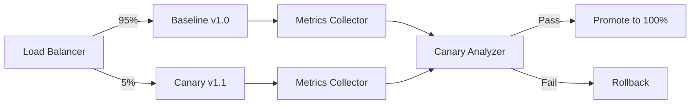
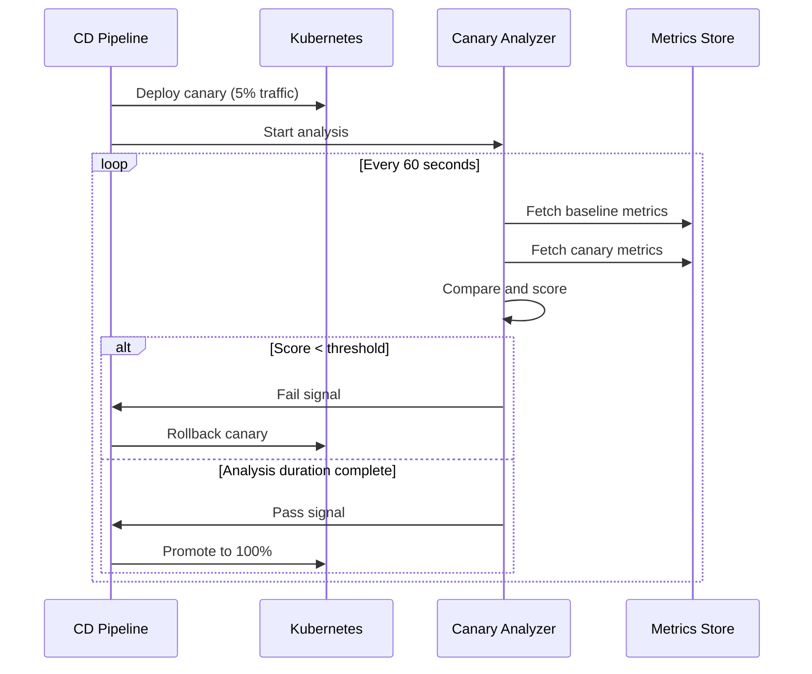

# How to Build Canary Metrics Analysis

Author: [nawazdhandala](https://github.com/nawazdhandala)

Tags: DevOps, Canary, Metrics, Analysis

Description: Learn to build canary metrics analysis for automated deployment decisions.

---

Canary deployments reduce deployment risk by routing a small percentage of traffic to a new version before full rollout. But routing traffic is only half the equation. You need automated metrics analysis to decide whether to promote or rollback the canary. Manual monitoring does not scale, and human judgment under pressure leads to bad calls.

This guide walks through building a canary metrics analysis system from scratch. You will learn how to collect the right metrics, compare canary versus baseline performance, and make automated pass/fail decisions.

## How Canary Analysis Works

The core idea is simple: run the new version alongside the current version, compare their metrics, and decide based on statistical evidence.



The analyzer collects metrics from both versions over a defined time window, runs statistical comparisons, and produces a verdict. This removes human bias and enables faster, safer deployments.

## Key Metrics to Compare

Not all metrics matter equally for canary analysis. Focus on metrics that directly indicate user impact and system health.

**Latency metrics** reveal performance regressions. Track p50, p95, and p99 percentiles rather than averages. A new version might have acceptable average latency but terrible tail latency.

**Error rates** catch bugs and failures. Compare HTTP 5xx rates, exception counts, and timeout rates between canary and baseline.

**Throughput metrics** ensure the canary handles load properly. If the canary processes fewer requests per second at the same load, something is wrong.

**Resource utilization** catches efficiency regressions. Higher CPU or memory usage for the same workload indicates a problem even if user-facing metrics look fine.

Here is a configuration structure that defines which metrics to analyze.

```yaml
# canary-analysis-config.yaml
metrics:
  - name: request_latency_p99
    query: histogram_quantile(0.99, rate(http_request_duration_seconds_bucket{version="{{version}}"}[5m]))
    threshold:
      max_percent_increase: 10
    weight: 40

  - name: error_rate
    query: sum(rate(http_requests_total{status=~"5..",version="{{version}}"}[5m])) / sum(rate(http_requests_total{version="{{version}}"}[5m]))
    threshold:
      max_percent_increase: 5
    weight: 35

  - name: throughput
    query: sum(rate(http_requests_total{version="{{version}}"}[5m]))
    threshold:
      min_percent: 95  # Must handle at least 95% of baseline throughput
    weight: 25

analysis:
  interval: 60s
  duration: 30m
  pass_score: 80
```

## Building the Analysis Engine

The analysis engine is the core component. It fetches metrics, compares them, and scores the canary.

This Python implementation shows the essential logic for fetching metrics and computing comparison scores.

```python
# canary_analyzer.py
import requests
from dataclasses import dataclass
from typing import List, Dict
import statistics

@dataclass
class MetricConfig:
    name: str
    query_template: str
    threshold: Dict
    weight: int

@dataclass
class AnalysisResult:
    metric_name: str
    baseline_value: float
    canary_value: float
    score: float  # 0-100
    passed: bool

class CanaryAnalyzer:
    def __init__(self, prometheus_url: str, config: Dict):
        self.prometheus_url = prometheus_url
        self.metrics = [MetricConfig(**m) for m in config['metrics']]
        self.pass_score = config['analysis']['pass_score']

    def fetch_metric(self, query: str) -> float:
        """Fetch a single metric value from Prometheus."""
        response = requests.get(
            f"{self.prometheus_url}/api/v1/query",
            params={"query": query}
        )
        data = response.json()

        # Handle empty results
        if not data['data']['result']:
            return 0.0

        return float(data['data']['result'][0]['value'][1])

    def compare_metric(self, metric: MetricConfig,
                       baseline_version: str,
                       canary_version: str) -> AnalysisResult:
        """Compare a single metric between baseline and canary."""

        # Build queries for each version
        baseline_query = metric.query_template.replace(
            "{{version}}", baseline_version
        )
        canary_query = metric.query_template.replace(
            "{{version}}", canary_version
        )

        baseline_value = self.fetch_metric(baseline_query)
        canary_value = self.fetch_metric(canary_query)

        # Calculate score based on threshold type
        score = self._calculate_score(
            metric.threshold,
            baseline_value,
            canary_value
        )

        return AnalysisResult(
            metric_name=metric.name,
            baseline_value=baseline_value,
            canary_value=canary_value,
            score=score,
            passed=score >= 50  # Individual metric pass threshold
        )

    def _calculate_score(self, threshold: Dict,
                         baseline: float,
                         canary: float) -> float:
        """Calculate a 0-100 score based on threshold configuration."""

        if 'max_percent_increase' in threshold:
            # Lower is better (latency, error rate)
            if baseline == 0:
                return 100 if canary == 0 else 0

            percent_change = ((canary - baseline) / baseline) * 100
            max_allowed = threshold['max_percent_increase']

            if percent_change <= 0:
                return 100  # Improvement
            elif percent_change >= max_allowed * 2:
                return 0  # Severe regression
            else:
                # Linear interpolation
                return max(0, 100 - (percent_change / max_allowed) * 50)

        elif 'min_percent' in threshold:
            # Higher is better (throughput)
            if baseline == 0:
                return 100 if canary > 0 else 50

            percent_of_baseline = (canary / baseline) * 100
            min_required = threshold['min_percent']

            if percent_of_baseline >= 100:
                return 100
            elif percent_of_baseline < min_required - 20:
                return 0
            else:
                return max(0, (percent_of_baseline - min_required + 20) * 5)

        return 50  # Default neutral score

    def run_analysis(self, baseline_version: str,
                     canary_version: str) -> Dict:
        """Run full canary analysis and return verdict."""

        results = []
        weighted_score = 0
        total_weight = 0

        for metric in self.metrics:
            result = self.compare_metric(
                metric, baseline_version, canary_version
            )
            results.append(result)
            weighted_score += result.score * metric.weight
            total_weight += metric.weight

        final_score = weighted_score / total_weight if total_weight > 0 else 0

        return {
            'verdict': 'pass' if final_score >= self.pass_score else 'fail',
            'score': round(final_score, 2),
            'threshold': self.pass_score,
            'results': [vars(r) for r in results]
        }
```

## Adding Statistical Significance

Simple comparisons can produce false positives due to normal variance. Adding statistical tests reduces noise.

The Mann-Whitney U test works well for comparing two metric distributions without assuming normal distribution. This function extends the analyzer to use multiple data points instead of single values.

```python
# statistical_analysis.py
from scipy import stats
import numpy as np
from typing import List, Tuple

def fetch_metric_series(prometheus_url: str, query: str,
                        duration_minutes: int,
                        step_seconds: int = 60) -> List[float]:
    """Fetch a time series of metric values."""
    import requests
    from datetime import datetime, timedelta

    end_time = datetime.now()
    start_time = end_time - timedelta(minutes=duration_minutes)

    response = requests.get(
        f"{prometheus_url}/api/v1/query_range",
        params={
            "query": query,
            "start": start_time.timestamp(),
            "end": end_time.timestamp(),
            "step": step_seconds
        }
    )

    data = response.json()
    if not data['data']['result']:
        return []

    # Extract values from time series
    values = [float(v[1]) for v in data['data']['result'][0]['values']]
    return values

def compare_with_significance(baseline_values: List[float],
                              canary_values: List[float],
                              alpha: float = 0.05) -> Tuple[bool, float]:
    """
    Compare two metric distributions using Mann-Whitney U test.
    Returns (is_significantly_different, p_value).
    """

    if len(baseline_values) < 5 or len(canary_values) < 5:
        # Not enough data points for statistical test
        return False, 1.0

    # Run Mann-Whitney U test
    statistic, p_value = stats.mannwhitneyu(
        baseline_values,
        canary_values,
        alternative='two-sided'
    )

    is_significant = p_value < alpha

    return is_significant, p_value

def calculate_effect_size(baseline_values: List[float],
                          canary_values: List[float]) -> float:
    """
    Calculate Cohen's d effect size.
    Small: 0.2, Medium: 0.5, Large: 0.8
    """
    baseline_mean = np.mean(baseline_values)
    canary_mean = np.mean(canary_values)

    pooled_std = np.sqrt(
        (np.std(baseline_values)**2 + np.std(canary_values)**2) / 2
    )

    if pooled_std == 0:
        return 0

    return (canary_mean - baseline_mean) / pooled_std
```

## Integrating with Your Deployment Pipeline

The analyzer needs to plug into your CI/CD pipeline. Here is how the analysis loop fits into a canary deployment.



This controller script orchestrates the canary rollout with automated analysis.

```python
# canary_controller.py
import time
import yaml
from canary_analyzer import CanaryAnalyzer

def run_canary_deployment(config_path: str,
                          baseline_version: str,
                          canary_version: str,
                          prometheus_url: str):
    """
    Run a complete canary deployment with automated analysis.
    """

    # Load configuration
    with open(config_path) as f:
        config = yaml.safe_load(f)

    analyzer = CanaryAnalyzer(prometheus_url, config)

    interval = parse_duration(config['analysis']['interval'])
    duration = parse_duration(config['analysis']['duration'])

    start_time = time.time()
    iteration = 0

    print(f"Starting canary analysis: {canary_version} vs {baseline_version}")
    print(f"Duration: {duration}s, Interval: {interval}s")

    while time.time() - start_time < duration:
        iteration += 1
        elapsed = int(time.time() - start_time)

        print(f"\n--- Analysis iteration {iteration} ({elapsed}s elapsed) ---")

        result = analyzer.run_analysis(baseline_version, canary_version)

        print(f"Score: {result['score']} (threshold: {result['threshold']})")

        for metric_result in result['results']:
            status = "PASS" if metric_result['passed'] else "FAIL"
            print(f"  {metric_result['metric_name']}: "
                  f"baseline={metric_result['baseline_value']:.4f}, "
                  f"canary={metric_result['canary_value']:.4f} [{status}]")

        if result['verdict'] == 'fail':
            print(f"\nCANARY FAILED - Score {result['score']} "
                  f"below threshold {result['threshold']}")
            return {'action': 'rollback', 'result': result}

        time.sleep(interval)

    print(f"\nCANARY PASSED - Completed {iteration} iterations")
    return {'action': 'promote', 'result': result}

def parse_duration(duration_str: str) -> int:
    """Parse duration string like '60s' or '30m' to seconds."""
    if duration_str.endswith('s'):
        return int(duration_str[:-1])
    elif duration_str.endswith('m'):
        return int(duration_str[:-1]) * 60
    return int(duration_str)
```

## Handling Edge Cases

Real-world canary analysis needs to handle several edge cases that can cause false results.

**Low traffic periods** produce unreliable metrics. The analyzer should require a minimum sample size before making decisions. Skip analysis iterations when traffic is too low rather than making a judgment on insufficient data.

**Metric lag** can cause the analyzer to compare stale data. Add a warmup period at the start of analysis to allow metrics pipelines to catch up.

**Gradual degradation** may not trigger early alarms but compounds over time. Track cumulative scores across iterations, not just point-in-time comparisons.

This configuration adds safeguards for these scenarios.

```yaml
# canary-analysis-config.yaml (extended)
analysis:
  interval: 60s
  duration: 30m
  pass_score: 80
  warmup_period: 5m  # Skip analysis during warmup
  min_sample_size: 100  # Minimum requests before analysis
  consecutive_failures: 3  # Fail after N consecutive bad scores
```

## What You Get

A properly built canary metrics analysis system delivers faster deployments with lower risk. Developers gain confidence to ship more frequently. On-call engineers spend less time watching dashboards during rollouts. Rollbacks happen automatically before users notice problems.

The components covered here form the foundation. Production systems add features like integration with service mesh traffic shifting, automated rollback through Kubernetes, alert notifications on failures, and historical analysis dashboards.

Start with the core comparison logic and basic threshold checks. Add statistical significance testing once you have the fundamentals working. Integrate with your deployment tooling last, after you trust the analysis results.

Canary analysis turns deployments from stressful events into routine operations. The investment in automation pays back with every release.
