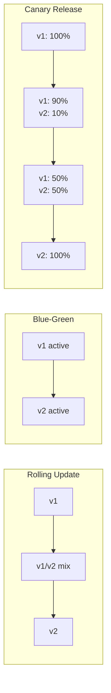
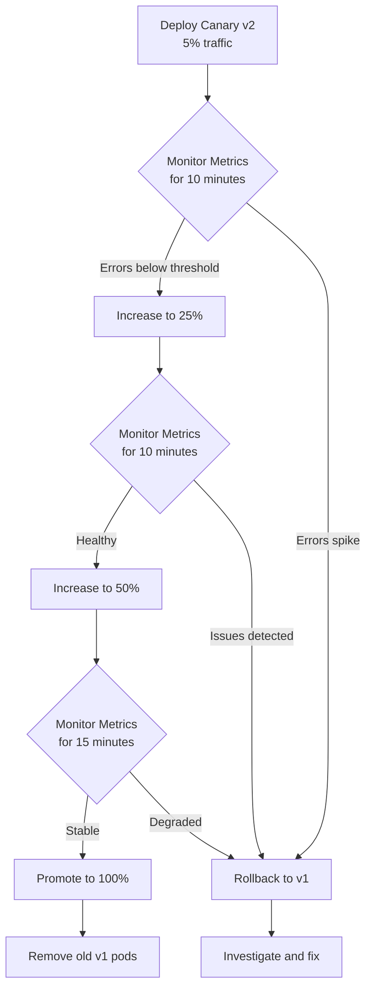
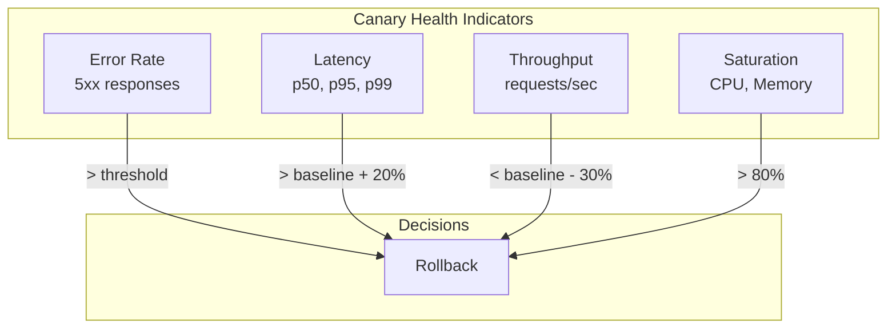

# How to Implement the Canary Release Pattern

Author: [nawazdhandala](https://github.com/nawazdhandala)

Tags: Canary Release, Deployment Patterns, Kubernetes, DevOps, Progressive Delivery, Traffic Management

Description: Learn how to implement the canary release pattern for safer deployments by gradually rolling out changes to a subset of users, monitoring for issues, and automating rollbacks.

---

Deploying new code to production is stressful. No matter how much testing you do in staging, production traffic always finds edge cases you missed. The canary release pattern solves this by letting you test new versions with real production traffic while limiting the blast radius of potential failures.

The name comes from coal miners who used canaries to detect toxic gases. If the canary stopped singing, miners knew to evacuate. In software, your canary deployment serves the same purpose: it detects problems before they affect all your users.

## What Makes Canary Different from Other Patterns

Before diving into implementation, let's understand where canary fits among deployment strategies.



**Rolling updates** replace pods one by one. Simple, but offers no traffic control.

**Blue-green deployments** switch all traffic instantly. Good for rollback speed, but risky since all users get the new version at once.

**Canary releases** give you fine-grained traffic control. You decide exactly what percentage of traffic goes to the new version and can halt the rollout at any point.

## The Canary Release Flow

Here's how a typical canary deployment progresses:



## Manual Canary with Kubernetes

Let's start with a basic implementation using native Kubernetes resources. This approach works without any additional tools.

### Step 1: Deploy the Stable Version

This deployment represents your current production version. We use labels to identify it as the stable release.

```yaml
# stable-deployment.yaml
apiVersion: apps/v1
kind: Deployment
metadata:
  name: myapp-stable
  namespace: production
  labels:
    app: myapp
    version: stable
spec:
  replicas: 9
  selector:
    matchLabels:
      app: myapp
      version: stable
  template:
    metadata:
      labels:
        app: myapp
        version: stable
    spec:
      containers:
        - name: myapp
          image: myregistry/myapp:v1.0.0
          ports:
            - containerPort: 8080
          resources:
            requests:
              memory: "128Mi"
              cpu: "100m"
            limits:
              memory: "256Mi"
              cpu: "200m"
          readinessProbe:
            httpGet:
              path: /health
              port: 8080
            initialDelaySeconds: 5
            periodSeconds: 5
          livenessProbe:
            httpGet:
              path: /health
              port: 8080
            initialDelaySeconds: 15
            periodSeconds: 10
```

### Step 2: Create a Service that Spans Both Versions

The service selector targets all pods with `app: myapp`, regardless of version. This lets both stable and canary pods receive traffic.

```yaml
# service.yaml
apiVersion: v1
kind: Service
metadata:
  name: myapp
  namespace: production
spec:
  selector:
    app: myapp
  ports:
    - port: 80
      targetPort: 8080
  type: ClusterIP
```

### Step 3: Deploy the Canary Version

Start with a single replica. With 9 stable replicas and 1 canary replica, roughly 10% of traffic goes to the canary.

```yaml
# canary-deployment.yaml
apiVersion: apps/v1
kind: Deployment
metadata:
  name: myapp-canary
  namespace: production
  labels:
    app: myapp
    version: canary
spec:
  replicas: 1
  selector:
    matchLabels:
      app: myapp
      version: canary
  template:
    metadata:
      labels:
        app: myapp
        version: canary
    spec:
      containers:
        - name: myapp
          image: myregistry/myapp:v1.1.0
          ports:
            - containerPort: 8080
          resources:
            requests:
              memory: "128Mi"
              cpu: "100m"
            limits:
              memory: "256Mi"
              cpu: "200m"
          readinessProbe:
            httpGet:
              path: /health
              port: 8080
            initialDelaySeconds: 5
            periodSeconds: 5
          livenessProbe:
            httpGet:
              path: /health
              port: 8080
            initialDelaySeconds: 15
            periodSeconds: 10
```

### Step 4: Monitor and Gradually Increase Traffic

Scale the canary up and the stable version down to shift traffic percentages.

```bash
# Check current state
kubectl get deployments -n production -l app=myapp

# Increase canary to ~25% (3 canary, 9 stable = 25%)
kubectl scale deployment myapp-canary -n production --replicas=3

# After validation, go to 50%
kubectl scale deployment myapp-stable -n production --replicas=5
kubectl scale deployment myapp-canary -n production --replicas=5

# Full promotion
kubectl scale deployment myapp-stable -n production --replicas=0
kubectl scale deployment myapp-canary -n production --replicas=10

# Update labels and clean up
kubectl set image deployment/myapp-canary myapp=myregistry/myapp:v1.1.0 -n production
kubectl delete deployment myapp-stable -n production
```

## Precise Traffic Control with Istio

The replica-based approach is simple but imprecise. For exact traffic percentages, use a service mesh like Istio.

### Istio VirtualService for Traffic Splitting

VirtualService allows percentage-based traffic routing independent of replica count. This gives you precise control over how much traffic each version receives.

```yaml
# virtual-service.yaml
apiVersion: networking.istio.io/v1beta1
kind: VirtualService
metadata:
  name: myapp
  namespace: production
spec:
  hosts:
    - myapp
  http:
    - route:
        - destination:
            host: myapp
            subset: stable
          weight: 90
        - destination:
            host: myapp
            subset: canary
          weight: 10
```

### Destination Rules for Version Routing

DestinationRule defines which pods belong to each subset based on their version labels.

```yaml
# destination-rule.yaml
apiVersion: networking.istio.io/v1beta1
kind: DestinationRule
metadata:
  name: myapp
  namespace: production
spec:
  host: myapp
  subsets:
    - name: stable
      labels:
        version: stable
    - name: canary
      labels:
        version: canary
```

### Progressive Traffic Shift Script

This script automates the traffic shift and includes health checks at each stage.

```bash
#!/bin/bash
# canary-promote.sh
# Gradually shifts traffic from stable to canary with health checks

set -e

NAMESPACE="production"
SERVICE="myapp"
HEALTH_URL="http://myapp.production.svc.cluster.local/health"
ERROR_THRESHOLD=1  # Max error rate percentage

# Function to update traffic weights in Istio VirtualService
update_weights() {
    local stable_weight=$1
    local canary_weight=$2

    kubectl patch virtualservice $SERVICE -n $NAMESPACE --type='json' \
        -p="[
            {\"op\": \"replace\", \"path\": \"/spec/http/0/route/0/weight\", \"value\": $stable_weight},
            {\"op\": \"replace\", \"path\": \"/spec/http/0/route/1/weight\", \"value\": $canary_weight}
        ]"

    echo "Traffic split: stable=$stable_weight%, canary=$canary_weight%"
}

# Function to check error rate from Prometheus
check_health() {
    local version=$1
    local window=$2

    # Query Prometheus for error rate (adjust query for your setup)
    error_rate=$(curl -s "http://prometheus:9090/api/v1/query" \
        --data-urlencode "query=sum(rate(http_requests_total{app=\"myapp\",version=\"$version\",status=~\"5..\"}[$window])) / sum(rate(http_requests_total{app=\"myapp\",version=\"$version\"}[$window])) * 100" \
        | jq -r '.data.result[0].value[1] // 0')

    echo "Error rate for $version: $error_rate%"

    if (( $(echo "$error_rate > $ERROR_THRESHOLD" | bc -l) )); then
        return 1
    fi
    return 0
}

# Start canary rollout
echo "Starting canary deployment..."

# Stage 1: 10% canary
update_weights 90 10
sleep 300  # Wait 5 minutes

if ! check_health "canary" "5m"; then
    echo "Canary unhealthy at 10%. Rolling back..."
    update_weights 100 0
    exit 1
fi

# Stage 2: 25% canary
update_weights 75 25
sleep 300

if ! check_health "canary" "5m"; then
    echo "Canary unhealthy at 25%. Rolling back..."
    update_weights 100 0
    exit 1
fi

# Stage 3: 50% canary
update_weights 50 50
sleep 600  # Wait 10 minutes at 50%

if ! check_health "canary" "10m"; then
    echo "Canary unhealthy at 50%. Rolling back..."
    update_weights 100 0
    exit 1
fi

# Stage 4: 100% canary (full promotion)
update_weights 0 100
echo "Canary promoted to 100%. Deployment complete!"
```

## Automated Canary with Argo Rollouts

For production environments, you want automated canary deployments with built-in analysis. Argo Rollouts handles this elegantly.

### Install Argo Rollouts

```bash
kubectl create namespace argo-rollouts
kubectl apply -n argo-rollouts -f https://github.com/argoproj/argo-rollouts/releases/latest/download/install.yaml
```

### Define a Rollout with Canary Strategy

Argo Rollouts replaces Deployments with Rollouts that support canary strategies natively.

```yaml
# rollout.yaml
apiVersion: argoproj.io/v1alpha1
kind: Rollout
metadata:
  name: myapp
  namespace: production
spec:
  replicas: 10
  selector:
    matchLabels:
      app: myapp
  template:
    metadata:
      labels:
        app: myapp
    spec:
      containers:
        - name: myapp
          image: myregistry/myapp:v1.0.0
          ports:
            - containerPort: 8080
          resources:
            requests:
              memory: "128Mi"
              cpu: "100m"
            limits:
              memory: "256Mi"
              cpu: "200m"
  strategy:
    canary:
      # Define the traffic split steps
      steps:
        - setWeight: 5
        - pause: { duration: 5m }
        - setWeight: 20
        - pause: { duration: 5m }
        - setWeight: 50
        - pause: { duration: 10m }
        - setWeight: 80
        - pause: { duration: 5m }
      # Traffic routing configuration for Istio
      trafficRouting:
        istio:
          virtualService:
            name: myapp
            routes:
              - primary
          destinationRule:
            name: myapp
            canarySubsetName: canary
            stableSubsetName: stable
```

### Add Automated Analysis

AnalysisTemplate defines what metrics to check and what thresholds trigger rollback.

```yaml
# analysis-template.yaml
apiVersion: argoproj.io/v1alpha1
kind: AnalysisTemplate
metadata:
  name: success-rate
  namespace: production
spec:
  args:
    - name: service-name
    - name: namespace
  metrics:
    - name: success-rate
      # Check every 60 seconds
      interval: 60s
      # Require at least 3 measurements
      count: 3
      # All measurements must pass
      successCondition: result[0] >= 0.95
      failureLimit: 1
      provider:
        prometheus:
          address: http://prometheus.monitoring:9090
          query: |
            sum(rate(http_requests_total{
              app="{{args.service-name}}",
              namespace="{{args.namespace}}",
              status!~"5.."
            }[5m])) /
            sum(rate(http_requests_total{
              app="{{args.service-name}}",
              namespace="{{args.namespace}}"
            }[5m]))
    - name: latency-p99
      interval: 60s
      count: 3
      successCondition: result[0] <= 500
      failureLimit: 1
      provider:
        prometheus:
          address: http://prometheus.monitoring:9090
          query: |
            histogram_quantile(0.99,
              sum(rate(http_request_duration_seconds_bucket{
                app="{{args.service-name}}",
                namespace="{{args.namespace}}"
              }[5m])) by (le)
            ) * 1000
```

### Attach Analysis to Rollout Steps

Update the rollout to run analysis at key traffic percentages.

```yaml
# rollout-with-analysis.yaml
apiVersion: argoproj.io/v1alpha1
kind: Rollout
metadata:
  name: myapp
  namespace: production
spec:
  replicas: 10
  selector:
    matchLabels:
      app: myapp
  template:
    metadata:
      labels:
        app: myapp
    spec:
      containers:
        - name: myapp
          image: myregistry/myapp:v1.0.0
          ports:
            - containerPort: 8080
  strategy:
    canary:
      steps:
        - setWeight: 5
        - pause: { duration: 2m }
        # Run analysis before increasing past 5%
        - analysis:
            templates:
              - templateName: success-rate
            args:
              - name: service-name
                value: myapp
              - name: namespace
                value: production
        - setWeight: 25
        - pause: { duration: 5m }
        - analysis:
            templates:
              - templateName: success-rate
            args:
              - name: service-name
                value: myapp
              - name: namespace
                value: production
        - setWeight: 50
        - pause: { duration: 10m }
        - analysis:
            templates:
              - templateName: success-rate
            args:
              - name: service-name
                value: myapp
              - name: namespace
                value: production
        - setWeight: 100
      trafficRouting:
        istio:
          virtualService:
            name: myapp
            routes:
              - primary
```

## Canary with Flagger

Flagger is another option that integrates with multiple service meshes and ingress controllers.

### Install Flagger

```bash
helm repo add flagger https://flagger.app
helm upgrade -i flagger flagger/flagger \
  --namespace flagger-system \
  --create-namespace \
  --set meshProvider=istio \
  --set metricsServer=http://prometheus.monitoring:9090
```

### Define a Canary Resource

Flagger uses a Canary CRD that wraps your Deployment and automates the canary process.

```yaml
# flagger-canary.yaml
apiVersion: flagger.app/v1beta1
kind: Canary
metadata:
  name: myapp
  namespace: production
spec:
  targetRef:
    apiVersion: apps/v1
    kind: Deployment
    name: myapp
  # Istio virtual service
  service:
    port: 80
    targetPort: 8080
    gateways:
      - public-gateway.istio-system.svc.cluster.local
    hosts:
      - myapp.example.com
  analysis:
    # Schedule interval
    interval: 1m
    # Max traffic percentage routed to canary
    maxWeight: 50
    # Traffic increment step
    stepWeight: 10
    # Number of iterations before rollback
    threshold: 5
    metrics:
      - name: request-success-rate
        thresholdRange:
          min: 99
        interval: 1m
      - name: request-duration
        thresholdRange:
          max: 500
        interval: 1m
    webhooks:
      - name: load-test
        type: rollout
        url: http://flagger-loadtester.flagger-system/
        metadata:
          type: cmd
          cmd: "hey -z 1m -q 10 -c 2 http://myapp-canary.production/"
```

## Production Monitoring Setup

Your canary is only as good as your monitoring. Here's what to track.

### Key Metrics for Canary Health



### Prometheus Recording Rules for Canary Metrics

These recording rules pre-compute metrics for faster dashboards and alerts.

```yaml
# prometheus-rules.yaml
apiVersion: monitoring.coreos.com/v1
kind: PrometheusRule
metadata:
  name: canary-metrics
  namespace: monitoring
spec:
  groups:
    - name: canary.rules
      interval: 30s
      rules:
        # Error rate by version
        - record: myapp:http_error_rate:5m
          expr: |
            sum(rate(http_requests_total{app="myapp",status=~"5.."}[5m])) by (version)
            /
            sum(rate(http_requests_total{app="myapp"}[5m])) by (version)

        # p99 latency by version
        - record: myapp:http_latency_p99:5m
          expr: |
            histogram_quantile(0.99,
              sum(rate(http_request_duration_seconds_bucket{app="myapp"}[5m])) by (version, le)
            )

        # Request rate by version
        - record: myapp:http_requests:rate5m
          expr: |
            sum(rate(http_requests_total{app="myapp"}[5m])) by (version)
```

### Alerting Rules for Canary Failures

Alerts notify you when canary health degrades so you can investigate or manually rollback if automation fails.

```yaml
# canary-alerts.yaml
apiVersion: monitoring.coreos.com/v1
kind: PrometheusRule
metadata:
  name: canary-alerts
  namespace: monitoring
spec:
  groups:
    - name: canary.alerts
      rules:
        - alert: CanaryHighErrorRate
          expr: myapp:http_error_rate:5m{version="canary"} > 0.01
          for: 2m
          labels:
            severity: critical
          annotations:
            summary: "Canary error rate exceeds 1%"
            description: "Canary version has {{ $value | humanizePercentage }} error rate"

        - alert: CanaryLatencySpike
          expr: |
            myapp:http_latency_p99:5m{version="canary"}
            >
            myapp:http_latency_p99:5m{version="stable"} * 1.5
          for: 5m
          labels:
            severity: warning
          annotations:
            summary: "Canary latency 50% higher than stable"
            description: "p99 latency is {{ $value | humanizeDuration }}"
```

## Header-Based Canary Testing

Before sending production traffic to canary, let your team test it using header-based routing.

### Istio Header Routing

This configuration routes requests with a specific header to the canary, letting internal users test while regular traffic goes to stable.

```yaml
# header-based-routing.yaml
apiVersion: networking.istio.io/v1beta1
kind: VirtualService
metadata:
  name: myapp
  namespace: production
spec:
  hosts:
    - myapp
  http:
    # Route test traffic to canary based on header
    - match:
        - headers:
            x-canary:
              exact: "true"
      route:
        - destination:
            host: myapp
            subset: canary
    # All other traffic goes to stable
    - route:
        - destination:
            host: myapp
            subset: stable
          weight: 100
```

### Testing with Headers

```bash
# Test stable version
curl https://myapp.example.com/api/status

# Test canary version
curl -H "x-canary: true" https://myapp.example.com/api/status

# Internal QA can test canary while production traffic is safe
```

## Rollback Procedures

Things will go wrong. Have rollback procedures ready.

### Manual Rollback

If automated rollback fails, here's how to manually revert.

```bash
# With Argo Rollouts - abort and rollback
kubectl argo rollouts abort myapp -n production
kubectl argo rollouts undo myapp -n production

# With Istio - shift all traffic to stable
kubectl patch virtualservice myapp -n production --type='json' \
    -p='[{"op": "replace", "path": "/spec/http/0/route/0/weight", "value": 100},
        {"op": "replace", "path": "/spec/http/0/route/1/weight", "value": 0}]'

# With native Kubernetes - scale down canary
kubectl scale deployment myapp-canary -n production --replicas=0

# Verify rollback
kubectl get pods -n production -l app=myapp
```

### Automated Rollback Script

This script handles common rollback scenarios and notifies your team.

```bash
#!/bin/bash
# rollback.sh
# Emergency rollback script for canary deployments

set -e

NAMESPACE="production"
APP="myapp"
SLACK_WEBHOOK="${SLACK_WEBHOOK_URL}"

notify_slack() {
    local message=$1
    curl -X POST -H 'Content-type: application/json' \
        --data "{\"text\":\"$message\"}" \
        "$SLACK_WEBHOOK"
}

rollback_istio() {
    echo "Rolling back Istio traffic..."
    kubectl patch virtualservice $APP -n $NAMESPACE --type='json' \
        -p='[{"op": "replace", "path": "/spec/http/0/route/0/weight", "value": 100},
            {"op": "replace", "path": "/spec/http/0/route/1/weight", "value": 0}]'
}

rollback_argo() {
    echo "Rolling back Argo Rollout..."
    kubectl argo rollouts abort $APP -n $NAMESPACE || true
    kubectl argo rollouts undo $APP -n $NAMESPACE
}

rollback_deployment() {
    echo "Rolling back Kubernetes deployment..."
    kubectl scale deployment ${APP}-canary -n $NAMESPACE --replicas=0
    kubectl rollout undo deployment/${APP}-stable -n $NAMESPACE
}

# Determine rollback method
if kubectl get rollout $APP -n $NAMESPACE &> /dev/null; then
    rollback_argo
elif kubectl get virtualservice $APP -n $NAMESPACE &> /dev/null; then
    rollback_istio
else
    rollback_deployment
fi

notify_slack "Canary rollback executed for $APP in $NAMESPACE"

# Verify
echo "Current state:"
kubectl get pods -n $NAMESPACE -l app=$APP
```

## CI/CD Integration

Here's how to integrate canary deployments into your CI/CD pipeline.

### GitHub Actions Workflow

This workflow builds the image, deploys canary, and waits for automated analysis.

```yaml
# .github/workflows/canary-deploy.yaml
name: Canary Deployment

on:
  push:
    branches: [main]

jobs:
  build:
    runs-on: ubuntu-latest
    outputs:
      image-tag: ${{ steps.meta.outputs.tags }}
    steps:
      - uses: actions/checkout@v4

      - name: Set up Docker Buildx
        uses: docker/setup-buildx-action@v3

      - name: Login to Registry
        uses: docker/login-action@v3
        with:
          registry: ghcr.io
          username: ${{ github.actor }}
          password: ${{ secrets.GITHUB_TOKEN }}

      - name: Build and push
        uses: docker/build-push-action@v5
        with:
          push: true
          tags: ghcr.io/${{ github.repository }}:${{ github.sha }}

  deploy-canary:
    needs: build
    runs-on: ubuntu-latest
    steps:
      - uses: actions/checkout@v4

      - name: Setup kubectl
        uses: azure/setup-kubectl@v3

      - name: Configure kubeconfig
        run: |
          echo "${{ secrets.KUBECONFIG }}" | base64 -d > kubeconfig
          export KUBECONFIG=kubeconfig

      - name: Update Rollout image
        run: |
          kubectl argo rollouts set image myapp \
            myapp=ghcr.io/${{ github.repository }}:${{ github.sha }} \
            -n production

      - name: Wait for canary analysis
        run: |
          kubectl argo rollouts status myapp -n production --timeout=30m
        continue-on-error: true
        id: canary-status

      - name: Handle failure
        if: steps.canary-status.outcome == 'failure'
        run: |
          kubectl argo rollouts abort myapp -n production
          echo "Canary failed. Check logs and metrics."
          exit 1
```

## Best Practices Checklist

Before you implement canary releases in production:

**Observability**
- Set up metrics collection with Prometheus or your preferred tool
- Create dashboards comparing stable vs canary versions
- Configure alerts for error rates and latency spikes

**Traffic Management**
- Start with small percentages (5-10%)
- Increase gradually with health checks at each step
- Have automated rollback based on metrics

**Testing**
- Use header-based routing for pre-release testing
- Run load tests against canary before increasing traffic
- Validate feature flags work correctly in canary

**Operations**
- Document rollback procedures
- Practice rollbacks in staging
- Set up on-call alerts for canary failures

---

Canary releases give you confidence when deploying to production. Start with manual canary deployments using replica scaling, graduate to Istio for precise traffic control, then automate everything with Argo Rollouts or Flagger. Your users will thank you for catching bugs before they see them.
