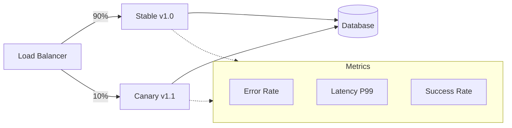
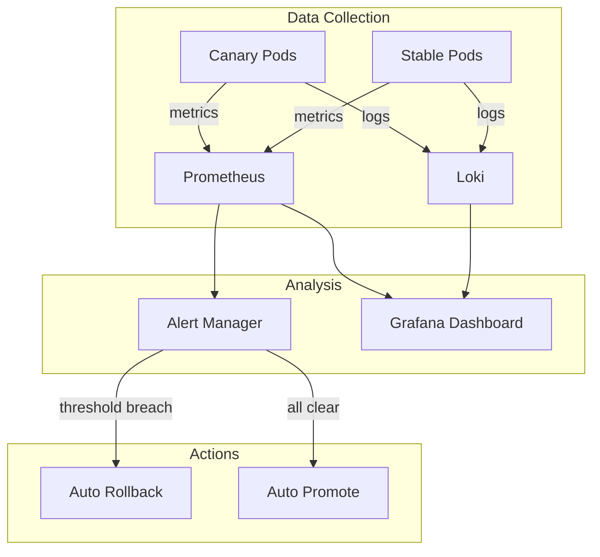
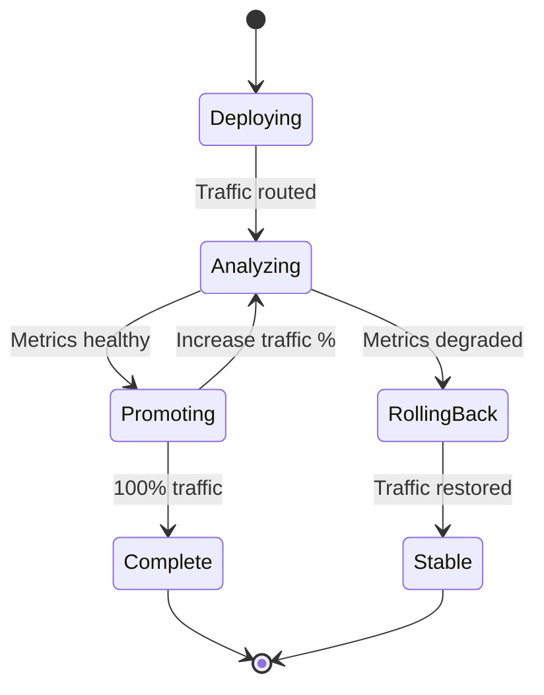

# How to Create Canary Routing

Author: [nawazdhandala](https://github.com/nawazdhandala)

Tags: Deployment, Canary, Routing, Progressive Delivery

Description: Learn how to implement canary routing for safe deployments.

---

Canary deployments let you test new code on a small percentage of real traffic before rolling it out to everyone. When something goes wrong, only a fraction of users are affected, and you can roll back instantly. This guide walks through implementing canary routing from scratch, including traffic splitting, sticky sessions, health monitoring, and automated promotion.

## How Canary Routing Works

The core idea is simple: run two versions of your service simultaneously and route a small percentage of traffic to the new version (the "canary"). If the canary behaves well, gradually increase its traffic share. If it fails, route all traffic back to the stable version.



## 1. Canary Routing Strategies

There are several approaches to implementing canary routing. Choose based on your infrastructure and requirements.

### Weight-Based Routing

The simplest approach: split traffic by percentage. This works at the load balancer or service mesh level.

**Kubernetes with Nginx Ingress:**

```yaml
# canary-ingress.yaml
apiVersion: networking.k8s.io/v1
kind: Ingress
metadata:
  name: api-stable
  annotations:
    nginx.ingress.kubernetes.io/rewrite-target: /
spec:
  ingressClassName: nginx
  rules:
    - host: api.example.com
      http:
        paths:
          - path: /
            pathType: Prefix
            backend:
              service:
                name: api-stable
                port:
                  number: 80
---
apiVersion: networking.k8s.io/v1
kind: Ingress
metadata:
  name: api-canary
  annotations:
    nginx.ingress.kubernetes.io/canary: "true"
    nginx.ingress.kubernetes.io/canary-weight: "10"  # 10% to canary
spec:
  ingressClassName: nginx
  rules:
    - host: api.example.com
      http:
        paths:
          - path: /
            pathType: Prefix
            backend:
              service:
                name: api-canary
                port:
                  number: 80
```

### Header-Based Routing

Route specific users or test traffic to the canary using HTTP headers. Useful for internal testing before exposing to real users.

```yaml
# canary-header-routing.yaml
apiVersion: networking.k8s.io/v1
kind: Ingress
metadata:
  name: api-canary-header
  annotations:
    nginx.ingress.kubernetes.io/canary: "true"
    nginx.ingress.kubernetes.io/canary-by-header: "X-Canary"
    nginx.ingress.kubernetes.io/canary-by-header-value: "true"
spec:
  ingressClassName: nginx
  rules:
    - host: api.example.com
      http:
        paths:
          - path: /
            pathType: Prefix
            backend:
              service:
                name: api-canary
                port:
                  number: 80
```

Test with:

```bash
# Routes to canary
curl -H "X-Canary: true" https://api.example.com/health

# Routes to stable
curl https://api.example.com/health
```

### Cookie-Based Routing

Route users based on a cookie value. Great for ensuring consistent experience during A/B tests.

```yaml
# canary-cookie-routing.yaml
apiVersion: networking.k8s.io/v1
kind: Ingress
metadata:
  name: api-canary-cookie
  annotations:
    nginx.ingress.kubernetes.io/canary: "true"
    nginx.ingress.kubernetes.io/canary-by-cookie: "canary_user"
spec:
  ingressClassName: nginx
  rules:
    - host: api.example.com
      http:
        paths:
          - path: /
            pathType: Prefix
            backend:
              service:
                name: api-canary
                port:
                  number: 80
```

## 2. Traffic Percentage Management

Progressive delivery means gradually increasing canary traffic as confidence grows. Here is a typical progression:

```mermaid
gantt
    title Canary Traffic Progression
    dateFormat HH:mm
    axisFormat %H:%M

    section Traffic %
    1% (smoke test)     :a1, 00:00, 15m
    5% (early users)    :a2, after a1, 30m
    25% (broader test)  :a3, after a2, 60m
    50% (half traffic)  :a4, after a3, 60m
    100% (full rollout) :a5, after a4, 30m
```



### Automated Traffic Ramping Script

```bash
#!/bin/bash
# canary-ramp.sh - Gradually increase canary traffic

NAMESPACE="production"
INGRESS_NAME="api-canary"
PERCENTAGES=(1 5 10 25 50 75 100)
WAIT_BETWEEN_STEPS=300  # 5 minutes

for pct in "${PERCENTAGES[@]}"; do
    echo "Setting canary weight to ${pct}%..."

    kubectl annotate ingress "$INGRESS_NAME" \
        nginx.ingress.kubernetes.io/canary-weight="$pct" \
        --overwrite -n "$NAMESPACE"

    if [ "$pct" -lt 100 ]; then
        echo "Waiting ${WAIT_BETWEEN_STEPS}s before next increment..."
        sleep "$WAIT_BETWEEN_STEPS"

        # Check canary health before proceeding
        ERROR_RATE=$(curl -s "http://prometheus:9090/api/v1/query?query=rate(http_requests_total{version='canary',status=~'5..'}[5m])" | jq '.data.result[0].value[1]')

        if (( $(echo "$ERROR_RATE > 0.01" | bc -l) )); then
            echo "Error rate ${ERROR_RATE} exceeds threshold. Rolling back..."
            kubectl annotate ingress "$INGRESS_NAME" \
                nginx.ingress.kubernetes.io/canary-weight="0" \
                --overwrite -n "$NAMESPACE"
            exit 1
        fi
    fi
done

echo "Canary promotion complete!"
```

### Istio VirtualService Traffic Split

For service mesh users, Istio provides fine-grained traffic control:

```yaml
# istio-canary.yaml
apiVersion: networking.istio.io/v1beta1
kind: VirtualService
metadata:
  name: api
  namespace: production
spec:
  hosts:
    - api.example.com
  http:
    - match:
        - headers:
            x-canary:
              exact: "true"
      route:
        - destination:
            host: api
            subset: canary
    - route:
        - destination:
            host: api
            subset: stable
          weight: 90
        - destination:
            host: api
            subset: canary
          weight: 10
---
apiVersion: networking.istio.io/v1beta1
kind: DestinationRule
metadata:
  name: api
  namespace: production
spec:
  host: api
  subsets:
    - name: stable
      labels:
        version: stable
    - name: canary
      labels:
        version: canary
```

## 3. Sticky Canary Sessions

Users should see consistent behavior during their session. Switching between canary and stable mid-session causes confusion and makes debugging harder.

### Consistent Hash-Based Routing

Route based on user ID or session token to ensure the same user always hits the same version:

```yaml
# istio-consistent-hash.yaml
apiVersion: networking.istio.io/v1beta1
kind: DestinationRule
metadata:
  name: api-sticky
  namespace: production
spec:
  host: api
  trafficPolicy:
    loadBalancer:
      consistentHash:
        httpHeaderName: x-user-id  # Route based on user ID header
```

### Cookie-Based Session Affinity

Nginx can use cookies to maintain session stickiness:

```yaml
# nginx-sticky-canary.yaml
apiVersion: networking.k8s.io/v1
kind: Ingress
metadata:
  name: api-canary-sticky
  annotations:
    nginx.ingress.kubernetes.io/canary: "true"
    nginx.ingress.kubernetes.io/canary-weight: "10"
    nginx.ingress.kubernetes.io/affinity: "cookie"
    nginx.ingress.kubernetes.io/affinity-mode: "persistent"
    nginx.ingress.kubernetes.io/session-cookie-name: "route"
    nginx.ingress.kubernetes.io/session-cookie-expires: "172800"
    nginx.ingress.kubernetes.io/session-cookie-max-age: "172800"
spec:
  ingressClassName: nginx
  rules:
    - host: api.example.com
      http:
        paths:
          - path: /
            pathType: Prefix
            backend:
              service:
                name: api-canary
                port:
                  number: 80
```

### Application-Level Sticky Sessions

For more control, implement stickiness in your application:

```javascript
// canary-router.js
const crypto = require('crypto');

class CanaryRouter {
    constructor(canaryPercent = 10) {
        this.canaryPercent = canaryPercent;
        this.userAssignments = new Map();  // Cache assignments
    }

    // Deterministic routing based on user ID
    shouldRouteToCanary(userId) {
        // Check cache first
        if (this.userAssignments.has(userId)) {
            return this.userAssignments.get(userId);
        }

        // Hash user ID to get consistent bucket
        const hash = crypto.createHash('md5').update(userId).digest('hex');
        const bucket = parseInt(hash.substring(0, 8), 16) % 100;
        const isCanary = bucket < this.canaryPercent;

        // Cache the assignment
        this.userAssignments.set(userId, isCanary);

        return isCanary;
    }

    // Update canary percentage without resetting assignments
    setCanaryPercent(percent) {
        this.canaryPercent = percent;
        this.userAssignments.clear();  // Reset on percentage change
    }
}

// Express middleware
function canaryMiddleware(router) {
    return (req, res, next) => {
        const userId = req.headers['x-user-id'] || req.cookies.userId || 'anonymous';
        req.isCanary = router.shouldRouteToCanary(userId);
        res.setHeader('X-Version', req.isCanary ? 'canary' : 'stable');
        next();
    };
}

module.exports = { CanaryRouter, canaryMiddleware };
```

## 4. Canary Health Monitoring

Monitoring is critical for canary deployments. You need to detect problems quickly before they affect more users.



### Key Metrics to Monitor

Compare these metrics between canary and stable:

```yaml
# prometheus-alerts.yaml
apiVersion: monitoring.coreos.com/v1
kind: PrometheusRule
metadata:
  name: canary-alerts
  namespace: monitoring
spec:
  groups:
    - name: canary-health
      interval: 30s
      rules:
        # Error rate comparison
        - alert: CanaryHighErrorRate
          expr: |
            (
              sum(rate(http_requests_total{version="canary",status=~"5.."}[5m]))
              /
              sum(rate(http_requests_total{version="canary"}[5m]))
            ) > 1.5 * (
              sum(rate(http_requests_total{version="stable",status=~"5.."}[5m]))
              /
              sum(rate(http_requests_total{version="stable"}[5m]))
            )
          for: 2m
          labels:
            severity: critical
          annotations:
            summary: "Canary error rate is 1.5x higher than stable"

        # Latency comparison
        - alert: CanaryHighLatency
          expr: |
            histogram_quantile(0.99,
              sum(rate(http_request_duration_seconds_bucket{version="canary"}[5m])) by (le)
            ) > 1.5 * histogram_quantile(0.99,
              sum(rate(http_request_duration_seconds_bucket{version="stable"}[5m])) by (le)
            )
          for: 2m
          labels:
            severity: warning
          annotations:
            summary: "Canary P99 latency is 1.5x higher than stable"

        # Success rate threshold
        - alert: CanaryLowSuccessRate
          expr: |
            sum(rate(http_requests_total{version="canary",status=~"2.."}[5m]))
            /
            sum(rate(http_requests_total{version="canary"}[5m]))
            < 0.95
          for: 2m
          labels:
            severity: critical
          annotations:
            summary: "Canary success rate below 95%"
```

### Canary Health Check Script

```bash
#!/bin/bash
# check-canary-health.sh

PROMETHEUS_URL="${PROMETHEUS_URL:-http://prometheus:9090}"
CANARY_VERSION="canary"
STABLE_VERSION="stable"

# Thresholds
MAX_ERROR_RATE_RATIO=1.5
MAX_LATENCY_RATIO=2.0
MIN_SUCCESS_RATE=0.95

query_prometheus() {
    local query="$1"
    curl -s "${PROMETHEUS_URL}/api/v1/query" --data-urlencode "query=${query}" | jq -r '.data.result[0].value[1] // "0"'
}

# Calculate error rates
canary_error_rate=$(query_prometheus "sum(rate(http_requests_total{version=\"${CANARY_VERSION}\",status=~\"5..\"}[5m]))/sum(rate(http_requests_total{version=\"${CANARY_VERSION}\"}[5m]))")
stable_error_rate=$(query_prometheus "sum(rate(http_requests_total{version=\"${STABLE_VERSION}\",status=~\"5..\"}[5m]))/sum(rate(http_requests_total{version=\"${STABLE_VERSION}\"}[5m]))")

# Calculate latencies
canary_p99=$(query_prometheus "histogram_quantile(0.99, sum(rate(http_request_duration_seconds_bucket{version=\"${CANARY_VERSION}\"}[5m])) by (le))")
stable_p99=$(query_prometheus "histogram_quantile(0.99, sum(rate(http_request_duration_seconds_bucket{version=\"${STABLE_VERSION}\"}[5m])) by (le))")

# Calculate success rate
canary_success=$(query_prometheus "sum(rate(http_requests_total{version=\"${CANARY_VERSION}\",status=~\"2..\"}[5m]))/sum(rate(http_requests_total{version=\"${CANARY_VERSION}\"}[5m]))")

echo "Canary Health Report"
echo "===================="
echo "Error Rate - Canary: ${canary_error_rate}, Stable: ${stable_error_rate}"
echo "P99 Latency - Canary: ${canary_p99}s, Stable: ${stable_p99}s"
echo "Success Rate - Canary: ${canary_success}"

# Check thresholds
HEALTHY=true

if (( $(echo "$stable_error_rate > 0 && $canary_error_rate / $stable_error_rate > $MAX_ERROR_RATE_RATIO" | bc -l) )); then
    echo "FAIL: Error rate ratio exceeds threshold"
    HEALTHY=false
fi

if (( $(echo "$stable_p99 > 0 && $canary_p99 / $stable_p99 > $MAX_LATENCY_RATIO" | bc -l) )); then
    echo "FAIL: Latency ratio exceeds threshold"
    HEALTHY=false
fi

if (( $(echo "$canary_success < $MIN_SUCCESS_RATE" | bc -l) )); then
    echo "FAIL: Success rate below threshold"
    HEALTHY=false
fi

if $HEALTHY; then
    echo "PASS: Canary is healthy"
    exit 0
else
    exit 1
fi
```

## 5. Automated Promotion and Rollback

The real power of canary deployments comes from automation. Define clear success criteria and let the system decide when to promote or rollback.



### Argo Rollouts for Automated Canary

Argo Rollouts provides native Kubernetes canary deployments with analysis:

```yaml
# argo-canary-rollout.yaml
apiVersion: argoproj.io/v1alpha1
kind: Rollout
metadata:
  name: api
  namespace: production
spec:
  replicas: 10
  selector:
    matchLabels:
      app: api
  template:
    metadata:
      labels:
        app: api
    spec:
      containers:
        - name: api
          image: api:2.0.0
          ports:
            - containerPort: 8080
  strategy:
    canary:
      # Traffic split steps
      steps:
        - setWeight: 5
        - pause: { duration: 5m }
        - analysis:
            templates:
              - templateName: success-rate
            args:
              - name: service-name
                value: api
        - setWeight: 25
        - pause: { duration: 10m }
        - analysis:
            templates:
              - templateName: success-rate
        - setWeight: 50
        - pause: { duration: 10m }
        - analysis:
            templates:
              - templateName: success-rate
        - setWeight: 100

      # Automatic rollback on failure
      abortScaleDownDelaySeconds: 30

      # Traffic routing
      trafficRouting:
        nginx:
          stableIngress: api-stable
          annotationPrefix: nginx.ingress.kubernetes.io
---
apiVersion: argoproj.io/v1alpha1
kind: AnalysisTemplate
metadata:
  name: success-rate
  namespace: production
spec:
  args:
    - name: service-name
  metrics:
    - name: success-rate
      interval: 1m
      count: 5
      successCondition: result[0] >= 0.95
      failureLimit: 3
      provider:
        prometheus:
          address: http://prometheus:9090
          query: |
            sum(rate(http_requests_total{app="{{args.service-name}}",status=~"2.."}[5m]))
            /
            sum(rate(http_requests_total{app="{{args.service-name}}"}[5m]))

    - name: error-rate
      interval: 1m
      count: 5
      successCondition: result[0] <= 0.01
      failureLimit: 3
      provider:
        prometheus:
          address: http://prometheus:9090
          query: |
            sum(rate(http_requests_total{app="{{args.service-name}}",status=~"5.."}[5m]))
            /
            sum(rate(http_requests_total{app="{{args.service-name}}"}[5m]))
```

### Custom Promotion Controller

For environments without Argo Rollouts:

```python
#!/usr/bin/env python3
# canary_controller.py

import time
import requests
from kubernetes import client, config

class CanaryController:
    def __init__(self, namespace, ingress_name, prometheus_url):
        config.load_incluster_config()
        self.networking_v1 = client.NetworkingV1Api()
        self.namespace = namespace
        self.ingress_name = ingress_name
        self.prometheus_url = prometheus_url

        # Progression stages
        self.stages = [5, 10, 25, 50, 75, 100]
        self.current_stage = 0

        # Health thresholds
        self.max_error_rate = 0.01
        self.min_success_rate = 0.95
        self.min_analysis_duration = 300  # 5 minutes

    def query_prometheus(self, query):
        response = requests.get(
            f"{self.prometheus_url}/api/v1/query",
            params={"query": query}
        )
        result = response.json()
        if result["data"]["result"]:
            return float(result["data"]["result"][0]["value"][1])
        return None

    def check_canary_health(self):
        # Query error rate
        error_rate = self.query_prometheus(
            'sum(rate(http_requests_total{version="canary",status=~"5.."}[5m]))'
            '/sum(rate(http_requests_total{version="canary"}[5m]))'
        )

        # Query success rate
        success_rate = self.query_prometheus(
            'sum(rate(http_requests_total{version="canary",status=~"2.."}[5m]))'
            '/sum(rate(http_requests_total{version="canary"}[5m]))'
        )

        print(f"Canary metrics - Error rate: {error_rate}, Success rate: {success_rate}")

        if error_rate is None or success_rate is None:
            print("Insufficient data, waiting...")
            return None

        if error_rate > self.max_error_rate:
            return False
        if success_rate < self.min_success_rate:
            return False

        return True

    def set_canary_weight(self, weight):
        ingress = self.networking_v1.read_namespaced_ingress(
            self.ingress_name,
            self.namespace
        )

        ingress.metadata.annotations["nginx.ingress.kubernetes.io/canary-weight"] = str(weight)

        self.networking_v1.patch_namespaced_ingress(
            self.ingress_name,
            self.namespace,
            ingress
        )
        print(f"Set canary weight to {weight}%")

    def promote(self):
        if self.current_stage >= len(self.stages):
            print("Canary fully promoted!")
            return True

        weight = self.stages[self.current_stage]
        self.set_canary_weight(weight)
        self.current_stage += 1
        return weight == 100

    def rollback(self):
        print("Rolling back canary...")
        self.set_canary_weight(0)
        self.current_stage = 0

    def run(self):
        print("Starting canary controller...")

        while True:
            time.sleep(self.min_analysis_duration)

            health = self.check_canary_health()

            if health is None:
                continue
            elif health:
                complete = self.promote()
                if complete:
                    print("Canary deployment complete!")
                    break
            else:
                self.rollback()
                print("Canary rolled back due to health issues")
                break

if __name__ == "__main__":
    controller = CanaryController(
        namespace="production",
        ingress_name="api-canary",
        prometheus_url="http://prometheus:9090"
    )
    controller.run()
```

## 6. Canary Metrics Collection

Proper instrumentation is essential for comparing canary and stable versions.

### Application Instrumentation

Add version labels to all your metrics:

```javascript
// metrics.js - Express middleware for canary metrics
const promClient = require('prom-client');

const VERSION = process.env.APP_VERSION || 'unknown';

// HTTP request counter with version label
const httpRequestsTotal = new promClient.Counter({
    name: 'http_requests_total',
    help: 'Total HTTP requests',
    labelNames: ['method', 'path', 'status', 'version']
});

// Request duration histogram
const httpRequestDuration = new promClient.Histogram({
    name: 'http_request_duration_seconds',
    help: 'HTTP request duration in seconds',
    labelNames: ['method', 'path', 'version'],
    buckets: [0.001, 0.005, 0.01, 0.025, 0.05, 0.1, 0.25, 0.5, 1, 2.5, 5, 10]
});

// Active requests gauge
const httpActiveRequests = new promClient.Gauge({
    name: 'http_active_requests',
    help: 'Number of active HTTP requests',
    labelNames: ['version']
});

function metricsMiddleware(req, res, next) {
    const start = process.hrtime();

    httpActiveRequests.inc({ version: VERSION });

    res.on('finish', () => {
        const [seconds, nanoseconds] = process.hrtime(start);
        const duration = seconds + nanoseconds / 1e9;

        const path = req.route?.path || req.path;

        httpRequestsTotal.inc({
            method: req.method,
            path: path,
            status: res.statusCode,
            version: VERSION
        });

        httpRequestDuration.observe({
            method: req.method,
            path: path,
            version: VERSION
        }, duration);

        httpActiveRequests.dec({ version: VERSION });
    });

    next();
}

// Expose metrics endpoint
async function metricsHandler(req, res) {
    res.set('Content-Type', promClient.register.contentType);
    res.end(await promClient.register.metrics());
}

module.exports = { metricsMiddleware, metricsHandler };
```

### Grafana Dashboard for Canary Comparison

```json
{
  "title": "Canary vs Stable Comparison",
  "panels": [
    {
      "title": "Request Rate by Version",
      "type": "timeseries",
      "targets": [
        {
          "expr": "sum(rate(http_requests_total{version=\"stable\"}[5m]))",
          "legendFormat": "Stable"
        },
        {
          "expr": "sum(rate(http_requests_total{version=\"canary\"}[5m]))",
          "legendFormat": "Canary"
        }
      ]
    },
    {
      "title": "Error Rate Comparison",
      "type": "timeseries",
      "targets": [
        {
          "expr": "sum(rate(http_requests_total{version=\"stable\",status=~\"5..\"}[5m]))/sum(rate(http_requests_total{version=\"stable\"}[5m]))",
          "legendFormat": "Stable Error Rate"
        },
        {
          "expr": "sum(rate(http_requests_total{version=\"canary\",status=~\"5..\"}[5m]))/sum(rate(http_requests_total{version=\"canary\"}[5m]))",
          "legendFormat": "Canary Error Rate"
        }
      ]
    },
    {
      "title": "P99 Latency Comparison",
      "type": "timeseries",
      "targets": [
        {
          "expr": "histogram_quantile(0.99, sum(rate(http_request_duration_seconds_bucket{version=\"stable\"}[5m])) by (le))",
          "legendFormat": "Stable P99"
        },
        {
          "expr": "histogram_quantile(0.99, sum(rate(http_request_duration_seconds_bucket{version=\"canary\"}[5m])) by (le))",
          "legendFormat": "Canary P99"
        }
      ]
    }
  ]
}
```

### OpenTelemetry Integration

For distributed tracing, tag spans with version information:

```javascript
// tracing.js
const { NodeSDK } = require('@opentelemetry/sdk-node');
const { Resource } = require('@opentelemetry/resources');
const { SemanticResourceAttributes } = require('@opentelemetry/semantic-conventions');

const VERSION = process.env.APP_VERSION || 'unknown';
const IS_CANARY = process.env.IS_CANARY === 'true';

const sdk = new NodeSDK({
    resource: new Resource({
        [SemanticResourceAttributes.SERVICE_NAME]: 'api',
        [SemanticResourceAttributes.SERVICE_VERSION]: VERSION,
        'deployment.environment': process.env.NODE_ENV,
        'deployment.canary': IS_CANARY
    })
});

sdk.start();
```

---

Canary routing transforms deployments from high-stakes events into routine operations. Start with manual traffic splitting to build confidence, then add automated health checks and promotion. The investment in canary infrastructure pays dividends every time you catch a bug before it affects all users.
