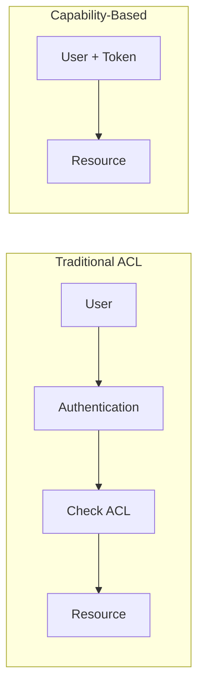
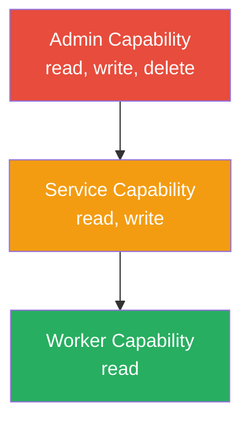
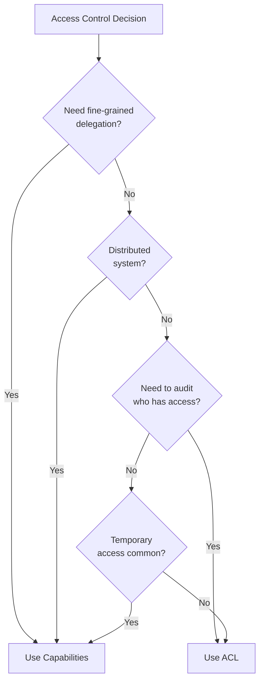

# How to Implement Capability-Based Security

Author: [nawazdhandala](https://github.com/nawazdhandala)

Tags: Security, Capabilities, Authorization, Access Control

Description: Learn to implement capability-based security for object-centric access control.

---

Traditional access control systems ask "who are you?" before granting access. Capability-based security flips this question to "what token do you hold?" This subtle shift creates systems that are easier to reason about, harder to exploit, and naturally support the principle of least privilege.

## What is Capability-Based Security?

A capability is an unforgeable token that grants its holder permission to perform specific operations on a specific resource. Think of it like a movie ticket: the ticket itself grants you entry, not your identity. The theater does not care who you are. They care that you hold a valid ticket.



In ACL systems, the resource maintains a list of who can access it. In capability systems, the user presents a token that proves their right to access. This difference has profound implications for security architecture.

## Core Properties of Capabilities

A proper capability implementation must satisfy three properties:

1. **Unforgeability**: Users cannot create capabilities out of thin air
2. **Transferability**: Capabilities can be delegated to other users or services
3. **Revocability**: The system can invalidate capabilities when needed

Here is a basic capability structure that captures these properties.

```typescript
// Define the structure of a capability token
interface Capability {
  // Unique identifier for this capability
  id: string;

  // The resource this capability grants access to
  resourceId: string;

  // Allowed operations: read, write, delete, admin
  permissions: string[];

  // When this capability expires (Unix timestamp)
  expiresAt: number;

  // Cryptographic signature proving authenticity
  signature: string;

  // Optional: ID of parent capability for delegation chains
  parentCapabilityId?: string;
}
```

## Building a Capability Service

The following implementation shows how to create and verify capabilities using cryptographic signatures. We use HMAC-SHA256 to sign tokens, ensuring they cannot be forged without the secret key.

```typescript
import crypto from 'crypto';

class CapabilityService {
  private secretKey: string;

  // Store revoked capability IDs for invalidation
  private revokedCapabilities: Set<string> = new Set();

  constructor(secretKey: string) {
    this.secretKey = secretKey;
  }

  // Create a new capability token for a resource
  createCapability(
    resourceId: string,
    permissions: string[],
    ttlSeconds: number = 3600
  ): Capability {
    const id = crypto.randomUUID();
    const expiresAt = Math.floor(Date.now() / 1000) + ttlSeconds;

    // Build the payload to sign
    const payload = `${id}:${resourceId}:${permissions.join(',')}:${expiresAt}`;

    // Create HMAC signature to prevent forgery
    const signature = crypto
      .createHmac('sha256', this.secretKey)
      .update(payload)
      .digest('hex');

    return {
      id,
      resourceId,
      permissions,
      expiresAt,
      signature
    };
  }

  // Verify a capability is valid and grants the requested permission
  verifyCapability(
    capability: Capability,
    requiredPermission: string
  ): boolean {
    // Check if capability was revoked
    if (this.revokedCapabilities.has(capability.id)) {
      return false;
    }

    // Check expiration
    const now = Math.floor(Date.now() / 1000);
    if (capability.expiresAt < now) {
      return false;
    }

    // Verify cryptographic signature
    const payload = `${capability.id}:${capability.resourceId}:${capability.permissions.join(',')}:${capability.expiresAt}`;
    const expectedSignature = crypto
      .createHmac('sha256', this.secretKey)
      .update(payload)
      .digest('hex');

    if (capability.signature !== expectedSignature) {
      return false;
    }

    // Check if requested permission is granted
    return capability.permissions.includes(requiredPermission);
  }

  // Revoke a capability immediately
  revokeCapability(capabilityId: string): void {
    this.revokedCapabilities.add(capabilityId);
  }
}
```

## Capability Delegation

One powerful feature of capability-based security is delegation. A user holding a capability can create a restricted version to pass to another service. The delegated capability can never exceed the permissions of its parent.



The delegation method ensures that child capabilities are always a subset of their parent.

```typescript
// Delegate a capability with reduced permissions
delegateCapability(
  parentCapability: Capability,
  delegatedPermissions: string[],
  ttlSeconds: number = 3600
): Capability | null {
  // First verify the parent capability is still valid
  if (!this.verifyCapability(parentCapability, delegatedPermissions[0])) {
    return null;
  }

  // Ensure delegated permissions are subset of parent permissions
  const validPermissions = delegatedPermissions.filter(
    perm => parentCapability.permissions.includes(perm)
  );

  if (validPermissions.length === 0) {
    return null;
  }

  // Calculate expiration: cannot exceed parent
  const parentTtl = parentCapability.expiresAt - Math.floor(Date.now() / 1000);
  const actualTtl = Math.min(ttlSeconds, parentTtl);

  const childCapability = this.createCapability(
    parentCapability.resourceId,
    validPermissions,
    actualTtl
  );

  // Track delegation chain for auditing
  childCapability.parentCapabilityId = parentCapability.id;

  return childCapability;
}
```

## Integrating with Express.js

Here is how to use capabilities in an Express middleware. The middleware extracts the capability from the request header, verifies it, and either allows the request to proceed or returns a 403 error.

```typescript
import express, { Request, Response, NextFunction } from 'express';

const app = express();
const capService = new CapabilityService(process.env.CAPABILITY_SECRET!);

// Middleware to verify capability tokens
function requireCapability(permission: string) {
  return (req: Request, res: Response, next: NextFunction) => {
    // Extract capability from Authorization header
    const authHeader = req.headers.authorization;
    if (!authHeader?.startsWith('Capability ')) {
      return res.status(401).json({ error: 'Missing capability token' });
    }

    // Parse the base64-encoded capability
    const token = authHeader.slice(11);
    let capability: Capability;

    try {
      capability = JSON.parse(Buffer.from(token, 'base64').toString());
    } catch {
      return res.status(401).json({ error: 'Invalid capability format' });
    }

    // Verify the capability grants required permission
    if (!capService.verifyCapability(capability, permission)) {
      return res.status(403).json({ error: 'Insufficient permissions' });
    }

    // Attach capability to request for downstream use
    req.capability = capability;
    next();
  };
}

// Protected endpoint requiring read permission
app.get('/api/documents/:id', requireCapability('read'), (req, res) => {
  const docId = req.params.id;

  // Verify capability is for this specific document
  if (req.capability.resourceId !== docId) {
    return res.status(403).json({ error: 'Capability not valid for this resource' });
  }

  // Fetch and return document
  res.json({ id: docId, content: 'Document content here' });
});
```

## Capability vs ACL: When to Use Each

Both systems have their place. The following diagram shows the decision process.



Use capabilities when:
- Services need to delegate access to other services
- You want to avoid central authorization checks on every request
- Access is often temporary or scoped
- You are building distributed or microservice architectures

Use ACLs when:
- You need a central view of who can access what
- Compliance requires knowing all users with access to a resource
- Access patterns are relatively static
- You have a monolithic application with a central database

## Security Considerations

Capabilities solve some security problems but introduce others. Here are the key concerns and mitigations.

**Token Storage**: Capabilities are bearer tokens. Anyone who obtains one gains access. Store them securely and transmit only over HTTPS.

**Revocation Latency**: Distributed systems may cache capability verification. Use short TTLs (minutes, not days) and implement revocation lists that propagate quickly.

**Audit Trails**: Since capabilities can be delegated, track the delegation chain. Include the parent capability ID so you can trace access back to its source.

**Confused Deputy Prevention**: Always verify the capability's resourceId matches the resource being accessed. A common vulnerability is accepting any valid capability regardless of which resource it targets.

```typescript
// Always check resourceId matches the requested resource
if (capability.resourceId !== requestedResourceId) {
  throw new Error('Capability resource mismatch');
}
```

## Production Checklist

Before deploying capability-based security:

- [ ] Use cryptographically secure random IDs (UUIDv4 or better)
- [ ] Sign capabilities with HMAC-SHA256 or RSA
- [ ] Set reasonable TTLs (default to minutes, not hours)
- [ ] Implement revocation lists with fast propagation
- [ ] Log all capability creation, use, and delegation
- [ ] Verify resourceId on every access
- [ ] Rotate signing keys periodically
- [ ] Rate limit capability creation to prevent abuse

---

Capability-based security provides a robust foundation for authorization in distributed systems. By shifting from "who are you" to "what can you do," you create systems that naturally support least privilege and clean delegation. Start with the core implementation above, add the security hardening from the checklist, and you will have an authorization system that scales with your architecture.
