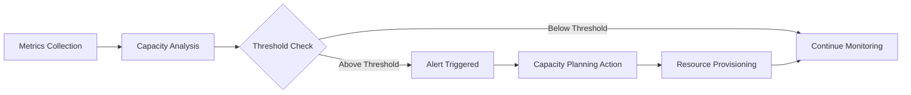
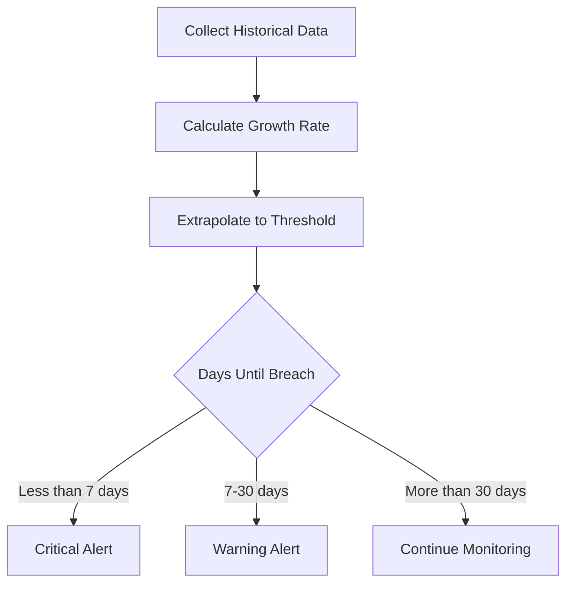
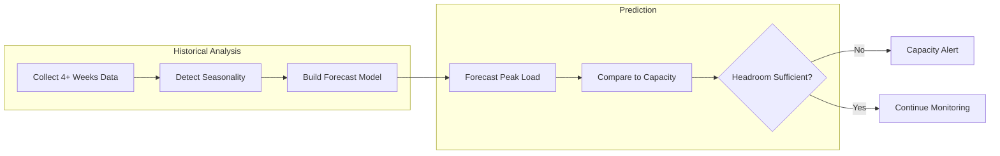
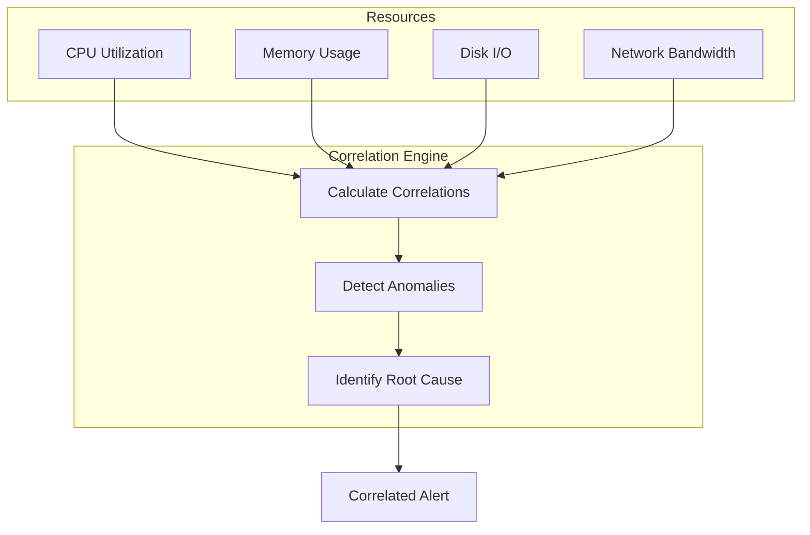
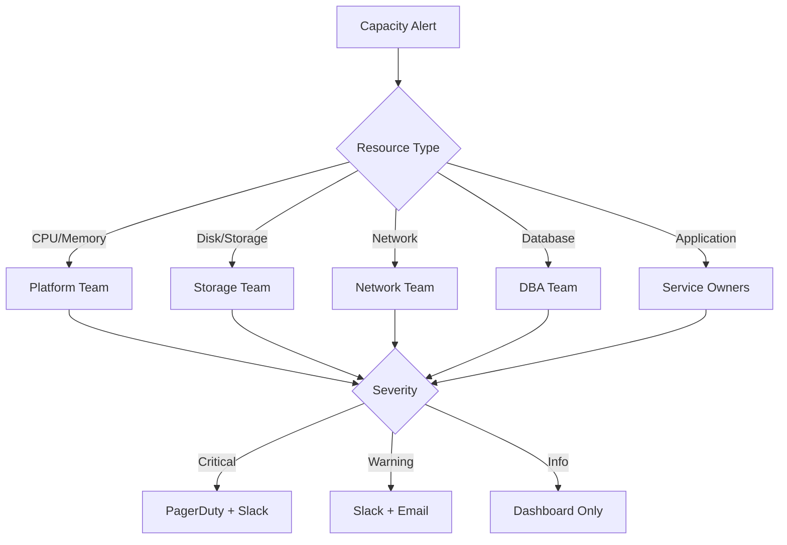

# How to Create Capacity Alerts

Author: [nawazdhandala](https://github.com/nawazdhandala)

Tags: Capacity Planning, Alerting, SRE, Infrastructure

Description: Learn how to set up alerts for capacity-related issues before they impact users.

---

Your database is at 85% disk utilization. CPU usage on your API servers creeps up 2% each week. Memory pressure triggers garbage collection pauses that users feel as latency spikes. Without capacity alerts, you find out about these problems when customers complain or systems crash.

Capacity alerts shift your operations from reactive firefighting to proactive planning. Instead of scrambling at 3 AM when disk space runs out, you get notified weeks in advance with time to provision resources, optimize queries, or archive old data. This guide covers practical approaches to building capacity alerts that catch problems before they become incidents.

## What Are Capacity Alerts?

Capacity alerts monitor resource utilization and growth patterns to warn you before systems hit their limits. Unlike availability alerts that fire when something breaks, capacity alerts fire when something is about to break.

The relationship between capacity monitoring and alerting looks like this:



Capacity alerts cover several resource dimensions:

- **Compute**: CPU utilization, thread pool exhaustion, process limits
- **Memory**: Heap usage, cache pressure, swap utilization
- **Storage**: Disk space, inode count, I/O throughput
- **Network**: Bandwidth saturation, connection limits, socket exhaustion
- **Application**: Queue depths, connection pools, rate limits

## Resource Utilization Alerts

The most fundamental capacity alerts monitor current resource utilization against static thresholds. These catch immediate capacity problems.

### Setting Utilization Thresholds

Good thresholds depend on your system characteristics. A database server needs more headroom than a stateless API server. Here is a configuration structure for utilization-based alerts.

```yaml
# capacity-alerts.yaml
alerts:
  - name: high-cpu-utilization
    description: CPU usage sustained above safe operating threshold
    resource: cpu
    metric: utilization_percent
    threshold: 80
    duration: 10m
    severity: warning
    labels:
      team: infrastructure
      category: capacity

  - name: critical-cpu-utilization
    description: CPU usage at critical levels
    resource: cpu
    metric: utilization_percent
    threshold: 95
    duration: 5m
    severity: critical
    labels:
      team: infrastructure
      category: capacity

  - name: memory-pressure
    description: Memory utilization approaching limit
    resource: memory
    metric: utilization_percent
    threshold: 85
    duration: 5m
    severity: warning
    labels:
      team: infrastructure
      category: capacity

  - name: disk-space-warning
    description: Disk space running low
    resource: disk
    metric: utilization_percent
    threshold: 75
    duration: 1m
    severity: warning
    labels:
      team: infrastructure
      category: capacity

  - name: disk-space-critical
    description: Disk space critically low
    resource: disk
    metric: utilization_percent
    threshold: 90
    duration: 1m
    severity: critical
    labels:
      team: infrastructure
      category: capacity
```

### Implementing Utilization Checks

This Python example demonstrates a utilization alert evaluator that handles multiple resources.

```python
from dataclasses import dataclass
from datetime import datetime, timedelta
from typing import Dict, List, Optional
from collections import defaultdict
import statistics

@dataclass
class UtilizationAlert:
    name: str
    resource: str
    metric: str
    threshold: float
    duration_seconds: int
    severity: str

@dataclass
class AlertEvent:
    alert_name: str
    resource: str
    current_value: float
    threshold: float
    severity: str
    timestamp: datetime
    host: str

class UtilizationAlertEvaluator:
    def __init__(self, alerts: List[UtilizationAlert]):
        self.alerts = alerts
        # Store recent readings per host per resource
        # Key: (host, resource), Value: list of (timestamp, value)
        self.readings: Dict[tuple, List[tuple]] = defaultdict(list)
        # Track which alerts are currently firing
        self.firing: Dict[tuple, datetime] = {}

    def record_metric(
        self,
        host: str,
        resource: str,
        value: float,
        timestamp: datetime
    ) -> List[AlertEvent]:
        """
        Record a metric reading and evaluate alerts.
        Returns list of alert events that should fire.
        """
        key = (host, resource)
        self.readings[key].append((timestamp, value))

        # Keep only readings within the longest alert duration
        max_duration = max(a.duration_seconds for a in self.alerts)
        cutoff = timestamp - timedelta(seconds=max_duration)
        self.readings[key] = [
            (ts, val) for ts, val in self.readings[key]
            if ts >= cutoff
        ]

        # Evaluate each alert for this resource
        events = []
        for alert in self.alerts:
            if alert.resource != resource:
                continue

            event = self._evaluate_alert(alert, host, timestamp)
            if event:
                events.append(event)

        return events

    def _evaluate_alert(
        self,
        alert: UtilizationAlert,
        host: str,
        timestamp: datetime
    ) -> Optional[AlertEvent]:
        """
        Check if an alert condition is met for the given host.
        """
        key = (host, alert.resource)
        readings = self.readings.get(key, [])

        if not readings:
            return None

        # Get readings within the alert duration window
        window_start = timestamp - timedelta(seconds=alert.duration_seconds)
        window_readings = [
            val for ts, val in readings
            if ts >= window_start
        ]

        # Need sufficient data points to evaluate
        # Assume metrics arrive every 15 seconds
        expected_points = alert.duration_seconds // 15
        if len(window_readings) < expected_points * 0.8:
            return None

        # Calculate average over the window
        avg_value = statistics.mean(window_readings)

        # Check threshold
        if avg_value < alert.threshold:
            # Clear firing state if previously firing
            firing_key = (host, alert.name)
            if firing_key in self.firing:
                del self.firing[firing_key]
            return None

        # Threshold exceeded - check if already firing
        firing_key = (host, alert.name)
        if firing_key in self.firing:
            # Already alerted, avoid duplicate
            return None

        # New alert - mark as firing
        self.firing[firing_key] = timestamp

        return AlertEvent(
            alert_name=alert.name,
            resource=alert.resource,
            current_value=round(avg_value, 2),
            threshold=alert.threshold,
            severity=alert.severity,
            timestamp=timestamp,
            host=host
        )

# Usage example
alerts = [
    UtilizationAlert(
        name="high-cpu-utilization",
        resource="cpu",
        metric="utilization_percent",
        threshold=80,
        duration_seconds=600,  # 10 minutes
        severity="warning"
    ),
    UtilizationAlert(
        name="disk-space-warning",
        resource="disk",
        metric="utilization_percent",
        threshold=75,
        duration_seconds=60,
        severity="warning"
    )
]

evaluator = UtilizationAlertEvaluator(alerts)
```

## Growth Trend Alerts

Static thresholds catch immediate problems but miss slowly brewing issues. A disk at 60% utilization seems fine until you realize it grew 15% last month. Growth trend alerts detect these patterns.

### Linear Regression for Trend Detection

The core idea is to fit a line through recent metric values and extrapolate when the threshold will be breached.



Here is an implementation using linear regression.

```python
from dataclasses import dataclass
from datetime import datetime, timedelta
from typing import List, Optional, Tuple
import statistics

@dataclass
class TrendAlert:
    name: str
    resource: str
    threshold: float
    warning_days: int  # Alert if breach within this many days
    critical_days: int  # Critical if breach within this many days

@dataclass
class TrendAlertEvent:
    alert_name: str
    resource: str
    current_value: float
    growth_rate_per_day: float
    days_until_threshold: float
    projected_breach_date: datetime
    severity: str
    host: str
    timestamp: datetime

class GrowthTrendAnalyzer:
    def __init__(
        self,
        lookback_days: int = 14,
        min_data_points: int = 7
    ):
        self.lookback_days = lookback_days
        self.min_data_points = min_data_points
        # Store daily aggregates: {(host, resource): [(date, value)]}
        self.daily_values: dict = {}

    def record_daily_value(
        self,
        host: str,
        resource: str,
        value: float,
        date: datetime
    ):
        """
        Record a daily aggregate value for trend analysis.
        """
        key = (host, resource)
        if key not in self.daily_values:
            self.daily_values[key] = []

        date_only = date.replace(hour=0, minute=0, second=0, microsecond=0)

        # Update or append
        updated = False
        for i, (d, _) in enumerate(self.daily_values[key]):
            if d == date_only:
                self.daily_values[key][i] = (date_only, value)
                updated = True
                break

        if not updated:
            self.daily_values[key].append((date_only, value))

        # Keep only lookback period
        cutoff = date_only - timedelta(days=self.lookback_days)
        self.daily_values[key] = [
            (d, v) for d, v in self.daily_values[key]
            if d >= cutoff
        ]

        # Sort by date
        self.daily_values[key].sort(key=lambda x: x[0])

    def calculate_trend(
        self,
        host: str,
        resource: str
    ) -> Optional[Tuple[float, float]]:
        """
        Calculate linear trend using least squares regression.
        Returns (slope_per_day, current_value) or None if insufficient data.
        """
        key = (host, resource)
        data = self.daily_values.get(key, [])

        if len(data) < self.min_data_points:
            return None

        # Convert dates to numeric (days from first point)
        first_date = data[0][0]
        x_values = [(d - first_date).days for d, _ in data]
        y_values = [v for _, v in data]

        # Calculate means
        x_mean = statistics.mean(x_values)
        y_mean = statistics.mean(y_values)

        # Calculate slope using least squares
        numerator = sum(
            (x - x_mean) * (y - y_mean)
            for x, y in zip(x_values, y_values)
        )
        denominator = sum((x - x_mean) ** 2 for x in x_values)

        if denominator == 0:
            return None

        slope = numerator / denominator
        current_value = y_values[-1]

        return (slope, current_value)

    def evaluate_alert(
        self,
        alert: TrendAlert,
        host: str,
        timestamp: datetime
    ) -> Optional[TrendAlertEvent]:
        """
        Evaluate a trend alert and return event if threshold breach is imminent.
        """
        trend = self.calculate_trend(host, alert.resource)
        if trend is None:
            return None

        slope_per_day, current_value = trend

        # Already at or above threshold
        if current_value >= alert.threshold:
            return TrendAlertEvent(
                alert_name=alert.name,
                resource=alert.resource,
                current_value=round(current_value, 2),
                growth_rate_per_day=round(slope_per_day, 4),
                days_until_threshold=0,
                projected_breach_date=timestamp,
                severity="critical",
                host=host,
                timestamp=timestamp
            )

        # Flat or declining - no alert needed
        if slope_per_day <= 0:
            return None

        # Calculate days until threshold
        remaining = alert.threshold - current_value
        days_until = remaining / slope_per_day

        # Determine severity based on time to breach
        if days_until <= alert.critical_days:
            severity = "critical"
        elif days_until <= alert.warning_days:
            severity = "warning"
        else:
            return None

        breach_date = timestamp + timedelta(days=days_until)

        return TrendAlertEvent(
            alert_name=alert.name,
            resource=alert.resource,
            current_value=round(current_value, 2),
            growth_rate_per_day=round(slope_per_day, 4),
            days_until_threshold=round(days_until, 1),
            projected_breach_date=breach_date,
            severity=severity,
            host=host,
            timestamp=timestamp
        )

# Usage example
analyzer = GrowthTrendAnalyzer(lookback_days=14)

disk_trend_alert = TrendAlert(
    name="disk-growth-trend",
    resource="disk",
    threshold=90.0,  # 90% utilization
    warning_days=30,  # Warn if breach within 30 days
    critical_days=7   # Critical if breach within 7 days
)
```

## Predictive Capacity Alerts

Growth trend alerts assume linear growth. Real systems often show seasonal patterns, burst behavior, or exponential growth. Predictive alerts use historical patterns to forecast future capacity needs.

### Seasonal Pattern Detection

Many systems have predictable patterns: higher traffic during business hours, weekly cycles, monthly billing runs. Predictive alerts account for these patterns.



Here is an implementation that handles daily and weekly seasonality.

```python
from dataclasses import dataclass
from datetime import datetime, timedelta
from typing import Dict, List, Optional
from collections import defaultdict
import statistics

@dataclass
class SeasonalForecast:
    predicted_peak: float
    confidence_interval: tuple
    day_of_week_factor: float
    hour_factor: float
    baseline: float

class SeasonalCapacityPredictor:
    def __init__(self, history_weeks: int = 4):
        self.history_weeks = history_weeks
        # Store hourly values: {(host, resource): {(day_of_week, hour): [values]}}
        self.seasonal_data: Dict[tuple, Dict[tuple, List[float]]] = {}
        # Store raw history for baseline calculation
        self.raw_history: Dict[tuple, List[tuple]] = defaultdict(list)

    def record_metric(
        self,
        host: str,
        resource: str,
        value: float,
        timestamp: datetime
    ):
        """
        Record a metric observation for seasonal analysis.
        """
        key = (host, resource)

        # Initialize seasonal data structure
        if key not in self.seasonal_data:
            self.seasonal_data[key] = defaultdict(list)

        # Extract seasonal components
        day_of_week = timestamp.weekday()  # 0 = Monday
        hour = timestamp.hour
        seasonal_key = (day_of_week, hour)

        self.seasonal_data[key][seasonal_key].append(value)

        # Keep only recent history
        self.raw_history[key].append((timestamp, value))
        cutoff = timestamp - timedelta(weeks=self.history_weeks)
        self.raw_history[key] = [
            (ts, val) for ts, val in self.raw_history[key]
            if ts >= cutoff
        ]

        # Also trim seasonal data to avoid unbounded growth
        max_samples = self.history_weeks * 1  # One sample per week per slot
        for sk in self.seasonal_data[key]:
            if len(self.seasonal_data[key][sk]) > max_samples:
                self.seasonal_data[key][sk] = (
                    self.seasonal_data[key][sk][-max_samples:]
                )

    def forecast_peak(
        self,
        host: str,
        resource: str,
        forecast_days: int = 7
    ) -> Optional[SeasonalForecast]:
        """
        Forecast the peak utilization over the next N days.
        """
        key = (host, resource)

        if key not in self.seasonal_data:
            return None

        seasonal_data = self.seasonal_data[key]
        raw_data = self.raw_history[key]

        # Need sufficient history
        if len(raw_data) < 24 * 7:  # At least 1 week of hourly data
            return None

        # Calculate baseline (overall mean)
        all_values = [val for _, val in raw_data]
        baseline = statistics.mean(all_values)

        # Calculate seasonal factors
        seasonal_means = {}
        for seasonal_key, values in seasonal_data.items():
            if len(values) >= 2:
                seasonal_means[seasonal_key] = statistics.mean(values)

        # Find the peak seasonal factor
        if not seasonal_means:
            return None

        peak_key = max(seasonal_means, key=seasonal_means.get)
        peak_value = seasonal_means[peak_key]

        # Calculate day-of-week and hour factors
        day_of_week, hour = peak_key
        day_factor = peak_value / baseline if baseline > 0 else 1.0

        # Calculate confidence interval using standard deviation
        peak_values = seasonal_data.get(peak_key, [])
        if len(peak_values) >= 2:
            std_dev = statistics.stdev(peak_values)
            confidence_lower = peak_value - (2 * std_dev)
            confidence_upper = peak_value + (2 * std_dev)
        else:
            confidence_lower = peak_value * 0.9
            confidence_upper = peak_value * 1.1

        return SeasonalForecast(
            predicted_peak=round(peak_value, 2),
            confidence_interval=(
                round(confidence_lower, 2),
                round(confidence_upper, 2)
            ),
            day_of_week_factor=round(day_factor, 3),
            hour_factor=round(peak_value / baseline if baseline > 0 else 1.0, 3),
            baseline=round(baseline, 2)
        )

    def check_capacity_alert(
        self,
        host: str,
        resource: str,
        capacity_limit: float,
        headroom_percent: float = 20
    ) -> Optional[dict]:
        """
        Check if predicted peak approaches capacity limit.
        """
        forecast = self.forecast_peak(host, resource)
        if forecast is None:
            return None

        # Use upper confidence bound for safety
        predicted_peak = forecast.confidence_interval[1]
        required_capacity = predicted_peak * (1 + headroom_percent / 100)

        if required_capacity >= capacity_limit:
            return {
                "alert_type": "predictive_capacity",
                "host": host,
                "resource": resource,
                "predicted_peak": forecast.predicted_peak,
                "confidence_upper": forecast.confidence_interval[1],
                "required_capacity": round(required_capacity, 2),
                "capacity_limit": capacity_limit,
                "headroom_percent": headroom_percent,
                "recommendation": f"Increase capacity to {round(required_capacity * 1.2, 2)}"
            }

        return None
```

## Multi-Resource Correlation

Capacity problems rarely affect a single resource in isolation. High CPU often correlates with memory pressure. Network saturation affects database response times. Multi-resource correlation alerts detect these compound conditions.

### Correlation Matrix for Capacity



Here is an implementation for multi-resource correlation.

```python
from dataclasses import dataclass
from datetime import datetime, timedelta
from typing import Dict, List, Optional, Set
from collections import defaultdict
import statistics

@dataclass
class CorrelatedAlert:
    primary_resource: str
    correlated_resources: List[str]
    correlation_scores: Dict[str, float]
    values: Dict[str, float]
    severity: str
    timestamp: datetime
    host: str
    likely_cause: str

class MultiResourceCorrelator:
    def __init__(
        self,
        correlation_window_minutes: int = 30,
        correlation_threshold: float = 0.7
    ):
        self.window_minutes = correlation_window_minutes
        self.correlation_threshold = correlation_threshold
        # Store time series: {(host, resource): [(timestamp, value)]}
        self.time_series: Dict[tuple, List[tuple]] = defaultdict(list)
        # Define expected correlations
        self.known_correlations = {
            "cpu": ["memory", "network_in"],
            "memory": ["cpu", "disk_io"],
            "disk_io": ["memory", "cpu"],
            "network_in": ["cpu", "memory"],
            "network_out": ["cpu", "disk_io"]
        }
        # Thresholds per resource
        self.thresholds = {
            "cpu": {"warning": 70, "critical": 90},
            "memory": {"warning": 75, "critical": 90},
            "disk_io": {"warning": 70, "critical": 85},
            "network_in": {"warning": 70, "critical": 90},
            "network_out": {"warning": 70, "critical": 90}
        }

    def record_metrics(
        self,
        host: str,
        metrics: Dict[str, float],
        timestamp: datetime
    ):
        """
        Record multiple resource metrics at a point in time.
        """
        cutoff = timestamp - timedelta(minutes=self.window_minutes)

        for resource, value in metrics.items():
            key = (host, resource)
            self.time_series[key].append((timestamp, value))
            # Trim old data
            self.time_series[key] = [
                (ts, val) for ts, val in self.time_series[key]
                if ts >= cutoff
            ]

    def calculate_correlation(
        self,
        host: str,
        resource_a: str,
        resource_b: str
    ) -> Optional[float]:
        """
        Calculate Pearson correlation between two resources.
        """
        key_a = (host, resource_a)
        key_b = (host, resource_b)

        series_a = self.time_series.get(key_a, [])
        series_b = self.time_series.get(key_b, [])

        if len(series_a) < 5 or len(series_b) < 5:
            return None

        # Align timestamps (within 1 minute tolerance)
        aligned_a = []
        aligned_b = []

        for ts_a, val_a in series_a:
            for ts_b, val_b in series_b:
                if abs((ts_a - ts_b).total_seconds()) < 60:
                    aligned_a.append(val_a)
                    aligned_b.append(val_b)
                    break

        if len(aligned_a) < 5:
            return None

        # Calculate Pearson correlation
        mean_a = statistics.mean(aligned_a)
        mean_b = statistics.mean(aligned_b)

        numerator = sum(
            (a - mean_a) * (b - mean_b)
            for a, b in zip(aligned_a, aligned_b)
        )

        std_a = statistics.stdev(aligned_a) if len(aligned_a) > 1 else 1
        std_b = statistics.stdev(aligned_b) if len(aligned_b) > 1 else 1

        denominator = (len(aligned_a) - 1) * std_a * std_b

        if denominator == 0:
            return None

        return numerator / denominator

    def check_correlated_alerts(
        self,
        host: str,
        timestamp: datetime
    ) -> List[CorrelatedAlert]:
        """
        Check for correlated capacity issues across resources.
        """
        alerts = []

        # Get current values for all resources
        current_values = {}
        for resource in self.thresholds:
            key = (host, resource)
            series = self.time_series.get(key, [])
            if series:
                # Use most recent value
                current_values[resource] = series[-1][1]

        # Find resources above threshold
        elevated_resources: Set[str] = set()
        for resource, value in current_values.items():
            if value >= self.thresholds[resource]["warning"]:
                elevated_resources.add(resource)

        # Check for correlated elevation
        for primary in elevated_resources:
            correlated = []
            scores = {}

            expected_correlates = self.known_correlations.get(primary, [])

            for related in expected_correlates:
                if related in elevated_resources:
                    corr = self.calculate_correlation(host, primary, related)
                    if corr is not None and corr >= self.correlation_threshold:
                        correlated.append(related)
                        scores[related] = round(corr, 3)

            if correlated:
                # Determine severity
                primary_value = current_values[primary]
                if primary_value >= self.thresholds[primary]["critical"]:
                    severity = "critical"
                else:
                    severity = "warning"

                # Identify likely root cause
                likely_cause = self._identify_cause(
                    primary, correlated, current_values
                )

                alerts.append(CorrelatedAlert(
                    primary_resource=primary,
                    correlated_resources=correlated,
                    correlation_scores=scores,
                    values=current_values,
                    severity=severity,
                    timestamp=timestamp,
                    host=host,
                    likely_cause=likely_cause
                ))

        return alerts

    def _identify_cause(
        self,
        primary: str,
        correlated: List[str],
        values: Dict[str, float]
    ) -> str:
        """
        Attempt to identify the root cause of correlated resource pressure.
        """
        if primary == "cpu" and "memory" in correlated:
            if values.get("memory", 0) > values.get("cpu", 0):
                return "Memory pressure causing CPU load (possible GC activity)"
            return "CPU-intensive workload causing memory allocation"

        if primary == "memory" and "disk_io" in correlated:
            return "Memory pressure causing swap activity or page faults"

        if primary == "disk_io" and "cpu" in correlated:
            return "High I/O wait consuming CPU time"

        if primary == "network_in" and "cpu" in correlated:
            return "High network traffic consuming CPU for packet processing"

        return f"Elevated {primary} correlating with {', '.join(correlated)}"
```

## Alert Routing by Resource Type

Different capacity alerts need different response teams and escalation paths. Disk alerts go to storage engineers. Network alerts go to the network team. Here is how to implement resource-aware routing.



### Routing Configuration

```yaml
# alert-routing.yaml
routing:
  default:
    warning:
      - channel: slack
        target: "#capacity-alerts"
    critical:
      - channel: pagerduty
        service: infrastructure
      - channel: slack
        target: "#capacity-critical"

  resource_routes:
    cpu:
      team: platform
      channels:
        warning:
          - slack: "#platform-team"
        critical:
          - pagerduty: platform-oncall
          - slack: "#platform-critical"

    memory:
      team: platform
      channels:
        warning:
          - slack: "#platform-team"
        critical:
          - pagerduty: platform-oncall
          - slack: "#platform-critical"

    disk:
      team: storage
      channels:
        warning:
          - slack: "#storage-team"
          - email: storage@company.com
        critical:
          - pagerduty: storage-oncall
          - slack: "#storage-critical"

    network:
      team: network
      channels:
        warning:
          - slack: "#network-team"
        critical:
          - pagerduty: network-oncall
          - slack: "#network-critical"

    database:
      team: dba
      channels:
        warning:
          - slack: "#dba-team"
        critical:
          - pagerduty: dba-oncall
          - slack: "#dba-critical"
          - email: dba-emergency@company.com
```

### Routing Implementation

```python
from dataclasses import dataclass
from typing import Dict, List, Optional
import yaml

@dataclass
class NotificationTarget:
    channel: str  # slack, pagerduty, email
    target: str   # channel name, service key, or email address

@dataclass
class RoutingDecision:
    team: str
    targets: List[NotificationTarget]
    escalation_path: List[str]

class CapacityAlertRouter:
    def __init__(self, config_path: str):
        with open(config_path) as f:
            self.config = yaml.safe_load(f)

        self.resource_routes = self.config.get("routing", {}).get(
            "resource_routes", {}
        )
        self.default_routes = self.config.get("routing", {}).get("default", {})

    def route_alert(
        self,
        resource: str,
        severity: str,
        host: str,
        service: Optional[str] = None
    ) -> RoutingDecision:
        """
        Determine where to send a capacity alert based on resource and severity.
        """
        # Get resource-specific routing
        resource_config = self.resource_routes.get(resource, {})

        # Get team assignment
        team = resource_config.get("team", "infrastructure")

        # Get notification channels
        channels = resource_config.get("channels", {}).get(
            severity,
            self.default_routes.get(severity, [])
        )

        targets = []
        for channel_config in channels:
            if isinstance(channel_config, dict):
                for channel_type, target in channel_config.items():
                    targets.append(NotificationTarget(
                        channel=channel_type,
                        target=target
                    ))
            elif isinstance(channel_config, str):
                targets.append(NotificationTarget(
                    channel="slack",
                    target=channel_config
                ))

        # Build escalation path
        escalation = self._build_escalation_path(team, severity)

        return RoutingDecision(
            team=team,
            targets=targets,
            escalation_path=escalation
        )

    def _build_escalation_path(
        self,
        team: str,
        severity: str
    ) -> List[str]:
        """
        Define escalation path based on team and severity.
        """
        base_path = [f"{team}-oncall"]

        if severity == "critical":
            base_path.extend([
                f"{team}-lead",
                f"{team}-manager",
                "infrastructure-director"
            ])
        elif severity == "warning":
            base_path.extend([f"{team}-lead"])

        return base_path

    def format_notification(
        self,
        alert: dict,
        routing: RoutingDecision
    ) -> Dict[str, str]:
        """
        Format alert notification with context.
        """
        return {
            "title": f"[{alert['severity'].upper()}] Capacity Alert: {alert['resource']}",
            "body": f"""
Host: {alert['host']}
Resource: {alert['resource']}
Current Value: {alert['current_value']}
Threshold: {alert['threshold']}
Team: {routing.team}
Escalation: {' -> '.join(routing.escalation_path)}

{alert.get('recommendation', '')}
            """.strip(),
            "priority": "high" if alert["severity"] == "critical" else "normal"
        }
```

## Capacity Alert Playbooks

Alerts without action plans create confusion. Each capacity alert should link to a runbook that guides the on-call engineer through diagnosis and remediation.

### Playbook Structure

```yaml
# playbooks/disk-capacity.yaml
name: Disk Space Capacity Alert
resource: disk
trigger: disk utilization > 75%

diagnosis:
  steps:
    - name: Identify large directories
      command: du -sh /* 2>/dev/null | sort -hr | head -20

    - name: Find largest files
      command: find / -type f -size +100M -exec ls -lh {} \; 2>/dev/null | sort -k5 -hr | head -20

    - name: Check for runaway logs
      command: |
        ls -lhS /var/log/*.log | head -10
        journalctl --disk-usage

    - name: Identify deleted but open files
      command: lsof +L1 | grep deleted

    - name: Check application temp directories
      command: |
        du -sh /tmp/*
        du -sh /var/tmp/*

immediate_actions:
  - name: Clear application caches
    risk: low
    command: |
      # Clear package manager caches
      apt-get clean || yum clean all
      # Clear npm cache
      npm cache clean --force

  - name: Rotate and compress logs
    risk: low
    command: |
      logrotate -f /etc/logrotate.conf
      journalctl --vacuum-time=7d

  - name: Remove old container images
    risk: low
    command: |
      docker system prune -af --volumes

escalation_triggers:
  - condition: utilization > 95%
    action: Page storage team immediately

  - condition: utilization > 90% AND growing
    action: Begin emergency capacity expansion

  - condition: database disk
    action: Notify DBA team for potential data archival

long_term_fixes:
  - Implement log retention policies
  - Add monitoring for large file creation
  - Set up automated cleanup jobs
  - Consider storage tier migration
  - Review data archival strategy
```

### Playbook Integration

```python
from dataclasses import dataclass
from typing import Dict, List, Optional
import yaml
import subprocess

@dataclass
class DiagnosisStep:
    name: str
    command: str
    output: Optional[str] = None

@dataclass
class ActionStep:
    name: str
    risk: str
    command: str
    executed: bool = False
    result: Optional[str] = None

class CapacityPlaybook:
    def __init__(self, playbook_path: str):
        with open(playbook_path) as f:
            self.playbook = yaml.safe_load(f)

        self.name = self.playbook["name"]
        self.resource = self.playbook["resource"]
        self.diagnosis_steps = [
            DiagnosisStep(name=s["name"], command=s["command"])
            for s in self.playbook.get("diagnosis", {}).get("steps", [])
        ]
        self.immediate_actions = [
            ActionStep(name=a["name"], risk=a["risk"], command=a["command"])
            for a in self.playbook.get("immediate_actions", [])
        ]

    def run_diagnosis(self, dry_run: bool = False) -> List[DiagnosisStep]:
        """
        Execute diagnosis steps and collect results.
        """
        results = []

        for step in self.diagnosis_steps:
            if dry_run:
                step.output = f"[DRY RUN] Would execute: {step.command[:50]}..."
            else:
                try:
                    result = subprocess.run(
                        step.command,
                        shell=True,
                        capture_output=True,
                        text=True,
                        timeout=30
                    )
                    step.output = result.stdout or result.stderr
                except subprocess.TimeoutExpired:
                    step.output = "Command timed out"
                except Exception as e:
                    step.output = f"Error: {str(e)}"

            results.append(step)

        return results

    def get_safe_actions(self) -> List[ActionStep]:
        """
        Return only low-risk immediate actions.
        """
        return [a for a in self.immediate_actions if a.risk == "low"]

    def execute_action(
        self,
        action: ActionStep,
        dry_run: bool = False
    ) -> ActionStep:
        """
        Execute a remediation action.
        """
        if dry_run:
            action.result = f"[DRY RUN] Would execute: {action.command[:50]}..."
            action.executed = False
        else:
            try:
                result = subprocess.run(
                    action.command,
                    shell=True,
                    capture_output=True,
                    text=True,
                    timeout=60
                )
                action.result = result.stdout or result.stderr
                action.executed = True
            except Exception as e:
                action.result = f"Error: {str(e)}"
                action.executed = False

        return action

    def generate_incident_summary(
        self,
        diagnosis_results: List[DiagnosisStep],
        actions_taken: List[ActionStep]
    ) -> str:
        """
        Generate a summary for the incident report.
        """
        summary = f"""
# Capacity Incident: {self.name}

## Diagnosis Results

"""
        for step in diagnosis_results:
            summary += f"### {step.name}\n```\n{step.output}\n```\n\n"

        summary += "## Actions Taken\n\n"
        for action in actions_taken:
            status = "Executed" if action.executed else "Skipped"
            summary += f"- **{action.name}** [{action.risk} risk]: {status}\n"
            if action.result:
                summary += f"  ```\n  {action.result}\n  ```\n"

        summary += f"\n## Recommended Long-term Fixes\n\n"
        for fix in self.playbook.get("long_term_fixes", []):
            summary += f"- {fix}\n"

        return summary
```

## Putting It All Together

Here is a complete example that combines all the capacity alerting concepts into a unified system.

```python
from dataclasses import dataclass
from datetime import datetime
from typing import Dict, List, Optional
import json

@dataclass
class CapacityAlertConfig:
    utilization_alerts: List[dict]
    trend_alerts: List[dict]
    routing_config: dict
    playbook_paths: Dict[str, str]

class CapacityAlertingSystem:
    def __init__(self, config: CapacityAlertConfig):
        self.utilization_evaluator = UtilizationAlertEvaluator(
            [UtilizationAlert(**a) for a in config.utilization_alerts]
        )
        self.trend_analyzer = GrowthTrendAnalyzer()
        self.correlator = MultiResourceCorrelator()
        self.predictor = SeasonalCapacityPredictor()

        # Initialize routing and playbooks
        self.routing_config = config.routing_config
        self.playbooks = {
            resource: CapacityPlaybook(path)
            for resource, path in config.playbook_paths.items()
        }

    def process_metrics(
        self,
        host: str,
        metrics: Dict[str, float],
        timestamp: datetime
    ) -> List[dict]:
        """
        Process incoming metrics through all alert evaluators.
        """
        all_alerts = []

        # Check utilization alerts
        for resource, value in metrics.items():
            utilization_events = self.utilization_evaluator.record_metric(
                host, resource, value, timestamp
            )
            for event in utilization_events:
                all_alerts.append({
                    "type": "utilization",
                    "alert_name": event.alert_name,
                    "resource": event.resource,
                    "current_value": event.current_value,
                    "threshold": event.threshold,
                    "severity": event.severity,
                    "host": host,
                    "timestamp": timestamp.isoformat()
                })

        # Record for trend analysis (daily aggregation handled internally)
        for resource, value in metrics.items():
            self.trend_analyzer.record_daily_value(
                host, resource, value, timestamp
            )

        # Record for correlation analysis
        self.correlator.record_metrics(host, metrics, timestamp)

        # Record for seasonal prediction
        for resource, value in metrics.items():
            self.predictor.record_metric(host, resource, value, timestamp)

        # Check correlated alerts
        correlated_alerts = self.correlator.check_correlated_alerts(
            host, timestamp
        )
        for alert in correlated_alerts:
            all_alerts.append({
                "type": "correlated",
                "primary_resource": alert.primary_resource,
                "correlated_resources": alert.correlated_resources,
                "correlation_scores": alert.correlation_scores,
                "values": alert.values,
                "severity": alert.severity,
                "host": host,
                "likely_cause": alert.likely_cause,
                "timestamp": timestamp.isoformat()
            })

        return all_alerts

    def run_daily_trend_check(
        self,
        hosts: List[str],
        resources: List[str],
        trend_alerts: List[TrendAlert],
        timestamp: datetime
    ) -> List[dict]:
        """
        Run daily trend analysis for all hosts and resources.
        """
        all_alerts = []

        for host in hosts:
            for alert in trend_alerts:
                event = self.trend_analyzer.evaluate_alert(
                    alert, host, timestamp
                )
                if event:
                    all_alerts.append({
                        "type": "trend",
                        "alert_name": event.alert_name,
                        "resource": event.resource,
                        "current_value": event.current_value,
                        "growth_rate_per_day": event.growth_rate_per_day,
                        "days_until_threshold": event.days_until_threshold,
                        "projected_breach_date": (
                            event.projected_breach_date.isoformat()
                        ),
                        "severity": event.severity,
                        "host": host,
                        "timestamp": timestamp.isoformat()
                    })

        return all_alerts

    def get_playbook_for_alert(
        self,
        alert: dict
    ) -> Optional[CapacityPlaybook]:
        """
        Get the appropriate playbook for an alert.
        """
        resource = alert.get("resource") or alert.get("primary_resource")
        return self.playbooks.get(resource)

    def format_alert_notification(self, alert: dict) -> str:
        """
        Format an alert for notification.
        """
        alert_type = alert["type"]

        if alert_type == "utilization":
            return f"""
CAPACITY ALERT [{alert['severity'].upper()}]
Host: {alert['host']}
Resource: {alert['resource']}
Current: {alert['current_value']}%
Threshold: {alert['threshold']}%
Time: {alert['timestamp']}
            """.strip()

        elif alert_type == "trend":
            return f"""
CAPACITY TREND ALERT [{alert['severity'].upper()}]
Host: {alert['host']}
Resource: {alert['resource']}
Current: {alert['current_value']}%
Growth Rate: {alert['growth_rate_per_day']}% per day
Days Until Threshold: {alert['days_until_threshold']}
Projected Breach: {alert['projected_breach_date']}
            """.strip()

        elif alert_type == "correlated":
            return f"""
CORRELATED CAPACITY ALERT [{alert['severity'].upper()}]
Host: {alert['host']}
Primary Resource: {alert['primary_resource']}
Correlated: {', '.join(alert['correlated_resources'])}
Likely Cause: {alert['likely_cause']}
Values: {json.dumps(alert['values'], indent=2)}
            """.strip()

        return json.dumps(alert, indent=2)

# Example usage
if __name__ == "__main__":
    config = CapacityAlertConfig(
        utilization_alerts=[
            {
                "name": "high-cpu",
                "resource": "cpu",
                "metric": "utilization_percent",
                "threshold": 80,
                "duration_seconds": 600,
                "severity": "warning"
            },
            {
                "name": "disk-warning",
                "resource": "disk",
                "metric": "utilization_percent",
                "threshold": 75,
                "duration_seconds": 60,
                "severity": "warning"
            }
        ],
        trend_alerts=[],
        routing_config={},
        playbook_paths={
            "disk": "/etc/playbooks/disk-capacity.yaml",
            "cpu": "/etc/playbooks/cpu-capacity.yaml"
        }
    )

    system = CapacityAlertingSystem(config)

    # Simulate metrics
    now = datetime.now()
    alerts = system.process_metrics(
        host="web-server-01",
        metrics={
            "cpu": 85,
            "memory": 72,
            "disk": 78,
            "network_in": 45
        },
        timestamp=now
    )

    for alert in alerts:
        print(system.format_alert_notification(alert))
```

## Summary

Capacity alerts protect your systems from running out of resources. The key components are:

1. **Utilization alerts** catch immediate capacity problems when resources exceed thresholds
2. **Growth trend alerts** predict future problems by analyzing historical growth patterns
3. **Predictive alerts** account for seasonal patterns and forecast peak capacity needs
4. **Multi-resource correlation** identifies compound problems affecting multiple resources
5. **Alert routing** ensures the right team receives capacity alerts for their domain
6. **Playbooks** provide actionable remediation steps for each capacity scenario

Start with simple utilization alerts for critical resources. Add trend analysis as you collect historical data. Graduate to predictive alerts and correlation when you need to prevent capacity incidents before they impact users.

The goal is not to alert on every resource fluctuation. The goal is to give your team enough advance warning to provision capacity, optimize workloads, or archive data before customers notice any degradation.

---

**Related Reading:**

- [18 SRE Metrics Worth Tracking (And Why)](https://oneuptime.com/blog/post/2025-11-28-sre-metrics-to-track/view)
- [How to Autoscale Deployments with the Horizontal Pod Autoscaler](https://oneuptime.com/blog/post/2025-11-27-hpa-autoscale/view)
- [How to Implement Log Alerting](https://oneuptime.com/blog/post/2026-01-30-log-alerting/view)
