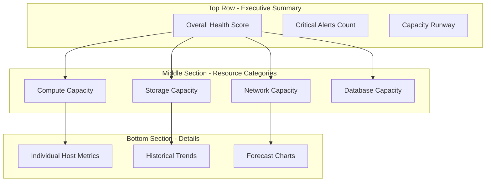
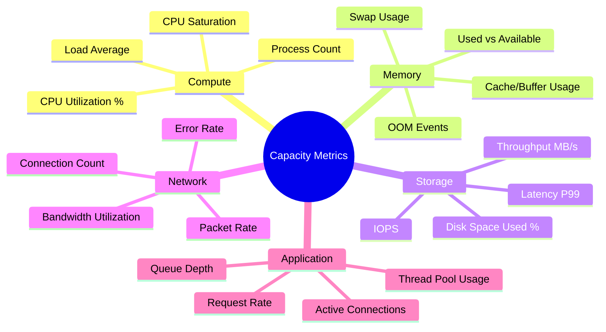
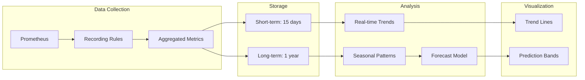
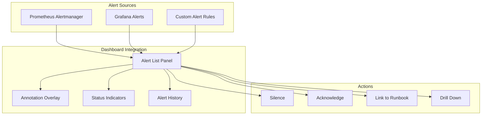
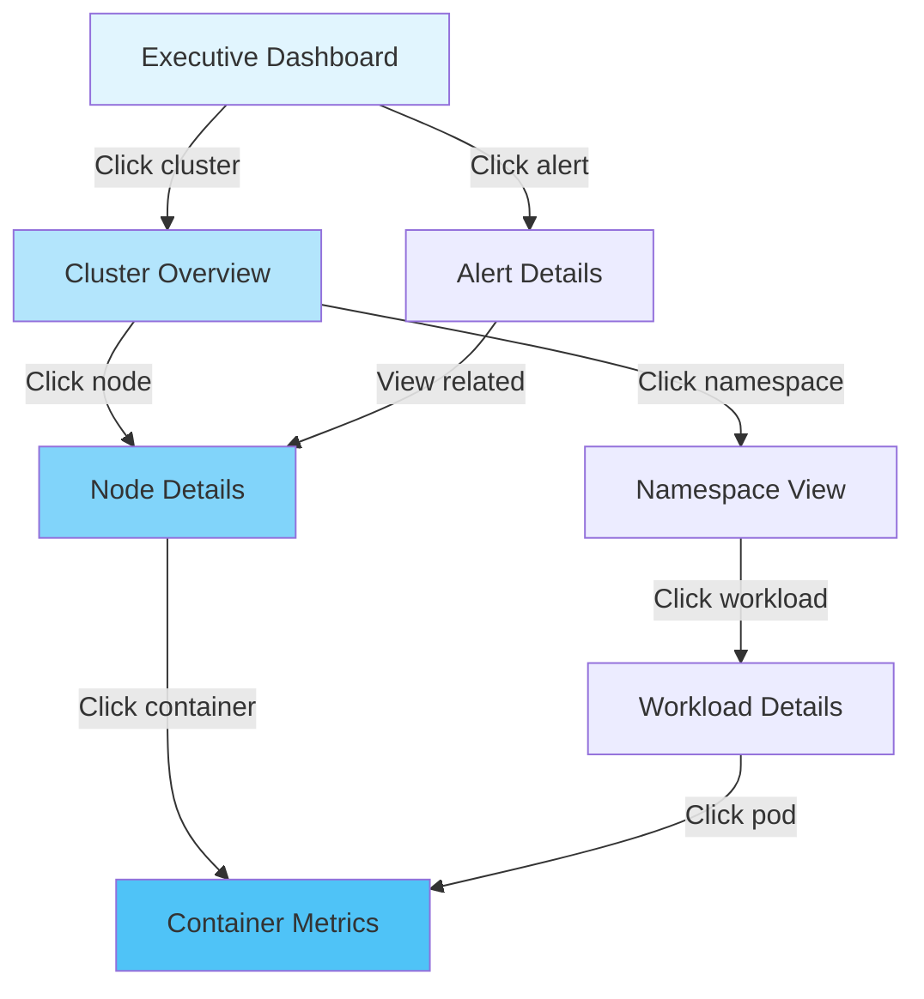
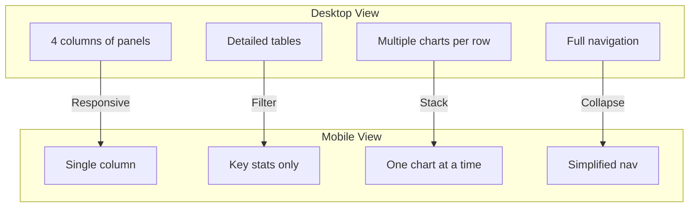

# How to Build Capacity Dashboards

Author: [nawazdhandala](https://github.com/nawazdhandala)

Tags: Capacity Planning, Dashboards, Grafana, Monitoring

Description: Learn how to build effective capacity dashboards for real-time monitoring.

---

> Capacity dashboards are the nerve center of proactive infrastructure management. They transform raw metrics into actionable intelligence, helping teams prevent outages before they happen.

Capacity planning without dashboards is like driving blindfolded. You might reach your destination, but the journey will be unnecessarily stressful. Well-designed capacity dashboards give you visibility into resource utilization trends, help predict future needs, and trigger alerts before systems hit critical thresholds.

This guide walks through building capacity dashboards that deliver real value to operations, SRE, and platform teams.

---

## Table of Contents

1. Dashboard Layout Design
2. Key Capacity Metrics Visualization
3. Trend and Forecast Panels
4. Alert Integration
5. Drill-Down Capabilities
6. Mobile-Friendly Views
7. Implementation Examples
8. Best Practices

---

## 1. Dashboard Layout Design

Effective capacity dashboards follow the principle of progressive disclosure: start with high-level summaries and enable drill-down into details. The layout should guide the eye from critical information to supporting context.

### Information Hierarchy



### Layout Grid Structure

A well-organized dashboard uses a consistent grid system. Here is a recommended layout.

```typescript
// dashboard-layout.ts
interface DashboardLayout {
  rows: DashboardRow[];
  variables: DashboardVariable[];
  refresh: string;
  timeRange: TimeRange;
}

interface DashboardRow {
  title: string;
  height: number; // in pixels or grid units
  panels: Panel[];
  collapsed?: boolean;
}

const capacityDashboardLayout: DashboardLayout = {
  rows: [
    {
      title: 'Executive Summary',
      height: 100,
      panels: [
        { type: 'stat', title: 'Overall Health', width: 4 },
        { type: 'stat', title: 'Active Alerts', width: 4 },
        { type: 'stat', title: 'Capacity Runway (days)', width: 4 },
        { type: 'gauge', title: 'CPU Utilization', width: 3 },
        { type: 'gauge', title: 'Memory Utilization', width: 3 },
        { type: 'gauge', title: 'Storage Utilization', width: 3 },
        { type: 'gauge', title: 'Network Utilization', width: 3 }
      ]
    },
    {
      title: 'Compute Resources',
      height: 250,
      panels: [
        { type: 'timeseries', title: 'CPU Usage by Cluster', width: 6 },
        { type: 'timeseries', title: 'Memory Usage by Cluster', width: 6 },
        { type: 'table', title: 'Top CPU Consumers', width: 6 },
        { type: 'table', title: 'Top Memory Consumers', width: 6 }
      ]
    },
    {
      title: 'Storage Resources',
      height: 250,
      panels: [
        { type: 'timeseries', title: 'Disk Usage Trends', width: 8 },
        { type: 'bar', title: 'Storage by Volume', width: 4 },
        { type: 'timeseries', title: 'IOPS Trends', width: 6 },
        { type: 'timeseries', title: 'Throughput', width: 6 }
      ]
    },
    {
      title: 'Forecasts',
      height: 300,
      collapsed: false,
      panels: [
        { type: 'timeseries', title: 'CPU Forecast (30 days)', width: 4 },
        { type: 'timeseries', title: 'Memory Forecast (30 days)', width: 4 },
        { type: 'timeseries', title: 'Storage Forecast (30 days)', width: 4 }
      ]
    }
  ],
  variables: [
    { name: 'cluster', type: 'query', multi: true },
    { name: 'namespace', type: 'query', multi: true },
    { name: 'node', type: 'query', multi: true }
  ],
  refresh: '30s',
  timeRange: { from: 'now-24h', to: 'now' }
};
```

### Visual Design Principles

| Principle | Implementation |
|-----------|----------------|
| **Consistency** | Use the same color for the same metric across all panels |
| **Contrast** | Critical alerts in red, warnings in yellow, healthy in green |
| **Whitespace** | Group related panels with spacing; avoid clutter |
| **Readability** | Minimum 12px font; avoid abbreviations in titles |
| **Responsiveness** | Panels should resize gracefully on different screens |

---

## 2. Key Capacity Metrics Visualization

Choosing the right metrics and visualizations is critical. Not all metrics deserve dashboard real estate.

### Essential Capacity Metrics



### Metric Panel Configurations

```yaml
# grafana-panels.yaml
# CPU Utilization Panel
- title: "CPU Utilization by Node"
  type: timeseries
  datasource: prometheus
  targets:
    - expr: |
        100 - (avg by (instance) (
          irate(node_cpu_seconds_total{mode="idle"}[5m])
        ) * 100)
      legendFormat: "{{instance}}"
  fieldConfig:
    defaults:
      unit: percent
      min: 0
      max: 100
      thresholds:
        mode: absolute
        steps:
          - color: green
            value: null
          - color: yellow
            value: 70
          - color: red
            value: 85
    overrides: []
  options:
    tooltip:
      mode: multi
    legend:
      displayMode: table
      placement: right
      calcs: [mean, max, last]

# Memory Usage Panel
- title: "Memory Usage"
  type: timeseries
  datasource: prometheus
  targets:
    - expr: |
        (1 - (node_memory_MemAvailable_bytes / node_memory_MemTotal_bytes)) * 100
      legendFormat: "{{instance}}"
  fieldConfig:
    defaults:
      unit: percent
      min: 0
      max: 100
      thresholds:
        mode: absolute
        steps:
          - color: green
            value: null
          - color: yellow
            value: 75
          - color: red
            value: 90

# Disk Space Panel
- title: "Disk Space Usage"
  type: gauge
  datasource: prometheus
  targets:
    - expr: |
        100 - ((node_filesystem_avail_bytes{mountpoint="/"} /
                node_filesystem_size_bytes{mountpoint="/"}) * 100)
      legendFormat: "{{instance}}"
  fieldConfig:
    defaults:
      unit: percent
      min: 0
      max: 100
      thresholds:
        mode: absolute
        steps:
          - color: green
            value: null
          - color: yellow
            value: 70
          - color: orange
            value: 80
          - color: red
            value: 90
```

### Visualization Type Selection

| Metric Type | Best Visualization | Why |
|-------------|-------------------|-----|
| Current utilization | Gauge or Stat | Instant comprehension of state |
| Utilization over time | Time series | Shows patterns and anomalies |
| Top consumers | Table or Bar chart | Easy comparison and sorting |
| Distribution | Histogram or Heatmap | Shows percentile spreads |
| Capacity vs usage | Stacked area | Clear relationship visualization |
| Threshold status | Traffic light / Status | Binary decision support |

---

## 3. Trend and Forecast Panels

Historical trends and forecasts transform reactive monitoring into proactive capacity management.

### Trend Analysis Architecture



### Implementing Trend Calculations

```typescript
// trend-calculator.ts
interface TrendAnalysis {
  slope: number;           // Rate of change per day
  intercept: number;       // Current baseline
  r_squared: number;       // Goodness of fit
  daysToThreshold: number; // When will we hit limit
  confidence: number;      // Prediction confidence
}

export function calculateLinearTrend(
  dataPoints: DataPoint[],
  thresholdPercent: number = 85
): TrendAnalysis {
  const n = dataPoints.length;
  if (n < 2) throw new Error('Need at least 2 data points');

  // Convert timestamps to days from start
  const startTime = dataPoints[0].timestamp;
  const points = dataPoints.map(dp => ({
    x: (dp.timestamp - startTime) / (24 * 60 * 60 * 1000), // Days
    y: dp.value
  }));

  // Calculate linear regression
  const sumX = points.reduce((sum, p) => sum + p.x, 0);
  const sumY = points.reduce((sum, p) => sum + p.y, 0);
  const sumXY = points.reduce((sum, p) => sum + p.x * p.y, 0);
  const sumX2 = points.reduce((sum, p) => sum + p.x * p.x, 0);
  const sumY2 = points.reduce((sum, p) => sum + p.y * p.y, 0);

  const slope = (n * sumXY - sumX * sumY) / (n * sumX2 - sumX * sumX);
  const intercept = (sumY - slope * sumX) / n;

  // Calculate R-squared
  const yMean = sumY / n;
  const ssTotal = points.reduce((sum, p) => sum + Math.pow(p.y - yMean, 2), 0);
  const ssResidual = points.reduce((sum, p) => {
    const predicted = slope * p.x + intercept;
    return sum + Math.pow(p.y - predicted, 2);
  }, 0);
  const r_squared = 1 - (ssResidual / ssTotal);

  // Calculate days to threshold
  const currentX = points[points.length - 1].x;
  const currentValue = slope * currentX + intercept;
  const daysToThreshold = slope > 0
    ? (thresholdPercent - currentValue) / slope
    : Infinity;

  return {
    slope,
    intercept,
    r_squared,
    daysToThreshold: Math.max(0, daysToThreshold),
    confidence: Math.min(r_squared, 0.99)
  };
}

// Prometheus recording rule for trend data
const trendRecordingRules = `
groups:
  - name: capacity_trends
    interval: 1h
    rules:
      # Daily average CPU utilization
      - record: capacity:cpu_utilization:avg_1d
        expr: |
          avg_over_time(
            (1 - avg by (instance) (rate(node_cpu_seconds_total{mode="idle"}[5m])))
            [1d:5m]
          ) * 100

      # Daily average memory utilization
      - record: capacity:memory_utilization:avg_1d
        expr: |
          avg_over_time(
            (1 - (node_memory_MemAvailable_bytes / node_memory_MemTotal_bytes))
            [1d:5m]
          ) * 100

      # Daily average disk utilization
      - record: capacity:disk_utilization:avg_1d
        expr: |
          avg_over_time(
            (1 - (node_filesystem_avail_bytes{mountpoint="/"} /
                  node_filesystem_size_bytes{mountpoint="/"}))
            [1d:5m]
          ) * 100
`;
```

### Forecast Panel Configuration

```yaml
# grafana-forecast-panel.yaml
- title: "Storage Capacity Forecast"
  type: timeseries
  datasource: prometheus
  targets:
    # Historical data
    - expr: |
        capacity:disk_utilization:avg_1d{instance=~"$instance"}
      legendFormat: "Actual - {{instance}}"
      refId: A

    # Linear forecast using predict_linear
    - expr: |
        predict_linear(
          capacity:disk_utilization:avg_1d{instance=~"$instance"}[30d],
          30 * 24 * 3600
        )
      legendFormat: "Forecast - {{instance}}"
      refId: B

    # Threshold line
    - expr: "85"
      legendFormat: "Threshold (85%)"
      refId: C

  fieldConfig:
    defaults:
      custom:
        drawStyle: line
        lineWidth: 2
        fillOpacity: 10
      unit: percent
      min: 0
      max: 100
    overrides:
      - matcher:
          id: byRegexp
          options: "/Forecast/"
        properties:
          - id: custom.lineStyle
            value:
              fill: dash
              dash: [10, 5]
          - id: color
            value:
              mode: fixed
              fixedColor: orange
      - matcher:
          id: byRegexp
          options: "/Threshold/"
        properties:
          - id: custom.lineWidth
            value: 1
          - id: color
            value:
              mode: fixed
              fixedColor: red

  options:
    tooltip:
      mode: multi
    legend:
      displayMode: table
      placement: bottom
```

### Capacity Runway Calculation

```typescript
// capacity-runway.ts
interface CapacityRunway {
  resource: string;
  currentUtilization: number;
  growthRatePerDay: number;
  daysUntilWarning: number;  // 70%
  daysUntilCritical: number; // 85%
  daysUntilFull: number;     // 100%
  recommendation: string;
}

export function calculateCapacityRunway(
  resource: string,
  historicalData: DataPoint[],
  warningThreshold: number = 70,
  criticalThreshold: number = 85
): CapacityRunway {
  const trend = calculateLinearTrend(historicalData);
  const currentUtilization = historicalData[historicalData.length - 1].value;

  const daysUntilWarning = trend.slope > 0
    ? Math.max(0, (warningThreshold - currentUtilization) / trend.slope)
    : Infinity;

  const daysUntilCritical = trend.slope > 0
    ? Math.max(0, (criticalThreshold - currentUtilization) / trend.slope)
    : Infinity;

  const daysUntilFull = trend.slope > 0
    ? Math.max(0, (100 - currentUtilization) / trend.slope)
    : Infinity;

  let recommendation: string;
  if (daysUntilCritical < 7) {
    recommendation = 'URGENT: Add capacity immediately';
  } else if (daysUntilCritical < 30) {
    recommendation = 'Plan capacity expansion within 2 weeks';
  } else if (daysUntilWarning < 30) {
    recommendation = 'Monitor closely; begin capacity planning';
  } else {
    recommendation = 'Capacity sufficient for current growth rate';
  }

  return {
    resource,
    currentUtilization,
    growthRatePerDay: trend.slope,
    daysUntilWarning,
    daysUntilCritical,
    daysUntilFull,
    recommendation
  };
}
```

---

## 4. Alert Integration

Dashboards without integrated alerts are just pretty pictures. Effective capacity dashboards surface alert status and provide context for triggered alerts.

### Alert Integration Architecture



### Capacity Alert Rules

```yaml
# prometheus-alerts.yaml
groups:
  - name: capacity_alerts
    rules:
      # CPU capacity warning
      - alert: CPUCapacityWarning
        expr: |
          (1 - avg by (instance) (rate(node_cpu_seconds_total{mode="idle"}[5m]))) * 100 > 70
        for: 15m
        labels:
          severity: warning
          category: capacity
        annotations:
          summary: "CPU utilization above 70% on {{ $labels.instance }}"
          description: "CPU has been above 70% for 15 minutes. Current value: {{ $value | printf \"%.1f\" }}%"
          runbook_url: "https://wiki.example.com/runbooks/cpu-capacity"
          dashboard_url: "https://grafana.example.com/d/capacity/capacity-dashboard?var-instance={{ $labels.instance }}"

      # CPU capacity critical
      - alert: CPUCapacityCritical
        expr: |
          (1 - avg by (instance) (rate(node_cpu_seconds_total{mode="idle"}[5m]))) * 100 > 85
        for: 5m
        labels:
          severity: critical
          category: capacity
        annotations:
          summary: "CPU utilization above 85% on {{ $labels.instance }}"
          description: "CPU has been above 85% for 5 minutes. Immediate action required."
          runbook_url: "https://wiki.example.com/runbooks/cpu-capacity-critical"

      # Memory capacity warning
      - alert: MemoryCapacityWarning
        expr: |
          (1 - (node_memory_MemAvailable_bytes / node_memory_MemTotal_bytes)) * 100 > 75
        for: 15m
        labels:
          severity: warning
          category: capacity
        annotations:
          summary: "Memory utilization above 75% on {{ $labels.instance }}"
          description: "Memory has been above 75% for 15 minutes. Current value: {{ $value | printf \"%.1f\" }}%"

      # Disk capacity warning
      - alert: DiskCapacityWarning
        expr: |
          (1 - (node_filesystem_avail_bytes{mountpoint="/"} /
                node_filesystem_size_bytes{mountpoint="/"})) * 100 > 70
        for: 30m
        labels:
          severity: warning
          category: capacity
        annotations:
          summary: "Disk utilization above 70% on {{ $labels.instance }}"
          description: "Disk space has been above 70% for 30 minutes."

      # Disk capacity critical
      - alert: DiskCapacityCritical
        expr: |
          (1 - (node_filesystem_avail_bytes{mountpoint="/"} /
                node_filesystem_size_bytes{mountpoint="/"})) * 100 > 85
        for: 15m
        labels:
          severity: critical
          category: capacity
        annotations:
          summary: "Disk utilization above 85% on {{ $labels.instance }}"
          description: "Disk space critically low. May impact service stability."

      # Predictive alert - disk will fill in 7 days
      - alert: DiskWillFillIn7Days
        expr: |
          predict_linear(
            node_filesystem_avail_bytes{mountpoint="/"}[7d],
            7 * 24 * 3600
          ) < 0
        for: 1h
        labels:
          severity: warning
          category: capacity
        annotations:
          summary: "Disk predicted to fill within 7 days on {{ $labels.instance }}"
          description: "Based on current growth rate, disk will be full in approximately 7 days."

      # Predictive alert - disk will fill in 24 hours
      - alert: DiskWillFillIn24Hours
        expr: |
          predict_linear(
            node_filesystem_avail_bytes{mountpoint="/"}[2d],
            24 * 3600
          ) < 0
        for: 30m
        labels:
          severity: critical
          category: capacity
        annotations:
          summary: "URGENT: Disk predicted to fill within 24 hours on {{ $labels.instance }}"
          description: "Immediate action required. Disk will be full in less than 24 hours."
```

### Alert Panel Configuration

```yaml
# grafana-alert-panel.yaml
- title: "Active Capacity Alerts"
  type: alertlist
  datasource:
    type: datasource
    uid: grafana
  options:
    alertInstanceLabelFilter: 'category="capacity"'
    alertName: ""
    dashboardAlerts: false
    groupBy: []
    groupMode: default
    maxItems: 20
    sortOrder: 1  # Severity
    stateFilter:
      firing: true
      pending: true
      noData: false
      normal: false
      error: true
    viewMode: list

- title: "Alert History (24h)"
  type: state-timeline
  datasource: prometheus
  targets:
    - expr: |
        ALERTS{category="capacity", alertstate="firing"}
      legendFormat: "{{ alertname }} - {{ instance }}"
  fieldConfig:
    defaults:
      custom:
        fillOpacity: 70
      mappings:
        - type: value
          options:
            '0':
              text: OK
              color: green
            '1':
              text: FIRING
              color: red
```

### Linking Alerts to Dashboard Context

```typescript
// alert-context-linker.ts
interface AlertContext {
  alert: Alert;
  relatedMetrics: MetricLink[];
  affectedResources: string[];
  suggestedActions: string[];
  historicalOccurrences: AlertOccurrence[];
}

export function buildAlertContext(alert: Alert): AlertContext {
  const relatedMetrics: MetricLink[] = [];

  // Map alert to related metrics based on category
  if (alert.labels.category === 'capacity') {
    const instance = alert.labels.instance;

    relatedMetrics.push({
      name: 'CPU Utilization',
      query: `100 - (avg by (instance) (irate(node_cpu_seconds_total{mode="idle",instance="${instance}"}[5m])) * 100)`,
      panelId: 'cpu-util'
    });

    relatedMetrics.push({
      name: 'Memory Utilization',
      query: `(1 - (node_memory_MemAvailable_bytes{instance="${instance}"} / node_memory_MemTotal_bytes{instance="${instance}"})) * 100`,
      panelId: 'mem-util'
    });

    relatedMetrics.push({
      name: 'Disk Utilization',
      query: `(1 - (node_filesystem_avail_bytes{instance="${instance}",mountpoint="/"} / node_filesystem_size_bytes{instance="${instance}",mountpoint="/"})) * 100`,
      panelId: 'disk-util'
    });
  }

  // Determine affected resources
  const affectedResources = [
    alert.labels.instance,
    alert.labels.namespace,
    alert.labels.pod
  ].filter(Boolean);

  // Suggest actions based on alert type
  const suggestedActions = getSuggestedActions(alert);

  return {
    alert,
    relatedMetrics,
    affectedResources,
    suggestedActions,
    historicalOccurrences: [] // Populated from alert history API
  };
}

function getSuggestedActions(alert: Alert): string[] {
  const actions: string[] = [];

  if (alert.alertname.includes('CPU')) {
    actions.push('Check for runaway processes: top -o %CPU');
    actions.push('Review recent deployments for CPU-intensive changes');
    actions.push('Consider horizontal scaling if sustained');
  }

  if (alert.alertname.includes('Memory')) {
    actions.push('Check for memory leaks: monitor RSS over time');
    actions.push('Review heap dumps if applicable');
    actions.push('Consider increasing memory limits or adding nodes');
  }

  if (alert.alertname.includes('Disk')) {
    actions.push('Identify large files: du -sh /* | sort -rh | head -20');
    actions.push('Check log rotation policies');
    actions.push('Review data retention settings');
    actions.push('Consider expanding storage or archiving old data');
  }

  return actions;
}
```

---

## 5. Drill-Down Capabilities

Effective dashboards support progressive investigation. Users should be able to move from high-level overview to specific details without losing context.

### Drill-Down Navigation Flow



### Implementing Drill-Down with Variables

```yaml
# grafana-variables.yaml
templating:
  list:
    - name: cluster
      type: query
      datasource: prometheus
      query: label_values(kube_node_info, cluster)
      refresh: 1
      multi: false
      includeAll: true
      allValue: ".*"

    - name: namespace
      type: query
      datasource: prometheus
      query: label_values(kube_namespace_labels{cluster=~"$cluster"}, namespace)
      refresh: 1
      multi: true
      includeAll: true
      allValue: ".*"

    - name: node
      type: query
      datasource: prometheus
      query: label_values(kube_node_info{cluster=~"$cluster"}, node)
      refresh: 1
      multi: true
      includeAll: true
      allValue: ".*"

    - name: workload
      type: query
      datasource: prometheus
      query: |
        label_values(
          kube_deployment_labels{cluster=~"$cluster", namespace=~"$namespace"},
          deployment
        )
      refresh: 1
      multi: true
      includeAll: true
```

### Data Links for Navigation

```yaml
# grafana-data-links.yaml
panels:
  - title: "CPU by Node"
    type: timeseries
    fieldConfig:
      defaults:
        links:
          - title: "Drill down to node"
            url: "/d/node-details/node-details?var-node=${__field.labels.node}&var-cluster=${cluster}&${__url_time_range}"
            targetBlank: false

          - title: "View in Node Exporter"
            url: "/d/node-exporter/node-exporter?var-instance=${__field.labels.instance}&${__url_time_range}"
            targetBlank: true

          - title: "View related logs"
            url: "/explore?left=%5B%22${__from}%22,%22${__to}%22,%22loki%22,%7B%22expr%22:%22%7Bnode%3D%5C%22${__field.labels.node}%5C%22%7D%22%7D%5D"
            targetBlank: true

  - title: "Top CPU Consumers"
    type: table
    fieldConfig:
      defaults:
        links:
          - title: "View pod details"
            url: "/d/pod-details/pod-details?var-namespace=${__data.fields.namespace}&var-pod=${__data.fields.pod}&${__url_time_range}"

          - title: "View container logs"
            url: "/explore?left=%5B%22${__from}%22,%22${__to}%22,%22loki%22,%7B%22expr%22:%22%7Bnamespace%3D%5C%22${__data.fields.namespace}%5C%22,pod%3D%5C%22${__data.fields.pod}%5C%22%7D%22%7D%5D"
```

### Dynamic Panel Queries

```typescript
// dynamic-drill-down.ts
interface DrillDownPanel {
  level: 'cluster' | 'namespace' | 'node' | 'workload' | 'pod';
  query: string;
  childLevel?: DrillDownPanel;
}

const capacityDrillDown: DrillDownPanel = {
  level: 'cluster',
  query: `
    sum by (cluster) (
      container_memory_usage_bytes{cluster=~"$cluster"}
    ) /
    sum by (cluster) (
      kube_node_status_allocatable{resource="memory", cluster=~"$cluster"}
    ) * 100
  `,
  childLevel: {
    level: 'namespace',
    query: `
      sum by (namespace) (
        container_memory_usage_bytes{cluster=~"$cluster", namespace=~"$namespace"}
      ) /
      sum (
        kube_resourcequota{resource="limits.memory", cluster=~"$cluster", namespace=~"$namespace"}
      ) * 100
    `,
    childLevel: {
      level: 'workload',
      query: `
        sum by (workload) (
          label_replace(
            container_memory_usage_bytes{cluster=~"$cluster", namespace=~"$namespace"},
            "workload", "$1", "pod", "(.*)-[a-z0-9]+-[a-z0-9]+"
          )
        )
      `,
      childLevel: {
        level: 'pod',
        query: `
          sum by (pod, container) (
            container_memory_usage_bytes{
              cluster=~"$cluster",
              namespace=~"$namespace",
              pod=~"$workload.*"
            }
          )
        `
      }
    }
  }
};

// Build query for current drill-down level
export function buildDrillDownQuery(
  panel: DrillDownPanel,
  variables: Record<string, string>
): string {
  let query = panel.query;

  for (const [key, value] of Object.entries(variables)) {
    query = query.replace(new RegExp(`\\$${key}`, 'g'), value);
  }

  return query;
}
```

---

## 6. Mobile-Friendly Views

Modern SRE teams need dashboard access from mobile devices during on-call situations. Designing for mobile requires thoughtful simplification.

### Mobile Design Principles



### Mobile-Optimized Dashboard Configuration

```yaml
# grafana-mobile-dashboard.yaml
# Create a separate mobile-optimized dashboard
title: "Capacity Dashboard (Mobile)"
tags:
  - capacity
  - mobile

# Simplified layout for mobile
panels:
  # Status row - single stat panels that work well on mobile
  - title: "Overall Health"
    type: stat
    gridPos:
      h: 4
      w: 12  # Half width on mobile becomes full width
      x: 0
      y: 0
    fieldConfig:
      defaults:
        thresholds:
          mode: absolute
          steps:
            - color: green
              value: null
            - color: yellow
              value: 70
            - color: red
              value: 85
        mappings:
          - type: range
            options:
              from: 0
              to: 69
              result:
                text: "Healthy"
          - type: range
            options:
              from: 70
              to: 84
              result:
                text: "Warning"
          - type: range
            options:
              from: 85
              to: 100
              result:
                text: "Critical"

  - title: "Active Alerts"
    type: stat
    gridPos:
      h: 4
      w: 12
      x: 12
      y: 0
    options:
      colorMode: value
      graphMode: none
      justifyMode: center

  # Key gauges - stack vertically on mobile
  - title: "CPU"
    type: gauge
    gridPos:
      h: 6
      w: 8
      x: 0
      y: 4
    fieldConfig:
      defaults:
        unit: percent
        min: 0
        max: 100

  - title: "Memory"
    type: gauge
    gridPos:
      h: 6
      w: 8
      x: 8
      y: 4

  - title: "Disk"
    type: gauge
    gridPos:
      h: 6
      w: 8
      x: 16
      y: 4

  # Single trend chart optimized for touch
  - title: "Resource Trends (24h)"
    type: timeseries
    gridPos:
      h: 10
      w: 24
      x: 0
      y: 10
    options:
      legend:
        displayMode: list
        placement: bottom
        calcs: []
      tooltip:
        mode: single  # Easier to use on touch screens
```

### Responsive CSS for Custom Panels

```css
/* mobile-dashboard.css */

/* Base styles for capacity dashboard */
.capacity-panel {
  padding: 16px;
  font-size: 14px;
}

/* Mobile-first responsive design */
@media screen and (max-width: 768px) {
  .capacity-panel {
    padding: 8px;
    font-size: 12px;
  }

  /* Stack panels vertically */
  .panel-container {
    display: flex;
    flex-direction: column;
  }

  /* Full width panels */
  .panel {
    width: 100% !important;
    margin-bottom: 8px;
  }

  /* Larger touch targets */
  .panel-link,
  .drill-down-button {
    min-height: 44px;
    min-width: 44px;
    padding: 12px;
  }

  /* Simplified legends */
  .legend-series {
    font-size: 11px;
  }

  /* Hide secondary information */
  .panel-description,
  .secondary-stats {
    display: none;
  }

  /* Adjust chart heights */
  .timeseries-panel {
    min-height: 200px;
  }

  /* Scrollable tables */
  .table-panel {
    overflow-x: auto;
  }
}

/* Tablet view */
@media screen and (min-width: 769px) and (max-width: 1024px) {
  .capacity-panel {
    padding: 12px;
  }

  .panel-container {
    display: grid;
    grid-template-columns: repeat(2, 1fr);
    gap: 12px;
  }
}

/* Large screen view */
@media screen and (min-width: 1025px) {
  .panel-container {
    display: grid;
    grid-template-columns: repeat(4, 1fr);
    gap: 16px;
  }
}
```

### Mobile Alert Notifications

```typescript
// mobile-alert-config.ts
interface MobileAlertConfig {
  channels: NotificationChannel[];
  quietHours?: QuietHours;
  escalation: EscalationPolicy;
}

const mobileCapacityAlerts: MobileAlertConfig = {
  channels: [
    {
      type: 'push',
      app: 'grafana-mobile',
      settings: {
        sound: true,
        vibration: true,
        priority: 'high'
      },
      filter: {
        severity: ['critical']
      }
    },
    {
      type: 'sms',
      settings: {
        maxLength: 160,
        includeLink: true
      },
      filter: {
        severity: ['critical'],
        afterHours: true
      }
    },
    {
      type: 'email',
      settings: {
        includeGraph: true,
        mobileOptimized: true
      },
      filter: {
        severity: ['warning', 'critical']
      }
    }
  ],
  quietHours: {
    enabled: true,
    start: '22:00',
    end: '07:00',
    timezone: 'America/New_York',
    exceptFor: ['critical']
  },
  escalation: {
    initialDelay: 5, // minutes
    repeatInterval: 15,
    maxRepeats: 3,
    escalateTo: 'secondary-oncall'
  }
};

// Generate mobile-friendly alert message
export function formatMobileAlert(alert: Alert): string {
  const severity = alert.labels.severity.toUpperCase();
  const resource = alert.labels.instance || alert.labels.pod || 'unknown';
  const value = alert.annotations.value || 'N/A';

  // Keep under 160 chars for SMS compatibility
  const message = `[${severity}] ${alert.alertname}\n` +
    `Resource: ${resource}\n` +
    `Value: ${value}\n` +
    `Action: ${alert.annotations.runbook_url ? 'See runbook' : 'Check dashboard'}`;

  return message.substring(0, 160);
}
```

---

## 7. Implementation Examples

Let us put everything together with complete, working examples.

### Complete Grafana Dashboard JSON

```json
{
  "dashboard": {
    "title": "Capacity Dashboard",
    "tags": ["capacity", "infrastructure", "sre"],
    "timezone": "browser",
    "refresh": "30s",
    "schemaVersion": 38,
    "templating": {
      "list": [
        {
          "name": "cluster",
          "type": "query",
          "datasource": "prometheus",
          "query": "label_values(kube_node_info, cluster)",
          "refresh": 1,
          "multi": false,
          "includeAll": true
        },
        {
          "name": "node",
          "type": "query",
          "datasource": "prometheus",
          "query": "label_values(kube_node_info{cluster=~\"$cluster\"}, node)",
          "refresh": 2,
          "multi": true,
          "includeAll": true
        }
      ]
    },
    "panels": [
      {
        "title": "Capacity Health Score",
        "type": "stat",
        "gridPos": { "h": 4, "w": 6, "x": 0, "y": 0 },
        "datasource": "prometheus",
        "targets": [
          {
            "expr": "100 - max(max by (resource) (100 - (sum by (resource) (kube_node_status_allocatable{cluster=~\"$cluster\"}) - sum by (resource) (kube_pod_resource_request{cluster=~\"$cluster\"})) / sum by (resource) (kube_node_status_allocatable{cluster=~\"$cluster\"}) * 100))",
            "legendFormat": "Health Score"
          }
        ],
        "fieldConfig": {
          "defaults": {
            "unit": "percent",
            "thresholds": {
              "mode": "absolute",
              "steps": [
                { "color": "red", "value": null },
                { "color": "yellow", "value": 50 },
                { "color": "green", "value": 70 }
              ]
            }
          }
        }
      },
      {
        "title": "CPU Utilization",
        "type": "gauge",
        "gridPos": { "h": 4, "w": 6, "x": 6, "y": 0 },
        "datasource": "prometheus",
        "targets": [
          {
            "expr": "100 - (avg(rate(node_cpu_seconds_total{mode=\"idle\", cluster=~\"$cluster\"}[5m])) * 100)"
          }
        ],
        "fieldConfig": {
          "defaults": {
            "unit": "percent",
            "min": 0,
            "max": 100,
            "thresholds": {
              "mode": "absolute",
              "steps": [
                { "color": "green", "value": null },
                { "color": "yellow", "value": 70 },
                { "color": "red", "value": 85 }
              ]
            }
          }
        }
      },
      {
        "title": "CPU Usage Trend",
        "type": "timeseries",
        "gridPos": { "h": 8, "w": 12, "x": 0, "y": 4 },
        "datasource": "prometheus",
        "targets": [
          {
            "expr": "100 - (avg by (instance) (rate(node_cpu_seconds_total{mode=\"idle\", cluster=~\"$cluster\", instance=~\"$node\"}[5m])) * 100)",
            "legendFormat": "{{instance}}"
          }
        ],
        "fieldConfig": {
          "defaults": {
            "unit": "percent",
            "custom": {
              "drawStyle": "line",
              "lineWidth": 2,
              "fillOpacity": 10
            }
          }
        },
        "options": {
          "legend": {
            "displayMode": "table",
            "placement": "right",
            "calcs": ["mean", "max", "last"]
          }
        }
      },
      {
        "title": "CPU Forecast (30 days)",
        "type": "timeseries",
        "gridPos": { "h": 8, "w": 12, "x": 12, "y": 4 },
        "datasource": "prometheus",
        "targets": [
          {
            "expr": "100 - (avg(rate(node_cpu_seconds_total{mode=\"idle\", cluster=~\"$cluster\"}[5m])) * 100)",
            "legendFormat": "Current"
          },
          {
            "expr": "predict_linear((100 - (avg(rate(node_cpu_seconds_total{mode=\"idle\", cluster=~\"$cluster\"}[5m])) * 100))[7d:1h], 30*24*3600)",
            "legendFormat": "30-day Forecast"
          }
        ],
        "fieldConfig": {
          "defaults": {
            "unit": "percent",
            "min": 0,
            "max": 100
          },
          "overrides": [
            {
              "matcher": { "id": "byName", "options": "30-day Forecast" },
              "properties": [
                { "id": "custom.lineStyle", "value": { "fill": "dash" } },
                { "id": "color", "value": { "mode": "fixed", "fixedColor": "orange" } }
              ]
            }
          ]
        }
      }
    ]
  }
}
```

### Prometheus Recording Rules

```yaml
# recording-rules.yaml
groups:
  - name: capacity_recording_rules
    interval: 1m
    rules:
      # Cluster-level CPU utilization
      - record: cluster:cpu_utilization:ratio
        expr: |
          1 - avg by (cluster) (
            rate(node_cpu_seconds_total{mode="idle"}[5m])
          )

      # Cluster-level memory utilization
      - record: cluster:memory_utilization:ratio
        expr: |
          1 - sum by (cluster) (node_memory_MemAvailable_bytes) /
              sum by (cluster) (node_memory_MemTotal_bytes)

      # Namespace resource usage vs requests
      - record: namespace:cpu_usage_vs_request:ratio
        expr: |
          sum by (namespace, cluster) (
            rate(container_cpu_usage_seconds_total[5m])
          ) /
          sum by (namespace, cluster) (
            kube_pod_container_resource_requests{resource="cpu"}
          )

      # Pod CPU throttling
      - record: pod:cpu_throttle:ratio
        expr: |
          sum by (pod, namespace, cluster) (
            rate(container_cpu_cfs_throttled_periods_total[5m])
          ) /
          sum by (pod, namespace, cluster) (
            rate(container_cpu_cfs_periods_total[5m])
          )

      # Daily aggregates for trending
      - record: cluster:cpu_utilization:avg_1d
        expr: |
          avg_over_time(cluster:cpu_utilization:ratio[1d:5m])

      - record: cluster:memory_utilization:avg_1d
        expr: |
          avg_over_time(cluster:memory_utilization:ratio[1d:5m])
```

### Dashboard Provisioning

```typescript
// dashboard-provisioner.ts
import * as fs from 'fs';
import * as path from 'path';

interface DashboardProvisioning {
  apiVersion: number;
  providers: Provider[];
}

interface Provider {
  name: string;
  orgId: number;
  folder: string;
  type: string;
  disableDeletion: boolean;
  editable: boolean;
  options: {
    path: string;
  };
}

const capacityDashboardProvisioning: DashboardProvisioning = {
  apiVersion: 1,
  providers: [
    {
      name: 'Capacity Dashboards',
      orgId: 1,
      folder: 'Infrastructure',
      type: 'file',
      disableDeletion: false,
      editable: true,
      options: {
        path: '/var/lib/grafana/dashboards/capacity'
      }
    }
  ]
};

// Generate dashboard from template
export function generateCapacityDashboard(
  config: DashboardConfig
): GrafanaDashboard {
  return {
    dashboard: {
      title: `Capacity Dashboard - ${config.environment}`,
      uid: `capacity-${config.environment}`,
      tags: ['capacity', 'infrastructure', config.environment],
      timezone: 'browser',
      refresh: config.refreshInterval || '30s',
      time: {
        from: 'now-24h',
        to: 'now'
      },
      templating: {
        list: generateVariables(config)
      },
      panels: [
        ...generateSummaryPanels(config),
        ...generateResourcePanels(config),
        ...generateForecastPanels(config),
        ...generateAlertPanels(config)
      ]
    },
    overwrite: true
  };
}

function generateVariables(config: DashboardConfig): TemplateVariable[] {
  const variables: TemplateVariable[] = [];

  if (config.multiCluster) {
    variables.push({
      name: 'cluster',
      type: 'query',
      datasource: config.datasource,
      query: 'label_values(kube_node_info, cluster)',
      refresh: 1,
      multi: false,
      includeAll: true
    });
  }

  variables.push({
    name: 'node',
    type: 'query',
    datasource: config.datasource,
    query: config.multiCluster
      ? 'label_values(kube_node_info{cluster=~"$cluster"}, node)'
      : 'label_values(kube_node_info, node)',
    refresh: 2,
    multi: true,
    includeAll: true
  });

  return variables;
}

// Export for CLI usage
if (require.main === module) {
  const config: DashboardConfig = {
    environment: process.argv[2] || 'production',
    datasource: 'prometheus',
    multiCluster: true,
    refreshInterval: '30s'
  };

  const dashboard = generateCapacityDashboard(config);
  const outputPath = path.join(
    '/var/lib/grafana/dashboards/capacity',
    `capacity-${config.environment}.json`
  );

  fs.writeFileSync(outputPath, JSON.stringify(dashboard, null, 2));
  console.log(`Dashboard generated: ${outputPath}`);
}
```

---

## 8. Best Practices

### Dashboard Design Checklist

| Category | Requirement | Priority |
|----------|-------------|----------|
| **Layout** | Executive summary at top | High |
| **Layout** | Consistent panel sizing | Medium |
| **Layout** | Logical grouping of related metrics | High |
| **Metrics** | Only actionable metrics displayed | High |
| **Metrics** | Clear thresholds with color coding | High |
| **Metrics** | Units clearly labeled | Medium |
| **Alerts** | Alert status visible on dashboard | High |
| **Alerts** | Links to runbooks | High |
| **Alerts** | Historical alert timeline | Medium |
| **Navigation** | Variables for filtering | High |
| **Navigation** | Drill-down links on all panels | High |
| **Navigation** | Related dashboard links | Medium |
| **Performance** | Queries optimized with recording rules | High |
| **Performance** | Appropriate time ranges | Medium |
| **Mobile** | Key metrics visible on small screens | Medium |

### Common Mistakes to Avoid

1. **Too many panels**: Stick to 12-16 panels maximum per dashboard
2. **Missing thresholds**: Every utilization metric needs warning and critical levels
3. **Raw metrics only**: Always include context (requests vs limits, trends)
4. **No forecasts**: Capacity planning requires future projections
5. **Static queries**: Use variables for filtering and drill-down
6. **Missing alerts**: Dashboard should show alert status and integrate with alerting
7. **Ignoring mobile**: On-call engineers need mobile access

### Query Optimization Tips

```yaml
# Use recording rules for expensive queries
groups:
  - name: dashboard_optimization
    rules:
      # Pre-compute expensive aggregations
      - record: dashboard:node_cpu:avg5m
        expr: avg by (instance) (rate(node_cpu_seconds_total{mode!="idle"}[5m]))

      # Use instant vectors where possible
      - record: dashboard:pod_memory:current
        expr: sum by (pod, namespace) (container_memory_usage_bytes)

# In dashboard queries, use the recording rules
# Instead of:
#   sum by (instance) (rate(node_cpu_seconds_total{mode!="idle"}[5m]))
# Use:
#   dashboard:node_cpu:avg5m
```

### Maintenance Schedule

| Task | Frequency | Owner |
|------|-----------|-------|
| Review alert thresholds | Monthly | SRE Team |
| Update forecast models | Quarterly | Platform Team |
| Validate drill-down links | Monthly | Dashboard Owner |
| Test mobile views | Quarterly | On-Call Team |
| Archive unused dashboards | Quarterly | All Teams |
| Update documentation | On change | Dashboard Owner |

---

## Summary

Building effective capacity dashboards requires thoughtful design across multiple dimensions:

| Component | Key Considerations |
|-----------|-------------------|
| Layout | Progressive disclosure, logical grouping, consistent styling |
| Metrics | Actionable data, clear thresholds, proper visualization types |
| Forecasting | Linear trends, seasonal patterns, confidence intervals |
| Alerts | Integration with dashboard, runbook links, escalation paths |
| Drill-Down | Variables, data links, related dashboards |
| Mobile | Simplified views, touch-friendly, critical metrics focus |

A well-designed capacity dashboard transforms reactive firefighting into proactive capacity management. It surfaces the right information at the right time, enabling teams to prevent outages rather than just respond to them.

---

*Need to visualize your infrastructure capacity? [OneUptime](https://oneuptime.com) provides built-in capacity dashboards with forecasting, alerting, and mobile support. Connect your metrics and start planning proactively.*

---

### See Also

- [SRE Metrics Worth Tracking](/blog/post/2025-11-28-sre-metrics-to-track/) - Learn which metrics matter most for reliability
- [Monitoring vs Observability](/blog/post/2025-11-28-monitoring-vs-observability-sre/) - Understand the difference and when you need each
- [Three Pillars of Observability](/blog/post/2025-08-20-three-pillars-of-observability-logs-metrics-traces/) - Context for capacity metrics in the broader observability picture
