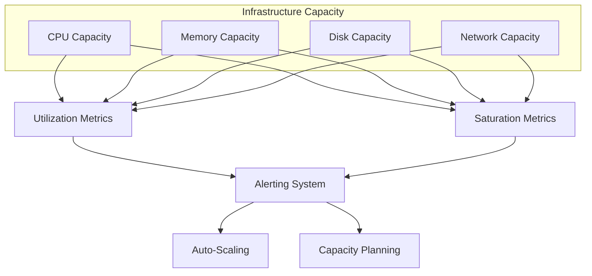
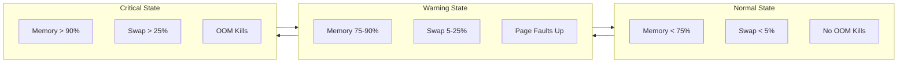
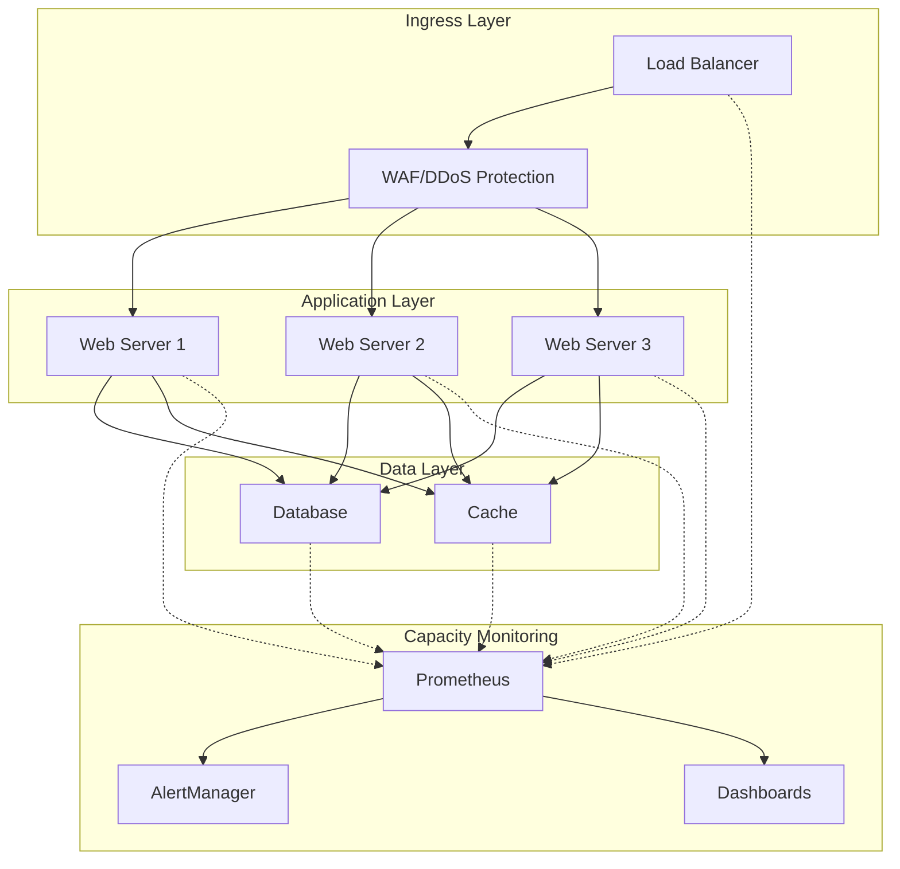
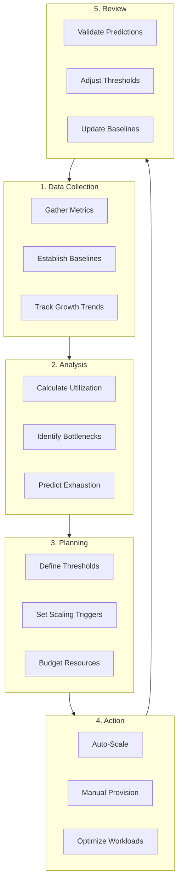
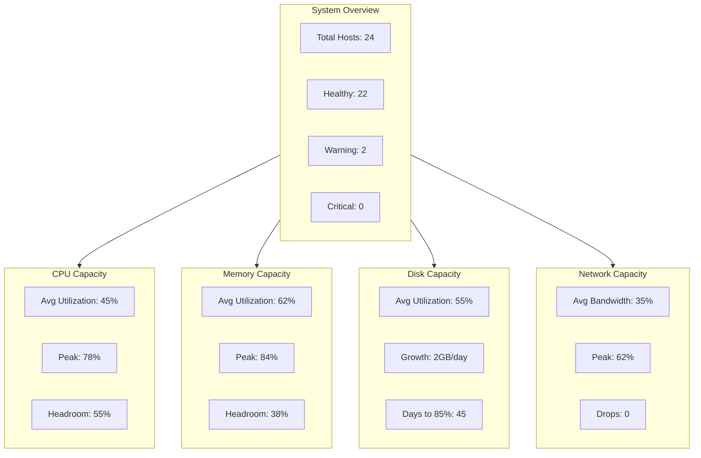

# How to Build Capacity Monitoring

Author: [nawazdhandala](https://github.com/nawazdhandala)

Tags: Capacity Planning, Monitoring, SRE, Infrastructure

Description: Learn how to monitor infrastructure capacity for proactive scaling and resource management.

---

## Why Capacity Monitoring Matters

Capacity monitoring is the practice of continuously measuring and analyzing your infrastructure resources to ensure you have enough headroom to handle current and future workloads. Without it, you are flying blind until something breaks.

The consequences of poor capacity monitoring include:
- Unexpected outages during traffic spikes
- Degraded performance that frustrates users
- Wasted money on over-provisioned resources
- Firefighting instead of proactive engineering

This guide covers how to build a comprehensive capacity monitoring system from the ground up.

---

## The Four Pillars of Infrastructure Capacity



Every capacity monitoring system should track these four fundamental resources:

1. **CPU** - Processing power available vs consumed
2. **Memory** - RAM allocation and availability
3. **Disk** - Storage space and I/O throughput
4. **Network** - Bandwidth and connection capacity

For each resource, you need to measure both **utilization** (how much is being used) and **saturation** (how much work is waiting).

---

## CPU Capacity Monitoring

### Key Metrics to Track

| Metric | Description | Warning Threshold | Critical Threshold |
|--------|-------------|-------------------|-------------------|
| CPU Utilization | Percentage of CPU time spent on work | 70% | 85% |
| Load Average | Number of processes waiting for CPU | 0.7 * cores | 1.0 * cores |
| CPU Steal | Time stolen by hypervisor (VMs) | 5% | 10% |
| Context Switches | Rate of process switching | Baseline + 50% | Baseline + 100% |

### Prometheus Queries for CPU Capacity

```promql
# CPU utilization percentage per instance
# This calculates how much CPU time is spent on actual work
# by subtracting idle time from 100%
100 - (
  avg by(instance) (
    rate(node_cpu_seconds_total{mode="idle"}[5m])
  ) * 100
)

# CPU saturation using load average
# Normalized by the number of CPU cores
# Values above 1.0 indicate saturation
node_load1 / count without(cpu, mode) (
  node_cpu_seconds_total{mode="idle"}
)

# CPU steal time (important for cloud VMs)
# High steal indicates noisy neighbor problems
avg by(instance) (
  rate(node_cpu_seconds_total{mode="steal"}[5m])
) * 100

# Runnable processes (CPU saturation indicator)
# Shows how many processes are waiting for CPU
node_procs_running
```

### CPU Capacity Dashboard Example

```yaml
# Grafana dashboard panel configuration
# Shows CPU utilization with threshold bands
panels:
  - title: "CPU Utilization"
    type: graph
    targets:
      - expr: |
          100 - (
            avg by(instance) (
              rate(node_cpu_seconds_total{mode="idle"}[5m])
            ) * 100
          )
        legendFormat: "{{instance}}"
    thresholds:
      - value: 70
        color: yellow
      - value: 85
        color: red
```

---

## Memory Capacity Monitoring

### Key Metrics to Track

| Metric | Description | Warning Threshold | Critical Threshold |
|--------|-------------|-------------------|-------------------|
| Memory Utilization | Percentage of RAM in use | 75% | 90% |
| Available Memory | Free + reclaimable memory | 25% free | 10% free |
| Swap Usage | Virtual memory on disk | 10% | 25% |
| OOM Kills | Out of memory terminations | Any occurrence | - |

### Prometheus Queries for Memory Capacity

```promql
# Memory utilization percentage
# Uses MemAvailable which accounts for buffers and cache
# that can be reclaimed under pressure
(
  1 - (
    node_memory_MemAvailable_bytes /
    node_memory_MemTotal_bytes
  )
) * 100

# Available memory in human readable GB
# Includes free memory plus reclaimable cache
node_memory_MemAvailable_bytes / 1024 / 1024 / 1024

# Swap usage percentage
# High swap usage indicates memory pressure
(
  node_memory_SwapTotal_bytes - node_memory_SwapFree_bytes
) / node_memory_SwapTotal_bytes * 100

# Memory saturation via major page faults
# Major faults require disk I/O and indicate memory pressure
rate(node_vmstat_pgmajfault[5m])

# OOM kills counter
# Any increase indicates critical memory exhaustion
increase(node_vmstat_oom_kill[1h])
```

### Memory Pressure Detection



---

## Disk Capacity Monitoring

### Key Metrics to Track

| Metric | Description | Warning Threshold | Critical Threshold |
|--------|-------------|-------------------|-------------------|
| Disk Space Used | Percentage of disk full | 70% | 85% |
| Inode Usage | Percentage of inodes used | 70% | 85% |
| Disk I/O Utilization | Time disk is busy | 70% | 90% |
| I/O Wait | CPU time waiting for disk | 10% | 25% |
| Read/Write Latency | Time per operation | 10ms | 50ms |

### Prometheus Queries for Disk Capacity

```promql
# Disk space utilization percentage per mount point
# Excludes tmpfs and other virtual filesystems
(
  node_filesystem_size_bytes{fstype!~"tmpfs|overlay"} -
  node_filesystem_avail_bytes{fstype!~"tmpfs|overlay"}
) / node_filesystem_size_bytes{fstype!~"tmpfs|overlay"} * 100

# Disk space exhaustion prediction
# Predicts when disk will be full based on growth rate
# Returns seconds until full (negative means shrinking)
predict_linear(
  node_filesystem_avail_bytes{fstype!~"tmpfs|overlay"}[24h],
  7 * 24 * 3600
) < 0

# Inode utilization percentage
# Running out of inodes is as bad as running out of space
(
  node_filesystem_files{fstype!~"tmpfs|overlay"} -
  node_filesystem_files_free{fstype!~"tmpfs|overlay"}
) / node_filesystem_files{fstype!~"tmpfs|overlay"} * 100

# Disk I/O utilization (saturation indicator)
# Shows percentage of time the disk is busy
rate(node_disk_io_time_seconds_total[5m]) * 100

# Disk read latency in milliseconds
# High latency indicates disk bottleneck
rate(node_disk_read_time_seconds_total[5m]) /
rate(node_disk_reads_completed_total[5m]) * 1000

# Disk write latency in milliseconds
rate(node_disk_write_time_seconds_total[5m]) /
rate(node_disk_writes_completed_total[5m]) * 1000

# I/O wait time percentage
# High iowait indicates disk is bottleneck
avg by(instance) (
  rate(node_cpu_seconds_total{mode="iowait"}[5m])
) * 100
```

### Disk Capacity Planning Script

```python
#!/usr/bin/env python3
"""
Disk capacity planning calculator.
Analyzes growth trends and predicts exhaustion dates.
"""

import datetime
from dataclasses import dataclass
from typing import Optional


@dataclass
class DiskCapacityMetrics:
    """Container for disk capacity data points."""

    # Total disk size in bytes
    total_bytes: int

    # Currently used bytes
    used_bytes: int

    # Growth rate in bytes per day
    growth_rate_bytes_per_day: float

    # Timestamp of measurement
    timestamp: datetime.datetime


def calculate_days_until_threshold(
    metrics: DiskCapacityMetrics,
    threshold_percent: float
) -> Optional[int]:
    """
    Calculate days until disk reaches threshold.

    Args:
        metrics: Current disk metrics
        threshold_percent: Target threshold (e.g., 85 for 85%)

    Returns:
        Days until threshold reached, or None if shrinking
    """

    # Calculate current utilization
    current_percent = (metrics.used_bytes / metrics.total_bytes) * 100

    # If already above threshold, return 0
    if current_percent >= threshold_percent:
        return 0

    # If disk is shrinking, return None
    if metrics.growth_rate_bytes_per_day <= 0:
        return None

    # Calculate bytes remaining until threshold
    threshold_bytes = metrics.total_bytes * (threshold_percent / 100)
    bytes_until_threshold = threshold_bytes - metrics.used_bytes

    # Calculate days
    days = bytes_until_threshold / metrics.growth_rate_bytes_per_day

    return int(days)


def generate_capacity_report(metrics: DiskCapacityMetrics) -> str:
    """
    Generate a human readable capacity report.

    Args:
        metrics: Current disk metrics

    Returns:
        Formatted report string
    """

    # Convert to human readable units
    total_gb = metrics.total_bytes / (1024 ** 3)
    used_gb = metrics.used_bytes / (1024 ** 3)
    free_gb = (metrics.total_bytes - metrics.used_bytes) / (1024 ** 3)
    utilization = (metrics.used_bytes / metrics.total_bytes) * 100

    # Calculate projections
    days_to_70 = calculate_days_until_threshold(metrics, 70)
    days_to_85 = calculate_days_until_threshold(metrics, 85)
    days_to_90 = calculate_days_until_threshold(metrics, 90)

    report = f"""
Disk Capacity Report
====================
Generated: {metrics.timestamp.isoformat()}

Current State:
  Total:       {total_gb:.1f} GB
  Used:        {used_gb:.1f} GB
  Free:        {free_gb:.1f} GB
  Utilization: {utilization:.1f}%

Growth Rate: {metrics.growth_rate_bytes_per_day / (1024**3):.2f} GB/day

Projections:
  Days to 70%: {days_to_70 if days_to_70 else 'N/A (shrinking)'}
  Days to 85%: {days_to_85 if days_to_85 else 'N/A (shrinking)'}
  Days to 90%: {days_to_90 if days_to_90 else 'N/A (shrinking)'}
"""

    return report


# Example usage
if __name__ == "__main__":
    # Sample metrics (would come from Prometheus in production)
    sample_metrics = DiskCapacityMetrics(
        total_bytes=500 * (1024 ** 3),        # 500 GB total
        used_bytes=350 * (1024 ** 3),          # 350 GB used
        growth_rate_bytes_per_day=2 * (1024 ** 3),  # 2 GB/day growth
        timestamp=datetime.datetime.now()
    )

    print(generate_capacity_report(sample_metrics))
```

---

## Network Capacity Monitoring

### Key Metrics to Track

| Metric | Description | Warning Threshold | Critical Threshold |
|--------|-------------|-------------------|-------------------|
| Bandwidth Utilization | Percentage of link capacity | 60% | 80% |
| Packets Per Second | Network throughput | Baseline + 50% | Baseline + 100% |
| Connection Count | Active TCP connections | 80% of limit | 90% of limit |
| Dropped Packets | Packets lost | 0.1% | 1% |
| TCP Retransmits | Network reliability | 1% | 5% |

### Prometheus Queries for Network Capacity

```promql
# Network bandwidth utilization (requires known interface speed)
# Replace 1e9 with your actual interface speed in bits/second
(
  rate(node_network_transmit_bytes_total{device="eth0"}[5m]) * 8
) / 1e9 * 100

# Network receive traffic in Mbps
rate(node_network_receive_bytes_total{device="eth0"}[5m]) * 8 / 1e6

# Network transmit traffic in Mbps
rate(node_network_transmit_bytes_total{device="eth0"}[5m]) * 8 / 1e6

# Dropped packets rate (receive)
# Any significant drop rate indicates network congestion
rate(node_network_receive_drop_total{device="eth0"}[5m])

# Dropped packets rate (transmit)
rate(node_network_transmit_drop_total{device="eth0"}[5m])

# TCP connection count
# Compare against system limits
node_netstat_Tcp_CurrEstab

# TCP retransmission rate
# High retransmits indicate network problems or congestion
rate(node_netstat_Tcp_RetransSegs[5m]) /
rate(node_netstat_Tcp_OutSegs[5m]) * 100

# Network errors rate
rate(node_network_receive_errs_total{device="eth0"}[5m]) +
rate(node_network_transmit_errs_total{device="eth0"}[5m])

# Socket saturation (time spent waiting)
# High values indicate network stack congestion
node_sockstat_TCP_tw
```

### Network Capacity Architecture



---

## Building Your Capacity Monitoring System

### Step 1: Deploy the Metrics Collection Stack

```yaml
# docker-compose.yml for capacity monitoring stack
# This deploys Prometheus and Node Exporter for collecting metrics

version: '3.8'

services:
  # Prometheus server for metrics storage and querying
  prometheus:
    image: prom/prometheus:v2.45.0
    container_name: prometheus
    ports:
      - "9090:9090"
    volumes:
      - ./prometheus.yml:/etc/prometheus/prometheus.yml
      - prometheus_data:/prometheus
    command:
      # Enable storage for 30 days
      - '--storage.tsdb.retention.time=30d'
      - '--config.file=/etc/prometheus/prometheus.yml'
      - '--web.enable-lifecycle'
    restart: unless-stopped

  # Node Exporter for host metrics
  node-exporter:
    image: prom/node-exporter:v1.6.0
    container_name: node-exporter
    ports:
      - "9100:9100"
    volumes:
      # Mount host filesystems read-only
      - /proc:/host/proc:ro
      - /sys:/host/sys:ro
      - /:/rootfs:ro
    command:
      - '--path.procfs=/host/proc'
      - '--path.sysfs=/host/sys'
      - '--path.rootfs=/rootfs'
      - '--collector.filesystem.mount-points-exclude=^/(sys|proc|dev|host|etc)($$|/)'
    restart: unless-stopped

  # Grafana for visualization
  grafana:
    image: grafana/grafana:10.0.0
    container_name: grafana
    ports:
      - "3000:3000"
    volumes:
      - grafana_data:/var/lib/grafana
    environment:
      - GF_SECURITY_ADMIN_PASSWORD=admin
    restart: unless-stopped

volumes:
  prometheus_data:
  grafana_data:
```

### Step 2: Configure Prometheus Scraping

```yaml
# prometheus.yml
# Configuration for scraping capacity metrics

global:
  # How frequently to scrape targets
  scrape_interval: 15s

  # How frequently to evaluate rules
  evaluation_interval: 15s

# Alerting configuration
alerting:
  alertmanagers:
    - static_configs:
        - targets:
            - alertmanager:9093

# Load alerting rules
rule_files:
  - /etc/prometheus/rules/*.yml

# Scrape configurations
scrape_configs:
  # Prometheus self-monitoring
  - job_name: 'prometheus'
    static_configs:
      - targets: ['localhost:9090']

  # Node exporters for host metrics
  - job_name: 'node'
    static_configs:
      - targets:
          - 'node-exporter:9100'
          - 'server1:9100'
          - 'server2:9100'
          - 'server3:9100'

    # Relabel to extract hostname
    relabel_configs:
      - source_labels: [__address__]
        target_label: instance
        regex: '([^:]+):\d+'
        replacement: '${1}'
```

### Step 3: Configure Capacity Alerts

```yaml
# capacity_alerts.yml
# Alerting rules for capacity monitoring

groups:
  - name: capacity_alerts
    rules:
      # CPU Capacity Alerts
      - alert: HighCPUUtilization
        expr: |
          100 - (
            avg by(instance) (
              rate(node_cpu_seconds_total{mode="idle"}[5m])
            ) * 100
          ) > 85
        for: 10m
        labels:
          severity: warning
          category: capacity
        annotations:
          summary: "High CPU utilization on {{ $labels.instance }}"
          description: "CPU utilization is {{ $value | printf \"%.1f\" }}% on {{ $labels.instance }}"
          runbook_url: "https://wiki.example.com/runbooks/high-cpu"

      - alert: CPUSaturation
        expr: |
          node_load1 / count without(cpu, mode) (
            node_cpu_seconds_total{mode="idle"}
          ) > 1.5
        for: 5m
        labels:
          severity: critical
          category: capacity
        annotations:
          summary: "CPU saturation on {{ $labels.instance }}"
          description: "Load average is {{ $value | printf \"%.2f\" }} per core"

      # Memory Capacity Alerts
      - alert: HighMemoryUtilization
        expr: |
          (
            1 - (
              node_memory_MemAvailable_bytes /
              node_memory_MemTotal_bytes
            )
          ) * 100 > 90
        for: 5m
        labels:
          severity: critical
          category: capacity
        annotations:
          summary: "High memory utilization on {{ $labels.instance }}"
          description: "Memory utilization is {{ $value | printf \"%.1f\" }}%"

      - alert: HighSwapUsage
        expr: |
          (
            node_memory_SwapTotal_bytes - node_memory_SwapFree_bytes
          ) / node_memory_SwapTotal_bytes * 100 > 25
        for: 5m
        labels:
          severity: warning
          category: capacity
        annotations:
          summary: "High swap usage on {{ $labels.instance }}"
          description: "Swap usage is {{ $value | printf \"%.1f\" }}%"

      - alert: OOMKillDetected
        expr: increase(node_vmstat_oom_kill[5m]) > 0
        labels:
          severity: critical
          category: capacity
        annotations:
          summary: "OOM kill detected on {{ $labels.instance }}"
          description: "Out of memory killer was triggered"

      # Disk Capacity Alerts
      - alert: DiskSpaceWarning
        expr: |
          (
            node_filesystem_size_bytes{fstype!~"tmpfs|overlay"} -
            node_filesystem_avail_bytes{fstype!~"tmpfs|overlay"}
          ) / node_filesystem_size_bytes{fstype!~"tmpfs|overlay"} * 100 > 70
        for: 10m
        labels:
          severity: warning
          category: capacity
        annotations:
          summary: "Disk space warning on {{ $labels.instance }}"
          description: "Disk {{ $labels.mountpoint }} is {{ $value | printf \"%.1f\" }}% full"

      - alert: DiskSpaceCritical
        expr: |
          (
            node_filesystem_size_bytes{fstype!~"tmpfs|overlay"} -
            node_filesystem_avail_bytes{fstype!~"tmpfs|overlay"}
          ) / node_filesystem_size_bytes{fstype!~"tmpfs|overlay"} * 100 > 85
        for: 5m
        labels:
          severity: critical
          category: capacity
        annotations:
          summary: "Disk space critical on {{ $labels.instance }}"
          description: "Disk {{ $labels.mountpoint }} is {{ $value | printf \"%.1f\" }}% full"

      - alert: DiskWillFillIn7Days
        expr: |
          predict_linear(
            node_filesystem_avail_bytes{fstype!~"tmpfs|overlay"}[24h],
            7 * 24 * 3600
          ) < 0
        for: 1h
        labels:
          severity: warning
          category: capacity
        annotations:
          summary: "Disk will fill within 7 days on {{ $labels.instance }}"
          description: "At current growth rate, {{ $labels.mountpoint }} will be full within a week"

      - alert: InodeExhaustion
        expr: |
          (
            node_filesystem_files{fstype!~"tmpfs|overlay"} -
            node_filesystem_files_free{fstype!~"tmpfs|overlay"}
          ) / node_filesystem_files{fstype!~"tmpfs|overlay"} * 100 > 85
        for: 10m
        labels:
          severity: critical
          category: capacity
        annotations:
          summary: "Inode exhaustion on {{ $labels.instance }}"
          description: "Inodes on {{ $labels.mountpoint }} are {{ $value | printf \"%.1f\" }}% used"

      # Network Capacity Alerts
      - alert: HighNetworkBandwidth
        expr: |
          (
            rate(node_network_transmit_bytes_total{device="eth0"}[5m]) * 8
          ) / 1e9 * 100 > 80
        for: 5m
        labels:
          severity: warning
          category: capacity
        annotations:
          summary: "High network bandwidth on {{ $labels.instance }}"
          description: "Network utilization is {{ $value | printf \"%.1f\" }}%"

      - alert: NetworkPacketDrops
        expr: |
          rate(node_network_receive_drop_total[5m]) +
          rate(node_network_transmit_drop_total[5m]) > 100
        for: 5m
        labels:
          severity: warning
          category: capacity
        annotations:
          summary: "Network packet drops on {{ $labels.instance }}"
          description: "Dropping {{ $value | printf \"%.0f\" }} packets/sec"

      - alert: HighTCPRetransmits
        expr: |
          rate(node_netstat_Tcp_RetransSegs[5m]) /
          rate(node_netstat_Tcp_OutSegs[5m]) * 100 > 5
        for: 5m
        labels:
          severity: warning
          category: capacity
        annotations:
          summary: "High TCP retransmits on {{ $labels.instance }}"
          description: "TCP retransmit rate is {{ $value | printf \"%.1f\" }}%"
```

---

## Capacity Planning Workflow



### Capacity Planning Script

```python
#!/usr/bin/env python3
"""
Capacity planning automation script.
Queries Prometheus and generates capacity reports.
"""

import json
import requests
from datetime import datetime, timedelta
from typing import Dict, List, Optional
from dataclasses import dataclass


@dataclass
class CapacityThreshold:
    """Defines warning and critical thresholds for a metric."""
    warning: float
    critical: float


# Default thresholds for common metrics
DEFAULT_THRESHOLDS: Dict[str, CapacityThreshold] = {
    "cpu_utilization": CapacityThreshold(warning=70, critical=85),
    "memory_utilization": CapacityThreshold(warning=75, critical=90),
    "disk_utilization": CapacityThreshold(warning=70, critical=85),
    "network_utilization": CapacityThreshold(warning=60, critical=80),
}


class CapacityMonitor:
    """
    Monitors infrastructure capacity via Prometheus.

    Attributes:
        prometheus_url: Base URL of Prometheus server
        thresholds: Dictionary of metric thresholds
    """

    def __init__(
        self,
        prometheus_url: str,
        thresholds: Optional[Dict[str, CapacityThreshold]] = None
    ):
        """
        Initialize the capacity monitor.

        Args:
            prometheus_url: URL of Prometheus server (e.g., http://localhost:9090)
            thresholds: Optional custom thresholds
        """
        self.prometheus_url = prometheus_url.rstrip('/')
        self.thresholds = thresholds or DEFAULT_THRESHOLDS

    def query(self, promql: str) -> List[Dict]:
        """
        Execute a PromQL query against Prometheus.

        Args:
            promql: The PromQL query string

        Returns:
            List of result dictionaries
        """
        response = requests.get(
            f"{self.prometheus_url}/api/v1/query",
            params={"query": promql}
        )
        response.raise_for_status()

        data = response.json()
        if data["status"] != "success":
            raise Exception(f"Query failed: {data.get('error', 'Unknown error')}")

        return data["data"]["result"]

    def get_cpu_utilization(self) -> Dict[str, float]:
        """
        Get current CPU utilization for all instances.

        Returns:
            Dictionary mapping instance to utilization percentage
        """
        query = """
        100 - (
            avg by(instance) (
                rate(node_cpu_seconds_total{mode="idle"}[5m])
            ) * 100
        )
        """

        results = self.query(query)
        return {
            r["metric"]["instance"]: float(r["value"][1])
            for r in results
        }

    def get_memory_utilization(self) -> Dict[str, float]:
        """
        Get current memory utilization for all instances.

        Returns:
            Dictionary mapping instance to utilization percentage
        """
        query = """
        (
            1 - (
                node_memory_MemAvailable_bytes /
                node_memory_MemTotal_bytes
            )
        ) * 100
        """

        results = self.query(query)
        return {
            r["metric"]["instance"]: float(r["value"][1])
            for r in results
        }

    def get_disk_utilization(self) -> Dict[str, Dict[str, float]]:
        """
        Get current disk utilization for all instances and mount points.

        Returns:
            Nested dictionary: instance -> mountpoint -> utilization
        """
        query = """
        (
            node_filesystem_size_bytes{fstype!~"tmpfs|overlay"} -
            node_filesystem_avail_bytes{fstype!~"tmpfs|overlay"}
        ) / node_filesystem_size_bytes{fstype!~"tmpfs|overlay"} * 100
        """

        results = self.query(query)
        utilization = {}

        for r in results:
            instance = r["metric"]["instance"]
            mountpoint = r["metric"]["mountpoint"]
            value = float(r["value"][1])

            if instance not in utilization:
                utilization[instance] = {}
            utilization[instance][mountpoint] = value

        return utilization

    def generate_capacity_report(self) -> str:
        """
        Generate a comprehensive capacity report.

        Returns:
            Formatted report string
        """
        cpu = self.get_cpu_utilization()
        memory = self.get_memory_utilization()
        disk = self.get_disk_utilization()

        report = []
        report.append("=" * 60)
        report.append("CAPACITY REPORT")
        report.append(f"Generated: {datetime.now().isoformat()}")
        report.append("=" * 60)

        # CPU Section
        report.append("\nCPU UTILIZATION")
        report.append("-" * 40)
        cpu_threshold = self.thresholds["cpu_utilization"]

        for instance, util in sorted(cpu.items()):
            status = "OK"
            if util >= cpu_threshold.critical:
                status = "CRITICAL"
            elif util >= cpu_threshold.warning:
                status = "WARNING"
            report.append(f"  {instance}: {util:.1f}% [{status}]")

        # Memory Section
        report.append("\nMEMORY UTILIZATION")
        report.append("-" * 40)
        mem_threshold = self.thresholds["memory_utilization"]

        for instance, util in sorted(memory.items()):
            status = "OK"
            if util >= mem_threshold.critical:
                status = "CRITICAL"
            elif util >= mem_threshold.warning:
                status = "WARNING"
            report.append(f"  {instance}: {util:.1f}% [{status}]")

        # Disk Section
        report.append("\nDISK UTILIZATION")
        report.append("-" * 40)
        disk_threshold = self.thresholds["disk_utilization"]

        for instance, mounts in sorted(disk.items()):
            report.append(f"  {instance}:")
            for mount, util in sorted(mounts.items()):
                status = "OK"
                if util >= disk_threshold.critical:
                    status = "CRITICAL"
                elif util >= disk_threshold.warning:
                    status = "WARNING"
                report.append(f"    {mount}: {util:.1f}% [{status}]")

        report.append("\n" + "=" * 60)

        return "\n".join(report)


def main():
    """Main entry point for capacity monitoring."""

    # Initialize monitor
    monitor = CapacityMonitor(
        prometheus_url="http://localhost:9090"
    )

    # Generate and print report
    try:
        report = monitor.generate_capacity_report()
        print(report)
    except requests.exceptions.ConnectionError:
        print("ERROR: Could not connect to Prometheus")
        print("Make sure Prometheus is running at http://localhost:9090")


if __name__ == "__main__":
    main()
```

---

## Auto-Scaling Based on Capacity Metrics

### Kubernetes Horizontal Pod Autoscaler

```yaml
# hpa.yaml
# Horizontal Pod Autoscaler based on CPU and memory

apiVersion: autoscaling/v2
kind: HorizontalPodAutoscaler
metadata:
  name: web-app-hpa
  namespace: production
spec:
  # Target deployment to scale
  scaleTargetRef:
    apiVersion: apps/v1
    kind: Deployment
    name: web-app

  # Scaling boundaries
  minReplicas: 3
  maxReplicas: 20

  # Scaling metrics
  metrics:
    # Scale based on CPU utilization
    - type: Resource
      resource:
        name: cpu
        target:
          type: Utilization
          # Target 70% CPU utilization
          averageUtilization: 70

    # Scale based on memory utilization
    - type: Resource
      resource:
        name: memory
        target:
          type: Utilization
          # Target 75% memory utilization
          averageUtilization: 75

  # Scaling behavior tuning
  behavior:
    # Scale up quickly
    scaleUp:
      stabilizationWindowSeconds: 60
      policies:
        - type: Pods
          value: 4
          periodSeconds: 60
        - type: Percent
          value: 100
          periodSeconds: 60
      selectPolicy: Max

    # Scale down slowly to avoid flapping
    scaleDown:
      stabilizationWindowSeconds: 300
      policies:
        - type: Pods
          value: 1
          periodSeconds: 120
      selectPolicy: Min
```

### Custom Metrics Based Scaling

```yaml
# custom-hpa.yaml
# Scale based on custom Prometheus metrics

apiVersion: autoscaling/v2
kind: HorizontalPodAutoscaler
metadata:
  name: web-app-custom-hpa
  namespace: production
spec:
  scaleTargetRef:
    apiVersion: apps/v1
    kind: Deployment
    name: web-app

  minReplicas: 3
  maxReplicas: 50

  metrics:
    # Scale based on requests per second
    - type: Pods
      pods:
        metric:
          name: http_requests_per_second
        target:
          type: AverageValue
          # Target 1000 req/s per pod
          averageValue: "1000"

    # Scale based on queue depth
    - type: External
      external:
        metric:
          name: queue_messages_ready
          selector:
            matchLabels:
              queue: "orders"
        target:
          type: AverageValue
          # Scale when queue depth exceeds 100 per pod
          averageValue: "100"
```

---

## Capacity Monitoring Dashboard



### Grafana Dashboard JSON

```json
{
  "title": "Infrastructure Capacity Overview",
  "uid": "capacity-overview",
  "panels": [
    {
      "title": "CPU Utilization",
      "type": "gauge",
      "gridPos": {"x": 0, "y": 0, "w": 6, "h": 8},
      "targets": [
        {
          "expr": "avg(100 - (avg by(instance) (rate(node_cpu_seconds_total{mode=\"idle\"}[5m])) * 100))",
          "legendFormat": "CPU"
        }
      ],
      "fieldConfig": {
        "defaults": {
          "thresholds": {
            "steps": [
              {"color": "green", "value": 0},
              {"color": "yellow", "value": 70},
              {"color": "red", "value": 85}
            ]
          },
          "max": 100,
          "unit": "percent"
        }
      }
    },
    {
      "title": "Memory Utilization",
      "type": "gauge",
      "gridPos": {"x": 6, "y": 0, "w": 6, "h": 8},
      "targets": [
        {
          "expr": "avg((1 - (node_memory_MemAvailable_bytes / node_memory_MemTotal_bytes)) * 100)",
          "legendFormat": "Memory"
        }
      ],
      "fieldConfig": {
        "defaults": {
          "thresholds": {
            "steps": [
              {"color": "green", "value": 0},
              {"color": "yellow", "value": 75},
              {"color": "red", "value": 90}
            ]
          },
          "max": 100,
          "unit": "percent"
        }
      }
    },
    {
      "title": "Disk Utilization",
      "type": "gauge",
      "gridPos": {"x": 12, "y": 0, "w": 6, "h": 8},
      "targets": [
        {
          "expr": "avg((node_filesystem_size_bytes{fstype!~\"tmpfs|overlay\"} - node_filesystem_avail_bytes{fstype!~\"tmpfs|overlay\"}) / node_filesystem_size_bytes{fstype!~\"tmpfs|overlay\"} * 100)",
          "legendFormat": "Disk"
        }
      ],
      "fieldConfig": {
        "defaults": {
          "thresholds": {
            "steps": [
              {"color": "green", "value": 0},
              {"color": "yellow", "value": 70},
              {"color": "red", "value": 85}
            ]
          },
          "max": 100,
          "unit": "percent"
        }
      }
    },
    {
      "title": "Network Bandwidth",
      "type": "gauge",
      "gridPos": {"x": 18, "y": 0, "w": 6, "h": 8},
      "targets": [
        {
          "expr": "avg(rate(node_network_transmit_bytes_total{device=\"eth0\"}[5m]) * 8 / 1e9 * 100)",
          "legendFormat": "Network"
        }
      ],
      "fieldConfig": {
        "defaults": {
          "thresholds": {
            "steps": [
              {"color": "green", "value": 0},
              {"color": "yellow", "value": 60},
              {"color": "red", "value": 80}
            ]
          },
          "max": 100,
          "unit": "percent"
        }
      }
    }
  ]
}
```

---

## Best Practices for Capacity Monitoring

### 1. Establish Baselines First

Before setting thresholds, collect at least two weeks of baseline data:

```promql
# Calculate baseline CPU utilization with percentiles
# Use this to understand normal operating range
histogram_quantile(0.50,
  sum by(le) (
    rate(node_cpu_seconds_total{mode="idle"}[24h])
  )
)

# Get P95 CPU utilization over last 7 days
quantile_over_time(0.95,
  (100 - (avg by(instance) (rate(node_cpu_seconds_total{mode="idle"}[5m])) * 100))[7d:5m]
)
```

### 2. Use Predictive Alerting

Do not just alert on current state. Alert on trajectory:

```promql
# Alert if disk will fill in 7 days
predict_linear(node_filesystem_avail_bytes[7d], 7*24*3600) < 0

# Alert if memory usage trending up faster than normal
deriv(node_memory_MemAvailable_bytes[1h]) < -1e8
```

### 3. Separate Utilization from Saturation

| Resource | Utilization Metric | Saturation Metric |
|----------|-------------------|-------------------|
| CPU | Busy percentage | Load average, run queue |
| Memory | Used percentage | Swap usage, page faults |
| Disk | Space used | I/O wait, queue depth |
| Network | Bandwidth used | Dropped packets, retransmits |

### 4. Account for Burst Capacity

Set thresholds that leave headroom for traffic spikes:

```yaml
# Good: Leave 30% headroom for bursts
warning_threshold: 70%
critical_threshold: 85%

# Bad: No headroom for unexpected load
warning_threshold: 90%
critical_threshold: 95%
```

### 5. Monitor the Monitoring System

```promql
# Alert if Prometheus is running out of storage
(prometheus_tsdb_storage_blocks_bytes /
  prometheus_tsdb_retention_limit_bytes) * 100 > 80

# Alert if scrape targets are failing
up == 0

# Alert if scrape duration is too long
scrape_duration_seconds > 10
```

---

## Troubleshooting Common Capacity Issues

### High CPU but Low Application Load

```promql
# Check for runaway processes
topk(10,
  rate(process_cpu_seconds_total[5m])
)

# Check for high system time (kernel overhead)
rate(node_cpu_seconds_total{mode="system"}[5m]) /
rate(node_cpu_seconds_total[5m])

# Check for high interrupt handling
rate(node_cpu_seconds_total{mode="irq"}[5m]) +
rate(node_cpu_seconds_total{mode="softirq"}[5m])
```

### Memory Leaks

```promql
# Track memory growth over time
deriv(process_resident_memory_bytes[1h])

# Compare committed vs available
node_memory_Committed_AS_bytes / node_memory_MemTotal_bytes
```

### Disk I/O Bottlenecks

```promql
# Check I/O utilization
rate(node_disk_io_time_seconds_total[5m]) * 100

# Check average queue size
rate(node_disk_io_time_weighted_seconds_total[5m]) /
rate(node_disk_io_time_seconds_total[5m])

# Check average request size
rate(node_disk_read_bytes_total[5m]) /
rate(node_disk_reads_completed_total[5m])
```

---

## Conclusion

Building effective capacity monitoring requires:

1. **Comprehensive metrics collection** for CPU, memory, disk, and network
2. **Meaningful thresholds** based on baseline data, not arbitrary percentages
3. **Predictive alerting** that catches problems before they become outages
4. **Automated responses** via auto-scaling and self-healing systems
5. **Regular review** of capacity trends and threshold effectiveness

Start with the basics: deploy Node Exporter, set up Prometheus, and create alerts for the most critical resources. Then iterate by adding more sophisticated metrics, predictive queries, and automated scaling.

The goal is not just to know when something is broken. The goal is to know when something will break, so you can fix it first.

For a unified platform that combines capacity monitoring with incident management, status pages, and full observability, check out [OneUptime](https://oneuptime.com). It provides everything you need to monitor infrastructure capacity and respond to issues before they impact your users.

---
