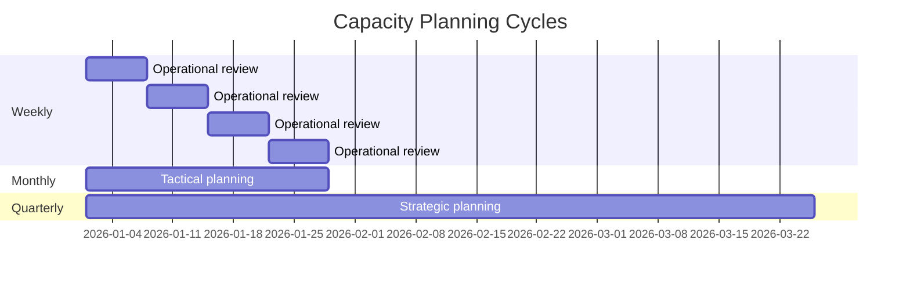
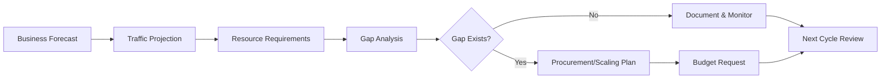
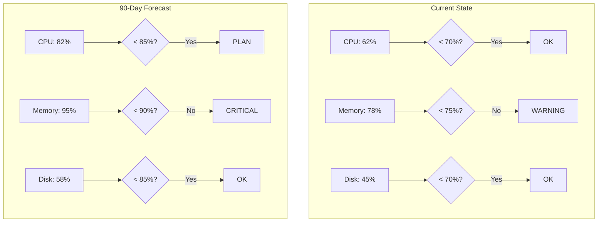
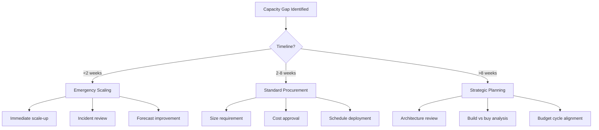
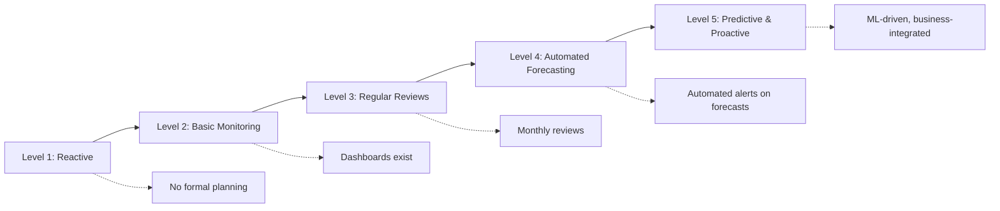
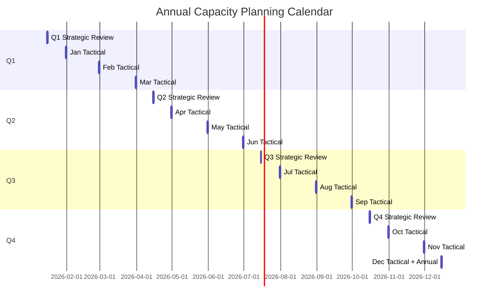

# How to Create Capacity Planning Cycles

Author: [nawazdhandala](https://github.com/nawazdhandala)

Tags: Capacity Planning, Planning, SRE, Infrastructure

Description: Learn how to establish regular capacity planning cycles for proactive management.

---

Capacity planning without a repeatable cycle is just guessing with spreadsheets. Teams that run structured planning cycles catch resource shortfalls months ahead, avoid panic scaling, and make infrastructure spend predictable. This guide walks through building a capacity planning rhythm that fits real engineering teams.

## Why Cycles Beat Ad-Hoc Planning

Ad-hoc capacity planning happens when something breaks or costs spike. By then, you're firefighting. Regular cycles shift the work upstream:

- Catch trends before they become incidents
- Align infrastructure spend with business forecasts
- Create accountability through documented reviews
- Build organizational muscle for data-driven decisions

> "The best time to plan capacity was three months ago. The second best time is now."

---

## Planning Cycle Frequency

Different time horizons require different cadences. Most mature infrastructure teams run three overlapping cycles:



| Cycle | Focus | Participants | Output |
|-------|-------|--------------|--------|
| Weekly | Operational health, anomaly detection | SRE, Platform | Action items, incident follow-ups |
| Monthly | Tactical adjustments, 30-90 day forecasts | SRE, Engineering leads | Scaling decisions, procurement requests |
| Quarterly | Strategic planning, 6-12 month roadmap | SRE, Finance, Product | Budget allocations, architecture decisions |

Start with monthly cycles. Add weekly reviews once you have automation in place. Graduate to quarterly strategic planning when the team matures.

---

## Short-Term vs Long-Term Planning

Short-term and long-term planning solve different problems. Mixing them up leads to either constant firefighting or outdated projections.

### Short-Term Planning (1-30 days)

Short-term planning answers: "Will we survive next week?"

Focus areas:
- Current utilization vs thresholds
- Known traffic events (launches, campaigns, holidays)
- Recent growth rates extrapolated
- Immediate bottlenecks and hotspots

```yaml
# Short-term capacity check - run weekly
apiVersion: v1
kind: ConfigMap
metadata:
  name: capacity-thresholds
  namespace: monitoring
data:
  cpu_warning: "70"      # Alert when cluster CPU > 70%
  cpu_critical: "85"     # Page when cluster CPU > 85%
  memory_warning: "75"   # Alert when memory > 75%
  memory_critical: "90"  # Page when memory > 90%
  disk_warning: "70"     # Alert when disk > 70%
  disk_critical: "85"    # Page when disk > 85%
```

### Long-Term Planning (3-12 months)

Long-term planning answers: "What infrastructure do we need to support the business roadmap?"

Focus areas:
- Business growth projections
- New product launches and feature rollouts
- Technology migrations and architecture changes
- Contract renewals and procurement lead times



The key insight: short-term uses current data and trends; long-term uses business inputs and architectural assumptions.

---

## Data Collection Phases

Good capacity planning requires good data. Structure your collection into three phases.

### Phase 1: Infrastructure Metrics

Collect baseline utilization data across all resource types:

```python
# capacity_collector.py
# Collects infrastructure metrics for capacity planning

import prometheus_api_client
from datetime import datetime, timedelta

class CapacityCollector:
    def __init__(self, prometheus_url):
        self.prom = prometheus_api_client.PrometheusConnect(
            url=prometheus_url,
            disable_ssl=False
        )

    def collect_cluster_metrics(self, days=30):
        """Collect cluster-wide metrics for capacity planning."""
        end_time = datetime.now()
        start_time = end_time - timedelta(days=days)

        metrics = {
            'cpu': self._query_range(
                'sum(rate(container_cpu_usage_seconds_total[5m])) / '
                'sum(machine_cpu_cores) * 100',
                start_time, end_time
            ),
            'memory': self._query_range(
                'sum(container_memory_working_set_bytes) / '
                'sum(machine_memory_bytes) * 100',
                start_time, end_time
            ),
            'disk': self._query_range(
                '(sum(node_filesystem_size_bytes) - '
                'sum(node_filesystem_avail_bytes)) / '
                'sum(node_filesystem_size_bytes) * 100',
                start_time, end_time
            ),
            'network': self._query_range(
                'sum(rate(node_network_receive_bytes_total[5m])) + '
                'sum(rate(node_network_transmit_bytes_total[5m]))',
                start_time, end_time
            )
        }
        return metrics

    def _query_range(self, query, start, end, step='1h'):
        """Execute a range query against Prometheus."""
        return self.prom.custom_query_range(
            query=query,
            start_time=start,
            end_time=end,
            step=step
        )

    def calculate_statistics(self, metrics):
        """Calculate planning statistics from collected metrics."""
        stats = {}
        for metric_name, data in metrics.items():
            values = [float(point[1]) for point in data[0]['values']]
            stats[metric_name] = {
                'current': values[-1],
                'average': sum(values) / len(values),
                'p95': sorted(values)[int(len(values) * 0.95)],
                'max': max(values),
                'trend': self._calculate_trend(values)
            }
        return stats

    def _calculate_trend(self, values):
        """Calculate weekly growth trend as percentage."""
        if len(values) < 168:  # Less than a week of hourly data
            return 0
        week_ago = values[-168]
        current = values[-1]
        if week_ago == 0:
            return 0
        return ((current - week_ago) / week_ago) * 100
```

### Phase 2: Application Metrics

Infrastructure metrics alone miss the picture. Collect application-level data:

```python
# application_metrics.py
# Collects application-level metrics for capacity correlation

class ApplicationMetrics:
    def __init__(self, prometheus_url):
        self.prom = prometheus_api_client.PrometheusConnect(url=prometheus_url)

    def collect_service_metrics(self, service_name, days=30):
        """Collect service-specific metrics for capacity correlation."""
        return {
            'requests_per_second': self._query(
                f'sum(rate(http_requests_total{{service="{service_name}"}}[5m]))'
            ),
            'active_users': self._query(
                f'sum(active_sessions{{service="{service_name}"}})'
            ),
            'queue_depth': self._query(
                f'sum(queue_length{{service="{service_name}"}})'
            ),
            'error_rate': self._query(
                f'sum(rate(http_requests_total{{service="{service_name}",status=~"5.."}}[5m])) / '
                f'sum(rate(http_requests_total{{service="{service_name}"}}[5m])) * 100'
            )
        }

    def _query(self, query):
        return self.prom.custom_query(query=query)
```

### Phase 3: Business Metrics

Connect infrastructure to business outcomes:

```python
# business_metrics.py
# Pulls business metrics for capacity correlation

class BusinessMetrics:
    def __init__(self, analytics_client):
        self.analytics = analytics_client

    def collect_business_data(self, days=30):
        """Collect business metrics that drive capacity needs."""
        return {
            'daily_active_users': self.analytics.get_metric('dau', days),
            'monthly_active_users': self.analytics.get_metric('mau', days),
            'transactions_per_day': self.analytics.get_metric('transactions', days),
            'data_ingestion_volume': self.analytics.get_metric('data_volume_gb', days),
            'api_calls_per_day': self.analytics.get_metric('api_calls', days)
        }

    def get_growth_forecast(self, months_ahead=6):
        """Get business growth forecast from planning team."""
        return {
            'user_growth_rate': 0.15,  # 15% monthly growth expected
            'traffic_multiplier': 1.2,  # 20% more traffic per user
            'seasonal_factor': self._get_seasonal_factors(months_ahead)
        }

    def _get_seasonal_factors(self, months):
        """Return seasonal traffic multipliers by month."""
        # Example: e-commerce with Q4 spike
        seasonal = {
            1: 0.9, 2: 0.85, 3: 0.9, 4: 0.95,
            5: 1.0, 6: 1.0, 7: 0.95, 8: 0.95,
            9: 1.0, 10: 1.1, 11: 1.3, 12: 1.5
        }
        return [seasonal[(datetime.now().month + i) % 12 or 12]
                for i in range(months)]
```

---

## Analysis and Forecasting

Raw data becomes actionable through analysis. Build a forecasting pipeline that runs automatically.

### Trend Analysis

```python
# forecasting.py
# Capacity forecasting using collected metrics

import numpy as np
from scipy import stats

class CapacityForecaster:
    def __init__(self, metrics_data):
        self.data = metrics_data

    def linear_forecast(self, metric_name, days_ahead=90):
        """Simple linear regression forecast."""
        values = self.data[metric_name]
        x = np.arange(len(values))
        slope, intercept, r_value, p_value, std_err = stats.linregress(x, values)

        future_x = len(values) + days_ahead
        forecast = slope * future_x + intercept

        return {
            'current': values[-1],
            'forecast': forecast,
            'days_ahead': days_ahead,
            'daily_growth': slope,
            'confidence': r_value ** 2,
            'days_to_threshold': self._days_to_threshold(
                values[-1], slope, threshold=85
            )
        }

    def _days_to_threshold(self, current, daily_growth, threshold):
        """Calculate days until threshold is reached."""
        if daily_growth <= 0:
            return float('inf')
        return (threshold - current) / daily_growth

    def generate_forecast_report(self, thresholds):
        """Generate a complete forecast report for all metrics."""
        report = {}
        for metric, threshold in thresholds.items():
            forecast = self.linear_forecast(metric, days_ahead=90)
            report[metric] = {
                **forecast,
                'threshold': threshold,
                'status': self._get_status(forecast, threshold)
            }
        return report

    def _get_status(self, forecast, threshold):
        """Determine planning status based on forecast."""
        days = forecast.get('days_to_threshold', float('inf'))
        if days < 14:
            return 'CRITICAL'  # Less than 2 weeks
        elif days < 30:
            return 'WARNING'   # Less than a month
        elif days < 90:
            return 'PLAN'      # Less than a quarter
        return 'OK'
```

### Visualization

Create dashboards that make capacity status immediately visible:



---

## Decision and Action Phases

Data and forecasts are useless without decisions. Structure your planning meetings to drive action.

### Weekly Review Agenda (30 minutes)

```markdown
## Weekly Capacity Review

### 1. Dashboard Review (5 min)
- Current utilization vs thresholds
- Any alerts triggered this week?
- Anomalies or unexpected patterns?

### 2. Incident Follow-up (10 min)
- Capacity-related incidents since last review
- Root cause: forecasting miss or unexpected event?
- Action items from postmortems

### 3. Short-term Actions (10 min)
- Scaling decisions needed this week
- Known events requiring preparation
- Blockers from previous action items

### 4. Parking Lot (5 min)
- Items for monthly tactical review
- Questions for product/business teams
```

### Monthly Tactical Review Agenda (60 minutes)

```markdown
## Monthly Capacity Planning Review

### 1. Metrics Review (15 min)
- 30-day trends for all resource types
- Month-over-month comparison
- Correlation with business metrics

### 2. Forecast Analysis (15 min)
- 90-day forecasts for critical resources
- Confidence levels and assumptions
- Risks and uncertainties

### 3. Action Planning (20 min)
- Resources needing scale-up
- Optimization opportunities
- Procurement requests
- Architecture improvements

### 4. Budget Check (10 min)
- Actual vs planned spend
- Forecast for next month
- Variance explanations
```

### Quarterly Strategic Review Agenda (2 hours)

```markdown
## Quarterly Capacity Strategy Review

### 1. Business Alignment (30 min)
- Product roadmap review
- Expected user/traffic growth
- New features with capacity implications
- Seasonal factors and major events

### 2. Infrastructure Assessment (30 min)
- Current architecture capacity limits
- Technical debt impacting capacity
- Technology refresh needs
- Multi-region/availability considerations

### 3. Financial Review (30 min)
- Quarterly spend vs budget
- Cost per user/transaction trends
- Optimization ROI from previous quarter
- Budget request for next quarter

### 4. Strategic Decisions (30 min)
- Major scaling investments
- Architecture changes
- Vendor/technology decisions
- Hiring needs for capacity management
```

### Decision Framework

Use this framework to standardize capacity decisions:



---

## Continuous Improvement

Capacity planning cycles should improve themselves. Build feedback loops into the process.

### Measure Forecast Accuracy

Track how well your forecasts perform:

```python
# forecast_accuracy.py
# Track and improve forecast accuracy over time

class ForecastAccuracyTracker:
    def __init__(self, database):
        self.db = database

    def record_forecast(self, metric, forecast_value, target_date):
        """Store a forecast for later accuracy measurement."""
        self.db.insert('forecasts', {
            'metric': metric,
            'forecast_value': forecast_value,
            'forecast_date': datetime.now(),
            'target_date': target_date
        })

    def calculate_accuracy(self, metric, lookback_days=90):
        """Calculate forecast accuracy for a metric."""
        forecasts = self.db.query(
            'SELECT * FROM forecasts WHERE metric = ? '
            'AND target_date < ? AND target_date > ?',
            [metric, datetime.now(),
             datetime.now() - timedelta(days=lookback_days)]
        )

        errors = []
        for forecast in forecasts:
            actual = self._get_actual_value(metric, forecast['target_date'])
            error = abs(forecast['forecast_value'] - actual) / actual * 100
            errors.append(error)

        return {
            'mean_error': sum(errors) / len(errors) if errors else 0,
            'max_error': max(errors) if errors else 0,
            'forecasts_evaluated': len(errors)
        }

    def _get_actual_value(self, metric, date):
        """Retrieve actual metric value for a given date."""
        return self.db.query_one(
            'SELECT value FROM metrics WHERE metric = ? AND date = ?',
            [metric, date]
        )['value']
```

### Retrospective Questions

After each quarterly cycle, ask:

1. Which forecasts were most accurate? Why?
2. Which forecasts missed? What data was missing?
3. Did we have enough lead time for scaling decisions?
4. Were any capacity incidents preventable with better planning?
5. What business inputs would improve next quarter's forecasts?

### Maturity Progression



Level progression checklist:

- **Level 1 to 2**: Implement basic resource monitoring and dashboards
- **Level 2 to 3**: Establish monthly review meetings with documented outcomes
- **Level 3 to 4**: Automate data collection and forecasting scripts
- **Level 4 to 5**: Integrate business forecasts, implement ML-based predictions

---

## Putting It Together: A Sample Annual Calendar



Weekly reviews happen every Monday. They're not on the chart because they're too frequent, but they form the foundation of the entire system.

---

## Summary

Building effective capacity planning cycles requires:

1. **Choose your cadence**: Start with monthly tactical reviews, add weekly operational reviews, graduate to quarterly strategic planning
2. **Separate short and long-term**: Use different data, different meetings, different decisions
3. **Automate data collection**: Infrastructure, application, and business metrics flowing automatically
4. **Forecast with humility**: Track accuracy, improve models, acknowledge uncertainty
5. **Drive decisions**: Structured agendas that produce documented action items
6. **Improve continuously**: Retrospectives, accuracy tracking, maturity progression

The goal isn't perfect predictions. It's building organizational muscle to make capacity decisions proactively, with data, before they become emergencies.

---

**Related Reading:**

- [The Five Stages of SRE Maturity](https://oneuptime.com/blog/post/2025-09-01-the-five-stages-of-sre-maturity/view)
- [SRE Best Practices That Actually Move the Needle](https://oneuptime.com/blog/post/2025-11-28-sre-best-practices/view)
- [Eliminating Toil: A Practical SRE Playbook](https://oneuptime.com/blog/post/2025-10-01-what-is-toil-and-how-to-eliminate-it/view)
