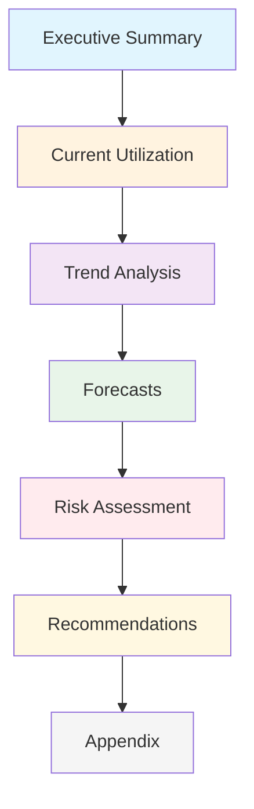
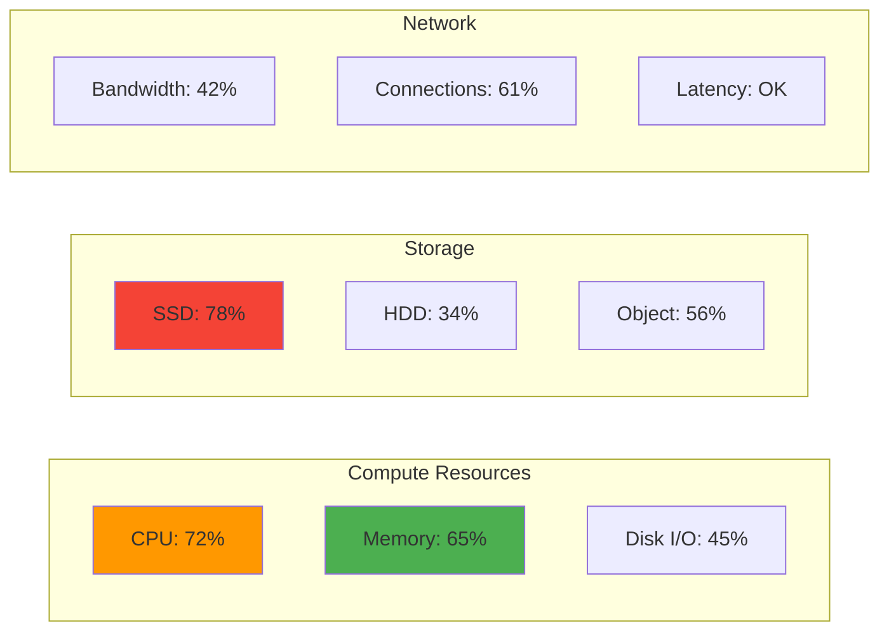
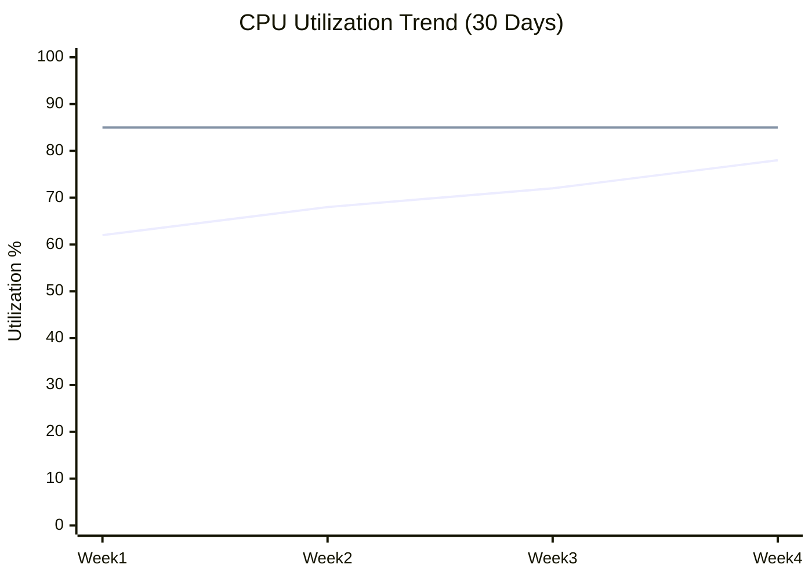
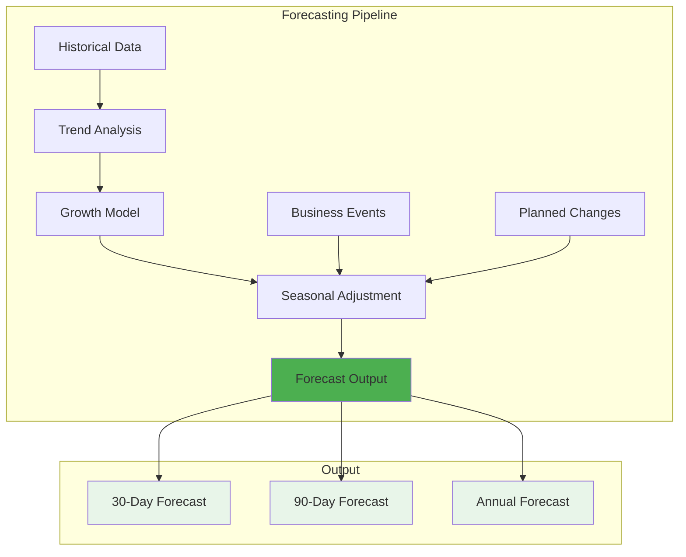
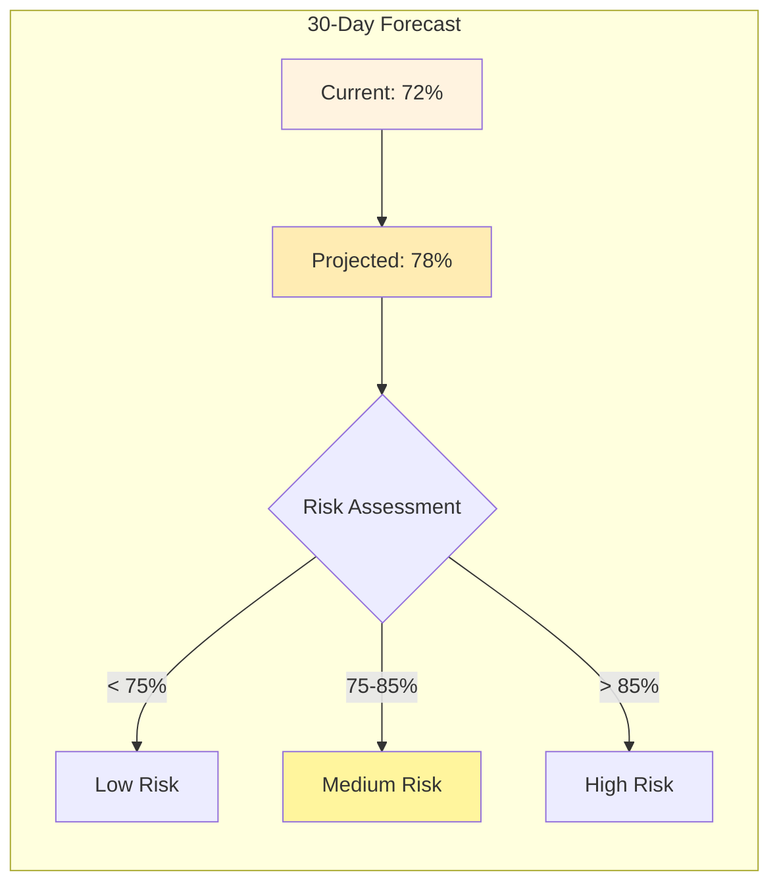
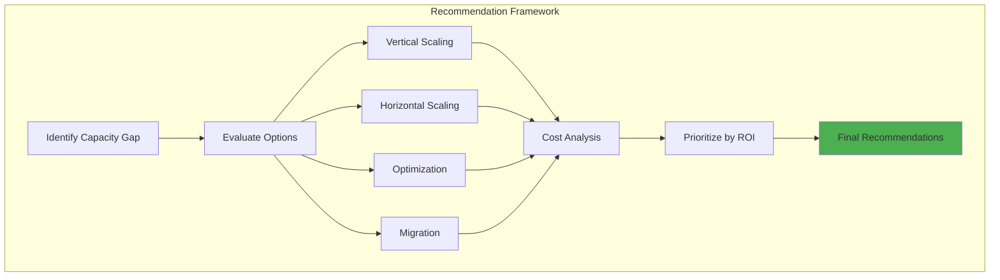
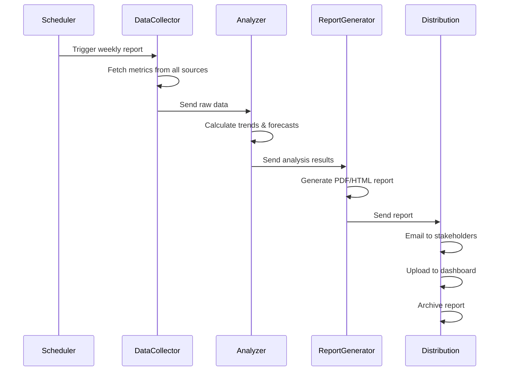

# How to Create Capacity Reports

Author: [nawazdhandala](https://github.com/nawazdhandala)

Tags: Capacity Planning, Reporting, SRE, Infrastructure

Description: Learn how to create effective capacity reports for planning and communication.

---

Capacity reports are essential documents that communicate the current state of your infrastructure, predict future needs, and provide actionable recommendations to stakeholders. Whether you are presenting to engineering teams or executive leadership, well-crafted capacity reports help drive informed decisions about infrastructure investments.

In this guide, we will cover how to structure capacity reports, what metrics to include, how to visualize trends, and how to automate the entire reporting process.

## Report Content Structure

A comprehensive capacity report should follow a clear structure that guides readers from current state to recommendations. Here is the recommended structure:



### Key Sections Explained

1. **Executive Summary**: A one-page overview for leadership with key findings and urgent recommendations
2. **Current Utilization**: Detailed metrics showing resource consumption across services
3. **Trend Analysis**: Historical patterns and seasonality in resource usage
4. **Forecasts**: Projected resource needs based on growth models
5. **Risk Assessment**: Identification of capacity-related risks and their business impact
6. **Recommendations**: Prioritized actions with cost estimates and timelines
7. **Appendix**: Raw data, methodology notes, and detailed calculations

Here is a Python class that defines this report structure:

```python
from dataclasses import dataclass, field
from datetime import datetime
from typing import List, Dict, Optional
from enum import Enum

class ReportSection(Enum):
    EXECUTIVE_SUMMARY = "executive_summary"
    CURRENT_UTILIZATION = "current_utilization"
    TREND_ANALYSIS = "trend_analysis"
    FORECASTS = "forecasts"
    RISK_ASSESSMENT = "risk_assessment"
    RECOMMENDATIONS = "recommendations"
    APPENDIX = "appendix"

@dataclass
class CapacityReport:
    """Structured capacity report for infrastructure planning."""

    title: str
    report_date: datetime
    reporting_period_start: datetime
    reporting_period_end: datetime
    author: str
    version: str = "1.0"

    # Report sections
    executive_summary: Optional[str] = None
    utilization_data: Dict[str, any] = field(default_factory=dict)
    trends: List[Dict] = field(default_factory=list)
    forecasts: List[Dict] = field(default_factory=list)
    risks: List[Dict] = field(default_factory=list)
    recommendations: List[Dict] = field(default_factory=list)
    appendix_items: List[Dict] = field(default_factory=list)

    def add_utilization_metric(self, resource: str, metrics: Dict):
        """Add utilization metrics for a resource."""
        self.utilization_data[resource] = {
            "timestamp": datetime.now().isoformat(),
            "metrics": metrics
        }

    def add_recommendation(self, priority: int, title: str,
                          description: str, estimated_cost: float,
                          timeline_weeks: int):
        """Add a prioritized recommendation."""
        self.recommendations.append({
            "priority": priority,
            "title": title,
            "description": description,
            "estimated_cost": estimated_cost,
            "timeline_weeks": timeline_weeks,
            "status": "proposed"
        })

    def generate_executive_summary(self) -> str:
        """Auto-generate executive summary from report data."""
        total_risks = len([r for r in self.risks if r.get("severity") == "high"])
        urgent_recommendations = len([r for r in self.recommendations if r.get("priority") <= 2])

        summary = f"""
## Executive Summary

**Reporting Period**: {self.reporting_period_start.strftime('%Y-%m-%d')} to {self.reporting_period_end.strftime('%Y-%m-%d')}

### Key Findings
- **Resources Analyzed**: {len(self.utilization_data)}
- **High-Severity Risks**: {total_risks}
- **Urgent Recommendations**: {urgent_recommendations}

### Critical Actions Required
"""
        for rec in sorted(self.recommendations, key=lambda x: x["priority"])[:3]:
            summary += f"- [{rec['title']}] - Est. ${rec['estimated_cost']:,.0f} - {rec['timeline_weeks']} weeks\n"

        self.executive_summary = summary
        return summary
```

## Utilization Summaries

Utilization summaries provide a snapshot of how resources are being consumed. The goal is to present data that is both comprehensive and easily digestible.



### Building Utilization Summaries

Here is a comprehensive utilization summary generator:

```python
import statistics
from datetime import datetime, timedelta
from typing import List, Dict, Tuple

class UtilizationSummary:
    """Generate utilization summaries for capacity reports."""

    def __init__(self, metrics_client):
        self.metrics = metrics_client
        self.thresholds = {
            "critical": 90,
            "warning": 75,
            "healthy": 50
        }

    def get_resource_utilization(self, resource_type: str,
                                  resource_ids: List[str],
                                  period_days: int = 30) -> Dict:
        """
        Calculate utilization summary for a resource type.

        Returns aggregated metrics including average, peak,
        and percentile values.
        """
        end_time = datetime.now()
        start_time = end_time - timedelta(days=period_days)

        summary = {
            "resource_type": resource_type,
            "period_start": start_time.isoformat(),
            "period_end": end_time.isoformat(),
            "resources_analyzed": len(resource_ids),
            "metrics": {}
        }

        all_values = []
        resource_details = []

        for resource_id in resource_ids:
            # Fetch metrics for each resource
            data = self.metrics.query(
                resource_type=resource_type,
                resource_id=resource_id,
                metric="utilization",
                start=start_time,
                end=end_time
            )

            if data:
                values = [point["value"] for point in data]
                all_values.extend(values)

                resource_details.append({
                    "id": resource_id,
                    "avg": statistics.mean(values),
                    "max": max(values),
                    "min": min(values),
                    "p95": self._percentile(values, 95),
                    "status": self._get_status(statistics.mean(values))
                })

        # Calculate aggregate metrics
        if all_values:
            summary["metrics"] = {
                "average": round(statistics.mean(all_values), 2),
                "maximum": round(max(all_values), 2),
                "minimum": round(min(all_values), 2),
                "p50": round(self._percentile(all_values, 50), 2),
                "p95": round(self._percentile(all_values, 95), 2),
                "p99": round(self._percentile(all_values, 99), 2),
                "std_dev": round(statistics.stdev(all_values), 2) if len(all_values) > 1 else 0
            }

            summary["overall_status"] = self._get_status(summary["metrics"]["p95"])
            summary["resource_details"] = resource_details

            # Identify problem resources
            summary["resources_at_risk"] = [
                r for r in resource_details
                if r["status"] in ["critical", "warning"]
            ]

        return summary

    def generate_utilization_table(self, summaries: List[Dict]) -> str:
        """Generate a markdown table from utilization summaries."""
        table = """
| Resource Type | Count | Avg % | P95 % | Max % | Status |
|--------------|-------|-------|-------|-------|--------|
"""
        for s in summaries:
            metrics = s.get("metrics", {})
            status_emoji = {
                "critical": "RED",
                "warning": "YELLOW",
                "healthy": "GREEN"
            }.get(s.get("overall_status", ""), "GRAY")

            table += f"| {s['resource_type']} | {s['resources_analyzed']} | "
            table += f"{metrics.get('average', 'N/A')} | {metrics.get('p95', 'N/A')} | "
            table += f"{metrics.get('maximum', 'N/A')} | {status_emoji} |\n"

        return table

    def _percentile(self, values: List[float], percentile: int) -> float:
        """Calculate percentile value."""
        sorted_values = sorted(values)
        index = (len(sorted_values) - 1) * percentile / 100
        lower = int(index)
        upper = lower + 1

        if upper >= len(sorted_values):
            return sorted_values[-1]

        weight = index - lower
        return sorted_values[lower] * (1 - weight) + sorted_values[upper] * weight

    def _get_status(self, value: float) -> str:
        """Determine status based on thresholds."""
        if value >= self.thresholds["critical"]:
            return "critical"
        elif value >= self.thresholds["warning"]:
            return "warning"
        return "healthy"
```

### Sample Utilization Report Output

When you run the utilization summary, you get output like this:

| Resource Type | Count | Avg % | P95 % | Max % | Status |
|--------------|-------|-------|-------|-------|--------|
| CPU | 150 | 68.4 | 85.2 | 94.1 | WARNING |
| Memory | 150 | 72.1 | 88.7 | 96.3 | WARNING |
| Disk | 150 | 45.2 | 62.8 | 78.4 | HEALTHY |
| Network | 50 | 38.9 | 71.2 | 89.1 | HEALTHY |

## Trend Visualizations

Trends help stakeholders understand how resource consumption evolves over time. Good trend visualizations reveal patterns like daily cycles, weekly patterns, and long-term growth.



### Trend Analysis Implementation

```python
import numpy as np
from datetime import datetime, timedelta
from typing import List, Dict, Tuple, Optional
from dataclasses import dataclass

@dataclass
class TrendPoint:
    """A single point in a trend analysis."""
    timestamp: datetime
    value: float
    predicted: bool = False

class TrendAnalyzer:
    """Analyze and visualize resource utilization trends."""

    def __init__(self, data_points: List[Dict]):
        """
        Initialize with historical data points.
        Each point should have 'timestamp' and 'value' keys.
        """
        self.data = sorted(data_points, key=lambda x: x['timestamp'])
        self.timestamps = [d['timestamp'] for d in self.data]
        self.values = [d['value'] for d in self.data]

    def calculate_moving_average(self, window_size: int = 7) -> List[TrendPoint]:
        """
        Calculate moving average to smooth out noise.

        Args:
            window_size: Number of data points to average

        Returns:
            List of TrendPoints with smoothed values
        """
        if len(self.values) < window_size:
            return []

        result = []
        for i in range(window_size - 1, len(self.values)):
            window = self.values[i - window_size + 1:i + 1]
            avg = sum(window) / window_size
            result.append(TrendPoint(
                timestamp=self.timestamps[i],
                value=round(avg, 2)
            ))

        return result

    def detect_seasonality(self) -> Dict:
        """
        Detect daily and weekly patterns in the data.

        Returns patterns that can be used for capacity planning.
        """
        hourly_patterns = {}
        daily_patterns = {}

        for point in self.data:
            hour = point['timestamp'].hour
            day = point['timestamp'].strftime('%A')

            if hour not in hourly_patterns:
                hourly_patterns[hour] = []
            hourly_patterns[hour].append(point['value'])

            if day not in daily_patterns:
                daily_patterns[day] = []
            daily_patterns[day].append(point['value'])

        # Calculate average for each hour and day
        hourly_avg = {
            h: round(sum(v) / len(v), 2)
            for h, v in hourly_patterns.items()
        }
        daily_avg = {
            d: round(sum(v) / len(v), 2)
            for d, v in daily_patterns.items()
        }

        # Find peak periods
        peak_hour = max(hourly_avg, key=hourly_avg.get)
        peak_day = max(daily_avg, key=daily_avg.get)
        low_hour = min(hourly_avg, key=hourly_avg.get)
        low_day = min(daily_avg, key=daily_avg.get)

        return {
            "hourly_pattern": hourly_avg,
            "daily_pattern": daily_avg,
            "peak_hour": peak_hour,
            "peak_day": peak_day,
            "low_hour": low_hour,
            "low_day": low_day,
            "peak_to_low_ratio": round(
                hourly_avg[peak_hour] / hourly_avg[low_hour], 2
            ) if hourly_avg[low_hour] > 0 else None
        }

    def calculate_growth_rate(self) -> Dict:
        """
        Calculate growth rate using linear regression.

        Returns growth metrics including daily, weekly, and
        monthly growth rates.
        """
        if len(self.values) < 2:
            return {"error": "Insufficient data points"}

        # Convert timestamps to numeric values (days since start)
        start = self.timestamps[0]
        x = np.array([(t - start).total_seconds() / 86400 for t in self.timestamps])
        y = np.array(self.values)

        # Linear regression
        n = len(x)
        slope = (n * np.sum(x * y) - np.sum(x) * np.sum(y)) / \
                (n * np.sum(x ** 2) - np.sum(x) ** 2)
        intercept = (np.sum(y) - slope * np.sum(x)) / n

        # Calculate R-squared
        y_pred = slope * x + intercept
        ss_res = np.sum((y - y_pred) ** 2)
        ss_tot = np.sum((y - np.mean(y)) ** 2)
        r_squared = 1 - (ss_res / ss_tot) if ss_tot > 0 else 0

        return {
            "daily_growth_rate": round(slope, 4),
            "weekly_growth_rate": round(slope * 7, 4),
            "monthly_growth_rate": round(slope * 30, 4),
            "r_squared": round(r_squared, 4),
            "trend_direction": "increasing" if slope > 0 else "decreasing",
            "baseline": round(intercept, 2),
            "confidence": "high" if r_squared > 0.8 else "medium" if r_squared > 0.5 else "low"
        }

    def generate_trend_chart_data(self) -> Dict:
        """
        Generate data formatted for chart visualization.

        Compatible with Chart.js, Plotly, and similar libraries.
        """
        moving_avg = self.calculate_moving_average()
        growth = self.calculate_growth_rate()

        # Generate trend line points
        x_vals = [(t - self.timestamps[0]).total_seconds() / 86400
                  for t in self.timestamps]
        trend_line = [
            growth['baseline'] + growth['daily_growth_rate'] * x
            for x in x_vals
        ]

        return {
            "labels": [t.strftime('%Y-%m-%d') for t in self.timestamps],
            "datasets": [
                {
                    "label": "Actual Values",
                    "data": self.values,
                    "type": "line",
                    "borderColor": "#2196F3"
                },
                {
                    "label": "Moving Average (7-day)",
                    "data": [None] * (len(self.values) - len(moving_avg)) +
                           [p.value for p in moving_avg],
                    "type": "line",
                    "borderColor": "#4CAF50"
                },
                {
                    "label": "Trend Line",
                    "data": trend_line,
                    "type": "line",
                    "borderColor": "#FF9800",
                    "borderDash": [5, 5]
                }
            ],
            "growth_metrics": growth
        }
```

## Forecast Projections

Forecasts predict future resource needs based on historical trends and expected growth. Accurate forecasts are critical for budget planning and procurement timelines.



### Implementing Capacity Forecasts

```python
from datetime import datetime, timedelta
from typing import List, Dict, Optional, Tuple
import math

class CapacityForecaster:
    """
    Forecast future capacity requirements using multiple models.
    """

    def __init__(self, trend_analyzer: TrendAnalyzer):
        self.trend = trend_analyzer
        self.growth = trend_analyzer.calculate_growth_rate()
        self.seasonality = trend_analyzer.detect_seasonality()

    def linear_forecast(self, days_ahead: int,
                       confidence_level: float = 0.95) -> Dict:
        """
        Generate linear forecast with confidence intervals.

        Args:
            days_ahead: Number of days to forecast
            confidence_level: Confidence level for prediction intervals

        Returns:
            Forecast with point estimates and confidence bounds
        """
        current_value = self.trend.values[-1]
        daily_growth = self.growth['daily_growth_rate']

        forecasts = []
        last_date = self.trend.timestamps[-1]

        # Calculate standard error for confidence intervals
        residuals = []
        for i, val in enumerate(self.trend.values):
            predicted = self.growth['baseline'] + daily_growth * i
            residuals.append(val - predicted)

        std_error = (sum(r**2 for r in residuals) / len(residuals)) ** 0.5

        # Z-score for confidence level
        z_score = 1.96 if confidence_level == 0.95 else 1.645

        for day in range(1, days_ahead + 1):
            forecast_date = last_date + timedelta(days=day)
            point_estimate = current_value + (daily_growth * day)

            # Confidence interval widens with forecast horizon
            margin = z_score * std_error * math.sqrt(1 + day / len(self.trend.values))

            forecasts.append({
                "date": forecast_date.strftime('%Y-%m-%d'),
                "point_estimate": round(point_estimate, 2),
                "lower_bound": round(point_estimate - margin, 2),
                "upper_bound": round(point_estimate + margin, 2),
                "confidence_level": confidence_level
            })

        return {
            "model": "linear",
            "forecasts": forecasts,
            "model_parameters": {
                "daily_growth_rate": daily_growth,
                "r_squared": self.growth['r_squared']
            }
        }

    def capacity_exhaustion_date(self, current_capacity: float,
                                 threshold: float = 100.0) -> Dict:
        """
        Calculate when capacity will be exhausted at current growth rate.

        Args:
            current_capacity: Current resource capacity (absolute value)
            threshold: Percentage threshold to consider as exhausted

        Returns:
            Estimated exhaustion date and time-to-exhaustion
        """
        current_utilization = self.trend.values[-1]
        daily_growth = self.growth['daily_growth_rate']

        if daily_growth <= 0:
            return {
                "exhaustion_date": None,
                "days_to_exhaustion": None,
                "message": "No growth detected - capacity not at risk"
            }

        # Calculate days until threshold is reached
        target_utilization = threshold
        days_to_exhaustion = (target_utilization - current_utilization) / daily_growth

        if days_to_exhaustion < 0:
            return {
                "exhaustion_date": "Already exceeded",
                "days_to_exhaustion": 0,
                "message": "Capacity threshold already exceeded",
                "urgency": "critical"
            }

        exhaustion_date = datetime.now() + timedelta(days=days_to_exhaustion)

        # Determine urgency level
        if days_to_exhaustion <= 30:
            urgency = "critical"
        elif days_to_exhaustion <= 90:
            urgency = "high"
        elif days_to_exhaustion <= 180:
            urgency = "medium"
        else:
            urgency = "low"

        return {
            "exhaustion_date": exhaustion_date.strftime('%Y-%m-%d'),
            "days_to_exhaustion": round(days_to_exhaustion),
            "current_utilization": current_utilization,
            "threshold": threshold,
            "daily_growth_rate": daily_growth,
            "urgency": urgency,
            "message": f"Capacity will reach {threshold}% in {round(days_to_exhaustion)} days"
        }

    def generate_forecast_table(self, periods: List[int] = [30, 60, 90, 180]) -> str:
        """Generate a markdown table with forecast projections."""
        table = """
| Timeframe | Projected Utilization | Lower Bound | Upper Bound | Risk Level |
|-----------|----------------------|-------------|-------------|------------|
"""
        for days in periods:
            forecast = self.linear_forecast(days)['forecasts'][-1]

            risk = "LOW"
            if forecast['point_estimate'] >= 90:
                risk = "CRITICAL"
            elif forecast['point_estimate'] >= 75:
                risk = "HIGH"
            elif forecast['point_estimate'] >= 60:
                risk = "MEDIUM"

            table += f"| {days} days | {forecast['point_estimate']}% | "
            table += f"{forecast['lower_bound']}% | {forecast['upper_bound']}% | {risk} |\n"

        return table
```

### Forecast Visualization

The forecasting system produces output that can be visualized in capacity reports:



## Recommendation Sections

Recommendations translate data insights into actionable items. Each recommendation should include priority, cost, timeline, and expected impact.



### Building the Recommendation Engine

```python
from typing import List, Dict, Optional
from dataclasses import dataclass, field
from enum import Enum
from datetime import datetime

class RecommendationType(Enum):
    SCALE_UP = "scale_up"
    SCALE_OUT = "scale_out"
    OPTIMIZE = "optimize"
    MIGRATE = "migrate"
    ARCHIVE = "archive"
    NO_ACTION = "no_action"

class Priority(Enum):
    CRITICAL = 1
    HIGH = 2
    MEDIUM = 3
    LOW = 4

@dataclass
class Recommendation:
    """A single capacity planning recommendation."""
    id: str
    title: str
    description: str
    recommendation_type: RecommendationType
    priority: Priority
    affected_resources: List[str]
    estimated_cost: float
    estimated_savings: float
    implementation_time_weeks: int
    risk_if_not_implemented: str
    prerequisites: List[str] = field(default_factory=list)

    def roi(self) -> float:
        """Calculate return on investment."""
        if self.estimated_cost == 0:
            return float('inf') if self.estimated_savings > 0 else 0
        return self.estimated_savings / self.estimated_cost

class RecommendationEngine:
    """
    Generate capacity planning recommendations based on utilization
    data, trends, and forecasts.
    """

    def __init__(self, utilization_summary: Dict,
                 forecaster: CapacityForecaster):
        self.utilization = utilization_summary
        self.forecaster = forecaster
        self.recommendations: List[Recommendation] = []

    def analyze_and_recommend(self) -> List[Recommendation]:
        """
        Analyze current state and generate recommendations.

        Returns prioritized list of recommendations.
        """
        self._check_critical_utilization()
        self._check_growth_trajectory()
        self._check_optimization_opportunities()
        self._check_cost_savings()

        # Sort by priority and ROI
        self.recommendations.sort(
            key=lambda r: (r.priority.value, -r.roi())
        )

        return self.recommendations

    def _check_critical_utilization(self):
        """Check for resources at critical utilization levels."""
        for resource, data in self.utilization.items():
            metrics = data.get('metrics', {})
            p95 = metrics.get('p95', 0)

            if p95 >= 90:
                self.recommendations.append(Recommendation(
                    id=f"scale-{resource}-critical",
                    title=f"Urgent: Scale {resource} capacity",
                    description=f"{resource} is at {p95}% utilization (P95). "
                               f"Immediate scaling required to prevent outages.",
                    recommendation_type=RecommendationType.SCALE_UP,
                    priority=Priority.CRITICAL,
                    affected_resources=[resource],
                    estimated_cost=self._estimate_scaling_cost(resource, 1.5),
                    estimated_savings=self._estimate_outage_cost(resource),
                    implementation_time_weeks=1,
                    risk_if_not_implemented="High probability of service degradation "
                                           "or outage within 30 days"
                ))
            elif p95 >= 75:
                self.recommendations.append(Recommendation(
                    id=f"scale-{resource}-warning",
                    title=f"Plan: Scale {resource} capacity",
                    description=f"{resource} is at {p95}% utilization (P95). "
                               f"Plan scaling within 60 days.",
                    recommendation_type=RecommendationType.SCALE_OUT,
                    priority=Priority.HIGH,
                    affected_resources=[resource],
                    estimated_cost=self._estimate_scaling_cost(resource, 1.25),
                    estimated_savings=self._estimate_outage_cost(resource) * 0.5,
                    implementation_time_weeks=4,
                    risk_if_not_implemented="Moderate risk of capacity issues "
                                           "during peak periods"
                ))

    def _check_growth_trajectory(self):
        """Check if growth rate requires proactive scaling."""
        exhaustion = self.forecaster.capacity_exhaustion_date(100)

        if exhaustion.get('days_to_exhaustion') and \
           exhaustion['days_to_exhaustion'] <= 90:

            priority = Priority.CRITICAL if exhaustion['days_to_exhaustion'] <= 30 \
                      else Priority.HIGH

            self.recommendations.append(Recommendation(
                id="growth-trajectory-scaling",
                title="Scale ahead of growth trajectory",
                description=f"At current growth rate ({exhaustion['daily_growth_rate']:.2f}% daily), "
                           f"capacity will be exhausted by {exhaustion['exhaustion_date']}.",
                recommendation_type=RecommendationType.SCALE_OUT,
                priority=priority,
                affected_resources=["compute", "storage"],
                estimated_cost=self._estimate_scaling_cost("compute", 1.5),
                estimated_savings=self._estimate_outage_cost("compute"),
                implementation_time_weeks=2 if priority == Priority.CRITICAL else 6,
                risk_if_not_implemented=exhaustion['message']
            ))

    def _check_optimization_opportunities(self):
        """Identify resources that can be optimized."""
        for resource, data in self.utilization.items():
            metrics = data.get('metrics', {})
            avg = metrics.get('average', 0)
            p95 = metrics.get('p95', 0)

            # Large gap between average and P95 suggests optimization opportunity
            if p95 > 0 and (p95 - avg) / p95 > 0.4:
                self.recommendations.append(Recommendation(
                    id=f"optimize-{resource}",
                    title=f"Optimize {resource} utilization patterns",
                    description=f"{resource} shows high variance (avg: {avg}%, P95: {p95}%). "
                               f"Consider load balancing or workload scheduling.",
                    recommendation_type=RecommendationType.OPTIMIZE,
                    priority=Priority.MEDIUM,
                    affected_resources=[resource],
                    estimated_cost=5000,  # Engineering time
                    estimated_savings=self._estimate_scaling_cost(resource, 0.2),
                    implementation_time_weeks=4,
                    risk_if_not_implemented="Suboptimal resource utilization and "
                                           "higher infrastructure costs"
                ))

    def _check_cost_savings(self):
        """Identify underutilized resources for potential savings."""
        for resource, data in self.utilization.items():
            metrics = data.get('metrics', {})
            p95 = metrics.get('p95', 0)

            if p95 < 30:
                self.recommendations.append(Recommendation(
                    id=f"rightsize-{resource}",
                    title=f"Right-size {resource} for cost savings",
                    description=f"{resource} is consistently underutilized (P95: {p95}%). "
                               f"Consider downsizing or consolidation.",
                    recommendation_type=RecommendationType.OPTIMIZE,
                    priority=Priority.LOW,
                    affected_resources=[resource],
                    estimated_cost=2000,  # Engineering time
                    estimated_savings=self._estimate_scaling_cost(resource, 0.3),
                    implementation_time_weeks=2,
                    risk_if_not_implemented="Continued overspending on "
                                           "underutilized resources"
                ))

    def _estimate_scaling_cost(self, resource: str, factor: float) -> float:
        """Estimate cost to scale a resource by given factor."""
        # Simplified cost model - in practice, use actual pricing
        base_costs = {
            "compute": 10000,
            "memory": 5000,
            "storage": 2000,
            "network": 3000
        }
        return base_costs.get(resource, 5000) * factor

    def _estimate_outage_cost(self, resource: str) -> float:
        """Estimate potential cost of an outage."""
        # Simplified model - use actual business impact data
        return 50000  # Per hour of outage

    def generate_recommendation_report(self) -> str:
        """Generate a formatted recommendation report."""
        if not self.recommendations:
            self.analyze_and_recommend()

        report = "## Recommendations\n\n"

        for priority in Priority:
            priority_recs = [r for r in self.recommendations
                          if r.priority == priority]

            if priority_recs:
                report += f"### {priority.name} Priority\n\n"

                for rec in priority_recs:
                    report += f"#### {rec.title}\n\n"
                    report += f"**Type**: {rec.recommendation_type.value}\n\n"
                    report += f"**Description**: {rec.description}\n\n"
                    report += f"**Affected Resources**: {', '.join(rec.affected_resources)}\n\n"
                    report += f"**Estimated Cost**: ${rec.estimated_cost:,.0f}\n\n"
                    report += f"**Estimated Annual Savings**: ${rec.estimated_savings:,.0f}\n\n"
                    report += f"**ROI**: {rec.roi():.1f}x\n\n"
                    report += f"**Timeline**: {rec.implementation_time_weeks} weeks\n\n"
                    report += f"**Risk if not implemented**: {rec.risk_if_not_implemented}\n\n"
                    report += "---\n\n"

        return report
```

## Automated Report Generation

Automating report generation ensures consistent, timely delivery of capacity insights. Here is a complete system for generating and distributing reports.



### Complete Report Generator

```python
import json
from datetime import datetime, timedelta
from typing import List, Dict, Optional
from dataclasses import dataclass
import asyncio

@dataclass
class ReportConfig:
    """Configuration for automated report generation."""
    report_name: str
    schedule: str  # cron expression
    recipients: List[str]
    format: str  # 'html', 'pdf', 'markdown'
    include_sections: List[str]
    resource_types: List[str]
    lookback_days: int = 30
    forecast_days: int = 90

class AutomatedReportGenerator:
    """
    Automated capacity report generation and distribution system.
    """

    def __init__(self, metrics_client, email_client, storage_client):
        self.metrics = metrics_client
        self.email = email_client
        self.storage = storage_client

    async def generate_report(self, config: ReportConfig) -> Dict:
        """
        Generate a complete capacity report based on configuration.

        Returns the report content and metadata.
        """
        report_id = f"capacity-report-{datetime.now().strftime('%Y%m%d-%H%M%S')}"

        print(f"Generating report: {report_id}")

        # Collect data for all resource types
        utilization_data = {}
        for resource_type in config.resource_types:
            utilization_data[resource_type] = await self._collect_utilization(
                resource_type,
                config.lookback_days
            )

        # Build report sections
        sections = {}

        if 'executive_summary' in config.include_sections:
            sections['executive_summary'] = self._generate_executive_summary(
                utilization_data
            )

        if 'utilization' in config.include_sections:
            sections['utilization'] = self._generate_utilization_section(
                utilization_data
            )

        if 'trends' in config.include_sections:
            sections['trends'] = self._generate_trends_section(
                utilization_data
            )

        if 'forecasts' in config.include_sections:
            sections['forecasts'] = self._generate_forecasts_section(
                utilization_data,
                config.forecast_days
            )

        if 'recommendations' in config.include_sections:
            sections['recommendations'] = self._generate_recommendations_section(
                utilization_data
            )

        # Compile final report
        report = {
            "id": report_id,
            "name": config.report_name,
            "generated_at": datetime.now().isoformat(),
            "period": {
                "start": (datetime.now() - timedelta(days=config.lookback_days)).isoformat(),
                "end": datetime.now().isoformat()
            },
            "sections": sections,
            "metadata": {
                "resource_types": config.resource_types,
                "lookback_days": config.lookback_days,
                "forecast_days": config.forecast_days
            }
        }

        return report

    async def _collect_utilization(self, resource_type: str,
                                   days: int) -> Dict:
        """Collect utilization data for a resource type."""
        end_time = datetime.now()
        start_time = end_time - timedelta(days=days)

        # Query metrics backend
        data = await self.metrics.query_async(
            resource_type=resource_type,
            metric="utilization",
            start=start_time,
            end=end_time,
            aggregation="hourly"
        )

        return {
            "resource_type": resource_type,
            "data_points": data,
            "summary": self._calculate_summary(data)
        }

    def _calculate_summary(self, data: List[Dict]) -> Dict:
        """Calculate summary statistics from data points."""
        if not data:
            return {}

        values = [d['value'] for d in data]
        return {
            "average": round(sum(values) / len(values), 2),
            "minimum": round(min(values), 2),
            "maximum": round(max(values), 2),
            "data_points": len(values)
        }

    def _generate_executive_summary(self, utilization_data: Dict) -> str:
        """Generate executive summary section."""
        critical_resources = []
        warning_resources = []

        for resource, data in utilization_data.items():
            summary = data.get('summary', {})
            max_util = summary.get('maximum', 0)

            if max_util >= 90:
                critical_resources.append(f"{resource} ({max_util}%)")
            elif max_util >= 75:
                warning_resources.append(f"{resource} ({max_util}%)")

        summary = f"""
# Executive Summary

**Report Generated**: {datetime.now().strftime('%Y-%m-%d %H:%M')}

## Key Findings

- **Resources Analyzed**: {len(utilization_data)}
- **Critical Alerts**: {len(critical_resources)}
- **Warnings**: {len(warning_resources)}

"""
        if critical_resources:
            summary += "### Critical Resources Requiring Immediate Attention\n\n"
            for r in critical_resources:
                summary += f"- {r}\n"
            summary += "\n"

        if warning_resources:
            summary += "### Resources to Monitor\n\n"
            for r in warning_resources:
                summary += f"- {r}\n"
            summary += "\n"

        return summary

    def _generate_utilization_section(self, utilization_data: Dict) -> str:
        """Generate detailed utilization section."""
        section = "# Current Utilization\n\n"
        section += "| Resource | Average | Min | Max | Status |\n"
        section += "|----------|---------|-----|-----|--------|\n"

        for resource, data in utilization_data.items():
            summary = data.get('summary', {})
            max_util = summary.get('maximum', 0)

            status = "GREEN"
            if max_util >= 90:
                status = "RED"
            elif max_util >= 75:
                status = "YELLOW"

            section += f"| {resource} | {summary.get('average', 'N/A')}% | "
            section += f"{summary.get('minimum', 'N/A')}% | "
            section += f"{summary.get('maximum', 'N/A')}% | {status} |\n"

        return section

    def _generate_trends_section(self, utilization_data: Dict) -> str:
        """Generate trends analysis section."""
        section = "# Trend Analysis\n\n"

        for resource, data in utilization_data.items():
            if data.get('data_points'):
                analyzer = TrendAnalyzer(data['data_points'])
                growth = analyzer.calculate_growth_rate()
                seasonality = analyzer.detect_seasonality()

                section += f"## {resource}\n\n"
                section += f"- **Daily Growth Rate**: {growth['daily_growth_rate']}%\n"
                section += f"- **Trend Direction**: {growth['trend_direction']}\n"
                section += f"- **Confidence**: {growth['confidence']}\n"
                section += f"- **Peak Hour**: {seasonality['peak_hour']}:00\n"
                section += f"- **Peak Day**: {seasonality['peak_day']}\n\n"

        return section

    def _generate_forecasts_section(self, utilization_data: Dict,
                                    forecast_days: int) -> str:
        """Generate forecasts section."""
        section = "# Capacity Forecasts\n\n"

        for resource, data in utilization_data.items():
            if data.get('data_points'):
                analyzer = TrendAnalyzer(data['data_points'])
                forecaster = CapacityForecaster(analyzer)

                section += f"## {resource}\n\n"
                section += forecaster.generate_forecast_table([30, 60, 90])

                exhaustion = forecaster.capacity_exhaustion_date(100)
                if exhaustion.get('exhaustion_date'):
                    section += f"\n**Capacity Exhaustion**: {exhaustion['message']}\n\n"

        return section

    def _generate_recommendations_section(self, utilization_data: Dict) -> str:
        """Generate recommendations section."""
        section = "# Recommendations\n\n"

        # Use first resource for demo - in practice, analyze all
        for resource, data in utilization_data.items():
            if data.get('data_points'):
                analyzer = TrendAnalyzer(data['data_points'])
                forecaster = CapacityForecaster(analyzer)

                engine = RecommendationEngine(
                    {resource: data},
                    forecaster
                )
                section += engine.generate_recommendation_report()
                break

        return section

    async def distribute_report(self, report: Dict, config: ReportConfig):
        """Distribute the generated report to recipients."""
        # Convert to requested format
        if config.format == 'html':
            content = self._to_html(report)
            filename = f"{report['id']}.html"
        elif config.format == 'pdf':
            content = self._to_pdf(report)
            filename = f"{report['id']}.pdf"
        else:
            content = self._to_markdown(report)
            filename = f"{report['id']}.md"

        # Store report
        await self.storage.upload(
            path=f"reports/{filename}",
            content=content
        )

        # Email to recipients
        for recipient in config.recipients:
            await self.email.send(
                to=recipient,
                subject=f"Capacity Report: {config.report_name}",
                body=report['sections'].get('executive_summary', ''),
                attachments=[{
                    "filename": filename,
                    "content": content
                }]
            )

        print(f"Report distributed to {len(config.recipients)} recipients")

    def _to_markdown(self, report: Dict) -> str:
        """Convert report to markdown format."""
        md = f"# {report['name']}\n\n"
        md += f"*Generated: {report['generated_at']}*\n\n"
        md += f"*Period: {report['period']['start']} to {report['period']['end']}*\n\n"
        md += "---\n\n"

        for section_name, content in report['sections'].items():
            md += content + "\n\n"

        return md

    def _to_html(self, report: Dict) -> str:
        """Convert report to HTML format."""
        # Use a markdown to HTML converter
        import markdown
        md_content = self._to_markdown(report)
        return markdown.markdown(md_content, extensions=['tables'])

    def _to_pdf(self, report: Dict) -> bytes:
        """Convert report to PDF format."""
        # Use a library like weasyprint or reportlab
        html_content = self._to_html(report)
        # Convert HTML to PDF
        # return pdf_bytes
        pass

# Example usage and scheduling
async def run_weekly_report():
    """Run the weekly capacity report."""
    config = ReportConfig(
        report_name="Weekly Infrastructure Capacity Report",
        schedule="0 9 * * MON",  # Every Monday at 9 AM
        recipients=[
            "infrastructure@company.com",
            "engineering-leads@company.com"
        ],
        format="html",
        include_sections=[
            "executive_summary",
            "utilization",
            "trends",
            "forecasts",
            "recommendations"
        ],
        resource_types=["compute", "memory", "storage", "network"],
        lookback_days=30,
        forecast_days=90
    )

    generator = AutomatedReportGenerator(
        metrics_client=MetricsClient(),
        email_client=EmailClient(),
        storage_client=StorageClient()
    )

    report = await generator.generate_report(config)
    await generator.distribute_report(report, config)

    return report

# Schedule with APScheduler or similar
# scheduler.add_job(run_weekly_report, CronTrigger.from_crontab('0 9 * * MON'))
```

## Putting It All Together

Here is a complete example that ties all the components together:

```python
async def generate_complete_capacity_report():
    """
    Complete example: Generate a comprehensive capacity report.
    """
    # Initialize clients
    metrics = MetricsClient(endpoint="https://metrics.internal")

    # Define resources to analyze
    resources = {
        "compute": ["server-1", "server-2", "server-3"],
        "memory": ["server-1", "server-2", "server-3"],
        "storage": ["disk-1", "disk-2"],
        "database": ["db-primary", "db-replica"]
    }

    # Collect utilization data
    print("Collecting utilization data...")
    utilization_summaries = []

    summarizer = UtilizationSummary(metrics)
    for resource_type, resource_ids in resources.items():
        summary = summarizer.get_resource_utilization(
            resource_type=resource_type,
            resource_ids=resource_ids,
            period_days=30
        )
        utilization_summaries.append(summary)

    # Print utilization table
    print(summarizer.generate_utilization_table(utilization_summaries))

    # Analyze trends for compute resources
    print("\nAnalyzing trends...")
    compute_data = metrics.query(
        resource_type="compute",
        metric="utilization",
        aggregation="daily",
        days=90
    )

    trend_analyzer = TrendAnalyzer(compute_data)
    growth = trend_analyzer.calculate_growth_rate()
    print(f"Daily growth rate: {growth['daily_growth_rate']}%")
    print(f"Trend direction: {growth['trend_direction']}")

    # Generate forecasts
    print("\nGenerating forecasts...")
    forecaster = CapacityForecaster(trend_analyzer)
    print(forecaster.generate_forecast_table())

    exhaustion = forecaster.capacity_exhaustion_date(100)
    print(f"\nCapacity exhaustion: {exhaustion['message']}")

    # Generate recommendations
    print("\nGenerating recommendations...")
    utilization_dict = {s['resource_type']: s for s in utilization_summaries}
    engine = RecommendationEngine(utilization_dict, forecaster)
    recommendations = engine.analyze_and_recommend()

    print(f"Generated {len(recommendations)} recommendations")
    for rec in recommendations[:3]:
        print(f"  - [{rec.priority.name}] {rec.title}")

    # Create final report
    report = CapacityReport(
        title="Monthly Infrastructure Capacity Report",
        report_date=datetime.now(),
        reporting_period_start=datetime.now() - timedelta(days=30),
        reporting_period_end=datetime.now(),
        author="Capacity Planning Team"
    )

    for summary in utilization_summaries:
        report.add_utilization_metric(
            summary['resource_type'],
            summary.get('metrics', {})
        )

    for rec in recommendations:
        report.add_recommendation(
            priority=rec.priority.value,
            title=rec.title,
            description=rec.description,
            estimated_cost=rec.estimated_cost,
            timeline_weeks=rec.implementation_time_weeks
        )

    print("\n" + report.generate_executive_summary())

    return report

# Run the report generation
# asyncio.run(generate_complete_capacity_report())
```

## Best Practices for Capacity Reports

### Report Frequency Guidelines

| Report Type | Frequency | Audience | Focus |
|-------------|-----------|----------|-------|
| Operational | Daily | SRE/Ops | Current alerts, immediate risks |
| Tactical | Weekly | Engineering | Trends, short-term planning |
| Strategic | Monthly | Leadership | Forecasts, budget, recommendations |
| Annual | Yearly | Executives | Long-term strategy, major investments |

### Key Metrics to Include

1. **Utilization Metrics**: Average, P50, P95, P99, and maximum utilization
2. **Growth Metrics**: Daily, weekly, and monthly growth rates
3. **Capacity Metrics**: Current capacity, remaining headroom, time to exhaustion
4. **Cost Metrics**: Current spend, projected spend, cost per resource unit
5. **Risk Metrics**: Number of resources at each risk level

### Report Distribution Checklist

- Send executive summary to leadership
- Include detailed appendix for technical teams
- Archive reports for historical comparison
- Set up alerts for critical findings
- Schedule follow-up reviews for recommendations

## Conclusion

Creating effective capacity reports is a combination of data collection, analysis, visualization, and clear communication. By following the patterns outlined in this guide, you can build a reporting system that:

- Provides accurate visibility into resource utilization
- Identifies trends and predicts future needs
- Generates actionable recommendations with clear ROI
- Automates the entire process for consistency and timeliness

Remember that the goal of capacity reports is not just to present data, but to drive informed decisions that keep your infrastructure reliable, performant, and cost-effective. Start with the basics, automate what you can, and continuously refine your reports based on stakeholder feedback.
