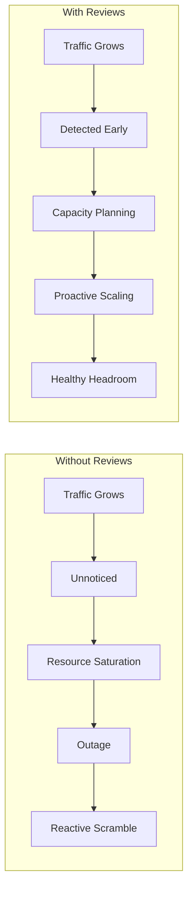
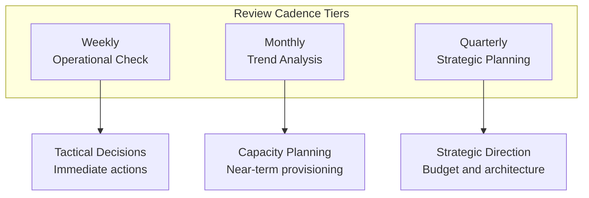
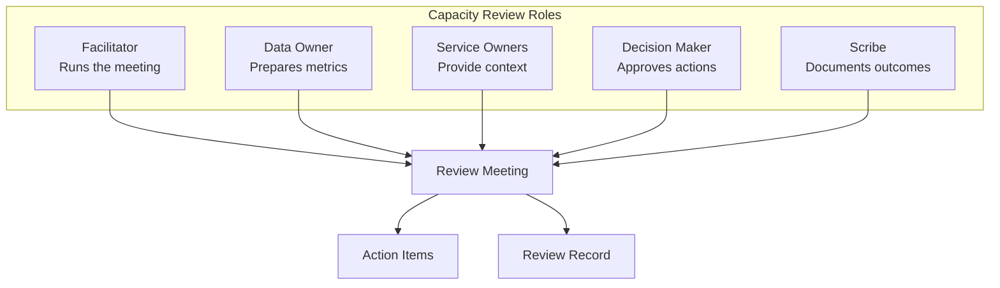
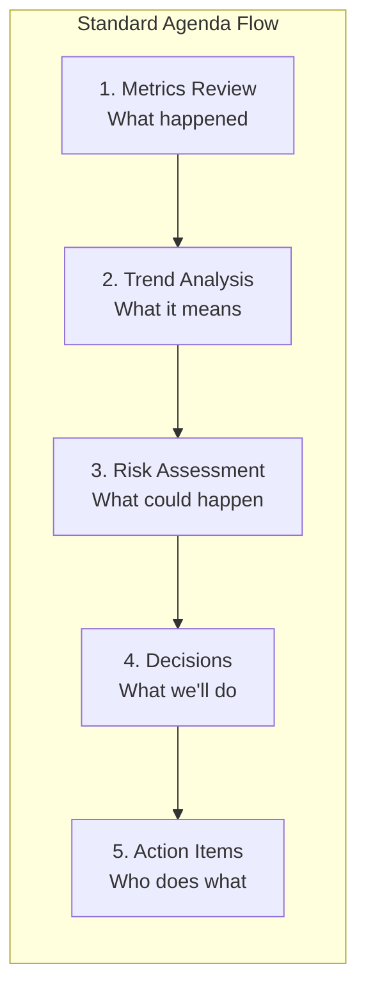
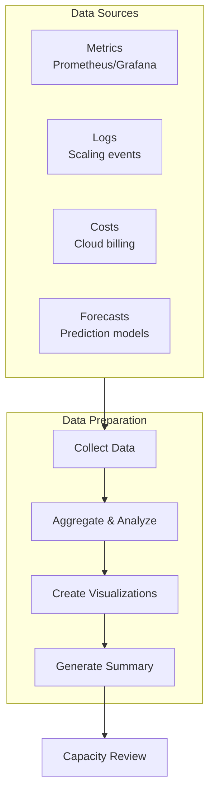
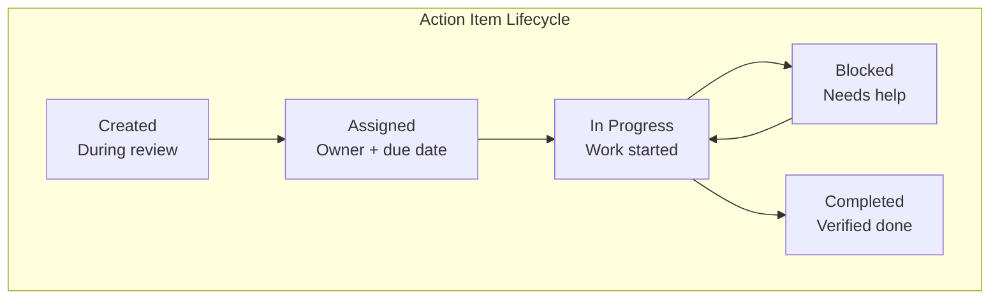
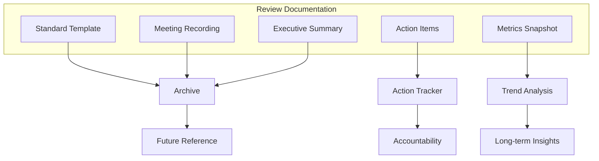
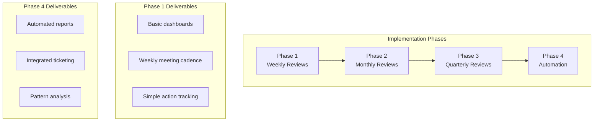

# How to Implement Capacity Reviews

Author: [nawazdhandala](https://github.com/nawazdhandala)

Tags: Capacity Planning, Reviews, SRE, Process

Description: Learn how to conduct effective capacity reviews for proactive planning.

---

Capacity planning without reviews is like budgeting without checking your bank balance. You make plans, resources get consumed, and one day you discover you ran out of headroom three weeks ago. Capacity reviews transform reactive firefighting into proactive planning by creating a regular cadence of measurement, analysis, and action.

This guide covers everything you need to implement effective capacity reviews: scheduling, stakeholders, agendas, data preparation, action tracking, and documentation patterns that scale with your organization.

---

## Why Capacity Reviews Matter

Most outages trace back to resource exhaustion. Database connections max out. Disk fills up. Memory pressure triggers OOM kills. CPU saturation causes request timeouts. These failures are predictable, which means they are preventable.



Capacity reviews create the feedback loop that catches growth before it becomes a crisis. They force regular examination of resource consumption trends, validate forecasting models, and ensure capacity investments align with business priorities.

---

## Review Cadence and Schedule

The right review frequency depends on your growth rate, infrastructure complexity, and risk tolerance. Most organizations benefit from a tiered approach.



### Weekly Operational Reviews

Weekly reviews focus on immediate concerns. Duration: 30 minutes. Attendees: on-call engineers and team leads.

| Check | Purpose | Action Threshold |
|-------|---------|------------------|
| Resources above 80% utilization | Identify hot spots | Add to monthly review |
| Growth rate anomalies | Detect unexpected changes | Investigate root cause |
| Recent scaling events | Validate automation | Tune if premature/late |
| Upcoming events | Prepare for known load | Pre-scale if needed |

### Monthly Trend Reviews

Monthly reviews examine trends and validate forecasts. Duration: 60 minutes. Attendees: SRE team, engineering leads, product managers.

| Agenda Item | Time | Output |
|-------------|------|--------|
| Review last month metrics | 15 min | Trend summary |
| Forecast accuracy check | 10 min | Model adjustments |
| Capacity risk register | 15 min | Updated risk list |
| Provisioning decisions | 15 min | Action items |
| Upcoming launches | 5 min | Awareness |

### Quarterly Strategic Reviews

Quarterly reviews align capacity with business strategy. Duration: 90 minutes. Attendees: engineering leadership, finance, product leadership.

| Agenda Item | Time | Output |
|-------------|------|--------|
| Capacity vs business metrics | 20 min | Efficiency report |
| Total cost analysis | 20 min | Cost projections |
| Architecture constraints | 20 min | Technical debt list |
| Budget alignment | 20 min | Investment priorities |
| OKR setting | 10 min | Capacity OKRs |

### Scheduling Implementation

```typescript
// capacity-review-scheduler.ts - Automate review scheduling
interface ReviewSchedule {
  type: 'weekly' | 'monthly' | 'quarterly';
  dayOfWeek?: number; // 0-6, Sunday-Saturday
  dayOfMonth?: number;
  monthOfQuarter?: number; // 1-3
  time: string; // HH:MM format
  duration: number; // minutes
  attendees: string[];
  agenda: string[];
}

const reviewSchedules: ReviewSchedule[] = [
  {
    type: 'weekly',
    dayOfWeek: 1, // Monday
    time: '09:00',
    duration: 30,
    attendees: ['oncall-primary', 'oncall-secondary', 'team-lead'],
    agenda: [
      'High utilization resources',
      'Growth anomalies',
      'Recent scaling events',
      'Upcoming events',
    ],
  },
  {
    type: 'monthly',
    dayOfMonth: 15,
    time: '14:00',
    duration: 60,
    attendees: ['sre-team', 'eng-leads', 'product-managers'],
    agenda: [
      'Monthly metrics review',
      'Forecast accuracy',
      'Risk register update',
      'Provisioning decisions',
      'Launch calendar',
    ],
  },
  {
    type: 'quarterly',
    dayOfMonth: 1,
    monthOfQuarter: 1,
    time: '10:00',
    duration: 90,
    attendees: ['eng-leadership', 'finance', 'product-leadership'],
    agenda: [
      'Capacity efficiency report',
      'Cost analysis',
      'Architecture constraints',
      'Budget alignment',
      'Capacity OKRs',
    ],
  },
];

function scheduleNextReview(schedule: ReviewSchedule): Date {
  const now = new Date();
  let nextDate: Date;

  switch (schedule.type) {
    case 'weekly':
      nextDate = getNextWeekday(now, schedule.dayOfWeek!);
      break;
    case 'monthly':
      nextDate = getNextMonthDay(now, schedule.dayOfMonth!);
      break;
    case 'quarterly':
      nextDate = getNextQuarterDay(now, schedule.dayOfMonth!, schedule.monthOfQuarter!);
      break;
  }

  const [hours, minutes] = schedule.time.split(':').map(Number);
  nextDate.setHours(hours, minutes, 0, 0);

  return nextDate;
}

function getNextWeekday(from: Date, targetDay: number): Date {
  const result = new Date(from);
  const currentDay = result.getDay();
  const daysUntilTarget = (targetDay - currentDay + 7) % 7 || 7;
  result.setDate(result.getDate() + daysUntilTarget);
  return result;
}

function getNextMonthDay(from: Date, targetDay: number): Date {
  const result = new Date(from);
  if (result.getDate() >= targetDay) {
    result.setMonth(result.getMonth() + 1);
  }
  result.setDate(targetDay);
  return result;
}

function getNextQuarterDay(from: Date, targetDay: number, monthInQuarter: number): Date {
  const result = new Date(from);
  const currentQuarter = Math.floor(result.getMonth() / 3);
  const targetMonth = currentQuarter * 3 + (monthInQuarter - 1);

  if (result.getMonth() > targetMonth ||
      (result.getMonth() === targetMonth && result.getDate() >= targetDay)) {
    result.setMonth(targetMonth + 3);
  } else {
    result.setMonth(targetMonth);
  }
  result.setDate(targetDay);
  return result;
}
```

---

## Attendee and Stakeholder Roles

Effective reviews require the right people with clear responsibilities. Define roles explicitly to avoid confusion and ensure accountability.



### Role Definitions

**Facilitator**: Owns the agenda, keeps time, drives discussion toward decisions. Usually an SRE lead or capacity planning engineer.

**Data Owner**: Prepares dashboards, reports, and analysis before the meeting. Presents metrics and trends. Usually the person responsible for capacity monitoring.

**Service Owners**: Provide context for their services. Explain anomalies, upcoming changes, and capacity needs. Required for monthly and quarterly reviews.

**Decision Maker**: Has authority to approve capacity changes, budget requests, and prioritization decisions. Required for monthly and quarterly reviews.

**Scribe**: Documents discussions, decisions, and action items. Distributes notes after the meeting. Can rotate among team members.

### RACI Matrix

```typescript
// capacity-review-raci.ts - Role assignments
interface RACIMatrix {
  activity: string;
  responsible: string[];
  accountable: string;
  consulted: string[];
  informed: string[];
}

const capacityReviewRACI: RACIMatrix[] = [
  {
    activity: 'Prepare capacity metrics',
    responsible: ['data-owner'],
    accountable: 'sre-lead',
    consulted: ['service-owners'],
    informed: ['team'],
  },
  {
    activity: 'Run weekly review',
    responsible: ['facilitator'],
    accountable: 'sre-lead',
    consulted: ['oncall-engineers'],
    informed: ['eng-leadership'],
  },
  {
    activity: 'Run monthly review',
    responsible: ['facilitator'],
    accountable: 'eng-director',
    consulted: ['service-owners', 'product-managers'],
    informed: ['finance', 'leadership'],
  },
  {
    activity: 'Approve capacity investment',
    responsible: ['eng-director'],
    accountable: 'vp-engineering',
    consulted: ['finance', 'sre-lead'],
    informed: ['team'],
  },
  {
    activity: 'Execute scaling actions',
    responsible: ['sre-team'],
    accountable: 'sre-lead',
    consulted: ['service-owners'],
    informed: ['stakeholders'],
  },
  {
    activity: 'Document review outcomes',
    responsible: ['scribe'],
    accountable: 'facilitator',
    consulted: [],
    informed: ['all-attendees'],
  },
];

function getResponsibleParties(activity: string): string[] {
  const item = capacityReviewRACI.find(r => r.activity === activity);
  return item ? item.responsible : [];
}

function getAccountableParty(activity: string): string | null {
  const item = capacityReviewRACI.find(r => r.activity === activity);
  return item ? item.accountable : null;
}
```

### Stakeholder Communication

Different stakeholders need different information at different times.

```typescript
// stakeholder-communication.ts - Tailored updates
interface StakeholderUpdate {
  audience: string;
  frequency: string;
  format: string;
  content: string[];
}

const stakeholderUpdates: StakeholderUpdate[] = [
  {
    audience: 'Engineering Team',
    frequency: 'Weekly',
    format: 'Slack summary',
    content: [
      'Hot spots requiring attention',
      'Scaling events this week',
      'Action items assigned',
    ],
  },
  {
    audience: 'Engineering Leadership',
    frequency: 'Monthly',
    format: 'Email report + dashboard link',
    content: [
      'Capacity health score',
      'Cost trend vs budget',
      'Risk register changes',
      'Investment recommendations',
    ],
  },
  {
    audience: 'Finance',
    frequency: 'Monthly',
    format: 'Spreadsheet + meeting',
    content: [
      'Actual vs forecasted spend',
      'Unit economics (cost per request/user)',
      'Upcoming budget needs',
      'Optimization opportunities',
    ],
  },
  {
    audience: 'Executive Leadership',
    frequency: 'Quarterly',
    format: 'Slide deck',
    content: [
      'Capacity vs business growth alignment',
      'Major risks and mitigations',
      'Strategic investment requests',
      'Efficiency improvements',
    ],
  },
];
```

---

## Review Agenda Structure

A well-structured agenda keeps reviews focused and productive. Adapt based on review type and organizational needs.



### Weekly Review Agenda Template

```markdown
## Weekly Capacity Review - [DATE]

### 1. Quick Health Check (5 min)
- [ ] Overall capacity health score
- [ ] Services above 80% utilization
- [ ] Any active capacity incidents

### 2. Hot Spots (10 min)
- [ ] CPU hot spots
- [ ] Memory hot spots
- [ ] Storage hot spots
- [ ] Network/connection hot spots

### 3. Recent Events (5 min)
- [ ] Scaling events triggered
- [ ] Scaling events that should have triggered but didn't
- [ ] Manual interventions required

### 4. Look Ahead (5 min)
- [ ] Known events next week (launches, promotions, migrations)
- [ ] Pre-scaling requirements

### 5. Action Items (5 min)
- [ ] Assign owners
- [ ] Set due dates
- [ ] Escalate blockers
```

### Monthly Review Agenda Template

```markdown
## Monthly Capacity Review - [MONTH YEAR]

### 1. Executive Summary (5 min)
- Overall capacity health trend
- Key wins and concerns
- Budget status

### 2. Metrics Deep Dive (15 min)
#### 2.1 Resource Utilization Trends
- CPU utilization by service tier
- Memory utilization by service tier
- Storage growth rate
- Network throughput trends

#### 2.2 Growth Analysis
- Request volume trends
- User growth correlation
- Seasonality patterns

### 3. Forecast Review (10 min)
- Last month's forecast accuracy
- Model adjustments needed
- Updated 3-month projection

### 4. Risk Register (15 min)
| Risk | Likelihood | Impact | Mitigation | Owner | Status |
|------|------------|--------|------------|-------|--------|
|      |            |        |            |       |        |

### 5. Provisioning Decisions (10 min)
- [ ] Immediate scaling needs
- [ ] Scheduled scaling for next month
- [ ] Architecture changes required

### 6. Upcoming Launches (5 min)
- Feature launches requiring capacity
- Marketing events
- Migration timelines

### 7. Action Items
| Action | Owner | Due Date | Priority |
|--------|-------|----------|----------|
|        |       |          |          |
```

### Quarterly Review Agenda Template

```markdown
## Quarterly Capacity Review - Q[N] [YEAR]

### 1. Quarter in Review (20 min)
#### 1.1 Capacity vs Business Metrics
- Revenue per compute unit trend
- User growth vs infrastructure growth
- Cost per transaction analysis

#### 1.2 Incident Analysis
- Capacity-related incidents count
- MTTR for capacity incidents
- Root cause patterns

#### 1.3 Forecast Accuracy
- Quarterly forecast vs actual
- Model performance by service

### 2. Total Cost Analysis (20 min)
- Compute cost breakdown
- Storage cost breakdown
- Network cost breakdown
- Cost optimization opportunities
- Reserved capacity utilization

### 3. Architecture Review (20 min)
- Scalability bottlenecks identified
- Technical debt impacting capacity
- Architecture improvements needed
- Build vs buy decisions

### 4. Next Quarter Planning (20 min)
#### 4.1 Budget Alignment
- Forecasted capacity needs
- Budget request justification
- Investment priorities

#### 4.2 OKR Setting
- Proposed capacity OKRs
- Alignment with company OKRs

### 5. Strategic Decisions (10 min)
- Major investment approvals
- Architecture direction decisions
- Risk acceptance decisions

### Action Items
| Action | Owner | Due Date | Strategic Priority |
|--------|-------|----------|-------------------|
|        |       |          |                   |
```

### Agenda Implementation

```typescript
// agenda-generator.ts - Generate review agendas
interface AgendaItem {
  title: string;
  duration: number; // minutes
  owner: string;
  type: 'discussion' | 'decision' | 'information';
  requiredData?: string[];
}

interface ReviewAgenda {
  reviewType: 'weekly' | 'monthly' | 'quarterly';
  date: Date;
  items: AgendaItem[];
  totalDuration: number;
}

function generateWeeklyAgenda(date: Date): ReviewAgenda {
  const items: AgendaItem[] = [
    {
      title: 'Quick Health Check',
      duration: 5,
      owner: 'data-owner',
      type: 'information',
      requiredData: ['health-score-dashboard', 'utilization-alerts'],
    },
    {
      title: 'Hot Spots Review',
      duration: 10,
      owner: 'data-owner',
      type: 'discussion',
      requiredData: ['resource-utilization-report'],
    },
    {
      title: 'Recent Scaling Events',
      duration: 5,
      owner: 'oncall-lead',
      type: 'information',
      requiredData: ['scaling-event-log'],
    },
    {
      title: 'Look Ahead',
      duration: 5,
      owner: 'facilitator',
      type: 'discussion',
      requiredData: ['event-calendar'],
    },
    {
      title: 'Action Items',
      duration: 5,
      owner: 'facilitator',
      type: 'decision',
    },
  ];

  return {
    reviewType: 'weekly',
    date,
    items,
    totalDuration: items.reduce((sum, item) => sum + item.duration, 0),
  };
}

function generateMonthlyAgenda(date: Date): ReviewAgenda {
  const items: AgendaItem[] = [
    {
      title: 'Executive Summary',
      duration: 5,
      owner: 'facilitator',
      type: 'information',
    },
    {
      title: 'Metrics Deep Dive',
      duration: 15,
      owner: 'data-owner',
      type: 'discussion',
      requiredData: ['monthly-metrics-report', 'trend-analysis'],
    },
    {
      title: 'Forecast Review',
      duration: 10,
      owner: 'data-owner',
      type: 'discussion',
      requiredData: ['forecast-accuracy-report', 'updated-projections'],
    },
    {
      title: 'Risk Register Review',
      duration: 15,
      owner: 'sre-lead',
      type: 'decision',
      requiredData: ['risk-register'],
    },
    {
      title: 'Provisioning Decisions',
      duration: 10,
      owner: 'decision-maker',
      type: 'decision',
    },
    {
      title: 'Upcoming Launches',
      duration: 5,
      owner: 'product-manager',
      type: 'information',
      requiredData: ['launch-calendar'],
    },
  ];

  return {
    reviewType: 'monthly',
    date,
    items,
    totalDuration: items.reduce((sum, item) => sum + item.duration, 0),
  };
}
```

---

## Data Preparation

The quality of a capacity review depends on the quality of data presented. Prepare dashboards and reports before each review.



### Key Metrics to Prepare

```typescript
// capacity-metrics.ts - Metrics for capacity reviews
interface CapacityMetric {
  name: string;
  query: string;
  thresholds: { warning: number; critical: number };
  unit: string;
  aggregation: 'avg' | 'max' | 'p95' | 'sum';
}

const weeklyMetrics: CapacityMetric[] = [
  {
    name: 'CPU Utilization by Service',
    query: 'avg(rate(container_cpu_usage_seconds_total[5m])) by (service) * 100',
    thresholds: { warning: 70, critical: 85 },
    unit: 'percent',
    aggregation: 'avg',
  },
  {
    name: 'Memory Utilization by Service',
    query: 'avg(container_memory_usage_bytes / container_spec_memory_limit_bytes) by (service) * 100',
    thresholds: { warning: 80, critical: 90 },
    unit: 'percent',
    aggregation: 'avg',
  },
  {
    name: 'Disk Utilization',
    query: '(1 - node_filesystem_avail_bytes / node_filesystem_size_bytes) * 100',
    thresholds: { warning: 75, critical: 90 },
    unit: 'percent',
    aggregation: 'max',
  },
  {
    name: 'Database Connection Utilization',
    query: 'pg_stat_activity_count / pg_settings_max_connections * 100',
    thresholds: { warning: 70, critical: 85 },
    unit: 'percent',
    aggregation: 'max',
  },
  {
    name: 'Request Rate',
    query: 'sum(rate(http_requests_total[5m]))',
    thresholds: { warning: 0, critical: 0 }, // No threshold, trend only
    unit: 'req/s',
    aggregation: 'avg',
  },
];

const monthlyMetrics: CapacityMetric[] = [
  ...weeklyMetrics,
  {
    name: 'Storage Growth Rate',
    query: 'deriv(node_filesystem_size_bytes[30d])',
    thresholds: { warning: 0, critical: 0 },
    unit: 'bytes/day',
    aggregation: 'avg',
  },
  {
    name: 'Request Volume Growth',
    query: '(sum(increase(http_requests_total[30d])) - sum(increase(http_requests_total[30d] offset 30d))) / sum(increase(http_requests_total[30d] offset 30d)) * 100',
    thresholds: { warning: 50, critical: 100 },
    unit: 'percent',
    aggregation: 'sum',
  },
  {
    name: 'Cost per 1M Requests',
    query: 'sum(cloud_cost_total) / (sum(increase(http_requests_total[30d])) / 1000000)',
    thresholds: { warning: 0, critical: 0 },
    unit: 'dollars',
    aggregation: 'sum',
  },
];
```

### Pre-Review Report Generator

```typescript
// pre-review-report.ts - Generate reports before reviews
interface CapacityReport {
  generatedAt: Date;
  reviewType: 'weekly' | 'monthly' | 'quarterly';
  period: { start: Date; end: Date };
  healthScore: number;
  hotSpots: HotSpot[];
  trends: TrendAnalysis[];
  risks: RiskItem[];
  recommendations: string[];
}

interface HotSpot {
  resource: string;
  service: string;
  currentUtilization: number;
  threshold: number;
  trend: 'increasing' | 'stable' | 'decreasing';
  projectedSaturation?: Date;
}

interface TrendAnalysis {
  metric: string;
  currentValue: number;
  previousValue: number;
  changePercent: number;
  analysis: string;
}

interface RiskItem {
  id: string;
  description: string;
  likelihood: 'low' | 'medium' | 'high';
  impact: 'low' | 'medium' | 'high';
  mitigation: string;
  owner: string;
  dueDate?: Date;
}

async function generatePreReviewReport(
  reviewType: 'weekly' | 'monthly' | 'quarterly'
): Promise<CapacityReport> {
  const now = new Date();
  const period = getReportPeriod(reviewType, now);

  // Collect metrics data
  const metricsData = await collectMetrics(
    reviewType === 'weekly' ? weeklyMetrics : monthlyMetrics,
    period
  );

  // Identify hot spots
  const hotSpots = identifyHotSpots(metricsData);

  // Analyze trends
  const trends = analyzeTrends(metricsData, period);

  // Calculate health score
  const healthScore = calculateHealthScore(hotSpots, trends);

  // Load and update risk register
  const risks = await loadRiskRegister();

  // Generate recommendations
  const recommendations = generateRecommendations(hotSpots, trends, risks);

  return {
    generatedAt: now,
    reviewType,
    period,
    healthScore,
    hotSpots,
    trends,
    risks,
    recommendations,
  };
}

function getReportPeriod(
  reviewType: string,
  now: Date
): { start: Date; end: Date } {
  const end = new Date(now);
  const start = new Date(now);

  switch (reviewType) {
    case 'weekly':
      start.setDate(start.getDate() - 7);
      break;
    case 'monthly':
      start.setMonth(start.getMonth() - 1);
      break;
    case 'quarterly':
      start.setMonth(start.getMonth() - 3);
      break;
  }

  return { start, end };
}

function identifyHotSpots(metricsData: Map<string, number[]>): HotSpot[] {
  const hotSpots: HotSpot[] = [];

  for (const [metric, values] of metricsData.entries()) {
    const current = values[values.length - 1];
    const metricConfig = weeklyMetrics.find(m => m.name === metric);

    if (metricConfig && current > metricConfig.thresholds.warning) {
      const trend = calculateTrend(values);
      const projectedSaturation = trend === 'increasing'
        ? projectSaturation(values, 100)
        : undefined;

      hotSpots.push({
        resource: metricConfig.name,
        service: 'all', // Simplified; would extract from labels
        currentUtilization: current,
        threshold: metricConfig.thresholds.warning,
        trend,
        projectedSaturation,
      });
    }
  }

  return hotSpots.sort((a, b) => b.currentUtilization - a.currentUtilization);
}

function calculateTrend(values: number[]): 'increasing' | 'stable' | 'decreasing' {
  if (values.length < 2) return 'stable';

  const firstHalf = values.slice(0, Math.floor(values.length / 2));
  const secondHalf = values.slice(Math.floor(values.length / 2));

  const firstAvg = firstHalf.reduce((a, b) => a + b, 0) / firstHalf.length;
  const secondAvg = secondHalf.reduce((a, b) => a + b, 0) / secondHalf.length;

  const changePercent = ((secondAvg - firstAvg) / firstAvg) * 100;

  if (changePercent > 5) return 'increasing';
  if (changePercent < -5) return 'decreasing';
  return 'stable';
}

function projectSaturation(values: number[], target: number): Date | undefined {
  // Simple linear projection
  if (values.length < 2) return undefined;

  const n = values.length;
  const sumX = (n * (n - 1)) / 2;
  const sumY = values.reduce((a, b) => a + b, 0);
  const sumXY = values.reduce((sum, y, x) => sum + x * y, 0);
  const sumX2 = (n * (n - 1) * (2 * n - 1)) / 6;

  const slope = (n * sumXY - sumX * sumY) / (n * sumX2 - sumX * sumX);

  if (slope <= 0) return undefined;

  const current = values[values.length - 1];
  const periodsToSaturation = (target - current) / slope;

  if (periodsToSaturation <= 0 || periodsToSaturation > 365) return undefined;

  const saturationDate = new Date();
  saturationDate.setDate(saturationDate.getDate() + periodsToSaturation);

  return saturationDate;
}

function calculateHealthScore(hotSpots: HotSpot[], trends: TrendAnalysis[]): number {
  let score = 100;

  // Deduct for hot spots
  for (const hotSpot of hotSpots) {
    if (hotSpot.currentUtilization > 90) score -= 20;
    else if (hotSpot.currentUtilization > 80) score -= 10;
    else if (hotSpot.currentUtilization > 70) score -= 5;

    if (hotSpot.trend === 'increasing') score -= 5;
  }

  // Deduct for negative trends
  for (const trend of trends) {
    if (trend.changePercent > 50) score -= 10;
    else if (trend.changePercent > 25) score -= 5;
  }

  return Math.max(0, Math.min(100, score));
}

async function collectMetrics(
  metrics: CapacityMetric[],
  period: { start: Date; end: Date }
): Promise<Map<string, number[]>> {
  // Implementation depends on your metrics backend
  // This would query Prometheus, InfluxDB, etc.
  return new Map();
}

function analyzeTrends(
  metricsData: Map<string, number[]>,
  period: { start: Date; end: Date }
): TrendAnalysis[] {
  // Implementation for trend analysis
  return [];
}

async function loadRiskRegister(): Promise<RiskItem[]> {
  // Load from persistent storage
  return [];
}

function generateRecommendations(
  hotSpots: HotSpot[],
  trends: TrendAnalysis[],
  risks: RiskItem[]
): string[] {
  const recommendations: string[] = [];

  for (const hotSpot of hotSpots) {
    if (hotSpot.currentUtilization > 85) {
      recommendations.push(
        `Immediate attention: ${hotSpot.resource} at ${hotSpot.currentUtilization.toFixed(1)}% utilization`
      );
    }
    if (hotSpot.projectedSaturation) {
      const daysUntil = Math.ceil(
        (hotSpot.projectedSaturation.getTime() - Date.now()) / (1000 * 60 * 60 * 24)
      );
      recommendations.push(
        `${hotSpot.resource} projected to saturate in ${daysUntil} days`
      );
    }
  }

  for (const risk of risks.filter(r => r.likelihood === 'high')) {
    recommendations.push(`High-likelihood risk needs mitigation: ${risk.description}`);
  }

  return recommendations;
}
```

### Dashboard Preparation

```typescript
// dashboard-preparation.ts - Ensure dashboards are ready
interface DashboardCheck {
  name: string;
  url: string;
  requiredPanels: string[];
  timeRange: string;
}

const reviewDashboards: DashboardCheck[] = [
  {
    name: 'Capacity Overview',
    url: '/grafana/d/capacity-overview',
    requiredPanels: [
      'CPU Utilization Heatmap',
      'Memory Utilization Heatmap',
      'Disk Usage by Volume',
      'Network Traffic',
    ],
    timeRange: '7d',
  },
  {
    name: 'Service Capacity',
    url: '/grafana/d/service-capacity',
    requiredPanels: [
      'Request Rate by Service',
      'Latency by Service',
      'Error Rate by Service',
      'Resource Usage by Service',
    ],
    timeRange: '30d',
  },
  {
    name: 'Capacity Trends',
    url: '/grafana/d/capacity-trends',
    requiredPanels: [
      'Growth Rate Trends',
      'Utilization Trends',
      'Cost Trends',
      'Forecast vs Actual',
    ],
    timeRange: '90d',
  },
];

async function prepareDashboards(reviewType: string): Promise<void> {
  const dashboards = reviewType === 'weekly'
    ? [reviewDashboards[0]]
    : reviewDashboards;

  for (const dashboard of dashboards) {
    // Verify dashboard exists and has required panels
    const isValid = await verifyDashboard(dashboard);
    if (!isValid) {
      console.warn(`Dashboard ${dashboard.name} needs attention`);
    }

    // Pre-load data for faster review
    await preloadDashboardData(dashboard);
  }
}

async function verifyDashboard(dashboard: DashboardCheck): Promise<boolean> {
  // Implementation depends on your Grafana API
  return true;
}

async function preloadDashboardData(dashboard: DashboardCheck): Promise<void> {
  // Trigger query caching for faster load during review
}
```

---

## Action Item Tracking

Reviews without follow-through are wasted time. Implement structured action tracking to ensure decisions lead to outcomes.



### Action Item Structure

```typescript
// action-item-tracker.ts - Track capacity review action items
interface ActionItem {
  id: string;
  createdAt: Date;
  reviewId: string;
  title: string;
  description: string;
  owner: string;
  dueDate: Date;
  priority: 'critical' | 'high' | 'medium' | 'low';
  status: 'created' | 'assigned' | 'in_progress' | 'blocked' | 'completed';
  blockedReason?: string;
  completedAt?: Date;
  verifiedBy?: string;
  linkedTicket?: string;
  tags: string[];
}

class ActionItemTracker {
  private items: Map<string, ActionItem> = new Map();

  createFromReview(
    reviewId: string,
    title: string,
    owner: string,
    dueDate: Date,
    priority: ActionItem['priority'] = 'medium'
  ): ActionItem {
    const item: ActionItem = {
      id: `CAP-${Date.now()}`,
      createdAt: new Date(),
      reviewId,
      title,
      description: '',
      owner,
      dueDate,
      priority,
      status: 'assigned',
      tags: ['capacity-review'],
    };

    this.items.set(item.id, item);
    this.notifyOwner(item);
    this.createLinkedTicket(item);

    return item;
  }

  updateStatus(
    id: string,
    status: ActionItem['status'],
    details?: { blockedReason?: string; verifiedBy?: string }
  ): void {
    const item = this.items.get(id);
    if (!item) return;

    item.status = status;

    if (status === 'blocked' && details?.blockedReason) {
      item.blockedReason = details.blockedReason;
      this.escalateBlocked(item);
    }

    if (status === 'completed') {
      item.completedAt = new Date();
      item.verifiedBy = details?.verifiedBy;
    }
  }

  getOverdueItems(): ActionItem[] {
    const now = new Date();
    return Array.from(this.items.values()).filter(
      item => item.status !== 'completed' && item.dueDate < now
    );
  }

  getItemsForReview(reviewId: string): ActionItem[] {
    return Array.from(this.items.values()).filter(
      item => item.reviewId === reviewId
    );
  }

  getPendingByOwner(owner: string): ActionItem[] {
    return Array.from(this.items.values()).filter(
      item => item.owner === owner && item.status !== 'completed'
    );
  }

  generateStatusReport(): ActionItemReport {
    const items = Array.from(this.items.values());

    return {
      total: items.length,
      byStatus: {
        created: items.filter(i => i.status === 'created').length,
        assigned: items.filter(i => i.status === 'assigned').length,
        inProgress: items.filter(i => i.status === 'in_progress').length,
        blocked: items.filter(i => i.status === 'blocked').length,
        completed: items.filter(i => i.status === 'completed').length,
      },
      overdue: this.getOverdueItems().length,
      completionRate: items.filter(i => i.status === 'completed').length / items.length,
      avgCompletionTime: this.calculateAvgCompletionTime(items),
    };
  }

  private notifyOwner(item: ActionItem): void {
    // Send Slack/email notification
    console.log(`Notifying ${item.owner} of new action item: ${item.title}`);
  }

  private createLinkedTicket(item: ActionItem): void {
    // Create Jira/GitHub issue
    // item.linkedTicket = ticketId;
  }

  private escalateBlocked(item: ActionItem): void {
    // Notify facilitator and stakeholders
    console.log(`Action item ${item.id} is blocked: ${item.blockedReason}`);
  }

  private calculateAvgCompletionTime(items: ActionItem[]): number {
    const completed = items.filter(i => i.status === 'completed' && i.completedAt);
    if (completed.length === 0) return 0;

    const totalMs = completed.reduce((sum, item) => {
      return sum + (item.completedAt!.getTime() - item.createdAt.getTime());
    }, 0);

    return totalMs / completed.length / (1000 * 60 * 60 * 24); // Days
  }
}

interface ActionItemReport {
  total: number;
  byStatus: {
    created: number;
    assigned: number;
    inProgress: number;
    blocked: number;
    completed: number;
  };
  overdue: number;
  completionRate: number;
  avgCompletionTime: number; // Days
}
```

### Automated Reminders

```typescript
// action-reminders.ts - Automated follow-up
interface ReminderConfig {
  daysBeforeDue: number;
  daysAfterDue: number;
  escalationDays: number;
}

const reminderConfig: ReminderConfig = {
  daysBeforeDue: 2,
  daysAfterDue: 1,
  escalationDays: 3,
};

async function sendDueReminders(tracker: ActionItemTracker): Promise<void> {
  const now = new Date();
  const items = Array.from(tracker['items'].values());

  for (const item of items) {
    if (item.status === 'completed') continue;

    const daysUntilDue = Math.ceil(
      (item.dueDate.getTime() - now.getTime()) / (1000 * 60 * 60 * 24)
    );

    if (daysUntilDue === reminderConfig.daysBeforeDue) {
      await sendReminder(item, 'upcoming');
    } else if (daysUntilDue === -reminderConfig.daysAfterDue) {
      await sendReminder(item, 'overdue');
    } else if (daysUntilDue <= -reminderConfig.escalationDays) {
      await sendEscalation(item);
    }
  }
}

async function sendReminder(
  item: ActionItem,
  type: 'upcoming' | 'overdue'
): Promise<void> {
  const message = type === 'upcoming'
    ? `Reminder: Action item "${item.title}" is due in ${reminderConfig.daysBeforeDue} days`
    : `Overdue: Action item "${item.title}" was due ${reminderConfig.daysAfterDue} day(s) ago`;

  // Send to owner via Slack/email
  console.log(`To ${item.owner}: ${message}`);
}

async function sendEscalation(item: ActionItem): Promise<void> {
  // Notify owner's manager and review facilitator
  console.log(`Escalation: Action item "${item.title}" is significantly overdue`);
}
```

### Review Follow-Up

```typescript
// review-followup.ts - Track review outcomes over time
interface ReviewFollowUp {
  reviewId: string;
  reviewDate: Date;
  reviewType: 'weekly' | 'monthly' | 'quarterly';
  totalActions: number;
  completedActions: number;
  overdueActions: number;
  completionRate: number;
  avgCompletionDays: number;
  unresolvedRisks: number;
}

async function generateFollowUpReport(
  tracker: ActionItemTracker,
  reviewId: string
): Promise<ReviewFollowUp> {
  const items = tracker.getItemsForReview(reviewId);

  const completed = items.filter(i => i.status === 'completed');
  const overdue = items.filter(
    i => i.status !== 'completed' && i.dueDate < new Date()
  );

  const completionTimes = completed
    .filter(i => i.completedAt)
    .map(i => (i.completedAt!.getTime() - i.createdAt.getTime()) / (1000 * 60 * 60 * 24));

  const avgCompletionDays = completionTimes.length > 0
    ? completionTimes.reduce((a, b) => a + b, 0) / completionTimes.length
    : 0;

  return {
    reviewId,
    reviewDate: new Date(), // Would come from review record
    reviewType: 'monthly', // Would come from review record
    totalActions: items.length,
    completedActions: completed.length,
    overdueActions: overdue.length,
    completionRate: items.length > 0 ? completed.length / items.length : 1,
    avgCompletionDays,
    unresolvedRisks: 0, // Would calculate from risk register
  };
}
```

---

## Review Documentation

Good documentation serves three purposes: accountability for decisions made, knowledge transfer for team members, and pattern recognition over time.



### Review Record Template

```typescript
// review-record.ts - Structured review documentation
interface ReviewRecord {
  id: string;
  type: 'weekly' | 'monthly' | 'quarterly';
  date: Date;
  attendees: string[];
  duration: number; // minutes

  // Pre-review data
  healthScore: number;
  metricsSnapshot: MetricsSnapshot;

  // Discussion summary
  keyDiscussions: Discussion[];

  // Decisions made
  decisions: Decision[];

  // Risks identified or updated
  risksDiscussed: RiskUpdate[];

  // Action items created
  actionItems: string[]; // References to action item IDs

  // Follow-up from previous reviews
  previousActionsReviewed: PreviousActionReview[];

  // Notes and context
  notes: string;

  // Links
  recordingUrl?: string;
  dashboardUrl: string;
  presentationUrl?: string;
}

interface MetricsSnapshot {
  timestamp: Date;
  cpuUtilization: { service: string; value: number }[];
  memoryUtilization: { service: string; value: number }[];
  diskUtilization: { mount: string; value: number }[];
  requestRate: number;
  errorRate: number;
  costThisMonth: number;
}

interface Discussion {
  topic: string;
  summary: string;
  participants: string[];
  outcome: string;
}

interface Decision {
  description: string;
  rationale: string;
  madeBy: string;
  impact: 'high' | 'medium' | 'low';
}

interface RiskUpdate {
  riskId: string;
  action: 'added' | 'updated' | 'mitigated' | 'accepted';
  details: string;
}

interface PreviousActionReview {
  actionId: string;
  status: string;
  notes: string;
}
```

### Documentation Generator

```typescript
// documentation-generator.ts - Auto-generate review documentation
async function generateReviewRecord(
  type: 'weekly' | 'monthly' | 'quarterly',
  attendees: string[],
  duration: number,
  notes: string
): Promise<ReviewRecord> {
  const id = `REV-${type.toUpperCase()}-${Date.now()}`;
  const date = new Date();

  // Capture current metrics
  const metricsSnapshot = await captureMetricsSnapshot();

  // Calculate health score
  const healthScore = calculateHealthScoreFromSnapshot(metricsSnapshot);

  const record: ReviewRecord = {
    id,
    type,
    date,
    attendees,
    duration,
    healthScore,
    metricsSnapshot,
    keyDiscussions: [],
    decisions: [],
    risksDiscussed: [],
    actionItems: [],
    previousActionsReviewed: [],
    notes,
    dashboardUrl: getDashboardUrl(type),
  };

  // Save to persistent storage
  await saveReviewRecord(record);

  return record;
}

async function captureMetricsSnapshot(): Promise<MetricsSnapshot> {
  // Query current metrics from Prometheus/Grafana
  return {
    timestamp: new Date(),
    cpuUtilization: [],
    memoryUtilization: [],
    diskUtilization: [],
    requestRate: 0,
    errorRate: 0,
    costThisMonth: 0,
  };
}

function calculateHealthScoreFromSnapshot(snapshot: MetricsSnapshot): number {
  // Implementation based on thresholds
  return 85;
}

function getDashboardUrl(type: string): string {
  return `/grafana/d/capacity-${type}`;
}

async function saveReviewRecord(record: ReviewRecord): Promise<void> {
  // Save to database or file system
}
```

### Summary Generator

```typescript
// summary-generator.ts - Generate executive summaries
interface ExecutiveSummary {
  reviewId: string;
  date: Date;
  healthScore: number;
  healthTrend: 'improving' | 'stable' | 'declining';
  keyFindings: string[];
  criticalRisks: string[];
  decisionsCount: number;
  actionsCount: number;
  budgetStatus: 'on_track' | 'over_budget' | 'under_budget';
  nextSteps: string[];
}

async function generateExecutiveSummary(
  record: ReviewRecord,
  previousRecords: ReviewRecord[]
): Promise<ExecutiveSummary> {
  // Calculate health trend
  const recentScores = previousRecords
    .slice(-3)
    .map(r => r.healthScore);
  const avgPreviousScore = recentScores.length > 0
    ? recentScores.reduce((a, b) => a + b, 0) / recentScores.length
    : record.healthScore;

  const healthTrend: ExecutiveSummary['healthTrend'] =
    record.healthScore > avgPreviousScore + 5 ? 'improving' :
    record.healthScore < avgPreviousScore - 5 ? 'declining' : 'stable';

  // Extract key findings from discussions
  const keyFindings = record.keyDiscussions
    .filter(d => d.outcome !== '')
    .map(d => d.outcome);

  // Extract critical risks
  const criticalRisks = record.risksDiscussed
    .filter(r => r.action === 'added')
    .map(r => r.details);

  // Determine budget status (would come from cost data)
  const budgetStatus: ExecutiveSummary['budgetStatus'] = 'on_track';

  // Compile next steps from action items
  const nextSteps = record.actionItems.slice(0, 3);

  return {
    reviewId: record.id,
    date: record.date,
    healthScore: record.healthScore,
    healthTrend,
    keyFindings,
    criticalRisks,
    decisionsCount: record.decisions.length,
    actionsCount: record.actionItems.length,
    budgetStatus,
    nextSteps,
  };
}

function formatSummaryForSlack(summary: ExecutiveSummary): string {
  const healthEmoji = summary.healthTrend === 'improving' ? '+' :
                      summary.healthTrend === 'declining' ? '-' : '=';

  return `
*Capacity Review Summary - ${summary.date.toLocaleDateString()}*

*Health Score:* ${summary.healthScore}/100 (${healthEmoji} ${summary.healthTrend})
*Decisions:* ${summary.decisionsCount} | *Actions:* ${summary.actionsCount}
*Budget:* ${summary.budgetStatus.replace('_', ' ')}

*Key Findings:*
${summary.keyFindings.map(f => `- ${f}`).join('\n')}

*Critical Risks:*
${summary.criticalRisks.length > 0 ? summary.criticalRisks.map(r => `- ${r}`).join('\n') : '- None identified'}

*Next Steps:*
${summary.nextSteps.map(s => `- ${s}`).join('\n')}
`.trim();
}

function formatSummaryForEmail(summary: ExecutiveSummary): string {
  return `
<h2>Capacity Review Summary - ${summary.date.toLocaleDateString()}</h2>

<table>
  <tr><td><strong>Health Score</strong></td><td>${summary.healthScore}/100 (${summary.healthTrend})</td></tr>
  <tr><td><strong>Decisions Made</strong></td><td>${summary.decisionsCount}</td></tr>
  <tr><td><strong>Action Items</strong></td><td>${summary.actionsCount}</td></tr>
  <tr><td><strong>Budget Status</strong></td><td>${summary.budgetStatus.replace('_', ' ')}</td></tr>
</table>

<h3>Key Findings</h3>
<ul>
${summary.keyFindings.map(f => `<li>${f}</li>`).join('\n')}
</ul>

<h3>Critical Risks</h3>
<ul>
${summary.criticalRisks.length > 0 ? summary.criticalRisks.map(r => `<li>${r}</li>`).join('\n') : '<li>None identified</li>'}
</ul>

<h3>Next Steps</h3>
<ul>
${summary.nextSteps.map(s => `<li>${s}</li>`).join('\n')}
</ul>
`.trim();
}
```

### Long-term Pattern Analysis

```typescript
// pattern-analysis.ts - Analyze patterns across reviews
interface PatternAnalysis {
  period: { start: Date; end: Date };
  reviewCount: number;
  avgHealthScore: number;
  healthTrend: number; // slope
  commonIssues: { issue: string; frequency: number }[];
  actionCompletionRate: number;
  avgActionsPerReview: number;
  recurringRisks: string[];
  improvements: string[];
}

async function analyzeReviewPatterns(
  records: ReviewRecord[],
  period: { start: Date; end: Date }
): Promise<PatternAnalysis> {
  const relevantRecords = records.filter(
    r => r.date >= period.start && r.date <= period.end
  );

  // Calculate average health score
  const avgHealthScore = relevantRecords.reduce((sum, r) => sum + r.healthScore, 0)
    / relevantRecords.length;

  // Calculate health trend (linear regression)
  const healthTrend = calculateTrendSlope(
    relevantRecords.map(r => r.healthScore)
  );

  // Find common issues from discussions
  const allTopics = relevantRecords.flatMap(r => r.keyDiscussions.map(d => d.topic));
  const topicCounts = countOccurrences(allTopics);
  const commonIssues = Object.entries(topicCounts)
    .map(([issue, frequency]) => ({ issue, frequency }))
    .sort((a, b) => b.frequency - a.frequency)
    .slice(0, 5);

  // Calculate action completion rate
  const totalActions = relevantRecords.reduce((sum, r) => sum + r.actionItems.length, 0);
  const completedActions = await countCompletedActions(
    relevantRecords.flatMap(r => r.actionItems)
  );
  const actionCompletionRate = totalActions > 0 ? completedActions / totalActions : 1;

  // Find recurring risks
  const allRisks = relevantRecords.flatMap(r => r.risksDiscussed);
  const riskCounts = countOccurrences(allRisks.map(r => r.riskId));
  const recurringRisks = Object.entries(riskCounts)
    .filter(([_, count]) => count > 2)
    .map(([riskId, _]) => riskId);

  // Identify improvements (health score increases month over month)
  const improvements = identifyImprovements(relevantRecords);

  return {
    period,
    reviewCount: relevantRecords.length,
    avgHealthScore,
    healthTrend,
    commonIssues,
    actionCompletionRate,
    avgActionsPerReview: totalActions / relevantRecords.length,
    recurringRisks,
    improvements,
  };
}

function calculateTrendSlope(values: number[]): number {
  if (values.length < 2) return 0;

  const n = values.length;
  const sumX = (n * (n - 1)) / 2;
  const sumY = values.reduce((a, b) => a + b, 0);
  const sumXY = values.reduce((sum, y, x) => sum + x * y, 0);
  const sumX2 = (n * (n - 1) * (2 * n - 1)) / 6;

  return (n * sumXY - sumX * sumY) / (n * sumX2 - sumX * sumX);
}

function countOccurrences(items: string[]): Record<string, number> {
  return items.reduce((counts, item) => {
    counts[item] = (counts[item] || 0) + 1;
    return counts;
  }, {} as Record<string, number>);
}

async function countCompletedActions(actionIds: string[]): Promise<number> {
  // Query action tracker for completed status
  return 0;
}

function identifyImprovements(records: ReviewRecord[]): string[] {
  // Analyze records to find areas of improvement
  return [];
}
```

---

## Putting It All Together

Implementing capacity reviews is not about adding another meeting. It is about creating a systematic approach to proactive capacity management.



### Implementation Checklist

**Phase 1: Weekly Reviews (Weeks 1-2)**
- [ ] Set up basic capacity dashboards
- [ ] Establish weekly meeting cadence
- [ ] Create simple agenda template
- [ ] Implement basic action tracking (spreadsheet is fine)
- [ ] Define facilitator and data owner roles

**Phase 2: Monthly Reviews (Weeks 3-4)**
- [ ] Expand dashboards for trend analysis
- [ ] Schedule monthly review meetings
- [ ] Create monthly agenda template
- [ ] Implement risk register
- [ ] Add service owners and decision makers to attendee list

**Phase 3: Quarterly Reviews (Weeks 5-6)**
- [ ] Add cost analysis dashboards
- [ ] Schedule quarterly strategic reviews
- [ ] Create quarterly agenda template
- [ ] Integrate with budget planning process
- [ ] Add executive leadership to attendee list

**Phase 4: Automation (Weeks 7-8)**
- [ ] Automate pre-review report generation
- [ ] Integrate action items with ticketing system
- [ ] Set up automated reminders
- [ ] Implement pattern analysis
- [ ] Create stakeholder communication automation

### Success Metrics

Track these metrics to measure the effectiveness of your capacity review process.

| Metric | Target | How to Measure |
|--------|--------|----------------|
| Review attendance | >90% | Calendar acceptance rate |
| Action completion rate | >80% | Completed / Total actions |
| Avg action completion time | <14 days | From creation to completion |
| Capacity incidents | Decreasing | Month-over-month comparison |
| Forecast accuracy | >85% | Predicted vs actual utilization |
| Health score trend | Improving | Quarter-over-quarter comparison |

---

## Key Takeaways

Capacity reviews are the backbone of proactive capacity planning. Without them, you are flying blind.

- **Establish cadence**: Weekly for operations, monthly for planning, quarterly for strategy
- **Define roles**: Facilitator, data owner, service owners, decision makers, scribe
- **Prepare data**: Dashboards and reports ready before each review
- **Track actions**: Every decision leads to an assigned, tracked action item
- **Document everything**: Records enable pattern analysis and accountability
- **Start simple**: Begin with weekly reviews and expand as maturity grows

The goal is not perfect processes. The goal is catching capacity problems before they become outages. Reviews create the feedback loop that makes this possible.

Good capacity planning is invisible. Users never know you added capacity because they never experienced slowness. That invisibility is the measure of success.

---

**Related Reading:**

- [SRE Metrics Worth Tracking](https://oneuptime.com/blog/post/2025-11-28-sre-metrics-to-track/view)
- [The Ultimate SRE Reliability Checklist](https://oneuptime.com/blog/post/2025-09-10-sre-checklist/view)
- [12 SRE Best Practices That Actually Move the Needle](https://oneuptime.com/blog/post/2025-11-28-sre-best-practices/view)
