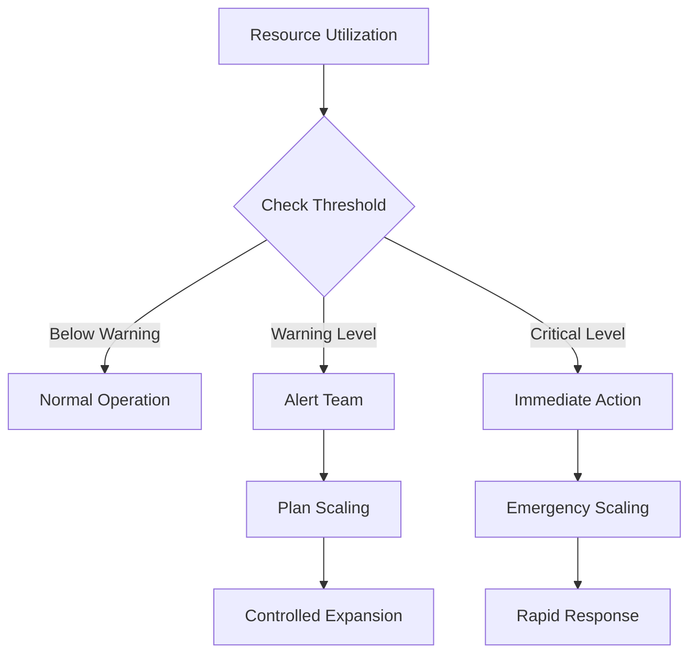
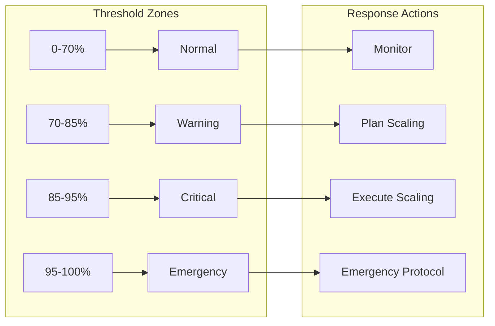
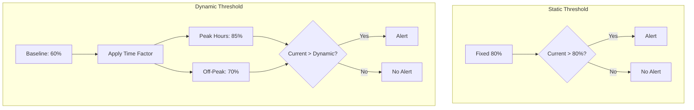
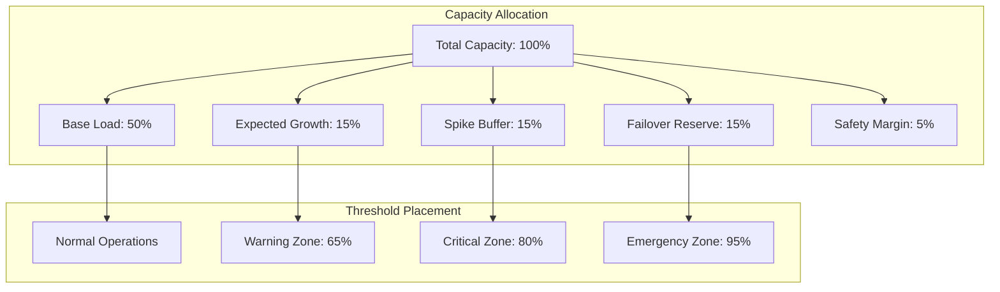
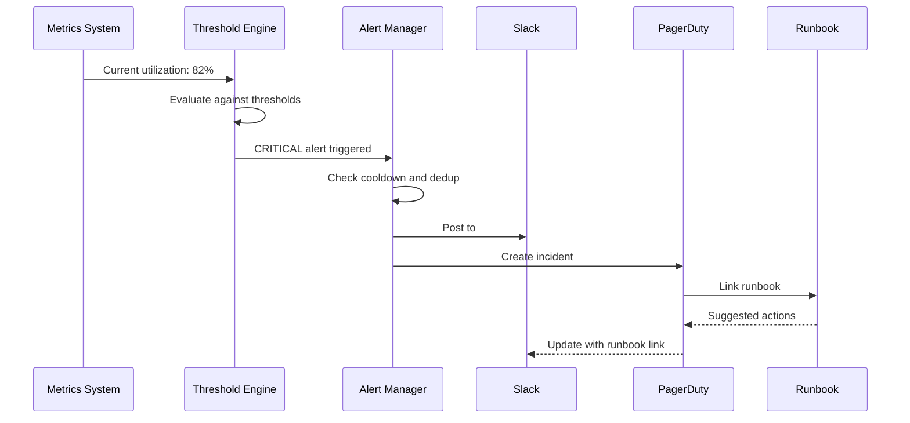

# How to Create Capacity Thresholds

Author: [nawazdhandala](https://github.com/nawazdhandala)

Tags: Capacity Planning, Thresholds, SRE, Infrastructure

Description: Learn how to define capacity thresholds for proactive resource management.

---

Capacity thresholds are the foundation of proactive infrastructure management. They transform reactive firefighting into predictable scaling decisions by alerting teams before resources become exhausted. In this guide, we will explore how to design and implement effective capacity thresholds that balance early warning with alert fatigue.

## Understanding Capacity Thresholds

A capacity threshold is a predefined limit that triggers an action when resource utilization reaches a certain level. Unlike simple monitoring, well-designed thresholds account for growth patterns, buffer requirements, and the time needed to respond.



## Warning Threshold Calculation

Warning thresholds should provide enough lead time to plan and execute scaling operations without causing unnecessary alerts. The key is understanding your growth rate and response time.

### The Lead Time Formula

```python
from dataclasses import dataclass
from datetime import datetime, timedelta
from typing import Optional, List
import math

@dataclass
class GrowthMetrics:
    """Metrics for calculating growth-based thresholds."""
    current_utilization: float  # Current usage percentage (0-100)
    weekly_growth_rate: float   # Weekly growth rate as percentage
    scaling_lead_time_days: int # Days needed to provision resources
    safety_buffer: float        # Additional buffer percentage

class WarningThresholdCalculator:
    """Calculate warning thresholds based on growth and lead time."""

    def __init__(self, metrics: GrowthMetrics):
        self.metrics = metrics

    def calculate_warning_threshold(self) -> float:
        """
        Calculate the warning threshold that provides adequate lead time.

        Formula: Warning = 100 - (growth_rate * lead_time_weeks) - safety_buffer

        Example: If resources grow 5% weekly and scaling takes 2 weeks,
        warning should fire at 100 - (5 * 2) - 10 = 80%
        """
        lead_time_weeks = self.metrics.scaling_lead_time_days / 7
        growth_during_lead_time = self.metrics.weekly_growth_rate * lead_time_weeks

        warning_threshold = (
            100
            - growth_during_lead_time
            - self.metrics.safety_buffer
        )

        # Ensure threshold is reasonable (between 50% and 95%)
        return max(50, min(95, warning_threshold))

    def days_until_critical(self, critical_threshold: float = 95) -> float:
        """Calculate days until critical threshold is reached."""
        if self.metrics.weekly_growth_rate <= 0:
            return float('inf')

        remaining_capacity = critical_threshold - self.metrics.current_utilization
        daily_growth = self.metrics.weekly_growth_rate / 7

        if daily_growth <= 0:
            return float('inf')

        return remaining_capacity / daily_growth

    def projection_report(self) -> dict:
        """Generate a capacity projection report."""
        warning = self.calculate_warning_threshold()
        days_to_warning = (warning - self.metrics.current_utilization) / (
            self.metrics.weekly_growth_rate / 7
        ) if self.metrics.weekly_growth_rate > 0 else float('inf')

        return {
            'current_utilization': f"{self.metrics.current_utilization:.1f}%",
            'warning_threshold': f"{warning:.1f}%",
            'days_to_warning': round(days_to_warning, 1),
            'days_to_critical': round(self.days_until_critical(), 1),
            'weekly_growth_rate': f"{self.metrics.weekly_growth_rate:.1f}%",
            'recommended_action_date': (
                datetime.now() + timedelta(days=days_to_warning)
            ).strftime('%Y-%m-%d') if days_to_warning < float('inf') else 'N/A'
        }


# Example: Database storage capacity planning
db_metrics = GrowthMetrics(
    current_utilization=65,      # Currently at 65%
    weekly_growth_rate=3,        # Growing 3% per week
    scaling_lead_time_days=14,   # Takes 2 weeks to provision
    safety_buffer=10             # 10% safety margin
)

calculator = WarningThresholdCalculator(db_metrics)
report = calculator.projection_report()

print("Capacity Planning Report:")
for key, value in report.items():
    print(f"  {key}: {value}")
```

## Critical Threshold Setting

Critical thresholds mark the point where immediate action is required to prevent service degradation. They should be set high enough to avoid false alarms but low enough to allow emergency response.



### Multi-Level Threshold Configuration

```python
from dataclasses import dataclass, field
from enum import Enum
from typing import List, Callable, Optional
import json

class SeverityLevel(Enum):
    NORMAL = "normal"
    WARNING = "warning"
    CRITICAL = "critical"
    EMERGENCY = "emergency"

@dataclass
class ThresholdAction:
    """Action to take when threshold is breached."""
    name: str
    execute: Callable
    notify_channels: List[str]
    auto_remediate: bool = False

@dataclass
class CapacityThreshold:
    """Definition of a capacity threshold level."""
    level: SeverityLevel
    percentage: float
    sustained_minutes: int  # Must sustain for X minutes before alerting
    actions: List[ThresholdAction] = field(default_factory=list)
    cooldown_minutes: int = 30

@dataclass
class ThresholdConfig:
    """Complete threshold configuration for a resource."""
    resource_name: str
    resource_type: str
    thresholds: List[CapacityThreshold]

    def get_threshold_for_utilization(
        self,
        utilization: float
    ) -> Optional[CapacityThreshold]:
        """Get the highest threshold breached by current utilization."""
        breached = [t for t in self.thresholds if utilization >= t.percentage]
        if not breached:
            return None
        return max(breached, key=lambda t: t.percentage)

    def to_prometheus_rules(self) -> str:
        """Generate Prometheus alerting rules."""
        rules = []
        for threshold in self.thresholds:
            rule = f'''
- alert: {self.resource_name}Capacity{threshold.level.value.title()}
  expr: {self.resource_name}_utilization_percent >= {threshold.percentage}
  for: {threshold.sustained_minutes}m
  labels:
    severity: {threshold.level.value}
    resource: {self.resource_name}
  annotations:
    summary: "{self.resource_name} capacity at {{{{ $value | printf \\"%.1f\\" }}}}%"
    description: "{threshold.level.value.title()} threshold ({threshold.percentage}%) breached"
'''
            rules.append(rule)
        return '\n'.join(rules)


# Example: Configure thresholds for database storage
def scale_database():
    print("Initiating database scaling...")

def page_oncall():
    print("Paging on-call engineer...")

db_config = ThresholdConfig(
    resource_name="postgres_storage",
    resource_type="storage",
    thresholds=[
        CapacityThreshold(
            level=SeverityLevel.WARNING,
            percentage=70,
            sustained_minutes=30,
            actions=[
                ThresholdAction(
                    name="notify_team",
                    execute=lambda: print("Slack notification sent"),
                    notify_channels=["#infrastructure"]
                )
            ]
        ),
        CapacityThreshold(
            level=SeverityLevel.CRITICAL,
            percentage=85,
            sustained_minutes=10,
            actions=[
                ThresholdAction(
                    name="page_oncall",
                    execute=page_oncall,
                    notify_channels=["#incidents", "pagerduty"]
                ),
                ThresholdAction(
                    name="auto_scale",
                    execute=scale_database,
                    notify_channels=["#infrastructure"],
                    auto_remediate=True
                )
            ]
        ),
        CapacityThreshold(
            level=SeverityLevel.EMERGENCY,
            percentage=95,
            sustained_minutes=5,
            actions=[
                ThresholdAction(
                    name="emergency_response",
                    execute=lambda: print("Emergency protocol activated"),
                    notify_channels=["#incidents", "pagerduty", "exec-team"]
                )
            ]
        )
    ]
)

# Generate Prometheus alerting rules
print(db_config.to_prometheus_rules())
```

## Resource-Specific Thresholds

Different resources have different characteristics and require tailored threshold strategies.

### CPU Thresholds

CPU can spike briefly without impact, so thresholds should account for sustained high usage rather than momentary peaks.

```python
from dataclasses import dataclass
from typing import List
from collections import deque
import statistics

@dataclass
class CPUThresholdConfig:
    """CPU-specific threshold configuration."""
    warning_percent: float = 70
    critical_percent: float = 85
    emergency_percent: float = 95

    # CPU-specific settings
    spike_tolerance_seconds: int = 30  # Ignore spikes shorter than this
    averaging_window_seconds: int = 300  # 5-minute average

    # Per-core vs aggregate
    per_core_threshold: float = 95  # Single core saturation
    aggregate_threshold: float = 80  # Overall CPU usage

class CPUCapacityMonitor:
    """Monitor CPU capacity with spike-aware thresholds."""

    def __init__(self, config: CPUThresholdConfig, num_cores: int):
        self.config = config
        self.num_cores = num_cores
        self.samples: deque = deque(maxlen=1000)
        self.per_core_samples: List[deque] = [
            deque(maxlen=1000) for _ in range(num_cores)
        ]

    def record_sample(
        self,
        aggregate_percent: float,
        per_core_percents: List[float]
    ):
        """Record a CPU utilization sample."""
        import time
        timestamp = time.time()

        self.samples.append((timestamp, aggregate_percent))

        for i, core_percent in enumerate(per_core_percents):
            if i < len(self.per_core_samples):
                self.per_core_samples[i].append((timestamp, core_percent))

    def get_averaged_utilization(self) -> float:
        """Get CPU utilization averaged over the configured window."""
        import time
        cutoff = time.time() - self.config.averaging_window_seconds

        recent_samples = [
            value for ts, value in self.samples
            if ts >= cutoff
        ]

        if not recent_samples:
            return 0.0

        return statistics.mean(recent_samples)

    def check_core_saturation(self) -> List[int]:
        """Identify saturated CPU cores."""
        import time
        cutoff = time.time() - self.config.spike_tolerance_seconds

        saturated_cores = []

        for i, core_samples in enumerate(self.per_core_samples):
            recent = [v for ts, v in core_samples if ts >= cutoff]
            if recent and min(recent) >= self.config.per_core_threshold:
                saturated_cores.append(i)

        return saturated_cores

    def evaluate_threshold(self) -> dict:
        """Evaluate current CPU capacity status."""
        avg_utilization = self.get_averaged_utilization()
        saturated_cores = self.check_core_saturation()

        # Determine severity
        if avg_utilization >= self.config.emergency_percent:
            severity = "emergency"
        elif avg_utilization >= self.config.critical_percent:
            severity = "critical"
        elif avg_utilization >= self.config.warning_percent:
            severity = "warning"
        elif saturated_cores:
            severity = "warning"  # Core saturation is a warning
        else:
            severity = "normal"

        return {
            'severity': severity,
            'aggregate_utilization': round(avg_utilization, 1),
            'saturated_cores': saturated_cores,
            'recommendation': self._get_recommendation(severity, saturated_cores)
        }

    def _get_recommendation(
        self,
        severity: str,
        saturated_cores: List[int]
    ) -> str:
        """Generate actionable recommendation."""
        if severity == "emergency":
            return "Immediate scaling required. Consider horizontal scaling or load shedding."
        elif severity == "critical":
            return "Plan scaling within 24 hours. Review recent deployment changes."
        elif severity == "warning":
            if saturated_cores:
                return f"Cores {saturated_cores} saturated. Check for CPU-bound processes."
            return "Monitor growth. Begin capacity planning for next quarter."
        return "Capacity healthy. Continue normal monitoring."
```

### Memory Thresholds

Memory requires tighter thresholds because running out leads to OOM kills and service crashes, with little warning.

```python
@dataclass
class MemoryThresholdConfig:
    """Memory-specific threshold configuration."""
    warning_percent: float = 75
    critical_percent: float = 85
    emergency_percent: float = 92  # Tighter than CPU

    # Memory-specific settings
    oom_buffer_mb: int = 512      # Reserve for OOM protection
    cache_eviction_percent: float = 80  # When to start evicting cache

    # Swap considerations
    swap_warning_percent: float = 25  # Swap usage warning
    swap_critical_percent: float = 50  # Heavy swapping is critical

class MemoryCapacityMonitor:
    """Monitor memory capacity with OOM-aware thresholds."""

    def __init__(self, config: MemoryThresholdConfig, total_memory_mb: int):
        self.config = config
        self.total_memory_mb = total_memory_mb

    def evaluate(
        self,
        used_mb: int,
        cached_mb: int,
        swap_used_mb: int,
        swap_total_mb: int
    ) -> dict:
        """Evaluate memory capacity status."""

        # Calculate effective usage (excluding reclaimable cache)
        effective_used_mb = used_mb - (cached_mb * 0.8)  # 80% cache is reclaimable
        effective_percent = (effective_used_mb / self.total_memory_mb) * 100

        # Calculate actual usage for worst-case scenario
        actual_percent = (used_mb / self.total_memory_mb) * 100

        # Check swap usage
        swap_percent = (swap_used_mb / swap_total_mb * 100) if swap_total_mb > 0 else 0

        # Determine severity (use effective for planning, actual for alerting)
        if actual_percent >= self.config.emergency_percent:
            severity = "emergency"
            reason = "Memory critically low. OOM kill imminent."
        elif swap_percent >= self.config.swap_critical_percent:
            severity = "critical"
            reason = f"Heavy swapping ({swap_percent:.0f}%). Performance degraded."
        elif actual_percent >= self.config.critical_percent:
            severity = "critical"
            reason = "Memory usage critical. Scale immediately."
        elif swap_percent >= self.config.swap_warning_percent:
            severity = "warning"
            reason = f"Swap usage elevated ({swap_percent:.0f}%)."
        elif effective_percent >= self.config.warning_percent:
            severity = "warning"
            reason = "Memory usage elevated. Plan scaling."
        else:
            severity = "normal"
            reason = "Memory capacity healthy."

        return {
            'severity': severity,
            'actual_percent': round(actual_percent, 1),
            'effective_percent': round(effective_percent, 1),
            'swap_percent': round(swap_percent, 1),
            'available_mb': self.total_memory_mb - used_mb,
            'reason': reason,
            'headroom_hours': self._estimate_headroom(effective_used_mb)
        }

    def _estimate_headroom(self, current_mb: float) -> Optional[float]:
        """Estimate hours until memory exhaustion based on historical growth."""
        # This would typically use historical data
        # Placeholder implementation
        return None
```

### Storage Thresholds

Storage thresholds must account for the time required to provision additional capacity, which can be hours or days.

```python
from datetime import datetime, timedelta

@dataclass
class StorageThresholdConfig:
    """Storage-specific threshold configuration."""
    warning_percent: float = 70
    critical_percent: float = 85
    emergency_percent: float = 95

    # Storage-specific settings
    inode_warning_percent: float = 80  # Inode exhaustion warning
    growth_rate_window_days: int = 7   # Days to calculate growth rate
    provisioning_time_hours: int = 48  # Time to provision new storage

class StorageCapacityMonitor:
    """Monitor storage capacity with growth-aware thresholds."""

    def __init__(
        self,
        config: StorageThresholdConfig,
        total_bytes: int,
        total_inodes: int
    ):
        self.config = config
        self.total_bytes = total_bytes
        self.total_inodes = total_inodes
        self.history: List[tuple] = []

    def record_snapshot(self, used_bytes: int, used_inodes: int):
        """Record a storage utilization snapshot."""
        self.history.append((datetime.utcnow(), used_bytes, used_inodes))

        # Keep only relevant history
        cutoff = datetime.utcnow() - timedelta(
            days=self.config.growth_rate_window_days * 2
        )
        self.history = [h for h in self.history if h[0] >= cutoff]

    def calculate_growth_rate(self) -> float:
        """Calculate bytes per hour growth rate."""
        if len(self.history) < 2:
            return 0.0

        cutoff = datetime.utcnow() - timedelta(
            days=self.config.growth_rate_window_days
        )
        recent = [h for h in self.history if h[0] >= cutoff]

        if len(recent) < 2:
            return 0.0

        oldest = recent[0]
        newest = recent[-1]

        bytes_diff = newest[1] - oldest[1]
        hours_diff = (newest[0] - oldest[0]).total_seconds() / 3600

        if hours_diff == 0:
            return 0.0

        return bytes_diff / hours_diff

    def hours_until_full(self, current_bytes: int) -> Optional[float]:
        """Estimate hours until storage is full."""
        growth_rate = self.calculate_growth_rate()

        if growth_rate <= 0:
            return None  # Not growing or shrinking

        remaining_bytes = self.total_bytes - current_bytes
        return remaining_bytes / growth_rate

    def evaluate(self, used_bytes: int, used_inodes: int) -> dict:
        """Evaluate storage capacity status."""
        self.record_snapshot(used_bytes, used_inodes)

        space_percent = (used_bytes / self.total_bytes) * 100
        inode_percent = (used_inodes / self.total_inodes) * 100

        hours_remaining = self.hours_until_full(used_bytes)
        provisioning_hours = self.config.provisioning_time_hours

        # Determine severity
        if space_percent >= self.config.emergency_percent:
            severity = "emergency"
            reason = "Storage critically full. Service degradation imminent."
        elif hours_remaining and hours_remaining < provisioning_hours:
            severity = "critical"
            reason = f"Will exhaust in {hours_remaining:.0f}h, provisioning takes {provisioning_hours}h."
        elif inode_percent >= self.config.inode_warning_percent:
            severity = "critical"
            reason = f"Inode usage at {inode_percent:.0f}%. Cannot create new files soon."
        elif space_percent >= self.config.critical_percent:
            severity = "critical"
            reason = "Storage usage critical."
        elif space_percent >= self.config.warning_percent:
            severity = "warning"
            reason = "Storage usage elevated. Begin provisioning."
        else:
            severity = "normal"
            reason = "Storage capacity healthy."

        return {
            'severity': severity,
            'space_percent': round(space_percent, 1),
            'inode_percent': round(inode_percent, 1),
            'used_gb': round(used_bytes / (1024**3), 2),
            'total_gb': round(self.total_bytes / (1024**3), 2),
            'hours_until_full': round(hours_remaining, 1) if hours_remaining else None,
            'growth_rate_gb_per_day': round(
                self.calculate_growth_rate() * 24 / (1024**3), 2
            ),
            'reason': reason
        }
```

## Dynamic Threshold Adjustment

Static thresholds do not account for predictable variations like daily traffic patterns or seasonal changes. Dynamic thresholds adapt to normal patterns.



### Time-Aware Dynamic Thresholds

```python
from dataclasses import dataclass, field
from datetime import datetime, time
from typing import Dict, List, Optional, Callable
from enum import Enum
import statistics

class DayType(Enum):
    WEEKDAY = "weekday"
    WEEKEND = "weekend"
    HOLIDAY = "holiday"

@dataclass
class TimeWindow:
    """Define a time window with its expected utilization."""
    start_hour: int
    end_hour: int
    day_types: List[DayType]
    baseline_percent: float
    tolerance_percent: float  # How much above baseline triggers alert

@dataclass
class DynamicThresholdConfig:
    """Configuration for dynamic thresholds."""
    resource_name: str
    default_baseline: float = 50
    default_tolerance: float = 30
    time_windows: List[TimeWindow] = field(default_factory=list)
    learning_period_days: int = 14
    anomaly_std_devs: float = 2.5  # Standard deviations for anomaly

class DynamicThresholdEngine:
    """Engine for calculating dynamic thresholds."""

    def __init__(self, config: DynamicThresholdConfig):
        self.config = config
        self.historical_data: Dict[str, List[float]] = {}  # hour_daytype -> values

    def _get_bucket_key(self, dt: datetime) -> str:
        """Get the bucket key for a given datetime."""
        day_type = self._get_day_type(dt)
        return f"{dt.hour}_{day_type.value}"

    def _get_day_type(self, dt: datetime) -> DayType:
        """Determine the day type for a datetime."""
        # Simplified - in production, check holiday calendar
        if dt.weekday() >= 5:
            return DayType.WEEKEND
        return DayType.WEEKDAY

    def record_observation(self, utilization: float, timestamp: datetime = None):
        """Record a utilization observation for learning."""
        ts = timestamp or datetime.utcnow()
        key = self._get_bucket_key(ts)

        if key not in self.historical_data:
            self.historical_data[key] = []

        self.historical_data[key].append(utilization)

        # Keep reasonable history size
        max_samples = self.config.learning_period_days * 24
        if len(self.historical_data[key]) > max_samples:
            self.historical_data[key] = self.historical_data[key][-max_samples:]

    def get_dynamic_threshold(self, timestamp: datetime = None) -> dict:
        """Calculate the dynamic threshold for a given time."""
        ts = timestamp or datetime.utcnow()

        # Check configured time windows first
        for window in self.config.time_windows:
            if self._matches_window(ts, window):
                return {
                    'threshold': window.baseline_percent + window.tolerance_percent,
                    'baseline': window.baseline_percent,
                    'tolerance': window.tolerance_percent,
                    'source': 'configured_window',
                    'window_name': f"{window.start_hour}:00-{window.end_hour}:00"
                }

        # Fall back to learned baseline
        key = self._get_bucket_key(ts)
        historical = self.historical_data.get(key, [])

        if len(historical) >= 10:  # Minimum samples for learning
            baseline = statistics.mean(historical)
            std_dev = statistics.stdev(historical) if len(historical) > 1 else 10
            tolerance = max(
                self.config.default_tolerance,
                std_dev * self.config.anomaly_std_devs
            )

            return {
                'threshold': baseline + tolerance,
                'baseline': round(baseline, 1),
                'tolerance': round(tolerance, 1),
                'source': 'learned',
                'samples': len(historical)
            }

        # Default threshold
        return {
            'threshold': self.config.default_baseline + self.config.default_tolerance,
            'baseline': self.config.default_baseline,
            'tolerance': self.config.default_tolerance,
            'source': 'default'
        }

    def _matches_window(self, dt: datetime, window: TimeWindow) -> bool:
        """Check if datetime falls within a time window."""
        day_type = self._get_day_type(dt)

        if day_type not in window.day_types:
            return False

        if window.start_hour <= window.end_hour:
            return window.start_hour <= dt.hour < window.end_hour
        else:
            # Handles overnight windows (e.g., 22:00 - 06:00)
            return dt.hour >= window.start_hour or dt.hour < window.end_hour

    def evaluate(self, current_utilization: float, timestamp: datetime = None) -> dict:
        """Evaluate current utilization against dynamic threshold."""
        ts = timestamp or datetime.utcnow()
        threshold_info = self.get_dynamic_threshold(ts)

        self.record_observation(current_utilization, ts)

        deviation = current_utilization - threshold_info['baseline']

        if current_utilization >= threshold_info['threshold']:
            severity = 'warning'
            if current_utilization >= threshold_info['threshold'] + 10:
                severity = 'critical'
        else:
            severity = 'normal'

        return {
            'severity': severity,
            'current': round(current_utilization, 1),
            'threshold': round(threshold_info['threshold'], 1),
            'baseline': threshold_info['baseline'],
            'deviation': round(deviation, 1),
            'threshold_source': threshold_info['source']
        }


# Example: Configure dynamic thresholds for web server
web_config = DynamicThresholdConfig(
    resource_name="web_server_cpu",
    default_baseline=40,
    default_tolerance=30,
    time_windows=[
        # Business hours have higher expected load
        TimeWindow(
            start_hour=9,
            end_hour=18,
            day_types=[DayType.WEEKDAY],
            baseline_percent=65,
            tolerance_percent=25
        ),
        # Weekend maintenance window has lower threshold
        TimeWindow(
            start_hour=2,
            end_hour=6,
            day_types=[DayType.WEEKEND],
            baseline_percent=20,
            tolerance_percent=15
        )
    ]
)

engine = DynamicThresholdEngine(web_config)

# Simulate evaluation at different times
print("Business hours (Tuesday 10 AM):")
result = engine.evaluate(75, datetime(2026, 1, 27, 10, 0))
print(f"  {result}")

print("\nWeekend night (Sunday 3 AM):")
result = engine.evaluate(35, datetime(2026, 1, 25, 3, 0))
print(f"  {result}")
```

## Headroom Considerations

Headroom is the buffer between current utilization and capacity limits. It accounts for traffic spikes, failover scenarios, and operational needs.



### Headroom Calculator

```python
from dataclasses import dataclass
from typing import Optional

@dataclass
class HeadroomRequirements:
    """Define headroom requirements for capacity planning."""
    base_utilization_percent: float
    peak_spike_multiplier: float = 1.5  # Peak is 1.5x average
    failover_nodes: int = 1             # N+1 redundancy
    total_nodes: int = 3                # Total nodes in cluster
    growth_buffer_months: int = 3       # Months of growth to buffer

@dataclass
class HeadroomAnalysis:
    """Results of headroom analysis."""
    available_headroom_percent: float
    spike_headroom_percent: float
    failover_headroom_percent: float
    growth_headroom_percent: float
    effective_capacity_percent: float
    is_adequate: bool
    recommendation: str

class HeadroomCalculator:
    """Calculate required headroom and validate capacity."""

    def __init__(self, requirements: HeadroomRequirements):
        self.req = requirements

    def calculate_spike_headroom(self) -> float:
        """Calculate headroom needed for traffic spikes."""
        peak_utilization = self.req.base_utilization_percent * self.req.peak_spike_multiplier
        return peak_utilization - self.req.base_utilization_percent

    def calculate_failover_headroom(self) -> float:
        """Calculate headroom needed for node failures."""
        if self.req.total_nodes <= self.req.failover_nodes:
            return 100  # Cannot handle any failures

        healthy_capacity = (
            (self.req.total_nodes - self.req.failover_nodes)
            / self.req.total_nodes
        )

        # Utilization on remaining nodes after failure
        utilization_after_failure = self.req.base_utilization_percent / healthy_capacity
        return utilization_after_failure - self.req.base_utilization_percent

    def calculate_growth_headroom(
        self,
        monthly_growth_rate: float
    ) -> float:
        """Calculate headroom needed for expected growth."""
        growth_multiplier = (1 + monthly_growth_rate / 100) ** self.req.growth_buffer_months
        return self.req.base_utilization_percent * (growth_multiplier - 1)

    def analyze(
        self,
        current_utilization: float,
        monthly_growth_rate: float = 5
    ) -> HeadroomAnalysis:
        """Perform complete headroom analysis."""

        spike_headroom = self.calculate_spike_headroom()
        failover_headroom = self.calculate_failover_headroom()
        growth_headroom = self.calculate_growth_headroom(monthly_growth_rate)

        # Total required headroom
        total_required = spike_headroom + failover_headroom + growth_headroom

        # Available headroom
        available = 100 - current_utilization

        # Effective capacity (what we can safely use)
        effective = 100 - total_required

        # Is current utilization safe?
        is_adequate = current_utilization <= effective

        # Generate recommendation
        if not is_adequate:
            deficit = current_utilization - effective
            recommendation = (
                f"Scale capacity by {deficit:.0f}% to maintain safe headroom. "
                f"Current utilization ({current_utilization:.0f}%) exceeds "
                f"effective capacity ({effective:.0f}%)."
            )
        elif available < total_required * 0.5:
            recommendation = (
                f"Headroom adequate but limited. Consider proactive scaling. "
                f"Available: {available:.0f}%, Recommended: {total_required:.0f}%."
            )
        else:
            recommendation = (
                f"Headroom healthy. {available:.0f}% available, "
                f"{total_required:.0f}% required."
            )

        return HeadroomAnalysis(
            available_headroom_percent=round(available, 1),
            spike_headroom_percent=round(spike_headroom, 1),
            failover_headroom_percent=round(failover_headroom, 1),
            growth_headroom_percent=round(growth_headroom, 1),
            effective_capacity_percent=round(effective, 1),
            is_adequate=is_adequate,
            recommendation=recommendation
        )


# Example: Analyze headroom for a 3-node API cluster
requirements = HeadroomRequirements(
    base_utilization_percent=45,
    peak_spike_multiplier=1.8,    # Black Friday traffic
    failover_nodes=1,             # N+1 redundancy
    total_nodes=3,
    growth_buffer_months=3
)

calculator = HeadroomCalculator(requirements)
analysis = calculator.analyze(
    current_utilization=55,
    monthly_growth_rate=8
)

print("Headroom Analysis:")
print(f"  Available: {analysis.available_headroom_percent}%")
print(f"  For spikes: {analysis.spike_headroom_percent}%")
print(f"  For failover: {analysis.failover_headroom_percent}%")
print(f"  For growth: {analysis.growth_headroom_percent}%")
print(f"  Effective capacity: {analysis.effective_capacity_percent}%")
print(f"  Adequate: {analysis.is_adequate}")
print(f"  Recommendation: {analysis.recommendation}")
```

## Alert Integration

Thresholds are only useful if they trigger appropriate alerts. Well-designed alert integration ensures the right people get notified at the right time.



### Alert Configuration

```python
from dataclasses import dataclass, field
from datetime import datetime, timedelta
from typing import List, Dict, Optional, Callable
from enum import Enum
import json

class AlertChannel(Enum):
    SLACK = "slack"
    PAGERDUTY = "pagerduty"
    EMAIL = "email"
    WEBHOOK = "webhook"

@dataclass
class AlertRoute:
    """Define routing for alerts based on severity."""
    severity: SeverityLevel
    channels: List[AlertChannel]
    escalation_minutes: int = 30  # Time before escalation
    require_ack: bool = False

@dataclass
class AlertState:
    """Track the state of an active alert."""
    alert_id: str
    resource: str
    severity: SeverityLevel
    triggered_at: datetime
    acknowledged_at: Optional[datetime] = None
    resolved_at: Optional[datetime] = None
    escalation_count: int = 0

class CapacityAlertManager:
    """Manage capacity threshold alerts with routing and escalation."""

    def __init__(self, routes: List[AlertRoute]):
        self.routes = {r.severity: r for r in routes}
        self.active_alerts: Dict[str, AlertState] = {}
        self.cooldowns: Dict[str, datetime] = {}
        self.alert_history: List[AlertState] = []

    def should_alert(
        self,
        resource: str,
        severity: SeverityLevel,
        cooldown_minutes: int = 30
    ) -> bool:
        """Check if we should send an alert (respecting cooldowns)."""
        key = f"{resource}_{severity.value}"

        if key in self.cooldowns:
            if datetime.utcnow() < self.cooldowns[key]:
                return False

        return True

    def create_alert(
        self,
        resource: str,
        severity: SeverityLevel,
        current_value: float,
        threshold_value: float,
        context: Dict = None
    ) -> Optional[AlertState]:
        """Create and route a capacity alert."""

        # Check cooldown
        if not self.should_alert(resource, severity):
            return None

        # Create alert
        alert_id = f"{resource}_{severity.value}_{datetime.utcnow().timestamp()}"
        alert = AlertState(
            alert_id=alert_id,
            resource=resource,
            severity=severity,
            triggered_at=datetime.utcnow()
        )

        self.active_alerts[alert_id] = alert

        # Set cooldown
        route = self.routes.get(severity)
        if route:
            cooldown_key = f"{resource}_{severity.value}"
            self.cooldowns[cooldown_key] = (
                datetime.utcnow() + timedelta(minutes=30)
            )

        # Build alert payload
        payload = self._build_payload(
            resource, severity, current_value, threshold_value, context
        )

        # Route to channels
        self._route_alert(severity, payload)

        return alert

    def _build_payload(
        self,
        resource: str,
        severity: SeverityLevel,
        current: float,
        threshold: float,
        context: Dict = None
    ) -> Dict:
        """Build alert payload."""
        return {
            'resource': resource,
            'severity': severity.value,
            'current_value': current,
            'threshold_value': threshold,
            'timestamp': datetime.utcnow().isoformat(),
            'title': f"Capacity {severity.value.upper()}: {resource} at {current:.1f}%",
            'description': (
                f"{resource} utilization ({current:.1f}%) has breached "
                f"the {severity.value} threshold ({threshold:.1f}%)"
            ),
            'runbook_url': f"https://runbooks.example.com/capacity/{resource}",
            'context': context or {}
        }

    def _route_alert(self, severity: SeverityLevel, payload: Dict):
        """Route alert to configured channels."""
        route = self.routes.get(severity)
        if not route:
            return

        for channel in route.channels:
            self._send_to_channel(channel, payload)

    def _send_to_channel(self, channel: AlertChannel, payload: Dict):
        """Send alert to a specific channel."""
        # Implementation would integrate with actual services
        print(f"[{channel.value}] {payload['title']}")

    def acknowledge(self, alert_id: str) -> bool:
        """Acknowledge an active alert."""
        if alert_id not in self.active_alerts:
            return False

        alert = self.active_alerts[alert_id]
        alert.acknowledged_at = datetime.utcnow()
        return True

    def resolve(self, alert_id: str) -> bool:
        """Resolve an active alert."""
        if alert_id not in self.active_alerts:
            return False

        alert = self.active_alerts[alert_id]
        alert.resolved_at = datetime.utcnow()

        # Move to history
        self.alert_history.append(alert)
        del self.active_alerts[alert_id]

        return True

    def check_escalations(self):
        """Check for alerts needing escalation."""
        for alert_id, alert in self.active_alerts.items():
            route = self.routes.get(alert.severity)
            if not route or not route.require_ack:
                continue

            if alert.acknowledged_at:
                continue

            # Check if escalation time exceeded
            escalation_deadline = (
                alert.triggered_at + timedelta(minutes=route.escalation_minutes)
            )

            if datetime.utcnow() > escalation_deadline:
                self._escalate(alert)

    def _escalate(self, alert: AlertState):
        """Escalate an unacknowledged alert."""
        alert.escalation_count += 1
        print(f"ESCALATION #{alert.escalation_count}: {alert.resource} - {alert.severity.value}")

    def get_alert_stats(self) -> Dict:
        """Get statistics about alerts."""
        resolved = [a for a in self.alert_history if a.resolved_at]

        mttr_values = []
        for alert in resolved:
            duration = (alert.resolved_at - alert.triggered_at).total_seconds() / 60
            mttr_values.append(duration)

        return {
            'active_alerts': len(self.active_alerts),
            'resolved_last_24h': len([
                a for a in resolved
                if a.resolved_at > datetime.utcnow() - timedelta(hours=24)
            ]),
            'avg_resolution_minutes': (
                sum(mttr_values) / len(mttr_values) if mttr_values else 0
            ),
            'by_severity': {
                severity.value: len([
                    a for a in self.active_alerts.values()
                    if a.severity == severity
                ])
                for severity in SeverityLevel
            }
        }


# Example: Configure alert routing
alert_manager = CapacityAlertManager([
    AlertRoute(
        severity=SeverityLevel.WARNING,
        channels=[AlertChannel.SLACK],
        escalation_minutes=60,
        require_ack=False
    ),
    AlertRoute(
        severity=SeverityLevel.CRITICAL,
        channels=[AlertChannel.SLACK, AlertChannel.PAGERDUTY],
        escalation_minutes=15,
        require_ack=True
    ),
    AlertRoute(
        severity=SeverityLevel.EMERGENCY,
        channels=[AlertChannel.SLACK, AlertChannel.PAGERDUTY, AlertChannel.EMAIL],
        escalation_minutes=5,
        require_ack=True
    )
])

# Trigger a critical alert
alert = alert_manager.create_alert(
    resource="postgres_storage",
    severity=SeverityLevel.CRITICAL,
    current_value=87.5,
    threshold_value=85.0,
    context={
        'growth_rate': '2.1 GB/day',
        'hours_until_full': 72
    }
)
```

## Putting It All Together

Here is a complete capacity threshold monitoring system that combines all the concepts:

```python
from dataclasses import dataclass
from datetime import datetime
from typing import Dict, List, Optional
import json

@dataclass
class CapacityMonitoringSystem:
    """Complete capacity monitoring system with thresholds and alerts."""

    def __init__(self):
        self.resources: Dict[str, Dict] = {}
        self.monitors: Dict[str, any] = {}
        self.alert_manager: Optional[CapacityAlertManager] = None

    def register_resource(
        self,
        name: str,
        resource_type: str,
        thresholds: ThresholdConfig,
        monitor_class: any
    ):
        """Register a resource for capacity monitoring."""
        self.resources[name] = {
            'type': resource_type,
            'thresholds': thresholds,
            'last_check': None,
            'current_status': None
        }

    def check_all(self) -> Dict:
        """Check capacity for all registered resources."""
        results = {
            'timestamp': datetime.utcnow().isoformat(),
            'resources': {},
            'alerts_triggered': []
        }

        for name, resource in self.resources.items():
            # This would fetch actual metrics in production
            status = self._check_resource(name, resource)
            results['resources'][name] = status

            # Trigger alerts if needed
            if status['severity'] in ['critical', 'emergency']:
                if self.alert_manager:
                    alert = self.alert_manager.create_alert(
                        resource=name,
                        severity=SeverityLevel[status['severity'].upper()],
                        current_value=status['utilization'],
                        threshold_value=status['threshold']
                    )
                    if alert:
                        results['alerts_triggered'].append(alert.alert_id)

        return results

    def _check_resource(self, name: str, resource: Dict) -> Dict:
        """Check a single resource's capacity."""
        # Placeholder - would use actual monitoring in production
        return {
            'name': name,
            'type': resource['type'],
            'utilization': 75.0,
            'threshold': 80.0,
            'severity': 'warning',
            'recommendation': 'Monitor growth and plan scaling.'
        }

    def generate_report(self) -> str:
        """Generate a capacity planning report."""
        results = self.check_all()

        report_lines = [
            "=" * 60,
            "CAPACITY PLANNING REPORT",
            f"Generated: {results['timestamp']}",
            "=" * 60,
            ""
        ]

        for name, status in results['resources'].items():
            report_lines.extend([
                f"Resource: {name}",
                f"  Type: {status['type']}",
                f"  Utilization: {status['utilization']:.1f}%",
                f"  Threshold: {status['threshold']:.1f}%",
                f"  Status: {status['severity'].upper()}",
                f"  Recommendation: {status['recommendation']}",
                ""
            ])

        if results['alerts_triggered']:
            report_lines.extend([
                "ALERTS TRIGGERED:",
                *[f"  - {alert_id}" for alert_id in results['alerts_triggered']],
                ""
            ])

        return '\n'.join(report_lines)


# Create and configure the monitoring system
monitoring = CapacityMonitoringSystem()

# Register resources with their thresholds
monitoring.register_resource(
    name="api-cluster-cpu",
    resource_type="cpu",
    thresholds=ThresholdConfig(
        resource_name="api_cluster_cpu",
        resource_type="cpu",
        thresholds=[
            CapacityThreshold(SeverityLevel.WARNING, 70, 5),
            CapacityThreshold(SeverityLevel.CRITICAL, 85, 2),
            CapacityThreshold(SeverityLevel.EMERGENCY, 95, 1)
        ]
    ),
    monitor_class=CPUCapacityMonitor
)

monitoring.register_resource(
    name="primary-database-storage",
    resource_type="storage",
    thresholds=ThresholdConfig(
        resource_name="primary_db_storage",
        resource_type="storage",
        thresholds=[
            CapacityThreshold(SeverityLevel.WARNING, 70, 30),
            CapacityThreshold(SeverityLevel.CRITICAL, 85, 10),
            CapacityThreshold(SeverityLevel.EMERGENCY, 95, 5)
        ]
    ),
    monitor_class=StorageCapacityMonitor
)

# Generate report
print(monitoring.generate_report())
```

## Key Takeaways

Creating effective capacity thresholds requires balancing several competing concerns:

1. **Lead time vs. noise**: Warning thresholds must provide enough time to respond but not trigger so often that teams ignore them.

2. **Resource-specific tuning**: CPU, memory, and storage have different failure modes and require different threshold strategies.

3. **Dynamic adaptation**: Static thresholds miss predictable variations. Incorporate time-of-day and seasonal patterns.

4. **Headroom planning**: Account for spikes, failover, and growth when setting thresholds. Running at 80% utilization may already be too late.

5. **Alert hygiene**: Every threshold should map to a specific action. Delete thresholds that do not drive decisions.

6. **Continuous refinement**: Review threshold effectiveness monthly. Adjust based on actual incidents and near-misses.

By implementing thoughtful capacity thresholds, teams transform from reactive firefighting to proactive capacity management, catching problems before they become incidents and making scaling decisions based on data rather than panic.
