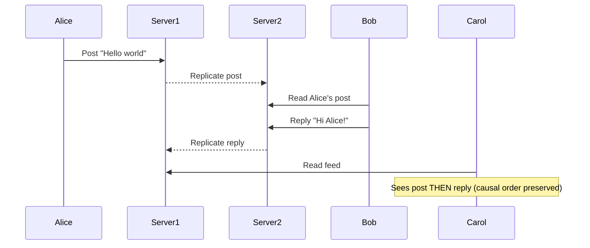
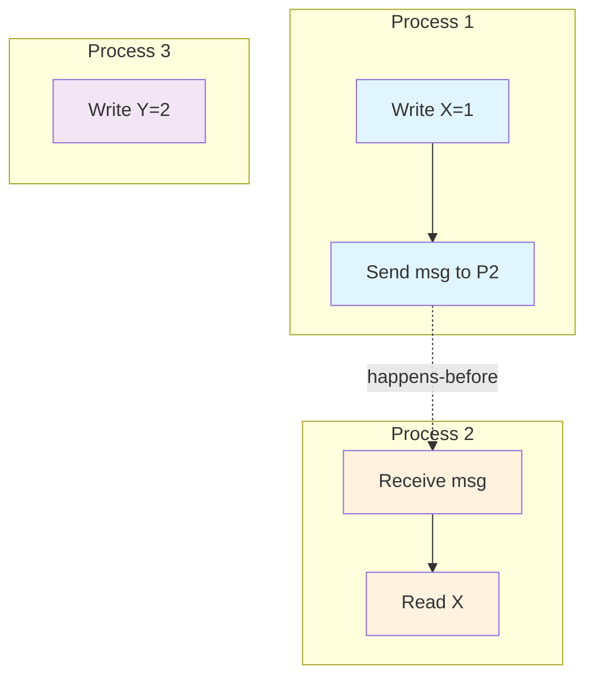
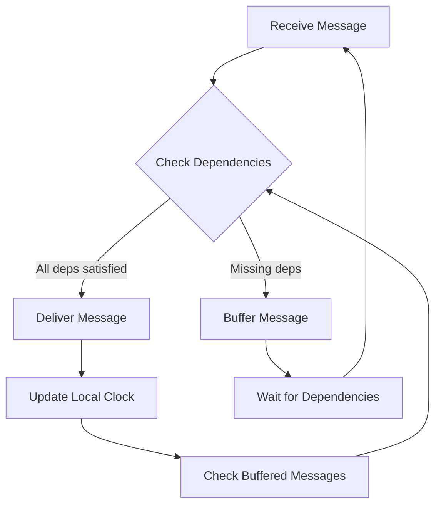
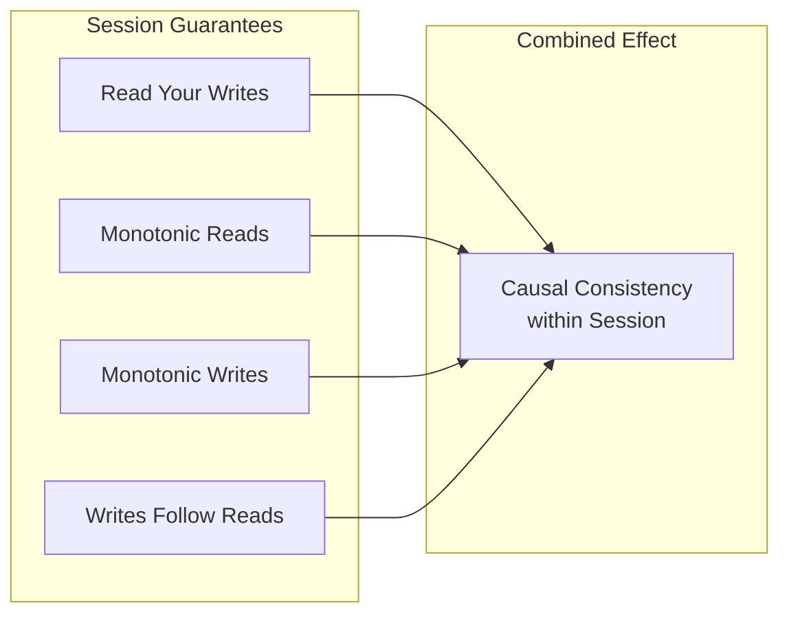
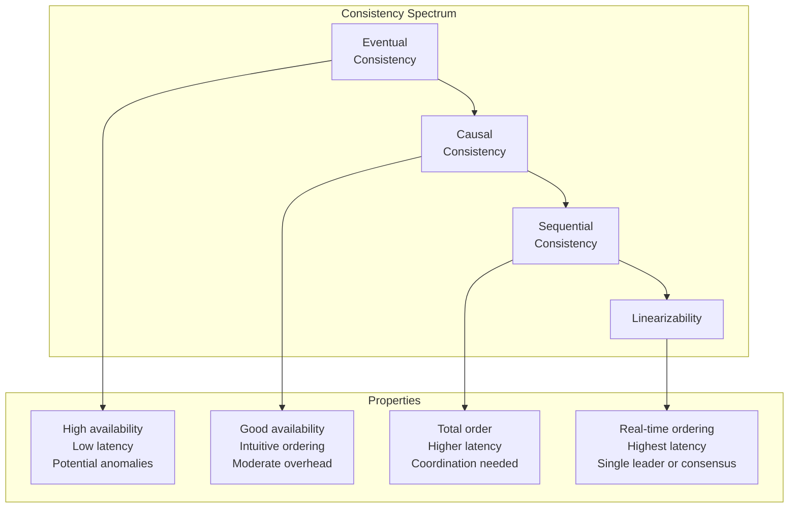

# How to Build Causal Consistency Patterns

Author: [nawazdhandala](https://github.com/nawazdhandala)

Tags: Distributed Systems, Consistency, Causality, Database

Description: Learn how to implement causal consistency in distributed systems, from understanding happens-before relationships to building vector clocks and session guarantees that keep your data coherent without sacrificing availability.

---

Strong consistency is expensive. Eventual consistency is confusing. Causal consistency sits in the middle: it guarantees that operations that are causally related appear in the same order everywhere, while allowing concurrent operations to be seen in different orders on different nodes. This gives you most of the intuitive behavior users expect without the coordination overhead of linearizability.

## What Is Causal Consistency?

Causal consistency ensures that if operation A *causes* operation B, then every node that sees B will also see A first. If two operations are independent (neither caused the other), nodes can observe them in any order.

Consider a social media feed:
1. Alice posts "Hello world"
2. Bob reads Alice's post
3. Bob replies "Hi Alice!"

Under causal consistency, anyone who sees Bob's reply will also see Alice's original post. Without causal consistency, a user might see the reply before the original post-or worse, see the reply without ever seeing the post it references.



## The Happens-Before Relationship

The foundation of causal consistency is Leslie Lamport's *happens-before* relationship, denoted as `->`. An event A happens-before event B (`A -> B`) if:

1. **Same process:** A and B occur in the same process, and A comes before B in program order
2. **Message passing:** A is the send of a message and B is the receipt of that same message
3. **Transitivity:** There exists an event C such that `A -> C` and `C -> B`

If neither `A -> B` nor `B -> A`, the events are *concurrent* (written `A || B`). Concurrent events have no causal relationship and can be observed in any order.



In this diagram, `Write X=1 -> Read X` (through message passing), but `Write Y=2` is concurrent with everything in P1 and P2.

## Vector Clocks: Tracking Causality

Lamport timestamps give you a total order but lose concurrency information. Vector clocks preserve the full happens-before relationship by maintaining a counter for each process.

### How Vector Clocks Work

Each process maintains a vector `V[1..n]` where `n` is the number of processes:

1. **Local event:** Increment your own counter `V[self]++`
2. **Send message:** Increment, then attach your current vector to the message
3. **Receive message:** Merge the incoming vector by taking the element-wise max, then increment your own counter

```typescript
class VectorClock {
  private clock: Map<string, number>;
  private nodeId: string;

  constructor(nodeId: string) {
    this.nodeId = nodeId;
    this.clock = new Map();
  }

  // Increment on local event
  tick(): VectorClock {
    const current = this.clock.get(this.nodeId) || 0;
    this.clock.set(this.nodeId, current + 1);
    return this;
  }

  // Merge with incoming clock (on receive)
  merge(other: VectorClock): VectorClock {
    for (const [nodeId, timestamp] of other.clock) {
      const current = this.clock.get(nodeId) || 0;
      this.clock.set(nodeId, Math.max(current, timestamp));
    }
    return this.tick(); // Increment after merge
  }

  // Compare two vector clocks
  compare(other: VectorClock): 'before' | 'after' | 'concurrent' {
    let dominated = false;
    let dominates = false;

    const allKeys = new Set([...this.clock.keys(), ...other.clock.keys()]);

    for (const key of allKeys) {
      const thisVal = this.clock.get(key) || 0;
      const otherVal = other.clock.get(key) || 0;

      if (thisVal < otherVal) dominated = true;
      if (thisVal > otherVal) dominates = true;
    }

    if (dominated && !dominates) return 'before';
    if (dominates && !dominated) return 'after';
    return 'concurrent';
  }

  // Serialize for transmission
  toJSON(): Record<string, number> {
    return Object.fromEntries(this.clock);
  }

  // Deserialize from received message
  static fromJSON(nodeId: string, data: Record<string, number>): VectorClock {
    const vc = new VectorClock(nodeId);
    vc.clock = new Map(Object.entries(data));
    return vc;
  }
}
```

### Comparing Vector Clocks

Given two vector clocks `V` and `W`:
- `V < W` (V happens-before W) if `V[i] <= W[i]` for all i, and `V[j] < W[j]` for at least one j
- `V > W` (V happens-after W) if `W < V`
- Otherwise, V and W are concurrent

```typescript
// Example usage
const node1 = new VectorClock('node1');
const node2 = new VectorClock('node2');
const node3 = new VectorClock('node3');

// Node 1 writes
node1.tick();
console.log(node1.toJSON()); // { node1: 1 }

// Node 1 sends to node 2
const message1 = { data: 'hello', clock: node1.toJSON() };

// Node 2 receives and writes
const receivedClock = VectorClock.fromJSON('node2', message1.clock);
node2.merge(receivedClock);
node2.tick();
console.log(node2.toJSON()); // { node1: 1, node2: 2 }

// Node 3 writes independently (concurrent)
node3.tick();
console.log(node3.toJSON()); // { node3: 1 }

// Compare: node2's clock vs node3's clock
const comparison = node2.compare(node3);
console.log(comparison); // 'concurrent'
```

## Implementing Causal Delivery

Vector clocks tell you *what* happened before what. Causal delivery ensures messages are *delivered* in causal order. A message is held in a buffer until all causally preceding messages have been delivered.

```typescript
interface CausalMessage<T> {
  senderId: string;
  payload: T;
  vectorClock: Record<string, number>;
}

class CausalDeliveryBuffer<T> {
  private nodeId: string;
  private clock: VectorClock;
  private buffer: CausalMessage<T>[] = [];
  private onDeliver: (msg: CausalMessage<T>) => void;

  constructor(nodeId: string, onDeliver: (msg: CausalMessage<T>) => void) {
    this.nodeId = nodeId;
    this.clock = new VectorClock(nodeId);
    this.onDeliver = onDeliver;
  }

  receive(message: CausalMessage<T>): void {
    this.buffer.push(message);
    this.tryDeliverBuffered();
  }

  private tryDeliverBuffered(): void {
    let delivered = true;

    while (delivered) {
      delivered = false;

      for (let i = 0; i < this.buffer.length; i++) {
        const msg = this.buffer[i];

        if (this.canDeliver(msg)) {
          // Remove from buffer
          this.buffer.splice(i, 1);

          // Merge clock and deliver
          const msgClock = VectorClock.fromJSON(this.nodeId, msg.vectorClock);
          this.clock.merge(msgClock);

          this.onDeliver(msg);
          delivered = true;
          break;
        }
      }
    }
  }

  private canDeliver(msg: CausalMessage<T>): boolean {
    // Can deliver if we've seen all messages that causally precede this one
    // This means: for sender, their clock entry should be exactly 1 more than ours
    // For all other nodes, their entries should be <= ours

    for (const [nodeId, timestamp] of Object.entries(msg.vectorClock)) {
      const ourTimestamp = this.clock['clock'].get(nodeId) || 0;

      if (nodeId === msg.senderId) {
        // Sender's entry should be exactly 1 more than what we've seen
        if (timestamp !== ourTimestamp + 1) {
          return false;
        }
      } else {
        // Other entries should not exceed what we've seen
        if (timestamp > ourTimestamp) {
          return false;
        }
      }
    }

    return true;
  }

  // For sending: tick and return current clock
  prepareToSend(): Record<string, number> {
    this.clock.tick();
    return this.clock.toJSON();
  }
}
```



## Session Guarantees

Causal consistency at the system level is powerful, but users interact through sessions. Session guarantees provide stronger properties within a single client session:

### Read Your Writes

A client always sees its own writes. If I write X=5, my next read of X returns 5 (or a later value).

```typescript
class SessionClient {
  private sessionClock: VectorClock;
  private clientId: string;

  constructor(clientId: string) {
    this.clientId = clientId;
    this.sessionClock = new VectorClock(clientId);
  }

  async write(key: string, value: any, replica: Replica): Promise<void> {
    this.sessionClock.tick();
    const result = await replica.write(key, value, this.sessionClock.toJSON());

    // Update session clock with server's response
    this.sessionClock.merge(VectorClock.fromJSON(this.clientId, result.clock));
  }

  async read(key: string, replica: Replica): Promise<any> {
    // Pass session clock so replica can ensure we see our writes
    const result = await replica.read(key, this.sessionClock.toJSON());

    // Only accept if result is not before our session clock
    const resultClock = VectorClock.fromJSON(this.clientId, result.clock);

    if (resultClock.compare(this.sessionClock) === 'before') {
      // This replica is stale, retry with another or wait
      throw new StaleReadError('Replica has not yet received our writes');
    }

    this.sessionClock.merge(resultClock);
    return result.value;
  }
}
```

### Monotonic Reads

Once you read a value, subsequent reads return the same or a newer value. You never go backward in time.

```typescript
class MonotonicReadSession {
  private lastReadClock: Map<string, VectorClock> = new Map();
  private clientId: string;

  constructor(clientId: string) {
    this.clientId = clientId;
  }

  async read(key: string, replicas: Replica[]): Promise<any> {
    const minClock = this.lastReadClock.get(key);

    for (const replica of replicas) {
      try {
        const result = await replica.read(key, minClock?.toJSON());
        const resultClock = VectorClock.fromJSON(this.clientId, result.clock);

        // Check monotonicity
        if (minClock && resultClock.compare(minClock) === 'before') {
          continue; // This replica is too stale
        }

        // Update minimum clock for this key
        this.lastReadClock.set(key, resultClock);
        return result.value;

      } catch (e) {
        continue; // Try next replica
      }
    }

    throw new Error('No replica has sufficiently recent data');
  }
}
```

### Monotonic Writes

Writes from a session are applied in order. If I write X=1 then X=2, no replica applies them in reverse order.

### Writes Follow Reads

If I read X, then write Y, my write to Y causally depends on the value of X I read. Any node that sees my write to Y will also see the X value that influenced it.



## Use Case: Collaborative Document Editing

Consider building a collaborative editor where multiple users edit the same document. Causal consistency ensures:

1. If Alice types "Hello" and then ", world", everyone sees "Hello, world" (not "world, Hello")
2. If Bob sees Alice's edit and responds, everyone who sees Bob's response sees Alice's edit first
3. Independent edits (Alice on paragraph 1, Bob on paragraph 2) can be applied in any order

```typescript
interface DocumentOperation {
  operationId: string;
  userId: string;
  position: number;
  type: 'insert' | 'delete';
  content?: string;
  clock: Record<string, number>;
}

class CausalDocument {
  private content: string = '';
  private clock: VectorClock;
  private nodeId: string;
  private pendingOps: DocumentOperation[] = [];
  private appliedOps: Set<string> = new Set();

  constructor(nodeId: string) {
    this.nodeId = nodeId;
    this.clock = new VectorClock(nodeId);
  }

  localInsert(position: number, text: string): DocumentOperation {
    this.clock.tick();

    const op: DocumentOperation = {
      operationId: `${this.nodeId}-${Date.now()}`,
      userId: this.nodeId,
      position,
      type: 'insert',
      content: text,
      clock: this.clock.toJSON()
    };

    this.applyOperation(op);
    return op; // Broadcast this to other nodes
  }

  receiveOperation(op: DocumentOperation): void {
    if (this.appliedOps.has(op.operationId)) {
      return; // Already applied
    }

    // Check if we can apply (all causal dependencies met)
    if (this.canApply(op)) {
      this.applyOperation(op);
      this.tryApplyPending();
    } else {
      this.pendingOps.push(op);
    }
  }

  private canApply(op: DocumentOperation): boolean {
    const opClock = op.clock;

    for (const [nodeId, timestamp] of Object.entries(opClock)) {
      const ourTimestamp = this.clock['clock'].get(nodeId) || 0;

      if (nodeId === op.userId) {
        if (timestamp > ourTimestamp + 1) return false;
      } else {
        if (timestamp > ourTimestamp) return false;
      }
    }
    return true;
  }

  private applyOperation(op: DocumentOperation): void {
    // Apply the operation to document content
    if (op.type === 'insert' && op.content) {
      this.content =
        this.content.slice(0, op.position) +
        op.content +
        this.content.slice(op.position);
    } else if (op.type === 'delete') {
      this.content =
        this.content.slice(0, op.position) +
        this.content.slice(op.position + 1);
    }

    // Update clock
    const opClock = VectorClock.fromJSON(this.nodeId, op.clock);
    this.clock.merge(opClock);
    this.appliedOps.add(op.operationId);
  }

  private tryApplyPending(): void {
    let applied = true;
    while (applied) {
      applied = false;
      for (let i = 0; i < this.pendingOps.length; i++) {
        if (this.canApply(this.pendingOps[i])) {
          const op = this.pendingOps.splice(i, 1)[0];
          this.applyOperation(op);
          applied = true;
          break;
        }
      }
    }
  }
}
```

## Use Case: Distributed Shopping Cart

Shopping carts benefit from causal consistency because user actions are inherently sequential:

```typescript
interface CartOperation {
  opId: string;
  userId: string;
  type: 'add' | 'remove' | 'update_quantity';
  productId: string;
  quantity?: number;
  clock: Record<string, number>;
}

class CausalShoppingCart {
  private items: Map<string, number> = new Map(); // productId -> quantity
  private clock: VectorClock;
  private userId: string;
  private opLog: CartOperation[] = [];

  constructor(userId: string) {
    this.userId = userId;
    this.clock = new VectorClock(userId);
  }

  addItem(productId: string, quantity: number = 1): CartOperation {
    this.clock.tick();

    const op: CartOperation = {
      opId: `${this.userId}-${Date.now()}`,
      userId: this.userId,
      type: 'add',
      productId,
      quantity,
      clock: this.clock.toJSON()
    };

    this.applyOp(op);
    return op;
  }

  removeItem(productId: string): CartOperation {
    this.clock.tick();

    const op: CartOperation = {
      opId: `${this.userId}-${Date.now()}`,
      userId: this.userId,
      type: 'remove',
      productId,
      clock: this.clock.toJSON()
    };

    this.applyOp(op);
    return op;
  }

  private applyOp(op: CartOperation): void {
    switch (op.type) {
      case 'add':
        const current = this.items.get(op.productId) || 0;
        this.items.set(op.productId, current + (op.quantity || 1));
        break;
      case 'remove':
        this.items.delete(op.productId);
        break;
      case 'update_quantity':
        if (op.quantity !== undefined) {
          this.items.set(op.productId, op.quantity);
        }
        break;
    }

    this.opLog.push(op);
  }

  // Merge with another cart (from sync)
  merge(otherOps: CartOperation[]): void {
    for (const op of otherOps) {
      const opClock = VectorClock.fromJSON(this.userId, op.clock);

      // Only apply if this operation is new to us
      if (!this.opLog.find(o => o.opId === op.opId)) {
        this.clock.merge(opClock);
        this.applyOp(op);
      }
    }
  }

  getItems(): Map<string, number> {
    return new Map(this.items);
  }
}
```

## Trade-offs and Considerations

### Causal Consistency vs. Alternatives



| Consistency Level | Availability | Latency | Coordination | Use Case |
|-------------------|--------------|---------|--------------|----------|
| Eventual | Highest | Lowest | None | Metrics, analytics |
| Causal | High | Low | Metadata only | Social feeds, collaboration |
| Sequential | Medium | Medium | Partial | Bank transfers, ordering |
| Linearizable | Lower | Higher | Full consensus | Leader election, locks |

### When to Use Causal Consistency

**Good fit:**
- Social media feeds and timelines
- Collaborative editing (documents, wikis)
- Comment threads and discussions
- Shopping carts and wishlists
- Chat applications
- Configuration propagation

**Poor fit:**
- Financial transactions requiring serializability
- Inventory management with strict counts
- Distributed locks and leader election
- Any scenario requiring global total order

### Implementation Challenges

1. **Vector clock size:** Clocks grow with the number of processes. Consider using:
   - Pruning old entries
   - Hierarchical clocks
   - Dotted version vectors for concurrent writes

2. **Clock synchronization:** Servers need some wall-clock sync for garbage collection and lease expiration. Use NTP or similar.

3. **Dependency tracking overhead:** Every message carries causality metadata. Compress it when possible.

4. **Garbage collection:** You need to know when to discard old timestamps. Implement stable vector protocols or use checkpoints.

```typescript
// Pruning vector clocks - keep only recent entries
class PrunedVectorClock {
  private clock: Map<string, { timestamp: number; lastSeen: number }>;
  private nodeId: string;
  private maxAge: number;

  constructor(nodeId: string, maxAgeMs: number = 3600000) {
    this.nodeId = nodeId;
    this.clock = new Map();
    this.maxAge = maxAgeMs;
  }

  prune(): void {
    const now = Date.now();
    for (const [nodeId, entry] of this.clock) {
      if (nodeId !== this.nodeId && now - entry.lastSeen > this.maxAge) {
        this.clock.delete(nodeId);
      }
    }
  }

  tick(): void {
    const current = this.clock.get(this.nodeId);
    this.clock.set(this.nodeId, {
      timestamp: (current?.timestamp || 0) + 1,
      lastSeen: Date.now()
    });
    this.prune();
  }
}
```

## Production Checklist

Before deploying causal consistency in production:

- [ ] **Define your causality scope:** Per-user? Per-object? Global? Smaller scopes mean smaller vector clocks.
- [ ] **Choose your session guarantee level:** Read-your-writes is often sufficient; full causal consistency adds overhead.
- [ ] **Implement clock pruning:** Vector clocks must not grow unbounded.
- [ ] **Plan for clock drift:** Physical clocks drift; hybrid logical clocks help bound staleness.
- [ ] **Test partition scenarios:** What happens when nodes cannot communicate? How long will buffers hold messages?
- [ ] **Monitor causality delays:** Track how long messages sit in delivery buffers waiting for dependencies.
- [ ] **Set up metrics:** Track vector clock sizes, buffer depths, and delivery latencies in your observability stack.

## Summary

Causal consistency gives you the ordering guarantees users expect without the performance penalty of strong consistency. The key building blocks are:

1. **Happens-before relationships** define causality between events
2. **Vector clocks** track these relationships across distributed nodes
3. **Causal delivery** buffers messages until dependencies arrive
4. **Session guarantees** provide per-client consistency within sessions

Start with the session guarantees your application actually needs (usually read-your-writes and monotonic reads), implement vector clocks with appropriate pruning, and test thoroughly under network partitions. Causal consistency is not free, but it is often the right trade-off between developer sanity and system performance.
