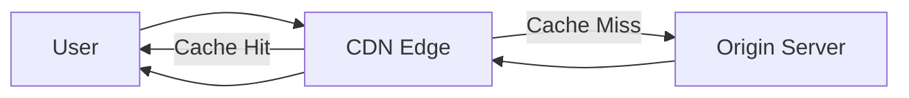
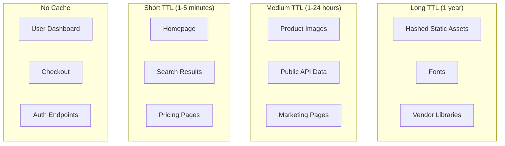
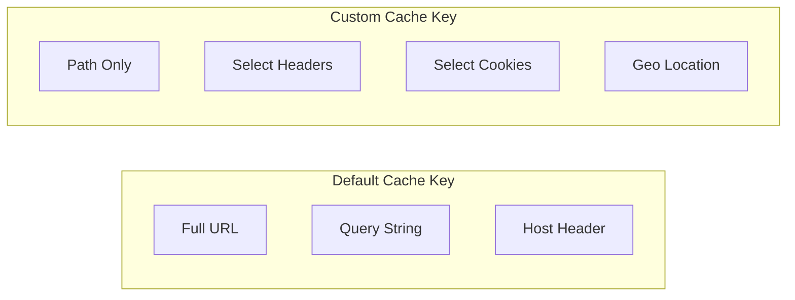
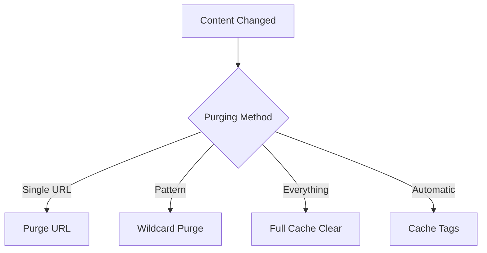
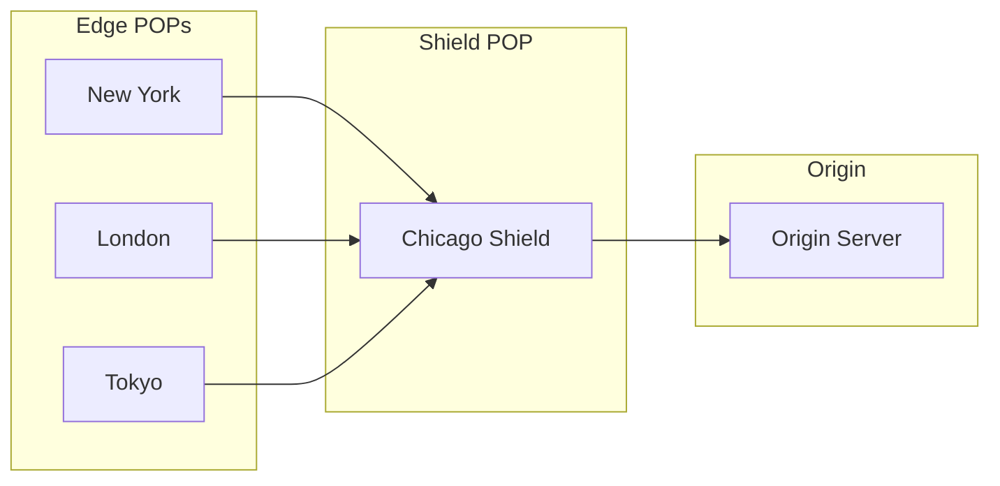
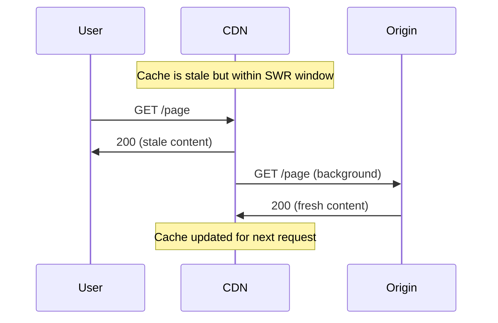

# How to Create CDN Caching Strategies

Author: [nawazdhandala](https://github.com/nawazdhandala)

Tags: CDN, Caching, Performance, Web

Description: A practical guide to designing CDN caching strategies that reduce origin load, improve response times, and keep your content fresh.

---

A CDN without a caching strategy is just an expensive proxy. The difference between a well-tuned CDN and a poorly configured one can mean 50ms responses versus 500ms responses, and your origin getting hammered versus coasting at 5% CPU.

This guide covers the fundamentals of CDN caching: how Cache-Control headers work, TTL strategies for different content types, cache key design, purging mechanisms, and origin shielding.

## How CDN Caching Works

When a user requests content, the CDN edge server checks its cache. If the content exists and is fresh, it returns immediately. If not, the request goes to the origin.



The CDN stores responses based on:
- The request URL
- Cache-Control headers from your origin
- CDN-specific configuration rules

## Cache-Control Headers

Cache-Control is the primary mechanism for telling CDNs (and browsers) how to cache your content.

### Basic Directives

```
Cache-Control: public, max-age=3600
```

| Directive | Meaning |
|-----------|---------|
| `public` | Any cache can store this response |
| `private` | Only browser cache, not CDN |
| `max-age=N` | Fresh for N seconds |
| `s-maxage=N` | CDN-specific max-age (overrides max-age for CDNs) |
| `no-cache` | Must revalidate before using cached copy |
| `no-store` | Never cache this response |
| `stale-while-revalidate=N` | Serve stale for N seconds while fetching fresh |
| `stale-if-error=N` | Serve stale for N seconds if origin errors |

### Header Examples by Content Type

**Static assets (JS, CSS, images with hashed filenames):**

```http
Cache-Control: public, max-age=31536000, immutable
```

One year TTL. The `immutable` directive tells browsers not to revalidate even on reload.

**HTML pages:**

```http
Cache-Control: public, max-age=300, stale-while-revalidate=60
```

5 minutes fresh, serve stale for 60 seconds while fetching a new copy.

**API responses (public data):**

```http
Cache-Control: public, s-maxage=60, max-age=0
```

CDN caches for 60 seconds, browser always revalidates.

**User-specific content:**

```http
Cache-Control: private, no-store
```

Never cache at CDN, don't store in browser.

### Setting Headers in Node.js/Express

```javascript
app.use('/static', express.static('public', {
  maxAge: '1y',
  immutable: true,
  setHeaders: (res, path) => {
    if (path.endsWith('.html')) {
      res.setHeader('Cache-Control', 'public, max-age=300');
    }
  }
}));

app.get('/api/products', (req, res) => {
  res.setHeader('Cache-Control', 'public, s-maxage=60, stale-while-revalidate=30');
  res.json(products);
});
```

### Setting Headers in Nginx

```nginx
location ~* \.(js|css|png|jpg|jpeg|gif|ico|svg|woff2)$ {
    expires 1y;
    add_header Cache-Control "public, immutable";
}

location / {
    add_header Cache-Control "public, max-age=300, stale-while-revalidate=60";
}

location /api/ {
    add_header Cache-Control "public, s-maxage=60, max-age=0";
}
```

## TTL Strategies by Content Type

Different content needs different TTL values. Here's a practical starting point:



### Recommended TTLs

| Content Type | TTL | Rationale |
|-------------|-----|-----------|
| Versioned assets (`app.a1b2c3.js`) | 1 year | Content hash in filename, changes mean new URL |
| Unversioned assets (`logo.png`) | 1 hour | May change without URL change |
| HTML pages | 5 minutes | Balance freshness and performance |
| Public API responses | 30-60 seconds | Reduce origin load while staying current |
| User-specific data | 0 (no-store) | Must always be fresh |
| Error pages | 5 minutes | Cache 404s to prevent origin hammering |

### The Versioned Assets Pattern

The best caching strategy for static assets: include a content hash in the filename.

```
// Before: Risky, might serve stale
/static/app.js

// After: Safe to cache forever
/static/app.a1b2c3d4.js
```

Your build tool (Webpack, Vite, esbuild) generates the hash. When code changes, the hash changes, creating a new URL that bypasses all caches.

```javascript
// webpack.config.js
module.exports = {
  output: {
    filename: '[name].[contenthash].js',
    chunkFilename: '[name].[contenthash].js'
  }
};
```

## Cache Keys

The cache key determines what makes a cached response unique. By default, most CDNs use the full URL including query strings.



### Common Cache Key Configurations

**Ignore query string order:**

```
/products?color=red&size=large
/products?size=large&color=red
```

These should hit the same cache entry. Most CDNs have a setting to normalize query parameter order.

**Ignore tracking parameters:**

```
/page?utm_source=twitter&utm_medium=social
/page
```

Marketing parameters shouldn't create separate cache entries.

**Cloudflare Page Rules example:**

```
URL: example.com/*
Cache Level: Cache Everything
Query String Sort: On
```

**AWS CloudFront behavior:**

```yaml
CacheBehavior:
  PathPattern: "/*"
  CachePolicyId: !Ref CachePolicy

CachePolicy:
  QueryStringsConfig:
    QueryStringBehavior: whitelist
    QueryStrings:
      - page
      - category
```

### Vary Header

The `Vary` header tells caches to create separate entries based on request headers.

```http
Vary: Accept-Encoding
```

This creates separate cache entries for gzip, brotli, and uncompressed responses.

**Warning:** `Vary: *` or `Vary: Cookie` effectively disables caching. Be specific about which headers matter.

```http
# Good: Cache per encoding and language
Vary: Accept-Encoding, Accept-Language

# Bad: Unique cache for every user
Vary: Cookie
```

## Cache Purging

When content changes, you need to invalidate the cached version.

### Purging Methods



**Single URL purge:**

```bash
# Cloudflare
curl -X POST "https://api.cloudflare.com/client/v4/zones/{zone_id}/purge_cache" \
  -H "Authorization: Bearer {token}" \
  -H "Content-Type: application/json" \
  --data '{"files":["https://example.com/page.html"]}'

# Fastly
curl -X PURGE "https://example.com/page.html" \
  -H "Fastly-Key: {token}"
```

**Wildcard/prefix purge:**

```bash
# Cloudflare
curl -X POST "https://api.cloudflare.com/client/v4/zones/{zone_id}/purge_cache" \
  -H "Authorization: Bearer {token}" \
  -H "Content-Type: application/json" \
  --data '{"prefixes":["https://example.com/products/"]}'
```

**Cache tags (surrogate keys):**

The best approach for complex invalidation. Tag responses, then purge by tag.

```http
# Response header
Surrogate-Key: product-123 category-electronics homepage
```

```bash
# Purge all responses tagged with product-123
curl -X POST "https://api.fastly.com/service/{service_id}/purge/product-123" \
  -H "Fastly-Key: {token}"
```

### Automated Purging on Deploy

```yaml
# GitHub Actions example
- name: Deploy
  run: npm run deploy

- name: Purge CDN Cache
  run: |
    curl -X POST "https://api.cloudflare.com/client/v4/zones/${{ secrets.CF_ZONE }}/purge_cache" \
      -H "Authorization: Bearer ${{ secrets.CF_TOKEN }}" \
      -H "Content-Type: application/json" \
      --data '{"purge_everything":true}'
```

### Purging Best Practices

1. **Prefer versioned URLs over purging.** If assets have content hashes, you never need to purge them.
2. **Use cache tags for content relationships.** When a product updates, purge the product tag instead of guessing all affected URLs.
3. **Purge on write, not on read.** Trigger purges from your CMS or API when content changes, not when users request stale content.
4. **Have a manual purge runbook.** When automated purging fails, someone needs to know how to clear the cache manually.

## Origin Shielding

Origin shielding adds a middle cache layer between edge servers and your origin.



### Why Use Origin Shielding

Without shielding, each edge POP requests content from your origin independently. With 100 edge locations and a cache miss, your origin gets 100 requests for the same content.

With shielding, all edge POPs route through a single shield POP. A cache miss results in one origin request, and the shield serves all edges.

**Benefits:**
- Reduces origin load by 70-90%
- Improves cache hit ratio
- Protects origin during traffic spikes
- Reduces origin egress costs

### Configuring Origin Shield

**Cloudflare (Argo Tiered Cache):**

```
Dashboard > Speed > Optimization > Argo Tiered Cache > Enable
```

**AWS CloudFront:**

```yaml
Origins:
  - Id: myOrigin
    DomainName: origin.example.com
    OriginShield:
      Enabled: true
      OriginShieldRegion: us-east-1
```

**Fastly:**

```vcl
sub vcl_recv {
  if (req.backend.is_shield) {
    # Request is at shield, fetch from origin
  } else {
    # Request is at edge, route to shield
    set req.backend = shield_backend;
  }
}
```

### Shield Location Selection

Choose a shield location close to your origin:

| Origin Location | Shield Location |
|-----------------|-----------------|
| US East | Ashburn, VA or New York |
| US West | San Jose or Los Angeles |
| Europe | Frankfurt or Amsterdam |
| Asia | Singapore or Tokyo |

## Stale-While-Revalidate

This directive lets CDNs serve stale content while fetching fresh content in the background.

```http
Cache-Control: public, max-age=60, stale-while-revalidate=300
```

**Timeline:**
- 0-60s: Fresh, serve from cache
- 60-360s: Stale, serve from cache while revalidating
- 360s+: Expired, must wait for origin



This pattern is excellent for content that changes occasionally but doesn't need instant consistency. Users always get fast responses, and the cache stays fresh.

## Monitoring Cache Performance

Track these metrics to understand your caching effectiveness:

### Key Metrics

| Metric | Target | Meaning |
|--------|--------|---------|
| Cache hit ratio | >90% for static, >70% for dynamic | % of requests served from cache |
| Origin requests/sec | As low as possible | Load on your origin |
| Time to first byte (TTFB) | <100ms | How fast users get responses |
| Bandwidth saved | >80% | Egress costs avoided |

### Cloudflare Analytics

```bash
# Get cache analytics via API
curl -X GET "https://api.cloudflare.com/client/v4/zones/{zone_id}/analytics/dashboard" \
  -H "Authorization: Bearer {token}"
```

### Custom Logging

Add cache status to your logs:

```nginx
log_format cdn '$remote_addr - $request - $upstream_cache_status';
```

Cache status values:
- `HIT`: Served from cache
- `MISS`: Fetched from origin
- `STALE`: Served stale content
- `BYPASS`: Cache bypassed (query string, cookie, etc.)
- `EXPIRED`: Cache expired, revalidating

## Common Caching Mistakes

### 1. Caching Authenticated Content

If your CDN sees a session cookie and still caches, you might serve User A's data to User B.

**Fix:** Ensure private routes return `Cache-Control: private, no-store` or configure CDN to bypass cache when auth cookies exist.

### 2. Forgetting to Cache Error Responses

A product page returns 404 because of a database blip. Without caching, every request hammers your origin.

**Fix:** Cache 404s for short periods:

```nginx
location / {
    error_page 404 /404.html;
}

location = /404.html {
    add_header Cache-Control "public, max-age=300";
}
```

### 3. Caching with Vary: Cookie

```http
Vary: Cookie
```

Every unique cookie combination creates a new cache entry. With tracking cookies, this means zero cache hits.

**Fix:** Don't vary on Cookie. Handle personalization at the application layer or use edge compute.

### 4. Not Setting s-maxage Separately

```http
Cache-Control: max-age=3600
```

This caches in both browser and CDN for 1 hour. But you might want the CDN to cache longer while keeping browser caches short.

**Fix:**

```http
Cache-Control: public, max-age=60, s-maxage=3600
```

Browser: 1 minute. CDN: 1 hour.

## Putting It All Together

Here's a complete caching configuration for a typical web application:

### Nginx Configuration

```nginx
# Versioned static assets - cache forever
location ~* \.(js|css)$ {
    if ($uri ~* "\.[a-f0-9]{8,}\.") {
        expires 1y;
        add_header Cache-Control "public, immutable";
    }
}

# Images with fallback
location ~* \.(png|jpg|jpeg|gif|ico|svg|webp)$ {
    expires 1d;
    add_header Cache-Control "public, max-age=86400, stale-while-revalidate=3600";
}

# HTML pages
location ~* \.html$ {
    add_header Cache-Control "public, max-age=300, stale-while-revalidate=60";
}

# API endpoints
location /api/public/ {
    add_header Cache-Control "public, s-maxage=60, max-age=0, stale-while-revalidate=30";
}

location /api/private/ {
    add_header Cache-Control "private, no-store";
}

# Fonts
location ~* \.(woff|woff2|ttf|otf|eot)$ {
    expires 1y;
    add_header Cache-Control "public, immutable";
    add_header Access-Control-Allow-Origin "*";
}
```

### CDN Configuration Checklist

- [ ] Enable origin shielding/tiered caching
- [ ] Configure cache key to ignore marketing query params
- [ ] Set up cache tags for content relationships
- [ ] Create purge automation for deployments
- [ ] Enable stale-while-revalidate
- [ ] Bypass cache for authenticated requests
- [ ] Cache error pages with short TTL
- [ ] Set up cache analytics monitoring

---

A good CDN caching strategy is invisible to users. They get fast responses, your origin stays cool, and your bandwidth bill shrinks. Start with the defaults above, measure your cache hit ratio, and tune from there. The goal is simple: never hit your origin for content that hasn't changed.
