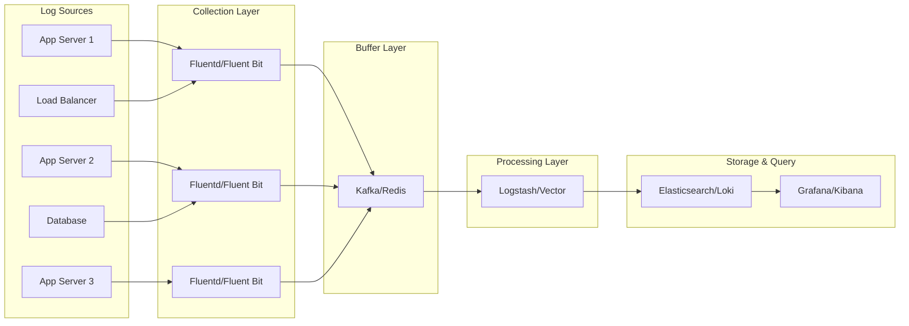
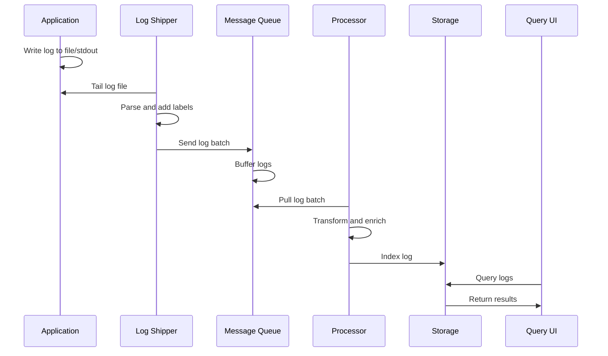
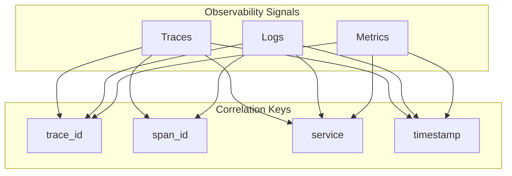

# How to Create Centralized Logging Architecture

Author: [nawazdhandala](https://github.com/nawazdhandala)

Tags: Logging, Architecture, ELK, Loki

Description: Learn to create centralized logging architecture for aggregating logs from all services.

---

When your application runs on a single server, reading logs is straightforward. You SSH in, tail the log file, and find what you need. But the moment you scale to multiple services, containers, or nodes, that approach falls apart. Logs scatter across dozens of machines. Debugging a single request means jumping between terminals, correlating timestamps, and hoping you find the right file before the incident escalates.

Centralized logging solves this by collecting logs from every source into one searchable location. Instead of hunting through servers, you query a single interface. This post walks through the architecture, components, and practical implementation of a centralized logging system.

## Why Centralized Logging Matters

Distributed systems generate logs in many places: application containers, load balancers, databases, message queues, and infrastructure components. Without centralization, you face several problems.

**Context switching kills debugging speed.** When a request touches five services, you need logs from all five. Manually gathering them wastes time during incidents when every minute counts.

**Log retention becomes inconsistent.** Some servers keep logs for days, others for hours. When a customer reports an issue from last week, the logs might already be gone.

**Correlation is nearly impossible.** Matching a user complaint to the exact request across services requires trace IDs or timestamps. Without a unified view, you end up guessing.

**Access control gets fragmented.** Developers need log access, but giving SSH access to production servers creates security risks.

Centralized logging addresses all of these by creating a single source of truth for all log data.

## Architecture Overview

A centralized logging system has four main components: log shippers, a message queue (optional but recommended), a processing layer, and a storage/query layer.

The following diagram shows how these components connect.



Each layer has a specific responsibility.

**Log Shippers** run on each node and forward logs to the central system. They handle file tailing, parsing, and buffering when the network is unavailable.

**Message Queue** decouples producers from consumers. If your processing layer goes down, logs buffer in the queue instead of being lost.

**Processing Layer** transforms, enriches, and routes logs. It parses unstructured logs, adds metadata, filters noise, and sends data to storage.

**Storage and Query Layer** indexes logs for fast searching and provides a UI for exploration.

## Choosing Your Stack

Two popular stacks dominate centralized logging: the ELK stack and the Loki stack.

**ELK Stack** (Elasticsearch, Logstash, Kibana) is the classic choice. Elasticsearch provides full-text search with powerful query capabilities. Logstash handles processing. Kibana offers visualization and exploration.

**Loki Stack** (Promtail, Loki, Grafana) takes a different approach. Instead of indexing log content, Loki indexes only metadata (labels). This reduces storage costs significantly but limits full-text search.

The following comparison helps you choose.

| Factor | ELK | Loki |
|--------|-----|------|
| Search capability | Full-text search | Label-based filtering |
| Storage cost | Higher | Lower |
| Query speed | Fast for text search | Fast for label queries |
| Operational complexity | Higher | Lower |
| Integration | Standalone | Native Grafana integration |

For most teams starting out, Loki offers a simpler path with lower resource requirements. ELK shines when you need advanced text analysis or have complex search patterns.

## Implementation: Loki Stack

Let us build a centralized logging system using the Loki stack. This setup uses Promtail for shipping, Loki for storage, and Grafana for querying.

### Step 1: Deploy Loki

Loki can run as a single binary for small deployments or in microservices mode for scale. Start with the monolithic mode.

Create a Loki configuration file that defines storage backends and retention policies.

```yaml
# loki-config.yaml
# Loki server configuration for centralized logging

auth_enabled: false

server:
  http_listen_port: 3100
  grpc_listen_port: 9096

# Ingester configuration controls how logs are batched and written
ingester:
  wal:
    enabled: true
    dir: /loki/wal
  lifecycler:
    ring:
      kvstore:
        store: inmemory
      replication_factor: 1
  chunk_idle_period: 1h
  max_chunk_age: 1h
  chunk_target_size: 1048576
  chunk_retain_period: 30s

# Schema configuration defines how data is stored over time
schema_config:
  configs:
    - from: 2024-01-01
      store: boltdb-shipper
      object_store: filesystem
      schema: v12
      index:
        prefix: index_
        period: 24h

# Storage configuration points to local filesystem
# For production, use S3, GCS, or Azure Blob Storage
storage_config:
  boltdb_shipper:
    active_index_directory: /loki/boltdb-shipper-active
    cache_location: /loki/boltdb-shipper-cache
    shared_store: filesystem
  filesystem:
    directory: /loki/chunks

# Compactor handles index compaction and retention enforcement
compactor:
  working_directory: /loki/compactor
  shared_store: filesystem
  retention_enabled: true
  retention_delete_delay: 2h

# Retention policy: keep logs for 30 days
limits_config:
  retention_period: 720h
  ingestion_rate_mb: 16
  ingestion_burst_size_mb: 32
  max_streams_per_user: 10000
```

Deploy Loki using Docker with the configuration mounted.

```bash
# Run Loki container with persistent storage
# The data directory stores all log chunks and indexes

docker run -d \
  --name loki \
  -p 3100:3100 \
  -v /path/to/loki-config.yaml:/etc/loki/config.yaml \
  -v /path/to/loki-data:/loki \
  grafana/loki:2.9.0 \
  -config.file=/etc/loki/config.yaml
```

### Step 2: Configure Promtail

Promtail runs on each node and ships logs to Loki. It tails log files, parses them, and adds labels for filtering.

Create a Promtail configuration that watches your application logs.

```yaml
# promtail-config.yaml
# Promtail ships logs from this node to Loki

server:
  http_listen_port: 9080
  grpc_listen_port: 0

# Position file tracks which log lines have been sent
# This enables resume after restarts
positions:
  filename: /tmp/positions.yaml

# Loki endpoint for pushing logs
clients:
  - url: http://loki:3100/loki/api/v1/push
    batchwait: 1s
    batchsize: 1048576

scrape_configs:
  # Scrape application logs
  - job_name: application
    static_configs:
      - targets:
          - localhost
        labels:
          job: myapp
          env: production
          __path__: /var/log/myapp/*.log

    # Pipeline stages parse and transform logs
    pipeline_stages:
      # Parse JSON logs and extract fields
      - json:
          expressions:
            level: level
            message: message
            trace_id: trace_id
            service: service

      # Add extracted fields as labels for filtering
      - labels:
          level:
          service:

      # Add trace_id to log line for correlation
      - output:
          source: message

  # Scrape nginx access logs
  - job_name: nginx
    static_configs:
      - targets:
          - localhost
        labels:
          job: nginx
          env: production
          __path__: /var/log/nginx/access.log

    pipeline_stages:
      # Parse nginx combined log format using regex
      - regex:
          expression: '^(?P<ip>\S+) - (?P<user>\S+) \[(?P<timestamp>[^\]]+)\] "(?P<method>\S+) (?P<path>\S+) (?P<protocol>\S+)" (?P<status>\d+) (?P<size>\d+)'

      - labels:
          method:
          status:
```

Run Promtail on each application server.

```bash
# Run Promtail container
# Mount log directories and configuration

docker run -d \
  --name promtail \
  -v /path/to/promtail-config.yaml:/etc/promtail/config.yaml \
  -v /var/log:/var/log:ro \
  grafana/promtail:2.9.0 \
  -config.file=/etc/promtail/config.yaml
```

### Step 3: Set Up Grafana

Grafana provides the query interface for exploring logs. Add Loki as a data source.

```yaml
# grafana-datasources.yaml
# Provisioned data source for Loki

apiVersion: 1

datasources:
  - name: Loki
    type: loki
    access: proxy
    url: http://loki:3100
    isDefault: true
    jsonData:
      maxLines: 1000
      derivedFields:
        # Link trace IDs to your tracing system
        - datasourceUid: tempo
          matcherRegex: "trace_id=(\\w+)"
          name: TraceID
          url: "$${__value.raw}"
```

## Implementation: ELK Stack

For teams needing full-text search, the ELK stack remains a solid choice. Here is a production configuration.

### Elasticsearch Configuration

Create an Elasticsearch cluster configuration with proper memory and storage settings.

```yaml
# elasticsearch.yml
# Elasticsearch node configuration

cluster.name: logging-cluster
node.name: es-node-1

# Network settings
network.host: 0.0.0.0
http.port: 9200

# Discovery settings for cluster formation
discovery.type: single-node

# Path configuration
path.data: /var/lib/elasticsearch
path.logs: /var/log/elasticsearch

# Memory settings: disable swapping
bootstrap.memory_lock: true

# Index lifecycle management
xpack.ilm.enabled: true
```

### Logstash Pipeline

Logstash transforms and routes logs. Create a pipeline that parses different log formats.

```ruby
# logstash.conf
# Pipeline for processing application logs

input {
  # Receive logs from Filebeat or Fluentd
  beats {
    port => 5044
  }
}

filter {
  # Parse JSON logs from applications
  if [fields][type] == "application" {
    json {
      source => "message"
      target => "parsed"
    }

    # Extract timestamp from log
    date {
      match => ["[parsed][timestamp]", "ISO8601"]
      target => "@timestamp"
    }

    # Add fields for filtering
    mutate {
      add_field => {
        "service" => "%{[parsed][service]}"
        "level" => "%{[parsed][level]}"
        "trace_id" => "%{[parsed][trace_id]}"
      }
    }
  }

  # Parse nginx logs using grok
  if [fields][type] == "nginx" {
    grok {
      match => {
        "message" => '%{IPORHOST:client_ip} - %{USER:user} \[%{HTTPDATE:timestamp}\] "%{WORD:method} %{URIPATHPARAM:request} HTTP/%{NUMBER:http_version}" %{NUMBER:status} %{NUMBER:bytes}'
      }
    }

    date {
      match => ["timestamp", "dd/MMM/yyyy:HH:mm:ss Z"]
      target => "@timestamp"
    }
  }

  # Drop debug logs in production to save storage
  if [level] == "debug" and [environment] == "production" {
    drop {}
  }
}

output {
  elasticsearch {
    hosts => ["http://elasticsearch:9200"]
    index => "logs-%{[service]}-%{+YYYY.MM.dd}"

    # Index lifecycle management for retention
    ilm_enabled => true
    ilm_rollover_alias => "logs"
    ilm_pattern => "{now/d}-000001"
    ilm_policy => "logs-policy"
  }
}
```

## Log Processing Flow

Understanding how logs flow through the system helps with debugging and optimization. The following diagram shows the journey of a single log line.



## Best Practices

Building a centralized logging system is one thing. Running it reliably requires attention to several practices.

**Structure your logs from the start.** JSON logs with consistent fields are easier to parse and query than free-form text. Include timestamp, level, service name, and trace ID in every log line.

```javascript
// Good: Structured JSON log
// Easy to parse, filter, and correlate
logger.info({
  timestamp: new Date().toISOString(),
  level: "info",
  service: "payment-api",
  trace_id: context.traceId,
  message: "Payment processed",
  amount: 99.99,
  currency: "USD",
  customer_id: "cust_123"
});

// Avoid: Unstructured text log
// Hard to parse, impossible to filter by fields
logger.info(`Payment of $99.99 USD processed for customer cust_123`);
```

**Set retention policies based on value.** Not all logs deserve indefinite retention. Error logs might need 90 days, debug logs 7 days. Use index lifecycle management to automate cleanup.

**Monitor your logging pipeline.** The logging system itself needs monitoring. Track ingestion lag, storage growth, and query latency. Alert when the pipeline falls behind.

**Plan for failure.** What happens when Elasticsearch is down? Log shippers should buffer locally. What if a node fills its disk? Set up alerts before it happens.

**Control log volume at the source.** It is cheaper to not generate logs than to filter them later. Use appropriate log levels. Avoid logging in tight loops.

## Connecting Logs to Traces and Metrics

Logs become more powerful when connected to traces and metrics. Include trace IDs in every log line so you can jump from a log entry to the full request trace.



When an alert fires based on metrics, you should be able to find the related logs and traces within seconds. This correlation turns your logging system from a passive archive into an active debugging tool.

## Scaling Considerations

As log volume grows, you will need to scale the system. Here are the typical bottlenecks and solutions.

**Ingestion bottleneck:** Add more processing nodes (Logstash/Vector instances). Use a message queue to buffer spikes.

**Storage bottleneck:** For Elasticsearch, add data nodes. For Loki, move to object storage (S3/GCS) which scales well.

**Query bottleneck:** Add read replicas. Use time-based indices so queries scan less data.

**Network bottleneck:** Compress logs in transit. Sample verbose logs at the source.

## Summary

Centralized logging transforms debugging from a scavenger hunt into a structured investigation. By collecting logs from all services into one searchable location, you reduce incident response time and gain visibility into system behavior.

The key components are log shippers (Promtail, Fluentd), optional buffering (Kafka), processing (Logstash, Vector), and storage with query capabilities (Loki, Elasticsearch).

Start simple with a single-node setup, structure your logs as JSON from day one, and add correlation IDs to connect logs with traces. As you scale, the architecture can grow with you.

If you are looking for an integrated solution that combines logs, metrics, traces, and incident management, check out OneUptime. It provides centralized observability without the operational overhead of managing separate systems.

---

**Related Reading:**

- [Logs, Metrics & Traces: Turning Three Noisy Streams into One Story](https://oneuptime.com/blog/post/2025-08-20-three-pillars-of-observability-logs-metrics-traces/view)
- [How to Structure Logs Properly in OpenTelemetry](https://oneuptime.com/blog/post/2025-08-28-how-to-structure-logs-properly-in-opentelemetry/view)
- [What is OpenTelemetry Collector and Why Use One](https://oneuptime.com/blog/post/2025-09-18-what-is-opentelemetry-collector-and-why-use-one/view)
