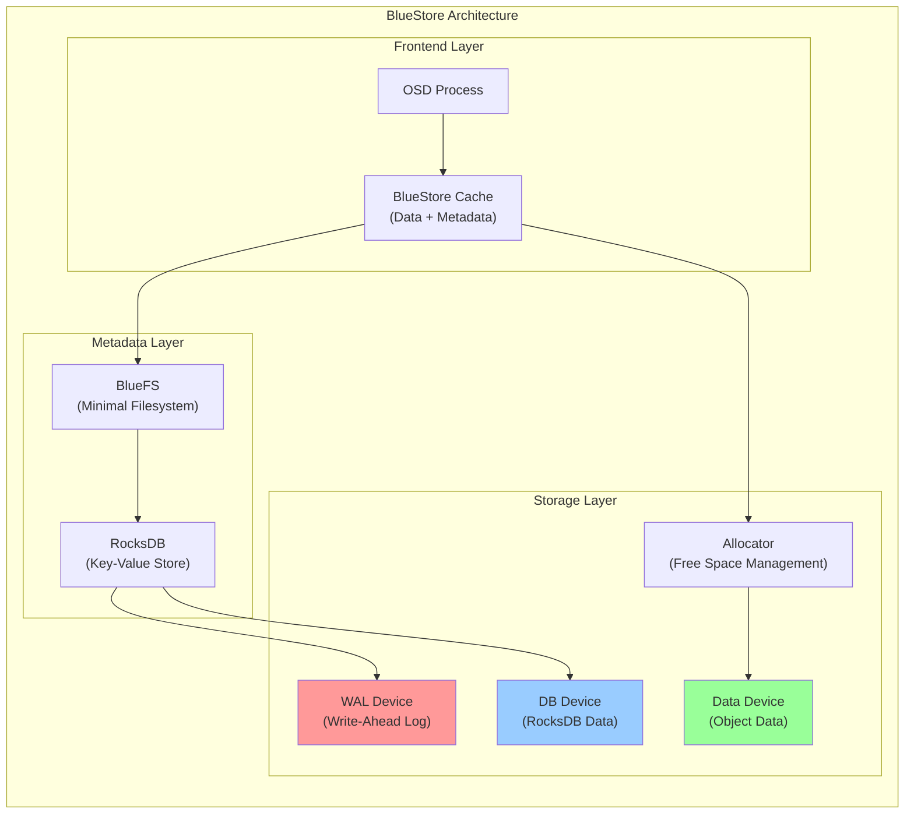
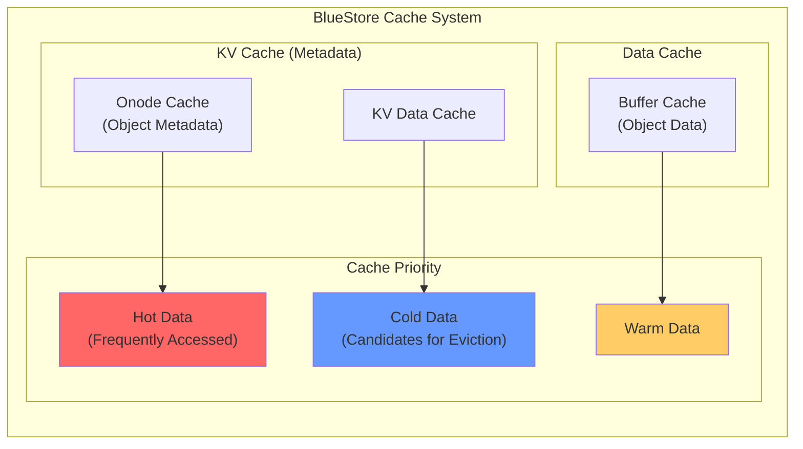
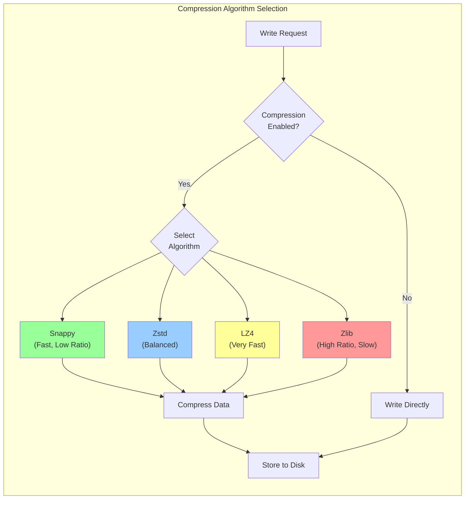

# How to Create Ceph BlueStore Optimization

Author: [nawazdhandala](https://github.com/nawazdhandala)

Tags: Ceph, Storage, BlueStore, Performance

Description: A comprehensive guide to optimizing Ceph BlueStore for maximum storage performance through DB/WAL placement, cache tuning, and compression settings.

---

## Introduction

BlueStore is Ceph's default storage backend since the Luminous release, replacing the older FileStore. It provides significant performance improvements by writing data directly to raw block devices, eliminating the double-write penalty that plagued FileStore. This guide covers essential optimization techniques to get the most out of your BlueStore deployment.

## BlueStore Architecture Overview

BlueStore consists of several key components that work together to provide efficient object storage:

- **BlockDevice**: The raw block device where actual object data is stored
- **BlueFS**: A minimal filesystem used to store RocksDB files
- **RocksDB**: Stores object metadata, allocation information, and other key-value data
- **Allocator**: Manages free space on the block device
- **Cache**: In-memory caching layer for frequently accessed data and metadata



## DB and WAL Placement Optimization

One of the most impactful optimizations is placing the RocksDB database (DB) and Write-Ahead Log (WAL) on faster storage devices, typically NVMe SSDs, while keeping bulk data on HDDs.

### Understanding DB and WAL

- **WAL (Write-Ahead Log)**: Records all write operations before they are applied. This is the most write-intensive component and benefits greatly from fast storage.
- **DB**: Contains object metadata and allocation tables. Read-heavy workloads benefit from fast DB storage.

### Sizing Guidelines

```bash
# WAL sizing: 1-2 GB per OSD is typically sufficient
# DB sizing: 1-4% of the data device capacity

# Example for a 4TB HDD data device:
# WAL: 2 GB
# DB: 40-160 GB (1-4% of 4TB)
```

### Creating an OSD with Separate DB and WAL

```bash
# Create an OSD with dedicated DB and WAL devices
# --data: Primary data device (HDD)
# --block-db: Database device (NVMe SSD partition)
# --block-wal: Write-ahead log device (NVMe SSD partition)

ceph-volume lvm create \
    --data /dev/sda \
    --block-db /dev/nvme0n1p1 \
    --block-wal /dev/nvme0n1p2

# Verify the OSD configuration
ceph-volume lvm list
```

### Partitioning NVMe for Multiple OSDs

```bash
# Create partitions on NVMe for 4 HDDs
# Each HDD OSD gets a DB and WAL partition

# Create GPT partition table
parted /dev/nvme0n1 mklabel gpt

# Create WAL partitions (2GB each)
parted /dev/nvme0n1 mkpart wal1 1MiB 2049MiB
parted /dev/nvme0n1 mkpart wal2 2049MiB 4097MiB
parted /dev/nvme0n1 mkpart wal3 4097MiB 6145MiB
parted /dev/nvme0n1 mkpart wal4 6145MiB 8193MiB

# Create DB partitions (remaining space divided by 4)
parted /dev/nvme0n1 mkpart db1 8193MiB 108193MiB
parted /dev/nvme0n1 mkpart db2 108193MiB 208193MiB
parted /dev/nvme0n1 mkpart db3 208193MiB 308193MiB
parted /dev/nvme0n1 mkpart db4 308193MiB 408193MiB
```

## Cache Configuration Tuning

BlueStore uses an in-memory cache to reduce disk I/O. Proper cache sizing is critical for performance.

### Cache Architecture



### Cache Configuration Options

```bash
# Set cache size per OSD
# For HDD-backed OSDs: 1-4 GB recommended
# For SSD/NVMe-backed OSDs: 4-8 GB recommended

# Total cache memory allocation
ceph config set osd bluestore_cache_size_hdd 1073741824      # 1 GB for HDD
ceph config set osd bluestore_cache_size_ssd 4294967296      # 4 GB for SSD

# Cache ratio configuration
# These ratios determine how cache is split between data and metadata

# For metadata-heavy workloads (many small objects):
ceph config set osd bluestore_cache_meta_ratio 0.5           # 50% for metadata
ceph config set osd bluestore_cache_kv_ratio 0.3             # 30% for key-value
# Remaining 20% goes to data cache

# For data-heavy workloads (large objects, streaming):
ceph config set osd bluestore_cache_meta_ratio 0.3           # 30% for metadata
ceph config set osd bluestore_cache_kv_ratio 0.2             # 20% for key-value
# Remaining 50% goes to data cache
```

### Autotune Configuration

```bash
# Enable cache autotuning (recommended for mixed workloads)
ceph config set osd bluestore_cache_autotune true

# Set target memory for the OSD process
# This includes cache plus other OSD memory usage
ceph config set osd osd_memory_target 4294967296             # 4 GB total

# Set cache minimum size during autotune
ceph config set osd bluestore_cache_autotune_chunk_size 33554432  # 32 MB

# Verify current cache settings
ceph config show osd.0 | grep bluestore_cache
```

## Compression Settings

BlueStore supports inline compression, which can significantly reduce storage usage at the cost of CPU cycles.

### Compression Algorithms



### Configuring Compression

```bash
# Enable compression for a pool
# Mode options: none, passive, aggressive, force
# - none: No compression
# - passive: Compress if client hints compressible
# - aggressive: Compress unless client hints incompressible
# - force: Always compress

ceph osd pool set mypool compression_mode aggressive

# Set compression algorithm
# Options: snappy, zstd, lz4, zlib
ceph osd pool set mypool compression_algorithm zstd

# Set minimum blob size for compression
# Objects smaller than this will not be compressed
ceph osd pool set mypool compression_min_blob_size 131072    # 128 KB

# Set maximum blob size for compression
# Objects larger than this will be split before compression
ceph osd pool set mypool compression_max_blob_size 524288    # 512 KB

# Set compression ratio threshold
# Only keep compressed version if ratio is below this value
ceph osd pool set mypool compression_required_ratio 0.875    # 87.5%
```

### Global Compression Defaults

```bash
# Set global defaults for all new pools
ceph config set global bluestore_compression_mode aggressive
ceph config set global bluestore_compression_algorithm zstd
ceph config set global bluestore_compression_min_blob_size 131072
ceph config set global bluestore_compression_max_blob_size 524288

# Monitor compression statistics
ceph osd pool stats mypool

# Check compression savings per pool
ceph df detail
```

## Advanced Performance Tuning

### Allocation Hints

```bash
# Configure allocation size for sequential workloads
ceph config set osd bluestore_min_alloc_size_hdd 65536       # 64 KB for HDD
ceph config set osd bluestore_min_alloc_size_ssd 4096        # 4 KB for SSD

# For large sequential writes (video streaming, backups)
ceph config set osd bluestore_prefer_deferred_size_hdd 65536
ceph config set osd bluestore_prefer_deferred_size_ssd 0
```

### RocksDB Tuning

```bash
# Increase RocksDB memory allocation
ceph config set osd bluestore_rocksdb_options "compression=kNoCompression,\
max_write_buffer_number=4,\
min_write_buffer_number_to_merge=1,\
recycle_log_file_num=4,\
write_buffer_size=268435456,\
writable_file_max_buffer_size=0,\
compaction_readahead_size=2097152,\
max_background_compactions=4,\
max_background_flushes=4"

# Verify RocksDB settings
ceph config show osd.0 | grep rocksdb
```

### OSD Thread Tuning

```bash
# Increase OSD operation threads for high-throughput workloads
ceph config set osd osd_op_num_threads_per_shard 2
ceph config set osd osd_op_num_shards 8

# Adjust recovery and backfill settings to reduce impact on client I/O
ceph config set osd osd_recovery_max_active 3
ceph config set osd osd_max_backfills 1
ceph config set osd osd_recovery_sleep 0.1

# Configure async messenger threads
ceph config set osd ms_async_op_threads 5
```

## Monitoring and Verification

### Checking BlueStore Performance

```bash
# View BlueStore statistics for a specific OSD
ceph daemon osd.0 perf dump bluestore

# Monitor cache hit ratios
ceph daemon osd.0 perf dump bluestore | grep cache

# Check compression statistics
ceph daemon osd.0 perf dump bluestore | grep compress

# View current BlueStore configuration
ceph daemon osd.0 config show | grep bluestore
```

### Key Metrics to Monitor

```bash
# Use the following to check critical BlueStore metrics:

# 1. Cache effectiveness
ceph daemon osd.0 perf dump bluestore | jq '.bluestore | {
    "cache_hit_ratio": ((.bluestore_cache_hit / (.bluestore_cache_hit + .bluestore_cache_miss)) * 100),
    "onode_hits": .bluestore_onode_hits,
    "onode_misses": .bluestore_onode_misses
}'

# 2. Write amplification
ceph daemon osd.0 perf dump bluestore | jq '.bluestore | {
    "bytes_written": .bluestore_write_bytes,
    "bytes_written_wal": .bluestore_wal_write_bytes
}'

# 3. Latency statistics
ceph daemon osd.0 perf dump bluestore | jq '.bluestore | {
    "commit_latency_avg": .bluestore_commit_lat.avgtime,
    "kv_sync_latency_avg": .bluestore_kv_sync_lat.avgtime
}'
```

## Best Practices Summary

1. **Separate DB and WAL**: Place on NVMe SSDs for HDD-backed OSDs
2. **Size DB appropriately**: 1-4% of data device capacity
3. **Tune cache size**: 1-4 GB for HDD, 4-8 GB for SSD per OSD
4. **Enable compression**: Use zstd for balanced performance and ratio
5. **Monitor metrics**: Track cache hit ratios and latencies regularly
6. **Adjust allocation sizes**: Match your workload pattern (sequential vs random)

## Conclusion

BlueStore optimization requires understanding your workload characteristics and carefully tuning multiple parameters. Start with DB/WAL separation for the most significant gains, then move on to cache and compression tuning. Always monitor performance metrics before and after changes to validate improvements.
