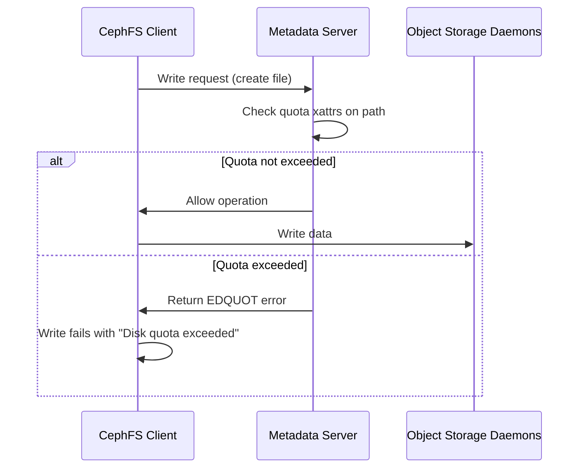
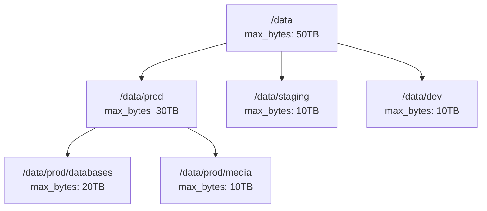

# How to Create CephFS Quotas: A Complete Guide

Author: [nawazdhandala](https://github.com/nawazdhandala)

Tags: Ceph, CephFS, Quotas, Storage

Description: Learn how to implement and manage CephFS quotas to control storage consumption in your Ceph cluster. This guide covers directory-level quotas, file count limits, monitoring strategies, and best practices for multi-tenant environments.

---

Storage sprawl is the silent killer of distributed filesystems. One runaway application or misconfigured logging pipeline can consume terabytes overnight, starving critical workloads. CephFS quotas give you granular control over storage consumption at the directory level, letting you enforce limits before capacity emergencies happen.

## What Are CephFS Quotas?

CephFS quotas are soft limits applied to directories (not users) that restrict either the total bytes stored or the number of files created beneath that path. Unlike traditional filesystem quotas that operate at the user or group level, CephFS quotas work on directory trees, making them ideal for multi-tenant Kubernetes clusters, shared research environments, and any scenario where you need to carve up a single filesystem into bounded namespaces.

```mermaid
flowchart TD
    A[CephFS Root /] --> B[/home]
    A --> C[/projects]
    A --> D[/scratch]
    B --> E[/home/team-alpha<br/>max_bytes: 500GB]
    B --> F[/home/team-beta<br/>max_bytes: 1TB]
    C --> G[/projects/ml-training<br/>max_files: 10M<br/>max_bytes: 5TB]
    C --> H[/projects/analytics<br/>max_bytes: 2TB]
    D --> I[/scratch/temp<br/>max_bytes: 100GB]
```

## Prerequisites

Before setting quotas, ensure your environment meets these requirements:

- A running Ceph cluster with CephFS deployed (Luminous or later recommended)
- A mounted CephFS filesystem on your client
- Root or sudo access on the client machine
- The `ceph` CLI tools installed

Verify your CephFS mount:

```bash
# Check if CephFS is mounted
df -h | grep ceph

# Example output:
# 192.168.1.10:6789:/   50T   12T   38T  24% /mnt/cephfs
```

## Setting Quotas with Extended Attributes

CephFS quotas are controlled through extended attributes (xattrs). There are two quota types:

| Attribute | Purpose | Value |
| --- | --- | --- |
| `ceph.quota.max_bytes` | Maximum bytes allowed in directory tree | Integer (bytes) or 0 to remove |
| `ceph.quota.max_files` | Maximum file count in directory tree | Integer or 0 to remove |

### Setting a Bytes Quota

Limit a directory to 100 GB:

```bash
# Set a 100 GB quota on the team-alpha directory
setfattr -n ceph.quota.max_bytes -v 107374182400 /mnt/cephfs/home/team-alpha

# Verify the quota was set
getfattr -n ceph.quota.max_bytes /mnt/cephfs/home/team-alpha
# Output: ceph.quota.max_bytes="107374182400"
```

The value must be in bytes. Here are common conversions:

```bash
# Helper function to convert human-readable sizes to bytes
quota_bytes() {
    local size=$1
    case ${size: -1} in
        G|g) echo $(( ${size%?} * 1024 * 1024 * 1024 )) ;;
        T|t) echo $(( ${size%?} * 1024 * 1024 * 1024 * 1024 )) ;;
        M|m) echo $(( ${size%?} * 1024 * 1024 )) ;;
        *) echo $size ;;
    esac
}

# Usage: Set a 500 GB quota
setfattr -n ceph.quota.max_bytes -v $(quota_bytes 500G) /mnt/cephfs/projects/analytics
```

### Setting a File Count Quota

Limit a directory to 1 million files:

```bash
# Set a file count quota
setfattr -n ceph.quota.max_files -v 1000000 /mnt/cephfs/scratch/temp

# Verify
getfattr -n ceph.quota.max_files /mnt/cephfs/scratch/temp
# Output: ceph.quota.max_files="1000000"
```

File count quotas are critical for preventing inode exhaustion. A directory with millions of tiny files can overwhelm MDS (Metadata Server) resources even if the total bytes consumed are modest.

### Combining Both Quotas

You can apply both limits simultaneously:

```bash
# Set both quotas on an ML training directory
setfattr -n ceph.quota.max_bytes -v 5497558138880 /mnt/cephfs/projects/ml-training  # 5 TB
setfattr -n ceph.quota.max_files -v 10000000 /mnt/cephfs/projects/ml-training       # 10 million files

# Verify both
getfattr -d -m ceph.quota /mnt/cephfs/projects/ml-training
```

## Removing Quotas

Set the quota value to 0 to remove a limit:

```bash
# Remove bytes quota
setfattr -n ceph.quota.max_bytes -v 0 /mnt/cephfs/home/team-alpha

# Remove files quota
setfattr -n ceph.quota.max_files -v 0 /mnt/cephfs/scratch/temp
```

## How Quota Enforcement Works

Understanding the enforcement model helps you set appropriate limits:



Key behaviors to understand:

1. **Soft enforcement**: Quotas are checked periodically, not on every byte written. A fast writer can briefly exceed the limit before enforcement kicks in.

2. **Inheritance**: Quotas apply to the entire directory tree beneath the quota point. Subdirectories do not need their own quotas unless you want tighter limits.

3. **No user/group mapping**: Quotas are purely path-based. If you need per-user limits, create per-user directories with individual quotas.

4. **Client caching**: Quota statistics are cached on the client. The `ceph.quota.max_bytes` check uses cached recursive directory stats, which may lag slightly behind reality.

## Monitoring Quota Usage

### Check Current Usage via CLI

Use `getfattr` to read the current recursive bytes and file counts:

```bash
# Get current bytes used (recursive)
getfattr -n ceph.dir.rbytes /mnt/cephfs/home/team-alpha
# Output: ceph.dir.rbytes="53687091200"  (50 GB used)

# Get current file count (recursive)
getfattr -n ceph.dir.rfiles /mnt/cephfs/home/team-alpha
# Output: ceph.dir.rfiles="142857"

# Get subdirectory count
getfattr -n ceph.dir.rsubdirs /mnt/cephfs/home/team-alpha
```

### Build a Quota Report Script

Create a script to generate quota reports across all managed directories:

```bash
#!/bin/bash
# quota-report.sh - Generate CephFS quota usage report

CEPHFS_MOUNT="/mnt/cephfs"
QUOTA_DIRS=(
    "home/team-alpha"
    "home/team-beta"
    "projects/ml-training"
    "projects/analytics"
    "scratch/temp"
)

printf "%-40s %15s %15s %10s\n" "Directory" "Used" "Quota" "Percent"
printf "%s\n" "--------------------------------------------------------------------------------"

for dir in "${QUOTA_DIRS[@]}"; do
    full_path="${CEPHFS_MOUNT}/${dir}"

    if [[ -d "$full_path" ]]; then
        # Get quota limit
        max_bytes=$(getfattr -n ceph.quota.max_bytes --only-values "$full_path" 2>/dev/null || echo "0")

        # Get current usage
        rbytes=$(getfattr -n ceph.dir.rbytes --only-values "$full_path" 2>/dev/null || echo "0")

        if [[ "$max_bytes" -gt 0 ]]; then
            percent=$(( rbytes * 100 / max_bytes ))
            used_hr=$(numfmt --to=iec-i --suffix=B "$rbytes")
            quota_hr=$(numfmt --to=iec-i --suffix=B "$max_bytes")
            printf "%-40s %15s %15s %9d%%\n" "$dir" "$used_hr" "$quota_hr" "$percent"
        else
            used_hr=$(numfmt --to=iec-i --suffix=B "$rbytes")
            printf "%-40s %15s %15s %10s\n" "$dir" "$used_hr" "unlimited" "N/A"
        fi
    fi
done
```

Sample output:

```
Directory                                           Used           Quota    Percent
--------------------------------------------------------------------------------
home/team-alpha                                   50GiB         100GiB        50%
home/team-beta                                   750GiB           1TiB        73%
projects/ml-training                             3.2TiB           5TiB        64%
projects/analytics                               1.8TiB           2TiB        90%
scratch/temp                                      45GiB         100GiB        45%
```

### Export Metrics to Prometheus

For production monitoring, export quota metrics to Prometheus:

```python
#!/usr/bin/env python3
# cephfs_quota_exporter.py

import os
import subprocess
from prometheus_client import Gauge, start_http_server
import time

QUOTA_BYTES_USED = Gauge('cephfs_quota_bytes_used', 'Current bytes used', ['path'])
QUOTA_BYTES_LIMIT = Gauge('cephfs_quota_bytes_limit', 'Quota limit in bytes', ['path'])
QUOTA_FILES_USED = Gauge('cephfs_quota_files_used', 'Current file count', ['path'])
QUOTA_FILES_LIMIT = Gauge('cephfs_quota_files_limit', 'File count limit', ['path'])
QUOTA_USAGE_RATIO = Gauge('cephfs_quota_usage_ratio', 'Usage as ratio of limit', ['path'])

CEPHFS_MOUNT = '/mnt/cephfs'
QUOTA_DIRS = [
    'home/team-alpha',
    'home/team-beta',
    'projects/ml-training',
    'projects/analytics',
]

def get_xattr(path, attr):
    try:
        result = subprocess.run(
            ['getfattr', '-n', attr, '--only-values', path],
            capture_output=True, text=True, check=True
        )
        return int(result.stdout.strip())
    except (subprocess.CalledProcessError, ValueError):
        return 0

def collect_metrics():
    for dir_path in QUOTA_DIRS:
        full_path = os.path.join(CEPHFS_MOUNT, dir_path)
        if not os.path.isdir(full_path):
            continue

        bytes_used = get_xattr(full_path, 'ceph.dir.rbytes')
        bytes_limit = get_xattr(full_path, 'ceph.quota.max_bytes')
        files_used = get_xattr(full_path, 'ceph.dir.rfiles')
        files_limit = get_xattr(full_path, 'ceph.quota.max_files')

        QUOTA_BYTES_USED.labels(path=dir_path).set(bytes_used)
        QUOTA_BYTES_LIMIT.labels(path=dir_path).set(bytes_limit)
        QUOTA_FILES_USED.labels(path=dir_path).set(files_used)
        QUOTA_FILES_LIMIT.labels(path=dir_path).set(files_limit)

        if bytes_limit > 0:
            ratio = bytes_used / bytes_limit
            QUOTA_USAGE_RATIO.labels(path=dir_path).set(ratio)

if __name__ == '__main__':
    start_http_server(9123)
    while True:
        collect_metrics()
        time.sleep(60)
```

## Quotas in Kubernetes with Rook-Ceph

If you manage CephFS through Rook, you can set quotas using a combination of CephFilesystemSubVolumeGroup CRDs and manual xattr configuration.

### Option 1: Set Quotas on PVC Mount Points

After a PVC is created and bound, set quotas from a privileged pod or node:

```yaml
# quota-setter-job.yaml
apiVersion: batch/v1
kind: Job
metadata:
  name: set-cephfs-quota
  namespace: rook-ceph
spec:
  template:
    spec:
      containers:
      - name: quota-setter
        image: quay.io/ceph/ceph:v18
        command:
        - /bin/bash
        - -c
        - |
          # Mount the CephFS admin filesystem
          mkdir -p /mnt/cephfs
          mount -t ceph mon1:6789:/ /mnt/cephfs -o name=admin,secret=$(cat /etc/ceph/admin.secret)

          # Set quota on the target subvolume
          setfattr -n ceph.quota.max_bytes -v 107374182400 /mnt/cephfs/volumes/csi/pvc-xxxxx

          echo "Quota set successfully"
        volumeMounts:
        - name: ceph-admin-secret
          mountPath: /etc/ceph
      volumes:
      - name: ceph-admin-secret
        secret:
          secretName: rook-ceph-admin-keyring
      restartPolicy: Never
```

### Option 2: Use CephFS SubVolumeGroups with Quotas

Rook supports SubVolumeGroups that can have quotas applied:

```yaml
# cephfs-subvolumegroup.yaml
apiVersion: ceph.rook.io/v1
kind: CephFilesystemSubVolumeGroup
metadata:
  name: team-alpha-group
  namespace: rook-ceph
spec:
  filesystemName: myfs
  name: team-alpha
  # Quotas are set via the data pool quota, not directly here
  # You will need to set xattrs after creation
```

After the SubVolumeGroup is created, apply quotas:

```bash
# From a Rook toolbox pod
kubectl exec -it deploy/rook-ceph-tools -n rook-ceph -- bash

# Set quota on the subvolume group path
setfattr -n ceph.quota.max_bytes -v 1099511627776 /mnt/myfs/volumes/team-alpha  # 1 TB
```

## Best Practices

### 1. Start with Generous Limits, Then Tighten

Begin with quotas well above current usage to avoid disrupting existing workloads:

```bash
# Check current usage first
current=$(getfattr -n ceph.dir.rbytes --only-values /mnt/cephfs/projects/analytics)
echo "Current usage: $current bytes"

# Set quota at 150% of current usage initially
quota=$(( current * 3 / 2 ))
setfattr -n ceph.quota.max_bytes -v $quota /mnt/cephfs/projects/analytics
```

### 2. Set Both Bytes and Files Quotas

A directory with small files can exhaust MDS resources before hitting byte limits:

```bash
# For a typical application directory: generous bytes, moderate files
setfattr -n ceph.quota.max_bytes -v $(quota_bytes 1T) /mnt/cephfs/app-data
setfattr -n ceph.quota.max_files -v 5000000 /mnt/cephfs/app-data
```

### 3. Create a Quota Hierarchy



Parent quotas act as hard ceilings. Even if child directories have higher individual limits, the parent quota prevents the sum from exceeding the top-level allocation.

### 4. Alert Before Limits Are Hit

Set alerts at 80% and 95% thresholds:

```yaml
# prometheus-alert-rules.yaml
groups:
- name: cephfs-quotas
  rules:
  - alert: CephFSQuotaWarning
    expr: cephfs_quota_usage_ratio > 0.8
    for: 5m
    labels:
      severity: warning
    annotations:
      summary: "CephFS quota usage above 80%"
      description: "Directory {{ $labels.path }} is at {{ $value | humanizePercentage }} of quota"

  - alert: CephFSQuotaCritical
    expr: cephfs_quota_usage_ratio > 0.95
    for: 5m
    labels:
      severity: critical
    annotations:
      summary: "CephFS quota nearly exhausted"
      description: "Directory {{ $labels.path }} is at {{ $value | humanizePercentage }} of quota"
```

### 5. Document Quota Policies

Maintain a YAML manifest of your quota allocations:

```yaml
# quota-manifest.yaml
cephfs_quotas:
  - path: /home/team-alpha
    max_bytes: 100G
    max_files: 500000
    owner: team-alpha@company.com
    review_date: 2026-04-01

  - path: /projects/ml-training
    max_bytes: 5T
    max_files: 10000000
    owner: ml-team@company.com
    review_date: 2026-06-01
    notes: "High file count for checkpoint storage"
```

## Troubleshooting

### Quota Not Being Enforced

1. **Check client mount options**: Ensure the client is mounting with quota support enabled (default in modern kernels).

2. **Verify MDS has quota enabled**: The MDS must have quotas enabled in the filesystem configuration.

```bash
ceph fs get myfs | grep -i quota
# Should show: allow_standby_replay: false, ...
```

3. **Force quota recalculation**: If stats seem stale, touch a file in the directory to trigger a stat refresh.

### EDQUOT Errors When Quota Should Not Be Exceeded

Quota enforcement uses cached stats. If you recently deleted files, the cache may not have updated:

```bash
# Force a stat refresh by reading directory recursively
find /mnt/cephfs/projects/ml-training -type f | wc -l

# Check actual recursive bytes
getfattr -n ceph.dir.rbytes /mnt/cephfs/projects/ml-training
```

### Slow Quota Lookups on Deep Hierarchies

CephFS must traverse the path to find applicable quotas. For very deep paths (10+ levels), consider setting quotas closer to the leaf directories or restructuring your hierarchy.

## Summary

CephFS quotas provide essential guardrails for shared storage environments. By setting directory-level byte and file limits, you prevent runaway consumption, enable fair multi-tenant resource allocation, and maintain predictable MDS performance.

Key takeaways:

- Use `setfattr`/`getfattr` to manage `ceph.quota.max_bytes` and `ceph.quota.max_files`
- Set both types of quotas to protect against different failure modes
- Export metrics to Prometheus and alert before limits are reached
- Document your quota policies and review them quarterly

With quotas in place, your CephFS deployment becomes a reliable, predictable storage layer that teams can depend on without fear of surprise capacity crunches.
