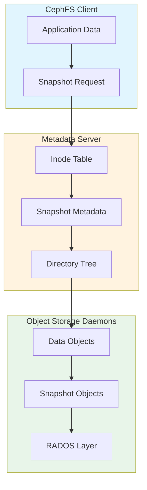
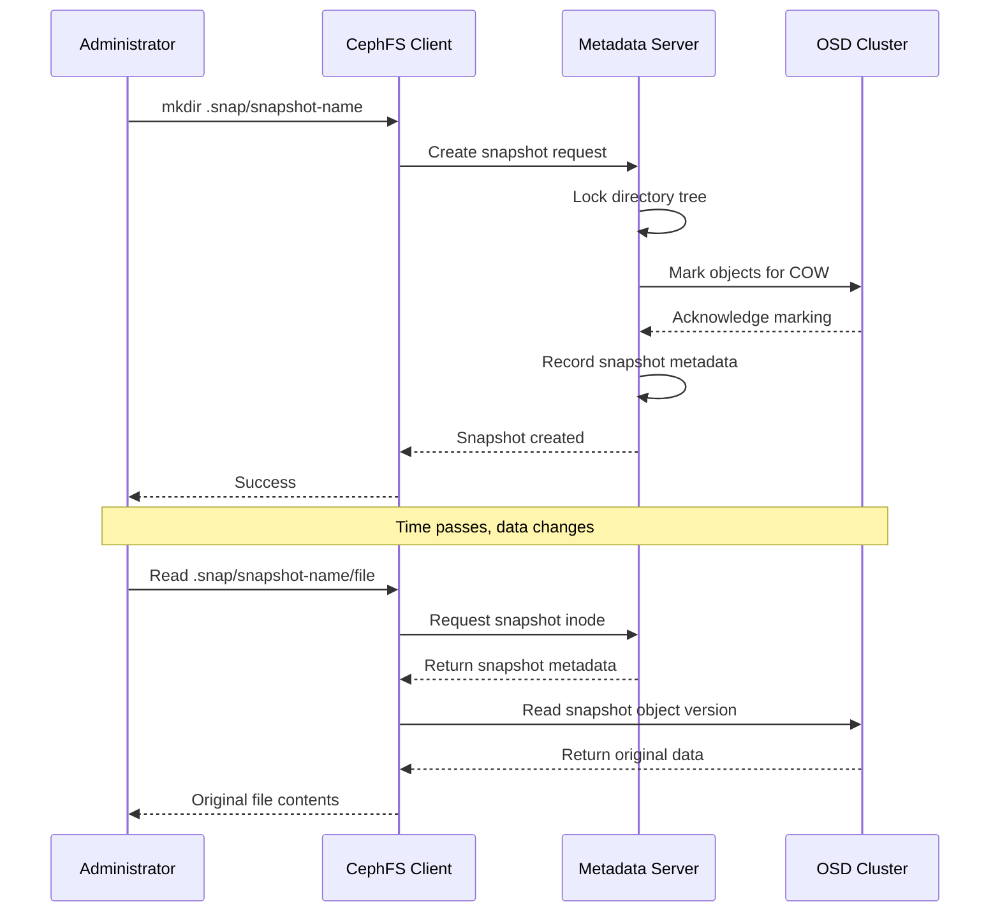
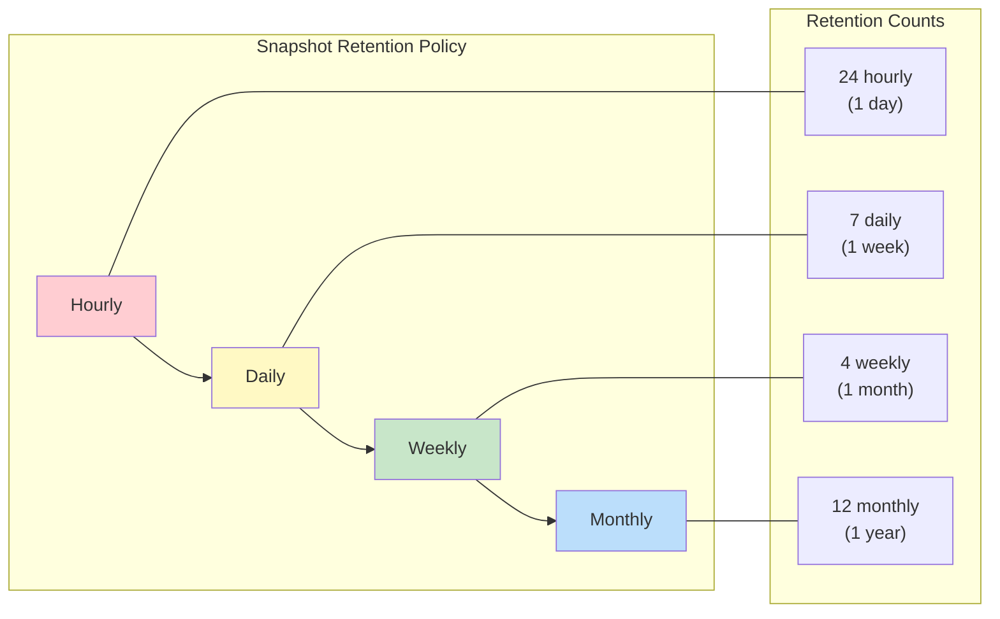
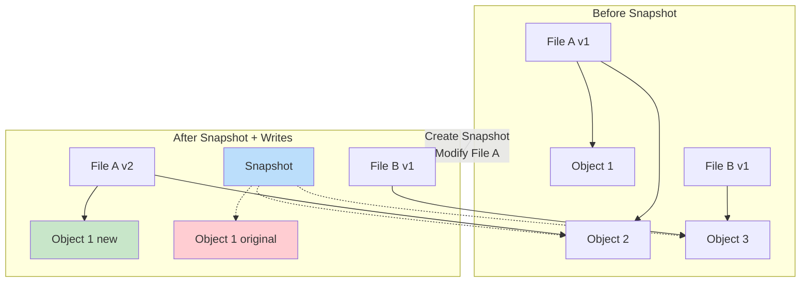

# How to Implement Ceph CephFS Snapshots

Author: [nawazdhandala](https://github.com/nawazdhandala)

Tags: Ceph, CephFS, Snapshots, Storage

Description: A complete guide to implementing CephFS snapshots for point-in-time data protection. Learn how to create, manage, schedule, and restore snapshots in your Ceph distributed file system.

> CephFS snapshots provide instant, space-efficient point-in-time copies of your data without impacting performance or requiring downtime.

Data protection is non-negotiable in production environments. Whether you need to recover from accidental deletions, roll back failed deployments, or maintain compliance with data retention policies, snapshots are your first line of defense. CephFS, the POSIX-compliant distributed file system built on Ceph, offers native snapshot capabilities that integrate seamlessly with your existing storage infrastructure.

This guide walks you through everything you need to know about CephFS snapshots - from basic concepts to production-ready automation.

## Understanding CephFS Snapshot Architecture

Before diving into implementation, it is essential to understand how CephFS snapshots work under the hood.



CephFS snapshots use a copy-on-write (COW) mechanism at the RADOS object level. When you create a snapshot:

1. **Metadata capture**: The MDS (Metadata Server) records the current state of the directory tree
2. **Object marking**: Data objects are marked as belonging to the snapshot
3. **COW activation**: Future writes create new object versions rather than overwriting snapshot data

This approach means snapshots are nearly instantaneous regardless of data size, and they only consume additional storage for data that changes after the snapshot is taken.

## Prerequisites

Before implementing CephFS snapshots, ensure your environment meets these requirements:

- Ceph cluster running Luminous (12.2.x) or later
- CephFS file system created and mounted
- Administrative access to the Ceph cluster
- MDS daemons healthy and active

Verify your cluster health:

```bash
# Check overall cluster status
ceph status

# Verify MDS is active
ceph mds stat

# Confirm CephFS is available
ceph fs ls
```

Expected output for a healthy cluster:

```
cluster:
    id:     a1b2c3d4-e5f6-7890-abcd-ef1234567890
    health: HEALTH_OK

services:
    mon: 3 daemons, quorum node1,node2,node3
    mgr: node1(active), standbys: node2
    mds: cephfs:1 {0=node1=up:active}
    osd: 6 osds: 6 up, 6 in
```

## Enabling Snapshots on CephFS

CephFS snapshots must be enabled at the file system level. By default, snapshots are enabled in newer Ceph versions, but you should verify this setting.

```bash
# Check if snapshots are enabled
ceph fs get cephfs | grep allow_new_snaps

# Enable snapshots if disabled
ceph fs set cephfs allow_new_snaps true
```

You can also control snapshot permissions at a more granular level using MDS configuration:

```bash
# Allow snapshots on the entire file system
ceph config set mds mds_allow_snaps true
```

## Creating Your First Snapshot

CephFS snapshots are created through a special hidden directory called `.snap` that exists in every directory of the mounted file system.

### Basic Snapshot Creation

```bash
# Mount CephFS (if not already mounted)
mount -t ceph mon1:6789,mon2:6789,mon3:6789:/ /mnt/cephfs \
    -o name=admin,secret=AQBxxxxxxxxxxxxxxxxxxxxxxxxxxxxxx

# Navigate to the directory you want to snapshot
cd /mnt/cephfs/data/production

# Create a snapshot by creating a directory inside .snap
mkdir .snap/snapshot-2026-01-30

# Verify the snapshot was created
ls -la .snap/
```

The snapshot now contains a read-only view of the directory at the exact moment it was created.

### Snapshot Naming Conventions

Adopt a consistent naming convention for easier management:

```bash
# Date-based naming
mkdir .snap/daily-2026-01-30
mkdir .snap/weekly-2026-w05
mkdir .snap/monthly-2026-01

# Purpose-based naming
mkdir .snap/pre-upgrade-v2.5.0
mkdir .snap/pre-migration-db
mkdir .snap/before-cleanup-job

# Combined approach (recommended)
mkdir .snap/2026-01-30_pre-deployment_v3.2.1
```

## Snapshot Workflow Diagram

Here is how a typical snapshot lifecycle works in a production environment:



## Listing and Inspecting Snapshots

### View All Snapshots for a Directory

```bash
# List all snapshots
ls -la /mnt/cephfs/data/production/.snap/

# Example output:
# drwxr-xr-x 2 root root 0 Jan 30 10:00 daily-2026-01-29
# drwxr-xr-x 2 root root 0 Jan 30 10:00 daily-2026-01-30
# drwxr-xr-x 2 root root 0 Jan 27 10:00 weekly-2026-w04
```

### Inspect Snapshot Contents

```bash
# View files in a snapshot (read-only)
ls -la /mnt/cephfs/data/production/.snap/daily-2026-01-30/

# Compare current state with snapshot
diff -r /mnt/cephfs/data/production/config \
        /mnt/cephfs/data/production/.snap/daily-2026-01-30/config
```

### Get Snapshot Metadata

```bash
# Use ceph CLI to get detailed snapshot information
ceph fs subvolume snapshot info cephfs mysubvolume mysnap --group_name mygroup

# For direct CephFS mounts, use stat
stat /mnt/cephfs/data/production/.snap/daily-2026-01-30
```

## Restoring Data from Snapshots

Restoring from snapshots is straightforward since snapshots appear as regular directories.

### Restore Individual Files

```bash
# Restore a single file
cp /mnt/cephfs/data/production/.snap/daily-2026-01-30/config.yaml \
   /mnt/cephfs/data/production/config.yaml

# Restore with backup of current version
cp /mnt/cephfs/data/production/config.yaml \
   /mnt/cephfs/data/production/config.yaml.bak
cp /mnt/cephfs/data/production/.snap/daily-2026-01-30/config.yaml \
   /mnt/cephfs/data/production/config.yaml
```

### Restore Entire Directories

```bash
# Remove corrupted directory and restore from snapshot
rm -rf /mnt/cephfs/data/production/app-data
cp -a /mnt/cephfs/data/production/.snap/pre-upgrade-v2.5.0/app-data \
      /mnt/cephfs/data/production/

# Alternative using rsync for large directories
rsync -av --progress \
    /mnt/cephfs/data/production/.snap/daily-2026-01-30/app-data/ \
    /mnt/cephfs/data/production/app-data/
```

### Restore Script Example

Here is a reusable restore script:

```bash
#!/bin/bash
# restore-from-snapshot.sh
# Usage: ./restore-from-snapshot.sh <snapshot-name> <source-path> <dest-path>

set -euo pipefail

SNAPSHOT_NAME="${1:?Snapshot name required}"
SOURCE_PATH="${2:?Source path within snapshot required}"
DEST_PATH="${3:?Destination path required}"
CEPHFS_MOUNT="${CEPHFS_MOUNT:-/mnt/cephfs}"

SNAPSHOT_DIR="${CEPHFS_MOUNT}/${SOURCE_PATH%/*}/.snap/${SNAPSHOT_NAME}/${SOURCE_PATH##*/}"

if [[ ! -d "${SNAPSHOT_DIR}" ]] && [[ ! -f "${SNAPSHOT_DIR}" ]]; then
    echo "Error: Snapshot path does not exist: ${SNAPSHOT_DIR}"
    exit 1
fi

# Create backup of current data
if [[ -e "${DEST_PATH}" ]]; then
    BACKUP_PATH="${DEST_PATH}.backup-$(date +%Y%m%d-%H%M%S)"
    echo "Creating backup at ${BACKUP_PATH}"
    mv "${DEST_PATH}" "${BACKUP_PATH}"
fi

# Restore from snapshot
echo "Restoring from ${SNAPSHOT_DIR} to ${DEST_PATH}"
cp -a "${SNAPSHOT_DIR}" "${DEST_PATH}"

echo "Restore complete"
```

## Deleting Snapshots

Remove snapshots when they are no longer needed to reclaim storage space.

```bash
# Delete a single snapshot
rmdir /mnt/cephfs/data/production/.snap/daily-2026-01-25

# Delete multiple old snapshots
for snap in /mnt/cephfs/data/production/.snap/daily-2026-01-{01..20}; do
    if [[ -d "$snap" ]]; then
        echo "Removing $snap"
        rmdir "$snap"
    fi
done
```

Note: You must use `rmdir` and the snapshot directory must be empty of user-created content. The snapshot data itself is handled by Ceph automatically.

## Automating Snapshot Management

Production environments require automated snapshot creation and retention policies.

### Automated Daily Snapshots with Cron

Create a systemd timer or cron job for regular snapshots:

```bash
#!/bin/bash
# /usr/local/bin/cephfs-snapshot.sh
# Automated CephFS snapshot creation and retention

set -euo pipefail

CEPHFS_MOUNT="/mnt/cephfs"
SNAPSHOT_DIRS=(
    "data/production"
    "data/staging"
    "backups/databases"
)
RETENTION_DAYS=30

create_snapshot() {
    local dir="$1"
    local snapshot_name="daily-$(date +%Y-%m-%d)"
    local snapshot_path="${CEPHFS_MOUNT}/${dir}/.snap/${snapshot_name}"

    if [[ -d "${snapshot_path}" ]]; then
        echo "Snapshot already exists: ${snapshot_path}"
        return 0
    fi

    echo "Creating snapshot: ${snapshot_path}"
    mkdir "${snapshot_path}"
}

cleanup_old_snapshots() {
    local dir="$1"
    local snap_dir="${CEPHFS_MOUNT}/${dir}/.snap"
    local cutoff_date
    cutoff_date=$(date -d "-${RETENTION_DAYS} days" +%Y-%m-%d)

    for snapshot in "${snap_dir}"/daily-*; do
        if [[ -d "$snapshot" ]]; then
            snapshot_date=$(basename "$snapshot" | sed 's/daily-//')
            if [[ "$snapshot_date" < "$cutoff_date" ]]; then
                echo "Removing old snapshot: $snapshot"
                rmdir "$snapshot"
            fi
        fi
    done
}

main() {
    for dir in "${SNAPSHOT_DIRS[@]}"; do
        echo "Processing: ${dir}"
        create_snapshot "$dir"
        cleanup_old_snapshots "$dir"
    done
}

main "$@"
```

### Cron Configuration

```bash
# /etc/cron.d/cephfs-snapshots
# Daily snapshots at 2 AM
0 2 * * * root /usr/local/bin/cephfs-snapshot.sh >> /var/log/cephfs-snapshots.log 2>&1

# Weekly snapshots on Sunday at 3 AM
0 3 * * 0 root /usr/local/bin/cephfs-snapshot-weekly.sh >> /var/log/cephfs-snapshots.log 2>&1
```

### Systemd Timer (Alternative to Cron)

```ini
# /etc/systemd/system/cephfs-snapshot.service
[Unit]
Description=CephFS Daily Snapshot
After=network.target ceph.target

[Service]
Type=oneshot
ExecStart=/usr/local/bin/cephfs-snapshot.sh
StandardOutput=journal
StandardError=journal

[Install]
WantedBy=multi-user.target
```

```ini
# /etc/systemd/system/cephfs-snapshot.timer
[Unit]
Description=Run CephFS snapshots daily

[Timer]
OnCalendar=*-*-* 02:00:00
Persistent=true

[Install]
WantedBy=timers.target
```

Enable the timer:

```bash
systemctl daemon-reload
systemctl enable --now cephfs-snapshot.timer
systemctl list-timers | grep cephfs
```

## Snapshot Retention Strategy

A well-designed retention policy balances data protection with storage costs:



### Implementation with Retention Tiers

```bash
#!/bin/bash
# /usr/local/bin/cephfs-snapshot-tiered.sh
# Tiered snapshot retention: hourly, daily, weekly, monthly

set -euo pipefail

CEPHFS_MOUNT="/mnt/cephfs"
TARGET_DIR="data/production"
SNAP_DIR="${CEPHFS_MOUNT}/${TARGET_DIR}/.snap"

# Retention counts
HOURLY_KEEP=24
DAILY_KEEP=7
WEEKLY_KEEP=4
MONTHLY_KEEP=12

create_snapshot() {
    local prefix="$1"
    local timestamp

    case "$prefix" in
        hourly)  timestamp=$(date +%Y-%m-%d_%H00) ;;
        daily)   timestamp=$(date +%Y-%m-%d) ;;
        weekly)  timestamp=$(date +%Y-w%V) ;;
        monthly) timestamp=$(date +%Y-%m) ;;
    esac

    local snapshot_name="${prefix}-${timestamp}"
    local snapshot_path="${SNAP_DIR}/${snapshot_name}"

    if [[ ! -d "${snapshot_path}" ]]; then
        echo "Creating ${prefix} snapshot: ${snapshot_name}"
        mkdir "${snapshot_path}"
    fi
}

cleanup_tier() {
    local prefix="$1"
    local keep_count="$2"

    # List snapshots sorted by name (oldest first), skip the newest $keep_count
    local snapshots
    snapshots=$(ls -1d "${SNAP_DIR}/${prefix}-"* 2>/dev/null | sort | head -n -"${keep_count}" || true)

    for snapshot in $snapshots; do
        if [[ -d "$snapshot" ]]; then
            echo "Removing old ${prefix} snapshot: $(basename "$snapshot")"
            rmdir "$snapshot"
        fi
    done
}

# Determine which snapshots to create based on current time
hour=$(date +%H)
day_of_week=$(date +%u)  # 1=Monday, 7=Sunday
day_of_month=$(date +%d)

# Always create hourly
create_snapshot "hourly"
cleanup_tier "hourly" "$HOURLY_KEEP"

# Daily at midnight
if [[ "$hour" == "00" ]]; then
    create_snapshot "daily"
    cleanup_tier "daily" "$DAILY_KEEP"
fi

# Weekly on Sunday at midnight
if [[ "$day_of_week" == "7" ]] && [[ "$hour" == "00" ]]; then
    create_snapshot "weekly"
    cleanup_tier "weekly" "$WEEKLY_KEEP"
fi

# Monthly on the 1st at midnight
if [[ "$day_of_month" == "01" ]] && [[ "$hour" == "00" ]]; then
    create_snapshot "monthly"
    cleanup_tier "monthly" "$MONTHLY_KEEP"
fi
```

## Monitoring Snapshot Health

Track snapshot status and storage consumption with monitoring scripts:

```bash
#!/bin/bash
# /usr/local/bin/cephfs-snapshot-monitor.sh
# Monitor CephFS snapshot health and disk usage

set -euo pipefail

CEPHFS_MOUNT="/mnt/cephfs"
ALERT_THRESHOLD_PERCENT=80

check_snapshot_count() {
    local dir="$1"
    local snap_dir="${CEPHFS_MOUNT}/${dir}/.snap"
    local count

    count=$(ls -1d "${snap_dir}"/* 2>/dev/null | wc -l || echo 0)
    echo "Directory: ${dir}"
    echo "  Snapshot count: ${count}"

    # Check for missing daily snapshots
    local today
    today=$(date +%Y-%m-%d)
    if [[ ! -d "${snap_dir}/daily-${today}" ]]; then
        echo "  WARNING: Missing today's daily snapshot"
    fi
}

check_ceph_pool_usage() {
    local pool_name="${1:-cephfs_data}"
    local usage

    usage=$(ceph df -f json | jq -r ".pools[] | select(.name==\"${pool_name}\") | .stats.percent_used")

    echo "Pool: ${pool_name}"
    echo "  Usage: ${usage}%"

    if (( $(echo "${usage} > ${ALERT_THRESHOLD_PERCENT}" | bc -l) )); then
        echo "  ALERT: Pool usage exceeds ${ALERT_THRESHOLD_PERCENT}%"
        return 1
    fi
}

check_mds_health() {
    local status
    status=$(ceph mds stat -f json)

    local active_count
    active_count=$(echo "$status" | jq '.fsmap.up | length')

    echo "MDS Status:"
    echo "  Active MDS count: ${active_count}"

    if [[ "$active_count" -lt 1 ]]; then
        echo "  ALERT: No active MDS daemons"
        return 1
    fi
}

main() {
    echo "=== CephFS Snapshot Health Check ==="
    echo "Timestamp: $(date)"
    echo ""

    check_mds_health
    echo ""

    check_ceph_pool_usage "cephfs_data"
    echo ""

    for dir in "data/production" "data/staging"; do
        check_snapshot_count "$dir"
        echo ""
    done
}

main "$@"
```

## Best Practices for Production Snapshots

### 1. Snapshot Consistency

For databases and applications requiring consistency, consider these approaches:

```bash
#!/bin/bash
# Application-consistent snapshot

# Freeze application writes (example for PostgreSQL)
psql -c "SELECT pg_start_backup('cephfs-snapshot', true);"

# Create the snapshot
mkdir /mnt/cephfs/data/postgresql/.snap/consistent-$(date +%Y%m%d-%H%M%S)

# Resume application writes
psql -c "SELECT pg_stop_backup();"
```

### 2. Snapshot Testing

Regularly verify snapshots are restorable:

```bash
#!/bin/bash
# Snapshot verification script

SNAPSHOT_PATH="/mnt/cephfs/data/production/.snap/daily-$(date +%Y-%m-%d)"
TEST_DIR="/tmp/snapshot-verify-$$"

mkdir -p "$TEST_DIR"

# Copy random files from snapshot and verify checksums
find "$SNAPSHOT_PATH" -type f | shuf -n 10 | while read -r file; do
    cp "$file" "$TEST_DIR/"
    original_sum=$(sha256sum "$file" | awk '{print $1}')
    copy_sum=$(sha256sum "${TEST_DIR}/$(basename "$file")" | awk '{print $1}')

    if [[ "$original_sum" == "$copy_sum" ]]; then
        echo "PASS: $(basename "$file")"
    else
        echo "FAIL: $(basename "$file")"
    fi
done

rm -rf "$TEST_DIR"
```

### 3. Documentation and Labeling

Maintain a snapshot registry for compliance and auditing:

```bash
#!/bin/bash
# Log snapshot creation with metadata

log_snapshot() {
    local snapshot_name="$1"
    local snapshot_path="$2"
    local reason="${3:-scheduled}"

    local log_entry
    log_entry=$(cat <<EOF
{
    "timestamp": "$(date -Iseconds)",
    "snapshot_name": "${snapshot_name}",
    "snapshot_path": "${snapshot_path}",
    "reason": "${reason}",
    "created_by": "$(whoami)",
    "hostname": "$(hostname)"
}
EOF
)

    echo "$log_entry" >> /var/log/cephfs-snapshot-registry.jsonl
}

# Usage
log_snapshot "pre-upgrade-v3.0" "/mnt/cephfs/data/production" "Pre-upgrade checkpoint"
```

## Troubleshooting Common Issues

### Snapshot Creation Fails

```bash
# Check if snapshots are enabled
ceph fs get cephfs | grep allow_new_snaps

# Verify MDS is healthy
ceph mds stat

# Check for quota limits
getfattr -n ceph.quota.max_bytes /mnt/cephfs/data/production

# Review MDS logs for errors
journalctl -u ceph-mds@$(hostname) --since "1 hour ago"
```

### Snapshot Deletion Hangs

```bash
# Check for ongoing operations
ceph daemon mds.$(hostname) ops

# Force MDS to drop caches (use with caution)
ceph daemon mds.$(hostname) cache drop

# Verify no clients have files open in the snapshot
lsof +D /mnt/cephfs/data/production/.snap/snapshot-name
```

### Performance Degradation After Many Snapshots

```bash
# List snapshot count per directory
for dir in /mnt/cephfs/data/*; do
    count=$(ls -1d "${dir}/.snap"/* 2>/dev/null | wc -l)
    echo "${dir}: ${count} snapshots"
done

# Consider consolidating old snapshots
# Merge hourly into daily, daily into weekly, etc.
```

## Snapshot Architecture Deep Dive

Understanding the internal structure helps with capacity planning:



The diagram shows that:
- Unchanged objects (Object 2, Object 3) are shared between live data and snapshots
- Modified objects (Object 1) maintain the original version for the snapshot
- Storage overhead is proportional to changed data, not total data size

## Summary

CephFS snapshots provide a powerful, space-efficient mechanism for point-in-time data protection. Key takeaways:

- **Instant creation**: Snapshots complete in milliseconds regardless of data size
- **Space efficiency**: Copy-on-write means snapshots only consume storage for changed data
- **Simple interface**: Create snapshots using standard filesystem operations (mkdir in .snap)
- **Flexible recovery**: Restore individual files or entire directory trees
- **Automation-ready**: Easily integrate with cron, systemd, or orchestration tools

Start with a simple daily snapshot policy, then expand to tiered retention as your needs grow. Regular testing of your restore procedures ensures snapshots will be there when you need them most.

For production environments, combine CephFS snapshots with off-cluster backups for comprehensive data protection. Snapshots protect against accidental deletion and corruption, while off-site backups protect against cluster-wide failures.
