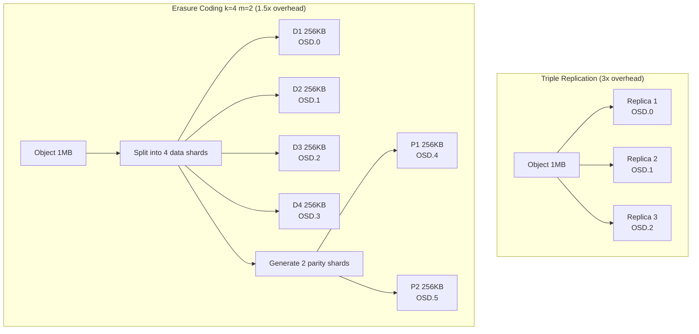
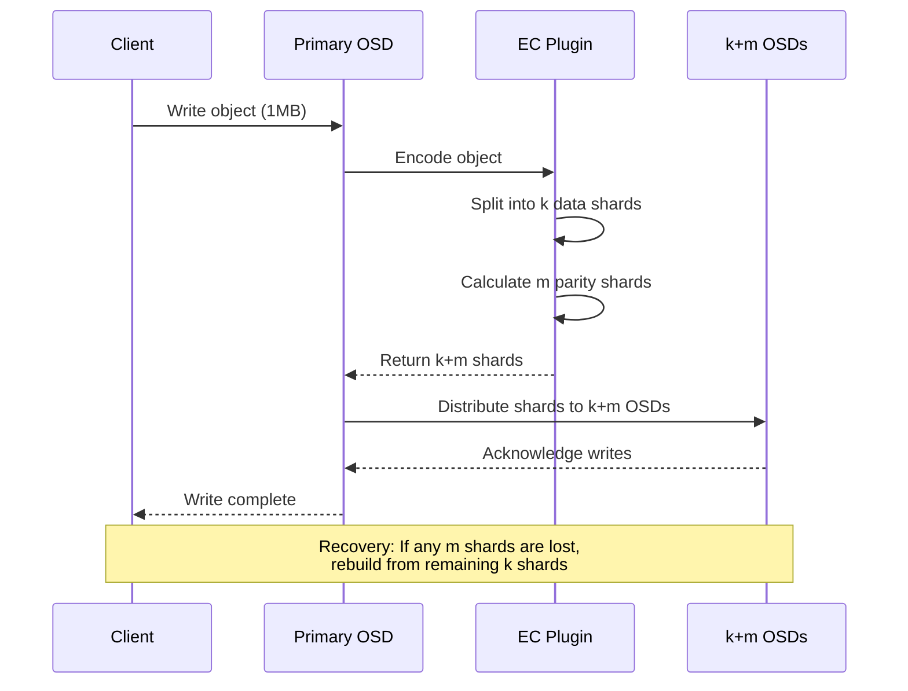
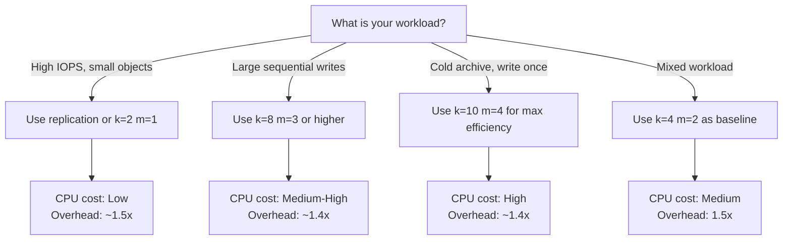

# How to Implement Ceph Erasure Coding Profiles

Author: [nawazdhandala](https://github.com/nawazdhandala)

Tags: Ceph, Storage, ErasureCoding, DataProtection

Description: Learn how to configure Ceph erasure coding profiles for storage efficiency, balancing redundancy with raw capacity savings.

---

Replication is simple: copy data three times and sleep well. But when your cluster grows past a few hundred terabytes, paying for 200% overhead starts to sting. **Erasure coding (EC)** offers a middle path: spread data and parity shards across OSDs so you can survive disk failures while reclaiming significant raw capacity.

This guide walks through Ceph erasure coding profiles, from the math behind k and m values to practical pool creation and tuning.

## What is Erasure Coding?

Erasure coding splits an object into **k data shards** and generates **m coding (parity) shards**. The cluster can reconstruct the original data from any k shards out of the total k+m. This is the same math that powers RAID 5/6, but distributed across many hosts instead of a single array.

| Concept | Description |
| --- | --- |
| **k (data shards)** | Number of original data chunks an object is split into |
| **m (coding shards)** | Number of parity chunks generated; you can lose up to m shards |
| **Total shards** | k + m; each shard lands on a different OSD |
| **Storage overhead** | (k + m) / k; e.g., k=4 m=2 gives 1.5x overhead vs 3x for triple replication |

### Common Configurations

| Profile | k | m | Overhead | Fault Tolerance |
| --- | --- | --- | --- | --- |
| Light protection | 4 | 2 | 1.5x | 2 OSDs |
| Balanced | 8 | 3 | 1.375x | 3 OSDs |
| High durability | 8 | 4 | 1.5x | 4 OSDs |
| Aggressive efficiency | 10 | 4 | 1.4x | 4 OSDs |

## How EC Distributes Data

Below is a simplified view of how erasure coding spreads a single object across OSDs compared to triple replication.



With replication, you store 3MB for every 1MB of data. With EC k=4 m=2, you store 1.5MB. Multiply that by petabytes and the savings are substantial.

## Creating an Erasure Coding Profile

Ceph stores EC parameters in named profiles. Create one with the `ceph osd erasure-code-profile` command.

```bash
# Create a profile named "ec-4-2" with 4 data shards and 2 parity shards
ceph osd erasure-code-profile set ec-4-2 \
    k=4 \
    m=2 \
    crush-failure-domain=host \
    crush-device-class=hdd

# Verify the profile was created
ceph osd erasure-code-profile get ec-4-2
```

### Profile Parameters Explained

| Parameter | Purpose |
| --- | --- |
| `k` | Number of data shards |
| `m` | Number of parity shards |
| `crush-failure-domain` | Spread shards across this CRUSH bucket type (host, rack, datacenter) |
| `crush-device-class` | Target specific device types (hdd, ssd, nvme) |
| `plugin` | Algorithm to use; default is `jerasure` (good for most cases) |

### Advanced Profile with Plugin Selection

```bash
# Use the ISA-L plugin for better performance on Intel CPUs
ceph osd erasure-code-profile set ec-8-3-isa \
    k=8 \
    m=3 \
    plugin=isa \
    technique=reed_sol_van \
    crush-failure-domain=rack \
    crush-device-class=ssd
```

## Creating an EC Pool

Pools use profiles to determine how data is encoded. Create a pool that references your EC profile.

```bash
# Create an erasure-coded pool for object storage
# Syntax: ceph osd pool create <pool-name> <pg-num> erasure <profile-name>
ceph osd pool create cold-archive 128 erasure ec-4-2

# Enable the pool for application use (e.g., RGW, RBD via cache tier, CephFS data)
ceph osd pool application enable cold-archive rgw
```

### Setting Pool Parameters

```bash
# Set minimum size (how many shards must be available for reads)
# For k=4 m=2, you need at least k shards (4) to read
ceph osd pool set cold-archive min_size 5

# Allow EC overwrites (required for RBD and CephFS workloads)
ceph osd pool set cold-archive allow_ec_overwrites true
```

## EC Pool Workflow Diagram

This diagram shows the write path for an object entering an erasure-coded pool.



## Practical Use Cases

### Cold Storage Archive

Perfect for data that is written once and rarely read. The CPU cost of encoding/decoding is amortized over long retention periods.

```bash
# Create a profile optimized for large objects and cold data
ceph osd erasure-code-profile set ec-archive \
    k=10 \
    m=4 \
    crush-failure-domain=rack

# Create the pool
ceph osd pool create archive-data 256 erasure ec-archive

# Configure for S3/RGW usage
ceph osd pool application enable archive-data rgw
radosgw-admin zone placement modify \
    --rgw-zone=default \
    --placement-id=default-placement \
    --data-pool=archive-data
```

### RBD with EC (Cache Tiering Pattern)

RBD needs overwrite support. Use a replicated cache tier for hot data and an EC pool for cold data.

```bash
# Create the EC pool for bulk data
ceph osd erasure-code-profile set ec-rbd \
    k=4 \
    m=2 \
    crush-failure-domain=host

ceph osd pool create rbd-ec-data 128 erasure ec-rbd
ceph osd pool set rbd-ec-data allow_ec_overwrites true

# Create a replicated pool for metadata
ceph osd pool create rbd-meta 64 replicated
ceph osd pool application enable rbd-meta rbd

# Create an RBD image using the EC pool for data
rbd create --size 100G \
    --data-pool rbd-ec-data \
    rbd-meta/my-volume
```

### CephFS with EC Data Pool

CephFS can use separate pools for metadata (replicated) and data (erasure coded).

```bash
# Metadata pool: always replicated for performance
ceph osd pool create cephfs-meta 64 replicated

# Data pool: erasure coded for efficiency
ceph osd pool create cephfs-data 256 erasure ec-4-2
ceph osd pool set cephfs-data allow_ec_overwrites true

# Create the filesystem
ceph fs new myfs cephfs-meta cephfs-data

# Add a second EC pool for cold data (optional)
ceph osd pool create cephfs-archive 128 erasure ec-8-3
ceph osd pool set cephfs-archive allow_ec_overwrites true
ceph fs add_data_pool myfs cephfs-archive
```

## Performance vs Redundancy Tradeoffs

Erasure coding is not free. Understanding the tradeoffs helps you pick the right profile.

### CPU Overhead

Encoding and decoding consume CPU cycles. The larger your k value, the more math happens per I/O.

| Profile | Relative CPU Cost | Notes |
| --- | --- | --- |
| k=2 m=1 | Low | Minimal encoding, similar to RAID 5 |
| k=4 m=2 | Medium | Good balance for most workloads |
| k=8 m=3 | Higher | Better efficiency, more CPU per operation |
| k=10 m=4 | High | Best for large sequential writes, avoid for IOPS workloads |

Use the ISA-L plugin on Intel CPUs for hardware-accelerated encoding.

### Read Amplification

Reading a small object from an EC pool requires fetching k shards and decoding. This increases latency compared to replicated pools where any replica can serve the read.

```bash
# Check read latency percentiles on an EC pool
ceph osd pool stats cold-archive
ceph osd perf
```

### Recovery Bandwidth

When an OSD fails, Ceph must read k shards from surviving OSDs to rebuild the lost shard. With high k values, recovery consumes more network bandwidth.

```bash
# Throttle recovery to avoid impacting client I/O
ceph config set osd osd_recovery_max_active 1
ceph config set osd osd_recovery_sleep 0.5
```

### Decision Matrix



## Monitoring EC Pools

Track EC pool health and performance with Ceph's built-in tools.

```bash
# Check pool status and I/O
ceph osd pool stats

# View EC profile details
ceph osd erasure-code-profile ls
ceph osd erasure-code-profile get ec-4-2

# Monitor recovery progress after OSD failure
ceph status
ceph health detail

# Check for degraded or misplaced objects
ceph pg ls-by-pool cold-archive | grep -v "active+clean"
```

### Prometheus Metrics

Export metrics to Prometheus and visualize in Grafana or send to OneUptime for alerting.

```yaml
# Key metrics to track for EC pools
# ceph_pool_stored_raw: Total raw bytes stored (includes parity)
# ceph_pool_stored: Logical bytes stored
# ceph_osd_recovery_bytes: Bytes transferred during recovery
# ceph_osd_op_r_latency: Read latency histogram
```

## Common Pitfalls

1. **Too few OSDs for your profile.** A k=8 m=3 profile needs at least 11 OSDs (k+m) in different failure domains. The pool will not activate if you cannot spread shards.

2. **Forgetting `allow_ec_overwrites`.** RBD and CephFS require overwrites. Without this flag, writes fail.

3. **Using EC for hot, small-object workloads.** The encoding overhead kills IOPS. Keep hot data on replicated pools.

4. **Ignoring CRUSH rules.** If your failure domain is `host` but you only have three hosts, a k=4 m=2 profile will not work. Match your topology.

5. **Not testing recovery.** Simulate OSD failures before going to production. Measure how long recovery takes and whether client I/O degrades.

## TL;DR

Erasure coding trades CPU cycles for storage efficiency. Use it for cold data, archives, and large sequential workloads where the encoding overhead is acceptable. Stick with replication for metadata, hot data, and IOPS-sensitive workloads.

Start with **k=4 m=2** as a baseline (1.5x overhead, tolerates 2 failures), then tune based on your capacity constraints and performance requirements. Always validate your CRUSH topology supports the total shard count (k+m) across distinct failure domains.

The real win comes at scale: when you are storing petabytes, moving from 3x replication to 1.4x erasure coding gives you back nearly half your raw capacity.
