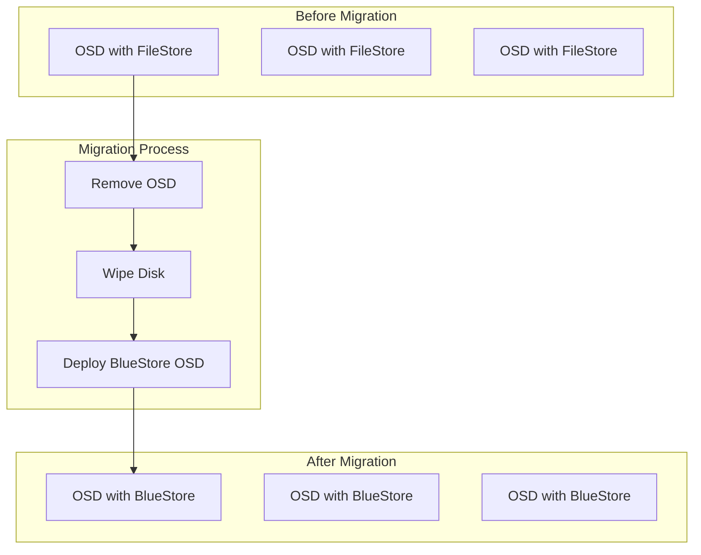
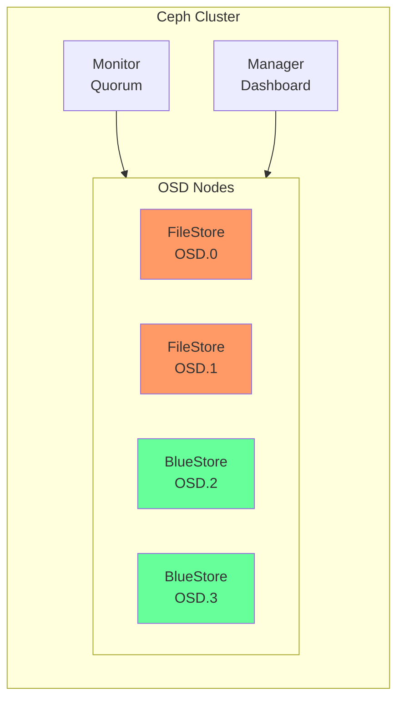
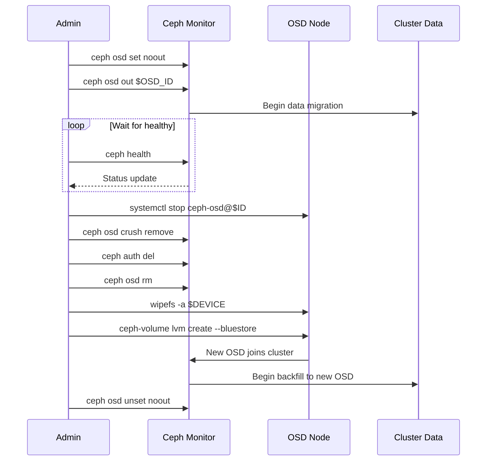
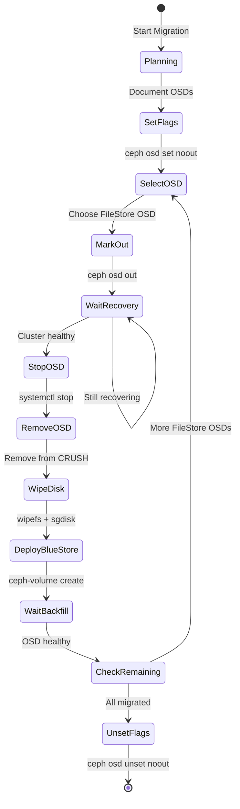

# How to Build Ceph FileStore Migration

Author: [nawazdhandala](https://github.com/nawazdhandala)

Tags: Ceph, Storage, Migration, BlueStore

Description: A comprehensive guide to migrating Ceph clusters from FileStore to BlueStore. Learn planning strategies, step-by-step migration procedures, and best practices for zero-downtime storage backend transitions.

---

> FileStore served Ceph well for years, but BlueStore offers significant performance improvements and better data integrity. Migrating your production cluster requires careful planning and execution. This guide walks you through the entire process.

Storage migrations are high-stakes operations. A well-planned FileStore to BlueStore migration minimizes risk and maximizes the benefits of the new backend.

---

## Overview



---

## FileStore vs BlueStore

Before starting the migration, understand why BlueStore is the preferred backend:

| Feature | FileStore | BlueStore |
|---------|-----------|-----------|
| Write Amplification | 2x (journal + data) | 1x (direct writes) |
| Checksum Support | No | Yes (per-object) |
| Compression | Limited | Inline compression |
| Performance | Good | 2x faster writes |
| Data Integrity | Journal-based | Built-in checksums |
| Disk Space | More overhead | Less overhead |

---

## Migration Architecture



---

## Prerequisites

### Check Current Cluster Status

Before any migration, verify your cluster health:

```bash
# Check overall cluster health
ceph health detail

# View current OSD tree and status
ceph osd tree

# List all OSDs with their backends
ceph osd metadata | jq -r '.[] | "\(.id) \(.osd_objectstore)"'
```

### Verify Ceph Version

BlueStore requires Ceph Luminous (12.x) or later. Check your version:

```bash
# Check Ceph version across all nodes
ceph versions

# Expected output for a modern cluster
{
    "mon": {
        "ceph version 17.2.6 (quincy)": 3
    },
    "osd": {
        "ceph version 17.2.6 (quincy)": 12
    }
}
```

### Calculate Required Space

Ensure you have enough capacity to migrate OSDs one at a time:

```bash
# Check cluster capacity and usage
ceph df

# Calculate minimum required free space
# Rule: You need at least 1/N of total capacity free
# where N is the number of OSDs per failure domain

ceph osd df tree
```

---

## Pre-Migration Planning

### Create Migration Inventory

Document all OSDs that need migration:

```bash
#!/bin/bash
# generate_migration_inventory.sh
# Creates a detailed inventory of FileStore OSDs for migration planning

echo "OSD Migration Inventory"
echo "======================"
echo ""

# Get all OSD IDs
for osd_id in $(ceph osd ls); do
    # Get OSD metadata
    metadata=$(ceph osd metadata $osd_id)

    # Extract backend type
    backend=$(echo "$metadata" | jq -r '.osd_objectstore')

    # Extract host information
    host=$(echo "$metadata" | jq -r '.hostname')

    # Extract device path
    device=$(echo "$metadata" | jq -r '.bluestore_bdev_devices // .backend_filestore_dev_node')

    # Only list FileStore OSDs
    if [ "$backend" == "filestore" ]; then
        echo "OSD.$osd_id"
        echo "  Host: $host"
        echo "  Device: $device"
        echo "  Backend: $backend"
        echo ""
    fi
done
```

### Set Cluster Flags

Before migration, configure the cluster to handle OSD removals gracefully:

```bash
# Prevent unnecessary data rebalancing during short maintenance windows
ceph osd set noout

# Optional: Reduce recovery impact on client I/O
ceph osd set nobackfill
ceph osd set norecover

# Verify flags are set
ceph osd dump | grep flags
```

---

## Migration Process

### Step 1: Identify Target OSD

Select the OSD to migrate:

```bash
# List all FileStore OSDs
ceph osd metadata | jq -r '.[] | select(.osd_objectstore == "filestore") | "OSD.\(.id) on \(.hostname)"'

# Check specific OSD details
OSD_ID=0
ceph osd find $OSD_ID
```

### Step 2: Mark OSD Out

Gracefully remove the OSD from the cluster:

```bash
#!/bin/bash
# mark_osd_out.sh
# Safely marks an OSD out of the cluster

OSD_ID=$1

if [ -z "$OSD_ID" ]; then
    echo "Usage: $0 <osd_id>"
    exit 1
fi

echo "Marking OSD.$OSD_ID out..."

# Mark the OSD out to start data migration away from it
ceph osd out $OSD_ID

# Wait for data to migrate away
echo "Waiting for PGs to become active+clean..."
while true; do
    # Count PGs that are not active+clean
    degraded=$(ceph health detail 2>/dev/null | grep -c "degraded")
    recovering=$(ceph pg stat | grep -c "recovering")

    if [ "$degraded" -eq 0 ] && [ "$recovering" -eq 0 ]; then
        echo "All PGs are healthy"
        break
    fi

    echo "Still recovering... waiting 30 seconds"
    sleep 30
done
```

### Step 3: Stop and Remove OSD

Stop the OSD service and remove it from the cluster:

```bash
#!/bin/bash
# remove_osd.sh
# Stops and removes an OSD from the cluster

OSD_ID=$1
HOST=$2

if [ -z "$OSD_ID" ] || [ -z "$HOST" ]; then
    echo "Usage: $0 <osd_id> <host>"
    exit 1
fi

echo "Stopping OSD.$OSD_ID on $HOST..."

# Stop the OSD daemon
ssh $HOST "sudo systemctl stop ceph-osd@$OSD_ID"

# Wait for OSD to be marked down
sleep 10

# Verify OSD is down
ceph osd tree | grep "osd.$OSD_ID"

echo "Removing OSD.$OSD_ID from cluster..."

# Remove OSD from CRUSH map
ceph osd crush remove osd.$OSD_ID

# Delete authentication key
ceph auth del osd.$OSD_ID

# Remove OSD from cluster
ceph osd rm $OSD_ID

echo "OSD.$OSD_ID removed successfully"
```

### Step 4: Wipe the Disk

Prepare the disk for BlueStore deployment:

```bash
#!/bin/bash
# wipe_disk.sh
# Safely wipes a disk for BlueStore OSD deployment

DEVICE=$1
HOST=$2

if [ -z "$DEVICE" ] || [ -z "$HOST" ]; then
    echo "Usage: $0 <device> <host>"
    exit 1
fi

echo "Wiping $DEVICE on $HOST..."

# Remove any existing LVM configuration
ssh $HOST "sudo pvremove $DEVICE --force --force 2>/dev/null || true"

# Wipe filesystem signatures
ssh $HOST "sudo wipefs -a $DEVICE"

# Zero out the beginning and end of the disk
ssh $HOST "sudo dd if=/dev/zero of=$DEVICE bs=1M count=100"
ssh $HOST "sudo dd if=/dev/zero of=$DEVICE bs=1M count=100 seek=\$((\$(blockdev --getsz $DEVICE) / 2048 - 100))"

# Clear partition table
ssh $HOST "sudo sgdisk --zap-all $DEVICE"

echo "Disk $DEVICE wiped successfully"
```

### Step 5: Deploy BlueStore OSD

Create a new OSD with BlueStore backend:

```bash
#!/bin/bash
# deploy_bluestore_osd.sh
# Deploys a new BlueStore OSD

DEVICE=$1
HOST=$2

if [ -z "$DEVICE" ] || [ -z "$HOST" ]; then
    echo "Usage: $0 <device> <host>"
    exit 1
fi

echo "Deploying BlueStore OSD on $DEVICE ($HOST)..."

# Using ceph-volume for modern Ceph deployments
ssh $HOST "sudo ceph-volume lvm create --bluestore --data $DEVICE"

# For cephadm-managed clusters, use orchestrator
# ceph orch daemon add osd $HOST:$DEVICE

echo "Verifying new OSD..."
sleep 5

# Find the new OSD ID
NEW_OSD=$(ceph osd tree | grep "$HOST" -A 10 | grep "up" | tail -1 | awk '{print $4}')
echo "New OSD created: $NEW_OSD"

# Verify it is using BlueStore
ceph osd metadata $NEW_OSD | jq '.osd_objectstore'
```

---

## Migration Workflow Diagram



---

## Automated Migration Script

For larger clusters, automate the migration process:

```bash
#!/bin/bash
# migrate_filestore_to_bluestore.sh
# Automated migration script for FileStore to BlueStore conversion

set -e

# Configuration
LOG_FILE="/var/log/ceph-migration.log"
WAIT_TIMEOUT=3600  # Maximum wait time for recovery (seconds)

log() {
    echo "[$(date '+%Y-%m-%d %H:%M:%S')] $1" | tee -a $LOG_FILE
}

wait_for_healthy() {
    local timeout=$1
    local elapsed=0

    while [ $elapsed -lt $timeout ]; do
        health=$(ceph health 2>/dev/null)
        if [ "$health" == "HEALTH_OK" ]; then
            log "Cluster is healthy"
            return 0
        fi

        log "Waiting for cluster health... ($health)"
        sleep 30
        elapsed=$((elapsed + 30))
    done

    log "ERROR: Timeout waiting for cluster health"
    return 1
}

migrate_osd() {
    local osd_id=$1
    local host=$2
    local device=$3

    log "Starting migration of OSD.$osd_id on $host ($device)"

    # Step 1: Mark OSD out
    log "Marking OSD.$osd_id out"
    ceph osd out $osd_id

    # Step 2: Wait for data migration
    log "Waiting for data to migrate away from OSD.$osd_id"
    wait_for_healthy $WAIT_TIMEOUT

    # Step 3: Stop OSD
    log "Stopping OSD.$osd_id"
    ssh $host "sudo systemctl stop ceph-osd@$osd_id"
    sleep 10

    # Step 4: Remove OSD
    log "Removing OSD.$osd_id from cluster"
    ceph osd crush remove osd.$osd_id
    ceph auth del osd.$osd_id
    ceph osd rm $osd_id

    # Step 5: Wipe disk
    log "Wiping disk $device on $host"
    ssh $host "sudo wipefs -a $device"
    ssh $host "sudo sgdisk --zap-all $device"

    # Step 6: Deploy BlueStore OSD
    log "Deploying new BlueStore OSD on $device"
    ssh $host "sudo ceph-volume lvm create --bluestore --data $device"

    # Step 7: Wait for recovery
    log "Waiting for new OSD to recover data"
    wait_for_healthy $WAIT_TIMEOUT

    log "Migration of OSD.$osd_id completed successfully"
}

# Main execution
log "Starting FileStore to BlueStore migration"

# Set noout flag
log "Setting noout flag"
ceph osd set noout

# Get list of FileStore OSDs
FILESTORE_OSDS=$(ceph osd metadata | jq -r '.[] | select(.osd_objectstore == "filestore") | "\(.id):\(.hostname):\(.backend_filestore_dev_node)"')

for osd_info in $FILESTORE_OSDS; do
    osd_id=$(echo $osd_info | cut -d: -f1)
    host=$(echo $osd_info | cut -d: -f2)
    device=$(echo $osd_info | cut -d: -f3)

    migrate_osd $osd_id $host $device
done

# Unset noout flag
log "Unsetting noout flag"
ceph osd unset noout

log "Migration completed successfully"
```

---

## Monitoring Migration Progress

### Real-time Progress Dashboard

Monitor the migration with a watch command:

```bash
# Watch cluster health and recovery progress
watch -n 5 'echo "=== Cluster Health ===" && ceph health && echo "" && \
echo "=== Recovery Progress ===" && ceph -s | grep -A5 "progress" && echo "" && \
echo "=== OSD Backend Summary ===" && ceph osd metadata | jq -r ".[] | .osd_objectstore" | sort | uniq -c'
```

### Custom Monitoring Script

Create a detailed progress monitor:

```bash
#!/bin/bash
# monitor_migration.sh
# Monitors FileStore to BlueStore migration progress

while true; do
    clear
    echo "========================================="
    echo "  Ceph FileStore to BlueStore Migration"
    echo "  $(date)"
    echo "========================================="
    echo ""

    # Count OSDs by backend type
    filestore_count=$(ceph osd metadata | jq -r '[.[] | select(.osd_objectstore == "filestore")] | length')
    bluestore_count=$(ceph osd metadata | jq -r '[.[] | select(.osd_objectstore == "bluestore")] | length')
    total=$((filestore_count + bluestore_count))

    echo "Progress: $bluestore_count / $total OSDs migrated"
    echo ""

    # Progress bar
    if [ $total -gt 0 ]; then
        percent=$((bluestore_count * 100 / total))
        bar_length=$((percent / 2))
        printf "["
        for ((i=0; i<bar_length; i++)); do printf "#"; done
        for ((i=bar_length; i<50; i++)); do printf "-"; done
        printf "] %d%%\n" $percent
    fi
    echo ""

    # Cluster health
    echo "Cluster Health:"
    ceph health
    echo ""

    # Recovery status
    echo "Recovery Status:"
    ceph -s | grep -E "(recovery|backfill|degraded)" || echo "No recovery in progress"
    echo ""

    # Remaining FileStore OSDs
    echo "Remaining FileStore OSDs:"
    ceph osd metadata | jq -r '.[] | select(.osd_objectstore == "filestore") | "  OSD.\(.id) on \(.hostname)"'

    sleep 10
done
```

---

## Migration State Diagram



---

## Handling Common Issues

### Issue: Slow Recovery

If data recovery is too slow:

```bash
# Increase recovery limits temporarily
ceph tell 'osd.*' injectargs '--osd-max-backfills=4'
ceph tell 'osd.*' injectargs '--osd-recovery-max-active=6'

# Monitor recovery speed
ceph -w | grep recovery

# Reset to defaults after migration
ceph tell 'osd.*' injectargs '--osd-max-backfills=1'
ceph tell 'osd.*' injectargs '--osd-recovery-max-active=3'
```

### Issue: OSD Fails to Start

If a new BlueStore OSD fails to start:

```bash
# Check OSD logs
journalctl -u ceph-osd@$OSD_ID -n 100

# Verify LVM setup
lsblk
lvs
vgs

# Manually activate the OSD
ceph-volume lvm activate --all

# If still failing, recreate
ceph-volume lvm zap $DEVICE
ceph-volume lvm create --bluestore --data $DEVICE
```

### Issue: Cluster Runs Out of Space

Monitor and prevent space exhaustion:

```bash
# Check space usage
ceph df detail

# Find pools consuming most space
ceph osd pool stats

# If critical, temporarily reduce replica count
# WARNING: This reduces redundancy
ceph osd pool set <pool-name> size 2
```

---

## Post-Migration Verification

### Verify All OSDs Are BlueStore

```bash
#!/bin/bash
# verify_migration.sh
# Verifies all OSDs have been migrated to BlueStore

echo "Checking OSD backends..."
echo ""

filestore_osds=$(ceph osd metadata | jq -r '.[] | select(.osd_objectstore == "filestore") | .id')

if [ -z "$filestore_osds" ]; then
    echo "SUCCESS: All OSDs are using BlueStore"
    echo ""
    echo "OSD Summary:"
    ceph osd metadata | jq -r '.[] | "OSD.\(.id): \(.osd_objectstore)"' | sort -t. -k2 -n
else
    echo "WARNING: The following OSDs are still using FileStore:"
    for osd in $filestore_osds; do
        host=$(ceph osd find $osd | jq -r '.host')
        echo "  OSD.$osd on $host"
    done
fi
```

### Performance Comparison

Compare performance before and after migration:

```bash
# Run benchmark on a test pool
rados bench -p benchmark 60 write --no-cleanup
rados bench -p benchmark 60 seq
rados bench -p benchmark 60 rand

# Clean up benchmark data
rados -p benchmark cleanup
```

### Enable BlueStore Features

After migration, enable BlueStore-specific features:

```bash
# Enable inline compression (optional, per pool)
ceph osd pool set <pool-name> compression_mode aggressive
ceph osd pool set <pool-name> compression_algorithm snappy

# Verify compression settings
ceph osd pool get <pool-name> all | grep compression

# Enable checksums (enabled by default)
ceph config set osd bluestore_csum_type crc32c
```

---

## Rollback Procedure

If you need to rollback a single OSD to FileStore:

```bash
#!/bin/bash
# rollback_to_filestore.sh
# Rolls back a BlueStore OSD to FileStore (not recommended)

OSD_ID=$1
HOST=$2
DEVICE=$3

echo "WARNING: Rolling back to FileStore is not recommended"
echo "BlueStore provides better performance and data integrity"
read -p "Continue? (yes/no): " confirm

if [ "$confirm" != "yes" ]; then
    echo "Rollback cancelled"
    exit 0
fi

# Stop and remove OSD
ssh $HOST "sudo systemctl stop ceph-osd@$OSD_ID"
ceph osd crush remove osd.$OSD_ID
ceph auth del osd.$OSD_ID
ceph osd rm $OSD_ID

# Wipe disk
ssh $HOST "sudo wipefs -a $DEVICE"
ssh $HOST "sudo sgdisk --zap-all $DEVICE"

# Create partition for FileStore
ssh $HOST "sudo sgdisk -n 1:0:0 -t 1:8300 $DEVICE"

# Format with XFS
ssh $HOST "sudo mkfs.xfs ${DEVICE}1"

# Deploy FileStore OSD
ssh $HOST "sudo ceph-volume lvm create --filestore --data ${DEVICE}1"

echo "Rollback completed"
```

---

## Best Practices

1. **Migrate one OSD at a time** - Maintain cluster redundancy throughout the process

2. **Monitor cluster health continuously** - Never proceed if the cluster is not healthy

3. **Keep backups** - Ensure critical data is backed up before migration

4. **Schedule maintenance windows** - Perform migrations during low-traffic periods

5. **Test on non-production first** - Validate the process in a test environment

6. **Document everything** - Keep detailed logs of each migration step

7. **Plan for rollback** - Know how to recover if something goes wrong

8. **Update monitoring** - Adjust monitoring thresholds for BlueStore metrics

---

## Conclusion

Migrating from FileStore to BlueStore is a significant undertaking but provides substantial benefits:

- **2x faster write performance** with reduced write amplification
- **Better data integrity** with per-object checksums
- **Lower storage overhead** through inline compression
- **Improved reliability** with better crash recovery

Key takeaways:

- **Plan thoroughly** before starting the migration
- **Migrate incrementally** one OSD at a time
- **Monitor continuously** throughout the process
- **Verify completion** and enable BlueStore features after migration

---

*Managing a Ceph cluster? [OneUptime](https://oneuptime.com) provides comprehensive monitoring for distributed storage systems, including OSD health tracking, capacity planning, and performance alerting.*
