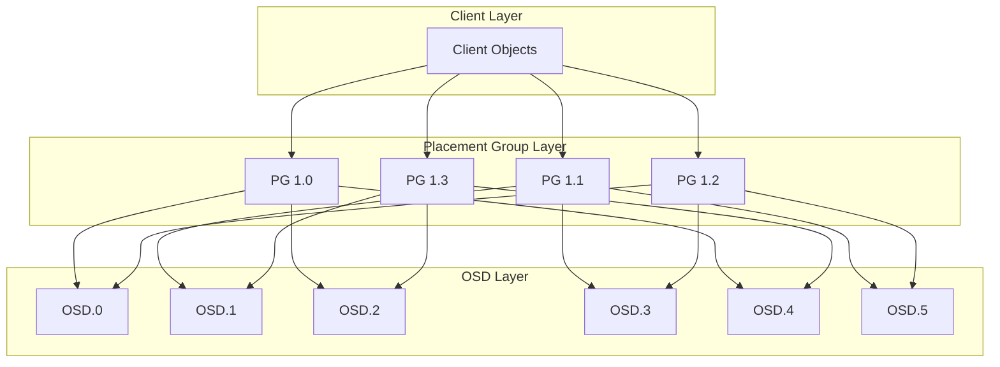
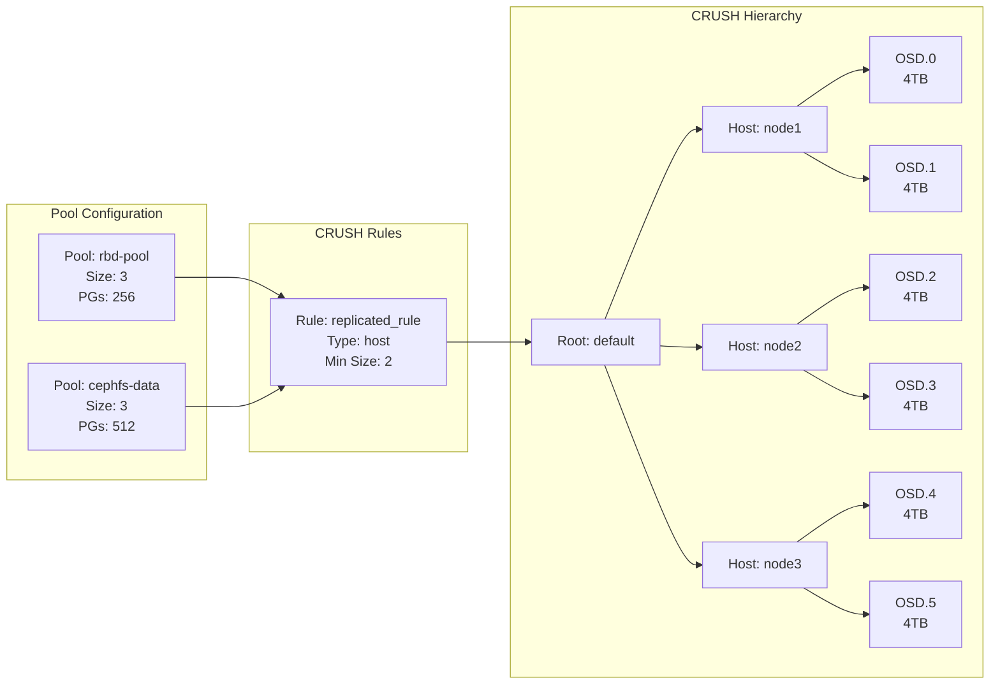
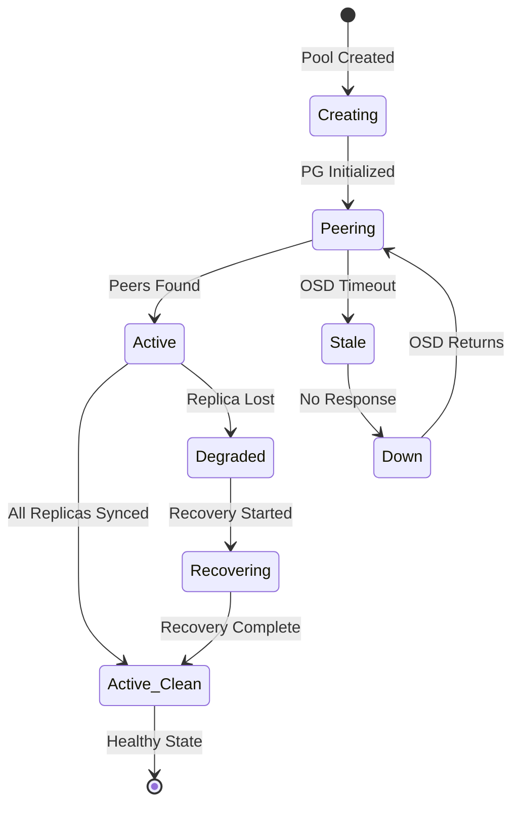
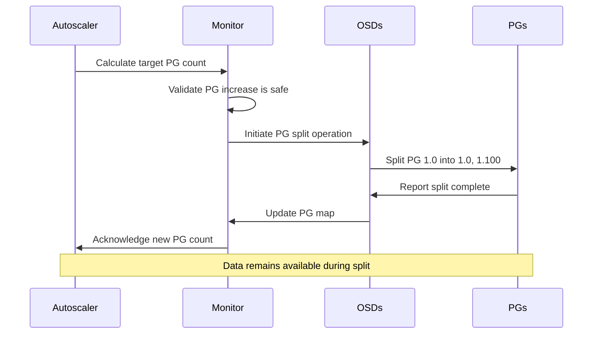

# How to Implement Ceph Placement Group Tuning

Author: [nawazdhandala](https://github.com/nawazdhandala)

Tags: Ceph, Storage, Performance, DistributedStorage

Description: Learn how to optimize Ceph cluster performance by properly tuning Placement Groups for balanced data distribution and improved throughput.

---

Placement Groups (PGs) are the fundamental building blocks of Ceph data distribution. They act as an intermediate layer between objects and OSDs (Object Storage Daemons), determining how data is spread across your cluster. Improper PG configuration can lead to unbalanced data distribution, degraded performance, and recovery issues. This guide covers everything you need to know about PG tuning.

## Understanding Placement Groups

Placement Groups aggregate objects into groups that get mapped to OSDs together. This reduces the metadata overhead that would occur if Ceph tracked each object individually. The CRUSH algorithm maps PGs to OSDs, providing a balance between efficiency and flexibility.



## PG Calculation Formulas

### Basic Formula

The recommended formula for calculating the total number of PGs for a pool is:

```
Total PGs = (Target PGs per OSD * Total OSDs * Pool Data Percentage) / Replication Factor
```

Then round up to the nearest power of 2.

### Recommended PG Counts

| Cluster Size | PGs per OSD | Notes |
|-------------|-------------|-------|
| Small (< 5 OSDs) | 128 | Minimum for testing |
| Medium (5-10 OSDs) | 128-256 | Production starting point |
| Large (10-50 OSDs) | 128-256 | Standard recommendation |
| Very Large (> 50 OSDs) | 100-200 | Lower to reduce memory overhead |

### Calculation Example

```bash
#!/bin/bash
# PG calculation script for Ceph pools

# Define cluster parameters
TOTAL_OSDS=24
REPLICATION_FACTOR=3
TARGET_PGS_PER_OSD=128
POOL_DATA_PERCENTAGE=0.25  # This pool will hold 25% of cluster data

# Calculate raw PG count
RAW_PGS=$(echo "($TARGET_PGS_PER_OSD * $TOTAL_OSDS * $POOL_DATA_PERCENTAGE) / $REPLICATION_FACTOR" | bc)

echo "Raw PG calculation: $RAW_PGS"

# Function to round up to nearest power of 2
round_to_power_of_2() {
    local n=$1
    local power=1
    while [ $power -lt $n ]; do
        power=$((power * 2))
    done
    echo $power
}

RECOMMENDED_PGS=$(round_to_power_of_2 $RAW_PGS)
echo "Recommended PG count (nearest power of 2): $RECOMMENDED_PGS"
```

Output:
```
Raw PG calculation: 256
Recommended PG count (nearest power of 2): 256
```

## Pool PG Autoscaler Configuration

The PG autoscaler automatically adjusts PG counts based on actual usage. This is the recommended approach for most deployments.

### Enabling the Autoscaler

```bash
# Enable the pg_autoscaler module
ceph mgr module enable pg_autoscaler

# Set autoscaler mode globally for all new pools
ceph config set global osd_pool_default_pg_autoscale_mode on

# View current autoscaler status
ceph osd pool autoscale-status
```

### Autoscaler Modes

```bash
# Set autoscaler mode for a specific pool
# Options: on, warn, off

# Enable automatic PG adjustment
ceph osd pool set mypool pg_autoscale_mode on

# Only warn about PG changes (manual intervention required)
ceph osd pool set mypool pg_autoscale_mode warn

# Disable autoscaler for this pool
ceph osd pool set mypool pg_autoscale_mode off
```

### Configuring Target Ratios

```bash
# Set the target ratio for how much of the cluster a pool should use
# This helps the autoscaler make better decisions
ceph osd pool set mypool target_size_ratio 0.3

# Alternatively, set an absolute target size
ceph osd pool set mypool target_size_bytes 1099511627776  # 1 TiB
```

### Autoscaler Tuning Parameters

```bash
# Set the target number of PGs per OSD (cluster-wide)
ceph config set global mon_target_pg_per_osd 128

# Set the autoscaler bias for a pool (higher = more PGs)
# Default is 1.0, range is 0.0 to infinity
ceph osd pool set mypool pg_autoscale_bias 2.0

# View detailed autoscaler decisions
ceph osd pool autoscale-status --format json-pretty
```

## PG Distribution Architecture



## PG Status Monitoring and Troubleshooting

### Essential Monitoring Commands

```bash
# Get overall PG statistics
ceph pg stat

# Example output:
# 768 pgs: 768 active+clean; 2.5 TiB data, 7.5 TiB used, 88 TiB / 96 TiB avail

# Detailed PG dump in JSON format
ceph pg dump --format json-pretty > pg_dump.json

# Show PGs by state
ceph pg ls-by-state active+clean
ceph pg ls-by-state degraded
ceph pg ls-by-state undersized

# Query a specific PG
ceph pg 1.2a query
```

### Understanding PG States

```bash
# Common PG states and their meanings:
# active+clean     - Normal, healthy state
# active+degraded  - Some replicas missing, but data accessible
# active+recovery  - Recovering missing replicas
# peering          - OSDs agreeing on PG state
# undersized       - Fewer replicas than configured
# stale            - OSD not reporting to monitors

# List all unhealthy PGs
ceph health detail | grep -i pg

# Find stuck PGs
ceph pg dump_stuck inactive
ceph pg dump_stuck unclean
ceph pg dump_stuck stale
```

### PG State Flow Diagram



### Monitoring Script

```bash
#!/bin/bash
# PG health monitoring script

echo "=== Ceph PG Health Report ==="
echo "Generated: $(date)"
echo ""

# Overall cluster health
echo "--- Cluster Health ---"
ceph health

# PG statistics
echo ""
echo "--- PG Statistics ---"
ceph pg stat

# Count PGs by state
echo ""
echo "--- PG State Distribution ---"
ceph pg dump 2>/dev/null | awk '/^[0-9]/ {print $10}' | sort | uniq -c | sort -rn

# Check for any degraded or recovering PGs
DEGRADED=$(ceph pg ls-by-state degraded 2>/dev/null | wc -l)
RECOVERING=$(ceph pg ls-by-state recovering 2>/dev/null | wc -l)

echo ""
echo "--- Health Indicators ---"
echo "Degraded PGs: $DEGRADED"
echo "Recovering PGs: $RECOVERING"

# PG distribution per OSD
echo ""
echo "--- PGs per OSD ---"
ceph osd df tree | head -20

# Autoscaler status
echo ""
echo "--- Autoscaler Status ---"
ceph osd pool autoscale-status
```

### Troubleshooting Common Issues

```bash
# Issue: Too many PGs per OSD (mon_max_pg_per_osd exceeded)
# Solution: Reduce PGs or add more OSDs
ceph config set global mon_max_pg_per_osd 300

# Issue: PGs stuck in peering
# Check which OSDs are involved
ceph pg 1.2a query | jq '.peer_info'

# Force recovery of a stuck PG
ceph pg force_recovery 1.2a

# Issue: PG not scrubbing
# Initiate deep scrub manually
ceph pg deep-scrub 1.2a

# Issue: High PG count causing memory issues
# Monitor OSD memory usage
ceph tell osd.* heap stats
```

## Balancing PGs Across OSDs

### Checking Current Distribution

```bash
# View PG distribution across OSDs
ceph osd df tree

# Example output:
# ID  CLASS  WEIGHT   REWEIGHT  SIZE    RAW USE  DATA     OMAP    META     AVAIL    %USE   VAR   PGS  STATUS
#  0   hdd  3.63670   1.00000  3.6 TiB   1.2 TiB  1.1 TiB  10 MiB  1.1 GiB  2.4 TiB  33.24  1.02  128      up
#  1   hdd  3.63670   1.00000  3.6 TiB   1.3 TiB  1.2 TiB  12 MiB  1.2 GiB  2.3 TiB  35.88  1.10  142      up

# Get variance statistics
ceph osd df tree | tail -1
# Look for VAR (variance) - values close to 1.0 indicate good balance
```

### Using the Balancer Module

```bash
# Enable the balancer module
ceph mgr module enable balancer

# Set balancer mode
# Options: none, crush-compat, upmap, read (for read affinity)
ceph balancer mode upmap

# Enable automatic balancing
ceph balancer on

# View current balance score (lower is better)
ceph balancer status

# Example output:
# {
#     "active": true,
#     "mode": "upmap",
#     "plans": [],
#     "last_optimize_duration": "0.123456",
#     "last_optimize_started": "2026-01-30T10:00:00.000000+0000",
#     "optimize_result": ""
# }
```

### Manual Balancing Operations

```bash
# Generate an optimization plan without applying
ceph balancer optimize myplan

# View the proposed changes
ceph balancer show myplan

# Execute the optimization plan
ceph balancer execute myplan

# Alternatively, evaluate what the balancer would do
ceph balancer eval
```

### OSD Reweight for Fine Tuning

```bash
# Adjust OSD reweight to shift data away from overloaded OSDs
# Values range from 0.0 (no data) to 1.0 (full weight)
ceph osd reweight 5 0.9

# Use reweight-by-utilization for automatic adjustment
# This reweights OSDs based on their current utilization
ceph osd reweight-by-utilization

# Test what changes would be made without applying
ceph osd test-reweight-by-utilization

# Set thresholds for reweight-by-utilization
# Default: starts adjusting at 120% of average usage
ceph osd reweight-by-utilization 110
```

### CRUSH Weight Adjustments

```bash
# View current CRUSH weights
ceph osd crush tree

# Adjust CRUSH weight (for permanent changes based on disk size)
ceph osd crush reweight osd.5 3.5

# The CRUSH weight should generally match the OSD capacity in TiB
# For a 4TB drive, use weight 3.63 (actual usable capacity)
```

## Advanced PG Tuning

### Per-Pool PG Optimization

```bash
#!/bin/bash
# Script to optimize PG count for specific pool types

# Function to set optimal PG count
optimize_pool_pgs() {
    local pool_name=$1
    local pool_type=$2
    local total_osds=$(ceph osd ls | wc -l)

    case $pool_type in
        "rbd")
            # RBD pools typically need more PGs for better distribution
            local target_ratio=0.4
            ;;
        "cephfs_data")
            # CephFS data pools vary based on file count
            local target_ratio=0.3
            ;;
        "cephfs_metadata")
            # Metadata pools are smaller but need low latency
            local target_ratio=0.1
            ;;
        "rgw")
            # RGW pools need balanced PG distribution
            local target_ratio=0.2
            ;;
        *)
            local target_ratio=0.2
            ;;
    esac

    echo "Setting target_size_ratio for $pool_name to $target_ratio"
    ceph osd pool set $pool_name target_size_ratio $target_ratio
    ceph osd pool set $pool_name pg_autoscale_mode on
}

# Apply optimizations
optimize_pool_pgs "rbd-pool" "rbd"
optimize_pool_pgs "cephfs.data" "cephfs_data"
optimize_pool_pgs "cephfs.metadata" "cephfs_metadata"
```

### Monitoring PG Split and Merge Operations



### Performance Tuning Parameters

```bash
# Increase PG log size for write-heavy workloads
ceph config set osd osd_min_pg_log_entries 3000
ceph config set osd osd_max_pg_log_entries 10000

# Tune recovery parameters to balance performance and recovery speed
ceph config set osd osd_recovery_max_active 3
ceph config set osd osd_recovery_sleep 0.5

# Set PG scrub parameters
ceph config set osd osd_scrub_begin_hour 22
ceph config set osd osd_scrub_end_hour 6
ceph config set osd osd_deep_scrub_interval 604800  # Weekly

# Tune PG peering parameters for large clusters
ceph config set osd osd_max_pg_per_osd_hard_ratio 3
```

## Best Practices Summary

1. **Start with the autoscaler**: Use `pg_autoscale_mode on` for most pools and let Ceph manage PG counts automatically.

2. **Set target ratios**: Help the autoscaler by setting `target_size_ratio` for each pool based on expected data distribution.

3. **Monitor variance**: Keep PG distribution variance (VAR) close to 1.0 across all OSDs.

4. **Plan for growth**: When manually setting PGs, account for future cluster expansion. PG count increases can cause temporary performance degradation.

5. **Avoid extremes**: Too few PGs cause uneven distribution; too many waste memory and slow recovery.

6. **Use the balancer**: Enable the upmap balancer for fine-grained PG distribution without data movement.

7. **Regular monitoring**: Set up alerts for degraded PGs and high variance in OSD utilization.

```bash
# Quick health check command for daily monitoring
ceph health detail && ceph osd df tree && ceph osd pool autoscale-status
```

By following these guidelines and regularly monitoring your PG distribution, you can maintain optimal Ceph cluster performance and ensure reliable data storage operations.
