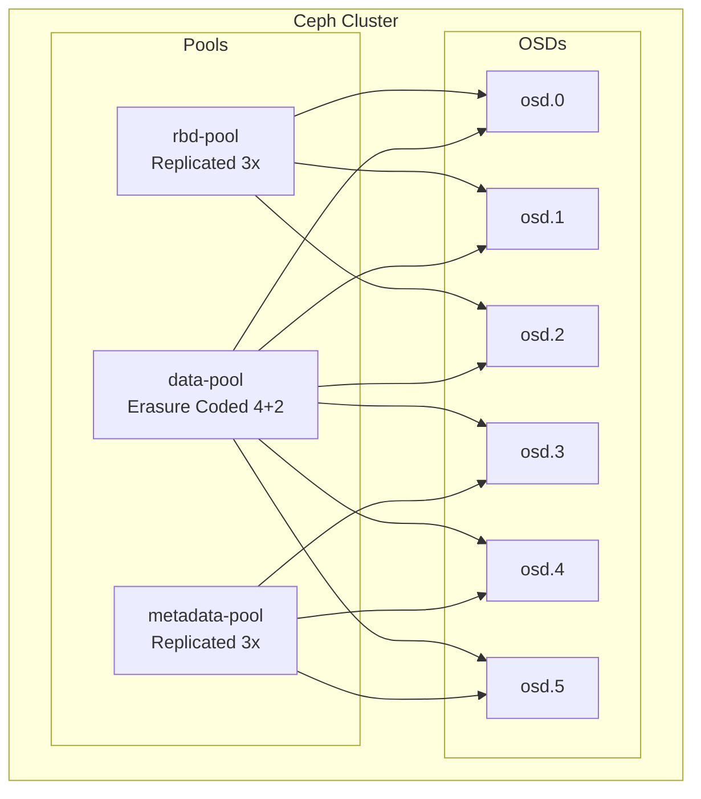
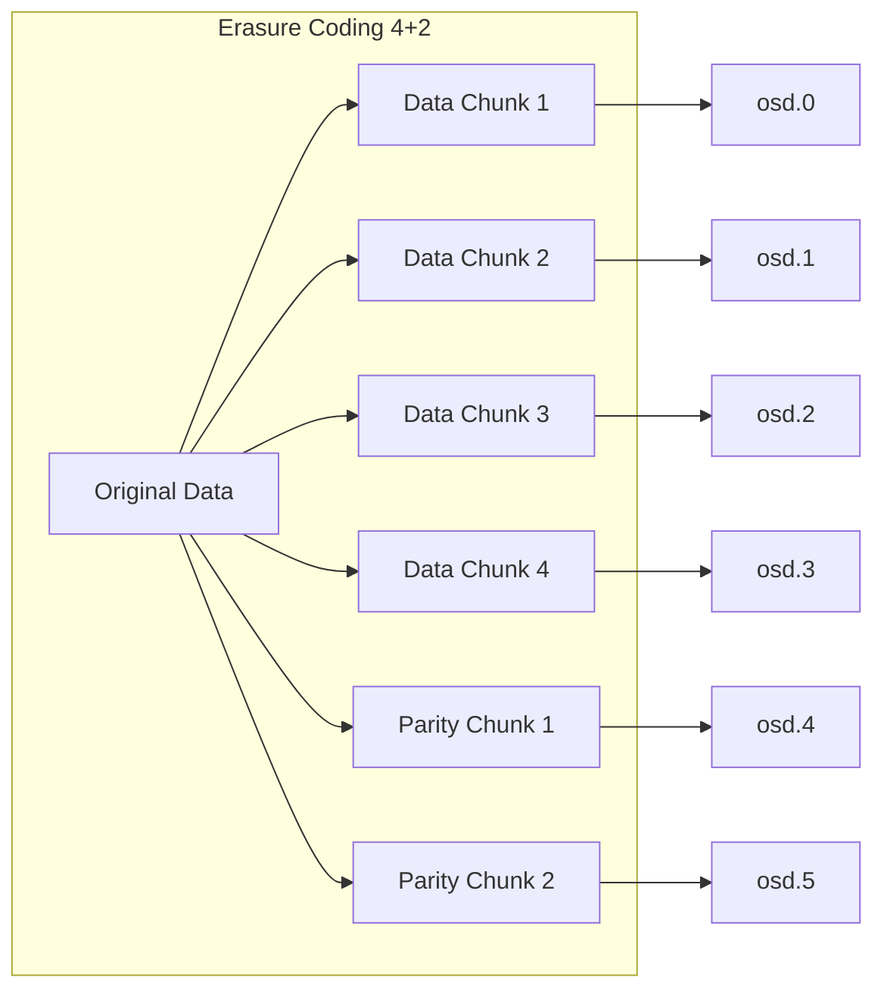

# How to Build Ceph Pool Configuration

Author: [nawazdhandala](https://www.github.com/nawazdhandala)

Tags: Ceph, Storage, Kubernetes, Infrastructure, Distributed Storage

Description: Configure Ceph storage pools with replication, erasure coding, and CRUSH rules for optimized distributed storage performance.

---

Ceph pools are the foundation of data storage in a Ceph cluster. They act as logical partitions that define how data is stored, replicated, and distributed across your storage infrastructure. Whether you are running a small home lab or a multi-petabyte production environment, understanding pool configuration is essential for getting the most out of your Ceph deployment.

In this guide, we will walk through creating and configuring Ceph pools for different use cases, covering replication, erasure coding, and advanced CRUSH rule integration.

## Understanding Ceph Pools

A Ceph pool is essentially a logical container for storing objects. Each pool has its own set of configuration parameters that control data placement, replication, and access patterns.



### Key Pool Parameters

Before creating pools, you should understand the key parameters that affect performance and reliability:

| Parameter | Description | Impact |
|-----------|-------------|--------|
| `pg_num` | Number of placement groups | Data distribution granularity |
| `size` | Number of replicas | Fault tolerance and storage overhead |
| `min_size` | Minimum replicas for I/O | Availability during failures |
| `crush_rule` | CRUSH placement rule | Physical data placement |

## Creating a Replicated Pool

Replicated pools store multiple copies of each object across different OSDs. This is the simplest and most common pool type.

The following commands create a basic replicated pool with sensible defaults:

```bash
# Create a replicated pool named "rbd-pool"
# 128 placement groups is a good starting point for small to medium clusters
ceph osd pool create rbd-pool 128 128

# Set the replication factor to 3 (store 3 copies of each object)
# This provides tolerance for 2 simultaneous OSD failures
ceph osd pool set rbd-pool size 3

# Set minimum replicas required for write operations
# Setting min_size to 2 means writes will fail if fewer than 2 replicas are available
ceph osd pool set rbd-pool min_size 2

# Enable the RBD application for this pool
# This tells Ceph how the pool will be used
ceph osd pool application enable rbd-pool rbd
```

### Verifying Pool Configuration

After creating a pool, always verify the configuration:

```bash
# Display detailed pool information
ceph osd pool get rbd-pool all

# Check the pool statistics
ceph osd pool stats rbd-pool

# List all pools with their configuration
ceph osd pool ls detail
```

## Calculating Placement Groups

The number of placement groups (PGs) directly affects data distribution and cluster performance. Too few PGs lead to uneven data distribution, while too many consume excessive memory.

The following formula helps calculate the optimal PG count:

```bash
# Formula: (Target PGs per OSD * Number of OSDs * Data Percentage) / Replica Count
# Recommended: 100-200 PGs per OSD

# For a cluster with 12 OSDs and 3-way replication:
# (100 * 12 * 1.0) / 3 = 400 PGs
# Round up to nearest power of 2: 512 PGs

# Create pool with calculated PG count
ceph osd pool create production-pool 512 512
```

For modern Ceph clusters, you can enable PG autoscaling to let Ceph manage this automatically:

```bash
# Enable PG autoscaling for a pool
ceph osd pool set production-pool pg_autoscale_mode on

# Check current autoscale status
ceph osd pool autoscale-status
```

## Configuring Erasure Coded Pools

Erasure coding provides better storage efficiency than replication at the cost of slightly higher CPU usage. It works by splitting data into fragments and adding parity chunks for redundancy.



The following commands create an erasure coded pool:

```bash
# Create an erasure code profile
# k=4: 4 data chunks, m=2: 2 parity chunks
# This gives 1.5x storage overhead vs 3x for 3-way replication
ceph osd erasure-code-profile set ec-4-2-profile \
    k=4 \
    m=2 \
    crush-failure-domain=host \
    crush-root=default

# View the profile details
ceph osd erasure-code-profile get ec-4-2-profile

# Create the erasure coded pool using this profile
# Note: EC pools require k+m PGs minimum, but more is better for distribution
ceph osd pool create ec-data-pool 256 256 erasure ec-4-2-profile

# Enable RGW application for object storage use
ceph osd pool application enable ec-data-pool rgw
```

### Erasure Coding Profiles Comparison

Different profiles suit different use cases:

| Profile | Data Chunks (k) | Parity (m) | Storage Overhead | Fault Tolerance |
|---------|-----------------|------------|------------------|-----------------|
| ec-2-1 | 2 | 1 | 1.5x | 1 failure |
| ec-4-2 | 4 | 2 | 1.5x | 2 failures |
| ec-8-3 | 8 | 3 | 1.375x | 3 failures |
| ec-8-4 | 8 | 4 | 1.5x | 4 failures |

## Assigning CRUSH Rules to Pools

CRUSH rules control how Ceph places data across your physical infrastructure. You can create custom rules and assign them to pools for fine-grained control.

```bash
# List available CRUSH rules
ceph osd crush rule ls

# Create a rule that distributes replicas across different racks
ceph osd crush rule create-replicated rack-rule default rack

# Apply the new rule to your pool
ceph osd pool set production-pool crush_rule rack-rule

# Verify the rule assignment
ceph osd pool get production-pool crush_rule
```

### Device Class Rules

If your cluster has mixed storage media (SSD and HDD), you can create rules that target specific device classes:

```bash
# Create a rule that only uses SSD devices
ceph osd crush rule create-replicated ssd-rule default host ssd

# Create a rule that only uses HDD devices
ceph osd crush rule create-replicated hdd-rule default host hdd

# Create high-performance pool on SSDs
ceph osd pool create fast-pool 128 128
ceph osd pool set fast-pool crush_rule ssd-rule
ceph osd pool set fast-pool size 3

# Create capacity pool on HDDs
ceph osd pool create archive-pool 256 256
ceph osd pool set archive-pool crush_rule hdd-rule
ceph osd pool set archive-pool size 3
```

## Pool Quotas and Limits

Setting quotas prevents any single pool from consuming all available storage:

```bash
# Set a maximum size quota of 500GB for a pool
ceph osd pool set-quota mypool max_bytes 536870912000

# Set a maximum object count quota
ceph osd pool set-quota mypool max_objects 1000000

# Remove quotas
ceph osd pool set-quota mypool max_bytes 0
ceph osd pool set-quota mypool max_objects 0

# Check current quota usage
ceph df detail
```

## Pool Snapshots

Ceph supports pool-level snapshots for point-in-time recovery:

```bash
# Create a snapshot of a pool
ceph osd pool mksnap mypool snapshot-2026-01-30

# List snapshots for a pool
ceph osd pool lssnap mypool

# Remove a snapshot
ceph osd pool rmsnap mypool snapshot-2026-01-30
```

## Compression and Performance Tuning

Ceph supports transparent compression for pools, which can significantly reduce storage usage:

```bash
# Enable compression on a pool
ceph osd pool set mypool compression_algorithm zstd
ceph osd pool set mypool compression_mode aggressive

# Compression modes:
# none - no compression
# passive - compress only if client requests it
# aggressive - compress all data
# force - compress everything, including already compressed data

# Set compression ratio hint (optional)
ceph osd pool set mypool compression_required_ratio 0.875

# Check compression statistics
ceph osd pool get mypool compression_algorithm
ceph osd pool get mypool compression_mode
```

## Complete Pool Configuration Example

Here is a complete example that sets up pools for a production Kubernetes environment:

```bash
#!/bin/bash
# Production Ceph Pool Configuration Script
# Creates pools optimized for Kubernetes workloads

set -e

echo "Creating Ceph pools for Kubernetes..."

# RBD pool for persistent volumes (high performance, SSD)
ceph osd pool create kubernetes-rbd 256 256
ceph osd pool set kubernetes-rbd size 3
ceph osd pool set kubernetes-rbd min_size 2
ceph osd pool set kubernetes-rbd pg_autoscale_mode on
ceph osd pool set kubernetes-rbd compression_algorithm lz4
ceph osd pool set kubernetes-rbd compression_mode passive
ceph osd pool application enable kubernetes-rbd rbd

# CephFS metadata pool (small but critical, needs fast storage)
ceph osd pool create cephfs-metadata 64 64
ceph osd pool set cephfs-metadata size 3
ceph osd pool set cephfs-metadata min_size 2
ceph osd pool application enable cephfs-metadata cephfs

# CephFS data pool (bulk storage, erasure coded)
ceph osd erasure-code-profile set k8s-ec-profile k=4 m=2 crush-failure-domain=host
ceph osd pool create cephfs-data 256 256 erasure k8s-ec-profile
ceph osd pool set cephfs-data allow_ec_overwrites true
ceph osd pool application enable cephfs-data cephfs

# Object storage pool for S3-compatible storage
ceph osd pool create rgw-data 512 512 erasure k8s-ec-profile
ceph osd pool application enable rgw-data rgw

echo "Pool configuration complete!"

# Display final configuration
ceph osd pool ls detail
```

## Monitoring Pool Health

Regularly monitor your pools to catch issues early:

```bash
# Check overall pool status
ceph df

# Detailed pool statistics
ceph osd pool stats

# Check for any degraded or misplaced objects
ceph health detail

# Monitor I/O performance per pool
ceph osd pool stats mypool
```

## Summary

Ceph pool configuration involves balancing several factors: fault tolerance, storage efficiency, performance, and operational complexity. Here are the key takeaways:

1. **Start with replicated pools** for simplicity. Move to erasure coding when you need better storage efficiency for larger datasets.

2. **Right-size your placement groups** using the formula or enable autoscaling to let Ceph handle it.

3. **Use CRUSH rules** to control data placement across your physical infrastructure and device types.

4. **Set appropriate quotas** to prevent any single pool from monopolizing storage.

5. **Enable compression** for pools with compressible data to reduce storage costs.

With these fundamentals in place, you have a solid foundation for building a reliable Ceph storage infrastructure that can scale from a small cluster to enterprise-grade deployments.
